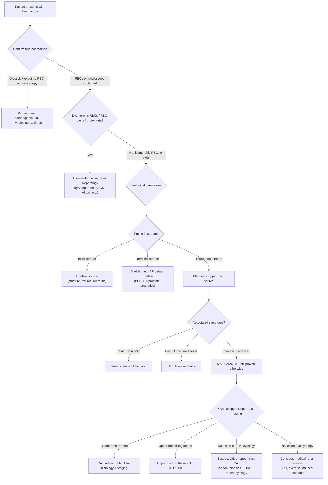

## Differential Diagnosis of Bladder Cancer

The differential diagnosis (DDx) of bladder cancer is really the differential diagnosis of its **cardinal presenting symptom — haematuria** — plus the DDx of its secondary presentations (LUTS, pelvic pain). The clinical approach is: a patient walks in with haematuria → you must systematically consider all possible causes, determine the most likely diagnosis, and then investigate accordingly.

The guiding principle is straightforward: ***painless gross haematuria in > 35 years old = malignancy until proven otherwise*** [3][5]. But you still need to think broadly before narrowing down.

---

### Conceptual Framework: Anatomical Approach to Haematuria

The most logical way to build a DDx for haematuria is to walk along the urinary tract from the kidney down to the urethra, asking: "What at each level could bleed?"

Additionally, you must distinguish between:
- **Glomerular haematuria** (medical/nephrological) — dysmorphic RBCs, RBC casts, proteinuria, smoky brown "Coca-Cola" urine without clots
- **Non-glomerular / urological haematuria** — isomorphic (normal-shaped) RBCs, may have clots (urokinase in glomerular filtrate normally prevents clot formation, so clots suggest a post-glomerular source), bright red blood [2][5][6]

<Callout title="Why No Clots in Glomerular Bleeding?">
Urokinase is present in the glomerular filtrate and dissolves fibrin. So blood that passes through the glomerulus cannot form clots. If a patient passes blood **clots**, the bleeding source is urological (post-glomerular) — stone, tumour, infection, trauma. This is a simple but powerful bedside discriminator.
</Callout>

---

### Comprehensive DDx of Haematuria (Organised Anatomically) [5][6][7]

| Anatomical Location | Category | Differential Diagnosis | Key Distinguishing Features |
|:---------------------|:---------|:----------------------|:---------------------------|
| **Kidney — Glomerular** | Glomerulonephritis (GN) | IgA nephropathy, post-infectious GN, Alport syndrome, thin basement membrane disease, lupus nephritis, ANCA vasculitis (GPA, MPA), Goodpasture syndrome | Smoky brown urine without clots, dysmorphic RBCs / RBC casts on microscopy, concomitant proteinuria, features of nephritic syndrome (HTN, oedema, oliguria), systemic signs (rash, purpura, haemoptysis) [5][6] |
| **Kidney — Tubular / Parenchymal** | Polycystic kidney disease | | Bilateral flank masses, insidious HTN, family history (autosomal dominant) [5][6] |
| | Pyelonephritis | | High fever, rigors, vomiting, loin pain and tenderness [5][6] |
| | Renal infarction | | Acute loin pain, risk factors for embolism (AF, endocarditis), raised LDH [5][6] |
| | Renal vein thrombosis | | Loin pain, nephrotic syndrome, risk factors (nephrotic syndrome, malignancy) |
| | **Renal cell carcinoma (RCC)** | | Classic triad (rare): flank pain, painless haematuria, palpable flank mass; constitutional symptoms; paraneoplastic phenomena (HTN, hypercalcaemia, polycythaemia); left varicocele (left renal vein obstruction) [5][6] |
| | Renal pelvis urothelial carcinoma | | Haematuria, obstructive flank pain (20–40%), field cancerization with bladder CA [3] |
| | AV malformation | | Intermittent painless haematuria, young patient, may have bruit |
| **Ureter** | Ureteric stone | | Unilateral flank **colic** radiating to groin (classic renal colic), nausea/vomiting, restlessness [5][6] |
| | Upper tract urothelial carcinoma | | Haematuria + obstructive flank pain; field cancerization concept [1][3] |
| **Bladder** | ***CA bladder*** | | ***Painless gross haematuria throughout stream; irritative LUTS (esp CIS); constitutional symptoms if advanced*** [1][2][3] |
| | Bladder stones | | Irritative LUTS + suprapubic pain worsened by movement; interruption of urinary stream (stone intermittently blocks bladder neck) [5][6] |
| | UTI / Cystitis | | Dysuria, frequency, urgency, suprapubic discomfort, foul-smelling/cloudy urine, fever; positive MSU culture [5][6] |
| | Non-infectious cystitis | Radiation cystitis, cyclophosphamide cystitis, ketamine cystitis | History of pelvic RT, cyclophosphamide/ifosfamide use, or ketamine abuse [5][6][7] |
| | Interstitial cystitis | | Chronic pelvic pain, frequency, urgency; diagnosis of exclusion; more common in females |
| **Prostate** | BPH | | Advanced age male, predominantly **obstructive** LUTS (hesitancy, weak stream, straining, dribbling, incomplete emptying); diagnosis by exclusion (presence of BPH should NOT dissuade from further haematuria workup) [5][6][7] |
| | CA prostate | | Obstructive LUTS, hard irregular prostate on DRE, elevated PSA, bone pain if metastatic [5][6] |
| | Prostatitis | | Perineal pain, dysuria, fever, tender prostate on DRE |
| **Urethra** | Urethral stricture | | History of urological instrumentation, STI (gonococcal urethritis), poor stream |
| | Urethral trauma | | History of catheterisation, straddle injury, pelvic fracture |
| **Systemic / Other** | Bleeding diathesis | Anticoagulant/antiplatelet therapy, coagulopathy, thrombocytopenia | Seldom causes haematuria on its own — 81% have an underlying urinary cause [5][6]; bruising, bleeding gums, epistaxis |
| | Exercise-induced haematuria | | Transient, after strenuous exercise, resolves with rest; diagnosis of exclusion [5][6] |
| | Benign idiopathic haematuria | | May be associated with exercise, febrile illness, vaccination; may be familial; diagnosis of exclusion [5][6] |
| | Menstrual contamination | | Must rule out by repeating urinalysis after menses; cyclic haematuria during menses → consider urinary tract endometriosis [7] |
| | Pigmenturia (not true haematuria) | Haemoglobinuria, myoglobinuria, beetroot, rifampicin | Dipstick positive for "blood" but no RBCs on microscopy (dipstick detects haem, not RBCs specifically) |

> **High Yield:** The causes of haematuria by frequency in a urological workup: UTI (13%), ***CA bladder (12%)***, medical renal disease (10%), stone disease (4%), RCC (0.6%), CA prostate (0.4%) [3]. Bladder cancer is the **second most common cause** of haematuria in a urological setting and the **most common cause of gross haematuria in patients > 50 years old** [5].

---

### DDx of LUTS in the Context of Bladder Cancer [7]

Bladder cancer can present with **irritative LUTS** (especially CIS) or **obstructive LUTS** (if the tumour obstructs the bladder neck or ureteric orifice). You must differentiate from other causes:

| LUTS Pattern | DDx | Key Distinguishing Feature |
|:-------------|:----|:--------------------------|
| **Irritative (storage)** — frequency, urgency, nocturia | CA bladder (esp CIS), UTI/cystitis, bladder stones, ketamine cystitis, interstitial cystitis, overactive bladder (neurogenic or idiopathic), radiation cystitis | CIS: elderly + risk factors + refractory to antibiotics; UTI: dysuria + positive culture; Bladder stone: pain with movement; OAB: diagnosis of exclusion [7] |
| **Obstructive (voiding)** — hesitancy, weak stream, straining, dribbling | BPH, CA prostate, urethral stricture, bladder neck contracture, CA bladder (large tumour at bladder neck) | BPH: symmetrically enlarged smooth prostate on DRE; CA prostate: hard irregular prostate + elevated PSA; Stricture: history of instrumentation/STI [7] |

<Callout title="Important Exam Point" type="error">
**New-onset irritative LUTS in an elderly patient that does NOT respond to antibiotics** → must consider CIS of the bladder. Do NOT keep prescribing antibiotics for "recurrent UTIs" without a cystoscopy in an at-risk patient (male, > 40, smoker). CIS is flat, high-grade, and easily missed on standard imaging — it requires cystoscopy (± fluorescence/NBI) for detection [1][3].
</Callout>

---

### DDx of Bladder Mass (Found on Imaging or Cystoscopy)

If a mass is identified in the bladder (e.g., on CT urogram or cystoscopy), the DDx includes:

| Category | Diagnosis | Distinguishing Features |
|:---------|:----------|:-----------------------|
| **Primary malignant** | Urothelial carcinoma (90%) | Most common; papillary or sessile; field cancerization |
| | Squamous cell carcinoma | History of chronic irritation / schistosomiasis; keratinising on biopsy |
| | Adenocarcinoma | Urachal remnant (dome location); must exclude secondary (colorectal, prostate) |
| | ***Small cell carcinoma*** | ***Rare but very aggressive*** [4]; neuroendocrine markers on IHC |
| | ***Sarcomatoid carcinoma*** | ***Aggressive, poor prognosis*** [4]; biphasic on histology |
| | Non-epithelial (sarcoma, lymphoma, melanoma, paraganglioma) | Very rare; specific histological/IHC features [3] |
| **Secondary malignant** | Direct invasion from colon, rectum, prostate, uterine cervix [3] | History of known primary malignancy; imaging shows contiguous invasion |
| | Metastatic (melanoma, stomach, breast) | Very rare; history of distant primary |
| **Benign** | Urothelial papilloma / inverted papilloma | Small, typically solitary, regular papillary architecture; benign histology |
| | Nephrogenic adenoma | History of prior bladder surgery/trauma/infection; benign but mimics carcinoma |
| | Cystitis cystica / cystitis glandularis | Chronic inflammatory change; benign but can mimic tumour |
| | Endometriosis | Female, cyclic symptoms, submucosal bluish nodule on cystoscopy |
| | Blood clot | History of recent haematuria; mobile, no vascular pattern; resolves |
| | Foreign body | History of self-insertion or iatrogenic (retained catheter fragment, surgical material) |

---

### Clinical Approach to Differentiating Bladder Cancer from Other Causes — Decision Flowchart

### Key Discriminating Features in History

| Feature | Points Toward Bladder Cancer | Points Away from Bladder Cancer |
|:--------|:----------------------------|:-------------------------------|
| **Age** | > 40 years, elderly | Young (< 40 → think GN, stone, UTI) |
| **Sex** | Male (M:F = 3:1) | — |
| **Haematuria character** | Painless, gross, throughout stream, intermittent | Painful → stone, UTI; initial → urethra; terminal → prostate/bladder neck; smoky brown without clots → GN |
| **Blood clots** | Present (urological source) | Absent with dysmorphic RBCs → GN |
| **LUTS** | Irritative (esp. refractory to Abx → CIS) | Obstructive only → BPH/CA prostate |
| **Smoking / occupational exposure** | Strong risk factor | — |
| **Cyclophosphamide / aristolochic acid** | Strong risk factor | — |
| **Recent URTI** | Less likely bladder CA | IgA nephropathy (synpharyngitic haematuria) |
| **Systemic features** | Constitutional Sx → advanced CA | Rash/arthralgia → SLE/vasculitis; haemoptysis → pulmonary-renal syndrome |
| **Response to antibiotics** | No response (CIS mimics UTI) | Resolves → likely UTI |

---

### Red Flags Mandating Urgent Urological Referral [5][6]

Any of the following in a patient with haematuria should prompt **urgent cystoscopy and upper tract imaging**:

- ***Age > 40 with any unexplained haematuria (gross or microscopic)***
- ***Painless gross haematuria at any age***
- ***Visible haematuria with risk factors for malignancy*** (smoking, occupational exposure, cyclophosphamide, aristolochic acid, pelvic RT, chronic catheter) [5]
- Persistent microscopic haematuria (≥ 3 RBC/HPF on ≥ 2 out of 3 properly collected samples) after exclusion of benign causes
- Recurrent UTIs in a male or post-menopausal female (must exclude underlying malignancy)
- New-onset irritative LUTS refractory to treatment in an at-risk patient

<Callout title="Common Exam Mistake" type="error">
**Presence of BPH should NOT dissuade from further evaluation of haematuria** — older men with BPH are also at risk for bladder cancer, RCC, and other urological malignancies. Always investigate haematuria fully even if BPH is present [7].
</Callout>

---

<Callout title="High Yield Summary">

**The DDx of bladder cancer is essentially the DDx of haematuria**, organized anatomically from kidney to urethra plus systemic causes.

**Most common cause of haematuria overall**: UTI (13%). **Most worrying**: malignancy (CA bladder 12%, RCC 0.6%) [2][3].

**Most common cause of gross haematuria in patients > 50**: bladder cancer [5].

**Key discriminators**:
- Glomerular vs urological: dysmorphic RBCs/casts/proteinuria = glomerular; isomorphic RBCs ± clots = urological
- Painless = malignancy until proven otherwise; painful = stone, UTI, infarction
- Throughout stream = bladder/upper tract; initial = urethra; terminal = bladder neck/prostate
- Blood clots = urological (urokinase in glomerular filtrate prevents clots in GN)
- Irritative LUTS refractory to antibiotics in elderly = CIS until proven otherwise

**DDx of bladder mass**: Primary malignant (urothelial 90%, SCC, adeno, small cell, sarcomatoid), secondary malignant (colon, rectum, prostate, cervix), benign (papilloma, nephrogenic adenoma, cystitis cystica, endometriosis, blood clot)

**BPH does NOT exclude malignancy** — always investigate haematuria fully even if BPH is present.

</Callout>

---

<ActiveRecallQuiz
  title="Active Recall - Bladder Cancer DDx"
  items={[
    {
      question: "A 55-year-old male smoker presents with painless gross haematuria with blood clots throughout the stream. Why do blood clots suggest a urological rather than glomerular source?",
      markscheme: "Urokinase present in the glomerular filtrate dissolves fibrin, preventing clot formation in glomerular bleeding. Blood clots therefore indicate a post-glomerular (urological) source of bleeding — stone, tumour, infection, or trauma."
    },
    {
      question: "List the frequency of causes of haematuria in a urological workup setting. What is the most common cause of gross haematuria in patients over 50?",
      markscheme: "UTI 13%, CA bladder 12%, medical renal disease 10%, stone disease 4%, RCC 0.6%, CA prostate 0.4%. Most common cause of gross haematuria in patients over 50 is bladder cancer."
    },
    {
      question: "A 72-year-old woman presents with frequency, urgency, and nocturia that have not responded to three courses of antibiotics. Urine culture is negative. What diagnosis should you suspect and why?",
      markscheme: "Carcinoma in situ (CIS) of the bladder. CIS is a flat, high-grade urothelial neoplasm that irritates the bladder mucosa causing irritative LUTS mimicking UTI or overactive bladder. It does not respond to antibiotics. Diagnosis requires cystoscopy with random biopsies and urine cytology."
    },
    {
      question: "How do you differentiate glomerular from urological haematuria on urinalysis and microscopy? Name 3 features for each.",
      markscheme: "Glomerular: (1) dysmorphic RBCs especially acanthocytes, (2) RBC casts, (3) concomitant proteinuria. Also smoky brown colour without clots. Urological: (1) isomorphic RBCs, (2) blood clots may be present, (3) no significant proteinuria. Also bright red blood."
    },
    {
      question: "A patient with known BPH presents with haematuria. Should you attribute the haematuria to BPH? Justify your answer.",
      markscheme: "No. Presence of BPH should NOT dissuade from further evaluation of haematuria. Older men with BPH are also at risk for bladder cancer, RCC, and other urological malignancies. Always investigate haematuria fully with cystoscopy and upper tract imaging even if BPH is present. BPH-related haematuria is a diagnosis of exclusion."
    }
  ]}
/>

## References

[1] Senior notes: felixlai.md (Urothelial bladder cancer section)
[2] Senior notes: maxim.md (Bladder cancer section; Haematuria section)
[3] Senior notes: Ryan Ho Urogenital.pdf (Section 7.4 / 7.4.1 Bladder Cancer, pp. 152–155; Section 7.1 Approach to Haematuria, pp. 130–132)
[4] Lecture slides: GC 183. Common urological malignancies and their presentations - Nov 7.pdf (pp. 8, 21)
[5] Senior notes: Ryan Ho Fundamentals.pdf (Haematuria approach, pp. 340–345)
[6] Senior notes: Ryan Ho Urogenital.pdf (Section 7.1 Approach to Haematuria, p. 130)
[7] Senior notes: felixlai.md (Differential diagnosis of haematuria section; Differential diagnosis of LUTS section)
