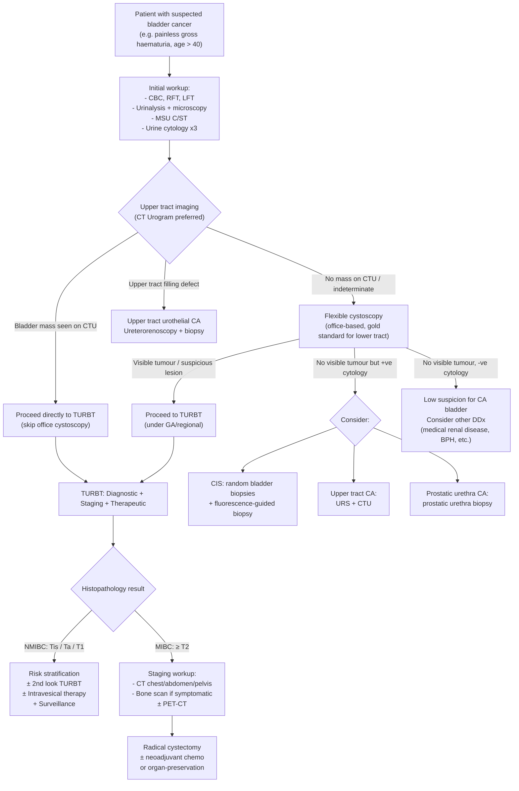

## Diagnostic Criteria, Algorithm, and Investigations for Bladder Cancer

### Key Principle: There Is No Single "Diagnostic Criterion" — Diagnosis Is Histopathological

Unlike some conditions that have formal diagnostic criteria (e.g., Duke criteria for endocarditis, Jones criteria for rheumatic fever), bladder cancer is diagnosed by **histopathological examination of tissue obtained at cystoscopy + biopsy/TURBT**. There is no blood test, imaging feature, or clinical criterion that alone confirms the diagnosis.

The diagnostic process is therefore a **stepwise algorithm**:
1. **Suspicion** → raised by symptoms (haematuria, LUTS) and risk factors
2. **Initial workup** → blood tests, urinalysis, urine cytology
3. **Visualisation** → cystoscopy (gold standard for lower tract) + upper tract imaging (CTU)
4. **Histopathological confirmation** → biopsy or TURBT (provides both diagnosis AND staging)
5. **Staging workup** → to determine NMIBC vs MIBC vs metastatic → guides management

> **High Yield:** ***Despite advancing imaging and urine biomarkers, non-invasive tests alone CAN NEVER replace cystoscopy/TURBT for diagnosis of CA bladder*** [3].

---

### Diagnostic Algorithm — Mermaid Flowchart

---

### Investigation Modalities — Detailed Breakdown

#### A. Baseline Blood Tests

| Test | Purpose | Key Findings / Interpretation |
|:-----|:--------|:-----------------------------|
| **CBC with differentials** | Assess for anaemia (chronic blood loss), leukocytosis (infection) | Microcytic hypochromic anaemia → chronic haematuria-related iron deficiency; normocytic → anaemia of chronic disease; leukocytosis → concurrent UTI or advanced disease [1][5] |
| **RFT (urea, creatinine, eGFR, electrolytes)** | Assess baseline renal function; detect obstruction | Elevated creatinine/urea → bilateral ureteric obstruction by tumour or solitary functioning kidney obstructed; essential before contrast imaging [1][5] |
| **LFT** | Metastatic workup (liver metastases) | Elevated ALP, GGT, transaminases → hepatic metastases; elevated ALP alone → also consider bony metastases [1] |
| **Clotting profile** | Rule out coagulopathy as contributor to haematuria | Prolonged PT/APTT → bleeding diathesis (but 81% of such patients still have an underlying urological cause) [5] |

**Why check these first?** Because they establish whether the patient is safe for contrast imaging (RFT), guide anaesthetic fitness assessment for TURBT (CBC, clotting), and begin the metastatic workup (LFT).

---

#### B. Urinalysis and Urine Tests

##### B1. Urinalysis with Microscopy [1][3][5]

| Component | What to Look For | Interpretation |
|:----------|:-----------------|:---------------|
| **Dipstick** | Blood, leukocytes, nitrites, protein | Confirms haematuria; leukocytes + nitrites suggest UTI; protein suggests glomerular disease |
| **Microscopy** | RBC morphology, WBCs, casts, crystals | **Isomorphic RBCs ± clots** → urological (non-glomerular) source; **Dysmorphic RBCs** (especially acanthocytes) + **RBC casts** → glomerular disease; **WBC > 5/HPF** (pyuria) → infection [1][7] |

**Why does RBC morphology matter?** Dysmorphic RBCs are distorted by passing through damaged glomerular basement membrane and osmotic stress in the tubules. Isomorphic RBCs have not undergone this process — they entered the urine from a post-glomerular source (stone, tumour, infection). This single microscopy finding separates "nephrology" from "urology" haematuria.

##### B2. MSU Culture and Sensitivity [2]
- Rule out UTI as the cause of haematuria
- Important because UTI is the **most common overall cause of haematuria** (13%) [3]
- If culture positive, treat the UTI → then repeat urinalysis; if haematuria persists, **still investigate for malignancy**

##### B3. Urine Cytology [1][2][3][5]

This is a key investigation and warrants detailed understanding:

- **Principle**: Rapidly proliferating urothelial cancer cells are exfoliated into the urine. A cytopathologist examines the urine sediment for malignant cells.
- **Sensitivity**: Overall only ~34% (very insensitive) [3]
  - ***Usually increases with tumour grade***: 12% for grade 1, 26% for grade 2, 64% for grade 3 [3]
  - Why? Low-grade tumours are well-differentiated → cells look almost normal → hard to identify as malignant. High-grade tumours have marked nuclear anaplasia → easier to spot.
- **Specificity**: ***Very high ( > 98%)*** → therefore ***any positive cytology should be assumed to represent malignancy*** (either urothelial malignancy or CIS) [1][3]
- ***Role: mainly as adjunct to cystoscopy at diagnosis and for detection of recurrent tumours*** [3]
- **Practical tips** [3]:
  - Send as **much volume as possible**
  - Must be sent **fresh** (cells degrade rapidly)
  - ***Avoid first early morning urine*** (too many degenerated epithelial cells from overnight stasis)
  - ***Usually advise sending the 2nd void in the morning on 3 consecutive days*** [3]
- **Results**: reported as normal, atypical, suspicious, or malignant [5]
  - Note: atypical cytology can occur in UTI → repeat in a few weeks after treatment [5]
- Can detect **high-grade urothelial carcinoma / CIS before a gross lesion becomes noticeable** on cystoscopy — this is its greatest strength [5]

##### B4. Urine-Based Biomarkers [3]
- **FISH (fluorescence in situ hybridisation)** for aneuploidy of chromosomes 3, 7, 17 and 9p21 deletion
  - Higher sensitivity than cytology for detecting early recurrence
  - ***Rarely done in HK*** [3]
- Other markers: NMP22, BTA stat — not widely used due to variable sensitivity/specificity

<Callout title="Cytology vs Cystoscopy" type="idea">
Think of urine cytology as a "screening net" with very few false positives (high specificity) but many false negatives (low sensitivity). It cannot replace cystoscopy. Its main role is: (1) detecting CIS (which is flat and may be missed on standard cystoscopy), and (2) surveillance after treatment. If cytology is positive but cystoscopy is negative, you must hunt for CIS (random biopsies, fluorescence) or upper tract disease (CTU, URS) [3].
</Callout>

---

#### C. Cystoscopy — The Gold Standard for Lower Urinary Tract [1][2][3][5]

"Cystoscopy" literally means "cysto-" (bladder) + "-scopy" (to look at). It is the direct visualisation of the bladder interior using an endoscope passed through the urethra.

##### Types
| Type | Setting | Anaesthesia | Purpose |
|:-----|:--------|:------------|:--------|
| **Flexible cystoscopy** | Office/outpatient (16 Fr scope) | Local anaesthetic gel | Initial diagnostic visualisation; surveillance |
| **Rigid cystoscopy (resectoscope)** | Operating theatre | GA / regional | TURBT — resection + biopsy; therapeutic |

##### Procedure [3]
- Flexible cystoscopy is performed first as the diagnostic step
- ***± Fluorescence (photodynamic diagnosis, PDD)***: hexaminolevulinate (HAL) is instilled intravesically 1 hour before → preferentially taken up by neoplastic cells → fluoresces pink under blue light → **better detection of papillary tumours and especially CIS** which appear as flat velvety lesions invisible under white light [3]
  - Also known as **blue-light cystoscopy (BLC)** or narrow-band imaging (NBI) as an alternative enhancement

##### What to Document [3]
- **Site** of tumour(s) — mapped on a bladder diagram
- **Size** (cm)
- **Number** (single vs multiple — multifocality)
- **Appearance** — papillary vs sessile vs flat
- **Mucosal abnormalities** elsewhere (erythema, oedema, suspicious patches)

##### Cystoscopic Appearances and Their Significance [1][3]

| Appearance | Likely Diagnosis | Significance |
|:-----------|:----------------|:-------------|
| ***Papillary with narrow stalk*** | ***Low-grade non-invasive carcinoma (Ta)*** | Good prognosis; likely NMIBC [1][3] |
| ***Large, broad-based, irregular/ulcerated, sessile or nodular*** | ***High-grade invasive carcinoma*** | Suggests MIBC; needs deep biopsy including muscle [1][3] |
| ***Patchy flat velvety lesions*** | ***Carcinoma in situ (CIS)*** | High-grade, easily missed; poor prognosis if untreated; fluorescence-guided biopsy helps [1][3] |
| No visible tumour but +ve urine cytology | **CIS**, upper tract CA, or prostatic urethral CA | Requires random bladder biopsies ± fluorescence, upper tract imaging (CTU), URS, prostatic urethra biopsy [3] |

<Callout title="Critical Teaching Point" type="error">
***Cystourethroscopy + biopsy is the GOLD STANDARD for initial diagnosis and staging of bladder cancer*** [1]. ***Any visible tumour or suspicious lesion should be either biopsied or resected transurethrally (TURBT) to determine the histology and depth of invasion*** [1]. Biopsy alone may not determine extent of muscle invasiveness — **TURBT with deep resection including detrusor muscle** is needed for accurate T-staging.
</Callout>

---

#### D. Transurethral Resection of Bladder Tumour (TURBT) — Diagnostic AND Therapeutic [2][3][4][8]

TURBT is the pivotal procedure in bladder cancer management. It serves three simultaneous roles:

| Role | Explanation |
|:-----|:------------|
| **Diagnostic** | Provides tissue for histopathological confirmation of bladder cancer type and grade |
| **Staging** | Determines depth of invasion (T-stage) — specifically: ***is muscularis propria invaded?*** This is the critical question. ***Imaging may not be accurate for this*** [3] |
| **Therapeutic** | Can be curative for NMIBC (complete resection of superficial tumours) [2][3] |

##### Procedure [3]
1. **Examination Under Anaesthesia (EUA)**: bimanual palpation before and after resection
   - Palpable mass before resection that **persists after** suggests ≥ T3 disease
   - Fixed mass → T4b (pelvic sidewall invasion) → unresectable
2. **Rigid cystoscope (resectoscope)** inserted via urethra under GA/regional anaesthesia
3. **Resection**: en-bloc for small exophytic tumours; piecemeal for larger ones
   - ***Must include muscularis propria (detrusor muscle) in the specimen*** to assess muscle invasion [3]
   - ***Avoid excessive cauterisation*** to minimise tissue deterioration (artefact obscures histology) [3]
4. **Adjuncts**:
   - ***Fluorescence-guided resection*** → improved detection of satellite lesions and CIS [3]
   - ***Immediate post-operative intravesical mitomycin C instillation*** → reduces tumour cell implantation and recurrence (by ~30%) [2][3][4][8]
5. **± Biopsy of other bladder regions**: prostatic urethra (if bladder neck tumour, CIS, or +ve cytology without visible bladder mass), random biopsies of normal/abnormal-appearing urothelium [3]

##### ***2nd Look TURBT (Restaging TURBT)*** [2][3][4][8]

This is a critical concept frequently tested in exams.

***Performed 4–6 weeks after initial staging TURBT*** [4][8]

***Indications*** [4][8]:
1. ***High-grade / CIS: significant risk of upstaging*** — residual disease found in 20–30% of cases who had "complete resection" at first TURBT [2]
2. ***Absence of detrusor muscle in initial TURBT specimen*** — if no muscle is present in the specimen, you cannot determine whether the tumour is T1 (lamina propria only) or ≥T2 (muscle-invasive). You must re-resect to get muscle [4][8]
3. ***Incomplete initial resection*** [4][8]

**Why is this so important?** Because if you understage a T2 tumour as T1, you will treat it conservatively (intravesical BCG) when it actually needs radical cystectomy. The 2nd look TURBT catches these "upstaging" errors.

<Callout title="Exam Pearl">
***TURBT specimen MUST contain detrusor muscle.*** If it does not, you cannot reliably stage the tumour. A 2nd look TURBT is mandatory in this situation (unless it was a clearly low-grade Ta tumour or primary CIS) [3][4][8].
</Callout>

##### Complications of TURBT [3]
| Complication | Mechanism |
|:-------------|:----------|
| **Bleeding** | Highly vascular tumour bed; raw resection surface |
| **Infection** | Urinary tract instrumentation breaches mucosal barrier |
| **Recurrence** | Incomplete resection; field cancerisation → new tumours at other sites |
| **TUR syndrome** | Absorption of hypotonic irrigation fluid (glycine) → dilutional hyponatraemia, fluid overload (same as in TURP) |
| **Obturator kick** | Diathermy current on lateral bladder wall stimulates the nearby **obturator nerve** → sudden powerful adductor spasm of the ipsilateral leg → ***increased risk of bladder perforation*** [3] |
| **Bladder perforation** | Due to obturator kick or deep resection; may be intra- or extra-peritoneal |

---

#### E. Upper Urinary Tract Imaging [1][2][3][5]

Upper tract imaging is essential because of the **field cancerisation** concept — ~3% of bladder cancer patients have synchronous upper tract tumours [3], and the entire urothelium must be surveyed.

##### E1. ***CT Urogram (CTU)*** — Preferred Imaging Modality [1][2][3][5]

| Phase | Timing | What It Shows | Relevance |
|:------|:-------|:--------------|:----------|
| **Non-contrast phase** | Before contrast | Calculi, calcification, baseline density | Detect stones; identify calcified masses |
| **Arterial/corticomedullary phase** | ~30s post-contrast | Renal parenchymal enhancement; vascular anatomy | ***LN involvement / metastasis detection*** [2]; renal mass characterisation |
| **Nephrographic phase** | ~90s post-contrast | Uniform renal parenchymal enhancement | Best for detecting renal masses |
| ***Delayed/excretory phase*** | ***3–5 minutes post-contrast*** | ***Contrast fills collecting system, ureters, bladder*** | ***Look for filling defects along entire urinary tract*** — tumour masses appear as filling defects within the contrast-opacified lumen [2] |

**Key findings on CTU** [1][3]:
- **Bladder**: filling defect in bladder lumen (soft-tissue mass protruding into contrast-filled bladder); ***misses small tumours < 1 cm, particularly those in the trigone or dome*** [1]; ***cannot differentiate depth of bladder wall invasion*** [1]
- **Upper tract**: filling defect in renal pelvis or ureter → suspect urothelial CA
- **Extravesical extension**: perivesical fat stranding, soft tissue extending beyond bladder wall (***~80% accurate for detecting extravesical extension***) [3]
- **Lymph nodes**: enlarged pelvic or retroperitoneal nodes (***68% false positive rate for nodal involvement*** — enlarged nodes may be reactive, not metastatic) [3]
- **Hydronephrosis/hydroureter**: suggests ureteric obstruction by tumour
- **Distant metastases**: liver lesions, lung base nodules, bony lesions

**CT should include ***BOTH*** abdomen and pelvis and ***BOTH*** with and without contrast** [1].

***Timing***: ideally done **before TURBT** as resection will alter the radiological appearance (post-operative oedema, haematoma) [3].

##### E2. IV Urogram (IVU) [1][5]
- ***Largely replaced by CTU*** [5]
- IV contrast with fluoroscopy → delineate urinary system anatomy after 15–20 min
- **Advantages**: economic, good for upper tract lesions
- **Disadvantages**: ***not sensitive for renal lesions < 3 cm***, cannot provide coronal/sagittal imaging, ***cannot detect small bladder lesions*** [5]
- **Findings**: CA bladder appears as a ***filling defect in the bladder*** [5]; hydroureter/hydronephrosis in obstruction
- ***Classical urographic finding of upper tract TCC: meniscus-shaped ureteral filling defect known as the "Goblet" sign*** — produced by contrast being trapped in the fronds of a papillary tumour [1]

##### E3. Renal/Bladder Ultrasound (USG) [1][3][5]
- **Advantages**: No radiation, no contrast, bedside, useful in pregnancy
- **Can detect**: soft tissue mass in bladder (if large), hydronephrosis, renal parenchymal disease, prostate size
- ***CANNOT determine depth of invasion, extravesical extension, or nodal status*** [1]
- **Disadvantages**: insensitive for small tumours and ureteric lesions (only proximal and distal ureter visualised) [3][5]

##### E4. MR Urogram (MRU) [1][3][5]
- ***Indicated in patients with allergy to iodinated contrast*** [1]
- **Advantages**: no irradiation; ***may be superior to CTU for superficial and multiple tumours, extravesical tumour extension and surrounding organ invasion*** [3]
- **Disadvantages**: expensive, image inferior to CT for mobile organs (kidney), ***cannot be used in claustrophobic patients or patients with pacemakers or other metallic foreign bodies*** [1]; less able to detect smaller urothelial lesions and non-obstructing stones [7]

##### E5. Retrograde Pyelogram [1][5][7]
- **Invasive**: injection of contrast by catheterisation of lower ureter via cystoscopy
- ***Indicated in patients with insufficient renal function to excrete IV contrast*** [1][7]
- ***Classical finding: "Goblet" sign*** — meniscus-shaped ureteral filling defect in upper tract TCC [1]
- Largely supplanted by CTU but still useful when CTU/IVU contraindicated

##### E6. Ureteroscopy (URS) [3][5]
- Direct visualisation of ureter and renal pelvis with flexible/rigid ureteroscope
- Allows **direct biopsy and brush cytology** (90% sensitivity, but invasive and may bleed/perforate) [5]
- Indicated when upper tract imaging is indeterminate, or when cytology is positive but no bladder/upper tract lesion found on imaging

---

#### F. Staging Investigations (For Confirmed Bladder Cancer) [2][3]

Once bladder cancer is confirmed histologically, staging workup determines the extent of disease. The level of staging depends on whether NMIBC or MIBC:

| Investigation | Purpose | When to Order |
|:-------------|:--------|:--------------|
| ***CXR*** | ***Lung metastasis*** | All patients (minimum); CT thorax preferred if MIBC or other mets present [2][3] |
| ***CT abdomen and pelvis (with contrast)*** | ***LN involvement, local extension, liver metastasis*** | All MIBC; may already be obtained as CTU [2][3] |
| ***Radionuclide bone scan*** | ***Bone metastasis*** | ***Usually only in symptomatic patients*** (bone pain) or invasive disease [2][3] |
| ***PET-CT*** | ***Metastasis detection*** | ***FDG not sensitive for bladder CA*** (excreted in urine → high background); ***prefer 11C-acetate*** [3][8] |

##### PET-CT Detail [3][8]
- Standard 18F-FDG PET is problematic in urothelial cancer because FDG is renally excreted → accumulates in the bladder → obscures the primary tumour
- ***11C-acetate PET*** is preferred for bladder/renal cancer as it is not renally excreted and is taken up by tumour cells [3][8]
- Not routinely used in HK; reserved for equivocal cases

---

### Summary Table: Investigation Modalities Comparison

| Investigation | Sensitivity for Bladder Tumour | Can Stage Depth? | Can Detect Upper Tract? | Limitations |
|:-------------|:------------------------------|:-----------------|:-----------------------|:------------|
| **Urine cytology** | Low (34% overall; ↑ with grade) | No | Indirect (+ cytology → suspect) | Very high specificity ( > 98%) but low sensitivity |
| **Flexible cystoscopy** | Very high for visible tumours | No (cannot assess depth) | No | May miss CIS (flat); needs fluorescence/NBI |
| **TURBT** | Gold standard — provides tissue | Yes (if muscle included) | No | Invasive; risk of perforation, TUR syndrome |
| **CTU** | Moderate (~80% for extravesical) | Limited | Yes (filling defects) | Misses tumours < 1 cm; 68% FP for nodes; radiation |
| **IVU** | Low (60–85% for large tumours) | No | Yes (Goblet sign) | Largely replaced by CTU |
| **USG** | Low (large tumours only) | No | Hydronephrosis only | Cannot assess invasion/nodes |
| **MRU** | Moderate–good | Better than CT for local staging | Yes | Expensive; limited in claustrophobia/pacemakers |
| **Bone scan** | High for bony mets | N/A | N/A | Only for symptomatic/invasive disease |
| **PET-CT** | Variable; FDG poor for bladder | N/A | Yes | FDG excreted in urine; prefer 11C-acetate |

---

### Staging — Definitive TNM (Recap for Context)

***AJCC 8th Edition TNM Staging*** [3][4]:

| Stage | Description | NMIBC vs MIBC |
|:------|:------------|:--------------|
| ***Ta*** | ***Non-invasive papillary carcinoma, no invasion to lamina propria*** [4] | NMIBC |
| ***Tis*** | ***Flat, high-grade lesion*** (CIS) [4] | NMIBC |
| ***T1*** | ***Tumour invades the lamina propria but not the muscle*** [4] | NMIBC |
| ***T2*** | ***Tumour invades the muscularis propria (muscle layer)*** [4] | MIBC |
| ***T2a*** | ***Invades superficial muscle (inner half)*** [4] | MIBC |
| ***T2b*** | ***Invades deep muscle (outer half)*** [4] | MIBC |
| ***T3*** | ***Tumour invades the perivesical fat*** [4] | MIBC |
| ***T3a*** | ***Microscopic invasion of perivesical fat*** [4] | MIBC |
| ***T3b*** | ***Macroscopic (visible or palpable) invasion of perivesical fat*** [4] | MIBC |
| ***T4*** | ***Tumour invades surrounding organs*** [4] | MIBC |
| ***T4a*** | ***Invades prostate, uterus, or vagina*** [4] | MIBC |
| ***T4b*** | ***Invades pelvic wall or abdominal wall*** [4] | MIBC |

### Grading — WHO 2004/2016 Classification [4]

- ***Papillary urothelial neoplasm of low malignant potential (PUNLMP) — very slow growing*** [4]
- ***Low-grade papillary urothelial carcinoma*** [4]
- ***High-grade papillary urothelial carcinoma*** [4]

***Clinical significance*** [4]:
- ***Low-grade tumours tend to recur but rarely progress to muscle invasion***
- ***High-grade tumours and CIS have a higher risk of progression and metastasis***

> **High Yield:** CIS is by definition high-grade intraepithelial neoplasm without invasion into subepithelial connective tissue. Despite being "superficial" (Tis), it has very poor prognosis if untreated because it consists of high-grade cells with a high propensity for progression to MIBC [1][3].

---

<Callout title="High Yield Summary">

**Diagnosis of bladder cancer is histopathological** — no single test confirms it; tissue from cystoscopy/TURBT is required.

**Diagnostic algorithm**: Haematuria workup → urinalysis + cytology → upper tract imaging (CTU preferred) → flexible cystoscopy → TURBT (diagnosis + staging + therapy).

**Urine cytology**: Low sensitivity (34%) but ***very high specificity ( > 98%)*** → any positive = assume malignancy. Best for high-grade/CIS. Send fresh, 2nd morning void x3 days.

**Cystoscopy is the gold standard for lower tract**; ***fluorescence/PDD improves CIS detection***. Document site, size, number, appearance.

**TURBT = pivotal procedure**: diagnostic (histology), staging (depth — must include detrusor muscle), and therapeutic (curative for NMIBC).

**2nd look TURBT (4–6 weeks)**: indicated for (1) ***high-grade/CIS***, (2) ***no detrusor muscle in initial specimen***, (3) ***incomplete initial resection*** — residual disease in 20–30%.

**CTU**: preferred upper tract imaging; delayed phase (3–5 min) for filling defects; misses tumours < 1 cm; ~80% accurate for extravesical extension; 68% FP for nodal involvement.

**IVU**: largely replaced; "Goblet sign" = classic upper tract TCC finding.

**Staging Ix for MIBC**: CXR/CT thorax, CT A+P, bone scan (if symptomatic); PET-CT with 11C-acetate (FDG not sensitive for bladder CA).

**Staging**: Ta/Tis/T1 = NMIBC; ≥T2 = MIBC. Grading: PUNLMP → low-grade → high-grade. Low-grade recurs but rarely progresses; high-grade/CIS progresses and metastasises.

</Callout>

---

<ActiveRecallQuiz
  title="Active Recall - Bladder Cancer Dx Criteria, Algorithm and Investigations"
  items={[
    {
      question: "What is the gold standard investigation for diagnosis and staging of bladder cancer? What three roles does TURBT serve?",
      markscheme: "Gold standard: Cystoscopy + TURBT. Three roles: (1) Diagnostic — histopathological confirmation of cancer type and grade; (2) Staging — determines depth of invasion (must include detrusor muscle to assess NMIBC vs MIBC); (3) Therapeutic — potentially curative resection for NMIBC."
    },
    {
      question: "Urine cytology has low sensitivity but very high specificity. Give the approximate figures, explain why sensitivity is low for low-grade tumours, and describe its main clinical role.",
      markscheme: "Sensitivity ~34% overall (12% grade 1, 26% grade 2, 64% grade 3); specificity > 98%. Low sensitivity for low-grade tumours because cells are well-differentiated and look almost normal. Main roles: (1) adjunct to cystoscopy at diagnosis; (2) detection of CIS (high-grade flat lesion); (3) surveillance for recurrence after treatment."
    },
    {
      question: "List the three indications for a 2nd look (restaging) TURBT and explain why it is critically important.",
      markscheme: "Indications: (1) High-grade/CIS — significant risk of upstaging; (2) Absence of detrusor muscle in initial TURBT specimen — cannot determine T1 vs T2; (3) Incomplete initial resection. Important because residual disease is found in 20-30% of cases after apparently complete first TURBT; understaging a T2 as T1 leads to inadequate treatment."
    },
    {
      question: "On CT urogram, which phase best detects filling defects in the urinary tract, and at what time post-contrast is it acquired? What are the limitations of CTU for bladder cancer?",
      markscheme: "Delayed/excretory phase at 3-5 minutes post-contrast; contrast fills collecting system, ureters, and bladder — filling defects indicate tumour. Limitations: misses small tumours less than 1 cm (especially trigone/dome); cannot differentiate depth of bladder wall invasion; ~80% accurate for extravesical extension; 68% false positive rate for nodal involvement."
    },
    {
      question: "Why is standard FDG-PET not ideal for bladder cancer? What alternative radiotracer is preferred?",
      markscheme: "FDG is renally excreted and accumulates in the bladder, creating high background signal that obscures the primary tumour. 11C-acetate PET is preferred because it is not renally excreted and is taken up by tumour cells, providing better tumour-to-background contrast."
    },
    {
      question: "A patient has positive urine cytology but negative cystoscopy. What three diagnoses should you consider and what is the next step for each?",
      markscheme: "(1) CIS of bladder — perform random bladder biopsies and fluorescence-guided biopsy; (2) Upper tract urothelial carcinoma — perform CTU and/or ureterorenoscopy; (3) Urothelial CA of prostatic urethra — perform prostatic urethra biopsy."
    }
  ]}
/>

## References

[1] Senior notes: felixlai.md (Urothelial bladder cancer section — Diagnosis, Radiological tests)
[2] Senior notes: maxim.md (Bladder cancer section — Investigations, TURBT, Staging)
[3] Senior notes: Ryan Ho Urogenital.pdf (Section 7.4.1 Bladder Cancer, pp. 152–156)
[4] Lecture slides: GC 183. Common urological malignancies and their presentations - Nov 7.pdf (pp. 21–24)
[5] Senior notes: Ryan Ho Fundamentals.pdf (Haematuria approach — Investigations, pp. 343–345)
[7] Senior notes: felixlai.md (Haematuria section — Radiological tests, Diagnosis)
[8] Senior notes: Ryan Ho Diagnostic Radiology.pdf (PET/CT section, p. 74)
