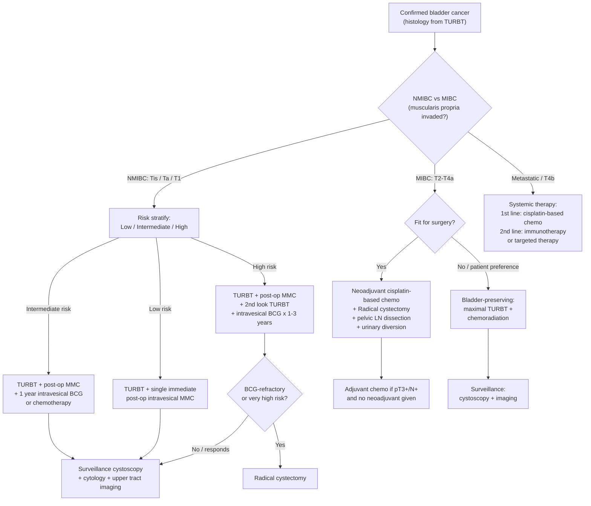

## Management of Bladder Cancer

### Overarching Principles

The entire management of bladder cancer pivots on **one question**: Has the tumour invaded the **muscularis propria (detrusor muscle)**?

- **NMIBC (Tis, Ta, T1)** → manage with TURBT ± intravesical therapy + lifelong surveillance
- **MIBC (≥ T2, up to T4a)** → radical cystectomy ± neoadjuvant chemotherapy (or bladder-preserving multimodality therapy)
- **Metastatic / unresectable (T4b or M1)** → systemic therapy (chemotherapy, immunotherapy, targeted therapy)

A second universal principle: ***Smoking cessation for ALL patients*** [3] — smoking is the #1 risk factor and continued smoking increases recurrence, progression, and mortality even after treatment.

---

### Master Management Algorithm

---

## 1. Management of Non-Muscle-Invasive Bladder Cancer (NMIBC)

NMIBC accounts for ~70–80% of bladder cancers at presentation [3]. The approach is: **TURBT (curative intent) → risk stratify → adjuvant intravesical therapy → lifelong surveillance**.

### 1.1 TURBT — The Foundation of NMIBC Treatment [1][2][3][4]

TURBT is simultaneously diagnostic, staging, and therapeutic for NMIBC. (The procedure details were covered in the Diagnostics section; here we focus on its therapeutic role.)

| Aspect | Detail |
|:-------|:-------|
| **Goal** | Complete, visible resection of ALL tumour tissue + underlying detrusor muscle |
| **Curative potential** | TURBT alone can be curative for NMIBC if complete resection is achieved [2][3] |
| **Technique** | En-bloc for small exophytic lesions; piecemeal for larger ones [3] |
| **Must include** | Muscularis propria in the specimen — to determine if invasion is present [3] |
| **Adjunct** | Fluorescence-guided resection (blue-light cystoscopy) for better tumour detection [3] |

#### ***Immediate Post-operative Intravesical Mitomycin C*** [1][2][3][4]

***Staging TURBT + immediate post-op instillation of mitomycin C (reduce tumour cells implantation and recurrence)*** [4]

| Property | Detail |
|:---------|:-------|
| **Drug** | Mitomycin C (MMC) — "mito-" = thread (refers to DNA crosslinking) |
| **Class** | Cytotoxic alkylating agent — directly crosslinks DNA → prevents cell replication → kills residual cancer cells [2] |
| **Timing** | ***Immediate post-op*** — ideally within 6–24 hours of TURBT [3] |
| **Mechanism of benefit** | Tumour cells are shed during TURBT and can **implant** on the raw, denuded urothelium. Immediate MMC kills these free-floating cells before implantation occurs [4] |
| **Effect** | ***Reduces recurrence*** by ~30% [3] — but does ***NOT reduce progression rate*** (cf. BCG) [2] |
| **Indication** | Low risk and intermediate risk NMIBC; also given empirically in all NMIBC if no contraindication [1][3] |
| **Contraindication** | Suspected or confirmed muscle invasion (do NOT give if MIBC likely — wait for histology); suspected bladder perforation |
| **Side effects** | Chemical cystitis, skin rash [1][2] |

<Callout title="Why Mitomycin C Immediately, Not BCG?" type="idea">
***Immediate post-op BCG is contraindicated*** because BCG is a **live attenuated organism** (Mycobacterium bovis). If instilled into a freshly resected, raw bladder, it can enter the bloodstream through exposed vessels → **BCG sepsis** (a life-threatening systemic mycobacterial infection). Mitomycin C, being a chemical agent, does not carry this risk [2].
</Callout>

#### ***2nd Look TURBT (Restaging TURBT)*** [2][3][4]

***Performed 4–6 weeks after initial staging TURBT*** [4]

***Indications*** [4]:
1. ***High-grade / CIS: significant risk of upstaging***
2. ***Absence of detrusor muscle in initial TURBT specimen***
3. ***Incomplete initial resection***

**Why?** Residual disease is found in **20–30%** of cases who had apparently "complete resection" at the first TURBT [2]. Understaging a T2 tumour as T1 → patient receives BCG instead of radical cystectomy → disease progresses → poor outcome.

---

### 1.2 Risk Stratification of NMIBC [1][3]

After TURBT, pathology determines the risk group, which dictates adjuvant treatment:

| Risk Group | Definition | Risk of Progression | Recommended Treatment |
|:-----------|:-----------|:-------------------|:---------------------|
| **Low** | ***Primary, solitary, low-grade Ta, < 3 cm, no CIS*** [1][3] | 0–4% | ***TURBT + single immediate post-op intravesical MMC*** [1][3] |
| **Intermediate** | All tumours not meeting low or high risk criteria [1] | 10–15% | TURBT + post-op MMC + ***1 year full-dose intravesical BCG*** or chemotherapy [1][3] |
| **High** | ***ANY of: T1, high-grade Ta, CIS, or multiple + recurrent + > 3 cm low-grade tumour*** [1][3] | 30–40% | TURBT + post-op MMC + ***2nd look TURBT*** + ***intravesical BCG × 1–3 years***; ***consider radical cystectomy if very high risk*** [1][3] |
| **BCG-refractory** | Tumour recurs/persists despite adequate BCG | Very high | ***Radical cystectomy*** (or bladder-preserving strategies if unfit) [3] |

---

### 1.3 Intravesical Therapy — BCG vs Chemotherapy

#### A. ***Intravesical BCG (Bacillus Calmette–Guérin)*** [1][2][3][4]

***Intravesical Bacillus Calmette-Guérin (BCG): given 4–6 weeks after staging TURBT for high-risk NMIBC to reduce risk of recurrence and progression*** [4]

BCG is one of the most fascinating treatments in oncology — a tuberculosis vaccine repurposed as cancer immunotherapy.

| Property | Detail |
|:---------|:-------|
| **What is it?** | ***Live attenuated vaccine*** made from Mycobacterium bovis [1][2] |
| **Mechanism** | ***Triggers non-specific cytokine-mediated local immune response*** [1] — BCG organisms attach to the urothelium → internalized by urothelial cells → presented to immune cells → massive influx of CD4+ T cells, macrophages, NK cells → cytokine storm (IL-2, TNF-α, IFN-γ) → immune-mediated destruction of residual cancer cells + increased tumour antigen expression [5] |
| **Route** | Instillation of BCG + normal saline into bladder via urethral catheter → retained for 2 hours → voided [3] |
| **Timing** | Started ***≥ 2–3 weeks (4–6 weeks per lecture slides) after TURBT*** [3][4] — must allow mucosal healing to prevent systemic absorption |
| **Regimen (Induction)** | ***Weekly × 6 weeks*** (Lamm's induction) [1][2][3] |
| **Regimen (Maintenance)** | ***Weekly × 3 weeks*** at 3, 6, 12 months (intermediate risk — total 1 year) [1][2] |
| | Weekly × 3 weeks at 3, 6, 12, 18, 24, 30, 36 months (high risk — total 3 years) [1][3] |
| | ***PWH regimen***: induction (weekly × 6) + maintenance (weekly × 3 at 3mo, × 3 at 6mo, × 3 at 12mo) — 15 doses for 1 year total [2] |
| **Effect** | ***Reduces both recurrence AND progression rate*** (4–27% reduction in progression) [2][3] — this is the key difference from MMC, which reduces recurrence only |
| **Indication** | ***First-line treatment for CIS*** [2]; high-risk and intermediate-risk NMIBC |

**Contraindications for BCG** [3]:
- < 2 weeks after TURBT (mucosal not healed → risk of systemic absorption)
- Gross haematuria (raw surface → BCG enters bloodstream)
- After traumatic catheterisation
- Symptomatic UTI (active infection → immunocompromised state)
- Immunosuppressed patients (live vaccine)

**Side effects** [1][3]:
| Category | Side Effect | Mechanism |
|:---------|:-----------|:----------|
| **Local** | Cystitis (frequency, urgency, dysuria), prostatitis, epididymo-orchitis | Local inflammatory response to BCG organisms |
| **Systemic** | ***BCG sepsis***, pneumonitis, hepatitis, arthritis, fever, malaise | Systemic dissemination of live organisms or systemic immune activation |

**Management of BCG complications**: Localized symptoms usually self-limiting; systemic BCG sepsis is a medical emergency → treat with ***anti-TB drugs*** (isoniazid, rifampicin, ethambutol) + corticosteroids [2][3].

<Callout title="BCG Compliance Issue" type="error">
The maintenance regimen is ***troublesome*** — 15 doses over 1 year (PWH) or up to 27 doses over 3 years (full EAU). Compliance is a significant problem. Patients often drop out due to irritative symptoms. Counsel patients carefully about the importance of completing the course — incomplete BCG is associated with higher recurrence and progression [2].
</Callout>

#### B. Intravesical Chemotherapy — Mitomycin C (MMC) [1][2][3]

| Property | Detail |
|:---------|:-------|
| **Drug** | Mitomycin C (most common); gemcitabine (alternative) |
| **Mechanism** | Alkylating agent → DNA crosslinking → direct cytotoxicity to cancer cells |
| **Single post-op instillation** | Standard for low-risk NMIBC; given within 6–24h of TURBT |
| **Maintenance therapy** | For 1 year in intermediate-risk NMIBC (rarely done in HK) [3] |
| **Effect** | Reduces **recurrence** but NOT progression (unlike BCG) [2] |
| **Side effects** | Chemical cystitis, palmar rash (contact dermatitis) [1][2] |

#### BCG vs MMC — Key Comparison

| Feature | **BCG** | **Mitomycin C** |
|:--------|:--------|:---------------|
| Mechanism | Immunotherapy (immune activation) | Chemotherapy (direct cytotoxicity) |
| Reduces recurrence | Yes | Yes |
| Reduces progression | ***Yes*** | ***No*** |
| Use for CIS | ***First-line*** | Not first-line |
| Timing after TURBT | ≥ 2–6 weeks (mucosal healing needed) | Immediate (within 24h) |
| Side effects | Irritative LUTS, BCG sepsis risk | Chemical cystitis, rash |
| Compliance | Poor (long regimen) | Better (single dose or short course) |

---

### 1.4 Surveillance After NMIBC Treatment [2][3]

Bladder cancer has a notorious **70% lifetime risk of tumour recurrence** [3]. Surveillance is lifelong.

| Risk Group | ***Surveillance Cystoscopy*** Schedule | Additional |
|:-----------|:--------------------------------------|:-----------|
| **Low risk** | 3 months, 12 months, then ***yearly × 5 years*** [2] | — |
| **High risk** | ***Every 3 months × 2 years, then every 6 months × 3 years, then yearly*** (can be lifelong) [2] | + ***Yearly upper tract imaging (CTU) + urine cytology*** [2] |

**Why lifelong surveillance?** Field cancerisation means new tumours can arise anywhere in the urothelium at any time. A single negative cystoscopy does not mean the patient is cured.

---

## 2. Management of Muscle-Invasive Bladder Cancer (MIBC)

MIBC (pT2–T4a) is an aggressive disease — ***> 90% 2-year mortality if untreated*** [3]. However, with appropriate treatment, ***5-year survival > 50% after cystectomy*** [3].

### 2.1 ***Radical Cystectomy (RC)*** — Gold Standard for MIBC [2][3][4]

***Neoadjuvant chemotherapy + Radical cystectomy: open / laparoscopic / robotic*** [4]

#### What Is Removed?

***Radical cystectomy: bladder + bilateral pelvic LN dissection (external iliac, internal iliac, obturator nodes) + adjacent organs*** [2]

| Sex | Structures Removed |
|:----|:-------------------|
| **Male** | ***Bladder, prostate, seminal vesicles ± urethra*** (cystoprostatectomy) + regional LNs [2][3] |
| **Female** | ***Bladder, uterus, bilateral salpingo-oophorectomy (HBSO), part of vagina ± urethra*** (anterior exenteration) + distal ureters + regional LNs [2][3] |

**Why pelvic lymph node dissection?** ***Pelvic LN dissection offers survival benefit*** (cf. CA prostate where LND benefit is debatable) because ***microscopic metastasis is common*** in bladder cancer [2]. Extended LND (up to common iliac and presacral nodes) improves staging accuracy and may improve survival.

#### Indications [3]
- ***Very high-risk NMIBC*** (BCG-refractory, T1HG with multiple adverse features)
- ***Resectable MIBC: T2–T4a*** [3]

#### Contraindications / Not Candidates
- ***T4b (pelvic wall or abdominal wall invasion)*** — this is **unresectable** [3]
- Medically unfit for major surgery (significant cardiac, pulmonary, or other comorbidities)
- Patient declines surgery (offer bladder-preserving alternatives)

#### Surgical Techniques [3]
| Technique | Detail |
|:----------|:-------|
| ***Open*** | Traditional approach; best established evidence |
| ***Laparoscopic*** | Less blood loss, faster recovery; similar oncological outcomes |
| ***Robotic*** | Increasingly used; ergonomic advantages for surgeon; similar oncological outcomes in experienced centres |

#### ***Sexual-Preserving Techniques*** [3]
In carefully selected individuals (organ-confined disease without tumour in prostate, urethra, or bladder neck):
- **Males**: prostate-sparing, capsule-sparing, seminal vesicle–sparing, nerve-sparing cystectomy
- **Females**: preservation of neurovascular bundle, vagina, or uterus
- These reduce sexual dysfunction and urinary incontinence but must not compromise oncological safety

---

### 2.2 Urinary Diversion After Radical Cystectomy [3]

Once the bladder is removed, urine must be diverted. There are two broad categories:

#### A. Incontinent Diversion (Urine drains to an external stoma/bag)

| Type | Description | Pros / Cons |
|:-----|:-----------|:-----------|
| **Ureterocutaneostomy** | Ureters brought directly to abdominal wall surface | Simple; but ↓calibre of ureters → ↑risk of stenosis [3] |
| ***Ileal conduit*** (most common in HK) [3] | Ureters implanted into a short isolated segment (~15–20 cm) of **ileum** (or colon) → brought to abdominal surface as a **stoma** | ***Majority of urinary diversions in HK*** [3]; lower risk of ureteroileal stricture than ureterocutaneostomy; requires external urostomy bag |

#### B. Continent Diversion (Urine stored internally)

| Type | Description | Pros / Cons |
|:-----|:-----------|:-----------|
| **Continent cutaneous reservoir (e.g., Indiana pouch)** | Bowel segment fashioned into an internal reservoir → catheterisable stoma on abdominal wall | No external bag; requires self-catheterisation every 4–6 hours |
| **Orthotopic neobladder (e.g., Studer, Hautmann)** | Bowel segment fashioned into a reservoir → anastomosed to the **urethra** | Most physiological — patient voids via the urethra; requires intact external sphincter and no tumour at urethra/bladder neck; risk of nocturnal incontinence (neobladder lacks detrusor contraction — voiding by Valsalva/abdominal straining) |

<Callout title="Why Use Bowel for Urinary Diversion?">
Bowel is the only readily available tubular tissue in the body that can be refashioned into a conduit or reservoir. Ileum is most commonly used because it has a reliable mesentery, is relatively easy to mobilize, and produces less mucus than colon. However, using bowel for urinary diversion can cause metabolic complications: **hyperchloraemic metabolic acidosis** (bowel mucosa reabsorbs Cl⁻ and NH₄⁺ from urine, exchanges for HCO₃⁻) and **vitamin B12 deficiency** (terminal ileum is the site of B12 absorption — resection removes this).
</Callout>

---

### 2.3 Neoadjuvant and Adjuvant Chemotherapy [3][4]

#### ***Neoadjuvant Chemotherapy*** [3][4]

***Neoadjuvant chemotherapy + Radical cystectomy*** [4]

| Property | Detail |
|:---------|:-------|
| **Regimen** | ***Cisplatin-based combination*** therapy (e.g., GC = gemcitabine + cisplatin; MVAC = methotrexate + vinblastine + doxorubicin + cisplatin; PGC = paclitaxel + gemcitabine + cisplatin) [3] |
| **Timing** | Given **before** radical cystectomy (typically 3–4 cycles) |
| **Rationale** | (1) Downstage the tumour → improve resectability; (2) Treat micrometastatic disease early (before surgery selects for resistant clones); (3) Patients tolerate chemo better pre-op than post-op (better renal function, better performance status) |
| **Indication** | ***Recommended for all patients undergoing curative RC*** [3] |
| **Survival benefit** | ~5% absolute improvement in 5-year overall survival |
| **Prerequisite** | Adequate renal function (cisplatin is nephrotoxic — requires GFR > 60 mL/min); if cisplatin-ineligible, role of neoadjuvant chemo is less clear |

#### Adjuvant Chemotherapy [3]

| Property | Detail |
|:---------|:-------|
| **Timing** | Given **after** radical cystectomy |
| **Indication** | ***Role unclear*** — may be offered to ***pT3+ or N1+ patients who did NOT receive neoadjuvant therapy*** [3] |
| **Rationale** | Treats residual micrometastatic disease identified on final pathology |
| **Limitation** | Post-operative renal function may be impaired (single kidney with ureteric reimplantation); patients may not tolerate cisplatin post-op |

---

### 2.4 ***Bladder-Preserving (Combined Modality) Therapy*** [3][4]

***Radiotherapy for frail patient not fit for surgery*** [4]

This is the alternative to radical cystectomy for patients who wish to keep their bladder or who are unfit for major surgery.

| Property | Detail |
|:---------|:-------|
| **Components** | ***Maximal TURBT*** (resect ALL visible tumour) + ***chemoradiation*** with platinum-based chemotherapy (e.g., cisplatin, or mitomycin C + 5-FU) [3] |
| **Also called** | Trimodality therapy (TMT) = maximal TURBT + chemotherapy + radiation |
| **Indications** [3] | (1) Alternative to RC in selected, well-informed patients who wish to preserve sexual function / bladder; (2) In place of RC in patients with significant comorbidities where RC is not an option |
| **Prefer RC over TMT if** [3] | Presence of CIS (diffuse field disease → poor response to RT); upper tract obstruction (suggests advanced local disease); IBD (radiation contraindicated); severe storage LUTS; previous extensive pelvic surgery or RT |
| **Outcome** | ***5-year overall survival 36–74%*** (inferior to RC, but no direct RCT comparison exists) [3] |

**Why is it inferior?** Radiation cannot adequately treat microscopic disease throughout the entire urothelium (field cancerisation), and residual CIS/multifocal disease in the bladder remnant leads to local recurrence. However, it preserves quality of life (no stoma, preserved sexual function).

---

## 3. Management of Metastatic / Unresectable Bladder Cancer [1][3][4]

Metastatic bladder cancer (any T, N+, M1) or unresectable disease (T4b) is incurable with surgery alone. Management is **systemic**.

### ***Systemic Chemotherapy (1st Line)*** [1][3][4]

***Systemic chemotherapy: cisplatin or carboplatin-based*** [4]

| Regimen | Components | Notes |
|:--------|:-----------|:------|
| ***GC*** | Gemcitabine + Cisplatin | Most commonly used first-line; better tolerated than MVAC [3] |
| ***MVAC*** | Methotrexate + Vinblastine + Doxorubicin + Cisplatin | Historical standard; higher toxicity; ± G-CSF support [3] |
| ***PGC*** | Paclitaxel + Gemcitabine + Cisplatin | Triplet; used in selected fit patients [3] |
| **Carboplatin-based** | Gemcitabine + Carboplatin | For ***cisplatin-ineligible*** patients (GFR < 60, poor performance status, hearing loss, neuropathy, heart failure) [3] |

- ***Urothelial bladder cancer is most sensitive to cisplatin-based chemotherapy*** [1]
- ***Platinum-based chemotherapy is the preferred initial approach for systemic therapy in patients with metastatic disease*** [1]

### ***Immunotherapy (2nd Line)*** [3][4]

***Immunotherapy: Immune checkpoint inhibitors (e.g., pembrolizumab)*** [4]

| Agent | Target | Notes |
|:------|:-------|:------|
| ***Pembrolizumab*** | PD-1 inhibitor | FDA-approved for platinum-refractory advanced urothelial CA; also first-line for cisplatin-ineligible patients with PD-L1 high expression [3][4] |
| **Atezolizumab** | PD-L1 inhibitor | Second-line after platinum failure [3] |
| **Nivolumab** | PD-1 inhibitor | Adjuvant setting post-RC for high-risk MIBC (EAU 2024); also second-line metastatic |
| **Avelumab** | PD-L1 inhibitor | Maintenance after first-line platinum-based chemo (switch maintenance strategy) — significant survival benefit |

**Why do checkpoint inhibitors work in bladder cancer?** Urothelial carcinoma has a high tumour mutational burden (TMB) — due to carcinogen exposure (smoking, chemicals) → many neoantigens → but the tumour upregulates PD-L1 to evade immune detection. Blocking PD-1/PD-L1 "releases the brakes" on T-cell-mediated anti-tumour immunity.

### ***Targeted Therapy*** [4]

***Target therapy: FGFR inhibitors are used for specific genetic alterations*** [4]

| Agent | Target | Indication |
|:------|:-------|:-----------|
| ***Erdafitinib*** | FGFR2/3 inhibitor | For patients with **FGFR3 mutations or FGFR2/3 fusions** — typically in the low-grade papillary pathway; used in platinum-refractory setting [4] |

**Why FGFR?** Recall from the molecular pathogenesis section: the low-grade papillary pathway is driven by **FGFR3 activating mutations** (~70% of low-grade tumours). Erdafitinib directly inhibits this driver → tumour regression. This is a classic example of **precision oncology**.

### Other Agents [3]

| Agent | Role |
|:------|:-----|
| **Vinflunine** | 2nd-line chemotherapy (approved in Europe, rarely used) |
| **Enfortumab vedotin** | Antibody-drug conjugate targeting Nectin-4; approved for platinum- and IO-refractory urothelial CA (3rd line); significant survival benefit |
| **Sacituzumab govitecan** | Antibody-drug conjugate targeting Trop-2; emerging evidence |

---

## 4. Prognosis Summary [3]

| Stage | Prognosis |
|:------|:----------|
| **NMIBC** | 10–20% progress to MIBC; ***70% lifetime risk of tumour recurrence*** → lifelong surveillance mandatory |
| **MIBC (untreated)** | ***> 90% 2-year mortality*** |
| **MIBC (after cystectomy)** | ***5-year survival > 50%*** |
| **Metastatic (1st-line chemo)** | Median survival ~14–15 months; improved with immunotherapy maintenance |

---

## 5. Summary: Treatment by Stage

| Stage | Treatment |
|:------|:----------|
| ***Low-risk NMIBC*** | TURBT + single immediate post-op MMC [1][3][4] |
| ***Intermediate-risk NMIBC*** | TURBT + post-op MMC + 1-year intravesical BCG or chemo [1][3] |
| ***High-risk NMIBC*** | TURBT + post-op MMC + ***2nd look TURBT*** + intravesical BCG × 1–3 years; consider RC if very high risk [1][3][4] |
| ***CIS (first-line)*** | Intravesical BCG (first-line treatment for CIS) [2] |
| ***BCG-refractory*** | Radical cystectomy [3] |
| ***MIBC (T2–T4a)*** | ***Neoadjuvant cisplatin-based chemo + radical cystectomy + pelvic LND + urinary diversion*** [3][4] |
| ***MIBC (unfit for surgery)*** | ***Bladder-preserving: maximal TURBT + chemoradiation*** [3][4] |
| ***Metastatic*** | ***1st line: cisplatin/carboplatin-based chemo → maintenance avelumab; 2nd line: pembrolizumab/atezolizumab; FGFR inhibitors if FGFR-altered*** [3][4] |

---

<Callout title="High Yield Summary">

**NMIBC Management (Tis/Ta/T1)**:
- TURBT is the cornerstone — diagnostic, staging, AND therapeutic
- ***Immediate post-op intravesical mitomycin C*** for ALL NMIBC (reduces recurrence by ~30%, NOT progression; immediate because it prevents tumour cell implantation)
- Risk stratify: Low → MMC only; Intermediate → BCG or chemo × 1 year; High → BCG × 1–3 years ± 2nd look TURBT ± radical cystectomy
- ***BCG is first-line for CIS*** and reduces BOTH recurrence AND progression (unlike MMC which only reduces recurrence)
- BCG is a live attenuated vaccine (M. bovis) → NEVER give immediately post-TURBT (risk of BCG sepsis)
- BCG regimen: induction weekly × 6 → maintenance weekly × 3 at regular intervals
- BCG side effects: irritative LUTS (local), BCG sepsis (systemic) → treat with anti-TB drugs
- ***2nd look TURBT at 4–6 weeks*** if: (1) high-grade/CIS, (2) no detrusor in specimen, (3) incomplete resection
- Surveillance is LIFELONG: field cancerisation → 70% lifetime recurrence risk

**MIBC Management (T2–T4a)**:
- ***Neoadjuvant cisplatin-based chemo + Radical cystectomy*** (open/lap/robotic) + pelvic LND + urinary diversion (most commonly ileal conduit in HK)
- RC removes: M — bladder + prostate + seminal vesicles ± urethra; F — bladder + uterus + HBSO + part of vagina ± urethra
- Pelvic LND provides survival benefit (microscopic mets common)
- Bladder-preserving TMT (maximal TURBT + chemoRT) for unfit/patient preference

**Metastatic (T4b/M1)**:
- ***1st line: cisplatin-based chemo (GC or MVAC)***; carboplatin if cisplatin-ineligible
- ***2nd line: immune checkpoint inhibitors (pembrolizumab, atezolizumab)***
- ***Targeted: FGFR inhibitors (erdafitinib) for FGFR-altered tumours***
- Maintenance avelumab after 1st-line chemo
- Antibody-drug conjugates (enfortumab vedotin) for refractory disease

**T4b = unresectable** (pelvic wall/abdominal wall invasion)

</Callout>

---

<ActiveRecallQuiz
  title="Active Recall - Bladder Cancer Management"
  items={[
    {
      question: "Why is immediate post-op intravesical BCG contraindicated after TURBT, whereas mitomycin C can be given immediately?",
      markscheme: "BCG is a live attenuated organism (M. bovis). Freshly resected bladder has exposed blood vessels; BCG can enter the bloodstream causing life-threatening BCG sepsis. Mitomycin C is a chemical alkylating agent with no risk of systemic infection. BCG must be delayed at least 2-6 weeks to allow mucosal healing."
    },
    {
      question: "Compare BCG and mitomycin C in terms of their effect on recurrence and progression. Which is first-line for CIS?",
      markscheme: "BCG reduces both recurrence AND progression. Mitomycin C reduces recurrence only, NOT progression. BCG is first-line for CIS because CIS is high-grade with high progression risk, and only BCG addresses progression."
    },
    {
      question: "What structures are removed in a radical cystectomy for a male patient with T3 bladder cancer? Why is pelvic lymph node dissection performed?",
      markscheme: "Male radical cystectomy removes: bladder, prostate, seminal vesicles, plus or minus urethra, plus regional lymph nodes (external iliac, internal iliac, obturator nodes). Pelvic LND is performed because microscopic lymph node metastasis is common in bladder cancer and LND provides a survival benefit."
    },
    {
      question: "A patient with MIBC is cisplatin-ineligible due to GFR of 45 mL/min. What is the alternative first-line systemic regimen for metastatic disease?",
      markscheme: "Carboplatin-based chemotherapy (e.g., gemcitabine + carboplatin). Cisplatin requires GFR greater than 60 mL/min; carboplatin is less nephrotoxic and can be dose-adjusted for renal impairment."
    },
    {
      question: "What is the rationale for using FGFR inhibitors (e.g., erdafitinib) in bladder cancer? Which molecular pathway do these target?",
      markscheme: "FGFR3 activating mutations drive the low-grade papillary pathway of urothelial carcinoma (present in approximately 70% of low-grade tumours). Erdafitinib inhibits FGFR2/3 and is used for patients with FGFR3 mutations or FGFR2/3 fusions, typically in the platinum-refractory setting. This is precision/targeted oncology."
    },
    {
      question: "What is the most common urinary diversion method used in Hong Kong after radical cystectomy? Describe the procedure and one metabolic complication.",
      markscheme: "Ileal conduit — ureters are implanted into an isolated 15-20 cm segment of ileum, which is brought to the abdominal surface as a stoma with an external urostomy bag. Metabolic complication: hyperchloraemic metabolic acidosis (bowel mucosa reabsorbs chloride and ammonium from urine, exchanges bicarbonate). Also vitamin B12 deficiency if terminal ileum is used."
    }
  ]}
/>

## References

[1] Senior notes: felixlai.md (Urothelial bladder cancer section — Treatment, Risk stratification)
[2] Senior notes: maxim.md (Bladder cancer section — Management NMIBC, Management MIBC)
[3] Senior notes: Ryan Ho Urogenital.pdf (Section 7.4.1 Bladder Cancer — Approach to Mx, TURBT, Intravesical therapy, Radical cystectomy, pp. 155–158)
[4] Lecture slides: GC 183. Common urological malignancies and their presentations - Nov 7.pdf (pp. 24–25)
[5] Senior notes: Ryan Ho Fundamentals.pdf (Management of urinary tumours, p. 345)
