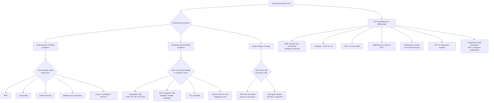

## Differential Diagnosis of BPH (Differential Diagnosis of LUTS in a Man)

The key mental framework here is this: **a man walks into clinic with LUTS. You're thinking BPH, but what else could it be?** The differential diagnosis is not "what mimics BPH" — it is more accurately "what else causes LUTS in a man?" Because as we established in Part 1, ***not all LUTS is due to BPH — ≥1/3 of men with LUTS do NOT have BOO*** [4].

The approach to the differential must be **systematic and anatomical**, working through the possible sites of pathology from the kidneys down to the urethra, plus systemic causes. We also need to think about it **physiologically**: is the problem with outflow (obstruction), with the bladder (overactivity or underactivity), or with urine production (polyuria)?

---

### Organising Framework: Three Pathophysiological Categories

Before listing individual diagnoses, let's think about *why* LUTS happens from first principles:

1. **Bladder Outlet Obstruction (BOO):** Something physically or functionally blocks urine outflow → predominantly ***voiding symptoms*** [2][7]
2. **Overactive Bladder (OAB) / Detrusor Overactivity:** The detrusor muscle contracts inappropriately during filling → predominantly ***storage symptoms*** [2][7]
3. **Other causes:** Polyuria (systemic), pain-related symptoms, urethral disease

<Callout title="The Cardinal Rule of LUTS Differential Diagnosis">
***Bladder outlet obstruction typically presents with predominantly voiding symptoms. Overactive bladder typically presents with predominantly storage symptoms*** [2][7]. When a patient has mixed symptoms, think about whether there is BOO *with secondary* detrusor overactivity — this is very common in BPH (30–60% of BOO patients develop secondary OAB [4]).
</Callout>

---

### Detailed Differential Diagnosis Table

***The differential diagnosis of LUTS can be classified by type*** [7]:

#### A. Bladder Outlet Obstruction (BOO) — Predominantly Voiding Symptoms

| Site | Diagnosis | Key Distinguishing Features | Why It Causes LUTS |
|---|---|---|---|
| **Prostate** | ***Benign Prostatic Hyperplasia (BPH)*** | Age >50, smooth enlarged prostate on DRE, median sulcus preserved, gradual onset | Transitional zone hyperplasia → static + dynamic compression of prostatic urethra |
| | ***Prostate cancer (CA prostate)*** | ***Usually asymptomatic (affects peripheral zone) but can present with LUTS*** [3]. Hard, nodular, irregular prostate on DRE ± loss of median sulcus. Elevated PSA. May present with bone pain (metastases) | Peripheral zone tumour grows large enough to compress urethra, or invades bladder neck/trigone. Remember: peripheral zone location means it's usually silent until advanced [3][7] |
| **Urethra** | ***Urethral stricture*** | ***May have similar LUTS but usually associated with history of prior instrumentation, trauma, or STDs*** [3]. Younger age. May have history of urethritis, catheterisation, hypospadias repair | Scarring narrows the urethral lumen → fixed mechanical obstruction. "Stricture" = Latin *strictura* = tightening/narrowing |
| **Bladder neck** | ***Bladder neck contracture*** | ***Usually from prior urological surgery (e.g., radical prostatectomy) or radiotherapy for CA prostate*** [7]. History of prior procedure is the key clue | Post-surgical/post-RT fibrosis and scarring of the bladder neck → fixed narrowing of the bladder outlet |
| **Bladder** | ***Bladder stones*** | Irritative symptoms (strangury), intermittent stream (stone acts as ball-valve at bladder neck), haematuria, recurrent UTI, history of urinary stasis | Stone at bladder neck intermittently obstructs outflow; also irritates bladder mucosa causing storage symptoms [7] |
| | ***Bladder cancer (CA bladder)*** | Painless haematuria (cardinal symptom), irritative LUTS (frequency, urgency), constitutional symptoms, smoking history (strongest RF) | Tumour at bladder neck/trigone can obstruct outflow; tumour anywhere in bladder irritates mucosa → storage symptoms |
| **Bladder** | ***Interstitial cystitis*** | Chronic pelvic pain, frequency, urgency, pain relieved by voiding, predominantly in women but occurs in men. No infection on culture | Chronic inflammation of bladder wall → ↓ functional capacity, pain |
| | ***Ketamine cystitis*** | History of ketamine abuse (recreational drug use — relevant in Hong Kong!), severe frequency/urgency/dysuria, contracted bladder | Ketamine and its metabolites are directly toxic to urothelium → severe inflammation, fibrosis, contracted bladder |
| **Functional** | ***Detrusor-sphincter dyssynergia (DSD)*** | History of spinal cord injury or pontine stroke. Failure of sphincter relaxation during detrusor contraction | Interruption of pontine micturition centre control → synchronous contraction of detrusor AND sphincter → very high pressures → upper tract damage [4] |
| **Other** | ***Drugs causing retention*** | History of sympathomimetics (pseudoephedrine), anticholinergics, opioids, TCAs, beta-blockers | Sympathomimetics: ↑ α1-mediated urethral smooth muscle contraction. Anticholinergics/opioids: ↓ detrusor contractility. Combined effect = functional BOO |
| | ***Chronic constipation*** | Loaded rectum on DRE, history of chronic constipation | Rectal distension compresses prostatic urethra from posterior. Usually a *co-factor* with background BPH rather than sole cause [4] |
| | ***Phimosis*** | Tight foreskin visible on examination, may cause ballooning during micturition | Mechanical obstruction at the level of the prepuce → impeded urinary outflow |

#### B. Overactive Bladder (OAB) / Detrusor Overactivity — Predominantly Storage Symptoms

| Category | Diagnosis | Key Distinguishing Features | Why It Causes LUTS |
|---|---|---|---|
| ***Neurogenic OAB*** | ***Stroke*** | History of CVA, upper motor neuron signs, loss of cortical inhibition | Frontal cortex normally inhibits the pontine micturition centre during filling. Stroke removes this inhibition → uninhibited detrusor contractions |
| | ***Spinal cord injury (SCI)*** | History of trauma/myelopathy, UMN signs below level of lesion | Suprasacral SCI → loss of descending inhibitory pathways → detrusor overactivity (± DSD) |
| | ***Multiple sclerosis (MS)*** | Young female, relapsing-remitting neuro symptoms, demyelinating lesions on MRI | Demyelination of spinal cord pathways → detrusor overactivity or DSD |
| | ***Parkinson's disease (PD)*** | Resting tremor, bradykinesia, rigidity, postural instability | Basal ganglia normally exert tonic inhibitory influence on pontine micturition centre. Loss of dopaminergic neurons → loss of inhibition → detrusor overactivity |
| | ***Normal pressure hydrocephalus (NPH)*** | Classic triad: gait apraxia, dementia, urinary incontinence | Stretching of periventricular white matter fibres from sacral motor cortex → loss of voluntary control of micturition |
| ***Non-neurogenic OAB*** | ***Idiopathic OAB*** | Most common cause. Diagnosis of exclusion. No neurological disease | Unknown mechanism — possibly myogenic changes in detrusor, altered afferent signalling |
| | ***Secondary to BOO*** | ***OAB itself can be secondary to bladder outlet obstruction*** [7]. Patient has BOTH voiding and storage symptoms | BOO → ↑ intravesical pressure → detrusor hypertrophy → ischaemia → denervation supersensitivity → uninhibited contractions [4] |
| | ***Bladder pathology*** | Cystitis (infection), tumour, stones, foreign body, post-RT cystitis | Local irritation of bladder mucosa/detrusor triggers afferent nerve activation → urgency and frequency |

#### C. Other Causes of LUTS

| Category | Diagnosis | Key Distinguishing Features | Why It Causes LUTS |
|---|---|---|---|
| **Infection** | ***UTI / Acute prostatitis*** | ***Usually irritative symptoms with dysuria, associated with pyuria + significant bacteriuria on urine culture*** [3]. Fever, tender prostate (prostatitis) | Infection → inflammation of bladder/prostatic mucosa → ↑ afferent nerve firing → urgency, frequency, dysuria |
| **Polyuria** | ***Diabetes mellitus (DM)*** | Polyuria, polydipsia, weight loss, elevated glucose. Nocturia prominent | Osmotic diuresis from glycosuria → ↑ urine volume → frequency, nocturia. Also: diabetic cystopathy (autonomic neuropathy → detrusor hypocontractility) [7] |
| | ***Diabetes insipidus (DI)*** | ***Nocturnal polyuria from loss of diurnal variation or deficiency of vasopressin (ADH)*** [7]. Very dilute urine, massive volumes | Central DI: ↓ ADH production. Nephrogenic DI: kidney resistant to ADH. Either way → inability to concentrate urine → polyuria |
| | ***Excessive fluid intake / Primary polydipsia*** | Habit of drinking large volumes, psychiatric history | Simply too much water in → too much urine out |
| **Cardiovascular** | ***Congestive heart failure*** | Peripheral oedema, orthopnoea, PND. Nocturia prominent | During the day, fluid pools in dependent areas (gravity). At night, recumbency → ↑ venous return → ↑ renal perfusion → mobilisation of peripheral oedema → nocturnal polyuria [7] |
| | ***Peripheral oedema (any cause)*** | Oedema on examination | Same mechanism as CHF — third-space fluid mobilised at night |
| **Respiratory** | ***Obstructive sleep apnoea (OSA)*** | Snoring, daytime somnolence, obesity, large neck circumference | ***Difficulty with sleep maintenance and loss of diurnal variation in release of vasopressin (ADH)*** [7]. Also: ↑ atrial natriuretic peptide (ANP) release from ↑ intrathoracic pressure → natriuresis → nocturnal polyuria |

---

### Differential Diagnosis of Nocturia Specifically

Nocturia deserves special attention because it is extremely common and has a broad differential beyond BPH [7]:

| System | Cause | Mechanism |
|---|---|---|
| ***Respiratory*** | ***OSA*** | ***Loss of diurnal variation in ADH release*** + ↑ ANP [7] |
| ***Cardiovascular*** | ***HTN, CHF, peripheral oedema*** | Nocturnal mobilisation of third-space fluid → ↑ renal perfusion at night [7] |
| ***Urological*** | ***UTI, BPH, CA prostate*** | ↓ functional bladder capacity (BOO, inflammation) or detrusor overactivity [7] |
| ***Endocrine*** | ***DM, DI*** | Osmotic diuresis (DM) or ***nocturnal polyuria from loss of diurnal variation/deficiency of vasopressin*** (DI) [7] |

<Callout title="Nocturia Is Not Always Urological!" type="error">
Many students reflexively attribute nocturia to BPH. But always consider **systemic causes** — CHF, DM, DI, OSA, excessive evening fluid intake, and medications (diuretics taken in the evening). The ***voiding diary (frequency-volume chart for ≥3 days)*** is essential to distinguish **nocturnal polyuria** (>33% of 24h urine output at night) from **reduced functional bladder capacity** [4][5].
</Callout>

---

### Distinguishing BPH from Key Mimics — Clinical Pearls

| Feature | BPH | Prostate Cancer | Urethral Stricture | Neurogenic Bladder | UTI/Prostatitis |
|---|---|---|---|---|---|
| **Age** | 50–80 | >60 (rare < 40) | Any age | Any age | Any age |
| **Onset** | Gradual | Insidious or asymptomatic | Gradual | Variable (depends on neuro lesion) | Acute |
| **Symptom predominance** | Voiding > storage | Often asymptomatic; voiding if advanced | Voiding | Storage or voiding (depends on lesion level) | Storage (irritative) |
| **DRE** | Smooth, enlarged, non-tender, median sulcus intact | Hard, nodular, irregular, loss of sulcus | Usually normal prostate | Normal prostate; ↓ anal tone if cauda equina | Tender, boggy (prostatitis) |
| **PSA** | Mildly elevated (proportional to volume) | Often significantly elevated (> 10 suspicious) | Normal | Normal | Elevated (acute prostatitis) |
| **Key history** | None specific | Family history, ethnicity | Prior instrumentation, STD, trauma | Neurological disease history | Fever, dysuria, recent catheter |
| **Urinalysis** | Usually normal | Usually normal | Usually normal | Usually normal | Pyuria, bacteriuria |

---

### Causes of Elevated PSA — A Differential Within the Differential

Since PSA is commonly checked in men with LUTS, understanding what elevates PSA beyond cancer is important [7][8]:

| Category | Causes |
|---|---|
| ***Benign conditions*** | ***BPH*** (proportional to volume), ***prostatitis*** (returns to baseline 6–8 weeks after symptom resolution), ***prostatic infarction***, ***AROU*** (↓ by 50% within 1–2 days after resolution; ***do NOT screen PSA for ≥2 weeks after AROU***), ***perineal trauma*** [8] |
| ***Manipulation*** | ***Cycling***, prostatic massage, DRE (minimal effect), prostate biopsy, TURP, ejaculation (minor, transient) [8] |
| ***Malignant*** | ***Prostate cancer*** (strongest association with risk and outcome) |

**PSA interpretation** [7][8]:
- ***PSA < 4 ng/mL*** = Normal
- ***PSA ≥ 4 ng/mL*** = Cutoff for considering diagnostic prostate biopsy
- ***PSA 4–10 ng/mL*** = ~20% chance of cancer (the "grey zone")
- ***PSA ≥ 10 ng/mL*** = ~50% chance of cancer

<Callout title="PSA Pearl">
***PSA is prostate-specific but NOT prostate-cancer specific*** [7][8]. It goes up with any process that disrupts prostate architecture — infection, hyperplasia, infarction, manipulation. Never diagnose cancer on PSA alone. And ***do NOT screen PSA if patients have < 10 years of life expectancy*** unless clinically obvious disease (e.g., palpable nodule on DRE) [8].
</Callout>

---

### Clinical Approach: Mermaid Diagram

---

### How Investigations Help Differentiate

| Investigation | What It Rules In/Out | When to Use |
|---|---|---|
| ***DRE*** | BPH (smooth, enlarged) vs CA prostate (hard, nodular) vs prostatitis (tender, boggy); anal tone for neurogenic cause | **Every patient with LUTS** [3][5] |
| ***Urinalysis + C/ST*** | UTI, haematuria (bladder pathology) | **Every patient** [3][5] |
| ***Urine cytology*** | ***Indicated if bladder cancer suspected — patients presenting with haematuria and predominantly irritative symptoms*** [8] | Haematuria, smoker, irritative-predominant LUTS |
| ***PSA*** | CA prostate (elevated), BPH (mildly elevated proportional to volume) | Controversial; ***probably measured if diagnosis of CA prostate would change management*** [4] |
| ***Uroflowmetry*** | ***Qmax > 15 mL/s can effectively rule out clinically important BOO*** [3]. Abnormal flow pattern (multiple peaks = straining) | Routine screening for BOO |
| ***Voiding diary (≥3 days)*** | Distinguishes nocturnal polyuria from reduced bladder capacity; quantifies fluid intake | ***Especially if frequency/nocturia prominent*** [4][5] |
| ***Urodynamics*** | ***Gold standard for diagnosis of BOO*** — distinguishes BOO (↓ flow + ↑ detrusor pressure) from detrusor underactivity (↓ flow + ↓ detrusor pressure) [3] | Uncertain diagnosis, neurological disease, young age (< 50), failed initial treatment [3] |
| ***Cystoscopy*** | ***To rule out urethral strictures, bladder stones, bladder cancer*** [3] | Haematuria, suspicion of structural pathology |
| ***USG upper tract*** | Hydronephrosis (obstructive uropathy), stones, tumour | ***If large post-void residual, haematuria, or history of urolithiasis*** [3] |
| ***USG prostate (TRUS)*** | Prostate volume (for 5ARI use, surgical planning), intravesical prostatic protrusion | ***If contemplating surgery*** [3][5] |

<Callout title="BOO Is a Urodynamic Diagnosis!" type="error">
***BOO is a urodynamic diagnosis*** [3] — it is defined by ↓ uroflow rate PLUS ↑ detrusor pressure during voiding. Uroflowmetry alone cannot distinguish BOO from detrusor underactivity (both give low flow), which is why urodynamics is the gold standard when the diagnosis is uncertain. This distinction matters because surgery for BOO (e.g., TURP) will NOT help a patient whose problem is a weak detrusor.
</Callout>

---

### Summary: Differential Diagnosis by Symptom Pattern

| Symptom Pattern | Most Likely Diagnoses | Key Differentiating Investigation |
|---|---|---|
| ***Voiding-predominant LUTS in older man*** | BPH, CA prostate, urethral stricture | DRE, PSA, uroflowmetry, cystoscopy |
| ***Storage-predominant LUTS*** | OAB (neurogenic or idiopathic), UTI, bladder pathology (stones, tumour, cystitis) | Urinalysis, voiding diary, cystoscopy, neurological exam |
| ***Mixed LUTS*** | BPH with secondary OAB, neurogenic bladder | Urodynamics (distinguishes BOO + OAB from other combinations) |
| ***Nocturia-predominant*** | Nocturnal polyuria (CHF, OSA, DM/DI, evening diuretics), BPH, OAB | Voiding diary (≥3 days), glucose, cardiac assessment |
| ***LUTS + haematuria*** | CA bladder, bladder stones, BPH (bleeding veins), CA prostate, UTI | Cystoscopy, urine cytology, CT urogram |
| ***LUTS + neurological signs*** | Neurogenic bladder (stroke, PD, MS, SCI, NPH) | Neurological examination, MRI brain/spine, urodynamics |
| ***LUTS in young man (< 50)*** | Urethral stricture, prostatitis, neurogenic bladder, functional BOO | Cystoscopy, urodynamics, STD screen |

---

<Callout title="High Yield Summary">

**Core principle:** Not all LUTS = BPH. ≥1/3 of men with LUTS do NOT have BOO. Think systematically.

**Three categories of LUTS differential:**
1. **BOO** (voiding symptoms): BPH, CA prostate, urethral stricture, bladder neck contracture, stones, drugs, phimosis
2. **OAB** (storage symptoms): Neurogenic (stroke, PD, MS, SCI, NPH) vs Non-neurogenic (idiopathic, secondary to BOO, bladder pathology)
3. **Other:** UTI/prostatitis, polyuria (DM, DI, CHF, OSA, polydipsia)

**Key differentiating features on DRE:** BPH = smooth, enlarged, non-tender. CA prostate = hard, nodular, irregular. Prostatitis = tender, boggy. ↓ Anal tone = neurogenic cause.

**PSA:** Prostate-specific but NOT cancer-specific. Elevated by BPH, prostatitis, AROU, manipulation. Do NOT check within 2 weeks of AROU.

**Nocturia DDx:** Don't forget non-urological causes — CHF, OSA, DM/DI, evening diuretics. Voiding diary is essential.

**BOO is a urodynamic diagnosis** — uroflowmetry alone cannot distinguish BOO from detrusor underactivity.

</Callout>

---

<ActiveRecallQuiz
  title="Active Recall - Differential Diagnosis of BPH / LUTS"
  items={[
    {
      question: "A 55-year-old man presents with predominantly voiding LUTS. On DRE, the prostate is hard, irregular, and nodular with loss of the median sulcus. What is the most likely diagnosis, and what investigation would you prioritise?",
      markscheme: "Most likely diagnosis: prostate cancer (hard, nodular, irregular prostate with loss of median sulcus on DRE). Prioritise: serum PSA and prostate biopsy (TRUS-guided or transperineal) if findings would change management and life expectancy > 10 years."
    },
    {
      question: "Name three neurogenic causes of overactive bladder and explain the common mechanism.",
      markscheme: "Any three of: stroke, Parkinson disease, multiple sclerosis, spinal cord injury, normal pressure hydrocephalus. Common mechanism: loss of supraspinal inhibitory control over the pontine micturition centre or spinal reflex arc, leading to uninhibited detrusor contractions during filling."
    },
    {
      question: "A man with LUTS and nocturia has a voiding diary showing 40% of his 24-hour urine output occurring at night. Name three non-urological causes of nocturnal polyuria.",
      markscheme: "Any three of: congestive heart failure (nocturnal mobilisation of peripheral oedema), obstructive sleep apnoea (loss of ADH diurnal variation plus increased ANP), diabetes mellitus (osmotic diuresis), diabetes insipidus (ADH deficiency), peripheral oedema from any cause, evening diuretic use."
    },
    {
      question: "Why can uroflowmetry alone NOT definitively diagnose BOO? What is the gold standard investigation?",
      markscheme: "Uroflowmetry measures flow rate but cannot distinguish between BOO (low flow with high detrusor pressure) and detrusor underactivity (low flow with low detrusor pressure) as both produce reduced Qmax. The gold standard is urodynamic study, which simultaneously measures detrusor pressure and flow rate."
    },
    {
      question: "List four benign conditions that can elevate serum PSA and one important timing rule regarding PSA measurement.",
      markscheme: "Benign causes: BPH, prostatitis, prostatic infarction, AROU, perineal trauma, prostate manipulation (e.g., cycling, biopsy). Timing rule: do NOT measure screening PSA for at least 2 weeks following an episode of AROU (PSA is expected to decrease by 50% within 1-2 days after resolution)."
    },
    {
      question: "A young man aged 35 presents with progressive voiding LUTS. He has a history of urethral catheterisation following a road traffic accident 5 years ago. What is the most likely diagnosis and what investigation would confirm it?",
      markscheme: "Most likely diagnosis: urethral stricture (history of urethral instrumentation/trauma). Confirmed by: cystoscopy (direct visualisation of the stricture) or retrograde urethrography."
    }
  ]}
/>

---

## References

[2] Senior notes: felixlai.md (sections on prostate anatomy, epidemiology, differential diagnosis of LUTS)
[3] Senior notes: Ryan Ho Urogenital.pdf (p172–173, section 8.3.2 BPH diagnosis and D/dx; p130, haematuria approach; p248, urethritis)
[4] Senior notes: Ryan Ho Fundamentals.pdf (p349–355, LUTS evaluation, AROU approach, IPSS)
[5] Senior notes: maxim.md (LUTS and BPH overview, investigations)
[7] Senior notes: felixlai.md (sections on differential diagnosis of LUTS and nocturia — tables on BOO vs OAB causes)
[8] Senior notes: felixlai.md (sections on PSA interpretation, causes of elevated PSA, urine cytology indications)
