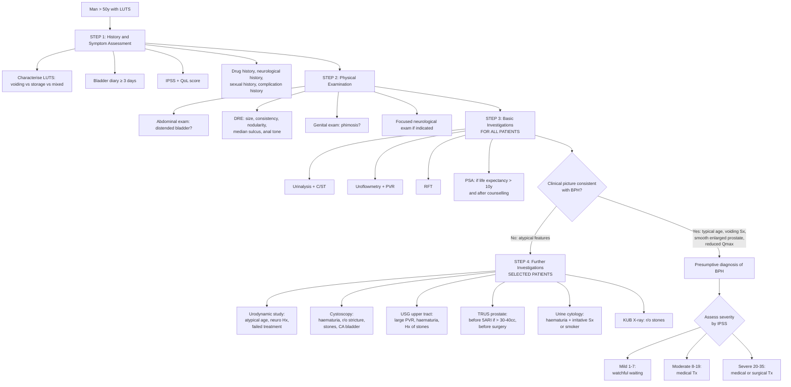

## Diagnostic Criteria, Diagnostic Algorithm, and Investigations for BPH

---

### 1. Diagnostic Criteria — How Do We "Diagnose" BPH?

Here's an important conceptual point that students often miss: **BPH is fundamentally a histological diagnosis** — you would need tissue to confirm hyperplasia under a microscope [2]. But in clinical practice, **we don't biopsy the prostate to diagnose BPH**. Instead, ***BPH is a presumptive clinical diagnosis*** based on a constellation of findings [3]:

***Diagnosis is presumed if*** [3]:

1. **History:** LUTS with ***predominantly voiding symptoms*** in a man ***typically aged 50–80*** [5]
2. **Physical examination:** Most importantly ***DRE*** showing:
   - ***Prostate: smooth, symmetrically enlarged (> 3 finger breadths), no nodules, with intact median groove and firm in consistency*** [3]
   - ***Others: impacted stools, perianal sensation/anal tone*** [3]
3. **Supportive investigations:** Uroflowmetry showing reduced Qmax, elevated PVR, and exclusion of other causes (UTI, CA prostate, neurogenic bladder)

The diagnostic process is therefore really about **two things simultaneously**:
- **Confirming** that the clinical picture is consistent with BPH
- **Excluding** other causes of LUTS (the differential diagnoses discussed previously)

<Callout title="BPH Is a Clinical Diagnosis of Exclusion">
There is no single definitive test that "diagnoses" BPH. It is a presumptive clinical diagnosis made when a man with voiding-predominant LUTS has a smooth, enlarged prostate on DRE, supportive uroflowmetry findings, and no features suggesting an alternative diagnosis (cancer, stricture, neurogenic cause). ***BOO itself is a urodynamic diagnosis*** [3][4] — but in straightforward BPH, urodynamics is not routinely needed.
</Callout>

---

### 2. Diagnostic Algorithm

The diagnostic approach follows a **tiered structure**: mandatory baseline assessment for all patients → optional investigations for selected patients. This is guided by international guidelines (EAU, AUA) and reflects what is taught in the HKU curriculum.

#### 2.1 Algorithm Overview

---

### 3. Investigation Modalities — Detailed Breakdown

I'm going to walk through each investigation in detail, explaining **what it is, why we do it, how to interpret it, and its pitfalls**. I'll organise them into **mandatory (baseline) investigations** and **optional (selected patients) investigations**, mirroring the lecture slides [9].

---

#### 3.1 MANDATORY BASELINE INVESTIGATIONS (For All Patients)

##### A. International Prostate Symptom Score (IPSS)

***IPSS and QoL scores: assess severity (guide treatment) and risk factor for progression*** [9].

| Aspect | Detail |
|---|---|
| **What it is** | A validated 7-question self-administered questionnaire + 1 QoL question |
| **What it measures** | ***Voiding symptoms:*** incomplete emptying, intermittency, weak stream, straining. ***Storage symptoms:*** frequency, urgency, nocturia [4] |
| **Scoring** | Each question 0–5; total 0–35. QoL scored 0–6 separately |
| **Interpretation** | ***Mild (1–7), Moderate (8–19), Severe (20–35)*** [4] |
| **Purpose** | ***Quantify severity of LUTS, predict treatment response, guide Tx decision, and monitor response to Tx*** [3][4] |
| **What it is NOT** | ***NOT a diagnostic tool*** — it doesn't tell you *why* the patient has LUTS, only how bad it is [4] |
| **Clinical use** | Guides whether to pursue watchful waiting (mild, not bothersome) vs medical Tx (moderate) vs surgical Tx (severe/refractory). Also used for serial monitoring: if IPSS drops significantly after starting an α-blocker, treatment is working |

##### B. Voiding Diary / Frequency-Volume Chart

***Voiding diary for at least 3 days, especially if frequency/nocturia*** [5].

| Aspect | Detail |
|---|---|
| **What it is** | Patient records time and volume of every void + fluid intake for ≥3 days |
| **Why we do it** | Distinguishes **nocturnal polyuria** (> 33% of 24h urine at night) from **reduced functional bladder capacity** from **global polyuria** |
| **Key findings** | High 24h urine output → polyuria (DM, DI, polydipsia). High nocturnal fraction → nocturnal polyuria (CHF, OSA). Frequent small-volume voids → ↓ functional capacity (OAB, BOO) |
| **Significance** | Prevents misattributing nocturia to BPH when the real problem is CHF or nocturnal polyuria |

##### C. Urinalysis and Urine Culture

***Urine microscopy and culture: rule out UTI*** [9].

| Aspect | Detail |
|---|---|
| **What it is** | Dipstick ± microscopy ± culture and sensitivity (C/ST) |
| **What to look for** | ***Blood*** (haematuria → consider CA bladder, stones, BPH bleeding), ***WBC/pyuria*** (UTI, prostatitis), ***bacteria*** (UTI), ***nitrites*** (Gram-negative UTI), ***glucose*** (DM as contributor to polyuria) [3][8] |
| **Why it's essential** | UTI can mimic or coexist with BPH. A man with irritative LUTS and pyuria may have a UTI as the primary or contributory cause. You must rule this out before attributing everything to BPH |
| **Urine C/ST** | Confirms UTI and guides antibiotic selection |

##### D. Uroflowmetry and Post-Void Residual (PVR)

***Uroflowmetry and post-void residual urine (PVR)*** [9]:

This is the **key objective functional test** for BPH evaluation. Let me explain it from first principles.

**How it works:** The patient urinates into a funnel connected to a weight transducer that measures the volume of urine accumulating per unit time. This generates a **flow-time curve**. PVR is then measured by ultrasound immediately after voiding.

**Validity requirement:** ***Volume voided must be > 150 mL to be representative of usual voiding habit*** [5]. If the patient only voids 50 mL, the test is unreliable — the detrusor may not have generated its maximum contraction.

| Parameter | Normal | Abnormal / BPH | Significance |
|---|---|---|---|
| ***Peak flow rate (Qmax)*** | ***> 15 mL/s in males*** [3][4] | ***< 15 mL/s*** | The lower the Qmax, the higher the probability of BOO |
| **Flow pattern** | ***Bell-shaped*** (smooth, single peak) [3][4] | ***Reduced peak with prolonged tail*** (BPH); ***Plateaued/flat*** (urethral stricture); ***Multiple peaks*** (straining pattern) [5] | Pattern helps distinguish type of obstruction |
| **Post-void residual** | ***< 50 mL*** (young), ***< 100–200 mL*** acceptable in elderly [3][4] | ***> 150 mL concerning*** | High PVR suggests incomplete emptying → risk of UTI, stones, upper tract damage |

**Qmax interpretation — probability of BOO** [9][3][4]:

| Qmax | Probability of BOO | Clinical Implication |
|---|---|---|
| ***< 10 mL/s*** | ***~90% obstructed*** | High probability of BOO. ***Better outcome after TURP*** (prognostic value!) [5] |
| ***10–15 mL/s*** | ***~60% obstructed*** | Equivocal — may need urodynamics to confirm |
| ***> 15 mL/s*** | ***~30% obstructed*** (i.e., ***90% chance of NO BOO***) | Can effectively ***rule out clinically important BOO*** [3]. But note: 18% with obstruction despite Qmax > 15 mL/s [3][4] |

<Callout title="Uroflowmetry Pitfalls" type="error">
***Uroflowmetry alone is NOT sufficient to diagnose outlet obstruction!*** [3][4]. It ***cannot distinguish BOO from detrusor underactivity (DUA)*** — both produce ↓ Qmax. A man with a weak bladder (e.g., diabetic cystopathy) will have a low flow rate but the problem is the motor, not the pipe. Also, ***18% of men have obstruction despite Qmax > 15 mL/s*** [3][4]. So a "normal" Qmax does not completely exclude BOO if symptoms are disproportionately severe.
</Callout>

**Uroflow curve patterns — visual interpretation:**

| Pattern | Appearance | Diagnosis |
|---|---|---|
| **Normal** | Smooth bell-shaped curve, single peak at ~15–25 mL/s | No obstruction |
| **BPH pattern** | ↓ peak, prolonged flow time, may have slightly irregular contour | BOO from prostatic enlargement |
| **Urethral stricture** | ***Plateaued*** (flat-topped) curve at low Qmax | Fixed narrowing produces constant low flow regardless of detrusor effort |
| **Straining pattern** | ***Multiple peaks*** (sawtooth) | Patient is using abdominal straining (Valsalva) to empty, causing intermittent flow bursts [5] |
| **DUA pattern** | Low, prolonged curve (similar to BPH but with ↓ detrusor pressure on urodynamics) | Weak bladder — uroflowmetry alone cannot distinguish this from BOO |

##### E. Blood Tests

***Blood tests*** [9]:

| Test | Purpose | Key Findings & Interpretation |
|---|---|---|
| ***CBC and clotting profile*** | ***To prepare for surgery*** [9]; anaemia screening | Anaemia may suggest chronic disease or haematuria-related loss |
| ***Renal function test (RFT)*** | ***Obstructive uropathy*** [9] | ***High serum creatinine can result from bladder outlet obstruction or underlying renal disease — which should prompt an USG*** [8]. Bilateral hydronephrosis from chronic BPH → ↓ GFR → ↑ creatinine |
| **Glucose** | DM is a risk factor for BPH and contributes to LUTS (polyuria, diabetic cystopathy) [4] | Elevated glucose → consider DM as co-contributor to LUTS |
| ***PSA*** | ***Only for patients with life expectancy > 10 years and after detailed counselling. DO NOT CHECK PSA during retention or UTI*** [9] | See dedicated section below |

##### F. Serum PSA — Detailed Interpretation

PSA = ***Prostate-Specific Antigen***. It is a serine protease whose physiological role is to liquefy the seminal coagulum after ejaculation. It is produced by both normal and neoplastic prostatic epithelial cells.

***Key principles*** [8][9]:
- ***Prostate-specific but NOT prostate-cancer specific*** [8]
- ***PSA level predicts prostate volume and risk for BPH progression*** — ***PSA > 1.5 ng/mL is a useful marker for prostatic enlargement and predicts an increased risk of BPH progression*** [8]
- ***PSA is controversial in BPH workup — probably not routinely indicated but often taken*** [4]. ***EAU guideline: measured if diagnosis of CA prostate will change management*** [3][4]
- ***DO NOT CHECK PSA during retention or UTI*** [9] — both conditions artificially elevate PSA (disrupted prostate architecture in AROU, inflammation in UTI)

**PSA interpretation** [8]:

| PSA Level | Interpretation |
|---|---|
| ***< 4 ng/mL*** | ***Normal*** |
| ***≥ 4 ng/mL*** | ***Cutoff for considering diagnostic prostate biopsy*** |
| ***4–10 ng/mL*** | ***~20% chance of cancer*** ("grey zone") |
| ***≥ 10 ng/mL*** | ***~50% chance of cancer*** |

**Conditions that ↑ PSA** [8]:

| Category | Conditions |
|---|---|
| **Benign** | ***BPH, prostatitis*** (returns to baseline 6–8 weeks after resolution), ***prostatic infarction, AROU*** (↓ by 50% within 1–2 days; ***do NOT screen PSA for ≥2 weeks after AROU***), ***perineal trauma*** |
| **Manipulation** | ***Cycling***, prostatic massage, prostate biopsy, TURP, ejaculation (minor, transient) |
| **Malignant** | ***Prostate cancer*** |
| **Drugs that ↓ PSA** | ***5α-reductase inhibitors*** (reduce PSA by ~50% after 6 months — must multiply measured PSA by 2 for accurate interpretation!) |

<Callout title="PSA in BPH — Dual Role" type="idea">
PSA serves two purposes in BPH workup: (1) **Rule out prostate cancer** — elevated PSA warrants further workup. (2) **Predict BPH progression** — PSA > 1.5 ng/mL correlates with larger prostate volume and higher risk of AROU/need for surgery. This is why PSA can guide the decision to start a 5ARI (more benefit if prostate > 30–40cc) [8][9].
</Callout>

##### G. KUB X-ray

***KUB: look for stone*** [9].

| Aspect | Detail |
|---|---|
| **What it is** | Plain abdominal radiograph (Kidneys, Ureters, Bladder) |
| **Why** | Detects **radio-opaque urinary stones** (calcium-containing stones are visible; uric acid and cystine stones may be radiolucent) |
| **Relevance to BPH** | Bladder stones (complication of BPH from urinary stasis) may be visible as calcification in the pelvis. Also detects incidental renal stones |
| **Limitations** | Cannot visualise soft tissue pathology, radiolucent stones, or upper tract obstruction |

---

#### 3.2 OPTIONAL INVESTIGATIONS (Selected Patients)

***Optional investigations*** [9]:

##### A. Transrectal Ultrasound of Prostate (TRUS)

***TRUS*** [9]:

| Aspect | Detail |
|---|---|
| **What it is** | Ultrasound probe inserted per rectum to image the prostate |
| **Indications** | ***Before starting 5α-reductase inhibitors for prostate > 30–40cc*** (because 5ARIs only work if the prostate is large enough — need to confirm volume). ***Before surgery to decide modality of surgical intervention*** [9] (prostate volume determines whether TURP, HoLEP, or open prostatectomy is appropriate) |
| **What it measures** | Prostate volume (cc), prostate morphology, ***intravesical prostatic protrusion (IPP)*** [3] |
| **Key findings** | Enlarged transitional zone, median lobe enlargement protruding into bladder (IPP). IPP > 10 mm is associated with higher BOO severity and may predict failure of trial without catheter (TWOC) |
| **Limitations** | ***No TRUS finding consistently indicates cancer with certainty — NOT used for staging of prostate cancer*** [8]. Cancer can be hyperechoic, isoechoic, or hypoechoic |

##### B. Flexible Cystoscopy

***Flexible cystoscopy: haematuria*** [9].

| Aspect | Detail |
|---|---|
| **What it is** | Flexible fibre-optic scope passed per urethra into bladder under local anaesthetic |
| **Indications** | ***Haematuria*** (to r/o CA bladder, bladder stones), suspected ***urethral stricture***, atypical LUTS. Also used before surgery to assess urethral patency and bladder neck anatomy [3] |
| **Key findings in BPH** | Enlarged median lobe, trabeculated bladder wall (from detrusor hypertrophy), bladder diverticula, bladder stones. Can also identify bladder tumours, urethral strictures |
| **Why not routine** | Invasive (even if flexible), uncomfortable, risk of UTI. Not needed if clinical picture is straightforward BPH |

##### C. Upper Tract Imaging (USG / CT Urogram)

***USG / CT urogram: haematuria*** [9].

| Aspect | Detail |
|---|---|
| **Indications** | ***Large residual volume (for obstruction), haematuria, or history of urolithiasis*** [3] |
| **USG kidneys** | Non-invasive, no radiation. Detects hydronephrosis (back-pressure from BOO), renal stones, renal masses, cortical thinning (chronic obstruction). Also measures kidney size |
| **CT urogram** | More sensitive than USG for stones, urothelial tumours, and anatomical detail. Used for haematuria workup to exclude upper tract TCC and RCC. Higher radiation and contrast exposure |
| **Why not routine** | Most BPH patients have normal upper tracts. Only needed when clinical suspicion of upper tract involvement |

**Key findings suggesting upper tract complications:**
- **Bilateral hydronephrosis** → chronic retention → obstructive uropathy
- **Cortical thinning** → chronic damage, may be irreversible
- **Stones** → bladder or renal
- **Renal mass** → RCC (separate pathology, needs independent workup)

##### D. Urodynamic Study

***Urodynamic study: atypical age, suspected neurogenic bladder, history of spinal/pelvic surgery, failed intervention*** [9].

This is the ***gold standard for diagnosis of BOO*** [3][4]. Let me explain the principles from scratch.

**Why do we need urodynamics?** Uroflowmetry tells you the flow rate is low, but it cannot tell you *why*. There are two possible scenarios for a low Qmax:
1. **BOO:** The outlet is blocked → the detrusor contracts hard (↑ pressure) but flow is still low
2. **Detrusor underactivity (DUA):** The bladder muscle is weak → ↓ pressure AND ↓ flow

Urodynamics distinguishes these by **simultaneously measuring detrusor pressure AND flow rate**.

**Procedure** [3][4]:
1. **Catheter insertion:** Dual-lumen catheter into bladder (one channel fills bladder with contrast/saline, one measures intravesical pressure)
2. **Rectal balloon catheter:** Measures intra-abdominal pressure (as a surrogate)
3. **Detrusor pressure calculation:** ***Detrusor pressure = Intravesical pressure – Intra-abdominal pressure*** [3][4]
4. During **filling phase:** Assess bladder compliance, capacity, sensation, and presence of uninhibited detrusor contractions (OAB)
5. During **voiding phase:** Measure detrusor pressure while simultaneously recording uroflow rate
6. Additional: EMG of external sphincter (usually not done), contrast cystogram for reflux assessment

**Key findings** [3][4]:

| Pattern | Detrusor Pressure | Uroflow (Qmax) | Diagnosis |
|---|---|---|---|
| ***Normal*** | Normal | Normal | No pathology |
| ***BOO*** | ***↑ (high)*** | ***↓ (low)*** | ***Bladder outlet obstruction*** — the bladder is trying hard but can't get urine out |
| ***DUA*** | ***↓ (low)*** | ***↓ (low)*** | ***Detrusor underactivity*** — the bladder isn't generating enough contractile force |
| ***OAB / Detrusor overactivity*** | Involuntary contractions during filling | Variable | Overactive bladder — uninhibited contractions during filling phase |

**Indications for urodynamics** (not routine! only selected patients) [3][4][9]:
- ***Suspicious for non-BPH cause:*** history of neurological disease, young age < 50y
- ***Failed initial treatment*** for presumed BOO (suggests the initial diagnosis may be wrong)
- ***Before surgery*** if diagnosis is uncertain (you don't want to do a TURP on a patient with DUA — it won't help!)
- ***History of spinal/pelvic surgery*** [9]
- ***Atypical age*** [9]

<Callout title="When Urodynamics Changes Management" type="idea">
Imagine a 45-year-old man with voiding LUTS, Qmax of 8 mL/s, and a history of lumbar disc surgery. Is this BOO from early BPH, or DUA from a neurogenic bladder? Uroflowmetry can't tell you. Urodynamics shows ↓ detrusor pressure + ↓ flow → DUA. TURP would be useless and potentially harmful (removing tissue won't help if the problem is a weak bladder). Instead, this patient needs clean intermittent self-catheterisation (CISC). This is why urodynamics matters.
</Callout>

##### E. Urine Cytology

***Urine cytology: indicated if bladder cancer is suspected — patients presenting with haematuria and predominantly irritative symptoms*** [3][8].

| Aspect | Detail |
|---|---|
| **What it is** | Fresh urine sent for cytopathological examination of shed urothelial cells |
| **Sensitivity** | Overall ~50%, highest for high-grade CA bladder (can detect CIS before gross lesion visible). Low detection rate for low-grade cancer [4] |
| **When to order** | Haematuria + irritative symptoms + smoker (high risk for CA bladder). Not routine in straightforward BPH |

---

### 4. Summary Table: Investigations at a Glance

| Investigation | Category | Purpose | Key Thresholds / Findings |
|---|---|---|---|
| ***IPSS + QoL*** | Mandatory | Quantify LUTS severity, guide Tx | Mild 1–7, Moderate 8–19, Severe 20–35 |
| ***Voiding diary ≥ 3 days*** | Mandatory | Distinguish polyuria vs ↓ capacity | Nocturnal fraction > 33% = nocturnal polyuria |
| ***Urinalysis + C/ST*** | Mandatory | R/o UTI, detect haematuria | Pyuria, bacteriuria, haematuria |
| ***Uroflowmetry + PVR*** | Mandatory | Screen for BOO, assess emptying | Qmax < 15 = suspicious; PVR > 150 = concerning |
| ***RFT*** | Mandatory | R/o obstructive uropathy | ↑ Creatinine → prompt USG |
| ***CBC + clotting*** | Mandatory | Surgical preparation, anaemia | — |
| ***PSA*** | Mandatory (if life expectancy > 10y) | R/o CA prostate, predict BPH progression | < 4 normal; 4–10 grey zone (20% CA); ≥ 10 suspicious (50% CA) |
| ***KUB*** | Mandatory | R/o stones | Radio-opaque calcification in pelvis |
| ***TRUS*** | Optional | Prostate volume for 5ARI/surgery planning | > 30–40cc for 5ARI; determines surgical approach |
| ***Cystoscopy*** | Optional | R/o stricture, stones, CA bladder | Trabeculation, diverticula, median lobe, stones, tumour |
| ***USG / CT upper tract*** | Optional | R/o hydronephrosis, stones, tumour | Bilateral hydronephrosis, cortical thinning, masses |
| ***Urodynamics*** | Optional | Gold standard for BOO diagnosis | BOO: ↑ Pdet + ↓ Qmax; DUA: ↓ Pdet + ↓ Qmax |
| ***Urine cytology*** | Optional | Screen for CA bladder | High-grade urothelial cells |

---

### 5. Diagnostic Approach by Clinical Scenario

To make this practical, here's how the investigations flow depending on the clinical picture:

| Scenario | Baseline + | Additional Investigations Needed |
|---|---|---|
| **Straightforward BPH** (man > 50, voiding LUTS, smooth enlarged prostate, no red flags) | IPSS, urinalysis, uroflowmetry, RFT, PSA | Usually none — treat empirically |
| **Haematuria present** | As above | ***Cystoscopy*** (r/o CA bladder), ***USG/CT urogram*** (upper tract), ***urine cytology*** if irritative symptoms/smoker [3][9] |
| **Large PVR (> 150 mL) or ↑ creatinine** | As above | ***USG upper tract*** (hydronephrosis?), ***USG prostate*** (volume for surgical planning) |
| **Young patient (< 50y)** | As above | ***Urodynamics*** (r/o DUA, neurogenic bladder), consider ***cystoscopy*** (stricture?) [9] |
| **History of neurological disease** | As above | ***Urodynamics*** (mandatory — LUTS more likely due to neurogenic cause) [3][9] |
| **Failed initial medical treatment** | As above | ***Urodynamics*** (confirm BOO before surgery), ***cystoscopy*** |
| **Considering 5ARI therapy** | As above | ***TRUS*** to confirm ***prostate > 30–40cc*** [9] |
| **Considering surgery** | As above | ***TRUS*** (volume → choose surgical modality), ***urodynamics*** if diagnosis uncertain [9] |

---

<Callout title="High Yield Summary">

**Diagnosis of BPH is presumptive and clinical:**
- History of voiding-predominant LUTS in a man > 50y
- DRE: smooth, enlarged (> 3FB), firm, no nodules, intact median groove
- Supported by uroflowmetry (↓ Qmax) and exclusion of other causes

**Mandatory investigations for ALL patients:**
- IPSS + QoL (severity, guide Tx), voiding diary ≥ 3 days, urinalysis + C/ST, uroflowmetry + PVR, RFT, CBC, PSA (if life expectancy > 10y + after counselling), KUB

**Key uroflowmetry interpretation:**
- Qmax < 10: ~90% BOO; 10–15: ~60% BOO; > 15: ~90% no BOO
- Volume voided must be > 150 mL for valid test
- Cannot distinguish BOO from DUA — urodynamics needed for this

**PSA rules:**
- DO NOT check during AROU or UTI
- PSA > 1.5 predicts BPH progression; PSA ≥ 4 warrants consideration of biopsy; PSA ≥ 10 → 50% chance of cancer
- 5ARIs halve PSA — multiply by 2 for true value

**Optional investigations — know the indications:**
- TRUS: before 5ARI (prostate > 30–40cc) or before surgery
- Cystoscopy: haematuria, suspected stricture/CA bladder
- Urodynamics: gold standard for BOO; indicated for atypical age, neurological disease, failed treatment, pre-surgical uncertainty
- USG upper tract: large PVR, haematuria, stone history

**Urodynamics key patterns:** BOO = ↑ Pdet + ↓ Qmax; DUA = ↓ Pdet + ↓ Qmax

</Callout>

---

<ActiveRecallQuiz
  title="Active Recall - Diagnosis and Investigations of BPH"
  items={[
    {
      question: "What are the three clinical criteria that allow a presumptive diagnosis of BPH?",
      markscheme: "1. History of LUTS with predominantly voiding symptoms in a man typically aged 50-80. 2. DRE showing smooth, symmetrically enlarged prostate (>3FB), no nodules, intact median groove, firm consistency. 3. Supportive uroflowmetry (reduced Qmax) with exclusion of other causes (UTI, CA prostate, neurogenic bladder)."
    },
    {
      question: "A uroflowmetry shows Qmax of 8 mL/s with voided volume of 200 mL. What is the probability of BOO? Why can you NOT definitively diagnose BOO from this result alone?",
      markscheme: "Qmax < 10 mL/s corresponds to approximately 90% probability of BOO. However, uroflowmetry alone cannot distinguish BOO (high detrusor pressure + low flow) from detrusor underactivity (low detrusor pressure + low flow). Both produce reduced Qmax. Urodynamic study is the gold standard to differentiate these (measures detrusor pressure simultaneously with flow)."
    },
    {
      question: "List three specific clinical indications for urodynamic study in a man with LUTS.",
      markscheme: "Any three of: (1) Atypical age (< 50 years), (2) History of neurological disease (suspected neurogenic bladder), (3) Failed initial medical treatment for presumed BOO, (4) History of spinal or pelvic surgery, (5) Diagnostic uncertainty before surgical intervention."
    },
    {
      question: "When should you NOT check serum PSA in a man with LUTS? Give two situations and explain why.",
      markscheme: "1. During acute retention of urine (AROU): prostatic oedema and ischaemia from bladder distension disrupt prostate architecture, artificially elevating PSA. Wait at least 2 weeks after resolution. 2. During UTI: prostatic inflammation elevates PSA (returns to baseline 6-8 weeks after resolution). In both cases, falsely elevated PSA leads to unnecessary biopsy."
    },
    {
      question: "What are the two specific indications for TRUS in the workup of BPH as listed in the lecture slides?",
      markscheme: "1. Before starting 5-alpha-reductase inhibitors (to confirm prostate volume > 30-40cc, as 5ARIs only effective for larger prostates). 2. Before surgery (to decide modality of surgical intervention based on prostate volume)."
    },
    {
      question: "On urodynamics, what finding pattern distinguishes BOO from detrusor underactivity? State the detrusor pressure and uroflow findings for each.",
      markscheme: "BOO: increased (high) detrusor pressure + decreased (low) uroflow rate (bladder contracting hard against obstruction). Detrusor underactivity (DUA): decreased (low) detrusor pressure + decreased (low) uroflow rate (weak bladder contraction). Detrusor pressure = intravesical pressure minus intra-abdominal pressure."
    }
  ]}
/>

---

## References

[2] Senior notes: felixlai.md (sections on prostate anatomy, BPH overview, investigations)
[3] Senior notes: Ryan Ho Urogenital.pdf (p170–173, LUTS evaluation, uroflowmetry, urodynamics, BPH diagnosis and investigations)
[4] Senior notes: Ryan Ho Fundamentals.pdf (p355–357, LUTS approach, IPSS, uroflowmetry, urodynamics)
[5] Senior notes: maxim.md (BPH investigations section — IPSS, voiding diary, uroflowmetry, TRUS)
[8] Senior notes: felixlai.md (sections on PSA interpretation, urine cytology, causes of elevated PSA)
[9] Lecture slides: Benign Prostatic Hyperplasia.pdf (p12, p18 — investigations mandatory and optional)
