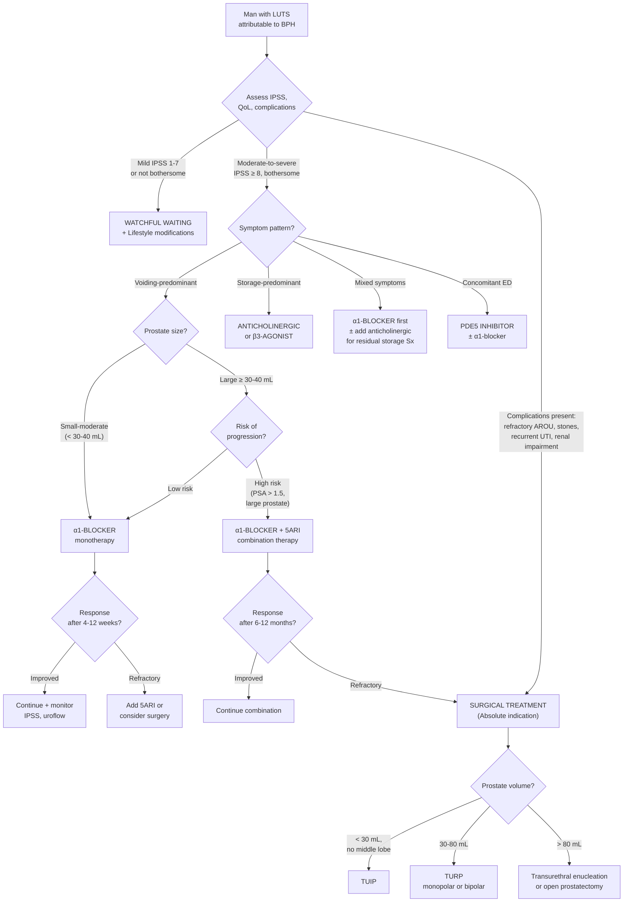

## Management of BPH — Algorithm, Treatment Modalities, Indications and Contraindications

---

### 1. Guiding Principles of BPH Management

Before diving into specifics, understand the management philosophy:

***Nowadays, LUTS are managed as a whole based on individual symptom profile (EAU 2017)*** [3]. This means we don't just treat "the prostate" — we treat the **patient's specific symptoms**. A man with voiding-predominant LUTS gets different treatment from one with storage-predominant LUTS, even if both have BPH.

Management is **tiered** — conservative first, then medical, then surgical — guided by:
1. **Symptom severity** (IPSS score)
2. **Bother level** (QoL score — a patient with moderate IPSS but "delighted" QoL doesn't need aggressive treatment)
3. **Presence of complications** (complications = absolute indication for surgery)
4. **Prostate size** (determines drug choice and surgical modality)
5. **Risk of disease progression** (larger prostate, higher PSA > 1.5 predict progression)

---

### 2. Management Algorithm Overview

***Treatment of BPH*** [10]:
- ***Watchful waiting***
- ***Medical therapy:***
  - ***α-blockers***
  - ***5α-reductase inhibitors***
  - ***Anticholinergics for storage symptoms***
  - ***Beta 3 agonist for storage symptoms***
- ***Surgery***

---

### 3. Conservative Management — Watchful Waiting

| Aspect | Detail |
|---|---|
| **Who** | ***Mild/moderate symptoms, not bothersome*** [3] — i.e. IPSS 1-7 or even moderate IPSS with good QoL |
| **What it involves** | ***Lifestyle advice only*** [3] |
| **Rationale** | BPH often progresses slowly. Many men have stable symptoms for years. Intervention carries side effects. If symptoms aren't bothering the patient, the risk-benefit of treatment doesn't favour intervention |

***Lifestyle modifications*** [8][5]:
- ***Avoid fluids prior to bedtime or before going out*** [8] — reduces nocturia and urgency episodes when away from toilet
- ***Reduce consumption of caffeine and alcohol*** [8] — caffeine is a bladder irritant (stimulates detrusor); alcohol is a diuretic (ADH suppression) + sedating (may impair ability to wake for nocturia)
- ***Double voiding to empty bladder more completely*** [8] — void, wait 30 seconds, try again; allows residual urine in the prostatic urethra to drain
- **Timed voiding** — urinate by the clock (every 2-3 hours) rather than waiting for urgency
- **Bladder training** — gradually increase intervals between voids to increase functional capacity
- **Review medications** — stop or substitute drugs that worsen LUTS (anticholinergics, sympathomimetics, diuretics timing)
- **Manage constipation** — loaded rectum compresses urethra

---

### 4. Medical Treatment

#### 4.1 α1-Adrenergic Antagonists (α-Blockers) — First-Line for Voiding Symptoms

***α-blockers*** [10] are the **most commonly prescribed** first-line medical therapy for BPH.

**Mechanism of action — from first principles:**

The prostate stroma is rich in **smooth muscle** with abundant **α1-adrenergic receptors** (particularly the **α1A** subtype). Sympathetic nervous system activation causes contraction of this smooth muscle → ***dynamic component*** of BOO. α-blockers ***inhibit contraction of bladder neck/prostatic smooth muscle (controlled by α1A adrenergic receptors) → ↓ dynamic component of obstruction*** [3].

Think of it this way: the prostate has two elements squeezing the urethra — **tissue bulk** (static, from hyperplasia) and **muscle tone** (dynamic, from α1 receptor-mediated contraction). α-blockers relax the muscle tone.

| Feature | Detail |
|---|---|
| **MoA** | Block α1-adrenergic receptors on prostatic/bladder neck smooth muscle → relaxation → ↓ dynamic obstruction [3] |
| **Efficacy** | ***30-40% ↓ IPSS and 16-25% ↑ uroflow*** [3]. ***Onset ~3 days*** (cf > 6 months for 5ARI) [3]. More effective than 5ARI in both short and long-term for symptom relief |
| **Key limitation** | ***No effect on PSA or prostate size*** [3] → ***no effect on long-term risk of AROU or need for surgery*** [3]. They treat symptoms but don't modify disease progression |
| **Indications** | ***Moderate-to-severe LUTS (not storage-predominant)*** [3] |

**Drug classification — uroselective vs non-selective:**

| Type | Drugs | Selectivity | Advantages | Disadvantages |
|---|---|---|---|---|
| ***Non-selective α1-blockers*** | ***Prazosin (Minipress), Terazosin (Hytrin), Doxazosin (Cardura), Alfuzosin (Xatral)*** [5] | Block α1A, α1B, α1D equally | Originally developed as anti-hypertensives — can be useful if patient also has HTN | ***More orthostatic hypotension, nasal congestion, dizziness, tiredness*** [5] — because α1B on blood vessels is also blocked → vasodilation → ↓ BP |
| ***Selective α1A-blockers (uroselective)*** | ***Tamsulosin (Harnal/Flomax), Silodosin (Rapaflo)*** [5] | Selective for α1A subtype (predominant in prostate) | ↓ effect on vessels, BP and HR → fewer cardiovascular side effects | ***More retrograde ejaculation*** [5] — because α1A receptors also control bladder neck closure during ejaculation; blocking them → semen goes backward into bladder |

***Side effects of α-blockers*** [3][5]:
- ***General:*** ***postural hypotension (5%)***, ***dizziness (5-15%)***, ***lethargy (5-15%)***, ***headache (5-15%)*** [3]
- ***Sexual:*** ***retrograde ejaculation (3-10% for tamsulosin)***, erectile dysfunction (may ↑ or ↓) [3]
- **Intraoperative floppy iris syndrome (IFIS):** α1A receptors are present in the iris dilator muscle. α-blockers (especially tamsulosin) can cause the iris to billow and prolapse during cataract surgery. **Always ask about ophthalmic surgical plans before starting!**

***To reduce side effects: slow titration, subtype-selective (α1A), slow-release formulations*** [5].

<Callout title="α-Blocker Pearl — Speed vs Disease Modification">
α-blockers work **fast** (days) and are great for symptom relief, but they **do not shrink the prostate** and **do not prevent disease progression** (AROU, need for surgery). Think of them as "opening the tap" by relaxing the muscle squeeze, but the underlying tissue mass keeps growing. This is why we add 5ARIs for patients at risk of progression.
</Callout>

#### 4.2 5α-Reductase Inhibitors (5ARIs) — For Large Prostates / Disease Modification

***5α-reductase inhibitors*** [10]:

**Mechanism of action — from first principles:**

The name tells you the target: **5α-reductase** is the enzyme that converts testosterone → **DHT** (the more potent androgen driving prostatic growth). By inhibiting this enzyme, 5ARIs ***reduce DHT → decrease size of prostate + decrease vascularity (less bleeding) + progression prevention*** [5].

| Feature | Detail |
|---|---|
| **Drugs** | ***Finasteride (Proscar)*** — type 2 selective; ***Dutasteride (Avodart)*** — dual type 1 + 2 inhibitor [3] |
| **MoA** | ***↓ conversion of testosterone into DHT → ↓ prostate size → ↓ mechanical (static) component of obstruction*** [3] |
| **Efficacy** | ***↓ prostate size ~20%, ↓ risk of urinary retention and surgery (10-15%)*** — benefit ***NOT seen with α-blockers*** alone [3]. But ***takes 6-12 months to be effective (patient should be informed!)*** [3] |
| **Indications** | ***Moderate-to-severe LUTS + large prostate (> 30-40 mL)*** [3]. ***Preferred for larger glands ≥ 30-40 mL (TRUS) / IPSS ≥ 12*** [5]. Also used for BPH-related haematuria (↓ prostatic vascularity → ↓ bleeding) |
| **Why size matters** | 5ARIs shrink the gland by ~20%. If the prostate is 20g, a 20% reduction is only 4g — clinically insignificant. But if it's 60g, a 20% reduction is 12g — much more meaningful. This is why ***TRUS to confirm prostate > 30-40cc is recommended before starting 5ARI*** [9] |

***Side effects of 5ARIs*** [3][5]:
- ***Sexual dysfunction:*** ***↓ libido, erectile dysfunction (10%), ejaculatory disorders*** → ***irreversible in 50%*** [3]
- ***Gynaecomastia (1%)*** [3] — ↓ DHT → altered androgen/oestrogen ratio → breast tissue proliferation
- ***↑ suicidal thoughts, depression, ↑ cardiac failure*** [3]
- ***Effect on PSA:*** ***50% decrease in PSA*** [5] — critical clinical point: ***multiply PSA by 2 when screening for CA prostate*** in a patient on 5ARI [5]
- ***Effect on CA prostate: PCPT trial shows ↓ risk of CA prostate but ↑ risk of high-grade CA*** [3] — controversial; should evaluate for CA prostate by DRE and PSA before starting

<Callout title="The PSA Halving Rule" type="error">
A man on finasteride has a PSA of 3.0 ng/mL. His ***true PSA is approximately 6.0 ng/mL*** (3.0 × 2). This puts him above the 4 ng/mL biopsy threshold! If you don't adjust for the 5ARI effect, you'll miss a potentially significant PSA elevation. ***Always multiply measured PSA by 2 in patients on 5ARIs*** [5].
</Callout>

#### 4.3 Combination Therapy — α-Blocker + 5ARI

***α1-blocker + 5ARI*** [3]:

| Feature | Detail |
|---|---|
| **Drugs** | ***Duodart (dutasteride + tamsulosin)*** [3] — single combination pill |
| **Indications** | ***Moderate-to-severe LUTS + ↑ risk of disease progression*** [3] (large prostate, high PSA, severe symptoms). Also: severe symptoms, large prostate, or poor response to monotherapy [3] |
| **Rationale** | α-blocker provides rapid symptom relief (days); 5ARI provides slow but sustained prostate shrinkage and disease modification (months). Together, they address both the dynamic AND static components |
| **Evidence** | ***More effective than either monotherapy alone in ↓ relative risk of BPH clinical progression*** [3]. MTOPS and CombAT trials showed significant reduction in risk of AROU and need for surgery with combination vs monotherapy |
| **Downsides** | Combined side effects of both drugs; cost |

#### 4.4 PDE5 Inhibitors — For BPH with Erectile Dysfunction

***PDE5 inhibitor (Tadalafil/Cialis)*** [5]:

**Mechanism — from first principles:**

PDE5 = **phosphodiesterase type 5**. This enzyme breaks down cGMP (cyclic guanosine monophosphate) in smooth muscle cells. By inhibiting PDE5, cGMP accumulates → smooth muscle relaxation. In the prostate and bladder, this means:
- ***PDE5-mediated reduction in smooth muscle and endothelial cell proliferation*** [8]
- ***Increases smooth muscle relaxation and perfusion to prostate and bladder*** [8]

| Feature | Detail |
|---|---|
| **Drug** | ***Tadalafil (Cialis)*** — daily low-dose (5 mg) [8] |
| **Indications** | ***Indicated in patients who also have erectile dysfunction*** [8]. ***PDE5I especially useful for those with erectile dysfunction*** [3] |
| **Contraindication** | ***Avoid if using nitrate*** [5] — both PDE5I and nitrates ↑ cGMP → synergistic profound vasodilation → life-threatening hypotension |
| **Side effects** | ***Hypotension, blue and blurred vision*** (***cross-reaction with PDE6 in retina*** [8]), ***hearing loss, flushing, headache, dyspepsia*** [8] |
| **Advantage** | Treats both LUTS and ED simultaneously — very appealing for many men |

#### 4.5 Drugs for Storage Symptoms — Anticholinergics and β3-Agonists

For patients with ***storage-predominant LUTS*** (frequency, urgency, nocturia) or residual storage symptoms after α-blocker treatment:

##### A. Anticholinergics (Muscarinic Antagonists)

***Anticholinergics for storage symptoms*** [10]:

**Mechanism:** The detrusor muscle contracts via **muscarinic (M3) receptors** activated by acetylcholine from parasympathetic nerves. Anticholinergics block these receptors → ↓ uninhibited detrusor contractions → ↓ urgency, frequency.

| Feature | Detail |
|---|---|
| **Drugs** | Oxybutynin, ***Solifenacin*** [5] |
| **Indications** | ***Storage-predominant moderate-to-severe LUTS*** [3]; ***residual storage symptoms after α-blocker/PDE5I treatment*** [3] |
| **Contraindication** | ***C/I if PVR > 150 mL due to risk of AROU*** [5] — if you suppress the detrusor in a patient who already can't empty properly, you'll tip them into retention |
| **Side effects** | ***Dry mouth, dry eye, constipation, cognitive impairment*** [5] — all due to systemic muscarinic blockade (M receptors are everywhere: salivary glands, lacrimal glands, GI tract, CNS) |
| **Caution** | ***Use with caution if post-void residual > 150 mL*** [3] — monitor PVR when initiating |

##### B. β3-Adrenergic Agonists

***Beta 3 agonist for storage symptoms*** [10]:

**Mechanism — from first principles:**

The bladder detrusor has **β3-adrenergic receptors** on its surface. During the storage phase, sympathetic activation of these β3 receptors causes ***relaxation of detrusor smooth muscle*** → allows the bladder to fill at low pressure without triggering urge to void. Mirabegron mimics this.

| Feature | Detail |
|---|---|
| **Drug** | ***Mirabegron*** [5] |
| **MoA** | ***Activating β3-adrenergic receptors → relaxation of detrusor smooth muscle during urine storage phase*** [8] |
| **Efficacy** | ***Effective as other anticholinergics in reducing frequency, urgency and incontinence*** [8] |
| **Key advantage** | ***Does not have the same concern for urinary retention as anticholinergic medications*** [8] — because it doesn't block detrusor contraction during voiding (contraction is parasympathetic/muscarinic, not β3) |
| **Side effects** | ***Elevated BP (> 10%)*** [5] — β3 receptors are also present on blood vessels |
| **When to choose** | Preferred over anticholinergics in patients with large PVR (lower AROU risk), cognitive impairment (no antimuscarinic CNS effects), or dry mouth intolerance |

<Callout title="Anticholinergic vs β3-Agonist — When to Choose Which" type="idea">
Both treat storage symptoms. Choose **anticholinergics** when PVR is low (< 150 mL), no cognitive concerns, and drug is affordable. Choose ***β3-agonist (mirabegron)*** when PVR is borderline, patient is elderly with cognitive concerns, or has intolerable anticholinergic side effects. ***Mirabegron does not carry the retention risk*** — a major advantage [8].
</Callout>

---

### 5. Management of Acute Retention of Urine (AROU)

AROU is the most common urological emergency and frequently occurs in the context of BPH. Management involves:

#### Step 1: Immediate Bladder Decompression

***Urethral catheterisation (first-line)*** [8][4]:

| Aspect | Detail |
|---|---|
| **Catheter type** | ***14-16 Fr Foley catheter*** for males (12-14 Fr for females) [8] |
| **Procedure** | Aseptic technique → intraurethral lignocaine jelly → insert all the way → inflate 10 mL water balloon → withdraw until resistance [4] |
| **Monitor** | ***First catheterisation volume:*** ***> 500 mL = genuine AROU; > 1000 mL = possible chronic retention*** [8] |
| **Urine** | Send for smear, C/ST [8] |
| **Monitor post-catheterisation** | ***Q1H urine output*** — watch for **post-obstructive diuresis** [8] |

**Contraindications to urethral catheterisation** [8]:
- ***Absolute:*** **Urethral injury** (high-riding prostate, blood at meatus — pelvic trauma)
- ***Relative:*** Urethral stricture, recent urological surgery (radical prostatectomy, urethral reconstruction)

**If urethral catheterisation fails or is contraindicated → Suprapubic catheterisation (SPC)** [4]:
- Trocar inserted 2 finger breadths above pubic symphysis
- ***Contraindications:*** ***non-distended bladder, uncorrected bleeding tendency, known/suspected urothelial cancer*** [4][8]

#### Step 2: Watch for Post-Obstructive Diuresis

***Post-obstructive diuresis*** [8]:
- ***Defined as diuresis > 200 mL/hr for 2 hours*** that persists after bladder decompression [8]
- ***Primarily a problem of chronic but not acute retention*** [8] — the kidneys have been producing urine against back-pressure; once obstruction is relieved, they "dump" accumulated fluid + solute
- Mechanism: physiological excretion of retained salt and water + possible impaired tubular concentrating ability
- ***Patients normally can manage by increasing oral fluid intake, but IV isotonic saline replacement required if unable to*** [8]
- ***Do NOT remove Foley catheter during post-obstructive diuresis — may lead to hydronephrosis*** [8]

#### Step 3: Trial Without Catheter (TWOC)

| Aspect | Detail |
|---|---|
| **When** | ***Catheter placed for ~2 days*** then attempt TWOC [8] |
| **Purpose** | Assess whether patient can void independently after swelling/precipitating factor has resolved |
| **Success rate** | ~40-60% for first-episode AROU. Higher if precipitating factor is reversible (e.g., UTI treated, constipation resolved) |
| **Enhancing success** | Start **α-blocker** before TWOC (tamsulosin for ≥2 days) — relaxes dynamic component → improves chance of voiding |
| **If TWOC fails** | Re-catheterise → consider **surgical intervention** [8] |

---

### 6. Surgical Treatment

#### 6.1 Indications for Surgery

***Surgical indications*** [3][8]:

| Type | Indications |
|---|---|
| ***Absolute indications (complications of BPH)*** | ***Refractory AROU (failed TWOC)*** [3][8], ***Recurrent UTI*** [3][8], ***Recurrent haematuria*** [8], ***Bladder stones*** [3], ***Renal insufficiency secondary to BPH (obstructive uropathy)*** [3][8] |
| ***Relative indication*** | ***Bothersome LUTS refractory to or cannot tolerate medical treatment*** [3][8] |

<Callout title="Absolute Surgical Indications — Mnemonic: 'SHIRU'">
**S**tones (bladder), **H**aematuria (recurrent), **I**nsufficiency (renal, from obstruction), **R**etention (refractory AROU, failed TWOC), **U**TI (recurrent). If any of these are present, surgery is indicated regardless of symptom severity.
</Callout>

#### 6.2 Surgical Modalities — Choosing by Prostate Size

***Type of procedure is guided by prostate volume*** [3]:

| Prostate Volume | Procedure | Details |
|---|---|---|
| ***< 30 mL, no middle lobe*** | ***TUIP (Transurethral Incision of Prostate)*** | ***Longitudinal incision made in prostate gland → widen bladder neck and prostatic urethra without removal of any prostate tissue*** [3]. ↓ morbidity, but ***only effective if prostate < 30g*** [3] |
| ***30-80 mL*** | ***TURP (Transurethral Resection of Prostate)*** — ***monopolar or bipolar*** | ***Gold standard*** surgical treatment [3]. Transurethral resectoscope scrapes pieces of prostate tissue using diathermy until the fibrous capsule is reached |
| ***> 80 mL*** | ***Transurethral enucleation (e.g., HoLEP)*** or ***Open prostatectomy*** | Enucleation: laser dissects adenoma from capsule → morcellated for removal [3]. Open: retropubic or suprapubic approach for very large glands |

#### 6.3 TURP — The Gold Standard (In Detail)

***Transurethral Resection of Prostate (TURP)*** [5][8]:

**Procedure** [5]:
- ***Spinal anaesthesia, lithotomy position***
- ***Cystoscopy*** performed first
- ***Resectoscope loaded with monopolar or bipolar diathermy loop*** introduced transurethrally
- Prostate tissue is ***resected under direct vision*** in strips — like peeling an orange from the inside
- ***Prostate chips evacuated from bladder; bleeding controlled by electrocautery***
- ***3-way Foley catheter placed post-op to irrigate bladder with NS to avoid clot retention*** [5]

**Monopolar vs Bipolar TURP** [5][8]:

| Feature | Monopolar TURP | Bipolar TURP |
|---|---|---|
| **Irrigant** | ***1.5% glycine*** (non-conductive) — ***saline CANNOT be used because it conducts electricity, diffuses power, and does not allow cutting or cauterisation*** [8] | ***Normal saline*** — current flows between two electrodes on the resectoscope tip, not through the patient's body [5] |
| **TUR syndrome risk** | ***Yes*** — glycine absorption → dilutional hyponatraemia | ***No*** — saline irrigation ***eliminates the risk of hyponatraemia*** [5] |
| **Speed** | Faster | ***Slower due to smaller probe size and poorer haemostasis*** [3] |
| **Cost** | Cheaper [5] | ***More expensive*** [5] |
| **Indications** | Standard for moderate prostates | ***Usually used for larger prostates*** [3] (where longer operating time → higher risk of TUR syndrome with monopolar) |

**Pre-operative preparation** [8]:
- ***Antibiotic prophylaxis*** — recommended for procedures that manipulate the genitourinary tract

**Complications of TURP** [5][8]:

| Complication | Mechanism | Incidence/Details |
|---|---|---|
| ***Bleeding (haematuria)*** | Resection of vascular prostatic tissue; secondary trauma or infection | ***Bleeding requiring blood transfusion ~1%*** [8] |
| ***TUR syndrome*** | ***Dilutional hyponatraemia + fluid overload + glycine toxicity*** from systemic absorption of hypotonic irrigating fluid in ***monopolar TURP*** [5][8] | See detailed section below |
| ***Retrograde ejaculation*** | ***70-80% — due to resection of bladder neck*** [5][8]. Bladder neck normally closes during ejaculation to propel semen anterogradely. Post-TURP, the widened bladder neck stays open → semen goes backward into bladder | Most common long-term complication. Infertility but NOT impotence. Counsel pre-op! |
| ***Urethral stricture*** | ***Urethral instrumentation*** — mechanical trauma from resectoscope passage [5][8] | Usually at fossa navicularis or meatus |
| ***Incontinence*** | ***~1%*** [5]. ***Urge incontinence (early)*** — from irritation/OAB. ***Stress incontinence (late)*** — from sphincter damage | Rare but devastating |
| ***Erectile dysfunction*** | Thermal/mechanical damage to cavernous nerves running along prostatic capsule [8] | Variable reports |
| ***Perforation*** | Over-resection through prostatic capsule | ***Can form fistula*** [5] |
| ***UTI / sepsis*** | Instrumentation → bacterial introduction | Prophylactic antibiotics mitigate this |

##### TUR Syndrome — Detailed Explanation

***TUR syndrome (Post-prostatectomy syndrome)*** [5][8]:

This is a potentially **life-threatening** complication specific to ***monopolar TURP***.

**Pathophysiology:** ***Dilutional hyponatraemia + fluid overload + glycine toxicity*** [5][8]:
1. During monopolar TURP, the bladder is irrigated with ***hypotonic 1.5% glycine solution***
2. Open venous sinuses in the resected prostatic bed absorb this fluid directly into the systemic circulation
3. This causes:
   - **Dilutional hyponatraemia** → cerebral oedema → confusion, seizures
   - **Fluid overload** → pulmonary oedema, hypertension
   - **Glycine toxicity** → glycine is an inhibitory neurotransmitter in the retina and CNS → visual disturbance, encephalopathy

***Risk factors:*** ***long operating time (e.g., massive prostate)*** [5] — more resection time = more open sinuses = more absorption.

***Symptoms:*** ***Nausea (usually first symptom)*** [5], ***confusion, cerebral oedema, visual disturbance*** [5].

***Management:*** ***Manage as hyponatraemia — check electrolytes, serum osmolality, volume status*** [5]. ***Hypertonic saline*** if symptomatic severe hyponatraemia [5]. Stop irrigation. Diuretics for fluid overload.

***Prevention*** [5]:
- ***Use bipolar TURP (NS as irrigating fluid)*** — eliminates the risk entirely
- ***Limit irrigating fluid volume < 1L and irrigation pressure < 60 mmHg*** [5]
- Keep operating time short (< 60 minutes ideally)
- Experienced surgeon (faster resection = less absorption)

#### 6.4 Other Surgical / Minimally Invasive Modalities

| Modality | Mechanism | Indication / Advantage |
|---|---|---|
| ***Transurethral enucleation — HoLEP (Holmium Laser Enucleation of Prostate)*** | ***Laser enucleates the BPH adenoma from the capsule → morcellated for removal*** [3] | ***Large prostates (> 80 mL)*** where TURP would take too long. Saline irrigation → no TUR syndrome. Provides tissue for histology |
| ***PVP (Photoselective Vaporisation of Prostate / Green Laser)*** | High-power KTP/LBO laser vaporises prostatic tissue | ***↓ blood loss, ↓ post-op irritative symptoms*** [3]. Useful in patients with ***bleeding tendency or poor operative risk*** [3]. Disadvantage: ***no histological specimen*** [3] |
| ***TUMT (Transurethral Microwave Therapy)*** | Microwave energy induces coagulative necrosis of prostate tissue [5] | Minimally invasive, can be done under local anaesthesia. Less effective and less durable than TURP |
| ***UroLift*** | ***Implants hold different parts of prostate away from prostatic urethra*** [5] | Preserves ejaculatory function — attractive for younger men. Day-case procedure. Less effective for large prostates or prominent middle lobe |
| ***Rezūm (Steam / Water Vapour Treatment)*** | ***Convective water vapour energy induces coagulative necrosis*** [5] | Minimally invasive, preserves sexual function. Suitable for prostates 30-80 mL |
| ***Prostatic Artery Embolisation (PAE)*** | ***Reduce part of blood supply to prostate*** [5] → ischaemic shrinkage | Done by interventional radiologists. Alternative for patients unfit for surgery. Less evidence than TURP |
| ***Open prostatectomy (retropubic/suprapubic)*** | ***Open surgical enucleation of adenoma*** [3] | Very large prostates (> 80-100 mL) where endoscopic approaches are impractical. More morbid but very effective |
| ***Long-term catheterisation*** | ***Foley / SPC / CISC*** [5] | For patients ***unfit for any intervention*** |
| ***Metallic stent*** | ***Temporary for very unfit patients*** [5] | Rarely used; complications common |

---

### 7. Management Summary Table — Matching Therapy to Clinical Scenario

| Clinical Scenario | First-Line Management | Key Rationale |
|---|---|---|
| ***Mild LUTS (IPSS 1-7), not bothersome*** | Watchful waiting + lifestyle advice | Risk of treatment > benefit; many remain stable |
| ***Moderate-severe voiding LUTS, small prostate*** | ***α1-blocker*** | Fast onset; targets dynamic component |
| ***Moderate-severe LUTS, large prostate ≥ 40 mL*** | ***α1-blocker + 5ARI combination*** | α-blocker for immediate relief; 5ARI for long-term shrinkage and disease modification |
| ***Storage-predominant LUTS*** | ***Anticholinergic or β3-agonist*** (check PVR < 150 first) | Targets detrusor overactivity |
| ***LUTS + erectile dysfunction*** | ***PDE5 inhibitor (tadalafil)*** ± α-blocker | Treats both conditions simultaneously |
| ***AROU*** | Catheterise → α-blocker → TWOC after 2 days → surgery if TWOC fails | Emergency decompression → definitive treatment |
| ***Complications (AROU refractory, recurrent UTI, stones, haematuria, renal impairment)*** | ***Surgery*** (modality by prostate size) | Absolute surgical indication |
| ***Patient unfit for surgery*** | Long-term catheterisation (Foley/SPC/CISC) or minimally invasive (PVP, PAE, UroLift) | Least invasive option that provides adequate drainage |

---

<Callout title="High Yield Summary">

**Management is tiered: Conservative → Medical → Surgical**

**Conservative (Watchful Waiting):** Mild/not bothersome LUTS. Lifestyle: ↓ caffeine/alcohol, avoid evening fluids, double voiding.

**Medical Therapy:**
- ***α1-blockers (first-line):*** Rapid onset (~3 days), ↓ IPSS 30-40%, ↓ dynamic obstruction. No disease modification. SE: postural hypotension, retrograde ejaculation (especially uroselective).
- ***5ARIs (finasteride/dutasteride):*** Slow onset (6-12 months), ↓ prostate 20%, ↓ risk AROU/surgery. For prostate ≥ 30-40 mL. Halves PSA (multiply by 2!). SE: sexual dysfunction (irreversible 50%), gynaecomastia.
- ***Combination (α-blocker + 5ARI):*** Best for large prostate + high progression risk. More effective than either alone.
- ***PDE5I (tadalafil):*** For LUTS + ED. Avoid with nitrates.
- ***Anticholinergics:*** Storage symptoms. C/I if PVR > 150 mL. SE: dry mouth, constipation, cognitive impairment.
- ***β3-agonist (mirabegron):*** Storage symptoms. No retention risk (unlike anticholinergics). SE: ↑ BP.

**AROU Management:** Catheterise (14-16 Fr) → first catheterisation volume (> 500 = genuine, > 1000 = chronic) → Q1H urine output → watch for post-obstructive diuresis → TWOC after 2 days with α-blocker → surgery if fails.

**Surgical Indications (SHIRU):** Stones, Haematuria (recurrent), Insufficiency (renal), Retention (refractory), UTI (recurrent).

**Surgical Modality by Size:** < 30 mL → TUIP; 30-80 mL → TURP; > 80 mL → HoLEP or open prostatectomy.

**TURP complications:** Bleeding, TUR syndrome (monopolar only — dilutional hypoNa + fluid overload + glycine toxicity; prevented by bipolar), retrograde ejaculation (70-80%), urethral stricture, incontinence (1%).

</Callout>

---

<ActiveRecallQuiz
  title="Active Recall - Management of BPH"
  items={[
    {
      question: "Compare the mechanism, onset of action, and effect on disease progression of alpha-1 blockers versus 5-alpha-reductase inhibitors in BPH.",
      markscheme: "Alpha-1 blockers: block alpha-1A adrenergic receptors on prostatic smooth muscle, reducing dynamic obstruction. Onset in approximately 3 days. No effect on prostate size, PSA, or long-term risk of AROU/surgery (no disease modification). 5ARIs: inhibit conversion of testosterone to DHT, reducing prostate size by about 20% (static component). Onset 6-12 months. Reduces risk of AROU and need for surgery by 10-15% (disease modification). Only effective for prostates greater than or equal to 30-40 mL."
    },
    {
      question: "A patient on finasteride for 1 year has a measured PSA of 3.5 ng/mL. What is his estimated true PSA and what action should be taken?",
      markscheme: "5ARIs halve PSA levels. Estimated true PSA is 3.5 multiplied by 2 which equals 7.0 ng/mL. This falls in the grey zone of 4-10 ng/mL (approximately 20% chance of cancer). Should consider further workup including repeat PSA measurement and potentially prostate biopsy, depending on life expectancy and DRE findings."
    },
    {
      question: "What is TUR syndrome? Explain its pathophysiology, risk factors, and how bipolar TURP prevents it.",
      markscheme: "TUR syndrome is dilutional hyponatraemia plus fluid overload plus glycine toxicity from systemic absorption of hypotonic glycine irrigant during monopolar TURP. Risk factors: long operating time and large prostate. Symptoms: nausea (first), confusion, cerebral oedema, visual disturbance. Bipolar TURP prevents it because the current flows between two electrodes on the instrument tip (not through the patient), so normal saline can be used as irrigant instead of glycine, eliminating the risk of hyponatraemia and glycine toxicity."
    },
    {
      question: "List five absolute surgical indications for BPH and state the appropriate surgical modality for a prostate volume of 50 mL.",
      markscheme: "Absolute indications (SHIRU): bladder stones, recurrent haematuria, renal insufficiency from obstructive uropathy, refractory AROU (failed TWOC), recurrent UTI. For 50 mL prostate (30-80 mL range): TURP (monopolar or bipolar) is the gold standard."
    },
    {
      question: "Why are anticholinergics contraindicated if PVR exceeds 150 mL, and what is a safer alternative for storage symptoms in this scenario?",
      markscheme: "Anticholinergics block muscarinic M3 receptors on the detrusor, suppressing detrusor contraction. If PVR is already elevated (greater than 150 mL suggesting incomplete emptying), further suppressing detrusor contraction risks precipitating acute retention of urine. A safer alternative is mirabegron (beta-3 agonist), which relaxes the detrusor during the storage phase via beta-3 receptors but does not impair voiding-phase detrusor contraction (which is parasympathetic/muscarinic), so it does not carry the same retention risk."
    },
    {
      question: "Describe the immediate management steps for a man presenting with acute retention of urine secondary to BPH, including catheter size, key monitoring parameters, and next steps.",
      markscheme: "1. Urethral catheterisation with 14-16 Fr Foley catheter using aseptic technique and intraurethral lignocaine. 2. Note first catheterisation volume (greater than 500 mL confirms genuine AROU; greater than 1000 mL suggests chronic retention). 3. Send catheterised urine for C/ST. 4. Monitor urine output hourly (watch for post-obstructive diuresis defined as greater than 200 mL/hr for 2 hours). 5. Do NOT check PSA during retention. 6. Start alpha-blocker (e.g., tamsulosin). 7. Attempt trial without catheter (TWOC) after approximately 2 days. 8. If TWOC fails, re-catheterise and plan for surgical intervention."
    }
  ]}
/>

---

## References

[3] Senior notes: Ryan Ho Urogenital.pdf (p173–176, BPH management — watchful waiting, medical treatment, surgical management including TURP, enucleation, ablative techniques)
[4] Senior notes: Ryan Ho Fundamentals.pdf (p352, p355 — AROU acute management, catheterisation, subsequent workup)
[5] Senior notes: maxim.md (BPH management section — medical therapy, TURP procedure and complications, minimally invasive therapies)
[8] Senior notes: felixlai.md (sections on treatment — non-pharmacological, medical, surgical including TURP, AROU management, catheterisation, post-obstructive diuresis, drug details)
[9] Lecture slides: Benign Prostatic Hyperplasia.pdf (p12, p18 — investigations including TRUS indications)
[10] Lecture slides: Benign Prostatic Hyperplasia.pdf (p19 — Treatment of BPH: watchful waiting, alpha-blockers, 5ARI, anticholinergics, beta 3 agonist, surgery)
