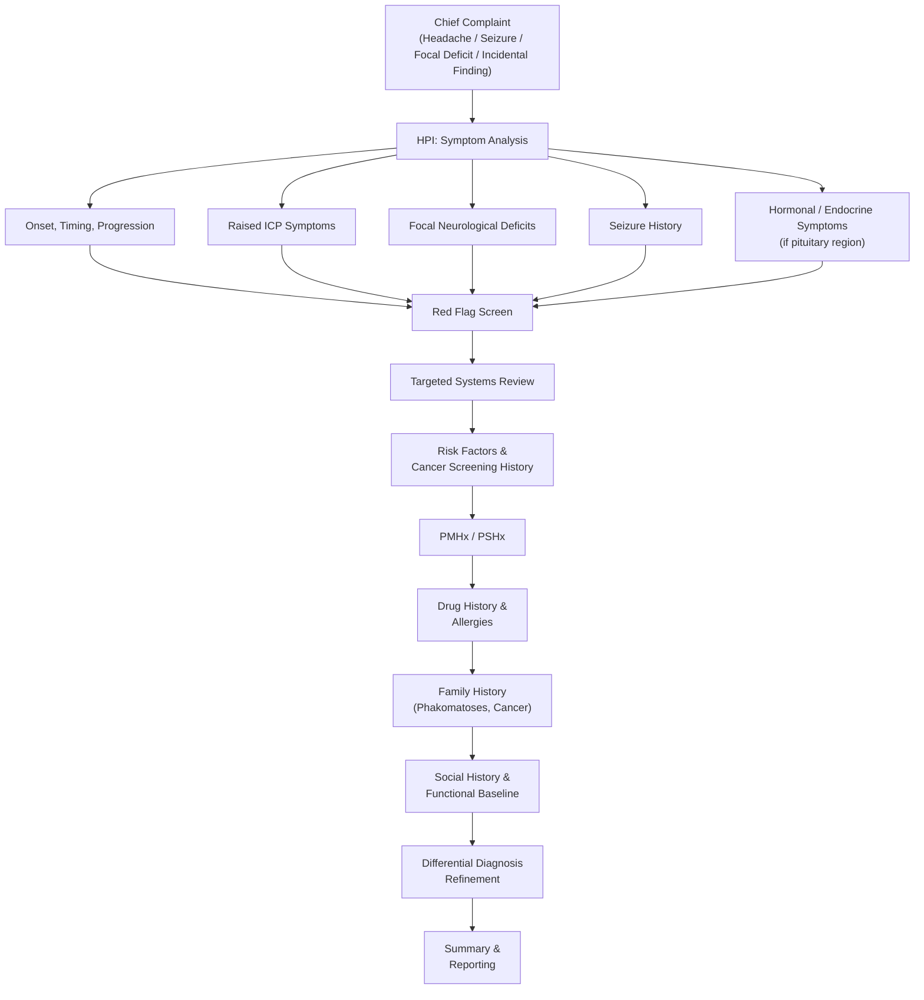

# History Taking: Brain Tumour (腦腫瘤)

> *Think of this like peeling an onion. You start broad — headache, seizure, focal deficit — then you drill down into the details that tell you whether this is a primary tumour, a met, or something else entirely. The key is recognising the **subacute progressive** pattern that separates neoplasm from stroke, and then localising the lesion based on the neurology.*

---

## Master Framework

---

## 1. Presenting Complaint Framework

### A. Opening the Consultation

Start open-ended:

> *"Can you tell me what brought you to the hospital today?"*
> 「你今日點解嚟醫院？」

Let the patient talk. Brain tumour patients may present with any combination of:
- ***Headache*** (頭痛)
- ***Seizures*** (抽搐/癲癇)
- ***Focal neurological deficits*** (局部神經功能缺失) — weakness, speech problems, visual changes
- ***Cognitive/personality changes*** (性格改變/記憶力差咗)
- ***Incidental finding*** on imaging (偶然發現)
- ***Hormonal disturbances*** (荷爾蒙問題) — particularly with pituitary/sellar lesions [1][2]

<Callout title="Why this matters" type="idea">
***Cardinal presentations of brain tumours are: (1) raised ICP symptoms, (2) focal neurological deficits (negative symptoms), and (3) epilepsy (positive symptoms)***. High-grade tumours tend to present subacutely with raised ICP; low-grade tumours tend to present with slowly progressive focal deficits or seizures [2][3].
</Callout>

---

### B. Detailed Symptom Analysis (OPQRST Framework)

#### i. Headache (頭痛)

| Question | Cantonese | Why It Matters |
|---|---|---|
| When did the headache start? | 頭痛幾時開始？ | Subacute/progressive onset over weeks–months suggests neoplasm vs. sudden = vascular [4] |
| Did it come on suddenly or gradually? | 係突然定慢慢嚟？ | Thunderclap → SAH/pituitary apoplexy. Gradual → tumour/chronic SDH [4][5] |
| Where exactly is the pain? | 邊度痛？可唔可以指俾我睇？ | Localisation may suggest tumour site (frontal, temporal, posterior fossa) |
| Is it worse in the morning? | 朝早起身痛唔痛啲？ | ***Generalised, dull, constant headache that is worse in the morning*** is classic for ***raised ICP*** [2][3] |
| Does it worsen with coughing, straining, or bending forward? | 咳嗽、用力或者彎低頭會唔會痛啲？ | ***Headache ↑ with exertion/cough*** → raised ICP [4][5] |
| Is it worse when lying flat? | 瞓低會唔會差啲？ | Positional worsening when supine → ↑ICP [5] |
| How severe is it (0–10)? | 痛嘅程度，0至10，10最痛？ | Severity grading; also sudden excruciating headache → pituitary apoplexy [6] |
| Is the headache getting worse over time? | 頭痛有冇愈嚟愈差？ | ***Progressive headache that worsens despite treatment*** is a red flag for secondary causes [4][5] |

#### ii. Vomiting / Nausea (嘔吐 / 作嘔)

> *"Have you been feeling nauseous or actually vomiting?"*
> 「有冇作嘔或者嘔吐？」

- ***Projectile vomiting*** (especially in the morning, without preceding nausea) → ***raised ICP*** [2][3]
- Ask: "Is the vomiting related to food or does it come out of nowhere?" — this distinguishes GI causes from central causes

#### iii. Visual Symptoms (視力問題)

| Question | Cantonese | Why It Matters |
|---|---|---|
| Any changes in your vision? | 視力有冇轉變？ | Compression of visual pathways [6][7] |
| Any double vision? | 有冇睇嘢重影？ | ***Diplopia*** → CN III/IV/VI palsy; cavernous sinus invasion [6] |
| Any loss of vision on either side? | 有冇邊邊睇唔到？ | ***Bitemporal hemianopia*** → optic chiasm compression (pituitary adenoma, craniopharyngioma) [6][7] |
| Any blurring? | 有冇矇？ | Papilloedema from ↑ICP causes transient visual obscurations [2] |

#### iv. Seizures (抽搐/癲癇)

> *"Have you ever had a fit or a seizure — a time when you lost consciousness and your body shook?"*
> 「你有冇試過抽筋或者突然間失去知覺、全身震？」

- **First-ever seizure in an adult is a brain tumour until proven otherwise** — this is a classic teaching point [1][2]
- Ask about:
  - Type: generalised tonic-clonic (全身抽搐) vs. focal onset (局部，例如一隻手先開始震)
  - Duration, frequency, post-ictal state
  - Preceding aura (先兆) — may help localise the tumour (e.g., olfactory aura → temporal lobe)
  - Any tongue biting, urinary incontinence

#### v. Focal Neurological Deficits (局部神經功能缺失)

This is where you **localise the lesion**. Ask systematically:

| Deficit | Question (Cantonese) | Localisation |
|---|---|---|
| Weakness | 手腳有冇冇力？邊邊？ | Contralateral motor cortex/internal capsule |
| Numbness/tingling | 有冇痺或者冇感覺？ | Contralateral sensory cortex/thalamus |
| Speech difficulty | 講嘢有冇困難？搵唔到字？定係講得唔清楚？ | Dominant hemisphere (Broca's/Wernicke's) |
| Coordination/balance | 行路有冇唔穩？ | Cerebellum/posterior fossa [1] |
| Hearing loss | 聽嘢有冇差咗？有冇耳鳴？ | ***CPA tumour (vestibular schwannoma)*** → SNHL + tinnitus [1] |
| Smell | 聞嘢有冇差咗？ | ***Anosmia*** → anterior cranial fossa (olfactory groove meningioma) [3] |
| Swallowing | 食嘢吞嘢有冇困難？ | Lower CN involvement (posterior fossa) [3] |

#### vi. Cognitive and Personality Changes (認知/性格改變)

> *"Have your family or friends noticed any changes in your personality or memory?"*
> 「屋企人有冇覺得你性格或者記性有轉變？」

- ***Frontal lobe tumours*** classically cause personality change, disinhibition, abulia
- ***Temporal lobe*** → memory impairment
- This is often the **collateral history** that the patient themselves doesn't notice — always ask a relative [2]

#### vii. Hormonal / Endocrine Symptoms (for Sellar/Parasellar Lesions)

Only relevant if the clinical picture suggests a ***pituitary/sellar region tumour*** [6]:

| Symptom | Question | Significance |
|---|---|---|
| Galactorrhoea | 乳頭有冇分泌物？ | ***Prolactinoma*** [6] |
| Menstrual irregularity | 月經有冇唔正常？ | Hypogonadotropic hypogonadism [6] |
| Erectile dysfunction | 性功能有冇問題？ | Hypogonadotropic hypogonadism (male) [6] |
| Increased shoe/ring size | 鞋或者戒指有冇覺得細咗？ | ***Acromegaly*** (GH-producing adenoma) [6] |
| Weight gain, easy bruising, striae | 有冇肥咗？容唔容易瘀？ | ***Cushing's disease*** (ACTH-producing) [6] |
| Polyuria/polydipsia | 有冇飲多咗水、去多咗廁所？ | ***Cranial diabetes insipidus*** (stalk compression) [6] |
| Growth retardation (paeds) | 身高增長有冇停滯？ | Craniopharyngioma [6] |
| Fatigue, cold intolerance | 有冇成日攰、怕凍？ | Hypopituitarism (TSH/ACTH deficiency) [6] |

---

## 2. Targeted Systems Review

Systematically screen for symptoms that may indicate the **primary cancer** (if suspecting metastasis) or **associated conditions**:

### Screen for Primary Malignancy (if metastatic disease suspected)

> *"Secondary tumours are 6–10× more common than primary brain tumours"* [3]

| System | Question | Primary Cancer |
|---|---|---|
| Respiratory | 有冇咳？咳血？氣喘？ | ***Lung cancer*** (commonest source of brain mets, 37–49%) [3][8] |
| Breast | 有冇摸到乳房硬塊？ | ***Breast cancer*** (16–19%) [3][8] |
| Skin | 有冇啲痣變大或者變色？ | ***Melanoma*** (highest propensity to metastasise to brain) [1][8] |
| GI | 有冇肚痛？大便有冇血？習慣有冇改變？ | ***Colorectal cancer*** (9%) [3] |
| Urinary | 有冇血尿？ | ***Renal cell carcinoma*** (8%) [3] |
| Constitutional | 有冇消瘦？冇胃口？夜晚出汗？ | General malignancy screen [4] |

<Callout title="Key Point">
***A cancer patient with a solitary brain mass — you cannot presume it is a metastasis. DDx includes primary brain tumour and abscess. History and examination are crucial*** [1].
</Callout>

### Other Systems Review

- **GCS / Consciousness**: Any episodes of confusion or reduced consciousness? 有冇試過神志不清？
- **Gait**: Any difficulty walking? 行路有冇困難？(Posterior fossa / hydrocephalus)
- **Incontinence**: Any loss of bladder or bowel control? 有冇失禁？(Hydrocephalus — Hakim triad; frontal lobe) [9]

---

## 3. Risk Factors and Exposure History

| Risk Factor | Question | Why It Matters |
|---|---|---|
| ***Ionising radiation*** | 以前有冇做過頭部放射治療？ | ***The only proven environmental risk factor*** → meningioma and gliomas [3] |
| ***Immunosuppression*** | 有冇免疫系統問題？HIV？食緊免疫抑制藥？ | ***EBV + immunosuppression → primary CNS lymphoma*** [3] |
| Smoking | 你食唔食煙？ | Lung cancer → brain mets |
| Previous cancer | 之前有冇確診過癌症？ | Brain mets may present before, during, or long after remission [1] |
| Age | (Note the age) | ***Tumour types depend on age*** — children: medulloblastoma, pilocytic astrocytoma; adults: GBM, meningioma, mets [2][3] |

---

## 4. Past Medical History (既往病史)

- Previous cancers (type, treatment, remission status)
- Previous brain/spinal surgery or radiotherapy
- Epilepsy history (existing vs. new-onset)
- HIV/AIDS or other immunodeficiency
- Previous head trauma (distinguish chronic SDH from tumour)
- DM, HTN, IHD (baseline for surgical risk)

## 5. Past Surgical History (手術史)

- Previous craniotomy or stereotactic biopsy
- Previous cancer surgery (mastectomy, lobectomy, nephrectomy, etc.)

## 6. Drug History and Allergies (藥物史及敏感)

- **Current medications**: anticonvulsants, steroids (dexamethasone), anticoagulants
- **Anticoagulants/antiplatelets**: 有冇食薄血丸？— important for surgical planning and haemorrhage risk [10]
- **Insulin/OHAs**: rule out hypoglycaemia as cause of neurological symptoms [10]
- **Immunosuppressants**: ↑risk of CNS lymphoma [3]
- **Drug allergies**: especially contrast agents, anaesthetic agents
- **Over-the-counter analgesics**: frequency of use (medication overuse headache as differential)

## 7. Family History (家族史)

> *"Is there anyone in your family with brain tumours or any genetic conditions?"*
> 「屋企人有冇腦腫瘤或者遺傳病？」

***Familial syndromes associated with brain tumours*** [3]:

| Syndrome | Tumour Type | Key Features |
|---|---|---|
| ***NF1*** | Optic glioma, astrocytoma | Café-au-lait spots, neurofibromas |
| ***NF2*** | ***Bilateral vestibular schwannoma***, meningioma | Bilateral acoustic neuromas pathognomonic [1] |
| ***Von Hippel-Lindau (VHL)*** | Haemangioblastoma | Retinal angioma, RCC, phaeochromocytoma |
| ***Tuberous sclerosis (TSC)*** | Subependymal giant cell astrocytoma | Skin lesions, seizures, intellectual disability |
| ***Li-Fraumeni*** | Glioma, various | p53 mutation, multiple cancers |
| ***Turcot syndrome*** | Medulloblastoma, GBM | Colonic polyposis |
| ***MEN1*** | Pituitary adenoma | Parathyroid + pancreatic tumours |

Also ask about family history of any cancer (especially lung, breast, colon).

## 8. Social History (社會史)

- **Occupation**: 你做咩工作？ — Assess functional impact and radiation exposure (rare)
- **Smoking**: 食唔食煙？食咗幾耐？幾多枝？— Lung cancer risk
- **Alcohol**: 飲唔飲酒？— Baseline, also Wernicke's encephalopathy as differential
- **Living situation**: 屋企有冇人照顧你？— Assess support network, ADL capacity
- **Driving**: 你有冇揸車？— *Seizures and visual field defects are driving contraindications*
- **Functional baseline (ECOG/Karnofsky)**: 平時自己可以照顧自己嗎？行到幾遠？— Critical for treatment planning (prognosis in brain mets depends heavily on performance status) [8]
- **Mood**: 心情點呀？有冇唔開心？— Screen for depression/anxiety

---

## 5. Differentiating Questions: Narrowing the Differential

The key differentials for a "mass in the brain" include [2][8][11]:

| Differential | Key Distinguishing Features | Differentiating Questions |
|---|---|---|
| **Primary brain tumour (e.g., GBM)** | Subacute progressive; single enhancing lesion; no known cancer | New progressive headache + focal signs in previously well patient |
| **Brain metastasis** | Known cancer; multiple lesions at grey-white junction; large oedema:lesion ratio | ***"Have you ever been diagnosed with cancer?"*** [1][8] |
| **Brain abscess** | Fever; recent infection/surgery; ring-enhancing on imaging | 有冇發燒？最近有冇感染？牙痛？ — ear/sinus/dental infection history [11] |
| **Chronic subdural haematoma** | Elderly; anticoagulant use; history of fall/trauma | 有冇跌親？食緊薄血丸？ [10][11] |
| **CNS lymphoma** | Immunosuppressed; periventricular location; prominent DWI restriction | HIV status; immunosuppressant use [3][11] |
| **Stroke (with oedema)** | Sudden onset; vascular territory distribution | Sudden or gradual? [10] |
| **Tuberculoma / Granulomatous disease** | TB contact; chronic fever; immunosuppressed | TB exposure; BCG status; travel history |
| **Pituitary adenoma** | Visual field defects + endocrine dysfunction | Hormonal symptoms screen [6] |

<Callout title="Common OSCE Trap" type="error">
***Multiple lesions in a cancer patient can be something other than metastases*** — consider CNS lymphoma, toxoplasmosis (if immunosuppressed), neurocysticercosis, or even multiple primary tumours [1]. Always keep your differential open.
</Callout>

---

## 6. Red-Flag Findings and Escalation Triggers

The following should prompt **urgent escalation** (emergency imaging and neurosurgical referral):

| Red Flag | Implication | Action |
|---|---|---|
| ***Sudden severe headache*** ("thunderclap") | Pituitary apoplexy, SAH, tumour haemorrhage | Urgent CT → neurosurgery [5][6] |
| ***Rapidly declining GCS*** | Brain herniation from ↑ICP | Emergency — Cushing's triad (HTN, bradycardia, irregular respirations) is a late and ominous sign [2] |
| ***New focal neurological deficit*** | Expanding mass / oedema / haemorrhage | Urgent imaging [4][5] |
| ***New seizure in an adult*** | High suspicion for intracranial neoplasm | CT/MRI brain [2] |
| ***Papilloedema*** | Raised ICP | Do NOT lumbar puncture → imaging first [2] |
| ***6th nerve palsy*** (false localising sign) | Raised ICP stretching CN VI | Non-localising; indicates generalised ↑ICP [2] |
| ***Progressive headache worse when supine/coughing*** | Raised ICP from mass effect or hydrocephalus | Urgent imaging [4][5] |
| ***Sudden visual loss + diplopia + headache*** | Pituitary apoplexy | ***Steroid cover + urgent surgical decompression*** [6] |

---

## 7. Common Pitfalls in History Taking

<Callout title="Pitfalls to Avoid" type="error">

1. **Assuming metastasis in a cancer patient** — ***10–15% of solitary brain masses in patients with known cancer are NOT metastatic*** [1][8]. Always consider primary brain tumour or abscess.
2. **Ignoring collateral history** — Patients with frontal lobe tumours often lack insight into personality/cognitive changes. Always ask family members.
3. **Forgetting endocrine symptoms** — Pituitary tumours are common and endocrine history is frequently overlooked in a "brain tumour" OSCE.
4. **Not screening for primary cancer** — If no known malignancy, ask about constitutional symptoms + system-specific cancer symptoms (cough, haemoptysis, breast lump, haematuria, skin moles).
5. **Confusing acute stroke with tumour** — Stroke is ***sudden onset***; tumour is ***subacute/progressive***. However, haemorrhage into a tumour can mimic stroke.
6. **Missing medication history** — Anticoagulants increase risk of intratumoral haemorrhage and affect surgical planning.
7. **Not asking about driving and occupation** — Medicolegal implications of seizures and visual field defects.

</Callout>

---

## 8. High-Yield Exam Interpretation Tips

| Concept | Teaching Point |
|---|---|
| ***"Insidious onset + progressive course + constitutional symptoms"*** | This pattern = neoplastic until proven otherwise [4] |
| ***Morning headache with vomiting*** | Classic for ↑ICP — CSF reabsorption ↓ when supine overnight → ICP peaks in morning [2] |
| ***New-onset seizure in adult > 20 years*** | Always image the brain — tumour must be excluded [2] |
| ***Bitemporal hemianopia*** | Optic chiasm compression → pituitary adenoma or craniopharyngioma [6][7] |
| ***Tumour location varies with age*** | Adults: 80–85% supratentorial (mets > glioma > meningioma); Children: 40% supratentorial (medulloblastoma, cerebellar astrocytoma) [2] |
| ***Foster-Kennedy syndrome*** | Ipsilateral optic atrophy + contralateral papilloedema → large olfactory groove meningioma [3] |
| ***Primary CNS lymphoma clues*** | Immunosuppression + periventricular mass + DWI restriction [2][11] |
| ***Brain mets location*** | Commonest at ***watershed area and grey-white junction*** (vessel diameter decreases → traps tumour cell clumps) [8] |
| ***Hydrocephalus triad (NPH)*** | Dementia + gait apraxia + incontinence → communicating hydrocephalus [9] |

---

## 9. Model Reporting Script (OSCE Format)

> **"Dr Wong, I'd like to present Mr Chan.**
>
> Mr Chan is a **58-year-old gentleman**, a retired taxi driver, who was **referred to QMH by his GP after presenting with a 6-week history of progressive headache and a new-onset generalised tonic-clonic seizure 3 days ago**.
>
> Regarding his **history of presenting illness**: he describes a **dull, generalised headache** that has been **worsening over the past 6 weeks**. The headache is notably **worse in the morning** and is **exacerbated by coughing and bending forward**. He has associated **nausea and two episodes of projectile vomiting** over the past week. His wife reports that he has become **increasingly forgetful and irritable** over the past month. Three days ago, he had a **witnessed generalised tonic-clonic seizure** lasting approximately 2 minutes with post-ictal confusion. He denies any prior seizures. He also notes **blurring of vision in both eyes** for the past 2 weeks. He denies any limb weakness, numbness, speech difficulty, or hearing loss. There are no endocrine symptoms. He reports a **3 kg weight loss** over 2 months with reduced appetite. He has a **chronic cough** with occasional **blood-streaked sputum** for the past 4 months, which he attributed to smoking.
>
> His **past medical history** includes **hypertension** diagnosed 10 years ago, managed with amlodipine 5 mg daily. He has **no history of previous cancers, head trauma, or surgery**. He has **no known drug allergies**.
>
> He has a **40 pack-year smoking history** and continues to smoke. He drinks alcohol socially, approximately 2 units per week. He lives with his wife and is **independently mobile**, with an **ECOG performance status of 1**.
>
> His **family history** is unremarkable for brain tumours or phakomatoses. His father died of lung cancer aged 70.
>
> **In summary**, Mr Chan is a 58-year-old smoker presenting with a subacute progressive headache with features of raised intracranial pressure, a new-onset seizure, subtle cognitive decline, and constitutional symptoms alongside a chronic cough with haemoptysis. My top differential is an **intracranial space-occupying lesion** — likely either a **primary brain tumour or cerebral metastasis from a possible lung primary**. I would like to proceed with an **urgent contrast-enhanced CT brain**, followed by **MRI brain with contrast**, and a **CT thorax** to investigate the lung symptoms."

---

<Callout title="High Yield Summary">

**Brain tumours present with the triad of: (1) raised ICP symptoms, (2) focal neurological deficits, and (3) seizures.**

- ***High-grade tumours*** → subacute onset of ↑ICP (headache worse in morning, vomiting, papilloedema)
- ***Low-grade tumours*** → slowly progressive focal deficits or epilepsy
- ***Metastatic disease*** is 6–10× more common than primary — always screen for a primary cancer (lung, breast, colon, kidney, melanoma)
- ***Only proven environmental risk factor*** = high-dose ionising radiation
- ***New-onset adult seizure = brain tumour until proven otherwise***
- ***Pituitary tumours***: don't forget endocrine symptoms (galactorrhoea, amenorrhoea, acromegaly, Cushing's, DI)
- ***A solitary mass in a cancer patient is NOT always a met*** (10–15% are something else)
- Red flags for escalation: declining GCS, new focal deficit, thunderclap headache, papilloedema

**Essential knowledge from lectures**: Presentation (ICP, seizure, focal deficit correlated with anatomy), Pathology (age, location, systemic disease), Imaging (location, enhancement, common DDx), Medical therapy (anticonvulsant for supratentorial + steroids), Surgery indications for resecting metastasis, radiosurgery use, chemoirradiation for GBM, pituitary adenoma treatment principles [1].

</Callout>

---

<ActiveRecallQuiz
  title="Active Recall - History Taking"
  items={[
    {
      question: "What are the three cardinal presentations of brain tumours?",
      markscheme: "Raised intracranial pressure symptoms (headache, vomiting, papilloedema), focal neurological deficits (negative symptoms), and epilepsy/seizures (positive symptoms)."
    },
    {
      question: "What is the only proven environmental risk factor for brain tumours?",
      markscheme: "High-dose ionising radiation, which is associated with meningiomas and gliomas."
    },
    {
      question: "A 55-year-old man with known lung cancer presents with a solitary brain lesion. Can you assume it is a metastasis? What is the approximate false-positive rate?",
      markscheme: "No. 10-15% of solitary brain masses in patients with pre-existing cancer are NOT metastases. DDx includes primary brain tumour and brain abscess. Tissue diagnosis may be needed."
    },
    {
      question: "Name three familial syndromes associated with brain tumours and the tumour type each is linked to.",
      markscheme: "NF1 (optic glioma, astrocytoma), NF2 (bilateral vestibular schwannoma, meningioma), VHL (haemangioblastoma), TSC (subependymal giant cell astrocytoma), Li-Fraumeni (glioma), Turcot (medulloblastoma/GBM), MEN1 (pituitary adenoma). Any three acceptable."
    },
    {
      question: "What visual field defect is classically associated with a pituitary macroadenoma, and what is the anatomical explanation?",
      markscheme: "Bitemporal hemianopia, due to compression of the optic chiasm from below by the suprasellar extension of the tumour."
    },
    {
      question: "In brain tumours, how does the pattern of onset help distinguish high-grade from low-grade disease?",
      markscheme: "High-grade tumours (e.g., GBM) tend to present with subacute onset of raised ICP symptoms over weeks. Low-grade tumours tend to present with slowly progressive focal neurological deficits or seizures over months to years."
    }
  ]}
/>

---

## References

[1] Lecture slides: GC 108. A mass in the brain brain tumours.pdf (p2, p17, p24)
[2] Senior notes: Ryan Ho Neurology.pdf (p161 — Intracranial Tumours, Clinical Approach)
[3] Senior notes: maxim.md (Section 5.5 — Brain tumours, epidemiology, risk factors, classifications)
[4] Senior notes: Ryan Ho Fundamentals.pdf (p4–5 — History Taking general principles; p313 — Headache red flags)
[5] Senior notes: Ryan Ho Neurology.pdf (p58 — Headache red flags for secondary causes)
[6] Senior notes: Ryan Ho Endocrine.pdf (p106–107 — Pituitary tumours); Ryan Ho Fundamentals.pdf (p441–442 — Pituitary tumour presentation)
[7] Senior notes: Ryan Ho Opthalmology.pdf (p41 — Pattern of visual loss and localisation)
[8] Senior notes: Ryan Ho Neurology.pdf (p164–165 — Brain metastasis)
[9] Senior notes: Ryan Ho Neurology.pdf (p159 — Hydrocephalus)
[10] Senior notes: felixlai.md (Section on stroke DDx and history taking)
[11] Senior notes: Ryan Ho Neurology.pdf (p162 — DDx of intracranial tumours; imaging)
