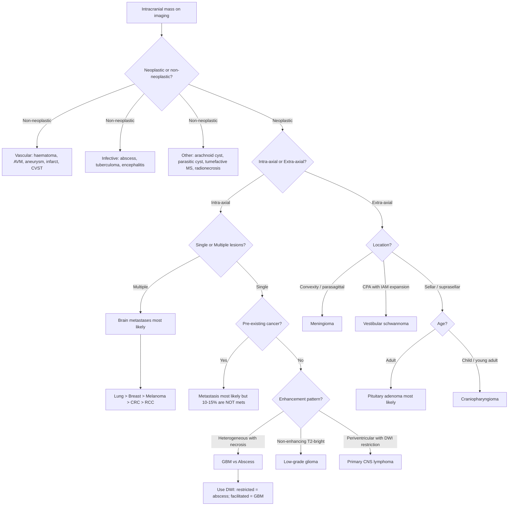

## Differential Diagnosis of Brain Tumours

### Why Differential Diagnosis Matters in Brain Tumours

When you see a mass on brain imaging, your immediate reflex might be to call it a tumour — but not every intracranial mass is neoplastic. The differential diagnosis of an intracranial space-occupying lesion (SOL) is broad, and getting it wrong has serious consequences: you would not want to start someone on temozolomide chemoradiation for what turns out to be a brain abscess, nor would you want to perform a craniotomy on a primary CNS lymphoma (which responds dramatically to steroids and chemotherapy, not surgery). The approach to differential diagnosis depends on three key axes:

1. **Is the lesion truly a tumour, or is it a non-neoplastic mimic?**
2. **If it is a tumour, is it primary or secondary (metastatic)?**
3. **If primary, what specific tumour type?**

---

### A. Non-Neoplastic Mimics of Brain Tumours

***The differential diagnosis of intracranial tumours*** includes both neoplastic and non-neoplastic lesions [2]:

| Category | Differential | Why It Mimics a Tumour | Key Distinguishing Features |
|---|---|---|---|
| ***Vascular*** | ***Haematoma*** (intracerebral, subdural) | Mass effect, focal deficit, headache | Acute onset, history of trauma/anticoagulation, hyperdense on CT (acute blood) |
| | ***Giant aneurysm*** | Can appear as a round mass with mass effect | Pulsatile on angiography, peripheral calcification, flow void on MRI |
| | ***AVM*** (arteriovenous malformation) | Heterogeneous signal, surrounding oedema possible | Flow voids ("bag of worms"), history of seizures or haemorrhage, DSA diagnostic |
| | ***Infarct with oedema*** | Early infarction can cause mass effect mimicking tumour | Sudden onset fitting vascular territory, restricted diffusion on DWI, no enhancement initially |
| | ***Venous thrombosis*** (e.g., CVST) | Haemorrhagic infarction with oedema | Does not respect arterial territory, "empty delta sign" on CT venogram, headache with raised ICP |
| ***Infective*** | ***Brain abscess*** | ***Ring-enhancing lesion mimicking GBM or metastasis*** [2] | Restricted diffusion on DWI (bright centre — pus restricts water movement), fever, raised inflammatory markers, smooth thin ring wall |
| | ***Tuberculoma*** | Enhancing lesion ± surrounding oedema | Endemic area, TB risk factors, other systemic TB features, "target sign" |
| | ***Sarcoidosis*** (neurosarcoidosis) | Enhancing meningeal or parenchymal lesion | Systemic features (bilateral hilar lymphadenopathy, skin, eyes), elevated ACE |
| | ***Encephalitis*** (viral, especially herpes) | Temporal lobe swelling and signal change | Acute febrile onset, temporal predilection (HSV), restricted diffusion in cortex |
| ***Traumatic*** | ***Haematoma*** | As above | History of trauma |
| | ***Contusion*** | Haemorrhagic cortical lesion with oedema | Coup-contrecoup pattern, history of trauma |
| ***Cystic*** | ***Arachnoid cyst*** | CSF-density non-enhancing mass | Follows CSF signal on all MRI sequences, no enhancement, no surrounding oedema, usually incidental |
| | ***Parasitic cyst*** (neurocysticercosis) | Cystic lesion with surrounding oedema ± enhancement | Endemic exposure, scolex visible within cyst, calcification in chronic stage |
| ***Demyelination*** | ***Tumefactive MS*** | Large enhancing white matter lesion mimicking glioma | Open-ring enhancement (incomplete ring with opening towards cortex), young patient with relapsing neurological episodes |
| ***Other*** | ***Radionecrosis*** | Enhancing lesion mimicking tumour recurrence post-RT | History of prior radiotherapy, typically 1–3 years after RT, high oedema-to-enhancement ratio [2] |

<Callout title="High Yield — Brain Abscess vs GBM vs Metastasis" type="error">
All three can present as **ring-enhancing lesions**. The key discriminator on MRI is **DWI (diffusion-weighted imaging)**:
- ***Brain abscess***: **Restricted diffusion** in the centre (bright on DWI, dark on ADC) — because pus is viscous and restricts water molecule movement [3].
- ***GBM***: Central **necrosis** typically shows **facilitated diffusion** (dark on DWI) — necrotic fluid is less viscous than pus.
- ***Metastasis***: Variable DWI signal, but typically no restricted diffusion in the centre.
This is a must-know imaging distinction for exams [2][3].
</Callout>

---

### B. Primary vs Secondary (Metastatic) Brain Tumour

This is the single most important branch in the differential. The approach differs fundamentally:

| Feature | Primary Brain Tumour | Brain Metastasis |
|---|---|---|
| **Number of lesions** | Usually solitary | ***Multiple lesions*** (though 30–50% present as solitary) [2] |
| **Location** | Variable (gliomas: white matter; meningiomas: dural-based) | ***Grey-white junction, watershed areas*** [2] |
| **Margin** | Infiltrative (gliomas) or well-defined (meningiomas) | ***Well-circumscribed*** [2] |
| **Oedema** | Proportional to tumour grade | ***Large volume of vasogenic oedema compared to size of lesion*** ("disproportionate oedema") [2] |
| **History** | No known malignancy | ***Pre-existing cancer*** (but 10–15% of solitary cerebral mass lesions in patients with pre-existing cancer are NOT metastases!) [2] |
| **Enhancement** | Variable by type | Round, well-circumscribed, enhancing |
| **Age** | Gliomas: any age; Meningiomas: middle-aged | Typically adults with known cancer |
| **Involvement of multiple compartments** | Unusual for a single primary | Suggestive of metastatic disease [2] |

> ***"10–15% of solitary cerebral mass lesions in a patient with pre-existing cancer are NOT metastases"*** — always consider primary brain tumour and brain abscess in the differential [2].

---

### C. Differential Diagnosis by Location

Location is one of the most powerful tools for narrowing the differential. Different tumour types have strong predilections for specific anatomical sites [3].

#### Supratentorial Lesions (Adults)

| Specific Location | Top Differentials | Reasoning |
|---|---|---|
| **Cerebral hemisphere (intra-axial)** | ***GBM, anaplastic astrocytoma, oligodendroglioma, metastases, primary CNS lymphoma*** [3] | These are the commonest intra-axial tumours in adults. GBM and metastases together account for the vast majority. |
| **Corpus callosum** | ***GBM ("butterfly lesion"), oligodendroglioma, lipoma*** [3] | GBM crosses midline via corpus callosum white matter tracts — the bilateral enhancing mass with a "butterfly" pattern is classic [1]. |
| **Convexity/parasagittal (extra-axial)** | ***Meningioma*** [2] | Arises from arachnoid granulations along the dural surface. Dural tail sign and homogeneous enhancement are hallmarks. |
| **Sellar/suprasellar** | ***Pituitary adenoma, craniopharyngioma, meningioma, Rathke's cleft cyst, germ cell tumour, metastasis (CA breast/lung)*** [4][5][10] | Pituitary adenoma is by far the most common sellar mass in adults from the 3rd decade onward [10]. |
| **Lateral ventricle** | ***Ependymoma, meningioma, subependymoma, choroid plexus papilloma*** [3] | Tumours that grow within or adjacent to ventricular lining. |
| **Third ventricle** | ***Colloid cyst, ependymoma*** [3] | A colloid cyst at the foramen of Monro can cause acute intermittent obstructive hydrocephalus → sudden death. |
| **Pineal region** | ***Germ cell tumours (children), pineal parenchymal tumours, gliomas (adults)*** [2] | The pineal gland contains remnant germ cells; in children, these are the most common tumours here. |
| **Optic chiasm/nerve** | ***Meningioma, pilocytic astrocytoma (especially in NF1)*** [3] | Optic pathway gliomas in children with NF1 are a classic association. |

#### Infratentorial Lesions (Posterior Fossa)

| Specific Location | Top Differentials (Adults) | Top Differentials (Children) | Reasoning |
|---|---|---|---|
| **Cerebellum** | ***Metastasis, haemangioblastoma (especially VHL)*** [3] | ***Pilocytic astrocytoma (cystic with mural nodule), medulloblastoma*** [3] | Medulloblastoma is the most common malignant posterior fossa tumour in children, arising from the vermis/4th ventricle roof. |
| **4th ventricle** | ***Ependymoma*** | ***Ependymoma, choroid plexus papilloma, medulloblastoma*** [3] | Ependymoma arises from ependymal lining of ventricles; in children, most are infratentorial. |
| ***Cerebellopontine angle (CPA)*** | ***Vestibular schwannoma (acoustic neuroma, ~80% of CPA tumours), meningioma, epidermoid cyst*** [2][3] | Rare in children unless NF2 | The CPA is a classic exam location. Vestibular schwannoma expands the internal acoustic meatus — a pathognomonic finding. |
| **Brainstem** | ***Diffuse midline glioma (H3K27M-mutant)*** | ***Diffuse intrinsic pontine glioma (DIPG, now classified as diffuse midline glioma)*** | Brainstem tumours are largely inoperable — biopsy only ± chemoRT. |
| **Foramen magnum** | ***Meningioma, schwannoma, neurofibroma*** [3] | Rare | These present with progressive myelopathy + lower CN palsies. |

---

### D. Differential Diagnosis of Sellar Masses

This deserves special attention as a common exam topic [4][5][10]:

| Category | Differentials |
|---|---|
| **Pituitary hyperplasia** (physiological/reactive) | ***Lactotroph hyperplasia (pregnancy)***, ***thyrotroph hyperplasia (longstanding primary hypothyroidism)***, ***gonadotroph hyperplasia (longstanding primary hypogonadism)***, ***somatotroph hyperplasia (ectopic GHRH secretion)*** [10] |
| **Benign tumours** | ***Pituitary adenoma*** (most common in adults), ***craniopharyngioma*** (most common in children/young adults), ***meningioma***, pituicytoma [4][10] |
| **Malignant tumours** | ***Pituitary carcinoma*** (very rare), ***germ cell tumours, chordomas, CNS lymphoma*** [4][10] |
| **Secondary tumours** | ***CA lung (males), CA breast (females)*** [4][10] |
| **Cysts** | ***Rathke's cleft cyst, arachnoid cyst, dermoid cyst*** [10] |
| **Inflammatory/infectious** | ***Lymphocytic hypophysitis, pituitary abscess*** [4][10] |
| **Vascular** | ***Carotid-cavernous fistula*** [4][10] |

<Callout title="Exam Pearl — Craniopharyngioma vs Pituitary Adenoma">
Both present with visual field defects and hormonal dysfunction, but:
- ***Craniopharyngioma***: Often in **children/young adults**, **cystic**, **50% calcified** (visible on XR/CT), causes **cranial DI** (stalk compression) and **hypothalamic damage** (obesity, hyperphagia, thermoregulatory dysfunction) [5].
- ***Pituitary adenoma***: **Adults 30–60**, within sella, rarely calcified, DI is uncommon (DI suggests stalk or hypothalamic involvement — think craniopharyngioma, germinoma, or metastasis instead).
- ***CT is better for detecting calcification*** (meningioma, craniopharyngioma) while ***MRI with contrast is the modality of choice*** for sellar lesions overall [4][5].
</Callout>

---

### E. Differential Diagnosis by Age

| Age Group | Most Common Tumour Types | Key Reasoning |
|---|---|---|
| ***Adults ( > 18y)*** | ***Metastases > GBM > meningioma > pituitary adenoma*** | Metastases are 6–10× more common than primary tumours. GBM is the most common malignant primary brain tumour. |
| ***Children (2–12y)*** | ***Pilocytic astrocytoma > medulloblastoma > ependymoma > craniopharyngioma > germ cell tumours*** | 70% infratentorial. Embryonal and developmental tumours predominate [2][3]. |
| ***Infants ( < 2y)*** | Choroid plexus papilloma/carcinoma, teratoma, ATRT | Extremely rare tumours; congenital or embryonal. |

---

### F. Differential Diagnosis by Imaging Pattern

| MRI Pattern | Differential Diagnosis | Why This Pattern |
|---|---|---|
| ***Heterogeneous enhancement with central necrosis*** [2] | ***GBM***, brain abscess, metastasis | GBM outgrows its blood supply → central necrosis. Abscess centre is pus. |
| ***Homogeneous enhancement, dural-based, extra-axial*** [2] | ***Meningioma*** | Arises from arachnoid cells on dural surface. Rich blood supply → uniform enhancement. Dural tail = reactive dural thickening. |
| ***Non-enhancing, T2-hyperintense, expansile*** [2] | ***Low-grade glioma*** | Intact BBB (low-grade tumour does not disrupt BBB significantly → no contrast leak → no enhancement). |
| ***Periventricular, T2-iso/hypointense with restricted diffusion on DWI*** [2] | ***Primary CNS lymphoma*** | Densely cellular tumour → restricts water diffusion. Deep grey matter/periventricular predilection. ***C/I: steroids before biopsy (causes acute lymphocyte lysis → "ghost tumour" → ↓ diagnostic yield)*** [2] |
| ***Multiple ring-enhancing lesions at grey-white junction*** | ***Brain metastases*** | Haematogenous spread → tumour cell clumps trapped at grey-white junction where vessel calibre narrows [2]. |
| ***Extra-axial CPA mass expanding the IAM*** | ***Vestibular schwannoma*** | Arises from Schwann cells within internal acoustic meatus → expands the canal [2]. |
| ***Sellar mass with calcification + cystic component*** | ***Craniopharyngioma*** [5] | Develops from Rathke's pouch remnant cells; often cystic and 50% calcified. |
| ***Ring enhancement with restricted diffusion in centre*** | ***Brain abscess*** | Pus is viscous → restricts water molecule diffusion (unlike necrotic tumour fluid) [2][3]. |

---

### G. Approach Diagram — Differential Diagnosis of an Intracranial Mass

---

### H. Special Differential Diagnosis Scenarios

#### Sixth Nerve Palsy as a "False Localising Sign" [11]

***CN VI palsy is a famous "false localising sign" of raised ICP*** — it does not localise the tumour itself. CN VI has the longest intracranial course and is stretched over the clivus/petrous ridge when ICP rises diffusely. Therefore, a posterior fossa tumour can cause bilateral CN VI palsies even though the tumour is nowhere near CN VI.

Other causes of CN VI palsy that may overlap with brain tumour presentations [11]:
- ***Pontine lesion*** (infarction, demyelination, tumour)
- ***Microvascular disease*** (most common overall cause in adults with vascular risk factors)
- ***Petrous bone pathology*** (petrositis — Gradenigo syndrome)
- ***Cavernous sinus pathology*** (infection, ICA aneurysm, CST)
- ***Orbital pathology*** (tumours, cellulitis)

> ***In Hong Kong, NPC (nasopharyngeal carcinoma) with skull base invasion is an important cause of CN VI palsy in young patients*** [11]. Always consider this in the local context.

#### Dementia Presentation Mimicking Brain Tumour [12]

Slowly growing tumours (especially frontal meningiomas, low-grade gliomas) can present insidiously with personality change, cognitive decline, and apathy — mimicking neurodegenerative dementia (especially frontotemporal dementia). Conversely, FTD can be mistaken for a tumour. Neuroimaging is essential to distinguish these.

---

<Callout title="High Yield Summary — Differential Diagnosis">

1. **Non-neoplastic mimics**: brain abscess, haematoma, AVM, giant aneurysm, infarct with oedema, CVST, tuberculoma, neurocysticercosis, tumefactive MS, radionecrosis.
2. **Abscess vs GBM vs metastasis**: all can be ring-enhancing. Use **DWI** — restricted diffusion in centre = abscess (pus).
3. **Primary CNS lymphoma**: periventricular, DWI restriction, T2-iso/hypointense, DO NOT give steroids before biopsy (ghost tumour).
4. **Multiple enhancing lesions at grey-white junction** = brain metastases until proven otherwise.
5. **Sellar mass differential**: pituitary adenoma (adults) vs craniopharyngioma (children/young adults, calcified, cystic, DI).
6. **10–15% of solitary brain masses in cancer patients are NOT metastases** — consider primary tumour and abscess.
7. **Location, age, and imaging pattern** are the three pillars of narrowing the differential.
8. **CN VI palsy** = false localising sign of raised ICP (longest intracranial course); in Hong Kong, always consider NPC.
</Callout>

---

<ActiveRecallQuiz
  title="Active Recall — Differential Diagnosis of Brain Tumours"
  items={[
    {
      question: "A ring-enhancing intracranial lesion is seen on MRI. How do you distinguish brain abscess from GBM using MRI sequences, and what is the underlying physics?",
      markscheme: "Use DWI. Brain abscess shows restricted diffusion in the centre (bright on DWI, dark on ADC) because pus is viscous and restricts Brownian motion of water molecules. GBM shows central necrosis with facilitated diffusion (dark on DWI) because necrotic fluid is less viscous. Both show ring enhancement on post-contrast T1W.",
    },
    {
      question: "A 55-year-old man with known lung cancer presents with new seizures. MRI shows a solitary enhancing cerebral lesion. What important caveat must you keep in mind regarding the diagnosis?",
      markscheme: "10-15% of solitary cerebral mass lesions in patients with pre-existing cancer are NOT metastases. Differential includes primary brain tumour (e.g. GBM) and brain abscess. Biopsy may be needed if diagnosis is uncertain, and PET-CT should be considered if unknown primary.",
    },
    {
      question: "Why should you NOT give corticosteroids before biopsy when you suspect primary CNS lymphoma?",
      markscheme: "Steroids cause acute lysis of lymphocytes (lymphoma cells are exquisitely sensitive to glucocorticoids). This can cause the lesion to shrink or disappear ('ghost tumour'), dramatically reducing the diagnostic yield of biopsy. Treat with steroids only after tissue diagnosis is obtained.",
    },
    {
      question: "Name the differential diagnosis of a sellar mass in a child vs an adult, and one key imaging feature that helps distinguish the most common paediatric and adult causes.",
      markscheme: "Child: craniopharyngioma (most common sellar mass in young people). Adult: pituitary adenoma (most common sellar mass from 3rd decade). Key distinguishing imaging feature: craniopharyngioma is often cystic and 50% calcified (best seen on CT), while pituitary adenoma is rarely calcified and is best characterised on contrast MRI.",
    },
    {
      question: "What is the differential diagnosis of an intracranial mass at the cerebellopontine angle, and which tumour is most common?",
      markscheme: "Most common: vestibular schwannoma (acoustic neuroma, ~80% of CPA tumours). Other differentials: meningioma, epidermoid cyst, choroid plexus papilloma, glomus jugulare tumour. Vestibular schwannoma characteristically expands the internal acoustic meatus (pathognomonic).",
    },
    {
      question: "Explain why CN VI palsy is called a 'false localising sign' in raised ICP.",
      markscheme: "CN VI (abducens nerve) has the longest intracranial course among cranial nerves and is tethered over the petrous ridge/clivus. When ICP rises diffusely (from any cause/location), CN VI is stretched and compressed against the petrous ridge, causing a palsy. This palsy does not localise to the tumour site — it simply reflects globally raised ICP, hence 'false localising'.",
    },
  ]}
/>

---

## References

[1] Lecture slides: GC 108. A mass in the brain brain tumours.pdf
[2] Senior notes: Ryan Ho Neurology.pdf (Section 8.3 Intracranial Tumours, pp. 161–167)
[3] Senior notes: maxim.md (Section 5.5 Brain tumours)
[4] Senior notes: Ryan Ho Endocrine.pdf (p. 106–107 — Pituitary Tumour)
[5] Senior notes: Ryan Ho Fundamentals.pdf (pp. 441–442 — Pituitary Tumour, Craniopharyngioma)
[7] Senior notes: Ryan Ho Radiology.pdf (p. 23 — Intracranial Tumours)
[10] Senior notes: felixlai.md (Pituitary adenoma — Differential diagnosis of sellar mass)
[11] Senior notes: Ryan Ho Opthalmology.pdf (p. 85 — Sixth Nerve Palsy)
[12] Senior notes: Ryan Ho Psychiatry.pdf (p. 94 — Frontotemporal Dementia differential)
