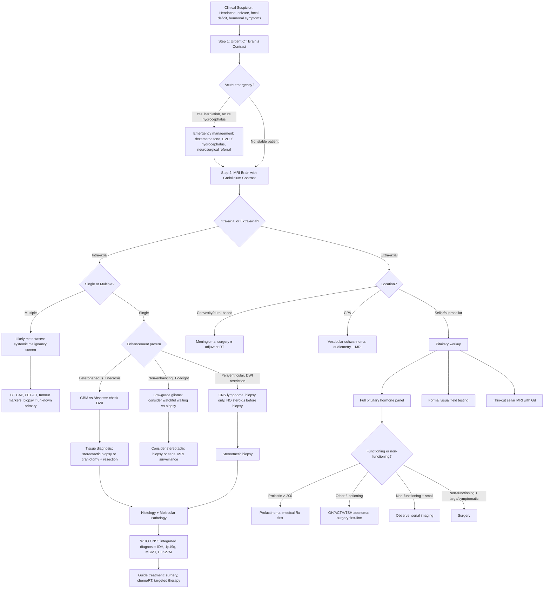

## Diagnostic Approach to Brain Tumours

### Why There Are No Universal "Diagnostic Criteria" for Brain Tumours

Unlike many medical conditions (e.g., rheumatoid arthritis, SLE) where validated diagnostic criteria exist, brain tumours do not have a single set of criteria analogous to ACR/EULAR criteria. The reason is straightforward: brain tumours are an extraordinarily heterogeneous group of diseases — over 100 distinct entities in the WHO CNS5 classification — and the **definitive diagnosis is histopathological (and increasingly molecular)**. What we do have is a systematic **diagnostic algorithm** that integrates:

1. **Clinical suspicion** (history + examination → "Could this be a brain tumour?")
2. **Neuroimaging** (CT ± contrast → MRI with contrast → characterise and localise)
3. **Tissue diagnosis** (biopsy or surgical resection → histology + molecular profiling)
4. **Staging/systemic work-up** (for metastatic disease or to guide treatment planning)

The diagnosis of a brain tumour is therefore **never purely clinical or purely radiological** — it requires tissue confirmation for definitive diagnosis and grading (with the exception of certain scenarios where imaging is considered diagnostic, such as classic brainstem DIPG in children where biopsy carries unacceptable risk).

---

### Diagnostic Algorithm — Step-by-Step

The clinical approach proceeds in a logical sequence. Think of it as answering a series of questions, each one narrowing the differential.

#### Step 1: Clinical Suspicion — Is This a Brain Tumour?

The clinical presentation raises suspicion. The three cardinal presentations from the previous section are:
- **Raised ICP**: Subacute progressive headache (worse in morning), vomiting, papilloedema
- **Focal neurological deficit**: Progressive, location-specific
- **Seizures**: New-onset in an adult, especially focal with secondary generalisation

**Red flags** that should trigger urgent neuroimaging:
- New-onset seizure in an adult
- Progressive focal neurological deficit
- Headache with features of raised ICP (morning headache, vomiting, papilloedema)
- Personality/cognitive change with no other explanation
- Known cancer patient with new neurological symptoms

#### Step 2: Initial Neuroimaging — CT Brain ± Contrast

***CT brain ± contrast*** is often the **first-line imaging** in the acute or emergency setting [2][5][7][13][14]:

Why CT first?
- Widely available, fast (seconds), no sedation needed
- Detects acute blood (hyperdense), calcification, mass effect, hydrocephalus
- Adequate to detect large lesions and guide emergency management (e.g., herniation requiring urgent intervention)

What to look for on CT [5][13]:

| CT Finding | What It Tells You | Examples |
|---|---|---|
| **Site and multiplicity** | Single vs multiple lesions; supratentorial vs infratentorial | Multiple lesions → think metastases or abscess or lymphoma [5] |
| **Mass effect** | Midline shift, ventricular compression, sulcal effacement, obliteration of basal cisterns | Indicates significant space-occupying effect; basal cistern obliteration is ***very suggestive of raised ICP*** [5] |
| **Density** | Hyperdense = acute blood or calcification; Hypodense = oedema, infarction, low-grade tumour; Mixed = tumour with haemorrhage/necrosis [5] | Calcification suggests meningioma or craniopharyngioma [4] |
| ***Contrast enhancement*** | ***Normal brain tissue does NOT enhance (due to intact BBB)*** [2] | Enhancement means either the lesion is **outside the BBB** (e.g., ***meningioma — homogenously enhancing***) or there is **disruption of the BBB** (e.g., ***high-grade tumours, inflammation, stroke***) [2] |
| ***Ring enhancement*** | Ring of peripheral enhancement with non-enhancing centre | ***Abscess, metastasis, glioblastoma, dermoid cyst*** [5] |

<Callout title="CT Interpretation Pearl">
***Contrast enhancement = BBB disruption or extra-BBB location.*** A non-enhancing lesion suggests an intact BBB — typically a **low-grade glioma**. A homogeneously enhancing extra-axial lesion is classic for **meningioma**. Ring enhancement is the hallmark of GBM, abscess, and metastases.
</Callout>

#### Step 3: Definitive Neuroimaging — MRI Brain with Gadolinium Contrast

***MRI with contrast is generally preferred over CT*** for brain tumour diagnosis [2][3]:

Why MRI is superior:
- ***Allows better soft tissue delineation*** [2]
- ***Especially useful at skull base, craniocervical junction, brainstem*** [2] — areas where CT suffers from beam-hardening artefact from dense bone
- Multi-sequence capability provides complementary information (see below)
- No ionising radiation
- ***Gadolinium contrast-enhanced MRI*** is the gold standard for brain tumour characterisation [3]

Limitations of MRI:
- Time-consuming (~30–60 min), loud, requires patient cooperation
- Contraindicated in certain metallic implants, pacemakers
- Less sensitive than CT for acute blood ( < 24 hours) and calcification

##### Key MRI Sequences and What They Show

| Sequence | Physics Principle | What It Shows | Role in Brain Tumours |
|---|---|---|---|
| **T1-weighted (T1W)** | Short TR/TE; fat is bright, water is dark | Anatomical detail; tumour usually hypointense (dark) | Structural anatomy; detect fat-containing lesions (lipoma, dermoid), subacute blood (bright due to methaemoglobin) |
| **T1W + Gadolinium (Gd)** | Gd shortens T1 → enhancing tissue becomes bright | ***Enhancement = BBB disruption or extra-BBB structure*** | ***Most important sequence for tumour characterisation*** — delineates enhancing tumour, ring enhancement, dural tail |
| **T2-weighted (T2W)** | Long TR/TE; water is bright, fat is dark | Oedema and tumour (both bright) | Detect oedema surrounding tumour; low-grade gliomas are T2-bright |
| **FLAIR** | T2W with CSF signal suppressed | Oedema stands out (bright) without being obscured by CSF | ***Vasogenic oedema is most apparent on FLAIR*** [3]; periventricular lesions easier to see |
| ***DWI (Diffusion-Weighted Imaging)*** | Measures Brownian motion of water molecules | Restricted diffusion = bright (water molecules cannot move freely) | ***Differentiate abscess (restricted) vs cystic tumour/necrotic GBM (facilitated)*** [3]; ***primary CNS lymphoma shows prominent diffusion restriction*** [2] |
| **ADC map** | Quantitative map derived from DWI | Confirms restricted diffusion (dark on ADC if truly restricted) | Confirms DWI findings; low ADC = high cellularity or pus |
| **GRE / SWI** | Susceptibility to magnetic field inhomogeneity | Blood products (haemosiderin), calcification — appear as signal dropout | Detect microhaemorrhages within tumour, calcification |
| **MRS (MR Spectroscopy)** | Measures metabolite concentrations | Choline (cell membrane turnover), NAA (neuronal marker), lactate, lipid | Elevated choline + decreased NAA = tumour. Lipid/lactate peak = necrosis (high-grade). Can help differentiate tumour from non-neoplastic lesion. |
| **Perfusion MRI (pMRI)** | Measures cerebral blood volume (CBV) | High CBV = high vascularity | High-grade gliomas have elevated rCBV (due to neoangiogenesis); helps grade gliomas non-invasively |
| ***DTI (Diffusion Tensor Imaging / Tractography)*** | Measures directionality of water diffusion along white matter tracts | ***Identify important white matter tracts*** | ***Pre-operative planning: identify important tracts to guide surgical resection*** [2] |

##### MRI Appearance of Common Brain Tumours

This is **extremely high yield** for exams [2]:

| Tumour | MRI Appearance | Why It Looks This Way |
|---|---|---|
| ***High-grade glioma (GBM)*** | ***↓T1W, heterogeneous enhancement with surrounding vasogenic oedema (↑T2W) ± central necrosis*** [2]; ***heterogeneous enhancement, butterfly lesion*** [1] | Rapid growth outstrips blood supply → central necrosis. BBB is severely disrupted → intense but irregular enhancement. VEGF secretion → florid vasogenic oedema. Crosses corpus callosum via white matter tracts → butterfly pattern. |
| ***Low-grade glioma*** | ***↑T2W, non-enhancing expansile lesion without surrounding vasogenic oedema*** [2] | BBB remains largely intact → no contrast leak → no enhancement. Slow growth means minimal oedema. |
| ***Primary CNS lymphoma*** | ***Solitary or multifocal T2W-iso/hypointense, contrast-enhancing lesions in subcortical/periventricular regions, classically with prominent diffusion restriction on DWI*** [2] | Extremely cellular tumour (densely packed lymphocytes) → restricts water diffusion. T2-iso/hypointense because of high nuclear-to-cytoplasmic ratio (less water content than typical tumours). |
| ***Brain metastases*** | ***Round, well-circumscribed contrast-enhancing lesion with variable signal on T1/2W ± surrounding oedema (if large), involving multiple regions esp if multiple intracranial compartments*** [2] | Haematogenous spread → well-circumscribed (pushing rather than infiltrating). BBB disrupted → enhancement. Disproportionate oedema relative to lesion size. |
| ***Meningioma*** | ***Extra-axial, dura-based T1W-hypo/isointense, T2W-iso/hyperintense lesion with strong homogeneous enhancement*** [2]; ***well-circumscribed dural-based lesion with "dural tail" and homogeneous enhancement*** [2] | Arises from arachnoid cap cells — outside BBB entirely → enhances uniformly. "Dural tail" = reactive dural thickening adjacent to tumour. |
| ***Vestibular schwannoma*** | Enhancing CPA mass expanding internal acoustic meatus [2] | Schwann cell tumour within IAM → expands the bony canal as it grows. |
| ***Craniopharyngioma*** | Cystic + solid, calcification, suprasellar, T1-bright cyst content (due to cholesterol) [4][5] | Develops from Rathke's pouch remnants; cystic degeneration common; cholesterol crystals in cyst fluid → bright on T1W. ***50% calcified (visible on XR/CT)*** [4][5]. |

<Callout title="Exam Must-Know — MRI Patterns" type="error">
Students commonly confuse the MRI appearances. Remember these three anchor patterns:
1. **Enhancing** = BBB broken or outside BBB → high-grade tumour, meningioma, metastasis, lymphoma
2. **Non-enhancing + T2-bright** = intact BBB → low-grade glioma
3. **Ring-enhancing** = GBM (irregular thick ring), metastasis (thin smooth ring), abscess (thin smooth ring + DWI restriction centrally)
</Callout>

#### Step 4: Functional and Advanced Imaging — Pre-operative Planning

***Functional imaging is used for pre-operative planning*** [2]:

| Modality | Purpose | Mechanism |
|---|---|---|
| ***Functional MRI (fMRI)*** | ***Identify important cortical areas to guide surgical resection*** [2] | Detects BOLD (blood-oxygen-level-dependent) signal changes when the patient performs tasks (e.g., finger tapping → motor cortex; naming → Broca's area). Maps eloquent cortex relative to the tumour. |
| ***MRI DTI / Tractography*** | ***Identify important white matter tracts to guide surgical resection*** [2] | Maps the course of major tracts (e.g., corticospinal tract, arcuate fasciculus) relative to the tumour. If the tumour displaces but does not infiltrate the tract, resection may be safer. |
| **DSA (Digital Subtraction Angiography)** | Shows tumour vascularity, "tumour brush" due to angiogenesis [2] | ***Only occasionally required*** [2] — mainly for pre-operative embolisation of hypervascular tumours (e.g., meningioma, haemangioblastoma) or to map vascular anatomy. |

#### Step 5: Tissue Diagnosis — Histology and Molecular Pathology

***The definitive diagnosis of a brain tumour requires tissue*** — obtained by either surgical resection or stereotactic biopsy [1][2].

***Principles of brain tumour surgery*** [1]:
- ***Obtain histological diagnosis***
- ***Maximal safe removal***
- ***Preserve life***
- ***Preserve function***
- ***"Resection margin" is difficult*** in neurosurgery

***Surgical approaches*** [2]:
- ***Craniotomy***: Flap of bone cut and reflected — for resection of accessible tumours
- ***Burr hole***: Often for stereotactic biopsy
- ***Craniectomy***: Burr hole + removal of surrounding bone — for decompression
- ***Transsphenoidal (transnasal or sublabial)***: For pituitary tumours [2]
- ***Transoral***: For anterior foramen magnum/upper cervical lesions

***Stereotactic biopsy*** [2]:
- ***Usually for non-resectable tumours (e.g., pontine gliomas) or lymphoma (which is not treated by surgery — biopsy only)*** [1][2]
- Uses frameless stereotaxy or frame-based systems with image guidance to precisely target lesion

***Tissue is processed for*** [2]:
1. **Histopathology**: H&E staining → assess mitosis, necrosis, microvascular proliferation, cellular atypia
2. **Immunohistochemistry**: GFAP (astrocytic marker), synaptophysin (neuronal), EMA (meningioma), Ki-67 (proliferation index), CD20 (B-cell lymphoma)
3. **Molecular pathology** (essential in WHO CNS5, 2021):
   - **IDH1/2 mutation** status (most important prognostic marker in diffuse gliomas)
   - **1p/19q co-deletion** (defines oligodendroglioma)
   - **MGMT promoter methylation** (predicts temozolomide response in GBM)
   - **H3K27M mutation** (defines diffuse midline glioma)
   - **ATRX loss** (associated with IDH-mutant astrocytoma)
   - **BRAF V600E** (seen in pleomorphic xanthoastrocytoma, some paediatric gliomas — actionable target)
   - **TERT promoter mutation** (associated with GBM)

<Callout title="Exam Pearl — When NOT to Biopsy/Resect First">
***CNS lymphoma: biopsy only — do NOT attempt resection.*** Surgery does not improve outcome and delays definitive chemotherapy. And critically, ***do NOT give steroids before biopsy*** — steroids cause acute lysis of lymphocytes → the tumour may "disappear" (ghost tumour) → markedly reduced diagnostic yield on biopsy [2].
</Callout>

#### Step 6: Systemic Malignancy Screen

***A systemic malignancy screen should be performed if the clinical or radiological picture suggests metastatic disease*** [2]:

| Investigation | Purpose |
|---|---|
| **CT chest / abdomen / pelvis with contrast** | Detect primary malignancy (lung, colorectal, renal, etc.) |
| **PET-CT (FDG-PET/CT)** | Detect occult primary if unknown; staging of known cancer; distinguish tumour recurrence from radionecrosis |
| **Tumour markers** | PSA (prostate), AFP/β-hCG (germ cell tumours — especially for pineal region masses), CA-125, CEA, etc. depending on clinical context |
| **Bone scan** | If suspecting bony metastatic disease |
| ***Biopsy if diagnosis in doubt ± PET-CT if unknown primary*** [2] |  |

#### Step 7: Additional Investigations for Specific Scenarios

##### Pituitary Tumours [4][5][10]

***Hormonal investigation is mandatory for any sellar mass*** [4][5]:

| Suspected Tumour | Hormonal Investigation | Diagnostic Finding |
|---|---|---|
| ***Prolactinoma*** | ***Serum prolactin*** | ***↑Serum prolactin > 200 ng/mL (usually > 10× ULN)*** [4][5] |
| ***GH-secreting adenoma (acromegaly)*** | ***Serum IGF-1 + OGTT with GH*** | ***↑Serum IGF-1; GH NOT suppressible on OGTT (nadir > 1 ng/mL)*** [4][5] |
| ***ACTH-secreting adenoma (Cushing's disease)*** | ***24-hour urinary free cortisol, late-night salivary cortisol, overnight dexamethasone suppression test*** | ***↑ACTH + ↑cortisol; confirmed by ≥2 diagnostic tests*** [4][5] |
| ***TSH-secreting adenoma*** | ***TSH + free T4*** | ***↑TSH with ↑fT4 (inappropriate TSH secretion)*** [4][5] |
| ***Gonadotroph tumour*** | ***FSH, LH, α-subunit*** | ***Seldom hypersecretes clinically; α-subunit may be elevated*** [4][5][10] |
| ***Non-functioning adenoma*** | Pituitary axis function panel (GH, IGF-1, cortisol, ACTH, TSH, fT4, FSH, LH, prolactin, testosterone/oestradiol) | ***Hypopituitarism: GH → FSH/LH → ACTH → TSH (order of loss)*** [4][5] |

***Radiological diagnosis of pituitary tumours*** [4][5]:
- ***Contrast MRI: modality of choice*** — thin-cut coronal and sagittal T1W with gadolinium through the sella
- ***CT: better for calcified tumours (meningioma, craniopharyngioma)*** [4][5]

**Stalk effect vs prolactinoma**: If prolactin is mildly elevated ( < 100 ng/mL) with a large sellar mass, this likely represents "stalk effect" (loss of dopaminergic inhibition) rather than a true prolactinoma (where prolactin is usually > 200 ng/mL and correlates with tumour size).

**Visual assessment**: ***Formal visual field testing (Humphrey or Goldmann perimetry)*** should be performed for any sellar mass near the optic chiasm to document visual field defects and guide treatment urgency.

##### Vestibular Schwannoma [2]

- ***Pure tone audiometry: 95% abnormal*** — typically asymmetric sensorineural hearing loss [2]
- ***MRI with contrast: CPA tumour with enhancement*** [2]

##### Pineal Region Tumours [2]

- **Serum and CSF tumour markers**: AFP (yolk sac tumour component), β-hCG (choriocarcinoma/germinoma component), PLAP (germinoma)
- ***Surgical resection is dangerous → biopsy only*** [2]
- ***ETV (endoscopic third ventriculostomy)*** for obstructive hydrocephalus [2]

##### Pituitary Apoplexy [2][4]

- ***Imaging: hyperdensity (acute blood) in pituitary region on CT*** [2]; MRI shows haemorrhage in the sella
- ***Emergency hormonal assessment***: cortisol (adrenal crisis is the immediate threat to life)

---

### Complete Diagnostic Algorithm — Mermaid Diagram

---

### Summary Table of Investigations by Tumour Type

| Tumour Type | Key Investigations | Key Findings |
|---|---|---|
| ***GBM*** | MRI (T1 + Gd, T2, FLAIR, DWI), fMRI/DTI pre-op, histology + molecular (IDH, MGMT) | ***Heterogeneous enhancement ± central necrosis, butterfly lesion, IDH-wildtype, MGMT methylation predicts TMZ response*** |
| ***Low-grade glioma*** | MRI (T2, FLAIR), consider MRS, histology + molecular (IDH, 1p/19q) | ***Non-enhancing T2-bright, IDH-mutant = better prognosis, 1p/19q co-deleted = oligodendroglioma*** |
| ***Primary CNS lymphoma*** | MRI (DWI — restricted), ***stereotactic biopsy (NO steroids before biopsy)*** [2], HIV test, slit-lamp exam | ***Periventricular, DWI restriction, homogeneous enhancement, CD20+, may be EBV-driven*** |
| ***Brain metastases*** | MRI brain, CT CAP, PET-CT, tumour markers, ***biopsy if diagnosis in doubt*** [2] | ***Multiple enhancing lesions at grey-white junction, large oedema relative to size*** |
| ***Meningioma*** | CT (calcification, hyperostosis), MRI (dural tail, homogeneous enhancement) | ***Extra-axial, dural-based, well-circumscribed, homogeneous enhancement, dural tail*** [2][7] |
| ***Pituitary adenoma*** | ***Contrast MRI (modality of choice)***, pituitary hormone panel, visual fields [4][5] | Enhancement on MRI; ***prolactinoma: PRL > 200 ng/mL; acromegaly: ↑IGF-1, non-suppressible GH on OGTT; Cushing's: ↑ACTH + ↑cortisol*** [4][5] |
| ***Craniopharyngioma*** | ***CT (calcification visible in 50%)***, MRI, hormone panel, visual fields [4][5] | ***Cystic + solid, calcified, suprasellar, T1-bright cyst fluid*** |
| ***Vestibular schwannoma*** | ***Pure tone audiometry (95% abnormal)***, MRI with Gd [2] | ***CPA mass expanding IAM, enhancement, asymmetric SNHL*** |
| ***Pineal tumour*** | MRI, serum AFP/β-hCG/PLAP, CSF markers, ***biopsy only (resection dangerous)*** [2] | ***Obstructive hydrocephalus, Parinaud's syndrome, elevated germ cell markers*** |

---

### Intra-axial vs Extra-axial — Imaging Differentiation

This distinction is one of the most important skills in neuroradiology [7]:

| Feature | ***Intra-axial*** | ***Extra-axial*** |
|---|---|---|
| Definition | Within the brain parenchyma | Outside the brain parenchyma (meninges, skull, etc.) |
| ***Key sign*** | ***Claw sign: parenchyma extends around the mass*** [7] | ***CSF cleft: rim of CSF between lesion and brain*** [7] |
| Oedema | ***Perilesional oedema common*** [7] | Less oedema (unless very large) |
| Other features | May be demonstrated by multiplanar reformatting [7] | ***Widening of adjacent CSF spaces; intervening pial vessels; intervening cortex between mass and white matter; dural tail sign and hyperostosis (meningioma)*** [7] |
| Examples | Glioma, metastasis, lymphoma, abscess | Meningioma, schwannoma, epidermoid cyst |

---

### CT Interpretation Systematic Checklist for Brain Tumours [5][13]

A systematic approach to reading a CT brain in the context of a suspected brain tumour:

| Structure | What to Look For | Significance |
|---|---|---|
| **Ventricular system** | Size, position, compression of horns (frontal, temporal, occipital) [5] | Hydrocephalus (dilated) or compression (effaced) |
| **Skull** | Hyperostosis, osteolytic lesions, fractures [5] | Hyperostosis → meningioma invasion; osteolytic → metastasis or myeloma |
| **Signs of raised ICP** | Brain swelling (effacement of sulci, Sylvian fissures), ***obliteration of basal cisterns (very suggestive)***, mass effect (midline shift, ventricular compression) [5] | Urgent intervention may be needed |
| **Tissue density** | Hyperdensity (acute blood, calcification), hypodensity (oedema, infarct, tumour), mixed density (tumour with haemorrhage/necrosis) [5] | Guides differential |
| **Enhancement pattern** | Homogeneous, ring, heterogeneous, non-enhancing | Narrows tumour differential (see table above) |
| **Multiplicity** | Single vs multiple | Multiple → metastases, lymphoma, abscess, granuloma [5] |

---

### Skull X-Ray — Historical but Still Examined [2][5]

***Skull X-ray is seldom done nowadays due to low sensitivity and specificity*** [2], but findings that may appear on exams include:
- ***Pituitary fossa erosion*** (focal bone erosion) → pituitary adenoma [2]
- ***Hyperostosis*** (focal bone thickening) → meningioma invasion [2]
- ***Abnormal calcification*** → meningioma, craniopharyngioma, aneurysm wall [2]
- ***Midline shift*** evident by displacement of calcified pineal gland [2]
- ***Signs of raised ICP*** showing erosion of posterior clinoids [2]
- ***Expansion of internal acoustic meatus*** → vestibular schwannoma
- ***Double-flooring of sella turcica*** → asymmetrical pituitary adenoma [4][5]

---

<Callout title="High Yield Summary — Diagnosis of Brain Tumours">

1. **There are no formal diagnostic criteria** for brain tumours — diagnosis is based on clinical suspicion → neuroimaging → tissue diagnosis.
2. ***CT brain ± contrast is first-line in the acute/emergency setting***; ***MRI with gadolinium is the gold standard for characterisation***.
3. ***Normal brain does NOT enhance on CT/MRI*** — enhancement means BBB disruption (high-grade tumour, inflammation) or extra-BBB location (meningioma).
4. **MRI pattern recognition** is essential: GBM = heterogeneous enhancement + necrosis; low-grade glioma = non-enhancing T2-bright; lymphoma = periventricular + DWI restriction; meningioma = dural-based + dural tail + homogeneous enhancement; metastasis = multiple, grey-white junction, disproportionate oedema.
5. ***DWI is the key differentiator*** between abscess (restricted) and necrotic tumour (facilitated).
6. ***Tissue diagnosis is mandatory*** — by stereotactic biopsy or surgical resection. WHO CNS5 requires molecular profiling (IDH, 1p/19q, MGMT, H3K27M).
7. ***CNS lymphoma: biopsy only, NO steroids before biopsy*** (ghost tumour phenomenon).
8. ***Pituitary tumours***: contrast MRI is modality of choice; CT better for calcification; full hormone panel + visual fields mandatory.
9. ***fMRI and DTI*** are for pre-operative planning — mapping eloquent cortex and white matter tracts.
10. ***Systemic malignancy screen*** (CT CAP, PET-CT) if metastatic disease suspected.
</Callout>

---

<ActiveRecallQuiz
  title="Active Recall — Diagnostic Criteria, Algorithm, and Investigations for Brain Tumours"
  items={[
    {
      question: "Why does normal brain tissue NOT enhance on contrast CT or MRI, and what does enhancement of a brain lesion signify?",
      markscheme: "Normal brain has an intact blood-brain barrier (BBB) that prevents contrast agent (iodinated for CT, gadolinium for MRI) from leaking into the parenchyma. Enhancement of a lesion indicates either: (1) disruption of the BBB (e.g., high-grade tumour, inflammation, stroke), or (2) the lesion is outside the BBB (e.g., meningioma, which arises from arachnoid cells on the dural side of the BBB).",
    },
    {
      question: "Describe the MRI appearance of a primary CNS lymphoma and explain why steroids must NOT be given before biopsy.",
      markscheme: "MRI: Solitary or multifocal T2-iso/hypointense (densely cellular), contrast-enhancing lesion in periventricular/subcortical regions, with prominent diffusion restriction on DWI (high cellularity restricts water movement). Steroids must not be given before biopsy because glucocorticoids cause acute lysis of lymphocytes (lymphoma cells are exquisitely steroid-sensitive), leading to tumour shrinkage or disappearance (ghost tumour), which dramatically reduces diagnostic yield on biopsy.",
    },
    {
      question: "What hormonal investigations would you order for a patient with a sellar mass on MRI, and what result distinguishes a prolactinoma from stalk effect hyperprolactinaemia?",
      markscheme: "Full pituitary hormone panel: prolactin, GH/IGF-1, ACTH/cortisol (morning), TSH/fT4, FSH/LH, testosterone (M) or oestradiol (F), plus alpha-subunit. Prolactinoma typically shows prolactin > 200 ng/mL (usually > 10x ULN) and level correlates with tumour size. Stalk effect shows mild hyperprolactinaemia (usually < 100 ng/mL) because compression of the pituitary stalk interrupts dopamine delivery, losing tonic inhibition of prolactin — but the elevation is modest compared to a true prolactinoma.",
    },
    {
      question: "Name 3 imaging features that help distinguish an intra-axial from an extra-axial brain lesion on MRI.",
      markscheme: "Intra-axial: (1) Claw sign (parenchyma wraps around the mass), (2) Perilesional oedema common, (3) No CSF cleft. Extra-axial: (1) CSF cleft (rim of CSF between lesion and brain), (2) Widening of adjacent CSF spaces / intervening pial vessels, (3) Dural tail sign and hyperostosis (in meningioma).",
    },
    {
      question: "A pineal region mass is found in a 12-year-old boy with obstructive hydrocephalus. What serum and CSF markers should be checked, and why is surgical resection not usually performed?",
      markscheme: "Check serum and CSF: AFP (yolk sac tumour component), beta-hCG (choriocarcinoma/germinoma), PLAP (germinoma). Surgical resection is dangerous because the pineal region is deep, surrounded by critical venous structures (internal cerebral veins, vein of Galen) and the tectal plate. Biopsy only is preferred, with chemo/radiotherapy as mainstay treatment. Hydrocephalus is managed by ETV (endoscopic third ventriculostomy).",
    },
    {
      question: "What is the role of MR spectroscopy in brain tumour diagnosis? Name the key metabolite changes that suggest a tumour vs normal brain tissue.",
      markscheme: "MRS measures in vivo metabolite concentrations non-invasively. Key changes in tumour: (1) Elevated choline (Cho) — reflects increased cell membrane turnover due to rapid proliferation. (2) Decreased N-acetylaspartate (NAA) — a neuronal integrity marker that decreases as neurons are destroyed/displaced by tumour. (3) Elevated lactate/lipid peaks — indicate anaerobic glycolysis and necrosis, suggesting high-grade tumour. MRS can help differentiate tumour from non-neoplastic lesions (e.g., abscess, demyelination).",
    },
  ]}
/>

---

## References

[1] Lecture slides: GC 108. A mass in the brain brain tumours.pdf
[2] Senior notes: Ryan Ho Neurology.pdf (Section 8.3 Intracranial Tumours, pp. 161–167)
[3] Senior notes: maxim.md (Section 5.5 Brain tumours — Investigations)
[4] Senior notes: Ryan Ho Endocrine.pdf (pp. 106–107 — Pituitary Tumour)
[5] Senior notes: Ryan Ho Fundamentals.pdf (pp. 441–442, 472 — Pituitary Tumour, CT Brain)
[7] Senior notes: Ryan Ho Radiology.pdf (p. 23 — Intracranial Tumours, intra vs extra-axial)
[10] Senior notes: felixlai.md (Pituitary adenoma — Classification, Differential diagnosis of sellar mass)
[13] Senior notes: Ryan Ho Diagnostic Radiology.pdf (pp. 39–40 — CT interpretation)
[14] Senior notes: Ryan Ho Radiology.pdf (p. 17 — Choice of Modality)
