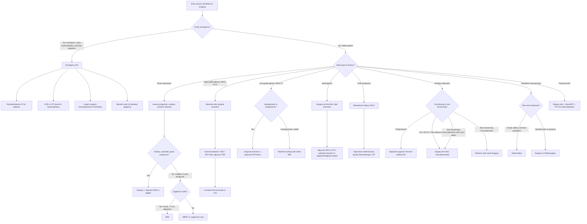

## Management of Brain Tumours

### Guiding Principles

Before diving into specific treatment modalities, let's establish the overarching philosophy. Managing brain tumours is fundamentally different from managing extracranial malignancies because:

1. The brain is an **unforgiving organ** — even small amounts of collateral damage during treatment can produce devastating, permanent neurological deficits.
2. **"Resection margin"** as understood in general surgery (achieving clear margins with 1–2 cm of normal tissue) ***is difficult*** in neurosurgery [1] — you cannot simply cut away 2 cm of normal brain around a tumour in the motor cortex.
3. Some tumours are better treated without surgery at all (e.g., CNS lymphoma → biopsy only; prolactinoma → medical therapy first).

***Principles of brain tumour management*** [1]:
- ***Aim at cure if feasible***
- ***Preserve life***
- ***Preserve function***
- ***Preserve personhood***
- ***Maximise quality of life***
- ***Do not treat the scan*** — i.e., the presence of an abnormality on imaging alone does not mandate intervention; clinical context matters

***Treatment options for brain tumours*** [1][2]:
- ***General medication therapy***
- ***Surgical biopsy and resection***
- ***Radiation therapy***
- ***Chemotherapy***
- ***Target therapy***
- ***Immunotherapy***

---

### Overview Management Algorithm

---

### A. Medical Therapy

Medical therapy in brain tumours serves two main roles: (1) **symptom control** (oedema, seizures) and (2) **definitive treatment** (in specific tumour types like prolactinoma and CNS lymphoma).

#### 1. High-Dose Glucocorticoids — Dexamethasone

***Steroids (e.g., dexamethasone)*** [1][2]:

**Mechanism**: Dexamethasone reduces vasogenic oedema by restoring blood–brain barrier (BBB) integrity. It decreases capillary permeability and reduces VEGF expression by tumour cells. The result is a rapid decrease in peri-tumoural oedema → reduction in mass effect → improvement in neurological symptoms, sometimes dramatically within hours.

**Why dexamethasone specifically?** Dexamethasone is preferred over other corticosteroids because:
- It has minimal mineralocorticoid activity (does not cause salt/water retention → less cerebral oedema exacerbation)
- Long half-life (~36 hours) → convenient dosing
- High glucocorticoid potency

***Dosing*** [2]:
- ***PO (or IV if severe) dexamethasone 10 mg loading then 4 mg Q4h or 8 mg BD***

***Indications*** [1]:
- ***↓ Cerebral oedema and relieve symptoms***
- ***Peri-operative use*** (to reduce surgical swelling)
- ***Palliation*** (in inoperable tumours)
- Raised ICP due to CNS infections and brain tumours [15]

***Contraindications/Cautions*** [1][2]:
- ***Exclude infection first*** — steroids will immunosuppress and worsen CNS infections (e.g., abscess, TB) [1]
- ***C/I: suspected CNS lymphoma → steroid causes acute lysis of lymphocytes → ↓ diagnostic yield on biopsy*** (the "ghost tumour" phenomenon) [2]
- ***Avoid in cerebral infarction or haemorrhage*** — steroids worsen outcomes in stroke [15]

***Side effects*** [1][2]:
- ***DM (diabetes mellitus)*** — glucocorticoid-induced hyperglycaemia
- ***Immunosuppression*** — increased infection risk
- ***Peptic ulcer*** — need PPI prophylaxis
- Proximal myopathy (chronic use), osteoporosis, Cushingoid features, psychosis

<Callout title="Clinical Pearl — Dexamethasone and Brain Tumours">
Think of dexamethasone as a "bridge therapy" — it buys time by reducing oedema and improving symptoms while you plan definitive treatment (surgery, chemoRT). It does NOT treat the tumour itself (except in lymphoma, where it paradoxically destroys the tumour cells — which is exactly why you must NOT give it before biopsy in suspected lymphoma).
</Callout>

#### 2. Anticonvulsants

***Anticonvulsants (e.g., phenytoin, levetiracetam)*** [1][2]:

**Mechanism**: Brain tumours cause seizures via peri-tumoural cortical irritation (glutamate excitotoxicity, ionic imbalances, oedema). Anticonvulsants stabilise neuronal membranes or modulate neurotransmitter activity.

***Levetiracetam (Keppra)*** is the most commonly used in the brain tumour setting [2]:
- Favourable drug interaction profile (does not induce hepatic CYP450 enzymes, unlike phenytoin or carbamazepine — important because chemotherapy agents like temozolomide are hepatically metabolised)
- Fewer side effects than older agents
- No need for therapeutic drug monitoring

***Indications*** [1][2]:
- ***Prophylaxis or treatment (if patient has already had a seizure)***
- ***Not for infratentorial lesions*** [1] — because the cerebellar cortex is inhibitory and does not generate seizures [2]
- ***Usually not for primary prophylaxis*** in patients who have never had a seizure [2] — evidence does not support routine prophylactic AEDs in brain tumour patients without prior seizures (AAN guidelines)

***Exceptions where primary prophylaxis may be considered***:
- Peri-operative period (perioperative seizure prophylaxis for supratentorial craniotomy — typically for 7 days post-op)
- Melanoma brain metastases (higher seizure risk)

#### 3. Tranexamic Acid

***Tranexamic acid — perioperatively to reduce bleeding*** [1].

Tranexamic acid (from Latin *trans* = across + *amine* + *acid*) is an antifibrinolytic — it inhibits plasminogen activation, preventing the breakdown of fibrin clots. Used during craniotomy to reduce intraoperative blood loss.

#### 4. Mannitol and Other ICP-Lowering Agents

For acute raised ICP due to brain tumour with mass effect [15]:

| Agent | Mechanism | Key Points |
|---|---|---|
| **Mannitol** | Osmotic diuretic — draws free water from brain tissue into circulation | Onset 15 min, duration 6 hours. Needs Foley catheter. Avoid in renal failure, hypernatraemia, serum osmolality > 320 mOsm/L [15] |
| **Hypertonic saline (3% NaCl)** | Similar osmotic mechanism to mannitol | Alternative to mannitol; may be preferred in hypovolaemic patients |
| **Hyperventilation** | Lowers PaCO₂ → cerebral vasoconstriction → ↓ intracranial blood volume → ↓ ICP | Target PaCO₂ 3.0–3.5 kPa (26–30 mmHg). Only as emergency temporising measure — rebound effect if prolonged [15] |

---

### B. Surgery

Surgery is the cornerstone of brain tumour management for most tumour types — it provides both **tissue diagnosis** and **cytoreduction**.

#### Principles of Brain Tumour Surgery

***Principles of brain tumour surgery*** [1]:
- ***Obtain histological diagnosis***
- ***Maximal safe removal*** — remove as much tumour as possible without causing new neurological deficits
- ***Preserve life***
- ***Preserve function***
- ***"Resection margin" is difficult*** in neurosurgery — unlike extracranial surgery, you cannot take wide margins around brain tumours because surrounding tissue is functional [1]

***Key surgical decisions*** [1]:
- ***Whether/When to resect?***
- ***How to resect?***
- ***How much to resect?***

***Spectrum of surgical intervention by tumour type*** [1]:

| Tumour Type | Surgical Approach | Rationale |
|---|---|---|
| ***CNS lymphoma*** | ***Biopsy only*** [1] | Surgery does not improve survival; definitive treatment is chemotherapy (high-dose methotrexate) |
| ***Meningioma*** | ***Total resection*** [1] | Well-circumscribed, extra-axial; complete resection is often curative |
| ***Glioma in eloquent area*** | ***Subtotal removal*** [1] | Complete resection would cause unacceptable neurological deficit; debulk what is safely possible |
| ***Non-functioning incidentaloma*** | ***Observe*** [1] | Small, asymptomatic, not causing mass effect — serial imaging surveillance |

#### Surgical Approaches [2]

| Approach | Description | Main Use |
|---|---|---|
| ***Craniotomy*** | Flap of bone cut and reflected, then replaced after surgery | Main approach for tumour resection (convexity, parasagittal) |
| ***Burr hole*** | Small hole drilled in skull | Often for stereotactic biopsy (e.g., deep-seated tumours, lymphoma) |
| ***Craniectomy*** | Bone is removed and NOT replaced | Decompressive craniectomy for severe brain swelling |
| ***Transsphenoidal (transnasal or sublabial)*** | Access through sphenoid sinus to sella turcica | ***Pituitary adenomas — route of choice*** [4][5] |
| ***Transoral*** | Access through mouth | Anterior foramen magnum/upper cervical lesions |

#### Operative Techniques [2]

Modern neurosurgery employs several adjunctive technologies to maximise safe resection:

| Technique | How It Works | Why It Helps |
|---|---|---|
| ***Frameless stereotaxy (image-guided surgery)*** | Small skull markers allow intraoperative localisation of a handheld probe relative to pre-operative imaging [2] | Surgeon can see in real-time where the probe tip is relative to the tumour and critical structures (mapped by fMRI/DTI) |
| ***Evoked potentials*** | Detect cortical electrical response to sensory stimuli, or peripheral motor response to cortical electrical stimulation [2] | Real-time functional monitoring — warns the surgeon if the resection approaches a functionally important tract |
| ***Awake craniotomy*** | Patient is awake during part of the surgery; intraoperative electrical stimulation of cortex → observe speech/motor response [2] | ***Maps speech cortex → guides resection to avoid affecting speech*** [2]. Used when tumour is in or near Broca's/Wernicke's area |
| ***5-ALA-guided resection*** | ***5-aminolevulinic acid (5-ALA) is a precursor in haeme/porphyrin biosynthesis that accumulates in tumour cells → intraoperative UV light → tumour fluoresces a different colour*** [2] | Allows visual distinction between tumour (fluorescent pink) and normal brain (blue) → more complete resection |

#### Surgical Indications by Tumour Type

##### Brain Metastases [1][2]

***Surgery ± adjuvant radiotherapy if*** [2]:
- ***Solitary operable lesion (esp if large, symptomatic, oedematous)***
- ***Young patient with good function and reasonable life expectancy***
- ***Stable systemic disease, esp if effective systemic Tx available*** (e.g., hormonal Tx in Ca breast, ***EGFR/ALK TKI in NSCLC***, ***immunotherapy in melanoma***)

***Indications for resecting brain metastasis*** [1] — this is essential knowledge:
- Tissue diagnosis needed (especially if solitary lesion and no known primary)
- Large symptomatic lesion causing significant mass effect
- Accessible location with acceptable surgical risk

##### Pituitary Adenomas [4][5][10]

***Surgery — indication: all functioning tumours (except prolactinoma) and all macroadenomas*** [4]:

***Surgical approach*** [4]:
- ***Trans-sphenoidal (route of choice)***: transnasal endoscopic or sublabial
  - ***Unresectable if tumour compresses/abuts optic pathway or invades cavernous sinus → maximal debulking instead*** [4]
- ***Transfrontal if very large suprasellar extension or severe chiasmal compression*** [4]

***Advantages*** [4]:
- ***Rapid ↓ secretion and ↓ size → remission > 85% for microadenomas, 40–50% for macroadenomas***

***Disadvantages / Complications*** [4][10]:
- ***Residual or recurrence esp if macroadenomas (2–8%)*** [4]
- ***Hypopituitarism*** — may require lifelong hormone replacement
- ***Diabetes insipidus (DI)*** — due to surgical injury to stalk or posterior pituitary (may be transient) [4]
- ***CSF leakage (rhinorrhoea)*** — occurs in 0.5–4%; failure to stop increases risk of meningitis [10]
- ***Vision loss*** — if optic nerve/chiasm damaged during surgery
- ***Vascular injury and CVA*** — internal carotid artery is immediately lateral in the cavernous sinus
- ***Intracranial haemorrhage***
- ***ENT symptoms*** — nasal congestion, crusting (transsphenoidal approach goes through nasal cavity)
- ***Meningitis*** — if CSF leak not controlled
- ***Mortality*** — very rare in experienced centres

***Follow-up*** [4]:
- ***Monitor pituitary function for 4–6 weeks for hypopituitarism***
- ***Post-op imaging at 1 year, 2 years, 5 years, 10 years for any recurrence***

<Callout title="Exam Essential — Complications of Transsphenoidal Surgery">
***Essential knowledge: treatment principles for pituitary adenoma and complications of transsphenoidal surgery*** [1]. The three most commonly tested complications are: (1) ***Diabetes insipidus*** (stalk injury → loss of ADH), (2) ***CSF leak/meningitis*** (breach of sellar floor/dura), and (3) ***Hypopituitarism*** (damage to normal pituitary tissue). Always remember that DI can be **transient** (stalk bruising) or **permanent** (stalk transection).
</Callout>

#### Post-operative Complications of Brain Surgery (General) [2]

| Complication | Mechanism |
|---|---|
| ***Haemorrhage*** | Intraoperative or post-operative bleeding into tumour bed |
| ***Brain swelling*** | Reactive oedema, manipulation injury |
| ***Hydrocephalus*** | CSF pathway disruption, post-operative blood in ventricles |
| ***Seizure*** | Cortical irritation from surgical manipulation |
| ***New neurological deficit*** | Damage to eloquent cortex or tracts during resection |
| ***Infections*** | Wound infection, meningitis, abscess |

**Rehabilitation** is a critical component of post-operative care [2]:
- ***Physiotherapy, occupational therapy, speech therapy, clinical psychology***

---

### C. Radiotherapy

***Radiation therapy for brain tumours aims to deliver a high treatment dose to the tumour bed while minimising radiation to normal tissue — a balance between treatment efficacy and side effects*** [1].

#### Modalities of Radiotherapy [1][2]

| Modality | Mechanism | Key Features |
|---|---|---|
| ***External beam radiotherapy (ERT/EBRT)*** | Standard radiotherapy with parallel rays [2] | Delivered in fractionated doses (e.g., 30 fractions over 6 weeks). Used for gliomas, post-operative adjuvant treatment. |
| ***Stereotactic radiosurgery (SRS)*** | ***Focused radiation beams converge onto tumour*** [1] | Single high-dose fraction (or hypofractionated). Extremely precise targeting. Key modalities: ***X-knife (linear accelerator), Gamma knife (gamma source)*** [1][2]. |
| ***Cyberknife*** | ***Uses real-time imaging and moves to adjust to movement*** [1] | Allows treatment of moving targets (e.g., lung, liver metastases) — less relevant for brain (brain doesn't move) but conceptually important. |
| **Interstitial brachytherapy** | Radioactive source placed directly within brain tissue [2] | Rarely used. |
| **Whole brain radiotherapy (WBRT)** | Treats the entire brain | Historically used for brain metastases to treat micrometastases. Falling out of favour due to severe neurocognitive side effects. |

#### SRS (Radiosurgery) for Brain Metastases [1][2]

***Radiosurgery for brain metastasis*** [1]:
- ***Size limit ~2.5–3 cm but can treat multiple lesions*** [1]
- ***Radiation necrosis can occur*** as a complication [1]
- ***Now more preferred*** over WBRT as adjuvant RT after surgery [2]
- ***Alternative to surgery if small/inoperable, or for small oligometastases ( < 3 cm)*** [2]

#### Indications for Radiotherapy by Tumour Type

| Tumour | RT Role | Specific Details |
|---|---|---|
| **Brain metastases** | Adjuvant after surgery (SRS preferred) or primary for inoperable | ***SRS: as alternative to surgery if small/inoperable; WBRT: if not eligible to SRS/surgery, e.g., multiple bulky tumours*** [2] |
| ***Malignant glioma (WHO III–IV)*** | ***Chemoirradiation with temozolomide (TMZ) — standard therapy*** [1] | ***Concomitant TMZ + ERT, then adjuvant TMZ*** (Stupp protocol) [1][2] |
| **Meningioma** | Adjuvant after subtotal resection, or primary if inoperable | ***Radiosurgery or wide-field external RT as adjunct*** [2] |
| **Pituitary adenoma** | ***Usually as adjunct to surgery (for residual tumours)*** [4] | ***Conventional EBRT or SRS by gamma/X-knife*** [4]. ***NOT used if < 5 mm from optic chiasm*** (risk of optic neuropathy) [4]. ***Delayed effect on secretion → not used acutely*** [4]. ***Higher incidence of hypopituitarism (up to 80%)*** [4]. |
| ***Vestibular schwannoma*** | Alternative to surgery | ***Surgery/Radiosurgery*** [1] — SRS increasingly used for small-to-medium tumours |
| **Pineal tumours** | ***Chemo or radiotherapy (mainstay)*** [2] | Surgical resection is dangerous → biopsy only; germ cell tumours are exquisitely radiosensitive |
| **Medulloblastoma** | Craniospinal irradiation + chemotherapy | Mandatory post-surgical adjuvant due to high CSF dissemination risk |

#### Complications of Cranial Irradiation [2]

| Acute Complications | Chronic Complications |
|---|---|
| ***Fatigue, loss of appetite (very common)*** | ***Radionecrosis: typically 1–3 years after RT*** — S/S: focal deficit near original tumour site, raised ICP. Mx: steroids. |
| ***Headache: typically mild*** (cf severe headache in tumour progression) | ***Neurocognitive deficits*** — ***WBRT: ↓ learning, memory 3 months – 1 year, long-term ↓↓ QoL*** [2]. Partial brain RT: significantly less risk. |
| ***Nausea/vomiting*** | ***Vasculopathy and ischaemic stroke*** |
| ***Initial worsening of prior neurological S/S*** — due to reactive swelling → ***should pre-treat with steroids*** | ***Hypopituitarism: up to 80%*** — low threshold to screen post-RT [2] |
| ***Radiation dermatitis and alopecia*** | ***Ocular toxicity: cataract, optic neuropathy, dry eye*** |
| ***Acute encephalopathy (uncommon but severe)*** — S/S: severe headache, nausea, drowsiness, fever, focal neuro. Uncommon except at very high dose. | ***Ototoxicity (SN hearing loss)*** |
| | ***Secondary brain tumours*** (long-term risk) |

<Callout title="WBRT vs SRS — The Paradigm Shift" type="idea">
The trend in 2025–2026 is to **avoid WBRT** whenever possible due to devastating neurocognitive toxicity. ***SRS is now more preferred*** [2] — it can treat multiple lesions without the diffuse brain damage of WBRT. WBRT is reserved for patients with numerous bulky metastases who are not candidates for SRS or surgery, or as prophylactic cranial irradiation (PCI) in SCLC [16].
</Callout>

---

### D. Chemotherapy and Systemic Therapy

#### 1. Temozolomide (TMZ) — The Cornerstone for Malignant Glioma

***Treatment for malignant glioma (WHO III or IV)*** [1]:
- ***Maximal safe surgical removal where feasible***
- ***Chemoirradiation with temozolomide (TMZ)***
  - ***Standard therapy***
  - ***TMZ is an alkylating agent*** — it adds alkyl groups to DNA bases (particularly O6-guanine), causing DNA mismatch → triggers apoptosis in tumour cells
  - ***Concomitant TMZ + ERT, then adjuvant TMZ*** [1] — this is the **Stupp protocol** (TMZ given daily during 6 weeks of RT, then 6 cycles of adjuvant TMZ, 5 days per 28-day cycle) [2]
- ***Anti-angiogenesis agents — e.g., bevacizumab*** [1] — a monoclonal antibody against VEGF (vascular endothelial growth factor). By blocking VEGF, it reduces tumour angiogenesis and vasogenic oedema. Used as second-line therapy or at recurrence.
- ***Tumour Treating Fields (TTF)*** [1] — a novel modality using alternating electric fields delivered via adhesive transducer arrays on the shaved scalp. The electric fields disrupt mitotic spindle formation in dividing tumour cells, selectively inhibiting rapidly dividing cells. Approved as adjuvant treatment alongside TMZ.

**MGMT promoter methylation** — a critical molecular biomarker:
- MGMT (O6-methylguanine-DNA methyltransferase) is a DNA repair enzyme that removes alkyl groups from O6-guanine — directly reversing the damage caused by TMZ.
- If the **MGMT promoter is methylated** (silenced), the tumour cannot repair TMZ-induced DNA damage → **better response to TMZ** and improved survival.
- If MGMT is unmethylated → the tumour repairs TMZ damage efficiently → poorer response.

#### 2. High-Dose Methotrexate — CNS Lymphoma

Primary CNS lymphoma is treated with **high-dose methotrexate (HD-MTX)-based chemotherapy** (typically ≥ 3.5 g/m²) ± whole brain RT:
- Methotrexate at standard doses does not cross the BBB — high doses are required to achieve therapeutic CNS concentrations.
- RT alone leads to high relapse rates and neurocognitive toxicity — combination chemo-RT improves outcomes.
- In elderly patients, HD-MTX alone (without RT) may be preferred to avoid RT-induced cognitive decline.

#### 3. Chemotherapy for Other Tumour Types

| Tumour | Chemotherapy | Key Points |
|---|---|---|
| **Medulloblastoma** | Cisplatin/carboplatin + vincristine + cyclophosphamide ± lomustine | Standard post-surgical adjuvant combined with craniospinal irradiation |
| **Oligodendroglioma** | PCV (procarbazine, lomustine/CCNU, vincristine) or TMZ | 1p/19q co-deleted oligodendrogliomas are chemosensitive → excellent prognosis with combined RT + PCV |
| **Germ cell tumours** | Cisplatin-based regimens | Highly chemo- and radiosensitive |

#### 4. Targeted Therapy and Immunotherapy

***Target therapy and immunotherapy*** are increasingly used in brain tumours [1]:

| Agent | Target | Tumour Type | Mechanism |
|---|---|---|---|
| ***Bevacizumab*** | ***VEGF*** | ***GBM (second-line)*** [1] | Anti-angiogenesis → reduces tumour vasculature and oedema |
| **EGFR TKIs** (erlotinib, osimertinib) | EGFR | Brain metastases from EGFR-mutant NSCLC | BBB-penetrant TKIs target driver mutation; important in Hong Kong where EGFR-mutant NSCLC is common |
| **ALK inhibitors** (alectinib, lorlatinib) | ALK | Brain metastases from ALK-rearranged NSCLC | Excellent CNS penetration |
| **Immune checkpoint inhibitors** (nivolumab, pembrolizumab) | PD-1/PD-L1 | Brain metastases from melanoma, NSCLC | Activate anti-tumour immune response; less effective in primary brain tumours due to immunosuppressive tumour microenvironment |
| **Everolimus** | mTOR | SEGA in tuberous sclerosis | Directly targets mTOR pathway upregulated in TSC-related tumours |

---

### E. Pituitary Adenoma — Special Management Considerations

***Approach to management*** [4][5]:
- ***Observe if non-functional microadenoma*** [4][5]
- ***Treat if functional or macroadenoma or mass effect*** [4][5]

| Adenoma Type | First-line Treatment | Rationale |
|---|---|---|
| ***Prolactinoma*** | ***Medical Tx: dopamine agonist (first-line only for prolactinoma)*** [4][5] | Dopamine tonically inhibits prolactin secretion. Dopamine agonists (cabergoline > bromocriptine) shrink the tumour and normalise prolactin in 70–100% of cases [10]. Cabergoline preferred due to ***higher efficacy (70–100% success rate) and favourable side effect profile*** [10]. |
| ***GH-secreting adenoma*** | ***Surgery first-line: transsphenoidal*** [4] | Medical therapy (somatostatin analogues — octreotide, lanreotide; GH receptor antagonist — pegvisomant) used if surgery fails or as bridge |
| ***ACTH-secreting adenoma*** | ***Surgery first-line: transsphenoidal*** [4] | Medical therapy (ketoconazole, osilodrostat, pasireotide) as second-line |
| ***TSH-secreting adenoma*** | ***Surgery first-line*** [4] | Somatostatin analogues (octreotide) as adjunct |
| ***Non-functioning microadenoma*** | ***Observe*** [4][5] | No mass effect, no hormonal hypersecretion → serial MRI and hormone panels |
| ***Non-functioning macroadenoma / mass effect*** | ***Surgery*** [4][5] | Causing visual loss, hypopituitarism, or progressive growth |

***Radiotherapy for pituitary adenomas*** [4]:
- ***Usually as adjunct to surgery (for residual tumours)***
- ***May be primary therapy for macroprolactinoma*** (if refractory to medical therapy and surgery)
- ***Modalities: conventional EBRT or stereotactic radiosurgery (SRS) by gamma/X-knife*** [4]
- ***Advantages: restrains tumour growth***
- ***Disadvantages***:
  - ***Delayed effect on secretion (not used in the acute setting)*** [4]
  - ***Higher incidence of hypopituitarism*** [4]
  - ***Risk of damage to other structures — NOT used if < 5 mm from optic chiasm*** [4]

---

### F. Vestibular Schwannoma Management [1][2]

***Surgery/Radiosurgery*** [1]:

| Scenario | Management |
|---|---|
| Small tumour, elderly patient, minimal symptoms, limited hearing loss | ***Observation*** with serial MRI [2] |
| Symptomatic, growing, or large tumour | ***Surgery*** (microsurgical excision via retrosigmoid, translabyrinthine, or middle fossa approach) |
| Small-to-medium tumour, patient preference or surgical risk | ***Radiosurgery (SRS)*** — effective tumour control rates > 90% |
| ***Bilateral vestibular schwannomas (NF2)*** [1] | Requires MDT approach; hearing preservation surgery or radiosurgery; consider bevacizumab |

---

### G. Management of Specific Emergencies

#### 1. Pituitary Apoplexy [1][2]

***Pituitary apoplexy — acute visual loss, hormonal crisis, SAH*** [1]:

***Management*** [2]:
- ***Steroid cover*** — hydrocortisone 100 mg IV stat then 50 mg Q8h (adrenal crisis is the immediate life-threat)
- ***Urgent surgical decompression*** (transsphenoidal) if:
  - ***Signs of raised ICP***
  - ***Change in conscious state***
  - ***Evidence of compression on neighbouring structures*** (progressive visual loss, CN III palsy)
- If haemodynamically stable with mild symptoms → conservative management with close monitoring may be acceptable

#### 2. Acute Hydrocephalus from Posterior Fossa Tumour [2][15]

- **External ventricular drain (EVD)**: Catheter placed into lateral ventricle → drains CSF externally → immediate ICP reduction [15]
- ***CSF shunting*** (VP shunt): Long-term solution for chronic hydrocephalus [2]
- ***Endoscopic third ventriculostomy (ETV)***: Puncture floor of 3rd ventricle → bypasses obstruction → particularly useful for obstructive hydrocephalus from pineal region or posterior fossa tumours [2]

#### 3. Brain Herniation

- **ABC** assessment and stabilisation
- Dexamethasone IV + mannitol/hypertonic saline
- Emergency craniotomy/craniectomy for decompression
- EVD if hydrocephalus contributing

---

### H. Supportive and Palliative Care

***Management choice for brain metastases is based on prognosis as brain met often implies poor prognosis (survival ≤ 6 months)*** [2]:

- ***Dexamethasone + AED for symptomatic relief*** [2]
- ***Supportive care if poor functional status*** [2]
- Prognosis:
  - ***Untreated brain metastases: 1 month*** [2]
  - ***Surgery + WBRT: ~10–12 months*** [2]

Supportive care encompasses:
- Pain management (WHO analgesic ladder)
- Antiemetics for tumour-related nausea/vomiting
- Physiotherapy, occupational therapy, speech therapy
- Clinical psychology and psychiatric support
- End-of-life care planning and hospice involvement

---

### Summary Table — Management by Tumour Type

| Tumour | Surgery | Radiotherapy | Chemotherapy/Systemic | Other |
|---|---|---|---|---|
| ***Brain metastases*** | Solitary, operable, good prognosis | SRS (preferred) or WBRT | Systemic therapy based on primary (EGFR TKI, immunotherapy) | Dexamethasone + AED |
| ***GBM (WHO IV)*** | ***Maximal safe resection*** | ***ERT (concomitant with TMZ)*** | ***TMZ (Stupp protocol); bevacizumab 2nd line*** | ***TTF*** |
| ***Low-grade glioma*** | Resection if symptomatic/progressive | ± Adjuvant | ± TMZ/PCV (esp. 1p/19q co-deleted) | Watchful waiting if asymptomatic |
| ***Meningioma*** | ***Total resection (first-line)*** | ***SRS or EBRT as adjunct*** | Not standard | |
| ***CNS lymphoma*** | ***Biopsy only*** | ± WBRT | ***HD-MTX-based chemotherapy*** | ***No steroids before biopsy*** |
| ***Prolactinoma*** | Second-line (if refractory) | Adjunct | ***Dopamine agonist (cabergoline) = first-line*** | |
| ***Other pituitary adenomas*** | ***Transsphenoidal = first-line*** | Adjunct for residual | Medical therapy as second-line | |
| ***Vestibular schwannoma*** | Microsurgery if large/symptomatic | ***SRS*** | Bevacizumab (NF2) | Observation if small |
| ***Pineal tumours*** | ***Biopsy only*** | ***ChemoRT = mainstay*** | Cisplatin-based (germ cell) | ***ETV for hydrocephalus*** |
| ***Medulloblastoma*** | Maximal resection | Craniospinal irradiation | Adjuvant multi-agent chemo | |

---

<Callout title="High Yield Summary — Management of Brain Tumours">

1. ***Treatment options: medical therapy, surgical biopsy/resection, radiation, chemotherapy, targeted therapy, immunotherapy*** [1].
2. ***Principles: aim at cure if feasible; preserve life, function, personhood; maximise QoL; do not treat the scan*** [1].
3. ***Dexamethasone***: reduces vasogenic oedema via BBB restoration. ***C/I in suspected CNS lymphoma*** (ghost tumour) [1][2].
4. ***Anticonvulsants***: for treatment/secondary prophylaxis of seizures in supratentorial tumours. ***Not for infratentorial lesions***. Usually NOT for primary prophylaxis [1][2].
5. ***Surgery***: maximal safe removal; resection margin concept does not apply. CNS lymphoma = biopsy only; meningioma = total resection; glioma in eloquent area = subtotal removal [1].
6. ***Transsphenoidal surgery***: route of choice for pituitary adenomas. Key complications: DI, CSF leak/meningitis, hypopituitarism [1][4].
7. ***Radiosurgery (SRS)***: focused converging beams; size limit ~2.5–3 cm; now preferred over WBRT for metastases [1][2].
8. ***Malignant glioma (Stupp protocol)***: maximal safe resection → concomitant TMZ + ERT → adjuvant TMZ [1][2].
9. ***Prolactinoma***: the ONLY pituitary adenoma where medical therapy (dopamine agonist) is first-line [4][5].
10. ***MGMT methylation***: predicts TMZ response in GBM — methylated = better prognosis.
11. ***Pituitary apoplexy***: steroid cover + urgent surgical decompression if deteriorating vision/consciousness [1][2].
12. ***Brain metastases prognosis***: untreated = 1 month; surgery + WBRT = 10–12 months [2].
</Callout>

---

<ActiveRecallQuiz
  title="Active Recall — Management of Brain Tumours"
  items={[
    {
      question: "Why must you NOT give dexamethasone before biopsy in suspected primary CNS lymphoma?",
      markscheme: "Dexamethasone causes acute lysis of lymphocytes (lymphoma cells are exquisitely steroid-sensitive). This leads to the 'ghost tumour' phenomenon where the tumour shrinks or disappears, dramatically reducing the diagnostic yield on stereotactic biopsy. Steroids should only be given after tissue diagnosis is obtained.",
    },
    {
      question: "Describe the Stupp protocol for GBM management, including the drug mechanism of temozolomide and the molecular marker that predicts response.",
      markscheme: "Stupp protocol: maximal safe surgical resection, followed by concomitant temozolomide (TMZ) daily during 6 weeks of external beam radiotherapy (ERT), then 6 cycles of adjuvant TMZ (5/28 days). TMZ is an alkylating agent that adds alkyl groups to O6-guanine, causing DNA mismatch and apoptosis. MGMT promoter methylation predicts response: methylated MGMT silences the DNA repair enzyme, preventing tumour cells from repairing TMZ-induced damage, leading to better outcomes.",
    },
    {
      question: "What are the three most commonly tested complications of transsphenoidal pituitary surgery?",
      markscheme: "(1) Diabetes insipidus (DI) — injury to pituitary stalk or posterior pituitary disrupts ADH secretion; may be transient or permanent. (2) CSF leak (rhinorrhoea) — breach of sellar floor/dura, occurs in 0.5-4%, increases risk of meningitis if not controlled. (3) Hypopituitarism — damage to normal pituitary tissue during adenoma removal; may require lifelong hormone replacement.",
    },
    {
      question: "A patient with multiple brain metastases from lung cancer presents with raised ICP. Outline the stepwise management approach.",
      markscheme: "Immediate: dexamethasone IV (10 mg loading then 4 mg Q4-6h) to reduce vasogenic oedema; anticonvulsants if seizures. Assess prognosis (performance status, number and size of mets, systemic disease control). If small oligometastases (< 3 cm): stereotactic radiosurgery (SRS). If multiple bulky tumours not eligible for SRS: whole brain radiotherapy (WBRT). Consider systemic therapy based on primary (EGFR TKI if EGFR-mutant NSCLC, immune checkpoint inhibitors). Supportive/palliative care if poor functional status. EVD or VP shunt if obstructive hydrocephalus.",
    },
    {
      question: "Why is the dopamine agonist cabergoline the first-line treatment for prolactinoma rather than surgery?",
      markscheme: "Prolactin secretion is tonically inhibited by dopamine from the hypothalamus via the pituitary stalk. Dopamine agonists (cabergoline, bromocriptine) mimic this inhibition, both suppressing prolactin secretion and shrinking tumour size. Cabergoline achieves normalisation of prolactin in 70-100% of cases — superior to surgical remission rates (especially for macroadenomas, where surgical remission is only 40-50%). Cabergoline is preferred over bromocriptine due to higher efficacy, longer half-life (twice weekly dosing), and fewer side effects (less nausea).",
    },
    {
      question: "What is the role of 5-ALA in brain tumour surgery and how does it work?",
      markscheme: "5-aminolevulinic acid (5-ALA) is a precursor in the haeme/porphyrin biosynthesis pathway. It is given orally pre-operatively and is selectively taken up and accumulated by tumour cells (which have upregulated porphyrin metabolism). Under intraoperative ultraviolet light, the accumulated porphyrins in tumour cells fluoresce pink/red, while normal brain tissue appears blue. This allows the surgeon to visually distinguish tumour from normal brain in real-time, enabling more complete and safer resection.",
    },
  ]}
/>

---

## References

[1] Lecture slides: GC 108. A mass in the brain brain tumours.pdf
[2] Senior notes: Ryan Ho Neurology.pdf (Section 8.3 Intracranial Tumours, pp. 163–167)
[4] Senior notes: Ryan Ho Endocrine.pdf (pp. 107–108 — Pituitary adenoma management, surgery, RT)
[5] Senior notes: Ryan Ho Fundamentals.pdf (pp. 441–442 — Pituitary Tumour management)
[10] Senior notes: felixlai.md (Pituitary adenoma — surgical treatment, dopamine agonists)
[15] Senior notes: felixlai.md (Treatment of increased ICP — mannitol, corticosteroids, hyperventilation, AEDs)
[16] Senior notes: Ryan Ho Respiratory.pdf (p. 150 — Prophylactic cranial irradiation in SCLC)
