# Breast Lump / Nipple Discharge — History Taking

## Master Framework

```mermaid
graph TD
    A["Chief Complaint:<br/>Breast Lump / Nipple Discharge"] --> B["Presenting Complaint<br/>Analysis"]
    A --> C["Associated Breast<br/>Symptoms"]
    A --> D["Systemic Review"]
    A --> E["Risk Factor<br/>Assessment"]
    A --> F["PMHx / PSHx /<br/>Medications / Allergies"]
    A --> G["Family History"]
    A --> H["Social History"]
    A --> I["Functional Baseline"]

    B --> B1["Lump: onset, site,<br/>size, number, changes,<br/>pain, cyclicity"]
    B --> B2["Discharge: colour,<br/>laterality, duct number,<br/>spontaneous vs expressed"]

    C --> C1["Nipple changes (5Ds)"]
    C --> C2["Skin changes:<br/>dimpling, peau d'orange,<br/>ulceration, erythema"]
    C --> C3["Mastalgia"]

    D --> D1["Constitutional:<br/>LOW, LOA, fever"]
    D --> D2["Metastatic screen:<br/>bone pain, SOB,<br/>jaundice, abdo pain"]

    E --> E1["Oestrogen exposure:<br/>menarche, menopause,<br/>parity, breastfeeding,<br/>OCP/HRT"]
    E --> E2["Previous breast<br/>pathology / radiation"]
    E --> E3["Genetic / FHx:<br/>BRCA, Li-Fraumeni"]

    F --> F1["Previous breast Bx<br/>or surgery"]
    F --> F2["Drug history incl.<br/>dopamine antagonists"]

    G --> G1["CA breast / ovary /<br/>prostate / pancreas<br/>in 1st-degree relatives"]

    H --> H1["Smoking, alcohol,<br/>occupation, psychosocial"]
```

---

## 1. Focused Presenting Complaint — Breast Lump

The way you open matters. Begin with open questions, then funnel down.

### 1A. How Did You Discover the Lump?

| Question                                    | Why it matters                                                                                                                      | Cantonese phrasing                                                    |
| ------------------------------------------- | ----------------------------------------------------------------------------------------------------------------------------------- | --------------------------------------------------------------------- |
| "How did you first notice it?"              | Self-exam vs incidental vs screening finding — affects likelihood of pathology                                                      | 你係點樣發現呢粒嘢㗎？(néih haih dím yéung faat yihn nī nāp yéh gaa?) |
| "How long has it been there?"               | **_Chronic lumps more likely to be benign_**; rapidly enlarging lumps in days → abscess/expanding cyst, in weeks → carcinoma [1][2] | 呢粒嘢出咗幾耐？(nī nāp yéh chēut jó géi noih?)                       |
| "Was there any preceding injury or trauma?" | Fat necrosis classically follows trauma — mimics carcinoma on exam [2]                                                              | 之前有冇撞親過個胸？(jī chìhn yáuh móuh jong chān gwō go hūng?)       |

### 1B. Characterise the Lump

| Question                             | Why it matters                                                                                                              | Cantonese                                                               |
| ------------------------------------ | --------------------------------------------------------------------------------------------------------------------------- | ----------------------------------------------------------------------- |
| "Is it one lump or more than one?"   | Multiple bilateral lumps favour benign fibrocystic changes; a single dominant mass needs triple assessment [1][2]           | 有一粒定幾粒？(yáuh yāt nāp dihng géi nāp?)                             |
| "Which breast? Where on the breast?" | **_50% of CA breast occurs in the upper outer quadrant including the axillary tail_** [3] — laterality plus location needed | 邊邊胸？喺邊個位置？(bīn bīn hūng? hái bīn go wái ji?)                  |
| "How big is it roughly?"             | Baseline size for monitoring                                                                                                | 大約幾大？(daaih yeuk géi daaih?)                                       |
| "Has it been getting bigger?"        | Progressive increase → malignancy or abscess [2]                                                                            | 有冇越嚟越大？(yáuh móuh yuht lèih yuht daaih?)                         |
| "Does it change with your periods?"  | **_Cyclical changes = more likely benign_** (fibrocystic changes, cysts) [1][2]                                             | 會唔會隨住月經有變化？(wúih m̀h wúih chèuih jyuh yuht gīng yáuh bin fa?) |
| "Is it painful?"                     | **_Painful lumps more likely to be benign_**; carcinoma is usually painless [2]                                             | 痛唔痛？(tung m̀h tung?)                                                 |
| "Have you had this before?"          | Recurrent cysts are common; previous breast disease raises cancer risk [2]                                                  | 以前有冇試過？(yíh chìhn yáuh móuh si gwō?)                             |

<Callout title="Why pain is paradoxically reassuring" type="idea">
  Most breast cancers present as *painless* lumps. Pain suggests cyst,
  fibrocystic change, abscess, or fat necrosis. However, **inflammatory breast
  cancer** and locally advanced disease *can* be painful — so pain alone never
  excludes malignancy.
</Callout>

### 1C. Are There Other Lumps?

> "Is this the only lump, or have you felt any others — in the other breast, under your arms, or in your neck?"

- **Contralateral lump**: bilateral primary breast carcinoma is not uncommon [2]
- **Axillary lump**: may represent nodal metastasis
- **Neck lump**: supraclavicular lymphadenopathy = N3 disease

Cantonese: 除咗呢粒之外，另一邊胸、腋下或者頸有冇摸到其他嘢？(chèuih jó nī nāp jī ngoih, lìhng yāt bīn hūng, yihk hàh waahk jé géng yáuh móuh mō dóu kèih tā yéh?)

---

## 2. Focused Presenting Complaint — Nipple Discharge

Three key gateway questions — commit these to memory [2][4]:

> **(1) Is it truly from the nipple?**
> **(2) Is it pathological?**
> **(3) Any recent pregnancy / breastfeeding?**

### 2A. Is It Truly Nipple Discharge?

| Question                                                                                          | Why it matters                                                                                               | Cantonese                                                                                                                                                       |
| ------------------------------------------------------------------------------------------------- | ------------------------------------------------------------------------------------------------------------ | --------------------------------------------------------------------------------------------------------------------------------------------------------------- |
| "How did you notice the discharge — staining on your bra or seeing fluid from the nipple itself?" | Some patients mistake skin exudate (eczema, **_Paget's disease of the nipple_**) for nipple discharge [2][4] | 你點樣發現有嘢流出嚟？係內衣有漬定係乳頭流出嚟？(néih dím yéung faat yihn yáuh yéh làuh chēut lèih? haih noih yī yáuh jih dihng haih yúh tàuh làuh chēut lèih?) |

### 2B. Is It Pathological?

Features that raise concern for pathological discharge [1][2][4][5]:

| Feature             | More worrisome                                | Less worrisome     |
| ------------------- | --------------------------------------------- | ------------------ |
| **Colour**          | **_Bloody (sanguineous) or serosanguineous_** | Milky, green, grey |
| **Laterality**      | **_Unilateral_**                              | Bilateral          |
| **Number of ducts** | **_Single duct (uniductal)_**                 | Multiple ducts     |
| **Spontaneity**     | **_Spontaneous_**                             | Only on expression |
| **Persistence**     | **_Persistent_**                              | Intermittent       |

Practical phrasing:

- "What colour is the discharge?" — 啲嘢流出嚟係咩色㗎？(dī yéh làuh chēut lèih haih mē sīk gaa?)
- "Is it from one spot on the nipple or from several?" — 係由乳頭一個位流出嚟定係幾個位？
- "Does it come out by itself or only when you squeeze?" — 係自己流出嚟定係㩒先至有？(haih jih géi làuh chēut lèih dihng haih gam sīn jì yáuh?)

### 2C. Colour-Based Differential Diagnosis

| Colour                                    | Think of…                                                                                                                       |
| ----------------------------------------- | ------------------------------------------------------------------------------------------------------------------------------- |
| Milky (bilateral, multiductal)            | Galactorrhoea → **_hyperprolactinaemia_** (prolactinoma, drugs, hypothyroidism, CKD) [3][6]                                     |
| Straw-coloured / serous                   | **_Intraductal papilloma_** (classical), physiological, DCIS [3]                                                                |
| Bloody / serosanguineous                  | **_Intraductal papilloma_** (most common cause of bloody discharge), **_DCIS_**, invasive ductal carcinoma, duct ectasia [3][5] |
| Greenish / black / multicoloured / cheesy | **_Duct ectasia_** [3]                                                                                                          |
| Purulent / foul-smelling                  | Mastitis / breast abscess [2]                                                                                                   |

### 2D. Recent Pregnancy / Breastfeeding

- Normal lactation may persist up to **6 months (up to 2 years)** after cessation of breastfeeding [3]
- **_Bloody nipple discharge can be seen in 20% of women during 2nd or 3rd trimester and during lactation — usually benign_** [3]
- Discharge present **>1 year after stopping breastfeeding** is worrisome and warrants investigation [2]

Cantonese: 你最近有冇懷孕或者餵母乳？幾時停㗎？(néih jeui gahn yáuh móuh wàaih yahn waahk jé wai móuh yúh? géi sìh tìhng gaa?)

---

## 3. Associated Breast Symptoms

### 3A. Nipple Changes — the **_5 Ds_** [1][3]

Always systematically screen for these:

| Feature                               | Significance                                                                                               | Cantonese                  |
| ------------------------------------- | ---------------------------------------------------------------------------------------------------------- | -------------------------- |
| **D**eviation / Displacement          | Underlying mass pulling the nipple                                                                         | 乳頭有冇歪咗？             |
| **D**iscolouration                    | Paget's disease                                                                                            | 乳頭有冇變色？             |
| **D**ermatitis (eczema-like)          | **_Paget's disease of the nipple_** — almost always associated with underlying breast cancer (HER2+ve) [3] | 乳頭有冇出疹、痕或者甩皮？ |
| **D**epression (retraction/inversion) | New-onset retraction suggests underlying carcinoma; congenital inversion is benign [3]                     | 乳頭有冇凹咗入去？         |
| **D**ischarge                         | As above                                                                                                   | 乳頭有冇嘢流出嚟？         |

<Callout title="Paget's Disease Trap" type="error">
  A common OSCE pitfall: unilateral nipple eczema that does not respond to
  topical steroids should be biopsied to rule out ***Paget's disease***. It is
  **almost ALWAYS associated with underlying breast cancer** [3]. Don't dismiss
  it as dermatitis!
</Callout>

### 3B. Skin Changes

- Dimpling / puckering → underlying cancer infiltrating fibrous septa
- **_Peau d'orange_** → tumour blocking lymphatics, causing oedema with pitting at hair follicles/sweat glands [3]
- Ulceration → locally advanced disease
- Erythema / warmth → inflammatory breast cancer (T4d) or abscess

Cantonese: 個胸皮膚有冇凹凸唔平、紅、損或者好似橙皮噉？(go hūng pèih fū yáuh móuh nāp daht m̀h pìhng, hùhng, syún waahk jé hóu chíh cháang pèih gám?)

### 3C. Mastalgia (Breast Pain)

- **Cyclical** (worse pre-menstrually, bilateral, diffuse) → fibrocystic changes (**_most common_**) [3]
- **Non-cyclical** (constant, unilateral, focal) → needs imaging; consider abscess, fibroadenoma, inflammatory CA breast [1]

---

## 4. Targeted Systems Review

### 4A. Constitutional Symptoms

- Loss of weight (LOW), loss of appetite (LOA), fatigue
- **_Systemic symptoms (LOW, LOA) rarely occur in early breast cancer_** — their presence suggests advanced disease [2]
- Fever → think infection (mastitis / abscess)

Cantonese: 有冇瘦咗、冇胃口或者成日覺得好攰？(yáuh móuh sau jó, móuh waih háu waahk jé sìhng yaht gok dāk hóu guih?)

### 4B. Metastatic Symptoms Screen

**_Metastatic symptoms generally come earlier than constitutional symptoms_** [2]:

| Site                   | Symptoms                                     | Cantonese              |
| ---------------------- | -------------------------------------------- | ---------------------- |
| **Bone** (most common) | Back pain, bone pain, pathological fractures | 有冇骨痛或者腰骨痛？   |
| **Lung / Pleura**      | Dyspnoea, cough                              | 有冇氣促或者咳？       |
| **Liver**              | Jaundice, nausea, abdominal pain             | 有冇眼黃、肚痛？       |
| **Brain**              | Headache, neurological deficits              | 有冇頭痛或者手腳冇力？ |

---

## 5. Risk Factors for Breast Cancer

This is the crux of the OSCE history — examiners will expect you to systematically cover **_oestrogen exposure_**, previous breast pathology, family history, and lifestyle factors [1][2][5][7].

### 5A. Oestrogen Exposure (O&G History)

| Question                                                                          | Risk factor                                                                                 | Cantonese                        |
| --------------------------------------------------------------------------------- | ------------------------------------------------------------------------------------------- | -------------------------------- |
| "How old were you when your periods started?"                                     | **_Early menarche (< 12 years)_** [2][7]                                                    | 你幾歲開始嚟月經？               |
| "Have your periods stopped? If so, when?"                                         | **_Late menopause (>55 years)_** [2][7]                                                     | 你收咗經未？幾歲收㗎？           |
| "When was your last menstrual period?"                                            | Determines pre- vs post-menopausal status (affects management and obesity-related risk) [3] | 你最後一次月經係幾時？           |
| "Have you been pregnant? How many times? What age was your first pregnancy?"      | **_Nulliparity or late first pregnancy (>30–35 years) → 2× risk_** [2][7]                   | 你有冇生過BB？第一胎幾歲？       |
| "Did you breastfeed? For how long?"                                               | **_No breastfeeding_** increases risk [2][7]                                                | 你有冇餵母乳？餵咗幾耐？         |
| "Are you taking or have you taken the contraceptive pill or hormone replacement?" | **_Oestrogen-based OCP, HRT_** (effect of HRT disappears ~5 years after stopping) [2][7]    | 你有冇食避孕藥或者荷爾蒙補充劑？ |

### 5B. Previous Breast History

- **_History of breast cancer_** (↑ risk in contralateral breast) [3]
- **_Atypical ductal hyperplasia (ADH) or atypical lobular hyperplasia (ALH)_** — substantial increase in subsequent cancer risk [3]
- Previous breast biopsy results and diagnoses
- **_Previous irradiation to the chest_** (e.g. mantle radiation for Hodgkin lymphoma) [2][7]
- Previous breast checkup: clinical examination, mammogram, ultrasound [2]

### 5C. Lifestyle

- **_Smoking_** (1.1× risk) [7]
- **_Alcohol_** (increased risk even at very low doses, especially if intake before 30 years) [2][7]
- **_Obesity_** — risk depends on menopausal status: ↓ risk in premenopausal, ↑ risk in postmenopausal women (peripheral aromatase in adipose tissue) [3]
- Lack of physical activity, night shift work [7]

### 5D. Previous Breast Augmentation

> **_Specifically ask about previous breast augmentation by injection/surgery_** — breast symptoms may be sequelae of augmentation (e.g. reaction to injection) [2]

Cantonese: 你有冇做過隆胸手術或者打過針？(néih yáuh móuh jou gwō lùhng hūng sáu seut waahk jé dá gwō jām?)

---

## 6. Family History

This is where you screen for hereditary breast cancer syndromes:

| Question                                                                                | Why                                                                                                                                  | Cantonese                                  |
| --------------------------------------------------------------------------------------- | ------------------------------------------------------------------------------------------------------------------------------------ | ------------------------------------------ |
| "Does anyone in your family have breast cancer? At what age? Which side of the family?" | **_1st-degree relative with CA breast → risk doubled_**; early onset (< 40 years) or bilateral disease suggests **_BRCA1/2_** [2][7] | 你屋企人有冇人生過乳癌？幾歲嗰陣？         |
| "Any ovarian, prostate, pancreatic, or colon cancer in the family?"                     | **_BRCA-associated cancers_** include ovary, prostate, pancreas, melanoma (BRCA2) [1][7]                                             | 屋企人有冇卵巢癌、前列腺癌、胰臟癌？       |
| "Any family member who had cancer at a very young age or multiple cancers?"             | **_Li-Fraumeni syndrome_** (TP53) — breast cancer, sarcoma, brain tumours, adrenocortical cancer, leukaemia [3]                      | 有冇家人好後生就生癌或者生過幾種唔同嘅癌？ |

---

## 7. Past Medical History, Surgical History, Medications & Allergies

### PMHx

- Diabetes mellitus (diabetic mastopathy — benign hard mass in long-standing DM) [2]
- Hypothyroidism (can cause hyperprolactinaemia → galactorrhoea) [3][6]
- Chronic kidney disease (↓ clearance of prolactin) [3][6]
- Previous cancer or radiotherapy

### Past Surgical History

- Previous breast surgery / biopsies (what was found?)
- Previous breast augmentation (injection / implant) [2]
- Previous thoracotomy (can rarely cause galactorrhoea) [6]

### Medications

- **_Drugs that cause hyperprolactinaemia_**: antipsychotics (haloperidol, risperidone), antiemetics (metoclopramide, domperidone), antidepressants (amitriptyline), H2 blockers, methyldopa, verapamil [3][6]
- OCP / HRT
- Tamoxifen (for patients with known breast disease)

### Allergies

- Drug allergies (document agent and reaction type)

---

## 8. Social History & Functional Baseline

| Domain                     | Details                                                                  |
| -------------------------- | ------------------------------------------------------------------------ |
| Smoking                    | Pack-years; current or ex-smoker                                         |
| Alcohol                    | Units per week; **_↑ alcoholic intake before 30 years_** raises risk [2] |
| Occupation                 | Night shift work [7]; exposure to radiation                              |
| Psychosocial               | Coping, anxiety about diagnosis; impact on daily life, body image        |
| Activities of Daily Living | Baseline functional status (relevant if surgery being considered)        |

Cantonese: 你飲唔飲酒？食唔食煙？(néih yám m̀h yám jáu? sihk m̀h sihk yīn?)

---

## 9. Differentiating Questions — Distinguishing Key Diagnoses

| If considering…                  | Key differentiating questions                                                                                            |
| -------------------------------- | ------------------------------------------------------------------------------------------------------------------------ |
| **Fibroadenoma** (< 30 y)        | Very mobile "breast mouse"? Painless? Slow growth?                                                                       |
| **Breast cyst** (30–55 y)        | Sudden appearance? Tense, fluctuant? Tender? Cyclical?                                                                   |
| **Fibrocystic changes**          | Bilateral lumpiness? Worse before menses, better after?                                                                  |
| **Fat necrosis**                 | History of trauma or surgery? Bruising?                                                                                  |
| **Breast abscess**               | Lactating? Fever? Rapid onset? Red, hot, swollen? Failed antibiotics?                                                    |
| **Duct ectasia**                 | Older woman? Multicoloured cheesy discharge? Nipple inversion? **_Not associated with increased risk of CA breast_** [3] |
| **Intraductal papilloma**        | **_Bloody or serous uniductal discharge_**? No palpable mass? [3]                                                        |
| **Paget's disease**              | Unilateral nipple eczema not responding to treatment? [3]                                                                |
| **Inflammatory breast CA** (T4d) | Painful swollen breast, peau d'orange involving ≥1/3 of breast, erythema? [1]                                            |
| **Galactorrhoea**                | Bilateral, milky, multiductal? On antipsychotics? Amenorrhoea? Visual field defects (pituitary macro-adenoma)? [6]       |

---

## 10. Red-Flag Findings & Escalation Triggers

The following should trigger **urgent referral** and fast-track triple assessment:

- **_New, hard, irregular, fixed, painless breast lump_** in a woman >30 years
- **_Unilateral, spontaneous, bloody, uniductal nipple discharge_**
- **_New-onset nipple inversion or retraction_** (not congenital)
- Unilateral nipple eczema / erosion (Paget's)
- Peau d'orange / skin tethering / skin ulceration
- Palpable axillary lymphadenopathy (hard, non-tender, fixed)
- Bone pain, SOB, jaundice, weight loss in the context of a breast mass
- Family history of BRCA + young patient with breast lump

<Callout title="Escalation Rule">
  Any **discrete, new breast lump persisting after one menstrual cycle** in a
  woman ≥30 years old warrants triple assessment (clinical + radiological +
  pathological). Do not adopt a "wait and see" approach without imaging.
</Callout>

---

## 11. Common Pitfalls in History Taking

<Callout title="OSCE Pitfalls to Avoid" type="error">

1. **Forgetting to ask about the other breast** — bilateral primary carcinoma is not rare [2].
2. **Not screening for metastatic symptoms** — bone pain, SOB, jaundice. These come _earlier_ than constitutional symptoms [2].
3. **Ignoring medication history** — dopamine antagonists are a common cause of galactorrhoea and are easily fixable [3][6].
4. **Not asking about breastfeeding history** — both a risk factor (none = ↑ risk) and a key context for discharge/abscess.
5. **Dismissing pain as "benign"** — inflammatory breast cancer IS painful. Pain doesn't exclude cancer.
6. **Not clarifying if discharge is truly from the nipple** — skin pathology (eczema, Paget's) can mimic discharge [2][4].
7. **Failing to ask about breast augmentation** — increasingly common in HK; silicone reactions can present as lumps [2].
8. **Not asking O&G history in a breast complaint** — examiners specifically look for menarche, menopause, parity, OCP/HRT [2][5].

</Callout>

---

## 12. High-Yield Exam Tips

| Principle                                                                                                                           | Explanation                                                                                        |
| ----------------------------------------------------------------------------------------------------------------------------------- | -------------------------------------------------------------------------------------------------- |
| **_"Triple assessment"_** is the gold standard                                                                                      | Clinical + Radiological + Pathological — always mention this framework in your viva [1][2]         |
| Age-based DDx thinking                                                                                                              | < 35: fibroadenoma, fibrocystic changes. 30–55: cyst. >50: carcinoma until proven otherwise [1][2] |
| **_Malignancy is the underlying cause of pathological nipple discharge in 5–15% of cases; the most common malignancy is DCIS_** [3] | This is why all pathological discharge needs investigation                                         |
| Discharge cytology has poor sensitivity (17%) and specificity (66%)                                                                 | Don't rely on it; ductogram and imaging are more helpful [2][4]                                    |
| **_Intraductal papilloma is the most common cause of bloody nipple discharge_** [3]                                                 | But you must still exclude carcinoma                                                               |
| Obesity risk is menopausal-status dependent                                                                                         | Pre-menopausal: protective. Post-menopausal: harmful (aromatase in fat) [3]                        |

---

## 13. Model Reporting Script

> **"Mrs Wong is a 52-year-old postmenopausal lady who presented to the Breast Clinic at QMH with a 3-week history of a painless lump in the left breast, upper outer quadrant, discovered on self-examination. The lump has been progressively enlarging without cyclical variation. She also reports a 2-week history of spontaneous, unilateral, blood-stained discharge from a single duct of the left nipple. She denies nipple inversion, skin changes, or peau d'orange. There are no constitutional symptoms, but she does report new lower back pain over the past month.**
>
> **In terms of risk factors, she had menarche at age 11, menopause at age 56, is nulliparous, and never breastfed. She took combined oral contraceptive pills for 10 years in her twenties and was on hormone replacement therapy for 3 years postmenopause. Her BMI is 28.**
>
> **Past medical history is significant for atypical ductal hyperplasia diagnosed on core biopsy 4 years ago at the same institution, with yearly mammographic surveillance since. She had no previous breast surgery. She is on no regular medications. She has no known drug allergies.**
>
> **Family history is notable for her mother being diagnosed with bilateral breast cancer at age 42 and her maternal aunt having ovarian cancer at age 55, raising concern for a possible BRCA germline mutation.**
>
> **Socially, she is a non-smoker, drinks approximately 10 units of alcohol per week, and works office hours. She lives independently with her husband.**
>
> **In summary, this is a postmenopausal lady with multiple high-risk features — early menarche, late menopause, nulliparity, previous ADH, prolonged exogenous oestrogen exposure, and a strong family history suggestive of BRCA — presenting with a new dominant breast lump and pathological nipple discharge. The new back pain is concerning for possible bone metastasis. I would like to proceed with urgent triple assessment including bilateral mammography, targeted ultrasound of the left breast and axilla, core biopsy of the lump, and bloods. Given the family history, referral for genetic counselling should also be considered."**

---

<Callout title="High Yield Summary">

**Breast Lump**: Characterise → onset, duration, number, site, size, progression, cyclicity, pain, mobility. Then screen for associated breast symptoms (nipple changes — 5 Ds, skin changes), metastatic symptoms (bone, lung, liver, brain), and systematically assess risk factors (oestrogen exposure, previous breast pathology, FHx/BRCA, lifestyle). Always ask about **the other breast**, **axillary lumps**, and **breast augmentation**.

**Nipple Discharge**: Three gateway questions — (1) Is it truly from the nipple? (2) Is it pathological? (unilateral, uniductal, spontaneous, bloody, persistent = worrisome) (3) Any recent pregnancy/breastfeeding? Colour guides DDx: milky → galactorrhoea; bloody → intraductal papilloma or carcinoma; green/cheesy → duct ectasia.

**The diagnosis pathway is always TRIPLE ASSESSMENT: Clinical + Radiological + Pathological.**

</Callout>

---

<ActiveRecallQuiz
  title="Active Recall - History Taking"
  items={[
    {
      question:
        "What are the three key gateway questions when evaluating nipple discharge?",
      markscheme:
        "(1) Is it truly from the nipple? (2) Is it pathological (unilateral, uniductal, spontaneous, bloody, persistent)? (3) Any recent pregnancy or breastfeeding?",
    },
    {
      question:
        "What are the features of nipple discharge that suggest pathological rather than physiological cause?",
      markscheme:
        "Unilateral, single duct, spontaneous, persistent, and bloody or serosanguineous discharge.",
    },
    {
      question:
        "Name the 5 Ds of nipple changes and state which nipple finding is almost always associated with underlying breast cancer.",
      markscheme:
        "Deviation, Discolouration, Dermatitis, Depression (retraction/inversion), Discharge. Dermatitis (eczematoid change) suggests Paget's disease of the nipple, which is almost always associated with underlying breast cancer (typically HER2-positive).",
    },
    {
      question:
        "List five oestrogen-related risk factors for breast cancer that you must cover in the history.",
      markscheme:
        "Early menarche (<12y), late menopause (>55y), nulliparity or late first pregnancy (>30-35y), no breastfeeding, use of oestrogen-based OCP or HRT.",
    },
    {
      question:
        "What is the most common cause of bloody nipple discharge, and what is the most common malignancy associated with pathological nipple discharge?",
      markscheme:
        "Most common cause of bloody discharge is intraductal papilloma. The most common malignancy associated with pathological nipple discharge is DCIS (ductal carcinoma in situ).",
    },
    {
      question:
        "A postmenopausal obese woman presents with a breast lump. Why does obesity increase her breast cancer risk, and how would this differ if she were premenopausal?",
      markscheme:
        "In postmenopausal women, oestrogen synthesis shifts to peripheral adipose tissue via aromatase, so obesity increases oestrogen exposure and cancer risk. In premenopausal women, oestrogen synthesis is primarily ovarian, and obesity may paradoxically reduce risk through anovulatory cycles.",
    },
  ]}
/>

---

## References

[1] Lecture slides: GC 181. Breast mass breast cancer; benign breast diseases.pdf (pp. 10, 16)
[2] Senior notes: Ryan Ho Fundamentals.pdf (pp. 370–377) / Ryan Ho Urogenital.pdf (pp. 190–198)
[3] Senior notes: felixlai.md (sections on Nipple Discharge, Fibrocystic Changes, Duct Ectasia, Intraductal Papilloma, Paget's Disease, Risk Factors)
[4] Senior notes: Ryan Ho Urogenital.pdf (p. 198) — Key questions for nipple discharge
[5] Senior notes: maxim.md (sections 8.2–8.3: Common breast complaints, Assessment of breast mass)
[6] Senior notes: Ryan Ho Endocrine.pdf (p. 110: Hyperprolactinaemia)
[7] Senior notes: Ryan Ho Urogenital.pdf (p. 205: CA Breast risk factors) / Lecture slides: The Management of breast cancer_Prof A Kwong 20_2_2020.pdf
