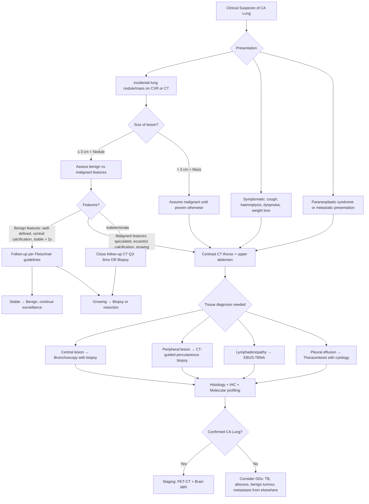

## Differential Diagnosis of CA Lung

---

### Approach to Differential Diagnosis

When you encounter a patient with suspected lung cancer — whether they present with a lung mass on imaging, persistent cough, haemoptysis, or an incidental pulmonary nodule — you must systematically consider what else could mimic lung cancer. The differential diagnosis depends on **how the patient presents**:

1. **A lung mass or nodule on imaging** (the most common scenario)
2. **Respiratory symptoms** (cough, haemoptysis, dyspnoea)
3. **Systemic symptoms** (weight loss, constitutional symptoms)
4. **A specific clinical syndrome** (e.g., SVCO, Pancoast, paraneoplastic)

Let's work through each systematically.

---

### 1. Differential Diagnosis of a Pulmonary Nodule or Mass

First, definitions matter:
- ***Nodule: ≤ 3 cm*** [2][7]
- **Mass: > 3 cm** — a mass is malignant until proven otherwise

> **Key principle**: ***Lung nodules are common, most are benign*** [2][7]. However, a mass > 3 cm has a high probability of malignancy and demands aggressive workup.

#### A. Solitary Pulmonary Nodule/Mass

| Category | Differential | Key Distinguishing Features |
|---|---|---|
| **Primary lung malignancy** | Adenocarcinoma, SCC, SCLC, LCLC, carcinoid tumour | Spiculated margins, eccentric/no calcification, contrast enhancement, pleural retraction, growth on serial imaging |
| **Metastatic cancer** | Breast, colorectal, renal cell, melanoma, sarcoma | Usually multiple; round, well-circumscribed "cannonball" lesions; known primary elsewhere |
| **Benign tumours** | ***Hamartoma***, adenoma, fibroma | Hamartoma: well-circumscribed, ***fat-containing, "popcorn" calcification*** [1][7] — pathognomonic |
| **Infection — Granuloma** | ***TB***, fungal (histoplasmosis, aspergilloma), NTM | ***Central, uniform calcification*** [1][7]; may have cavitation; clinical context (TB endemic in HK) |
| **Infection — Abscess** | Bacterial lung abscess, septic emboli | Thick-walled cavity with air-fluid level; fever, productive cough, risk factors (aspiration, poor dentition, IVDU) |
| **Vascular** | ***AVM (arteriovenous malformation)***, pulmonary infarct | AVM: feeding vessel sign on CT; may have HHT (Hereditary Haemorrhagic Telangiectasia). Infarct: Hampton's hump, wedge-shaped, pleurally based |
| **Congenital** | ***Pulmonary sequestration***, bronchogenic cyst | Sequestration: ***abnormal lung tissue connected to blood supply but not bronchial tree*** [1]; systemic arterial supply visible on CT angiography |
| **Other** | ***Nipple shadow, pleural mass, bone lesion, skin lesion, electrodes*** [2] (extrapulmonary density mimicking lung nodule) | Compare with lateral CXR, use nipple markers, correlate with physical exam |

#### Distinguishing Benign vs Malignant Nodules [2][7]

| Feature | ***Malignant (30%)*** [2] | ***Benign (70%)*** [2] |
|---|---|---|
| **Size** | ***> 2 cm*** | ***< 2 cm*** |
| **Location** | ***Upper lobe more likely*** | Any |
| **Margin** | ***Spiculated*** ("sunburst" / "corona radiata") | ***Well-defined*** |
| **Calcification** | ***Eccentric*** (or absent) | ***Central, "popcorn" (hamartoma)*** |
| **Contrast enhancement** | ***HU > 15*** | ***HU < 15*** |
| **Growth** | Doubling time 20–400 days | Stable > 2 years suggests benign |
| **Other predictors** | Older age, smoking history, +ve family history | Young, non-smoker |

<Callout title="The 2-Year Stability Rule">
A nodule that has been **stable in size for > 2 years** on serial imaging is highly likely to be benign. However, this rule has exceptions — ground-glass nodules (GGNs) representing adenocarcinoma in situ or minimally invasive adenocarcinoma can grow very slowly and may appear stable for years. This is why part-solid and ground-glass nodules require longer follow-up than solid nodules.
</Callout>

#### B. Multiple Pulmonary Nodules [2]

When you see multiple nodules, think:

| Category | Differentials |
|---|---|
| **Metastatic cancer** | Most common cause of multiple pulmonary nodules in an adult — "cannonball" metastases from renal, thyroid, colorectal, breast, melanoma, sarcoma |
| **Infection** | ***Abscess*** (septic emboli from right-sided endocarditis), TB (miliary), fungal |
| **Granulomatous disease** | ***TB, fungal (histoplasma, coccidioides), GPA (granulomatosis with polyangiitis)*** [2] |
| **Rheumatological** | Rheumatoid nodules (Caplan syndrome if with pneumoconiosis), sarcoidosis |
| **Vascular** | Multiple pulmonary AVMs (HHT/Osler-Weber-Rendu) |

The **distribution pattern** on HRCT helps narrow the differential [2]:
- **Centrilobular**: hypersensitivity pneumonitis, respiratory bronchiolitis, endobronchial TB
- **Perilymphatic**: sarcoidosis, lymphangitis carcinomatosis, silicosis
- **Random**: miliary TB, haematogenous metastases, miliary fungal

#### C. Cavitating Lung Lesions [1][7]

A cavity is an air-filled space within a mass or area of consolidation. The mnemonic **"CAVITY"** helps [1]:

| Letter | Cause | Notes |
|---|---|---|
| **C** | ***Cancer — most frequently SCC*** [1] | Squamous cell carcinoma cavitates because of central tumour necrosis (outgrows its blood supply). Thick, irregular walls (> 15 mm). |
| **A** | ***Autoimmune granulomas — GPA (Wegener's), RA nodules*** [1] | GPA: c-ANCA positive, triad of upper airway, lung, kidney involvement |
| **V** | ***Vascular — emboli (pulmonary infarction)*** [1] | Wedge-shaped, pleurally based |
| **I** | ***Infection — abscess, TB*** [1] | Abscess: thick-walled, air-fluid level, fever. TB: upper lobe, may have tree-in-bud |
| **T** | ***Trauma — pneumatoceles*** [1] | Thin-walled, post-traumatic |
| **Y** | ***Youth — airway malformation, cyst, pulmonary sequestration*** [1] | Congenital causes in younger patients |

> **Wall thickness rule**: ***↑ wall thickness → ↑ chance of tumour*** [1]. Walls > 15 mm are malignant in ~95% of cases. Walls < 4 mm are benign in ~90%.

---

### 2. Differential Diagnosis by Presenting Symptom

#### A. Persistent Cough [2]

**Acute cough (< 3 weeks):**
- ***Infection: URTI, pneumonia, AECOPD*** [2]
- ***Foreign body inhalation*** [2]

**Chronic cough (> 8 weeks):**
| Category | Differentials |
|---|---|
| ***Respiratory (dry)*** | ***Postnasal drip, post-viral cough, asthma, lung fibrosis*** [2] |
| ***Respiratory (productive)*** | ***COPD, TB, bronchiectasis, malignancy*** [2] |
| ***GI*** | ***GERD, recurrent aspiration*** [2] |
| ***Cardiac*** | ***Heart failure*** [2] (pulmonary congestion irritates J-receptors) |
| ***Drug-induced*** | ***ACE inhibitor*** [2] (accumulation of bradykinin → airway irritation), ***beta-blocker (bronchospasm)*** [2] |

**Why does lung cancer cause cough?** The tumour directly irritates bronchial mucosal cough receptors, or causes post-obstructive mucus retention and inflammation. A **change in character of chronic cough** in a smoker (e.g., from productive to dry, or new haemoptysis) is a red flag for malignancy.

#### B. Haemoptysis [2]

| Category | Differentials |
|---|---|
| ***Airway disease*** | ***CA lung, NPC (nasopharyngeal carcinoma), bronchiectasis*** [2] |
| ***Parenchymal disease*** | ***TB, pneumonia, lung abscess*** [2] |
| ***Vascular disease*** | ***PE, LV failure (CHF, mitral stenosis), vasculitis (Goodpasture's, GPA, MPA, HHT)*** [2] |
| ***Others*** | ***Bleeding tendency, anticoagulants, pulmonary endometriosis*** [2] |

**Why TB and bronchiectasis cause haemoptysis:** Chronic inflammation → bronchial artery hypertrophy and neovascularisation → these abnormal vessels are fragile and rupture easily. In TB, cavitary disease erodes into a Rasmussen aneurysm (dilated pulmonary artery branch in the cavity wall) → massive haemoptysis.

<Callout title="Haemoptysis in HK" type="idea">
In the Hong Kong context, the top differentials for haemoptysis are: (1) **CA lung** (most important to exclude), (2) **TB** (still endemic), (3) **Bronchiectasis** (common sequela of childhood infections), (4) **Pneumonia**. Always investigate haemoptysis — it is never "just a nosebleed" until proven so.
</Callout>

#### C. Dyspnoea [2]

| Category | Differentials |
|---|---|
| ***Respiratory — Acute*** | ***Pneumothorax, PE, acute pulmonary oedema, asthma exacerbation, AECOPD*** [2] |
| ***Respiratory — Subacute*** | ***Pneumonia, TB, pleural effusion*** [2] |
| ***Respiratory — Chronic*** | ***COPD, malignancy, ILD*** [2] |
| ***Cardiac*** | ***CHF, ACS, arrhythmia*** [2] |
| ***Metabolic*** | ***Anaemia, metabolic acidosis, hyperthyroidism*** [2] |
| ***Neuromuscular*** | ***MG, GBS, stroke*** [2] |
| ***Psychological*** | Anxiety, panic disorder |

---

### 3. Differential Diagnosis by Clinical Syndrome

#### A. SVCO (Superior Vena Cava Obstruction)

| Cause | Frequency | Details |
|---|---|---|
| **Lung cancer** | ~70% | Especially SCLC and right-sided tumours (SVC runs in right mediastinum) |
| **Lymphoma** | ~10% | Mediastinal lymphoma (especially NHL, Hodgkin) |
| **Other malignancies** | ~5% | Thymoma, germ cell tumour, metastatic disease |
| **Thrombosis** | ~10% | Central venous catheter-related, pacemaker leads |
| **Fibrosing mediastinitis** | Rare | Post-TB, post-histoplasmosis, post-radiation |

#### B. Pancoast Syndrome

Not all superior sulcus tumours are primary lung cancer — consider:
- **Metastasis** to the lung apex
- **Mesothelioma** (especially with asbestos exposure)
- **Infection** (TB at the apex — though Pancoast "syndrome" specifically refers to tumour invasion)
- **Thoracic outlet syndrome** (non-malignant — cervical rib, fibrous band compressing brachial plexus/subclavian vessels)

#### C. Pleural Effusion

Malignant pleural effusion from lung cancer must be differentiated from:
- **Parapneumonic effusion / empyema** (infection)
- **TB pleural effusion** (lymphocyte-predominant exudate, high ADA)
- **Heart failure** (bilateral transudates)
- **Mesothelioma** (asbestos exposure)
- **Metastatic disease from non-pulmonary primary** (breast, ovarian)
- **PE** (usually unilateral, small)

#### D. Mediastinal Mass

A mediastinal mass seen on CXR/CT may mimic or coexist with lung cancer. The classic differential depends on compartment:
- **Anterior**: Thymoma, Teratoma/germ cell tumour, Terrible lymphoma, Thyroid (retrosternal) — the "4 T's"
- **Middle**: Lymphadenopathy (lymphoma, sarcoidosis, metastatic), bronchogenic cyst
- **Posterior**: Neurogenic tumour (schwannoma, neuroblastoma), paravertebral abscess

---

### 4. Differential Diagnosis of Brain Lesion in a Patient with Known Cancer [8]

This is a subtle but important point from the notes:

> ***10–15% of solitary cerebral mass lesions in a patient with pre-existing cancer is NOT metastasis*** [8]

The differential for a brain mass in a cancer patient includes:
- **Brain metastasis** (most common — ***commonest intracranial tumour in adults*** [8])
- **Primary brain tumour** (glioblastoma, meningioma)
- **Brain abscess** (especially in immunocompromised patients on chemotherapy)
- **Radiation necrosis** (if prior cranial radiotherapy)

***Suggestive features of brain metastasis***: ***multiple lesions, grey-white junction location, circumscribed margin, large volume of vasogenic oedema compared to size of lesion*** [8].

Why the grey-white junction? Because ***blood vessel diameter decreases at this point and therefore acts as a trap for tumour cell clumps*** [8] — the tumour emboli lodge where the arterioles narrow.

---

### 5. Diagnostic Approach Algorithm

The following mermaid diagram illustrates the clinical reasoning pathway when encountering a suspected lung lesion:

---

### 6. Key Points for Exam — Narrowing the Differential

<Callout title="Approach to DDx of Lung Mass — Think VITAMIN C">

A helpful mnemonic for differential diagnosis of a lung mass:

- **V** — Vascular (AVM, pulmonary infarct)
- **I** — Infection (TB, abscess, fungal, pneumonia)
- **T** — Tumour (primary lung CA, metastatic, carcinoid, lymphoma, hamartoma)
- **A** — Autoimmune (GPA, RA nodules, sarcoidosis)
- **M** — Metabolic (amyloidosis — rare)
- **I** — Iatrogenic (radiation pneumonitis mimicking mass)
- **N** — Neoplastic (same as Tumour — reinforce)
- **C** — Congenital (sequestration, bronchogenic cyst, CPAM)

</Callout>

<Callout title="Exam Pitfall — Not Everything is Cancer" type="error">
In an exam scenario with a lung mass and fever, always consider **TB and lung abscess** — especially in the HK context where TB is still endemic. The classic mistake is to jump straight to "CA lung" without considering infection. Conversely, a non-resolving pneumonia on antibiotics should raise suspicion for an underlying obstructing malignancy — always repeat the CXR at 6 weeks to confirm resolution.
</Callout>

---

<Callout title="High Yield Summary">

**Solitary Pulmonary Nodule (≤ 3 cm)**: Most are benign (70%). Assess size, margins (spiculated = malignant), calcification pattern (central/popcorn = benign; eccentric = malignant), enhancement (HU > 15 = suspicious), and stability over time.

**Mass (> 3 cm)**: Malignant until proven otherwise → contrast CT → tissue diagnosis.

**Top DDx for lung mass**: Primary CA lung, metastatic cancer, TB granuloma, lung abscess, hamartoma, pulmonary infarct, GPA.

**Cavitating lesion**: SCC is the most common malignant cause. Use wall thickness — thicker wall = more likely malignant.

**Haemoptysis DDx (HK)**: CA lung > TB > bronchiectasis > pneumonia > PE > vasculitis.

**Brain lesion in known cancer patient**: 85–90% are metastases, but 10–15% are NOT — consider primary brain tumour or abscess.

**Key distinguishing features of malignant nodule**: Spiculated margins, eccentric calcification, upper lobe, > 2 cm, HU > 15, growing on serial imaging, smoker/older age.

</Callout>

---

<ActiveRecallQuiz
  title="Active Recall - Differential Diagnosis of CA Lung"
  items={[
    {
      question: "A 60-year-old smoker has a 3.5 cm spiculated mass in the right upper lobe on CT. What is the most likely diagnosis, and name 3 differential diagnoses you must exclude.",
      markscheme: "Most likely: primary lung cancer (adenocarcinoma or SCC given smoking history and upper lobe location). Differentials to exclude: (1) TB granuloma/tuberculoma, (2) lung abscess, (3) metastasis from another primary. The spiculated margin and size > 3 cm strongly favour malignancy.",
    },
    {
      question: "What are the CXR/CT features that distinguish a benign from a malignant pulmonary nodule? Name at least 4 features.",
      markscheme: "(1) Size: benign < 2 cm, malignant > 2 cm. (2) Margins: benign well-defined, malignant spiculated. (3) Calcification: benign central or popcorn, malignant eccentric or absent. (4) Contrast enhancement: benign HU < 15, malignant HU > 15. (5) Location: upper lobe more likely malignant. (6) Growth: stable > 2 years suggests benign.",
    },
    {
      question: "A patient with known lung cancer has a solitary brain lesion. What percentage of solitary brain lesions in cancer patients are NOT metastases, and what are the differential diagnoses?",
      markscheme: "10-15% of solitary cerebral mass lesions in patients with pre-existing cancer are NOT metastasis. Differentials include: primary brain tumour (glioblastoma, meningioma), brain abscess (especially if immunocompromised), and radiation necrosis (if prior radiotherapy).",
    },
    {
      question: "A cavitating lung lesion is found on CXR. Which lung cancer subtype most commonly cavitates, and what is the mechanism? Name 3 non-malignant causes of cavitation.",
      markscheme: "Squamous cell carcinoma cavitates most commonly - mechanism is central tumour necrosis as the tumour outgrows its blood supply. Non-malignant causes: (1) Lung abscess (bacterial), (2) TB, (3) GPA/Wegener granulomatosis. Wall thickness > 15 mm strongly suggests malignancy.",
    },
    {
      question: "List the top 4 differential diagnoses for haemoptysis in a Hong Kong patient and briefly explain the mechanism for each.",
      markscheme: "(1) CA lung - tumour erodes bronchial mucosal vessels. (2) TB - cavitary disease erodes Rasmussen aneurysm or hypertrophied bronchial arteries. (3) Bronchiectasis - chronic inflammation causes bronchial artery hypertrophy and fragile neovascularisation. (4) Pneumonia - mucosal inflammation and capillary leak. Also consider PE (pulmonary infarction).",
    },
  ]}
/>

## References

[1] Senior notes: Ryan Ho Respiratory.pdf (Sections on Solitary Pulmonary Nodule and Cavitating Lesions, p43–46)
[2] Senior notes: Maksim Medicine Notes.pdf (Section 12.1: Clinical Approach — Dyspnoea, Cough, Haemoptysis, p278–281)
[7] Senior notes: Ryan Ho Fundamentals.pdf (Section on Pulmonary Nodules, p236)
[8] Senior notes: Ryan Ho Neurology.pdf (Section on Brain Metastasis, p164)
