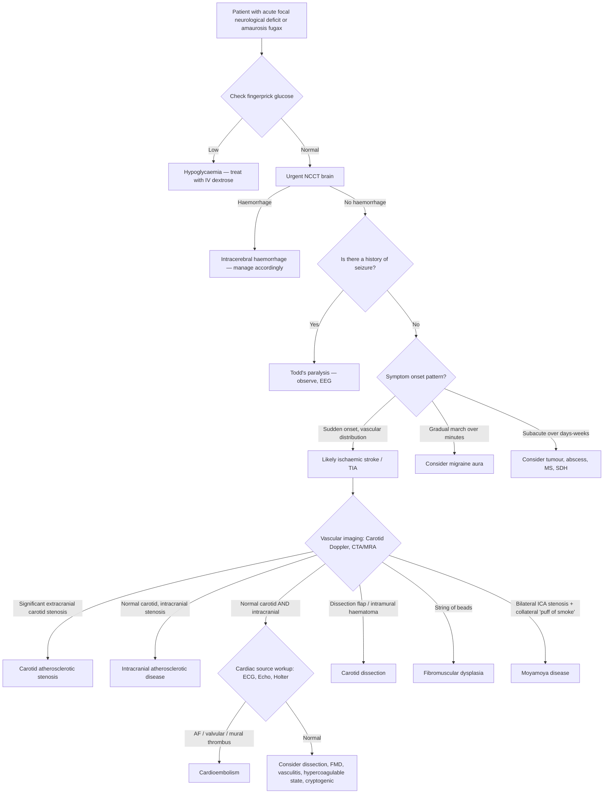

## Differential Diagnosis of Carotid Artery Stenosis

When a patient presents with symptoms in the carotid territory — transient or permanent focal neurological deficits, amaurosis fugax, or a carotid bruit is found — the question is: **is this actually carotid atherosclerotic stenosis, or is something else mimicking it?**

The differential diagnosis operates at two levels:
1. **Other causes of carotid artery narrowing** (i.e., the stenosis is real but the aetiology is not atherosclerosis).
2. **Other conditions that mimic carotid territory symptoms** (i.e., the patient has focal neurological deficits or visual loss, but the cause is not carotid stenosis at all).

Let's work through both systematically.

---

### 1. Other Causes of Carotid Artery Narrowing (Non-Atherosclerotic Carotid Disease)

These conditions produce genuine ICA stenosis or occlusion but through a completely different pathological process than atherosclerosis. Recognising them is critical because they occur in **different demographics** (often younger patients without cardiovascular risk factors) and require **different management**.

| Condition | Mechanism | Key Distinguishing Features |
|---|---|---|
| ***Carotid artery dissection*** | Tear in the intima → intramural haematoma → luminal narrowing or occlusion. ***Ischaemia from arterial occlusion or embolism*** [4]. | ***Spontaneous — connective tissue disorder. Traumatic — fall, sports, chiropractic.*** ***ICA — retroorbital pain, Horner's syndrome*** (disruption of the sympathetic plexus running along the ICA) [4]. Young or middle-aged patient. History of trauma (even minor — chiropractic manipulation, sports). ***Anticoagulation if no bleeding*** [4]. May form a ***dissecting aneurysm that can rupture and cause SAH intracranially*** [4]. |
| ***Fibromuscular dysplasia (FMD)*** | Non-inflammatory, non-atherosclerotic disorder → alternating stenosis and dilation of the arterial wall due to abnormal fibrous and muscular tissue in the vessel wall [1]. | "String of beads" appearance on angiography. Young to middle-aged **women**. No cardiovascular risk factors. Can also cause dissection or aneurysm. Often bilateral. |
| **Vasculitis** — ***Takayasu arteritis*** | Large-vessel granulomatous vasculitis → intimal fibrosis and stenosis of the aorta and its major branches (including CCA and subclavian arteries) [1]. | Young Asian women ( < 40 years). Constitutional symptoms (fever, malaise, weight loss). Absent pulses ("pulseless disease"). Raised inflammatory markers (ESR, CRP). |
| **Vasculitis** — ***Giant cell (temporal) arteritis*** | Large-vessel vasculitis → granulomatous inflammation of medium/large arteries. Can affect extracranial carotid branches and vertebral arteries [1]. | Age > 50. Headache, jaw claudication, scalp tenderness, visual loss (anterior ischaemic optic neuropathy). Associated with polymyalgia rheumatica. ESR markedly raised. Temporal artery biopsy diagnostic. |
| **Radiation-induced stenosis** | Accelerated atherosclerosis and fibrosis in irradiated arterial segments. Direct endothelial damage + chronic inflammation → premature plaque formation. | History of head/neck radiation (e.g., nasopharyngeal carcinoma — very relevant in Hong Kong). Onset years to decades after treatment. The "woody fibrosis" of surrounding tissues makes CEA difficult → CAS often preferred [1]. |
| ***Moyamoya disease*** | ***Congenital ICA stenosis*** with ***compensatory proliferation of vascular collaterals ("puff of smoke")*** [4]. Progressive stenosis/occlusion of terminal ICA and proximal Circle of Willis vessels. | ***Young — ischaemic symptoms. Older — bleeding (fragile collaterals).*** [4] More common in East Asian populations (including Hong Kong). Bilateral ICA involvement. Characteristic angiographic appearance. ***Revascularisation surgery might help*** [4]. |
| **Carotid body tumour (paraganglioma)** | Tumour of the chemoreceptor tissue at the carotid bifurcation → external compression and encasement of the carotid artery rather than intrinsic stenosis. | Pulsatile neck mass at the angle of the jaw. Transmitted pulsation. Moves side-to-side but not up-and-down (Fontaine sign). Usually does not cause TIA/stroke unless very large. |

<Callout title="Hong Kong Relevance" type="idea">
In Hong Kong, two non-atherosclerotic causes deserve special attention:
- **Radiation-induced carotid stenosis** — nasopharyngeal carcinoma (NPC) is endemic in southern China / Hong Kong, and head/neck radiotherapy is the mainstay of treatment. These patients develop accelerated carotid atherosclerosis 5–20 years post-radiation.
- ***Moyamoya disease*** — more prevalent in East Asian (including Chinese) populations. Always consider in a young patient with ischaemic or haemorrhagic stroke without typical cardiovascular risk factors.
</Callout>

---

### 2. Conditions That Mimic Carotid Territory Symptoms (Stroke Mimics)

A patient presenting with acute focal neurological deficit may not have carotid stenosis or even a stroke at all. The differential for **acute focal neurological symptoms** is broad. The mnemonic below helps structure the approach:

#### Organised by Category [1]

| Category | Condition | Why It Mimics Carotid Stenosis | How to Distinguish |
|---|---|---|---|
| **Vascular** | ***Cardioembolism*** (AF, valvular disease, MI with mural thrombus) | Emboli from the heart lodge in the same intracranial vessels (MCA, ACA) as emboli from the carotid, producing identical neurological deficits [4][1]. | ECG showing AF/flutter, echocardiogram showing valvular disease or mural thrombus, recent MI. Carotid imaging shows no significant stenosis. This is the **most important differential** — the treatment is anticoagulation, not carotid revascularisation. |
| **Vascular** | ***Intracranial atherosclerotic disease (ICAD)*** | Stenosis of the intracranial ICA, MCA, or other intracranial vessels produces identical territory symptoms. Particularly important in **Asian populations** where ICAD is more prevalent than extracranial carotid disease. | CTA/MRA showing intracranial stenosis with normal or mild extracranial disease. Managed medically (dual antiplatelet therapy ± intracranial stenting in selected cases). |
| **Vascular** | **Intracerebral haemorrhage (ICH)** | Sudden hemiparesis, aphasia, or other focal deficits can be identical to ischaemic stroke in the hyperacute phase. | ***Urgent non-contrast CT brain*** [2] — haemorrhage appears as a hyperdense (bright white) lesion. Management is completely different (BP control, reversal of anticoagulation, possible surgery). |
| **Vascular** | **Subdural haematoma** | Gradual onset hemiparesis, confusion, headache. Can mimic a slowly progressive or fluctuating stroke [1]. | History of trauma (may be trivial, especially in elderly on anticoagulants). CT shows crescent-shaped extra-axial collection. |
| **Vascular** | ***Aortic dissection*** | Type A dissection can propagate into the CCA/ICA → acute carotid occlusion → stroke. Presents with ***focal neurological deficits*** from propagation of dissection involving brachiocephalic arteries [6]. | ***Acute tearing chest/back pain***, pulse deficits, BP differential between arms. CT aortogram diagnostic. This is a surgical emergency — stroke treatment alone misses the underlying catastrophe. |
| **Infection** | **Brain abscess** | Space-occupying lesion causing focal deficits, headache, and possibly seizures [1]. | Subacute course (days to weeks). Fever, raised inflammatory markers. CT/MRI shows ring-enhancing lesion with surrounding oedema. |
| **Infection** | **Encephalitis** (viral, autoimmune) | Can cause focal deficits, altered consciousness, seizures [1]. | Fever, altered behaviour preceding focal signs. CSF analysis (lymphocytic pleocytosis). MRI shows temporal lobe involvement (in HSV encephalitis). |
| **Neoplastic** | **Brain tumour** (primary or metastatic) | Slowly progressive focal deficit. Occasionally sudden onset if tumour haemorrhages or causes a seizure [1]. | Subacute/chronic course. Headache worse in morning, progressive. CT/MRI shows mass lesion with enhancement ± surrounding oedema. |
| **Degenerative** | **Multiple sclerosis** | Acute demyelinating episode can cause sudden-onset focal neurological deficit resembling stroke [1]. | Young patient. History of prior episodes with different neurological territories (dissemination in time and space). MRI shows periventricular white matter lesions. CSF shows oligoclonal bands. |
| **Metabolic** | ***Hypoglycaemia*** | Neuroglycopenia can cause focal neurological deficits (hemiparesis, aphasia) that perfectly mimic stroke [1]. | **Always check blood glucose** — this is the most important bedside test before anything else. Immediate resolution with glucose administration. History of diabetes, insulin, or oral hypoglycaemics [1]. |
| **Epileptic** | **Seizure with Todd's paralysis** | A seizure (which may be unwitnessed) can be followed by post-ictal focal weakness (Todd's paralysis) lasting minutes to hours, mimicking stroke [1]. | History of epilepsy, witnessed seizure activity, tongue bite, incontinence. Resolves spontaneously. EEG may show epileptiform activity. |
| **Other** | **Migraine with aura (hemiplegic migraine)** | Aura can produce transient hemiparesis, hemisensory loss, aphasia, or visual symptoms mimicking TIA [1]. | Gradual onset and "march" of symptoms over 20–60 minutes (unlike the sudden onset of vascular events). Followed by headache. History of similar episodes. Younger patient. |
| **Other** | **Syncope / Presyncope** | Loss of consciousness can be confused with stroke, but syncope is due to global cerebral hypoperfusion, not focal ischaemia. | No focal neurological deficit on recovery. Brief duration. Prodrome (lightheadedness, visual dimming, sweating). Vertigo and syncope are **NOT** generally caused by carotid stenosis [1]. |
| **Other** | **Functional neurological disorder (conversion disorder)** | Non-organic weakness, sensory loss, or visual symptoms. | Inconsistent examination findings (e.g., Hoover's sign, give-way weakness). Normal investigations. Diagnosis of exclusion but positive clinical signs of functional disorder. |

<Callout title="The Big Three Stroke Mimics to Exclude at the Bedside" type="error">
Before attributing focal deficits to carotid stenosis (or any stroke), **immediately exclude**:
1. **Hypoglycaemia** — check fingerprick glucose. Focal deficits from neuroglycopenia are completely reversible with glucose.
2. **Intracranial haemorrhage** — urgent NCCT brain. You cannot distinguish ischaemic from haemorrhagic stroke clinically; CT is mandatory.
3. **Seizure with Todd's paralysis** — ask about seizure history and witness accounts.

Getting any of these wrong leads to potentially fatal mismanagement (e.g., giving thrombolysis to a patient with ICH or hypoglycaemia).
</Callout>

---

### 3. Differential Diagnosis of a Carotid Bruit

A carotid bruit is often the finding that triggers investigation. But not all bruits indicate carotid stenosis, and not all carotid stenosis produces a bruit [1].

| Cause of Carotid Bruit | Explanation |
|---|---|
| **Carotid atherosclerotic stenosis** | The most important cause. Turbulent flow through the narrowed segment. Typically heard when stenosis ≥50–70%. Absent in complete occlusion [1]. |
| **Transmitted cardiac murmur** | Aortic stenosis produces a systolic ejection murmur that radiates to the carotids. Differentiate by listening at the aortic area and noting the murmur character (crescendo-decrescendo). |
| **External carotid artery stenosis** | Less clinically significant than ICA stenosis but can produce a bruit at the bifurcation. |
| **Carotid body tumour** | Tumour at the bifurcation creating turbulence. Palpable pulsatile mass. |
| **High-output states** | Anaemia, thyrotoxicosis, pregnancy — increased cardiac output causes flow murmurs in otherwise normal vessels. These are typically bilateral and symmetrical. |
| **Cervical venous hum** | Continuous murmur from the internal jugular vein. Abolished by light compression of the IJV or by turning the head. |

---

### 4. Differential Diagnosis of Amaurosis Fugax (Transient Monocular Visual Loss)

This is a specific symptom highly associated with carotid stenosis, but other causes must be considered:

| Cause | Mechanism | Distinguishing Feature |
|---|---|---|
| **Carotid atherosclerotic embolism** | Cholesterol/platelet embolus to retinal artery | Painless, "curtain descending." Hollenhorst plaque on fundoscopy. Ipsilateral carotid bruit. |
| **Giant cell arteritis** | Inflammation of ophthalmic/posterior ciliary arteries → ischaemic optic neuropathy | Age > 50, headache, jaw claudication, scalp tenderness, raised ESR/CRP. Can cause permanent visual loss — an ophthalmic emergency. |
| **Central retinal artery occlusion (CRAO)** | Complete occlusion (often embolic) → sudden painless monocular blindness (persistent, not transient) | Cherry-red spot at macula on fundoscopy. If transient, may be retinal TIA from carotid source. |
| **Central retinal vein occlusion (CRVO)** | Venous outflow obstruction → retinal haemorrhages | "Blood and thunder" fundoscopy (widespread flame-shaped haemorrhages). Gradual onset. Associated with glaucoma, hypertension. |
| **Optic neuritis** | Inflammatory demyelination of optic nerve (e.g., MS) | Painful eye movement (distinguishes from painless carotid embolism). RAPD. Young patient. Often recovers over weeks. |
| **Papilloedema** | Raised ICP → optic disc swelling → transient visual obscurations | Bilateral (unlike the unilateral amaurosis of carotid disease). Provoked by Valsalva or postural changes. |
| **Retinal migraine** | Vasospasm of retinal vasculature during migraine aura | Followed by headache. Recurrent, stereotyped episodes. Young patient. Diagnosis of exclusion. |

---

### 5. Differential Diagnosis Algorithm — Clinical Reasoning Framework

The following Mermaid diagram illustrates the systematic approach when a patient presents with **carotid territory neurological symptoms**:

---

### 6. Key Distinguishing Points — Aetiological Categories of Ischaemic Stroke

***Acute ischaemic stroke*** is caused by ***cardioembolism, critical arterial stenosis,*** or ***arterial dissection*** [4]. This three-category framework from the lecture slides is the essential starting point for differential diagnosis:

| Category | Examples | Key Investigation |
|---|---|---|
| ***Cardioembolism*** | AF, valvular disease, MI with mural thrombus, prosthetic valves, infective endocarditis, patent foramen ovale [1][4] | ECG, 24–72 hour Holter monitor, transthoracic ± transoesophageal echocardiography |
| ***Critical arterial stenosis*** | **Extracranial carotid atherosclerosis** (the topic at hand), intracranial atherosclerosis, aortic arch atheroma [1][4] | Carotid duplex USG, CTA, MRA, cerebral angiography |
| ***Arterial dissection*** | Carotid dissection, vertebral artery dissection [4] | CTA or MRA showing intramural haematoma, "flame-shaped" tapering, or double lumen. ***ICA — retroorbital pain, Horner's syndrome. VA — occipital pain and vertebrobasilar symptoms*** [4] |

<Callout title="Don't Forget the Heart">
Approximately **75% of ischaemic strokes are embolic** [1], and a large proportion of those emboli come from the heart, not the carotid. Even when significant carotid stenosis is found, always perform a cardiac workup — patients can have **dual pathology** (e.g., AF + carotid stenosis). The management is different: cardioembolism requires anticoagulation, while carotid stenosis is managed with antiplatelet therapy ± revascularisation.
</Callout>

---

### 7. Summary Table — Differential Diagnosis of Carotid Artery Stenosis

| Differential | Key Feature That Distinguishes from Atherosclerotic Carotid Stenosis |
|---|---|
| **Cardioembolism** | AF on ECG, valvular disease on echo, normal carotid imaging |
| **Intracranial atherosclerosis** | Intracranial stenosis on CTA/MRA; extracranial carotids normal/mild |
| **Carotid dissection** | Young patient, neck pain/trauma, Horner syndrome, intramural haematoma on imaging |
| **Fibromuscular dysplasia** | Young woman, "string of beads," no CV risk factors |
| **Takayasu arteritis** | Young Asian woman, absent pulses, raised ESR, aortic arch involvement |
| **Giant cell arteritis** | Age > 50, headache, jaw claudication, ESR > 50 |
| **Radiation-induced stenosis** | History of prior head/neck radiation |
| **Moyamoya disease** | Young, bilateral ICA stenosis, "puff of smoke" collaterals |
| **Intracerebral haemorrhage** | Hyperdense lesion on NCCT |
| **Subdural haematoma** | Crescent-shaped extra-axial collection on CT |
| **Brain tumour / abscess** | Mass lesion with enhancement on CT/MRI, subacute course |
| **Hypoglycaemia** | Low blood glucose, rapid reversal with dextrose |
| **Todd's paralysis** | Post-ictal, preceded by seizure, resolves spontaneously |
| **Migraine with aura** | Gradual "march" of symptoms, followed by headache |
| **Aortic dissection** | Tearing chest/back pain, pulse deficits, BP differential |

---

<Callout title="High Yield Summary — Differential Diagnosis">

**Three aetiological buckets for ischaemic stroke** (from lecture slides): ***cardioembolism, critical arterial stenosis, arterial dissection***. Carotid stenosis falls under "critical arterial stenosis" — but you must exclude the other two.

**Non-atherosclerotic causes of carotid narrowing**: dissection (trauma/connective tissue disorder, Horner syndrome, retroorbital pain), FMD (young women, string of beads), vasculitis (Takayasu, GCA), radiation-induced stenosis (NPC in HK), Moyamoya (young, East Asian, puff of smoke).

**Top stroke mimics to exclude urgently**: hypoglycaemia (check glucose first), ICH (NCCT brain), Todd's paralysis (seizure history).

**Cardioembolism is the most important differential**: AF, valvular disease, mural thrombus. Always do ECG + echo + Holter even if carotid stenosis is found.

**In Hong Kong**: have a low threshold for considering intracranial atherosclerosis (more common in Asians than Caucasians), radiation-induced carotid stenosis (post-NPC treatment), and Moyamoya disease.

</Callout>

---

<ActiveRecallQuiz
  title="Active Recall — Differential Diagnosis of Carotid Artery Stenosis"
  items={[
    {
      question: "A 32-year-old woman presents with sudden right hemiparesis after a chiropractic neck manipulation. Carotid Doppler shows left ICA narrowing. What is the most likely diagnosis, and what clinical features would you look for?",
      markscheme: "Left carotid artery dissection. Look for: ipsilateral retroorbital or neck pain, ipsilateral Horner syndrome (ptosis, miosis, anhidrosis from disruption of sympathetic fibres along ICA), history of trauma. CTA or MRA would show intramural haematoma or flame-shaped tapering. Treatment is anticoagulation if no bleeding.",
    },
    {
      question: "Name the three aetiological categories of acute ischaemic stroke from the lecture slides and the key investigation for each.",
      markscheme: "1. Cardioembolism (ECG, Holter, echocardiography). 2. Critical arterial stenosis (carotid duplex USG, CTA, MRA). 3. Arterial dissection (CTA or MRA showing intramural haematoma or double lumen). From GC 109 lecture.",
    },
    {
      question: "Why is hypoglycaemia a critical stroke mimic to exclude, and how do you distinguish it?",
      markscheme: "Neuroglycopenia can cause focal neurological deficits (hemiparesis, aphasia) that perfectly mimic ischaemic stroke. It is excluded by a simple bedside fingerprick glucose test. Deficits resolve rapidly with IV dextrose. Missing this diagnosis and giving thrombolysis would be harmful.",
    },
    {
      question: "A 28-year-old Chinese patient presents with recurrent TIAs. CTA shows bilateral ICA stenosis with extensive basal collateral networks described as a 'puff of smoke.' What is the diagnosis, and what is the typical clinical course by age?",
      markscheme: "Moyamoya disease. Young patients present with ischaemic symptoms (TIA, stroke). Older patients present with haemorrhagic stroke due to rupture of fragile collateral vessels. More common in East Asian populations. Revascularisation surgery (e.g., STA-MCA bypass) might help.",
    },
    {
      question: "A patient is found to have a carotid bruit but no neurological symptoms. List four non-carotid-stenosis causes of a carotid bruit.",
      markscheme: "1. Transmitted aortic stenosis murmur. 2. External carotid artery stenosis. 3. Carotid body tumour (paraganglioma). 4. High-output states (anaemia, thyrotoxicosis, pregnancy). 5. Cervical venous hum. (Any four acceptable.)",
    },
  ]}
/>

---

## References

[1] Senior notes: felixlai.md (Carotid artery stenosis section, pages 892–899; Stroke section, pages 1137–1163)
[2] Senior notes: maxim.md (Carotid artery disease section, page 169)
[4] Lecture slides: GC 109. Headache and loss of consciousness Acute stroke, subarachnoid haemorrhage and vascular malformation.pdf (pages 9, 17–18, 47–50)
[5] Lecture slides: WCS 002 - Toe gangrene and leg ulcer - by Prof SWK Cheng.pdf (page 2)
[6] Senior notes: felixlai.md (Aortic dissection section, page 903–904)
