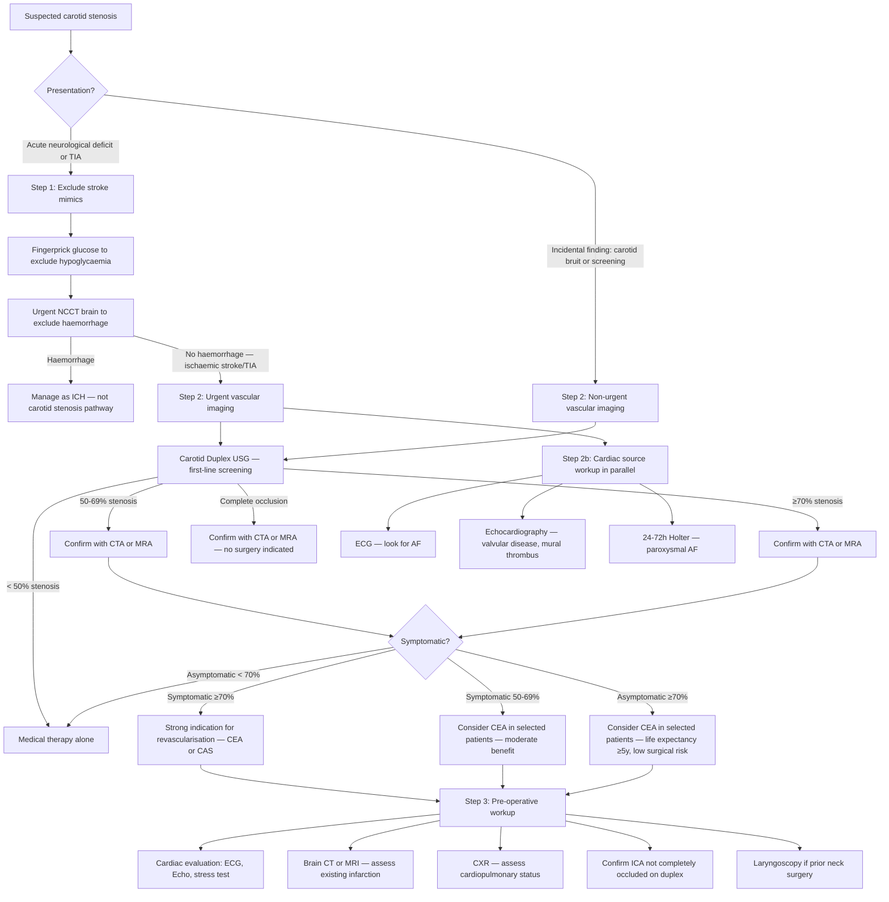

## Diagnostic Criteria, Diagnostic Algorithm, and Investigations for Carotid Artery Stenosis

### 1. Diagnostic Criteria — Defining the Disease

Carotid artery stenosis does not have a single "diagnostic criteria" set like, say, rheumatic fever (Jones criteria) or SLE (ACR/EULAR criteria). Instead, the diagnosis is established through a combination of **clinical classification** (symptomatic vs. asymptomatic) and **imaging-based quantification** of the degree of stenosis. The diagnosis fundamentally answers three questions:

1. **Is there a stenosis?** (confirmed by imaging)
2. **How severe is it?** (graded by NASCET criteria)
3. **Is it symptomatic?** (determined by clinical history)

These three answers together determine management.

---

#### 1.1 Clinical Criteria — Symptomatic vs Asymptomatic

This distinction is the single most important classification, because it determines the urgency and aggressiveness of treatment [1].

| | Symptomatic | Asymptomatic |
|---|---|---|
| **Definition** | Focal neurological symptoms in the **ipsilateral carotid artery territory** (referable to the appropriate carotid distribution) within the **previous 6 months**. Includes ≥1 TIA (focal neurological dysfunction or **amaurosis fugax**) **OR** ≥1 minor non-disabling ischaemic stroke [1] | Atherosclerotic narrowing of the extracranial ICA in an individual **without** a history of recent ipsilateral carotid territory ischaemic stroke or TIA [1] |
| **Key exclusions** | **Vertigo and syncope are NOT generally caused by carotid stenosis** and should NOT be considered indicative of symptomatic disease [1] | — |
| **Annual stroke risk** | 10–15% at 2 years (for ≥70% stenosis without intervention) — much higher in the first days/weeks after the index event | **0.5–1.0% per year** with best medical therapy [1] |

<Callout title="Why 6 Months?" type="idea">
The 6-month window is used because beyond this period, the plaque that caused the initial event has likely stabilised (re-endothelialised, fibrous cap healed). The risk of recurrent embolism from that specific plaque drops substantially after 6 months, approaching the risk profile of an asymptomatic stenosis. This is also why revascularisation should ideally be performed **within 2 weeks** of a symptomatic event — the benefit diminishes with time.
</Callout>

---

#### 1.2 Imaging Criteria — NASCET Grading of Stenosis Severity

The **North American Symptomatic Carotid Endarterectomy Trial (NASCET)** method is the internationally accepted standard for grading carotid stenosis severity. It compares the minimum residual lumen diameter at the point of maximum stenosis to the diameter of the normal distal ICA (where the walls are parallel, beyond the bulb):

$$\text\{NASCET \% Stenosis\} = \left(1 - \frac\{d_{\text\{min\}\}\}\{d_{\text\{distal ICA\}\}\}\right) \times 100\%$$

| NASCET Grade | Stenosis | Clinical Significance |
|---|---|---|
| **Mild** | < 50% | Low stroke risk. Medical therapy alone. |
| **Moderate** | 50–69% | Marginal benefit of CEA in **symptomatic** patients (depends on additional risk features: male sex, recent symptoms, hemispheric vs. retinal event, ulcerated plaque) [1][7] |
| **Severe** | 70–99% | **Greatest benefit** from revascularisation, especially if symptomatic [1] |
| **Near-occlusion** | >99% (string sign) | Paradoxically, benefit of surgery is less clear — very low residual flow means the territory is already supplied by collaterals |
| **Complete occlusion** | 100% | ***Absolute contraindication*** to CEA — no surgical treatment has been proven to prevent subsequent stroke in patients with complete carotid artery occlusion [1] |

**Why does NASCET use the distal ICA as the reference?** Because the carotid bulb is naturally dilated — using it as the denominator (as the ECST method does) would overestimate the degree of stenosis. The distal ICA, where the walls are parallel and the vessel has a consistent calibre, provides a more reliable and reproducible reference diameter.

---

#### 1.3 Haemodynamic Criteria — Duplex Ultrasound Velocity Parameters

Carotid duplex USG does not directly visualise the lumen diameter like angiography; instead, it measures **blood flow velocities**. The principle is simple: as a vessel narrows, blood must travel faster through the stenotic segment to maintain the same volume flow (think of putting your thumb over a garden hose — the water shoots out faster). This is the **Bernoulli principle / continuity equation**.

The key velocity parameters and their correlation with NASCET stenosis grades [1][7]:

| Parameter | Normal | 50–69% Stenosis | ≥70% Stenosis | Near-occlusion | Complete Occlusion |
|---|---|---|---|---|---|
| **Peak systolic velocity (PSV)** of ICA | < 125 cm/s | 125–230 cm/s | > 230 cm/s | Variable (may be low or high) | No flow detected |
| **End-diastolic velocity (EDV)** of ICA | < 40 cm/s | 40–100 cm/s | > 100 cm/s | Variable | No flow |
| ***ICA/CCA PSV ratio (carotid index)*** | < 2.0 | 2.0–4.0 | > 4.0 | Variable | N/A |
| **B-mode plaque** | No significant plaque | Visible plaque | Significant plaque, reduced lumen | Barely visible lumen ("string sign") | No lumen visible |

> **High Yield**: The **peak systolic velocity (PSV)** is the single most important parameter. **PSV > 230 cm/s** indicates **≥70% stenosis** — this is the threshold that typically triggers consideration for revascularisation [1].

<Callout title="Exam Pearl — Carotid Index" type="idea">
The ***carotid index*** (ICA PSV / CCA PSV ratio) is particularly useful because it **normalises** for patient-to-patient variation in cardiac output. A patient with high cardiac output (e.g., anaemia, sepsis) will have high velocities everywhere — the ratio corrects for this. A ratio > 4.0 strongly suggests ≥70% ICA stenosis [1].
</Callout>

---

### 2. Diagnostic Algorithm — Clinical Reasoning Approach

The following algorithm maps out how you approach a patient in whom carotid stenosis is suspected — whether they present acutely with neurological symptoms or are found incidentally to have a carotid bruit.

**Key principles in this algorithm:**

1. **Acute presentations go through the stroke pathway first** — exclude mimics (hypoglycaemia, ICH), then image the vessels. ***Urgent NCCT brain*** is the first brain imaging modality [2][4].
2. **Carotid duplex USG is always the first-line vascular investigation** — it is non-invasive, inexpensive, safe, and accurate for high-grade stenosis [1].
3. **Cross-sectional imaging (CTA or MRA) is used to confirm** the duplex findings before committing to intervention, especially in the moderate (50–69%) range where duplex accuracy drops [1].
4. **Always look for a cardiac source in parallel** — cardioembolism accounts for a large proportion of ischaemic strokes, and patients can have **dual pathology** (carotid stenosis + AF) [1][4].
5. **Pre-operative workup** before revascularisation must include cardiac evaluation — because MI is the leading cause of perioperative death [1].

---

### 3. Investigation Modalities — Detailed Breakdown

#### 3.1 Bedside / Physical Examination

These are the "zero-cost" investigations you perform before ordering any imaging.

| Examination | Findings in Carotid Stenosis | Pathophysiology / Interpretation |
|---|---|---|
| **Carotid auscultation** | Bruit heard over the origin of the ICA (angle of jaw / anterior to sternocleidomastoid) | Turbulent flow through stenotic segment. Typically heard when stenosis ≥50–70%. **Poor predictor** of degree of stenosis — complete occlusion produces **no bruit** [1] |
| **Fundoscopy** | Hollenhorst plaque (bright refractile crystal at retinal arteriolar bifurcation), retinal arterial occlusion, ischaemic retinal changes | Direct evidence of atheroembolism from an upstream carotid plaque [1] |
| **Pupillary examination** | Relative afferent pupillary defect (RAPD) ipsilateral to stenosis | Retinal ischaemia damages the afferent limb (optic nerve) of the pupillary reflex [1] |
| **Neurological examination** | Contralateral hemiparesis (face/arm > leg), hemisensory loss, aphasia (dominant), neglect (non-dominant), homonymous hemianopia | Cortical signs localise to carotid (anterior circulation) territory. Left hemisphere = aphasia; Right hemisphere = visuospatial neglect / constructional apraxia [1] |
| **Peripheral vascular examination** | Absent pedal pulses, femoral bruits, pulsatile abdominal mass | Atherosclerosis is a systemic disease — coexisting PAD and AAA are common [5] |
| **Blood pressure in both arms** | BP differential > 15 mmHg | Suggests subclavian or aortic arch disease — important for surgical planning and to exclude aortic dissection |

---

#### 3.2 First-Line Imaging: Carotid Duplex Ultrasonography

**Why is this first-line?** It combines **B-mode (brightness mode) ultrasound** for anatomical imaging of the vessel wall and plaque with **Doppler ultrasonography** for haemodynamic assessment of flow velocities. Together, these provide both structural and functional information non-invasively [1][7].

**Components:**
- **B-mode USG**: Visualises plaque morphology (echogenicity, ulceration, surface irregularity, calcification), vessel wall thickness, and lumen.
- **Colour-flow Doppler**: Maps blood flow direction and velocity in real time. Aliasing (colour change) occurs at the stenotic segment due to high velocity.
- **Spectral (pulsed-wave) Doppler**: Quantifies ***peak systolic velocity (PSV)***, ***end-diastolic velocity (EDV)***, and the ***carotid index (ICA PSV / CCA PSV ratio)*** — the key parameters for grading stenosis [1].

**Transcranial Doppler (TCD)** is commonly used in conjunction with carotid duplex to examine the major intracerebral arteries (MCA, ACA, PCA, basilar) through the temporal bone window and orbit [1][7]:
- Detects **intracranial stenosis** and **emboli** (microembolic signals)
- Identifies **collateral pathways** (e.g., reversed flow in the ophthalmic artery suggesting ICA occlusion with ECA-to-ICA collateral flow)
- **Monitors reperfusion** after thrombolysis [7]

| Feature | Details |
|---|---|
| **Advantages** | Non-invasive, inexpensive, safe, convenient, no radiation, no contrast. Accurate for detecting **high-grade stenosis** (sensitivity/specificity > 90% for ≥70% stenosis) [1] |
| **Disadvantages** | **Operator-dependent**. Less accurate for **low-grade stenosis**. Not reliable in cases with **severe vessel kinking, heavy calcification** (acoustic shadowing obscures the lumen), **short neck, or high carotid bifurcation** (above the angle of the mandible — transducer cannot reach) [1] |

<Callout title="Normal Arterial Waveform" type="idea">
A normal arterial Doppler waveform is **triphasic**: (1) rapid systolic forward flow, (2) brief early diastolic flow reversal, (3) late diastolic forward flow. In stenosis, the waveform becomes monophasic or biphasic with elevated velocities [7][8]. The ICA normally has a **low-resistance** pattern (continuous forward diastolic flow — because the brain is a low-resistance vascular bed that needs constant perfusion), while the ECA has a **high-resistance** pattern (minimal diastolic flow — because the facial/scalp muscles are high-resistance beds at rest).
</Callout>

---

#### 3.3 Second-Line Imaging: CT Angiography (CTA)

***CT angiogram: if endovascular therapy is considered*** [2]. CTA is typically performed as a confirmatory test when duplex suggests significant stenosis, or as part of the acute stroke workup.

**Principle**: IV iodinated contrast is injected, and CT images are acquired during the arterial phase. The contrast-filled lumen is reconstructed in 3D, providing an anatomical depiction of the vessel lumen and wall.

***CT angiography*** is a **non-invasive intracranial vascular study recommended for patients if either IA fibrinolysis or mechanical thrombectomy is considered** ***BUT should not delay IV fibrinolysis*** [7].

**Key findings on CTA:**
- **Degree of stenosis**: Direct measurement of residual lumen diameter at the point of maximal stenosis (NASCET method)
- **Plaque morphology**: Calcified vs. soft plaque, ulceration, intraluminal thrombus
- **Tandem lesions**: Simultaneous intracranial stenosis or occlusion (e.g., ***dense MCA sign*** — hyperdense MCA on non-contrast CT or filling defect on CTA indicating ***acute MCA occlusion*** — ***potential large infarction***) [4]
- **Aortic arch anatomy**: Important for surgical planning (type of arch, tortuosity, great vessel origins)
- **Adjacent structures**: Bony anatomy (high bifurcation?), soft tissues

| Feature | Details |
|---|---|
| **Advantages** | Provides anatomical depiction of the carotid artery lumen and allows imaging of **adjacent soft tissues and bony structures**. Fast, widely available. Can image from the aortic arch to the Circle of Willis in one acquisition [1] |
| **Disadvantages** | **Relatively contraindicated in patients with impaired renal function** due to iodinated contrast administration. Radiation exposure. Heavy calcification can cause "blooming artefact" that overestimates stenosis [1] |

---

#### 3.4 Second-Line Imaging: MR Angiography (MRA)

**Principle**: Two main techniques:
- **Time-of-flight (TOF) MRA** (2D or 3D): Exploits the "flow-related enhancement" phenomenon — moving blood entering an imaging slice gives a bright signal against the suppressed stationary background tissue. No contrast needed.
- **Gadolinium-enhanced MRA (CE-MRA)**: IV gadolinium contrast shortens T1, making blood appear bright. More accurate than TOF, less susceptible to flow artefacts.

**Key points** [1]:
- **Advantages**: Accurate in detecting **high-grade stenosis**. **Less operator-dependent** than duplex. No ionising radiation. Can simultaneously acquire brain MRI (DWI to detect acute infarction).
- **Disadvantages**: **High cost**, **time-consuming**, **less readily available**. **Not applicable** if the patient is severely ill, unable to lie supine, has claustrophobia, a pacemaker, or ferromagnetic implants [1]. TOF-MRA tends to **overestimate** stenosis severity (signal loss at the stenotic segment due to turbulent flow).

**DWI-MRI** (diffusion-weighted imaging) is particularly valuable — it can detect acute ischaemic infarction within minutes (restricted diffusion appears bright on DWI, dark on ADC map), and ***can be used as the sole initial imaging modality to evaluate acute stroke patients including candidates for fibrinolytic treatment*** [7].

---

#### 3.5 Gold Standard (Rarely Used): Cerebral Angiography (Digital Subtraction Angiography — DSA)

***Cerebral angiography is the GOLD standard for imaging the carotid arteries and intracranial atherosclerotic disease but is rarely performed nowadays*** [1].

**Principle**: A catheter (usually via the femoral artery) is advanced into the carotid artery, iodinated contrast is injected, and serial X-ray images are taken. **Digital subtraction** removes the background bony structures, leaving only the contrast-filled vessel lumen — hence "digital subtraction angiography" [7][8].

***Digital subtraction angiography (DSA) is indicated only in patients with planned intervention*** [7][8]. It is also the definitive test when non-invasive imaging is inconclusive or discordant.

**Indications for cerebral angiography** [1]:
- **Suspected non-atherosclerotic disease** such as dissection or vasculitis
- **Suspected disease in the proximal CCA** or the origins of the great vessels from the aortic arch
- **Poor quality or discordant results** of non-invasive imaging
- **Pre-procedural planning** for complex endovascular interventions

| Feature | Details |
|---|---|
| **Advantages** | Permits evaluation of the **entire carotid artery system**, providing information about **tandem atherosclerotic disease, plaque morphology, and collateral circulation**. Highest spatial resolution. Can be combined with intervention (angioplasty/stenting) in the same session [1] |
| **Disadvantages** | **High cost**. **Invasive** with risk of **neurological complication such as stroke** (~1% risk of permanent neurological deficit). Limited number of projections can lead to **underestimation of stenosis degree if the stenosis is asymmetrical** rather than concentric [1] |

---

#### 3.6 Comparison Table — Vascular Imaging Modalities

| Modality | Role | Sensitivity for ≥70% | Advantages | Disadvantages |
|---|---|---|---|---|
| **Carotid Duplex USG** | First-line screening | > 90% | Non-invasive, cheap, no radiation, portable, repeatable | Operator-dependent, poor for low-grade, limited by calcification/anatomy [1] |
| **CTA** | Confirmatory / acute stroke | > 95% | Fast, anatomical detail, arch to Circle of Willis, widely available | Contrast nephropathy, radiation, calcification blooming artefact [1] |
| **MRA** | Confirmatory / alternative to CTA | > 90% (CE-MRA) | No radiation, less operator-dependent, can add brain MRI | Costly, slow, overestimates stenosis (TOF), contraindicated with pacemakers [1] |
| **DSA** | Gold standard / pre-intervention | ~100% | Highest resolution, dynamic flow information, can combine with intervention | Invasive, stroke risk ~1%, expensive, limited availability [1] |

<Callout title="Two-Modality Concordance Rule">
Current guidelines recommend that **before revascularisation, the degree of stenosis should be confirmed by at least two concordant non-invasive imaging modalities** (e.g., duplex + CTA, or duplex + MRA). If the results are discordant, DSA may be needed. This avoids unnecessary surgery based on a single potentially inaccurate test.
</Callout>

---

#### 3.7 Brain Imaging — Assessing the Consequences of Stenosis

The purpose of brain imaging is to determine **what has already happened** — is there an acute infarction, an old infarct, or no infarction at all?

| Modality | Key Findings | When to Use |
|---|---|---|
| ***Urgent non-contrast CT (NCCT) brain*** | **Excludes haemorrhage** (hyperdense lesion). Early ischaemic signs: loss of grey-white differentiation, **sulcal effacement** (insular ribbon sign), ***obscuration of lentiform nucleus***, ***obscuration of Sylvian fissure***, hypodense area. ***Dense MCA sign*** (hyperdense MCA trunk indicating acute thrombus). Normal CT does NOT exclude ischaemic stroke (CT may be normal in the first 6–12 hours) [2][4][7] | **First imaging** in ANY acute stroke/TIA. Mandatory before thrombolysis to exclude haemorrhage |
| **CT perfusion** | Core infarct (↓CBV, ↓CBF) vs. penumbra (↓CBF but maintained CBV). Mismatch ratio helps select patients for late-window thrombectomy | Extended window thrombectomy decisions (6–24 hours) |
| **MRI brain with DWI** | Acute infarction appears bright on DWI / dark on ADC within minutes (restricted diffusion due to cytotoxic oedema). ***More sensitive than CT for diagnosing ischaemic stroke*** [7]. MRI can also detect prior silent infarcts | When CT is equivocal, or for pre-operative assessment to **assess degree of cerebral infarction** before CEA [1] |

---

#### 3.8 Cardiac Workup — Looking for the Embolic Source

***Cardioembolism*** is one of the three main causes of acute ischaemic stroke [4]. Even when carotid stenosis is found, cardiac investigations must be performed to exclude a concurrent cardiac source:

| Investigation | What It Looks For | Why |
|---|---|---|
| **12-lead ECG** | Atrial fibrillation / flutter, MI changes, LVH | AF is the most common cardiac source of embolism. Recent MI → mural thrombus [1][7] |
| **24–72 hour Holter monitor / extended cardiac monitoring** | **Paroxysmal AF** (intermittent, may not be captured on a single ECG) | Up to 25% of cryptogenic strokes have occult paroxysmal AF |
| **Transthoracic echocardiography (TTE)** | Valvular disease (rheumatic, prosthetic), LV function (wall motion abnormalities, mural thrombus), patent foramen ovale (PFO) | Identifies structural cardiac embolic sources [1] |
| **Transoesophageal echocardiography (TOE)** | Aortic arch atheroma, left atrial appendage thrombus, PFO with atrial septal aneurysm | More sensitive than TTE for posterior structures. Used when TTE is non-diagnostic or in younger patients with cryptogenic stroke |

---

#### 3.9 Blood Tests — Supporting Investigations

| Test | Purpose |
|---|---|
| **Full blood count (FBC)** | Anaemia (can cause high-output bruits), polycythaemia (hyperviscosity → thrombosis), thrombocytopenia/thrombocytosis |
| **Fasting glucose / HbA1c** | Screen for diabetes mellitus — major risk factor for carotid atherosclerosis [1][5] |
| **Fasting lipid profile** | Dyslipidaemia assessment. Guides statin therapy |
| **Renal function (Cr, eGFR)** | Essential before contrast administration (CTA, DSA). Contrast-induced nephropathy risk [1] |
| **Coagulation (PT/INR, aPTT)** | Baseline before anticoagulation or surgery. Also identifies coagulopathy as a stroke risk factor |
| **ESR / CRP** | Raised in vasculitis (Takayasu, GCA) — helps differentiate non-atherosclerotic causes |
| **Thrombophilia screen** | Young patients, cryptogenic stroke — antiphospholipid antibodies, protein C/S, antithrombin III, Factor V Leiden |

---

#### 3.10 Pre-Operative Investigations (Before CEA or CAS)

Once a decision for revascularisation is made, a specific pre-operative workup is required [1]:

| Investigation | Rationale |
|---|---|
| **Cardiac evaluation (ECG, echocardiography, stress testing)** | Association with coronary heart disease — **MI is the leading cause of perioperative death**. Exercise testing or dobutamine stress echo to unmask occult CAD [1] |
| **CXR** | Association with smoking and coronary heart disease. Assess for cardiomegaly, pulmonary disease [1] |
| **Brain CT or MRI** | Assess degree of existing cerebral infarction — a large completed infarct makes revascularisation futile and increases the risk of haemorrhagic transformation / hyperperfusion syndrome [1] |
| **Carotid duplex (repeat if needed)** | Ascertain the carotid artery is **not totally occluded** — complete occlusion is an absolute contraindication to CEA [1] |
| **Otolaryngologic examination (laryngoscopy)** | In patients with a **residual voice disturbance after prior neck surgery** — to document pre-existing vocal cord function before operating near the vagus / recurrent laryngeal nerve [1] |

---

### 4. Putting It All Together — The Diagnostic Pathway in Practice

Let's trace through two common clinical scenarios:

**Scenario A: Acute TIA / Minor Stroke**
1. Patient presents with sudden-onset right arm weakness and aphasia lasting 45 minutes, now resolved.
2. **Bedside**: Fingerprick glucose normal. BP 165/95. Auscultation → left carotid bruit.
3. **Urgent NCCT brain**: No haemorrhage, no early ischaemic signs.
4. **ECG**: Sinus rhythm (no AF).
5. **Carotid duplex USG (urgent, same day)**: Left ICA PSV 310 cm/s, EDV 135 cm/s, ICA/CCA ratio 5.2 → **≥70% left ICA stenosis**.
6. **CTA (confirmatory)**: Confirms 80% left ICA stenosis (NASCET). No intracranial occlusion.
7. **Echocardiography**: No valvular disease, no mural thrombus.
8. **Diagnosis**: ***Symptomatic left carotid artery stenosis (80%, NASCET)*** — strong indication for revascularisation (CEA or CAS) within 2 weeks, plus best medical therapy.

**Scenario B: Incidental Carotid Bruit**
1. A 72-year-old man with hypertension and diabetes is found to have a right carotid bruit on routine examination. No neurological symptoms.
2. **Carotid duplex USG**: Right ICA PSV 260 cm/s, EDV 110 cm/s, ICA/CCA ratio 4.5 → **≥70% right ICA stenosis**.
3. **CTA (confirmatory)**: Confirms 75% right ICA stenosis. Left ICA < 50%.
4. **Cardiac workup**: ECG sinus rhythm. Echo normal LV function.
5. **Diagnosis**: ***Asymptomatic right carotid artery stenosis (75%, NASCET)*** — best medical therapy for all. Consider CEA if life expectancy ≥5 years, surgically fit, and surgical risk < 3%.

---

<Callout title="High Yield Summary — Diagnosis">

**There are no formal "diagnostic criteria" like Jones criteria. The diagnosis is made by:**
1. **Clinical classification**: Symptomatic (ipsilateral TIA/stroke within 6 months) vs. asymptomatic.
2. **Imaging quantification**: NASCET grade — mild ( < 50%), moderate (50–69%), severe (70–99%), occlusion (100%).

**Diagnostic algorithm:**
- Acute presentation → exclude mimics (glucose, NCCT) → urgent carotid duplex → confirm with CTA/MRA → cardiac workup in parallel.
- Incidental finding → carotid duplex → confirm with CTA/MRA if significant → classify and risk-stratify.

**First-line vascular imaging**: Carotid duplex USG — PSV > 230 cm/s and ICA/CCA ratio > 4.0 suggest ≥70% stenosis.

**Confirmatory imaging**: CTA or MRA. Two concordant non-invasive tests preferred before surgery.

**Gold standard**: DSA (cerebral angiography) — rarely used, reserved for discordant results or suspected non-atherosclerotic disease.

**Brain imaging**: Urgent NCCT to exclude haemorrhage. MRI DWI more sensitive for ischaemic infarction.

**Cardiac workup**: ECG + Holter + Echo — essential to exclude cardioembolism (especially AF).

**Pre-operative workup**: Cardiac evaluation (MI is the leading perioperative killer), CXR, brain CT/MRI, repeat duplex to confirm ICA is not totally occluded, laryngoscopy if prior neck surgery.

</Callout>

---

<ActiveRecallQuiz
  title="Active Recall — Diagnosis of Carotid Artery Stenosis"
  items={[
    {
      question: "What duplex ultrasound velocity parameters suggest 70% or greater ICA stenosis by NASCET criteria?",
      markscheme: "Peak systolic velocity (PSV) greater than 230 cm/s. End-diastolic velocity (EDV) greater than 100 cm/s. ICA-to-CCA PSV ratio (carotid index) greater than 4.0. PSV is the single most important parameter.",
    },
    {
      question: "Why is cerebral angiography (DSA) the gold standard for carotid imaging, yet rarely performed? Give three indications for when it IS used.",
      markscheme: "Gold standard because it provides highest spatial resolution, evaluates the entire carotid system, and shows tandem disease, plaque morphology, and collateral circulation. Rarely used because it is invasive with approximately 1% risk of stroke, expensive, and non-invasive alternatives are nearly as accurate. Indications: (1) suspected non-atherosclerotic disease such as dissection or vasculitis, (2) suspected disease in proximal CCA or great vessel origins from aortic arch, (3) poor quality or discordant results of non-invasive imaging.",
    },
    {
      question: "A carotid duplex shows ICA PSV of 280 cm/s but CTA shows only 55% stenosis. What should you do next and why?",
      markscheme: "The results are discordant. Duplex suggests 70% or greater stenosis but CTA suggests only moderate stenosis. Options include: (1) repeat duplex with a different operator, (2) obtain MRA as a third modality, or (3) proceed to DSA (cerebral angiography) to definitively resolve the discrepancy. Current guidelines recommend two concordant non-invasive tests before committing to revascularisation.",
    },
    {
      question: "Name the first three investigations you would order in a patient presenting with acute right hemiparesis and dysphasia, and explain the rationale for each.",
      markscheme: "(1) Fingerprick glucose — to exclude hypoglycaemia, a critical and immediately reversible stroke mimic. (2) Urgent non-contrast CT brain — to exclude intracranial haemorrhage before any thrombolytic or antiplatelet therapy. (3) ECG — to check for atrial fibrillation or acute MI as a cardioembolic source. Additionally, urgent carotid duplex USG or CTA should follow to identify large vessel stenosis or occlusion.",
    },
    {
      question: "Why is complete ICA occlusion an absolute contraindication to carotid endarterectomy, and how do you confirm it?",
      markscheme: "No surgical treatment has been proven to prevent subsequent stroke in complete ICA occlusion. By the time occlusion occurs, the distal territory is already supplied by collateral circulation; reopening the vessel carries high risk of embolism with minimal benefit. Confirmed by carotid duplex showing absent flow in the ICA, corroborated by CTA or MRA showing non-opacification of the ICA. If doubt remains, DSA is definitive.",
    },
    {
      question: "Explain why TOF-MRA tends to overestimate stenosis severity compared to CE-MRA or CTA.",
      markscheme: "TOF-MRA relies on the flow-related enhancement phenomenon — moving blood entering the imaging slice gives a bright signal. At a severe stenosis, flow becomes turbulent and slow, causing signal loss (spin dephasing and saturation effects). This signal void mimics occlusion or makes the stenosis appear more severe than it actually is. CE-MRA and CTA use contrast agents that are not dependent on flow dynamics, so they provide more accurate lumen visualisation.",
    },
  ]}
/>

---

## References

[1] Senior notes: felixlai.md (Carotid artery stenosis section, pages 892–900)
[2] Senior notes: maxim.md (Carotid artery disease section, page 169)
[4] Lecture slides: GC 109. Headache and loss of consciousness Acute stroke, subarachnoid haemorrhage and vascular malformation.pdf (pages 9, 17–18, 21–22)
[5] Lecture slides: WCS 002 - Toe gangrene and leg ulcer - by Prof SWK Cheng.pdf (page 2, 15)
[7] Senior notes: felixlai.md (Stroke section, pages 1149–1150)
[8] Senior notes: maxim.md (Investigations for PVD section, page 150; Cerebrovascular disease section, page 162)
