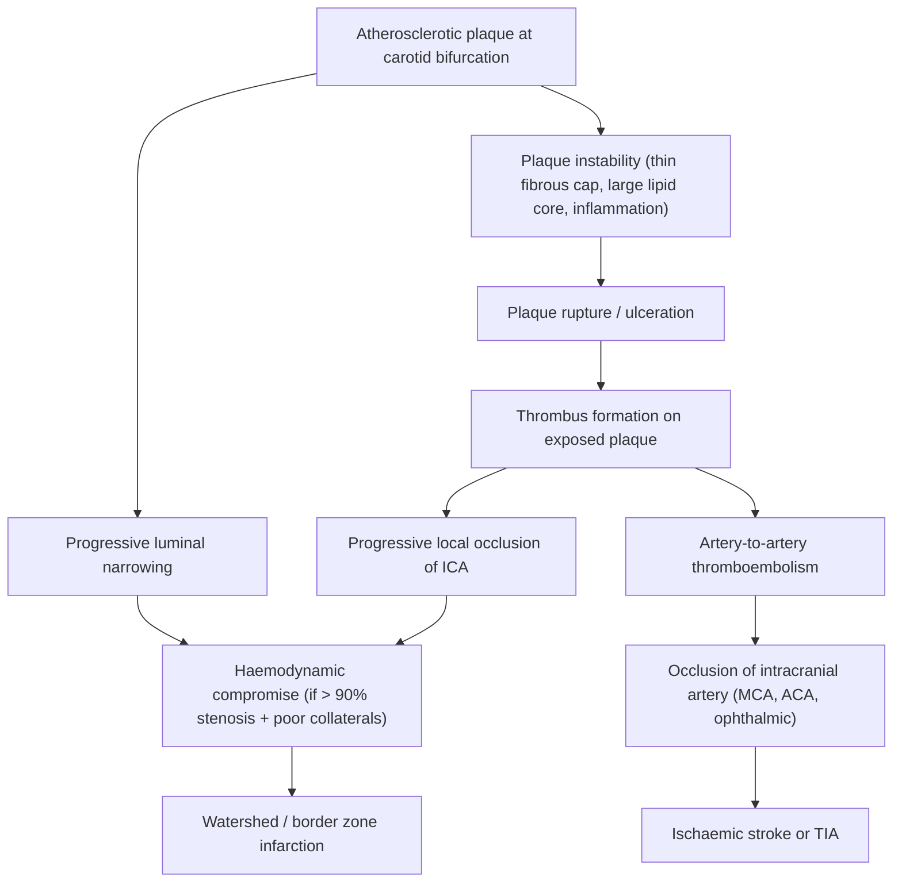

# Carotid Artery Stenosis

## 1. Definition

Carotid artery stenosis (CAS) refers to the **narrowing of the lumen of the carotid arteries** — most commonly the **internal carotid artery (ICA)** — due to atherosclerotic plaque formation. The stenosis occurs most frequently at the **carotid bifurcation**, where the common carotid artery (CCA) divides into the ICA and external carotid artery (ECA), often with extension into the proximal ICA [1][2].

**Why the bifurcation?** This is a region of **disturbed laminar flow** — the blood stream splits, creating areas of low shear stress and flow separation at the outer wall of the carotid bulb. Low shear stress promotes endothelial dysfunction, lipid deposition, and inflammatory cell recruitment — the initiation steps of atherogenesis. This is why atherosclerosis has a predilection for arterial branch points throughout the body.

> **Key Distinction — Symptomatic vs Asymptomatic** [1]:
>
> - **Symptomatic carotid stenosis**: Focal neurological symptoms in the **ipsilateral** carotid territory (i.e., referable to the appropriate carotid artery distribution) occurring within the **previous 6 months**. This includes ≥1 TIA (including amaurosis fugax) **OR** ≥1 minor non-disabling ischaemic stroke.
> - **Asymptomatic carotid stenosis**: Atherosclerotic narrowing of the extracranial ICA in an individual **without** a history of recent ipsilateral carotid territory ischaemic stroke or TIA. The estimated risk of ipsilateral stroke is **0.5–1.0% annually**.

<Callout title="Common Exam Pitfall" type="error">
  Vertigo and syncope are **NOT** generally caused by carotid stenosis and
  should **not** be considered indicative of symptomatic carotid disease [1].
  Vertigo is a posterior circulation (vertebrobasilar) symptom. Syncope is a
  global cerebral hypoperfusion phenomenon — a unilateral carotid stenosis does
  not cause global hypoperfusion because the Circle of Willis provides
  collateral flow. Students frequently make this mistake.
</Callout>

---

## 2. Epidemiology

### 2.1 Prevalence

- Carotid stenosis of ≥50% is found in approximately **4–8%** of the general population over 65 years of age.
- Significant stenosis (≥70%) is found in approximately **1–3%** of the general population.
- Carotid stenosis accounts for approximately **10–20%** of all ischaemic strokes — making it one of the most important treatable causes of stroke [3].

### 2.2 Hong Kong Context

- Stroke is the **4th leading cause of death** in Hong Kong (after cancer, pneumonia, and cardiovascular disease).
- **_Intracranial_** atherosclerotic disease (ICAD) is more prevalent in **Asian populations** (including Hong Kong Chinese) compared with Caucasians, where **extracranial** carotid disease predominates. However, extracranial carotid stenosis remains a significant contributor to stroke in Hong Kong, particularly in patients with multiple cardiovascular risk factors [3][4].
- The ageing population and high prevalence of hypertension, diabetes, and smoking in Hong Kong mean that carotid stenosis remains highly relevant.

### 2.3 Demographics

- **Age**: Prevalence increases sharply after age 65 [1][2].
- **Sex**: More common in **men** than women (except at extremes of age — ages 35–44 and >85 years) [1].
- **Race/Ethnicity**: Higher risk in **Black** populations compared with White populations for stroke overall. Asian populations have relatively more intracranial disease, but extracranial carotid stenosis is still common [1].

---

## 3. Risk Factors

**_Atherosclerosis is a systemic disease_** [5]. The risk factors for carotid stenosis are essentially the **same cardiovascular risk factors** that drive atherosclerosis everywhere in the body — coronary, cerebral, peripheral.

### 3.1 Non-Modifiable Risk Factors

| Risk Factor                | Explanation                                                                                                  |
| -------------------------- | ------------------------------------------------------------------------------------------------------------ |
| **Age >65**                | Cumulative endothelial damage and plaque progression over time [1][2]                                        |
| **Male sex**               | Oestrogen is relatively protective against atherosclerosis pre-menopause; the gap narrows post-menopause [1] |
| **Family history**         | Genetic predisposition to dyslipidaemia, hypertension, diabetes, or intrinsic endothelial vulnerability [1]  |
| **Previous TIA or stroke** | Marker of existing cerebrovascular atherosclerotic disease [1]                                               |
| **Race**                   | Black > White for stroke risk overall [1]                                                                    |

### 3.2 Modifiable Risk Factors

| Risk Factor                | Mechanism / Explanation                                                                                                                                                                                                                                                                                                    |
| -------------------------- | -------------------------------------------------------------------------------------------------------------------------------------------------------------------------------------------------------------------------------------------------------------------------------------------------------------------------- |
| **_Smoking_**              | Directly injures endothelium, promotes oxidative stress, increases LDL oxidation, enhances platelet aggregation, and raises fibrinogen. Strong dose-response relationship. Risk declines after cessation and can be eliminated by ~5 years [1][5]                                                                          |
| **_Hypertension_**         | Promotes formation of atherosclerotic lesions through endothelial shear stress injury. Also predisposes to lacunar infarcts. The **most important** modifiable risk factor for stroke overall [1][5]                                                                                                                       |
| **_Diabetes mellitus_**    | Approximately **2× the risk** of ischaemic stroke. Accelerates atherosclerosis through advanced glycation end-products (AGEs), endothelial dysfunction, and a pro-inflammatory, pro-thrombotic state. Risk is higher in diabetic women than men [1][5]                                                                     |
| **_Hyperlipidaemia_**      | Cholesterol is an established risk factor for atherosclerosis but appears to be only a **weak independent** risk factor for ischaemic stroke specifically (unlike its strong role in coronary artery disease). Statins still reduce stroke risk — likely through plaque stabilisation and anti-inflammatory effects [1][5] |
| **Alcoholism**             | Heavy intake increases BP and promotes AF; moderate intake may be mildly protective [1]                                                                                                                                                                                                                                    |
| **Lack of exercise**       | Sedentary lifestyle worsens all other metabolic risk factors [1]                                                                                                                                                                                                                                                           |
| **Oral contraceptive use** | Oestrogen promotes a hypercoagulable state [1]                                                                                                                                                                                                                                                                             |

<Callout title="Systemic Disease Concept">
  ***Atherosclerosis is a systemic disease*** [5]. A patient with carotid
  stenosis likely has **co-existing coronary artery disease (CAD)** and
  **peripheral arterial disease (PAD)**. This is why pre-operative cardiac
  evaluation is essential before carotid endarterectomy — the leading cause of
  perioperative death is **myocardial infarction**, not stroke [1][2].
</Callout>

---

## 4. Anatomy and Function

### 4.1 The Carotid Arterial System

Understanding carotid anatomy is essential for understanding the clinical features, surgical approach, and complications.

#### Origin and Course

- The **right CCA** arises from the **brachiocephalic trunk** (innominate artery).
- The **left CCA** arises directly from the **aortic arch**.
- Both CCAs ascend in the neck within the **carotid sheath** (which also contains the **internal jugular vein**, **vagus nerve (CN X)**, and **deep cervical lymph nodes**) [2].

#### Bifurcation

- The CCA divides into the **ICA** and **ECA** at the level of the **superior border of the thyroid cartilage**, corresponding to the **C3/4 intervertebral disc space** [1].
- The **carotid bulb** (sinus) is the slight dilation at the terminal CCA / proximal ICA — this is where atherosclerosis preferentially develops due to disturbed flow dynamics.

#### Internal Carotid Artery (ICA)

- **Has NO extracranial branches** — this is a classic anatomy fact and surgically important (it means any branch encountered during dissection belongs to the ECA, not the ICA) [1].
- Enters the skull through the **carotid canal** in the petrous temporal bone.
- Intracranially, gives off the **ophthalmic artery** (supplying the retina — hence amaurosis fugax in ICA disease) and then terminates by dividing into the **anterior cerebral artery (ACA)** and **middle cerebral artery (MCA)**.

#### External Carotid Artery (ECA)

- Has **multiple extracranial branches** supplying the face and scalp.
- Provides **collateral circulation** to the brain (e.g., via the ophthalmic artery anastomosis with branches of the ECA, and via meningeal branches) [1]. This is why patients can sometimes tolerate even complete ICA occlusion without stroke — if collaterals are robust.

<Callout title="High Yield Anatomy Fact">
  The **MCA is NOT considered part of the Circle of Willis** [1]. The Circle of
  Willis is formed by: ACA (A1 segments) + anterior communicating artery + ICA
  (terminal segments) + posterior communicating arteries + posterior cerebral
  arteries (P1 segments). The MCA is a terminal branch of the ICA that branches
  off before the Circle.
</Callout>

### 4.2 Circle of Willis and Collateral Pathways

The Circle of Willis is the principal collateral network for cerebral blood flow. However, a complete Circle of Willis is present in only **~25–50%** of people — anatomical variants are extremely common.

**Five key anastomotic pathways** [1]:

1. **Right ↔ Left** (via anterior communicating artery)
2. **Carotid ↔ Vertebral** (via posterior communicating artery)
3. **Internal carotid ↔ External carotid** (via ophthalmic artery and ECA facial/maxillary branches)
4. **Subclavian ↔ Carotid** (via thyrocervical trunk and ECA branches)
5. **Subclavian ↔ Vertebral** (via muscular branches)

**Why do collaterals matter?** A patient with a slowly progressive carotid stenosis has time to develop robust collateral flow. This is why some patients with even 90–99% stenosis can be asymptomatic. Conversely, if the Circle of Willis is incomplete (variant anatomy) or if the stenosis progresses quickly, the risk of symptomatic ischaemia is much higher.

### 4.3 The Carotid Baroreceptors

- Located within the **adventitia of the origin of the ICA** (carotid sinus) [1].
- They are **stretch-sensitive mechanoreceptors** that respond to alterations in blood pressure.
- Innervated by the **carotid sinus nerve**, a branch of the **glossopharyngeal nerve (CN IX)** (also known as the nerve of Hering).
- **Mechanism**: When BP rises → wall stretches → baroreceptor firing increases → signals via CN IX to the nucleus tractus solitarius in the medulla → parasympathetic activation (vagal tone ↑) + sympathetic inhibition → heart rate ↓ + vasodilation → BP falls. Conversely, low BP → decreased firing → sympathetic activation → HR ↑ + vasoconstriction → BP rises [1].

**Clinical relevance**: During carotid endarterectomy (CEA) or carotid artery stenting (CAS), manipulation of the carotid bifurcation can stimulate these baroreceptors, causing **bradycardia and hypotension** (a vasovagal-type response). This may require **atropine** administration. Post-operatively, haemodynamic instability (both hypertension and hypotension) is common for the same reason [1].

### 4.4 Relationship to the Vagus Nerve

- The **vagus nerve (CN X)** is located **posterior to the CCA** in **90–95%** of individuals [1].
- This is surgically critical — injury to the vagus nerve or its recurrent laryngeal branch during CEA causes **hoarseness** (vocal cord paralysis).

### 4.5 Vascular Territories Supplied by the Carotid System

Understanding the territories helps you predict the clinical features:

| Artery                                   | Territory                                                                                                                                             | Deficit if Occluded                                                                                                                          |
| ---------------------------------------- | ----------------------------------------------------------------------------------------------------------------------------------------------------- | -------------------------------------------------------------------------------------------------------------------------------------------- |
| **Ophthalmic artery** (from ICA)         | Retina                                                                                                                                                | **Amaurosis fugax** (transient monocular blindness) or permanent monocular vision loss                                                       |
| **MCA** (from ICA)                       | Lateral cerebral hemisphere: motor/sensory cortex (face, arm > leg), Broca's area (dominant), Wernicke's area (dominant), parietal association cortex | Contralateral hemiparesis (face + arm > leg), hemisensory loss, aphasia (dominant hemisphere), neglect/constructional apraxia (non-dominant) |
| **ACA** (from ICA)                       | Medial cerebral hemisphere: motor/sensory cortex (leg > arm, face)                                                                                    | Contralateral leg weakness/sensory loss                                                                                                      |
| **Lenticulostriate arteries** (from MCA) | Basal ganglia, internal capsule                                                                                                                       | Contralateral pure motor hemiparesis or lacunar syndromes                                                                                    |

---

## 5. Etiology

### 5.1 Atherosclerosis (Overwhelmingly the Most Common Cause)

**_Atherosclerotic occlusive disease_** is by far the most common cause of carotid stenosis. The process is identical to atherosclerosis in any other vascular bed [5].

#### Pathogenesis of Carotid Atherosclerosis (from First Principles)

1. **Endothelial injury/dysfunction**: Risk factors (hypertension, smoking, diabetes, dyslipidaemia) damage the endothelial lining, particularly at sites of disturbed flow (carotid bifurcation).

2. **Lipid accumulation**: LDL cholesterol infiltrates the subendothelial space and undergoes oxidation. Oxidised LDL is toxic and pro-inflammatory.

3. **Inflammatory cell recruitment**: Monocytes are recruited into the intima, differentiate into macrophages, and engulf oxidised LDL → forming **foam cells** (the hallmark of the fatty streak, the earliest visible lesion).

4. **Smooth muscle cell migration and proliferation**: Smooth muscle cells migrate from the media to the intima, proliferate, and secrete extracellular matrix (collagen, elastin) → forming a **fibrous cap** over the lipid core.

5. **Advanced plaque formation**: The mature plaque has a **lipid-rich necrotic core** covered by a **fibrous cap**. Calcification, haemorrhage into the plaque, and neovascularisation within the plaque can occur.

6. **Plaque complications**:
   - **_Plaque ulceration, thrombosis and embolism are important in the pathogenesis of clinical manifestations_** [1]. Rupture or erosion of the fibrous cap exposes the thrombogenic lipid core to the bloodstream → **platelet aggregation and thrombus formation**.
   - The thrombus can:
     - **Grow locally** → further narrowing or complete occlusion of the ICA.
     - **Embolise distally** → travel to intracranial vessels (MCA, ACA, ophthalmic artery) → causing TIA or stroke. **Artery-to-artery embolism** is the dominant mechanism of stroke in carotid stenosis.
   - **Haemodynamic compromise**: Very high-grade stenosis (>90%) can reduce distal perfusion pressure to the point where watershed (border zone) ischaemia occurs, especially if collaterals are inadequate.

<Callout title="Two Mechanisms of Stroke in Carotid Stenosis">
1. **Artery-to-artery thromboembolism** (the dominant mechanism) — plaque rupture → thrombus → emboli to intracranial vessels.
2. **Haemodynamic failure** (less common) — critical reduction in distal perfusion pressure causing watershed infarction.

Most strokes from carotid stenosis are **embolic**, not purely haemodynamic. This is why even moderate stenosis with an ulcerated, unstable plaque can be more dangerous than a smooth, stable high-grade stenosis.

</Callout>

### 5.2 Other (Less Common) Causes of Carotid Stenosis

These are uncommon but important to recognise because they occur in younger patients and require different management:

| Cause                             | Key Features                                                                                                                                                                                                                                                     |
| --------------------------------- | ---------------------------------------------------------------------------------------------------------------------------------------------------------------------------------------------------------------------------------------------------------------- |
| **Carotid artery dissection**     | Tear in the intima → intramural haematoma → luminal narrowing. Often in younger patients. Associated with trauma (even minor), connective tissue disorders (Marfan, Ehlers-Danlos), or spontaneous. Presents with neck pain, Horner syndrome, and stroke/TIA [1] |
| **Fibromuscular dysplasia (FMD)** | Non-inflammatory, non-atherosclerotic disorder causing alternating stenosis and dilation ("string of beads" on angiography). Predominantly affects young to middle-aged women. Can cause stenosis, dissection, or aneurysm [1]                                   |
| **Vasculitis**                    | Takayasu arteritis (large vessel, young Asian women), Giant cell arteritis (temporal arteritis; age >50, associated with polymyalgia rheumatica) [1]                                                                                                             |
| **Radiation-induced stenosis**    | Accelerated atherosclerosis following head/neck radiation therapy. Often occurs years to decades after treatment                                                                                                                                                 |
| **_Moyamoya disease_**            | Chronic progressive stenosis/occlusion of arteries around the Circle of Willis with prominent collaterals ("puff of smoke" on angiography). More common in East Asian populations (including Hong Kong) [1]                                                      |

### 5.3 Etiological Classification in Context of Ischaemic Stroke

**_Acute ischaemic stroke_** results from **_cardioembolism, critical arterial stenosis,_** or **_arterial dissection_** [4]. Carotid stenosis falls under the "critical arterial stenosis" category — one of the major stroke subtypes.

For completeness, the aetiological classification of ischaemic stroke relevant to carotid stenosis includes [1]:

- **Large-vessel atherosclerosis** (extracranial): **_Carotid stenosis_**, aortic arch atheroma
- **Large-vessel atherosclerosis** (intracranial): **_Intracranial atherosclerotic disease_** (particularly important in Asian populations)
- **Cardioembolism**: AF, valvular disease, MI with mural thrombus
- **Small-vessel disease**: Lacunar infarcts from lipohyalinosis
- **Other determined aetiology**: Dissection, FMD, vasculitis, hypercoagulable states
- **Cryptogenic**: No identified cause despite workup

---

## 6. Pathophysiology — Detailed Mechanisms

### 6.1 From Stenosis to Stroke

### 6.2 The Ischaemic Penumbra Concept

**_Acute cell death and loss of function occur in the core._** **_Cells in the penumbra are potentially salvageable._** **_The aim is timely restoration of perfusion._** [4]

- The **ischaemic core** receives blood flow below the threshold for cell survival (~10 mL/100g/min) → irreversible neuronal death within minutes.
- The **ischaemic penumbra** surrounds the core — it receives reduced but not zero blood flow (~10–22 mL/100g/min). Neurons here are electrically silent (non-functional) but structurally intact. If perfusion is restored in time, these cells can recover. If not, they undergo infarction and the core expands.
- This is the basis of the **"time is brain"** concept and why acute stroke is treated as a medical emergency.

### 6.3 Haemodynamic vs Thromboembolic Mechanisms

| Feature               | Thromboembolic                                           | Haemodynamic                                                                |
| --------------------- | -------------------------------------------------------- | --------------------------------------------------------------------------- |
| **Mechanism**         | Plaque rupture → thrombus → distal embolism              | Critical stenosis → reduced distal perfusion                                |
| **Frequency**         | **Dominant mechanism** (~80% of carotid-related strokes) | Less common (~20%)                                                          |
| **Infarct pattern**   | **Territorial** (MCA, ACA territory)                     | **Watershed / border zone** (between ACA-MCA or MCA-PCA territories)        |
| **Clinical scenario** | Moderate-to-severe stenosis with unstable plaque         | Very severe (>90%) or complete ICA occlusion with poor collaterals          |
| **Presentation**      | Sudden onset focal deficit                               | May be preceded by postural symptoms (worse on standing, better lying down) |

### 6.4 Why TIAs Occur Before Stroke

A TIA (transient ischaemic attack) is a **warning sign** — it represents a temporary embolus that occludes a vessel but then either **fragments/dissolves** (via endogenous fibrinolysis) or gets pushed distally into a smaller vessel where collaterals compensate, and the ischaemia resolves before infarction occurs (typically < 1 hour, by definition < 24 hours, though the modern tissue-based definition requires no evidence of infarction on imaging).

**Why is this important?** A TIA in the carotid territory signals an **unstable plaque** that is actively emitting emboli. The risk of subsequent completed stroke is **highest in the first 48–72 hours** after a TIA — this is why urgent investigation and treatment of carotid stenosis is critical after a TIA.

### 6.5 Amaurosis Fugax — Pathophysiology

Amaurosis fugax ("fleeting blindness") is **transient monocular blindness** ipsilateral to the carotid stenosis.

- An embolus from the carotid plaque travels up the ICA → enters the ophthalmic artery → transiently occludes the retinal artery → painless monocular vision loss (classically described as a "curtain coming down" over the eye).
- It is essentially a **retinal TIA**.
- On fundoscopy, a **Hollenhorst plaque** (bright, refractile cholesterol crystal) may be seen at an arteriolar bifurcation in the retina.

---

## 7. Classification

### 7.1 By Symptom Status (Most Clinically Important)

| Category         | Definition                                                                            | Annual Ipsilateral Stroke Risk                                                                             |
| ---------------- | ------------------------------------------------------------------------------------- | ---------------------------------------------------------------------------------------------------------- |
| **Asymptomatic** | No ipsilateral carotid territory TIA or stroke in the past 6 months                   | 0.5–1.0% per year (with best medical therapy; can be up to 2% without) [1]                                 |
| **Symptomatic**  | ≥1 ipsilateral carotid territory TIA or non-disabling stroke within the past 6 months | 10–15% at 2 years (for ≥70% stenosis without surgery; much higher in the first days-weeks after event) [1] |

### 7.2 By Degree of Stenosis (NASCET Criteria)

The **North American Symptomatic Carotid Endarterectomy Trial (NASCET)** method is the most widely used. It compares the narrowest diameter of the residual lumen at the stenosis to the diameter of the normal distal ICA (beyond the bulb, where the walls are parallel):

$$\text\{Percent Stenosis\} = \left(1 - \frac\{\text\{Minimum residual lumen diameter\}\}\{\text\{Normal distal ICA diameter\}\}\right) \times 100\%$$

| NASCET Grade                  | Clinical Significance                                                                   |
| ----------------------------- | --------------------------------------------------------------------------------------- |
| **Mild (< 50%)**              | Low stroke risk; medical therapy alone                                                  |
| **Moderate (50–69%)**         | Marginal benefit of surgery in symptomatic patients (depends on risk factors)           |
| **Severe (70–99%)**           | Highest benefit from revascularisation (especially if symptomatic) [1][2]               |
| **Complete occlusion (100%)** | No surgical intervention of proven benefit (**_absolute contraindication_** to CEA) [1] |

<Callout title="ECST vs NASCET Methods" type="idea">
  The European Carotid Surgery Trial (ECST) method measures the stenosis
  relative to the estimated original lumen diameter at the point of maximal
  stenosis — this gives a higher percentage for the same lesion. An ECST 70%
  stenosis ≈ NASCET 50%. Always clarify which method is being used. NASCET
  criteria are now the international standard.
</Callout>

### 7.3 By Plaque Morphology / Vulnerability

Not all stenoses are equal — **plaque vulnerability** matters as much as (or more than) the degree of stenosis:

| Feature                     | Stable Plaque                        | Vulnerable (Unstable) Plaque                     |
| --------------------------- | ------------------------------------ | ------------------------------------------------ |
| **Fibrous cap**             | Thick, intact                        | Thin, prone to rupture                           |
| **Lipid core**              | Small                                | Large, necrotic                                  |
| **Inflammation**            | Minimal                              | Dense macrophage infiltration                    |
| **Calcification**           | Heavy, diffuse (stabilising)         | Spotty, superficial                              |
| **Surface**                 | Smooth                               | **Ulcerated**, irregular                         |
| **Intraplaque haemorrhage** | Absent                               | Present                                          |
| **Stroke risk**             | Lower for a given degree of stenosis | Higher — even moderate stenosis can be dangerous |

---

## 8. Clinical Features

The clinical features of carotid stenosis are best understood by dividing them into **symptoms** and **signs**, with their pathophysiological basis explained inline.

### 8.1 Symptoms

#### A. Asymptomatic Carotid Stenosis

- **No neurological symptoms** — the stenosis is discovered incidentally (e.g., a carotid bruit heard on routine examination, or stenosis found on imaging done for other reasons).
- Even **unilateral complete occlusion** can be asymptomatic if collateral supply (via Circle of Willis, ECA anastomoses) is adequate [2].
- This is remarkable and clinically important — it demonstrates the power of collateral circulation.

#### B. Symptomatic Carotid Stenosis

Symptoms are caused by **ischaemia in the ipsilateral carotid territory** — either transient (TIA) or permanent (stroke).

**i. Transient Ischaemic Attack (TIA)**

- **Definition**: Sudden-onset focal neurological deficit lasting < 24 hours (clinical definition) or, by the modern tissue-based definition, a transient episode of neurological dysfunction caused by focal brain or retinal ischaemia without acute infarction on imaging.
- **Mechanism**: Embolus from carotid plaque → transient occlusion of intracranial artery → spontaneous lysis or fragmentation → symptoms resolve.

Specific TIA presentations from carotid stenosis:

| Symptom                                                        | Mechanism                                                                                                                                                                                         |
| -------------------------------------------------------------- | ------------------------------------------------------------------------------------------------------------------------------------------------------------------------------------------------- |
| **Amaurosis fugax** (transient monocular blindness)            | Embolus to the ophthalmic/retinal artery ipsilateral to the stenosis. Classically described as a "curtain descending over the eye." Painless. Lasts seconds to minutes [1]                        |
| **Contralateral hemiparesis** (weakness of arm/face > leg)     | Embolus to MCA territory → motor cortex ischaemia. MCA supplies the lateral cortex (face + arm representation), explaining the face/arm predominance over leg [1]                                 |
| **Contralateral hemisensory loss**                             | Embolus to MCA territory → sensory cortex ischaemia                                                                                                                                               |
| **Dysphasia / Aphasia** (if dominant hemisphere, usually left) | Embolus to MCA territory → Broca's area (expressive aphasia) or Wernicke's area (receptive aphasia) or both (global aphasia). This is a **cortical sign** specific to the dominant hemisphere [1] |
| **Contralateral homonymous hemianopia**                        | Embolus to MCA or PCA territory → visual cortex or optic radiation ischaemia [1]                                                                                                                  |

**ii. Minor / Non-Disabling Ischaemic Stroke**

- Same symptoms as TIA but they **persist** beyond 24 hours (or there is evidence of infarction on imaging), though the deficit is mild enough that the patient retains functional independence.

**iii. Major Ischaemic Stroke**

- Sudden-onset severe neurological deficit that is disabling.
- Large MCA territory stroke: dense contralateral hemiplegia + hemisensory loss + homonymous hemianopia + higher cortical dysfunction (aphasia if dominant, neglect if non-dominant).

<Callout title="Cortical Signs in Carotid Territory Stroke" type="idea">
The presence of **cortical signs** helps localise the lesion to the carotid (anterior circulation) territory [1]:
- **Aphasia** (dominant hemisphere — usually left)
- **Apraxia** (inability to perform learned motor tasks despite intact motor function)
- **Agnosia** (inability to recognise objects, people, or stimuli despite intact sensory function)
- **Neglect** (non-dominant hemisphere — usually right) — the patient ignores one side of space
- **Homonymous hemianopia** (visual field cut)

If a patient has **only** vertigo, ataxia, diplopia, bilateral visual loss, or bilateral motor/sensory symptoms — think **posterior circulation** (vertebrobasilar), NOT carotid.

</Callout>

### 8.2 Signs

#### A. Cardiovascular Examination

| Sign                                     | Pathophysiology / Explanation                                                                                                                                                                                                                                                                                                                                                                                                                                                                                                                                                                      |
| ---------------------------------------- | -------------------------------------------------------------------------------------------------------------------------------------------------------------------------------------------------------------------------------------------------------------------------------------------------------------------------------------------------------------------------------------------------------------------------------------------------------------------------------------------------------------------------------------------------------------------------------------------------- |
| **_Carotid bruit_**                      | A **bruit** is a turbulent flow sound heard with the stethoscope over the carotid bifurcation. It is typically heard when stenosis is **≥50–70%** — at this degree, blood velocity through the narrowed segment increases enough to generate turbulence. However, it is a **poor predictor** of the degree of stenosis: very tight stenoses (near occlusion) may have a **soft or absent bruit** because flow velocity drops when the residual lumen is extremely small. **Complete occlusion produces NO bruit** — there is no flow to generate turbulence [1]. Therefore: no bruit ≠ no disease. |
| **Diminished/absent carotid pulse**      | Very severe stenosis or complete occlusion reduces the palpable pulse. Compare both sides                                                                                                                                                                                                                                                                                                                                                                                                                                                                                                          |
| **Signs of generalised atherosclerosis** | Check for absent peripheral pulses, AAA (pulsatile abdominal mass), signs of PAD (trophic changes in limbs). **_Atherosclerosis is a systemic disease_** [5]                                                                                                                                                                                                                                                                                                                                                                                                                                       |

#### B. Ophthalmological Examination

| Sign                                                                                | Pathophysiology                                                                                                                                 |
| ----------------------------------------------------------------------------------- | ----------------------------------------------------------------------------------------------------------------------------------------------- |
| **Partial or complete blindness in one eye**                                        | Ocular ischaemia **ipsilateral** to the carotid stenosis — embolus to ophthalmic/retinal artery [1]                                             |
| **Absence of pupillary light response** (relative afferent pupillary defect — RAPD) | Ipsilateral retinal ischaemia damages the afferent limb of the pupillary light reflex [1]                                                       |
| **Hollenhorst plaque on fundoscopy**                                                | Bright, refractile cholesterol crystal lodged at an arteriolar bifurcation — direct evidence of upstream atheroembolism from the carotid plaque |
| **Retinal arterial occlusion / ischaemic changes on fundoscopy**                    | Branch or central retinal artery occlusion from carotid embolism [1]                                                                            |

#### C. Neurological Examination

| Sign                                                 | Pathophysiology                                                                                |
| ---------------------------------------------------- | ---------------------------------------------------------------------------------------------- |
| **Contralateral hemiparesis (face + arm > leg)**     | MCA territory ischaemia — lateral motor cortex (face/arm homunculus)                           |
| **Contralateral hemisensory loss**                   | MCA territory — lateral sensory cortex                                                         |
| **Aphasia** (if dominant hemisphere)                 | Left hemisphere ischaemia (Broca's = non-fluent; Wernicke's = fluent; Global = both) [1]       |
| **Visuospatial neglect / Constructional apraxia**    | **Right hemisphere** ischaemia (non-dominant in most people) [1]                               |
| **Homonymous hemianopia**                            | Ischaemia of optic radiation or visual cortex in the affected hemisphere [1]                   |
| **Upper motor neuron signs** (in established stroke) | Hyperreflexia, upgoing plantar (Babinski), spasticity — from damage to the corticospinal tract |

<Callout title="Key Point — Lateralisation" type="error">
The carotid artery supplies the **ipsilateral** hemisphere. The hemisphere controls the **contralateral** body. Therefore:
- **Right carotid stenosis** → **right hemisphere** ischaemia → **left-sided** motor/sensory deficits + right eye amaurosis fugax + neglect (if right-hemisphere dominant for spatial attention, as in most people)
- **Left carotid stenosis** → **left hemisphere** ischaemia → **right-sided** motor/sensory deficits + left eye amaurosis fugax + aphasia (if left-hemisphere dominant for language, as in most people)

A common exam mistake is getting the laterality wrong — always trace from the stenosis → ipsilateral hemisphere → contralateral body.

</Callout>

---

## 9. Relevant Associated Conditions

### 9.1 Carotid Stenosis and Coronary Artery Disease

- Approximately **40–60%** of patients with significant carotid stenosis have concomitant CAD.
- **MI is the leading cause of long-term mortality** in patients with carotid stenosis — not stroke.
- This is why **cardiac evaluation** (e.g., ECG, echocardiography, stress testing) is part of the pre-operative workup before CEA [1].

### 9.2 Carotid Stenosis and Peripheral Arterial Disease

- PAD and carotid stenosis share the same risk factor profile.
- Patients with PAD should be screened for carotid disease and vice versa.

### 9.3 Carotid Stenosis and Aortic Aneurysm

- **_Atherosclerotic risk factors_** also predispose to AAA [5].
- Consider screening for AAA in patients with carotid stenosis, particularly older men who smoke.

---

<Callout title="High Yield Summary">

**Definition**: Narrowing of the carotid artery (usually at the bifurcation / proximal ICA) predominantly due to atherosclerosis. Classified as symptomatic (ipsilateral TIA/stroke within 6 months) or asymptomatic.

**Epidemiology**: Accounts for 10–20% of ischaemic strokes. More common in males, age >65, with cardiovascular risk factors. Intracranial atherosclerosis is relatively more common in Asian (including Hong Kong) populations, but extracranial carotid disease remains highly relevant.

**Key Risk Factors**: **_Smoking, hypertension, diabetes mellitus, hyperlipidaemia, family history_** — atherosclerosis is a systemic disease.

**Anatomy**: CCA bifurcates at C3/4 into ICA (no extracranial branches) and ECA (multiple branches, provides collateral flow). MCA is NOT part of the Circle of Willis. Vagus nerve lies posterior to CCA (90–95%). Carotid baroreceptors at ICA origin are innervated by CN IX — manipulation causes bradycardia/hypotension.

**Pathophysiology**: Atherosclerotic plaque → plaque rupture/ulceration → thrombosis → artery-to-artery thromboembolism (dominant mechanism) or haemodynamic failure (less common, very high-grade stenosis). The ischaemic penumbra is potentially salvageable with timely reperfusion.

**Clinical Features**:

- Asymptomatic: No symptoms; found incidentally. Even complete occlusion can be silent if collaterals are adequate.
- Symptomatic: Amaurosis fugax (ipsilateral), contralateral hemiparesis (face/arm > leg), hemisensory loss, aphasia (dominant hemisphere), neglect (non-dominant), homonymous hemianopia.
- Signs: Carotid bruit (poor predictor — absent in complete occlusion), Hollenhorst plaque on fundoscopy, contralateral UMN signs, cortical signs.
- Vertigo and syncope are NOT carotid symptoms.

**Classification**: By symptom status (symptomatic vs asymptomatic), by NASCET grade (mild < 50%, moderate 50–69%, severe 70 –99%, complete occlusion 100%), by plaque vulnerability.

</Callout>

---

<ActiveRecallQuiz
  title="Active Recall - Carotid Artery Stenosis (Definition, Epidemiology, Anatomy, Etiology, Pathophysiology, Clinical Features)"
  items={[
    {
      question:
        "Why does atherosclerosis preferentially develop at the carotid bifurcation?",
      markscheme:
        "Disturbed laminar flow at bifurcation creates areas of low shear stress and flow separation, promoting endothelial dysfunction, lipid deposition, and inflammatory cell recruitment — the initiating steps of atherogenesis.",
    },
    {
      question:
        "A patient with right ICA stenosis develops a TIA. What symptoms would you expect, and why?",
      markscheme:
        "Left-sided motor/sensory deficits (face and arm more than leg, due to MCA territory), right eye amaurosis fugax (embolus to right ophthalmic artery), and possibly visuospatial neglect or constructional apraxia (right hemisphere is non-dominant for spatial attention in most people). Aphasia would NOT be expected (language is left hemisphere dominant in most).",
    },
    {
      question:
        "Why can a carotid bruit be absent in a patient with complete ICA occlusion?",
      markscheme:
        "A bruit is caused by turbulent flow through a narrowed segment. In complete occlusion, there is no flow through the occluded vessel, so no turbulence is generated and no bruit is heard. No bruit does not equal no disease.",
    },
    {
      question:
        "What is the dominant mechanism of stroke in carotid artery stenosis, and what is the less common mechanism?",
      markscheme:
        "Dominant: Artery-to-artery thromboembolism (plaque rupture leads to thrombus formation which embolises to intracranial vessels, approximately 80%). Less common: Haemodynamic failure (critical stenosis more than 90% with poor collaterals reduces distal perfusion, causing watershed or border zone infarction, approximately 20%).",
    },
    {
      question:
        "Name three symptoms or signs that are NOT caused by carotid stenosis and explain why.",
      markscheme:
        "Vertigo (posterior circulation/vestibular, not carotid territory), syncope (global cerebral hypoperfusion, unilateral carotid stenosis does not cause global hypoperfusion due to Circle of Willis collaterals), and bilateral motor or sensory symptoms (require bilateral hemispheric or brainstem involvement, not a single carotid territory).",
    },
    {
      question:
        "Why is cardiac evaluation important before carotid endarterectomy?",
      markscheme:
        "Atherosclerosis is a systemic disease. 40-60% of patients with significant carotid stenosis have co-existing coronary artery disease. MI is the leading cause of perioperative and long-term mortality in these patients, not stroke. Pre-operative cardiac evaluation (ECG, echocardiography, stress testing) identifies and manages this risk.",
    },
  ]}
/>

---

## References

[1] Senior notes: felixlai.md (Carotid artery stenosis section, pages 892–899; Stroke section, pages 1137–1163)
[2] Senior notes: maxim.md (Carotid artery disease section, page 169; Chronic limb ischaemia section, pages 151–157)
[3] Harrison's Principles of Internal Medicine (standard reference for stroke epidemiology and carotid disease prevalence)
[4] Lecture slides: GC 109. Headache and loss of consciousness Acute stroke, subarachnoid haemorrhage and vascular malformation.pdf (pages 9, 17–18)
[5] Lecture slides: WCS 002 - Toe gangrene and leg ulcer - by Prof SWK Cheng.pdf (page 2)
