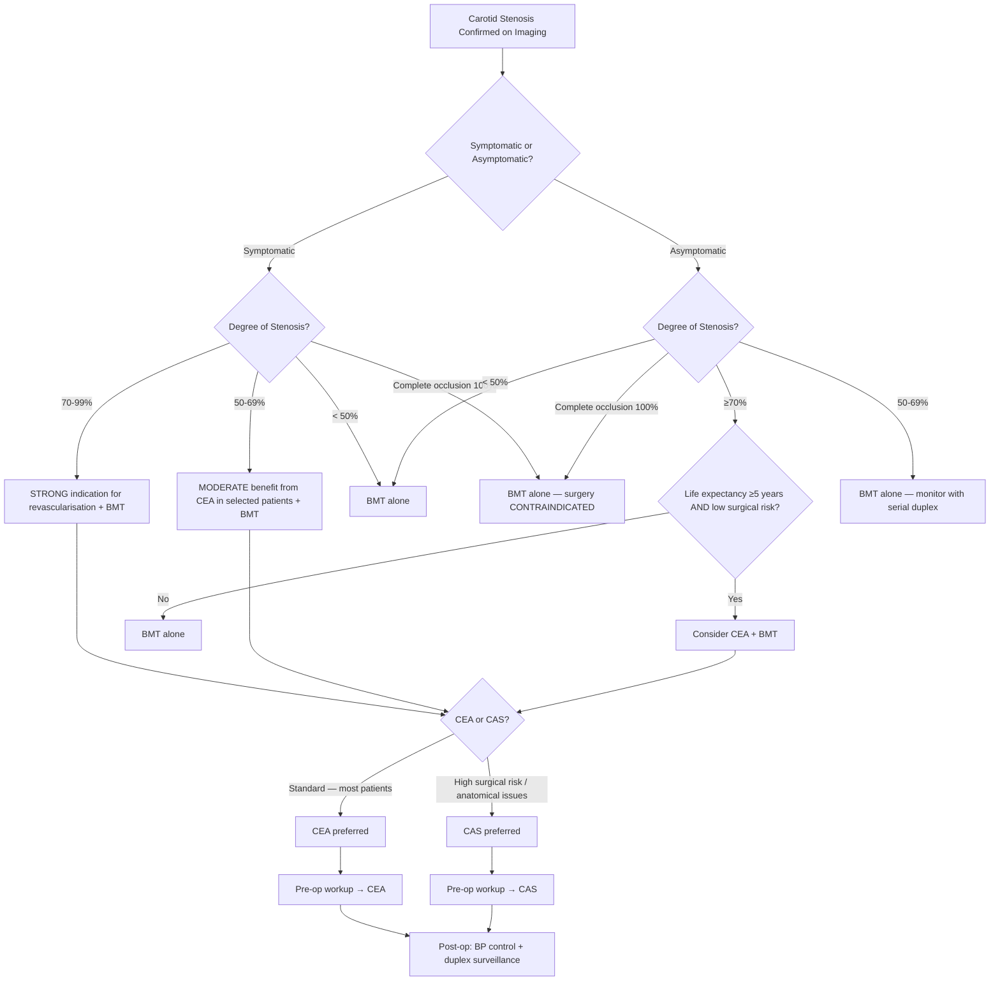
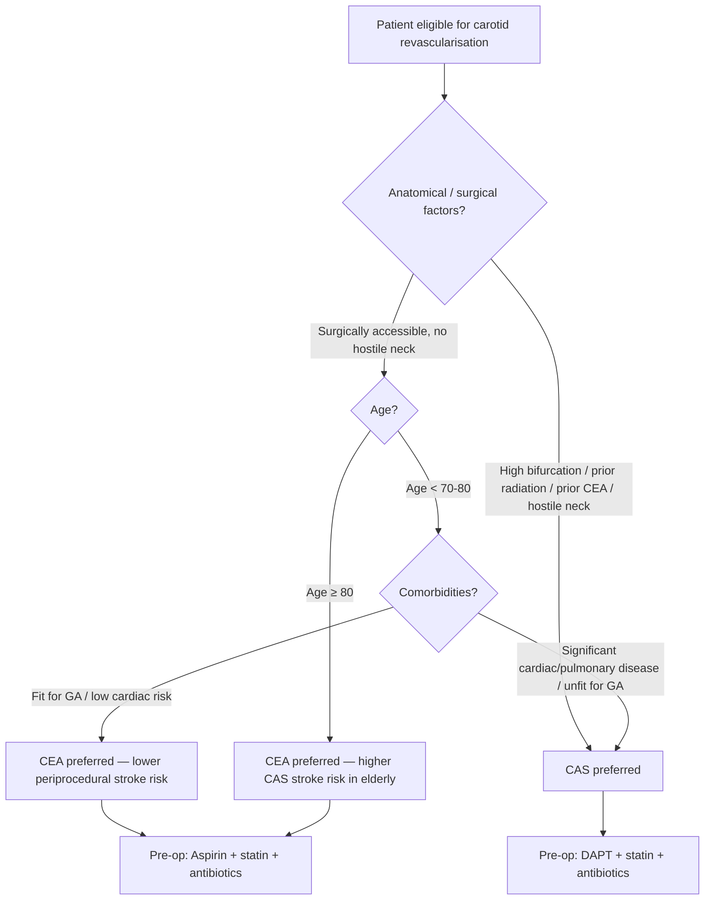

## Management of Carotid Artery Stenosis

### 1. Guiding Principles — Why We Treat and What We're Trying to Achieve

The entire purpose of treating carotid stenosis is **stroke prevention**. We are not treating the stenosis for its own sake — we are preventing the catastrophic downstream consequence of plaque rupture, thromboembolism, and cerebral infarction.

Three pillars of management:
1. **Best medical therapy (BMT)** — for ALL patients, regardless of symptom status or stenosis grade.
2. **Carotid revascularisation** — CEA or CAS — added on top of BMT in **selected patients** where the procedural risk is outweighed by the stroke risk reduction.
3. **Cardiovascular risk factor modification** — because ***atherosclerosis is a systemic disease*** [5] and the leading cause of long-term death in these patients is **myocardial infarction**, not stroke.

<Callout title="The CREST-2 and ECST-2 Era">
The landmark trials (NASCET, ECST, ACAS, ACST) were conducted in the 1990s–2000s when medical therapy was suboptimal. Modern best medical therapy (high-intensity statins, aggressive BP control, antiplatelet therapy) has dramatically reduced the annual stroke risk in asymptomatic stenosis to approximately 0.5–1.0% per year [1]. This means the bar for surgical benefit in asymptomatic disease is now very high — the procedure must carry an even lower complication rate to justify itself.
</Callout>

---

### 2. Master Management Algorithm

---

### 3. Best Medical Therapy (BMT) — The Foundation for ALL Patients

**Every single patient** with carotid stenosis — symptomatic or asymptomatic, mild or severe — receives best medical therapy. Even if revascularisation is planned, BMT must be initiated immediately and continued indefinitely [1][2].

#### 3.1 Lifestyle Modification

| Intervention | Rationale / Mechanism |
|---|---|
| **Smoking cessation** | Smoking directly injures the endothelium, promotes LDL oxidation, raises fibrinogen, and enhances platelet aggregation. Strong dose-response relationship with stroke risk. Risk eliminated ~5 years after quitting [1][9] |
| ***Weight control*** | Obesity worsens all metabolic risk factors (hypertension, insulin resistance, dyslipidaemia) [1] |
| ***Mediterranean diet*** | Rich in olive oil, fish, vegetables, nuts. Reduces cardiovascular events through anti-inflammatory and antioxidant mechanisms [1] |
| ***Regular aerobic physical activity*** | Moderate-to-vigorous activity for ~40 minutes, 3–4 times per week. Improves endothelial function, insulin sensitivity, lipid profile, and BP. Stimulates collateral vessel formation [1][9] |
| ***Limited alcohol consumption*** | Heavy alcohol raises BP and promotes AF. Light-moderate intake may be mildly protective, but recommending alcohol initiation is inappropriate [1] |

#### 3.2 Pharmacological Therapy

| Drug Class | Specific Agent(s) | Mechanism & Rationale | Key Points |
|---|---|---|---|
| ***Antiplatelets*** | ***Aspirin*** (75–325 mg daily) | Irreversibly inhibits COX-1 → blocks thromboxane A2 production → reduces platelet aggregation. Prevents thrombus formation on unstable atherosclerotic plaques. Decreases death and recurrence of stroke [1][2][9] | Indicated in **non-cardioembolic** stroke/TIA. Recommended for ALL patients with carotid stenosis. Started pre-operatively for CEA and continued for at least 3 months post-operatively [1] |
| | **Clopidogrel** (75 mg daily) | Irreversibly blocks P2Y12 ADP receptor on platelets → inhibits ADP-mediated platelet activation. Marginally superior to aspirin monotherapy [9] | Alternative to aspirin if aspirin-intolerant. **Aspirin + Clopidogrel (DAPT)**: NOT recommended for long-term secondary prevention (increases ICH risk without proportionate benefit) [9]. Can be used short-term (21–90 days) after minor stroke/TIA, and is **required for 3 months after CAS** [2] |
| ***Statins*** | High-intensity statin (e.g., atorvastatin 40–80 mg, rosuvastatin 20–40 mg) | HMG-CoA reductase inhibitor → reduces hepatic cholesterol synthesis → upregulates LDL receptors → lowers LDL. Beyond lipid-lowering: **plaque stabilisation** (thickens fibrous cap, reduces lipid core, suppresses inflammation), **anti-inflammatory**, improves endothelial function. ***Use statins with intensive lipid-lowering effect to reduce risk of stroke and cardiovascular events in patients with ischaemic stroke or TIA of presumed atherosclerotic origin*** [9] | Started regardless of baseline lipid levels — the benefit is pleiotropic, not just cholesterol reduction [2][8] |
| ***Antihypertensives*** | ACEI (e.g., perindopril, ramipril) or ARB; may add thiazide diuretic or CCB | Reduces BP → reduces endothelial shear stress → slows atherogenesis. Target BP < 140/90 mmHg (or < 130/80 in high-risk patients / recent lacunar stroke) [2][9] | ***Antihypertensive (ACEI)*** specifically mentioned as part of medical therapy for carotid disease [2]. Avoid excessive BP lowering in the acute phase of stroke (risk of watershed infarction) |
| **Antidiabetic agents** | As appropriate for glycaemic control | Good glycaemic control (HbA1c < 7%) reduces microvascular and macrovascular complications, slows atherosclerosis progression | Target HbA1c individualised. SGLT2 inhibitors and GLP-1 receptor agonists have proven cardiovascular benefit beyond glycaemic control |

<Callout title="Antiplatelet vs Anticoagulant — A Critical Distinction" type="error">
**Non-cardioembolic stroke/TIA** (including carotid stenosis): Use **antiplatelets** (aspirin or clopidogrel). Anticoagulants are NOT superior and increase bleeding risk [9].

**Cardioembolic stroke/TIA** (e.g., AF): Use **anticoagulants** (NOACs or warfarin). Antiplatelets alone are inadequate [9].

If a patient has BOTH carotid stenosis AND AF — the anticoagulation for AF takes priority, and the carotid stenosis is still considered for revascularisation. This is a common clinical scenario.
</Callout>

---

### 4. Carotid Revascularisation — Overview

Two techniques exist. The choice between them depends on patient anatomy, comorbidities, and institutional expertise:

| Feature | ***Carotid Endarterectomy (CEA)*** | ***Carotid Angioplasty and Stenting (CAS)*** |
|---|---|---|
| **Approach** | Open surgical: neck incision, clamp ICA, open artery, physically remove atherosclerotic plaque [5] | Endovascular: percutaneous via femoral artery, balloon dilation + stent deployment [1] |
| **Anaesthesia** | LA or GA | Usually **LA with minimal sedation** (most procedures) [1] |
| **Effectiveness** | ***More effective*** overall; gold standard [2] | Alternative to CEA; comparable long-term outcomes [1] |
| **Periprocedural stroke risk** | Lower (~3% symptomatic, ~1.5% asymptomatic) | **Higher** short-term periprocedural stroke/death risk than CEA [1] |
| **MI risk** | Slightly higher (general anaesthesia, haemodynamic stress) | Lower |
| **Post-op antiplatelet** | Aspirin alone (***no need for DAPT***) [2] | ***DAPT (aspirin + clopidogrel) for 3 months*** [2] |
| **Preferred when** | Standard patients, ***tortuous vessels*** [2] | Re-stenosis after CEA, radiation-induced stenosis, high surgical risk, surgically inaccessible lesion [1][2] |

---

### 5. Carotid Endarterectomy (CEA) — Detailed

***Endarterectomy*** is a ***local procedure*** for ***larger vessels, short segments, stenosis*** — e.g., ***iliac, carotid*** [5].

"Endarterectomy" literally means: "endo" = within, "arter" = artery, "ectomy" = cutting out. You open the artery and **physically cut out / peel out** the atherosclerotic plaque from the intima and inner media, restoring a smooth, wide lumen.

#### 5.1 Indications

**A. Symptomatic Carotid Stenosis** [1][7][9]:

| Stenosis Grade | Recommendation | Evidence Base |
|---|---|---|
| **70–99%** | **Strong indication** for CEA + BMT. Benefit is greatest when performed **within 2 weeks** of the index event | NASCET: 65% relative risk reduction of ipsilateral stroke at 2 years. NNT ~6 at 2 years |
| **50–69%** | **Moderate benefit** from CEA, particularly in patients with: male sex, recent hemispheric (not retinal) symptoms, irregular/ulcerated plaque, no diabetes. ***Moderate carotid artery stenosis of 50–69% also has slight benefit for carotid endarterectomy*** [7] | NASCET: 29% relative risk reduction. NNT ~15 at 5 years. Benefit is marginal — patient selection is critical |
| **< 50%** | **No benefit** from CEA. BMT alone | NASCET: No significant difference between surgery and medical therapy |

**B. Asymptomatic Carotid Stenosis** [1]:

- ***Medical therapy ALONE for all patients*** [1]
- ***CEA in SELECTED patients*** who meet ALL of the following [1]:
  - ***Medically stable patients who have a life expectancy of ≥ 5 years***
  - ***High-grade (≥ 70%) asymptomatic carotid stenosis at baseline*** **OR** ***progression to ≥ 70% stenosis despite intensive medical therapy***
  - Surgically accessible carotid lesion
  - No prior ipsilateral endarterectomy
  - Absence of clinically significant cardiac, pulmonary or other disease that would greatly increase the risk of anaesthesia and surgery

**Morbidity/mortality thresholds** [1][7]:
- Overall perioperative morbidity and mortality must be **< 6% in symptomatic patients** and **< 3% in asymptomatic patients**. If the surgical centre cannot meet these benchmarks, the procedure should not be offered — the risks outweigh the benefits.

#### 5.2 Contraindications

| Contraindication | Rationale |
|---|---|
| ***Asymptomatic complete carotid occlusion (ABSOLUTE)*** | ***No surgical treatment has been proven to be of benefit for preventing subsequent stroke in patients with complete carotid artery occlusion*** [1]. The territory is already supplied by collaterals; reopening carries high embolisation risk with no proven benefit |
| **Surgically inaccessible location** (high bifurcation above C2) | Cannot safely expose the ICA high enough to clamp and perform endarterectomy [1] |
| **Prior neck irradiation** resulting in "woody fibrosis" | Fibrotic tissues make surgical dissection extremely difficult and increase wound complications [1] |
| **Prior radical neck dissection** (± irradiation) | Distorted anatomy, fibrosis, absent tissue planes [1] |
| **Recurrent carotid stenosis** after prior CEA | Re-do surgery has higher complication rates (fibrosis, altered anatomy). CAS is preferred in this setting [1][2] |
| **Unacceptably high medical risk** | Severe CAD, unstable angina, recent MI, severe COPD, etc. — anaesthetic and surgical risk too high [1] |

#### 5.3 Pre-Operative Evaluation

This is a structured checklist — each item exists for a specific reason [1]:

| Investigation | Why |
|---|---|
| **Cardiac evaluation** (ECG, echo, exercise/stress testing) | CAD coexists in 40–60%. **MI is the leading cause of perioperative death** [1] |
| **CXR** | Assess cardiopulmonary status (association with smoking and CHD) [1] |
| **Brain CT or MRI** | Assess degree of existing cerebral infarction — a large completed infarct increases risk of hyperperfusion syndrome and haemorrhagic conversion [1] |
| **Carotid duplex** | Confirm ICA is **not totally occluded** — complete occlusion = absolute contraindication [1] |
| **Otolaryngologic examination (laryngoscopy)** | In patients with **residual voice disturbance after prior neck surgery** — document baseline vocal cord function before operating near the vagus/recurrent laryngeal nerve [1] |

#### 5.4 Pre-Operative Preparation

| Preparation | Rationale |
|---|---|
| ***Low-dose aspirin*** | Recommended for all CEA patients. Start **prior** to surgery and continue for **at least 3 months** post-op. Prevents platelet aggregation on the newly endarterectomised surface [1] |
| ***Statins*** | Plaque stabilisation, anti-inflammatory effects, cardiovascular risk reduction [1] |
| ***Antibiotics*** | Prophylactic antibiotics for **surgical site infection** — especially because prosthetic patch material is frequently used [1] |

#### 5.5 Anaesthesia — LA vs GA

CEA can be performed under either **local (regional) anaesthesia** or **general anaesthesia** [1]:

| | Local Anaesthesia (LA) | General Anaesthesia (GA) |
|---|---|---|
| ***Advantages*** | ***Fewer alterations in BP*** (GA reduces BP during induction, may require pressors) [1]. Awake patient allows **real-time neurological monitoring** during carotid clamping — if the patient develops contralateral weakness or dysphasia, a shunt is inserted immediately | Comfortable for the patient. Better surgical access (no patient movement). Allows controlled ventilation |
| ***Disadvantages*** | ***Uncomfortable for patients***. ***Urgent conversion to GA may be necessary*** if the patient becomes uncooperative or complications arise [1] | Cannot directly monitor neurological status — requires indirect monitoring (EEG, TCD, stump pressure). BP fluctuations are more pronounced |

#### 5.6 Operative Procedure

**Step-by-step surgical technique:**

1. **Incision**: Along the anterior border of sternocleidomastoid muscle.
2. **Dissection**: Identify and expose the CCA, ICA, and ECA. Carefully identify and preserve the vagus nerve (posterior to CCA), hypoglossal nerve (CN XII, crosses over ICA/ECA), and other adjacent nerves.
3. **Heparinisation**: Systemic heparin before clamping to prevent thrombus formation on the denuded vessel wall.
4. **Clamping**: CCA, ICA, and ECA are clamped → the brain relies on collateral flow (Circle of Willis) during this period.
5. **Arteriotomy**: Longitudinal incision in the CCA extending into the ICA.
6. **Plaque removal**: The atherosclerotic plaque is carefully peeled out from the intima/inner media using a dissector. The distal intimal edge must be cleanly tapered to prevent intimal flap formation (which would cause dissection or embolisation).
7. **Closure**: Two options — **primary closure** or ***patch angioplasty***.

**Routine vs Selective shunting** [1]:
- **Shunt**: A temporary tube placed from CCA to ICA to maintain cerebral blood flow during the clamping period.
- ***Routine shunting***: Shunt placed in all cases. Cerebral blood flow is assured without needing neurological monitoring. Simpler protocol.
- ***Selective shunting***: Shunt placed only if there is evidence of cerebral ischaemia during clamping. Requires monitoring — **EEG monitoring** is required for patients under GA; awake neurological testing for patients under LA [1].

**Patch angioplasty vs Primary closure** [1]:
- ***Patch angioplasty*** (using saphenous vein or prosthetic material like Dacron/PTFE): ***Associated with a decrease in frequency of restenosis and lower rate of ipsilateral stroke*** [1]. Now generally preferred.
- **Primary closure**: Simpler but higher restenosis rate. Acceptable if the ICA lumen is already large.

#### 5.7 Post-Operative Care

| Aspect | Details | Rationale |
|---|---|---|
| **BP management** | ***Maintained between 100–150 mmHg*** [1]. Arterial line monitoring is standard of care. ***BP lability is common 12–24 hours post-operatively*** [1] | **Hypertension** → neck haematoma, hyperperfusion syndrome. **Hypotension** → cerebral ischaemia in the freshly revascularised territory. The carotid baroreceptors are disrupted by surgery — they cannot regulate BP normally in the acute post-operative period [1] |
| **Neurological monitoring** | Frequent neuro-obs (GCS, pupil response, limb power) | Detect stroke, hyperperfusion syndrome early |
| ***Duplex USG surveillance*** | ***Repeat duplex USG 3–6 weeks post-CEA to obtain a baseline***, then ***surveillance at 6 months and annually*** [1] | Detect restenosis early. Restenosis occurs in 2–10% at 5 years [1] |

#### 5.8 Complications of CEA

| Complication | Mechanism | Key Details |
|---|---|---|
| **Stroke** | Plaque emboli, improper flushing, poor cerebral protection, or relative hypotension [1] | The very complication we are trying to prevent. Risk must be < 6% (symptomatic) or < 3% (asymptomatic) |
| ***Hyperperfusion syndrome*** | Chronically ischaemic brain has **maximally dilated small vessels** to maintain CBF. After revascularisation, perfusion pressure suddenly rises in the previously hypoperfused hemisphere. ***Dilated vessels are unable to vasoconstrict sufficiently*** to protect the capillary bed ***due to loss of cerebral blood flow autoregulation***. ***Breakthrough perfusion pressure causes haemorrhage and oedema*** [1] | Presents with ipsilateral headache, seizures, focal deficits, or ICH. Occurs days to weeks post-op. Prevented by **strict BP control** post-operatively |
| **Myocardial infarction** | Atherosclerosis is systemic. Perioperative haemodynamic stress triggers coronary plaque rupture or demand ischaemia | Leading cause of perioperative mortality |
| **Carotid restenosis** | Neointimal hyperplasia (early, < 2 years) or recurrent atherosclerosis (late, > 2 years) | ***Occurs in 2–10% at 5 years*** [1]. Patch angioplasty reduces risk. Detected by surveillance duplex |
| ***Nerve injury*** | Surgical trauma to nerves in the operative field during dissection | ***CN XII (hypoglossal) is most frequently involved*** → tongue deviates to the ipsilateral side. ***Marginal mandibular branch of CN VII*** → lower lip weakness. ***Laryngeal nerve from CN X*** → hoarseness (vocal cord paralysis). ***CN IX (glossopharyngeal)*** → swallowing difficulty. ***Sympathetic nerves*** → ***Horner's syndrome*** (ptosis, miosis, anhidrosis) [1] |
| **Cervical haematoma** | Bleeding from the arteriotomy site or small vessels in the surgical bed | ***Can result in abrupt airway obstruction*** [1] — a surgical emergency requiring immediate wound re-exploration and haematoma evacuation |
| **Infection** | ***Surgical wound infection and parotitis*** can occur following **manipulation of the parotid gland** during the procedure [1] | Parotid gland lies near the upper extent of the incision |

<Callout title="Nerve Injury Mnemonic — CEA" type="idea">
Remember the nerves at risk during CEA as **"7, 9, 10, 12 + Sympathetics"**:
- **CN VII** (marginal mandibular branch) — lip droop
- **CN IX** (glossopharyngeal) — dysphagia
- **CN X** (vagus / recurrent laryngeal) — hoarseness
- **CN XII** (hypoglossal) — tongue deviation (**most common**)
- **Sympathetic chain** — Horner's syndrome
</Callout>

---

### 6. Carotid Artery Angioplasty and Stenting (CAS) — Detailed

CAS is the endovascular alternative to CEA. A balloon is inflated within the stenotic segment to widen the lumen, and a stent (metallic mesh scaffold) is deployed to maintain luminal patency.

#### 6.1 General Features

***Stenting reduces the risk of embolisation, thrombosis, and long-term restenosis*** [1] — compared to balloon angioplasty alone, the stent provides a scaffold that holds the plaque against the vessel wall and prevents elastic recoil.

#### 6.2 Indications

CAS is generally **not first-line** — it is reserved for situations where CEA is contraindicated, high-risk, or technically unfavourable [1][2][7]:

| Indication | Rationale |
|---|---|
| ***Surgically inaccessible location (high bifurcation)*** | Cannot safely expose the ICA surgically above C2. Endovascular approach avoids the need for surgical exposure [1][7] |
| ***Radiation-induced stenosis*** | Prior head/neck radiation causes "woody fibrosis" → hostile surgical field. Endovascular approach avoids dissecting through irradiated tissue [1][7] |
| ***Restenosis after endarterectomy*** | Re-do CEA has higher complication rates due to scar tissue. CAS is ***preferred if re-stenosis after CEA*** [2][7] |
| ***Clinically significant cardiac, pulmonary or other disease*** that greatly increases the risk of anaesthesia and surgery | CAS can be performed under LA with minimal sedation — avoids the haemodynamic stress of GA. ***Preferred if unfit for GA*** [2][7] |

#### 6.3 Contraindications

| Type | Specific Contraindications | Rationale |
|---|---|---|
| **Absolute** | **Active infection** | Risk of stent infection / septic embolism [1] |
| | **Inability to gain vascular access** | Severe aortoiliac occlusive disease prevents femoral access [1] |
| | **Visible thrombus within the lesion** | Manipulation would dislodge the thrombus causing stroke [1] |
| **Relative** | ***Age > 80 years*** | Higher periprocedural stroke risk with CAS in the elderly (CREST trial data) [1] |
| | ***Severe carotid tortuosity*** | Cannot navigate guidewires/catheters safely. ***CEA preferred if tortuous vessels*** [2][1] |
| | ***Near-occlusion of carotid artery*** | Minimal residual lumen makes wire passage dangerous [1] |
| | ***Heavily calcified aortic arch*** | Catheter manipulation in a calcified arch risks atheroembolism [1] |
| | ***Severe plaque calcification, circumferential carotid plaque*** | Non-compliant, rigid plaque may not respond to balloon dilation and risks vessel rupture [1] |

#### 6.4 Pre-Operative Preparation

| Preparation | Rationale |
|---|---|
| ***Aspirin and clopidogrel (DAPT)*** | Both started before the procedure. Dual antiplatelet therapy prevents stent thrombosis — bare-metal stents are thrombogenic until endothelialised [1][2] |
| ***Statins*** | Same cardiovascular benefit as for CEA [1] |
| ***Antibiotic prophylaxis*** | Prevent prosthetic device infection [1] |

#### 6.5 Procedure

1. ***Percutaneous access is typically obtained via the common femoral artery*** [1].
2. Catheter navigated through the aortic arch into the CCA/ICA under fluoroscopic guidance.
3. ***Patient should be anticoagulated with heparin*** before manipulation of guidewires and catheters within the carotid artery — prevents thrombus formation on foreign material [1].
4. ***Placement of embolic protection device*** — a filter or distal balloon placed beyond the stenosis to catch debris dislodged during the procedure. This is critical for preventing stroke during CAS [1].
5. **Pre-dilation** with a small balloon (optional).
6. ***Stent placement and dilation*** — self-expanding nitinol stent is deployed across the stenosis, then post-dilated with a balloon to achieve full expansion [1].
7. ***Bradycardia due to baroreceptor activation can occur and lead to hypotension***. ***The reaction is usually transient and may require administration of atropine*** [1].

**Why does baroreceptor-mediated bradycardia happen during CAS?** The stent is deployed at the carotid bulb, directly where the baroreceptors reside. Balloon inflation and stent expansion **mechanically stretch** the carotid sinus wall → baroreceptors interpret this as a sudden rise in BP → fire massively → vagal activation → bradycardia and hypotension. This is the same reflex as during a carotid sinus massage, but much more intense.

#### 6.6 Post-Operative Care

| Aspect | Details |
|---|---|
| **Haemodynamic monitoring** | ***Control of haemodynamic instability*** — both hypotension (baroreceptor activation) and hypertension (baroreceptor denervation) can occur [1] |
| ***Duplex USG surveillance*** | ***Repeat duplex USG 3–6 weeks following the procedure to obtain baseline, then surveillance at 6 months and annually*** [1] |
| **DAPT duration** | Aspirin + clopidogrel for **3 months** [2], then aspirin monotherapy indefinitely |

#### 6.7 Complications of CAS

| Complication | Mechanism | Key Details |
|---|---|---|
| **Stroke** | ***Short-term periprocedural risk of stroke and death is higher in CAS than CEA whereas long-term outcomes are similar*** [1]. Result of ***thromboembolism, hypoperfusion due to bradycardia or baroreceptor stimulation, cerebral hyperperfusion, intracerebral haemorrhage*** [1] | Embolic protection devices reduce but do not eliminate this risk |
| **Myocardial infarction** | Haemodynamic instability, systemic atherosclerosis | Risk actually lower with CAS than CEA (less haemodynamic stress) |
| ***Hyperperfusion syndrome*** | Same mechanism as post-CEA: ***loss of autoregulation*** → ***breakthrough perfusion pressure*** → ***haemorrhage and oedema*** [1] | Managed with strict BP control |
| **Contrast-related complications** | ***Contrast-induced nephropathy*** — but renal dysfunction can also be due to ***renal atheroemboli*** or ***renal hypoperfusion in patients with haemodynamic instability*** [1] | Pre-hydration, minimise contrast volume, check renal function |
| **Access-related complications** | ***Bleeding or haematoma, pseudoaneurysm, peripheral embolisation*** at the femoral puncture site [1] | Standard endovascular risks |
| **Stent-related complications** | ***Stent fracture, stent restenosis*** [1] | In-stent restenosis from neointimal hyperplasia; detected on surveillance duplex |

---

### 7. CEA vs CAS — Decision Algorithm

**Summary of CEA vs CAS selection:**

| Favour CEA | Favour CAS |
|---|---|
| Standard anatomy, surgically accessible | Surgically inaccessible (high bifurcation) |
| ***Tortuous vessels*** (wire navigation difficult) [2] | Radiation-induced stenosis |
| Age ≥ 80 (lower CAS stroke risk in this age group) | ***Re-stenosis after CEA*** [2] |
| ***No need for DAPT*** (aspirin alone) [2] | ***Unfit for GA*** [2] |
| Lower periprocedural stroke/death rate | Lower periprocedural MI rate |
| | ***Need DAPT for 3 months*** [2] |

---

### 8. Management by Specific Clinical Scenario — Summary Table

| Scenario | Management |
|---|---|
| **Symptomatic, 70–99%** | **BMT + CEA (preferred) or CAS** within **2 weeks** of index event. Strongest evidence of benefit. Perioperative morbidity/mortality must be < 6% [1][7] |
| **Symptomatic, 50–69%** | **BMT + consider CEA** in selected patients (male, hemispheric symptoms, ulcerated plaque). Marginal benefit [7] |
| **Symptomatic, < 50%** | **BMT alone**. No benefit from revascularisation [1] |
| **Symptomatic, 100% occlusion** | **BMT alone**. CEA and CAS both ***contraindicated*** [1] |
| **Asymptomatic, ≥70%** | **BMT for all**. **CEA in selected patients**: life expectancy ≥5 years, low surgical risk ( < 3% morbidity/mortality), high-grade stenosis or progression despite medical therapy [1] |
| **Asymptomatic, < 70%** | **BMT alone**. Monitor with serial duplex [1] |
| **Asymptomatic, 100% occlusion** | **BMT alone** [1] |

---

### 9. Role of CEA in Acute Stroke

This is a critical point often tested in exams:

***Usefulness of urgent carotid endarterectomy in acute stroke is NOT well-established. CEA/CAS is ONLY indicated in secondary prevention of stroke*** [7]. In the acute phase of ischaemic stroke, the treatment is ***IV tPA thrombolysis within 3–4.5 hours*** and ***endovascular mechanical thrombectomy within 6 hours*** [4] — not CEA.

After the acute phase has stabilised, patients with significant carotid stenosis should be assessed for secondary prevention revascularisation (ideally within 2 weeks of a symptomatic event).

---

### 10. Post-Revascularisation Surveillance Protocol

Both CEA and CAS patients require long-term duplex surveillance [1]:

| Timing | Purpose |
|---|---|
| **3–6 weeks post-procedure** | **Baseline** duplex — establishes the post-operative reference velocities |
| **6 months** | Early surveillance for restenosis |
| **Annually thereafter** | Long-term surveillance. Restenosis occurs in 2–10% at 5 years [1] |

If restenosis is detected:
- **Asymptomatic restenosis < 70%**: Continue BMT, monitor more frequently.
- **Symptomatic restenosis or asymptomatic ≥70%**: Consider re-intervention — CAS is generally preferred for post-CEA restenosis; re-do CEA or CAS for post-CAS restenosis (case-by-case).

---

<Callout title="High Yield Summary — Management">

**All patients**: Best medical therapy (BMT) = lifestyle modification + ***aspirin*** + ***statin*** (high-intensity, regardless of lipid levels) + ***antihypertensive (ACEI)***.

**Symptomatic 70–99%**: BMT + revascularisation (***CEA preferred*** in most; CAS if high surgical risk / anatomical contraindication). Aim **within 2 weeks** of event. Perioperative morbidity/mortality must be **< 6%** for symptomatic patients.

**Symptomatic 50–69%**: BMT ± CEA in selected patients (moderate benefit).

**Symptomatic < 50% or 100% occlusion**: BMT alone. **Complete occlusion is an absolute contraindication** to surgery.

**Asymptomatic ≥70%**: BMT for all. CEA in **selected patients** (life expectancy ≥5y, surgical risk < 3%).

**CEA vs CAS**: CEA is preferred in standard cases, age ≥80, tortuous vessels; CAS is preferred if surgically inaccessible, prior radiation, re-stenosis after CEA, unfit for GA. CAS needs DAPT for 3 months; CEA needs aspirin alone.

**Key CEA complications**: Stroke, hyperperfusion syndrome, MI, nerve injury (CN XII most common), cervical haematoma, restenosis (2–10% at 5 years).

**Key CAS complications**: Higher periprocedural stroke than CEA, baroreceptor-mediated bradycardia/hypotension (treat with atropine), contrast nephropathy, access-site complications, stent restenosis.

**Post-op**: BP control (100–150 mmHg). Duplex surveillance at 3–6 weeks (baseline), 6 months, then annually.

**Acute stroke**: CEA/CAS is NOT for acute treatment — only for secondary prevention.

</Callout>

---

<ActiveRecallQuiz
  title="Active Recall — Management of Carotid Artery Stenosis"
  items={[
    {
      question: "A patient has symptomatic 80% left ICA stenosis. What is the recommended management, and within what timeframe should revascularisation ideally occur?",
      markscheme: "Best medical therapy (aspirin, high-intensity statin, antihypertensive, lifestyle modification) PLUS carotid revascularisation — CEA is preferred in standard cases. Revascularisation should ideally be performed within 2 weeks of the symptomatic event. Perioperative morbidity and mortality must be less than 6%.",
    },
    {
      question: "List the absolute contraindications to carotid endarterectomy.",
      markscheme: "Asymptomatic complete carotid occlusion (100%) is the key absolute contraindication — no surgical treatment has been proven beneficial. Other contraindications (some relative): surgically inaccessible location (high bifurcation), prior neck irradiation with woody fibrosis, prior radical neck dissection, recurrent stenosis after prior CEA, unacceptably high medical risk.",
    },
    {
      question: "Explain the pathophysiology of hyperperfusion syndrome after carotid revascularisation and how it is prevented.",
      markscheme: "Chronic ischaemia causes small cerebral vessels to maximally dilate to maintain cerebral blood flow. After revascularisation, perfusion pressure suddenly rises. The chronically dilated vessels cannot vasoconstrict sufficiently due to loss of autoregulation. Breakthrough perfusion pressure causes haemorrhage and oedema. Prevention: strict post-operative BP control (target 100-150 mmHg).",
    },
    {
      question: "When is CAS preferred over CEA? Name four specific indications for CAS.",
      markscheme: "(1) Surgically inaccessible location (high bifurcation). (2) Radiation-induced stenosis. (3) Restenosis after prior CEA. (4) Clinically significant cardiac, pulmonary or other disease making the patient unfit for GA. Additionally, severe hostile neck anatomy is a relative indication.",
    },
    {
      question: "Why does bradycardia and hypotension occur during carotid artery stenting, and how is it managed?",
      markscheme: "The stent is deployed at the carotid bulb where baroreceptors reside. Balloon inflation and stent expansion mechanically stretch the carotid sinus wall. Baroreceptors interpret this as high blood pressure and fire massively, causing vagal activation leading to bradycardia and hypotension. The reaction is usually transient and may require administration of atropine.",
    },
    {
      question: "Compare the post-operative antiplatelet regimen for CEA versus CAS and explain the rationale for the difference.",
      markscheme: "CEA: Low-dose aspirin alone, started pre-operatively and continued for at least 3 months (no foreign material in contact with blood flow, or only a patch). CAS: Dual antiplatelet therapy (aspirin plus clopidogrel) for 3 months, then aspirin alone. The bare-metal stent is thrombogenic until endothelialisation occurs (approximately 3 months), requiring more aggressive antiplatelet coverage.",
    },
  ]}
/>

---

## References

[1] Senior notes: felixlai.md (Carotid artery stenosis section, pages 892–900)
[2] Senior notes: maxim.md (Carotid artery disease section, page 169)
[4] Lecture slides: GC 109. Headache and loss of consciousness Acute stroke, subarachnoid haemorrhage and vascular malformation.pdf (pages 9, 17–18, 21–22)
[5] Lecture slides: WCS 002 - Toe gangrene and leg ulcer - by Prof SWK Cheng.pdf (pages 2, 15)
[7] Senior notes: felixlai.md (Stroke section — secondary prevention and CEA indications, pages 1155–1161)
[8] Senior notes: maxim.md (Chronic limb ischaemia management section, page 154)
[9] Senior notes: felixlai.md (Stroke section — secondary prevention, pages 1160–1161)
