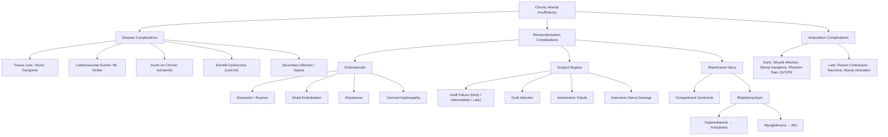

## Complications of Chronic Arterial Insufficiency

Complications of chronic arterial insufficiency can be broadly divided into three categories:

1. **Complications of the disease itself** (progressive ischaemia)
2. **Complications of revascularisation** (endovascular or surgical)
3. **Complications of amputation**

Understanding the pathophysiology behind each complication is what separates exam success from rote memorisation. Let's work through every complication from first principles.

---

### 1. Complications of the Disease Itself

#### 1.1 Progressive Tissue Loss — Ulceration and Gangrene

***Tissue Loss: Ulcers (painful), Gangrene (dry / wet), Pressure areas*** [1]

This is not really a "complication" in the traditional sense — it IS the natural history of untreated chronic arterial insufficiency. However, it is the complication of inadequately managed claudication.

**Pathophysiology**: Fontaine I → II → III → IV is a continuum. As atherosclerosis progresses and collaterals become insufficient, the limb transitions from compensated ischaemia (claudication) to decompensated ischaemia (rest pain) to tissue death (ulceration/gangrene). The transition can be accelerated by:
- Acute thrombosis on a chronic plaque ("acute-on-chronic")
- Progression of multi-level disease
- Intercurrent illness reducing cardiac output (e.g., MI, sepsis, dehydration)
- Minor trauma to the ischaemic foot (the tissue has no reserve to heal)

**Gangrene progression**:
- **Dry gangrene** → coagulative necrosis, mummification. Relatively stable — can auto-amputate if left.
- **Dry → Wet gangrene** → secondary bacterial infection of necrotic tissue → liquefactive necrosis → **surgical emergency** (risk of overwhelming sepsis, gas gangrene from Clostridium)

> ***Delays in amputation of a non-viable extremity can result in infection, myoglobinuria, acute renal failure and hyperkalemia*** [2]. This is because dead muscle releases intracellular contents (K⁺, myoglobin, CK, H⁺) into the systemic circulation — effectively the same mechanism as crush syndrome/rhabdomyolysis.

#### 1.2 Acute-on-Chronic Ischaemia

A patient with stable chronic PAD may suddenly deteriorate if:
- An atherosclerotic plaque **ruptures** → acute thrombosis
- Dehydration or low cardiac output causes **stasis** → thrombosis on an existing stenosis
- An embolic event (e.g., new-onset AF → embolus lodges at a bifurcation)

This converts a chronic picture (collateralised, tolerable) into an **acute limb-threatening emergency**. The presence of pre-existing collaterals may partially protect the limb, but the clinical deterioration can be dramatic.

#### 1.3 Cardiovascular Events — The Major Killer

***Atherosclerosis is a systemic disease*** [1]

This is the single most important "complication" to understand: **patients with PAD die from their hearts and brains, not their legs.**

| Event | Mechanism | Statistics |
|:---|:---|:---|
| **Myocardial infarction** | Shared atherosclerotic disease in coronary arteries. PAD patients have 2–4× higher MI risk. | Leading cause of death in PAD patients |
| **Stroke** | Carotid/cerebrovascular atherosclerosis. | 2nd leading cause of death |
| **Cardiovascular death** | Combined coronary + cerebrovascular + aortic events | 5-year mortality ~30% in symptomatic PAD; up to 50% in CLI |

> This is exactly why the lecture slides emphasise ***Improve Survival: Smoking cessation, Diabetes control, Lipid lowering therapy, Hypertension control, Anti-platelet agents*** [1]. You are treating the patient's cardiovascular mortality risk just as much as (if not more than) their leg.

#### 1.4 Erectile Dysfunction (Leriche Syndrome)

- Specific complication of **aorto-iliac disease**
- Bilateral internal iliac artery stenosis/occlusion → reduced blood supply to the corpus cavernosum via the internal pudendal arteries
- Part of the Leriche syndrome triad: absent femoral pulses + bilateral claudication + **impotence** [3]

#### 1.5 Secondary Infection of Ischaemic Tissue

Chronic ischaemic ulcers and gangrenous tissue are highly susceptible to infection because:
- Reduced blood flow → inadequate delivery of immune cells, antibodies, and antibiotics to the wound
- Impaired wound healing → chronic open wounds serve as portals of entry
- In diabetics: additional immune dysfunction (neutrophil chemotaxis and phagocytosis impaired by hyperglycaemia)

Infections can range from:
- **Cellulitis** (superficial soft tissue)
- **Osteomyelitis** (especially in diabetic foot — probe-to-bone test positive)
- **Necrotising fasciitis** (surgical emergency — rapid tissue destruction along fascial planes)
- **Sepsis** (systemic inflammatory response to uncontrolled local infection)

---

### 2. Complications of Revascularisation

These are divided by modality: **endovascular** and **surgical**.

#### 2.1 Endovascular Complications (PTA ± Stenting)

| Complication | Pathophysiology | Management |
|:---|:---|:---|
| **Arterial dissection** | Balloon inflation tears the intima → blood enters the vessel wall → creates a false lumen → can obstruct true lumen | Stenting to tack down the intimal flap; rarely requires open surgical repair |
| **Arterial rupture** | Balloon over-inflation or vessel wall calcification → perforation | Covered stent-graft deployment; if massive → emergency open repair |
| **Distal embolisation** | Plaque/thrombus fragments dislodged during wire/balloon manipulation → travel distally → occlude small vessels | Aspiration thrombectomy, catheter-directed thrombolysis, or surgical embolectomy. Prevention: distal embolic protection devices |
| **Restenosis** | **Most common late complication**. Neointimal hyperplasia (smooth muscle proliferation in response to intimal injury) → progressive re-narrowing over weeks to months. More common in SFA than iliac stents. | Drug-eluting stents/balloons (paclitaxel) reduce restenosis; repeat PTA; surgical bypass if recurrent |
| **Access site complications** | Femoral artery puncture → haematoma, pseudoaneurysm, AV fistula, retroperitoneal haemorrhage | Manual compression, ultrasound-guided thrombin injection (for pseudoaneurysm), surgical repair if large |
| **Contrast nephropathy** | Iodinated contrast causes direct tubular toxicity + renal vasoconstriction → acute kidney injury (typically peaks at 48–72h post-procedure) | Prevention: pre-hydration with IV saline, minimise contrast volume, avoid nephrotoxic drugs. Treatment: supportive, dialysis if severe. |
| **Contrast allergy** | Type I hypersensitivity to iodinated contrast | Pre-medication with steroids + antihistamines if known allergy; use CO₂ angiography as alternative |

#### 2.2 Surgical Bypass Complications

| Complication | Pathophysiology | Notes |
|:---|:---|:---|
| **Graft failure (early)** | Technical error, **graft kink**, graft thrombosis (inadequate run-off, hypercoagulability) [3] | Occurs within 30 days. Requires urgent re-exploration. |
| **Graft failure (intermediate)** | ***Neointimal hyperplasia*** — smooth muscle proliferation at the anastomotic sites [3] | Occurs 1 month – 2 years. Detected by surveillance duplex. Treated with patch angioplasty or interposition graft. |
| **Graft failure (late)** | ***Atherosclerosis*** — progression of native disease in inflow/outflow vessels or within vein graft itself [3] | Occurs > 2 years. Managed with redo-bypass or endovascular intervention. |
| **Graft infection** | Especially with ***prosthetic grafts*** [3]. Bacteria colonise the graft → biofilm formation → chronic infection that is extremely difficult to eradicate | Devastating complication. May require graft explantation + extra-anatomical bypass through clean tissue planes + prolonged IV antibiotics. |
| **Aortoenteric fistula** | Erosion of an aortic graft (especially aorto-bifemoral) into the overlying duodenum [3] | Presents with "herald bleed" (small GI bleed) → then massive haematemesis. Surgical emergency. |
| **Autonomic nerve damage** | Dissection around the aortic bifurcation can damage the **superior hypogastric plexus** → retrograde ejaculation or erectile dysfunction [3] | Relevant in aorto-bifemoral bypass in males |
| **Embolic complications** | Manipulation of atheromatous aorta → cholesterol crystal embolisation → **renal impairment, ischaemic bowel, spinal cord ischaemia (Adamkiewicz artery), blue toe syndrome** [3] | "Trash foot" — microemboli cause patchy toe ischaemia despite palpable pulses |
| **Ureter injury** | Ureteral injury during retroperitoneal dissection for aortic procedures [3] | Prevent by careful identification; treat by repair over stent |

**Graft surveillance** [3]:
- ***Palpate for patency, auscultate for bruits, serial USG surveillance*** — typically duplex at 1 month, 3 months, 6 months, then annually
- Peak systolic velocity ratio > 3 or absolute velocity > 300 cm/s at a focal point → suggests > 70% stenosis → needs re-intervention before graft thromboses

#### 2.3 Reperfusion Injury

When blood flow is suddenly restored to ischaemic tissue (whether by endovascular or surgical means), a paradoxical cascade of injury occurs. This is one of the most important complications to understand from first principles.

**Pathophysiology of reperfusion injury** [2]:

1. **During ischaemia**: Cells switch to anaerobic metabolism → ATP depletion → failure of Na⁺/K⁺ ATPase pump → cellular swelling → membrane instability → accumulation of hypoxanthine (purine degradation product)
2. **Upon reperfusion**: Oxygen floods back in → xanthine oxidase converts accumulated hypoxanthine to xanthine and then uric acid, generating massive amounts of **reactive oxygen species (ROS / oxygen free radicals)**
3. **ROS cause**:
   - Direct cell membrane damage (lipid peroxidation)
   - Increased capillary permeability → fluid leaks into interstitium → oedema
   - Neutrophil activation and sequestration in microcirculation → further inflammation and microvascular occlusion
4. **Result**: ***Reperfusion injury prolongs the ischaemic interval since it impairs adequate nutrient flow to the tissue despite restoration of axial blood flow*** [2]

This reperfusion injury can manifest as two major complications:

##### A. Compartment Syndrome

***Compartment syndrome*** [1][2][3]:

**Why does it happen after revascularisation?**
- Ischaemic muscle swells after reperfusion (capillary leak from ROS damage)
- Muscle is enclosed within a **non-distensible fascial envelope** [2]
- Swelling raises **intra-compartmental pressure** → when it exceeds capillary perfusion pressure (~30 mmHg) → microvascular blood flow is occluded → further ischaemia → more swelling → vicious cycle
- ***Intracompartmental pressure > 30 mmHg*** is diagnostic [3]
- ***Anterior compartment is most commonly affected*** whereas ***involvement of the posterior compartment is the most functionally devastating*** [2]

**Clinical features** [2][3]:
- ***Pain out of proportion with clinical signs***, worsening with time despite analgesia — this is the earliest and most sensitive sign
- ***Numbness in the distribution of nerves running within the compartment*** — e.g., **numbness in the web space between the 1st and 2nd toes** suggests compression of the **deep peroneal nerve** in the anterior compartment [2]
- ***Tense compartment on passive toe dorsiflexion and plantarflexion*** [3]
- ***Pulses can be present*** — because systolic arterial pressure (SBP) >> intra-compartmental pressure; compartment syndrome is a **microvascular** problem, not a macrovascular one [3]

<Callout title="Pulses Present Does NOT Rule Out Compartment Syndrome" type="error">
A common trap: students and junior doctors assume that palpable pedal pulses exclude compartment syndrome. They don't. SBP is typically 120 mmHg; compartment syndrome occurs at pressures as low as 30 mmHg. The large arteries easily transmit pulsatile flow through the compartment, but the capillaries within the compartment are compressed and cannot perfuse the muscle. Loss of pulse is a very late (and ominous) sign.
</Callout>

**Management**: ***Urgent fasciotomy (medial + lateral incisions)*** [3]
- All compartments of the affected leg must be decompressed (the leg has **4 compartments**: anterior, lateral, superficial posterior, deep posterior)
- Skin incisions are left **open** for re-inspection at 48h
- Delayed primary closure or skin grafting when swelling resolves
- **Prophylactic fasciotomy** should be considered if ischaemia has lasted > 6 hours before revascularisation [2]

##### B. Rhabdomyolysis

***Rhabdomyolysis: Release of K⁺, H⁺ and myoglobin from damaged muscle cells*** [3]

**Why does it happen?**
- Ischaemic and reperfusion-injured muscle undergoes necrosis → cell membranes rupture → intracellular contents flood into the systemic circulation

**What is released?**
| Substance | Consequence |
|:---|:---|
| **K⁺ (Potassium)** | ***Hyperkalemia → cardiac arrhythmia*** [2] (peaked T waves, widened QRS, VF, cardiac arrest) |
| **Myoglobin** | ***Myoglobinuria → acute kidney injury (AKI) by acute tubular necrosis (ATN)*** [2]. Myoglobin precipitates in the renal tubules (especially in acidic urine), causing mechanical obstruction + direct tubular toxicity. |
| **H⁺ (Hydrogen ions)** | **Metabolic acidosis** — from lactic acid and cellular breakdown products |
| **CK (Creatine kinase)** | Marker of muscle injury — diagnostic, not directly harmful |
| **Phosphate** | Hyperphosphataemia → can bind calcium → hypocalcaemia → arrhythmias, tetany |

**Management** [2][3]:
- ***Post-op: monitor BP/P, UO, APTT, RFT, cardiac monitor*** [3]
- ***Aggressive hydration*** (IV normal saline — aim UO > 200 mL/h initially) — to dilute myoglobin and maintain renal perfusion
- ***Diuresis with mannitol*** — osmotic diuretic to flush myoglobin through tubules and reduce compartment pressure
- ***IV bicarbonate to alkalinize the urine*** [2] — myoglobin is less nephrotoxic in alkaline urine (pH > 6.5) because it doesn't precipitate as readily
- **Treat hyperkalaemia urgently**: calcium gluconate (cardioprotection), insulin-dextrose, salbutamol nebuliser, kayexalate, dialysis if refractory
- **ECG monitoring** for arrhythmias

***Complications: Compartment syndrome, Electrolytes / renal failure*** [1]

---

### 3. Complications of Amputation

When revascularisation fails or the limb is not salvageable, amputation becomes necessary. It carries its own set of complications [3]:

#### 3.1 Early Complications

| Complication | Pathophysiology | Management |
|:---|:---|:---|
| **Wound haematoma** | Bleeding from cut surfaces, inadequate haemostasis | Evacuation if expanding; re-exploration if compromising flap |
| **Wound infection / abscess** | Contaminated field (especially if wet gangrene), poor tissue perfusion | Antibiotics, drainage, debridement |
| **Wound dehiscence** | Poor healing (ischaemic tissue), tension on sutures, infection | Revision — may need higher-level amputation |
| **Stump gangrene** | Inadequate perfusion to the stump (amputated too distally for the blood supply available) | ***Mx: higher amputation*** [3] — this is exactly why ***amputation after revascularization*** [1] is the correct sequence |
| ***Phantom limb pain*** | Central sensitisation — the brain's somatosensory cortex retains a "map" of the amputated limb. Peripheral nerve endings at the stump send aberrant signals that the brain interprets as pain from the missing limb. | ***Mx: reassurance, amitriptyline, gabapentin*** [3]. Mirror therapy, TENS. |
| **DVT / PE** | Post-operative immobility + hypercoagulable state (surgical stress response) + loss of calf muscle pump | ***Mx: prophylactic heparin*** [3], early mobilisation, compression stockings on remaining limb |

#### 3.2 Late Complications

| Complication | Pathophysiology | Management |
|:---|:---|:---|
| **Fixed flexion deformity** | Unopposed flexor tone (loss of distal extensors); patient tends to keep stump flexed for comfort → contracture develops | Prevention: physiotherapy, positioning. Treatment: difficult once established. |
| **Osteomyelitis / Osteophyte formation** | Residual infection in bone; bony overgrowth at stump end | Antibiotics (prolonged), debridement; revision amputation if refractory |
| **Stump ulceration** | Pressure from ill-fitting prosthesis, poor tissue quality, ongoing ischaemia | Prosthesis adjustment, wound care, assess for further revascularisation |
| **Stump neuroma** | Cut nerve endings attempt to regenerate → tangled mass of axons (neuroma) at the stump → painful on palpation or pressure | Desensitisation, nerve block, surgical excision with burial of nerve end into muscle/bone |

**Rehabilitation timeline** [3]: Bear weight on contralateral limb by **1 week**, temporary prosthesis by **3 weeks**.

---

### 4. Overview of All Complications — Organised Framework

---

<Callout title="High Yield Summary">

**Disease complications:**
1. Tissue loss (ulcers → gangrene → sepsis) is the natural history of untreated CLI.
2. **Cardiovascular events (MI, stroke)** are the **leading cause of death** — not the leg. Always manage systemic atherosclerosis.
3. Delay in amputating a non-viable limb → infection, myoglobinuria, AKI, hyperkalaemia.

**Revascularisation complications:**
4. **Endovascular**: dissection, rupture, distal embolisation, **restenosis** (most common late complication), contrast nephropathy.
5. **Bypass surgery**: graft failure (kink → neointimal hyperplasia → atherosclerosis), **graft infection** (prosthetic > autologous), aortoenteric fistula, autonomic nerve damage.
6. **Reperfusion injury** → **compartment syndrome** (pain out of proportion, tense compartment, pulses can be present, Mx: urgent fasciotomy) and **rhabdomyolysis** (K⁺/myoglobin release → arrhythmia/AKI, Mx: aggressive hydration, mannitol, IV bicarbonate).

**Amputation complications:**
7. **Early**: stump gangrene (→ higher amputation), phantom limb pain (Mx: amitriptyline/gabapentin), DVT/PE.
8. **Late**: fixed flexion deformity, stump neuroma, stump ulceration.

</Callout>

---

<ActiveRecallQuiz
  title="Active Recall - Complications of Chronic Arterial Insufficiency"
  items={[
    {
      question: "Explain the pathophysiology of reperfusion injury after revascularisation of an ischaemic limb. What two major complications can result?",
      markscheme: "During ischaemia: ATP depletion, hypoxanthine accumulates. Upon reperfusion: oxygen floods in, xanthine oxidase converts hypoxanthine to xanthine/uric acid generating reactive oxygen species (ROS). ROS cause direct cell membrane damage, increased capillary permeability (oedema), neutrophil sequestration in microcirculation. Two major complications: 1. Compartment syndrome (oedema within non-distensible fascial compartment raises pressure above 30 mmHg, compressing capillaries). 2. Rhabdomyolysis (release of K+, H+, myoglobin from necrotic muscle causing hyperkalaemia/arrhythmia and myoglobinuria/AKI).",
    },
    {
      question: "A patient develops severe leg pain 6 hours after femoral-popliteal bypass surgery. The pain is out of proportion to clinical signs and worsening despite analgesia. Pedal pulses are palpable. What is the diagnosis, and why does the presence of pulses NOT exclude it?",
      markscheme: "Compartment syndrome. Pulses are present because SBP (approximately 120 mmHg) is far greater than intra-compartmental pressure (pathological at more than 30 mmHg). Large arteries transmit pulsatile flow through the compartment, but capillaries within the compartment are compressed and cannot perfuse muscle. Pulselessness is a very late and ominous sign. Management: urgent fasciotomy of all 4 compartments.",
    },
    {
      question: "Why is the anterior compartment most commonly affected in post-ischaemic compartment syndrome, and why is the posterior compartment involvement functionally more devastating?",
      markscheme: "Anterior compartment: tightest fascial envelope, least compliant, swells earliest. Contains deep peroneal nerve (numbness in 1st-2nd toe web space is early sign) and anterior tibial artery. Posterior compartment: contains the deep posterior muscles (tibialis posterior, flexor digitorum longus, flexor hallucis longus) and the posterior tibial artery and tibial nerve. Loss of posterior compartment function causes severe plantar flexion weakness, sensory loss of sole, and threatens the main blood supply to the foot.",
    },
    {
      question: "List three stages of bypass graft failure, their timing, and the mechanism at each stage.",
      markscheme: "1. Early (less than 30 days): technical error, graft kink, graft thrombosis from inadequate run-off. 2. Intermediate (1 month to 2 years): neointimal hyperplasia at anastomotic sites (smooth muscle proliferation). 3. Late (more than 2 years): progression of atherosclerosis in native inflow/outflow vessels or within vein graft itself.",
    },
    {
      question: "A PAD patient delays amputation of a non-viable gangrenous limb. What metabolic complications can result, and how should rhabdomyolysis-related AKI be managed?",
      markscheme: "Metabolic complications: infection/sepsis, myoglobinuria leading to AKI (acute tubular necrosis), hyperkalaemia leading to cardiac arrhythmia, metabolic acidosis. Management of rhabdomyolysis-related AKI: aggressive IV hydration (aim UO more than 200 mL/h), IV mannitol (osmotic diuresis to flush myoglobin), IV sodium bicarbonate to alkalinise urine (pH more than 6.5 reduces myoglobin precipitation), treat hyperkalaemia (calcium gluconate, insulin-dextrose, salbutamol, kayexalate, dialysis if refractory), continuous cardiac monitoring.",
    },
  ]}
/>

## References

[1] Lecture slides: WCS 002 - Toe gangrene and leg ulcer - by Prof SWK Cheng.pdf (p2, p4, p14, p18, p27)
[2] Senior notes: felixlai.md (Chronic/Acute arterial insufficiency — Complications: compartment syndrome, rhabdomyolysis, reperfusion injury, delayed amputation)
[3] Senior notes: maxim.md (Chronic limb ischaemia — Complications of bypass surgery, reperfusion injury, compartment syndrome, rhabdomyolysis, amputation complications)
