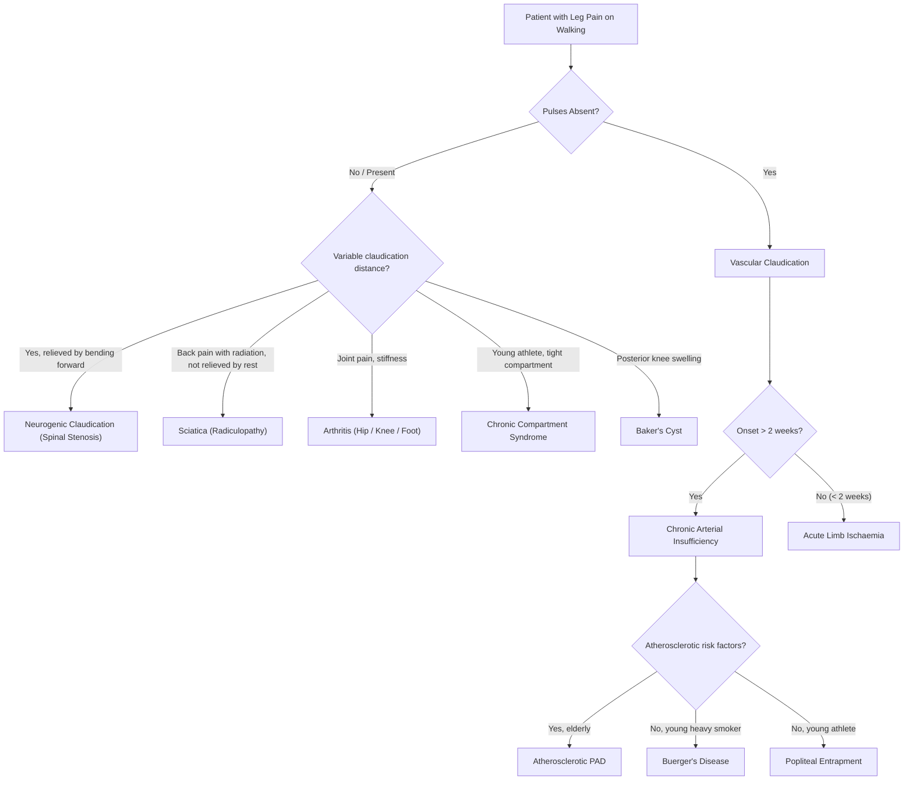

## Differential Diagnosis of Chronic Arterial Insufficiency

The differential diagnosis (DDx) of chronic arterial insufficiency is really about answering two questions in sequence:

1. **Is this truly vascular leg pain, or is something else mimicking it?** (DDx of the *symptom* — especially intermittent claudication and rest pain)
2. **If it is vascular, is it chronic or acute?** (DDx within vascular pathology)

A very common exam pitfall highlighted on the lecture slides: ***Mis-diagnosis of claudication*** and ***Beware of "leg pain"*** [1]. Not all leg pain on walking is claudication. You must systematically consider and exclude the mimics.

---

### 1. Framework for Differential Diagnosis

The best way to organise the DDx is by the **presenting complaint**, because that is how you encounter patients in practice:

---

### 2. Differential Diagnosis of Intermittent Claudication

This is the most commonly tested DDx. The key principle: **true vascular claudication is muscular pain with a fixed, reproducible claudication distance, relieved completely by rest within minutes, with absent pulses on examination.** Any deviation from this pattern should make you think of alternatives [1][2][3].

#### A. Neurogenic Claudication (Spinal Stenosis)

**Why does it mimic claudication?** Lumbar spinal stenosis narrows the spinal canal → the cauda equina nerve roots become compressed, especially during walking when the spine is extended. This produces leg pain on walking that can look remarkably similar to vascular claudication.

**How to tell them apart** — this is a ***classic table from both lecture slides and senior notes*** [3]:

| Feature | ***Vascular Claudication*** | ***Neurogenic Claudication*** |
|:---|:---|:---|
| ***Cause*** | ***Chronic limb ischaemia*** | ***Spinal stenosis*** |
| Nature of pain | Cramping, muscular | Heaviness, weakness, tingling, burning, "jelly legs" |
| ***Radiation of pain*** | ***Distal → proximal*** (starts in calf, may extend to thigh) | ***Proximal → distal*** (starts in back/buttock, radiates down leg) |
| Claudication distance | ***Fixed, reproducible*** | ***Variable*** — better some days, worse others |
| ***Exacerbating factor*** | ***Walking uphill*** (muscles work harder, more O₂ demand) | ***Walking downhill*** (spine extends → canal narrows) |
| ***Relieving factor*** | ***Rest — "Shop window to shop window"*** (standing still is enough) | ***Bending over, sitting — "Park bench to park bench"*** (flexion widens spinal canal) |
| ***Pulse*** | ***Absent*** | ***Present*** |
| Skin changes | ***Atrophic changes*** (hairless, shiny, cool) | Normal skin |
| ***Associations*** | ***Atherosclerotic risk factors*** | ***Only 10% SLR +ve, Back pain*** |

**Why the different exacerbating factors?**
- Walking **uphill** in vascular disease: the calf muscles must generate more force against gravity → higher metabolic demand → ischaemic threshold reached sooner.
- Walking **downhill** in spinal stenosis: going downhill forces the spine into **extension** → the ligamentum flavum buckles inward, the spinal canal narrows → nerve compression worsens. Conversely, going *uphill* tends to flex the spine slightly, which is why neurogenic claudication may paradoxically be *better* uphill.

**Why "shop window" vs "park bench"?**
- Vascular: the patient only needs to stop moving (reducing muscle O₂ demand) → pain resolves in ~5 min → they can walk the *same distance* again before it recurs. They stop every 200m as if window-shopping.
- Neurogenic: simply standing still doesn't help because the spine is still extended. The patient must **sit down** (flexes spine, opens canal) → finds a park bench. Alternatively they lean on a shopping trolley (the "shopping cart sign" — lumbar flexion while walking delays symptoms).

#### B. Sciatica (Lumbosacral Radiculopathy)

***Sciatica: back pain with radiation, not relieved by resting*** [2][3]

- "Sciatica" = "ischiadica" (Greek/Latin) = pain along the sciatic nerve (L4–S1 roots)
- Caused by **nerve root compression**, most commonly from a **herniated (prolapsed) intervertebral disc** at L4/5 or L5/S1 [2]
- Pain is **sharp, burning, or shooting** and radiates down the **posterior or lateral** aspect of the leg in a dermatomal distribution, often to the foot/ankle
- **Key distinguishing feature**: pain is **NOT exercise-dependent** in the same reproducible way as claudication. It may be present at rest, worsened by coughing/sneezing/straining (Valsalva — increases intrathecal pressure), and is **not relieved by simply stopping walking** [2][3]
- Positive **straight leg raise (SLR)** test (Lasègue sign)
- Peripheral pulses are **present**

> The crucial point: in sciatica, the pain pattern does not follow the exercise → rest → exercise cycle of true claudication. The patient may have pain while sitting, lying, or even at night — and standing still doesn't help.

#### C. Arthritis of the Hip or Foot

- **Hip osteoarthritis**: pain localised to the groin/hip, worsened by weight-bearing and movement (not specifically walking a fixed distance), stiffness after rest, reduced range of motion (especially internal rotation)
- **Knee osteoarthritis**: pain over the joint, mechanical locking/giving way, stiffness
- **Foot arthritis** (e.g., hallux rigidus, midfoot OA): localised joint pain on walking
- **Key difference**: joint pain is **localised to the joint**, not a diffuse muscular cramping. Pain may be present even at first step (not after a fixed distance). Pulses are present.

#### D. Chronic Exertional Compartment Syndrome

***Chronic compartment syndrome*** [2]:
- Typically affects ***young heavy-muscled athletes*** — runners, footballers, military recruits
- A **reversible** form of compartment syndrome: during exercise, muscle swelling within a tight fascial compartment raises intra-compartmental pressure → compromises local tissue perfusion → produces pain, tightness, and sometimes paraesthesia
- **Pathophysiology from first principles**: Exercising muscle swells (increased blood flow + oedema). Normally the fascial compartment is compliant enough to accommodate this. In susceptible individuals, the fascia is abnormally tight or the muscle bulk is excessive → pressure rises above capillary perfusion pressure → ischaemic pain
- Pain resolves within minutes of **stopping exercise** (similar to vascular claudication — this can be tricky!)
- **Key differences from vascular claudication**: young, no CV risk factors, **pulses present**, pain is a tight/bursting sensation (not cramping), often bilateral, may have paraesthesia. Definitive diagnosis by **intra-compartmental pressure measurement** during and after exercise.

#### E. Baker's Cyst (Popliteal Cyst)

***Baker's cyst*** [2]:
- A **popliteal synovial cyst** arising from the **gastrocnemius-semimembranosus bursa**
- Usually associated with underlying joint disease (OA, RA, meniscal tears) — synovial fluid from the knee joint tracks posteriorly into the bursa
- Presents with **posterior knee pain, stiffness, and a palpable swelling** behind the knee
- Can mimic claudication if it compresses the popliteal artery or causes posterior knee discomfort on walking
- If the cyst **ruptures**, it can mimic DVT (acute calf pain, swelling — "pseudo-DVT")
- **Key difference**: palpable posterior knee mass, pulses present, associated joint disease, USG confirms cyst

---

### 3. Acute vs Chronic Limb Ischaemia

This is the second critical DDx axis — once you've confirmed the problem is vascular, you must determine the **acuity** [1][3]:

***Acute & chronic occlusion are distinct entities*** [1].

| Feature | Acute Limb Ischaemia | Chronic Arterial Insufficiency |
|:---|:---|:---|
| **Onset** | Sudden (< 2 weeks) [4] | Gradual (> 2 weeks) [3] |
| **Mechanism** | Embolism, acute thrombosis, trauma [1] | Atherosclerosis, vasculitis, entrapment [1] |
| **Collaterals** | Absent → complete ischaemia | Present (had time to develop) → incomplete ischaemia |
| **Clinical features** | 6 P's: Pain, Pallor, Pulseless, Perishingly cold, Paraesthesia, Paralysis [4] | Intermittent claudication → rest pain → tissue loss (gradual progression) |
| **Contralateral limb** | Often normal (if embolic) | Often also affected (systemic atherosclerosis) |
| **Skin changes** | Marble white → mottling (blanchable then fixed) [4] | Chronic trophic changes (hairless, shiny, thickened nails) |
| **Urgency** | Surgical emergency — irreversible damage in 4–6 hours without collaterals [4] | Elective workup in non-critical; urgent in CLI |

> **Why is this distinction so critical?** Because the management is completely different. Acute ischaemia = emergency embolectomy or thrombolysis. Chronic ischaemia = risk factor modification ± elective revascularisation. Missing acute ischaemia (***Delay recognition of acute ischaemia*** [1]) leads to limb loss.

A specific scenario to watch for: **Acute-on-chronic ischaemia** — a patient with pre-existing PAD (chronic) who develops sudden worsening (acute thrombosis on top of a plaque). They may have some collaterals, so the presentation is not as catastrophic as a pure embolus, but they still need urgent assessment.

---

### 4. Differential Diagnosis of Leg Ulcers

When a patient presents with a leg ulcer or tissue loss, the DDx extends beyond pure arterial disease:

| Type | Arterial Ulcer | Venous Ulcer | Neuropathic Ulcer (Diabetic) | Mixed |
|:---|:---|:---|:---|:---|
| **Location** | Pressure points: toes, heel, metatarsal heads | Gaiter area (medial malleolus) | Plantar surface, pressure points | Variable |
| **Pain** | Very painful | Mild aching | **Painless** (neuropathy) | Variable |
| **Appearance** | Punched-out, pale base | Shallow, irregular, sloughy | Deep, may probe to bone | Combination |
| **Surrounding skin** | Pale, atrophic, hairless | Haemosiderin staining, lipodermatosclerosis, eczema | Callus, warm foot, loss of sensation | Mixed features |
| **Pulses** | Absent/reduced | Present | May be present or absent | Reduced |
| **ABPI** | Low (< 0.9) | Normal (0.9–1.3) | May be falsely elevated (> 1.3 due to calcification) [5] | Low |

<Callout title="Diabetic Foot Ulcers — ABPI Pitfall" type="error">
In diabetic patients, **ABPI may be falsely elevated** (> 1.3) because **medial arterial calcification (Mönckeberg's sclerosis)** makes the vessels incompressible. The cuff cannot occlude the calcified vessel, so the measured ankle pressure is artefactually high. In such cases, use ***toe-brachial index (TBI)*** or ***transcutaneous oxygen pressure (TcPO₂)*** instead — digital arteries are usually spared from calcification [5].
</Callout>

Other causes of leg ulcers to consider:
- **Traumatic ulcers**: history of injury, any location
- **Malignant ulcers**: Marjolin's ulcer (SCC arising in a chronic wound/scar), BCC, melanoma — raised/rolled edges, bleeds easily, biopsy any non-healing ulcer
- **Infective ulcers**: tropical ulcers, TB (Bazin's erythema induratum)
- **Vasculitic ulcers**: e.g., rheumatoid vasculitis, pyoderma gangrenosum (IBD-associated)
- **Haematological**: sickle cell disease (common cause of leg ulcers in young Afro-Caribbean patients)

---

### 5. Differential Diagnosis within "Chronic Arterial" Causes

Once you've confirmed chronic arterial ischaemia, you should consider the specific aetiology, because management differs:

| Aetiology | Age/Demographics | Vessel Size | Key Features | Pulses | Angiographic Appearance |
|:---|:---|:---|:---|:---|:---|
| ***Atherosclerosis*** | Elderly, CV risk factors | Large/medium | Most common (> 95%), systemic | Absent at level of disease | Irregular stenoses, calcification |
| ***Buerger's disease*** | ***Young (30–40s), Male, Smokers*** [1] | ***Medium & small*** | ***Pan-arteriitis, lower limb > upper limb, digital ulcers, involves veins too*** | Absent distally | ***"Tree trunk" appearance*** [1] |
| **Behçet's disease** | Young adult, Silk Road populations | Any size | Oral/genital ulcers, uveitis, pathergy, involves arteries AND veins | Variable | Aneurysms, occlusions |
| **Popliteal entrapment** | Young, athletic, muscular | Popliteal artery | No CV risk factors, symptoms provoked by plantarflexion | Absent on provocation | Compression/occlusion of popliteal with provocative manoeuvres |
| **Fibromuscular dysplasia** | Young women | Medium (renal, carotid) | Non-atherosclerotic, "string of beads" on angiography | Variable | Alternating stenoses and dilations |
| **Radiation arteritis** | Any age with radiation hx | Field of radiation | History of radiotherapy, can present years later | Absent in field | Focal stenosis in radiation field |

---

### 6. Common Pitfalls in Differential Diagnosis

***Arterial Diseases: Common Pitfalls*** [1]:

> - ***Mis-diagnosis of claudication*** — calling neurogenic or arthritic pain "claudication"
> - ***Toe amputation before revascularization*** — treating the end-organ (gangrene) without fixing the cause (arterial inflow)
> - ***Delay recognition of acute ischaemia*** — calling acute ischaemia "chronic" and not treating urgently
> - ***Beware of "leg pain"*** — not all leg pain is vascular; think systematically
> - ***"Treating the angiogram" — intervention for asymptomatic disease*** — finding a stenosis on imaging does not mean it needs fixing if the patient is asymptomatic (Fontaine I)

<Callout title="'Treating the Angiogram'" type="error">
This is a critical concept: just because you see a narrowed artery on imaging does **not** mean you should intervene. Many patients have significant anatomical stenoses but adequate collateral circulation and no symptoms. Intervention carries risk (dissection, embolisation, restenosis). Only intervene for **symptomatic** disease — disabling claudication that fails conservative management, or critical limb ischaemia. ***Never treat the angiogram — treat the patient.*** [1]
</Callout>

---

### 7. Summary of the Systematic DDx Approach

When faced with a patient with leg pain or tissue loss, work through this checklist:

| Step | Question | How to Answer |
|:---|:---|:---|
| 1 | Is this vascular? | Pulses, ABPI, trophic changes, Buerger's test |
| 2 | Is it acute or chronic? | Onset < or > 2 weeks, presence of collaterals, chronicity of skin changes |
| 3 | If chronic vascular, what level? | Symptom location (buttock/thigh = aortoiliac; calf = femoropopliteal; foot = distal) |
| 4 | If chronic vascular, what aetiology? | Age, risk factors (atherosclerosis vs Buerger's vs entrapment) |
| 5 | If not clearly vascular, what mimic? | Neurogenic claudication, sciatica, arthritis, compartment syndrome, Baker's cyst |
| 6 | If tissue loss, what type of ulcer? | Location, pain, surrounding skin, pulses, ABPI |

---

<Callout title="High Yield Summary">

1. **Most important DDx of intermittent claudication**: neurogenic claudication (spinal stenosis), sciatica, hip/knee arthritis, chronic compartment syndrome, Baker's cyst.
2. **Vascular vs neurogenic claudication**: Fixed distance vs variable; rest relieves vs flexion relieves; absent pulses vs present; "shop window" vs "park bench"; uphill worse vs downhill worse.
3. **Sciatica**: back pain radiating down leg, dermatomal, NOT relieved by rest, positive SLR, pulses present.
4. **Acute vs chronic**: < 2 weeks = acute (emergency), > 2 weeks = chronic; acute lacks collaterals and presents with 6 P's.
5. **Lecture slides pitfalls**: mis-diagnosis of claudication, toe amputation before revascularisation, delay recognition of acute ischaemia, "treating the angiogram."
6. **Leg ulcer DDx**: arterial (painful, pressure points, absent pulses) vs venous (gaiter area, haemosiderin) vs neuropathic/diabetic (painless, plantar, may have falsely elevated ABPI).
7. **Within chronic arterial causes**: atherosclerosis (elderly, CV risk factors) vs Buerger's (young male smoker, small vessels, "tree trunk") vs popliteal entrapment (young athlete, no risk factors).

</Callout>

---

<ActiveRecallQuiz
  title="Active Recall - DDx of Chronic Arterial Insufficiency"
  items={[
    {
      question: "List five common pitfalls in arterial disease management as highlighted on the lecture slides.",
      markscheme: "1. Mis-diagnosis of claudication. 2. Toe amputation before revascularisation. 3. Delay recognition of acute ischaemia. 4. Beware of 'leg pain' (not all is vascular). 5. 'Treating the angiogram' — intervention for asymptomatic disease.",
    },
    {
      question: "A 60-year-old man has leg pain on walking that varies in distance day-to-day. He finds relief by sitting on a bench or bending forward. He has palpable foot pulses. What is the most likely diagnosis, and why is this NOT vascular claudication?",
      markscheme: "Neurogenic claudication due to spinal stenosis. Not vascular because: variable claudication distance (vascular is fixed/reproducible), relieved by spinal flexion not just rest, pulses present, no trophic changes.",
    },
    {
      question: "Explain why walking downhill worsens neurogenic claudication but walking uphill worsens vascular claudication.",
      markscheme: "Downhill: spine extends, ligamentum flavum buckles inward, spinal canal narrows further, compressing cauda equina. Uphill: calf muscles work harder against gravity, increasing O2 demand beyond what the stenosed artery can deliver, causing ischaemic pain.",
    },
    {
      question: "A diabetic patient has a foot ulcer and an ABPI of 1.4. Does this exclude arterial disease? Why or why not, and what investigation should be done instead?",
      markscheme: "No — ABPI may be falsely elevated in DM due to medial arterial calcification (Monckeberg sclerosis) making vessels incompressible. Use toe-brachial index (TBI) or transcutaneous oxygen pressure (TcPO2) instead, as digital arteries are usually spared from calcification.",
    },
    {
      question: "Differentiate acute from chronic limb ischaemia in terms of: onset, collateral presence, clinical presentation, and urgency of management.",
      markscheme: "Acute: onset < 2 weeks, no collaterals (complete ischaemia), 6 P's (pain, pallor, pulseless, perishingly cold, paraesthesia, paralysis), surgical emergency (irreversible damage in 4-6h). Chronic: onset > 2 weeks, collaterals present (incomplete ischaemia), intermittent claudication progressing to rest pain and tissue loss, elective workup unless CLI.",
    },
  ]}
/>

## References

[1] Lecture slides: WCS 002 - Toe gangrene and leg ulcer - by Prof SWK Cheng.pdf (p2, p3, p7, p8, p22, p28)
[2] Senior notes: felixlai.md (Chronic arterial insufficiency — Etiology, DDx of intermittent claudication)
[3] Senior notes: maxim.md (Chronic limb ischaemia — DDx, History taking, Vascular vs neurogenic claudication table)
[4] Senior notes: felixlai.md (Acute arterial insufficiency — 6 P's, clinical manifestation); maxim.md (Acute limb ischaemia)
[5] Senior notes: maxim.md (Diabetic foot ulcers — ABPI pitfall, TcPO₂)
