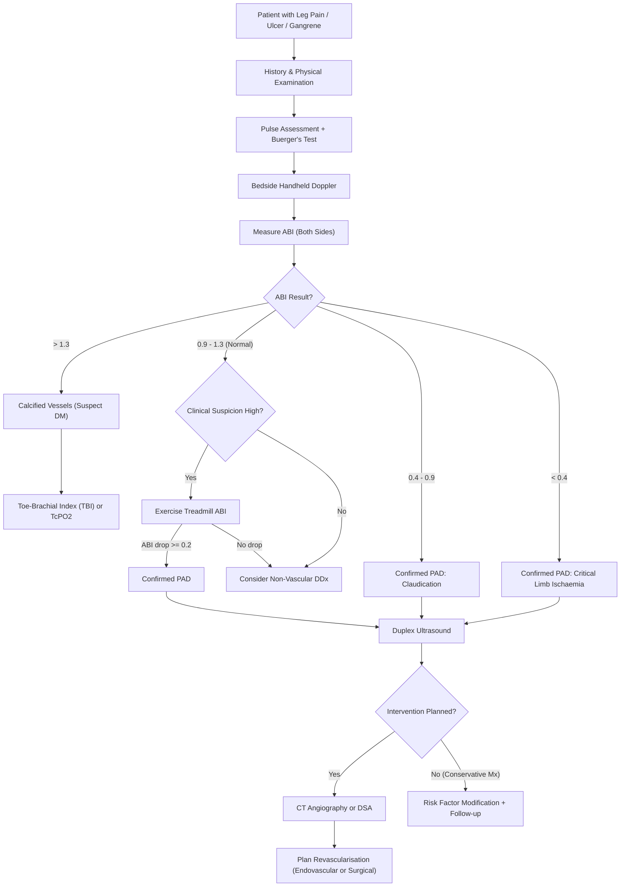

## Diagnostic Criteria, Algorithm & Investigations for Chronic Arterial Insufficiency

### 1. Diagnostic Criteria — How Do We "Diagnose" Chronic Arterial Insufficiency?

Unlike conditions such as rheumatic fever or SLE, there is no formal point-based diagnostic criterion set for chronic arterial insufficiency. Instead, the diagnosis is made by combining **three pillars**:

1. **Clinical history and examination** — the foundation
2. **Haemodynamic confirmation** — primarily the Ankle-Brachial Index (ABI)
3. **Anatomical localisation** — imaging to define the level, length, and severity of disease for treatment planning

The lecture slides frame this beautifully as a systematic ***Clinical Evaluation*** checklist [1]:

> ***Does the patient have arterial disease? Acute or chronic? How severe? Where is the obstruction? Why?*** [1]

Let's unpack each:

| Question | How to Answer |
|:---|:---|
| **Does the patient have arterial disease?** | History (claudication, rest pain, tissue loss), examination (absent pulses, trophic changes, Buerger's test), confirmed by ABI |
| **Acute or chronic?** | Onset < 2 weeks = acute; > 2 weeks = chronic. Chronic has trophic changes and collaterals. |
| **How severe?** | Fontaine/Rutherford staging + ABI value + presence of tissue loss |
| **Where is the obstruction?** | Symptom localisation + pulse assessment + duplex USG + angiography |
| **Why?** | Risk factor profile (atherosclerosis vs Buerger's vs entrapment) |

---

### 2. Diagnostic Severity Criteria — ABI Thresholds

The **ABI** is the cornerstone objective test that both **confirms the diagnosis** and **quantifies severity** [1][2][3].

| ABI Value | Interpretation | Pathophysiological Basis |
|:---|:---|:---|
| **> 1.3** | ***Calcified (non-compressible) artery*** — falsely elevated [2][3] | Mönckeberg's medial calcification (especially in DM) makes the vessel rigid → cuff cannot compress it → artefactually high reading |
| **> 0.9 – ≤ 1.3** | ***Normal*** [2][3] | Ankle systolic pressure is normally equal to or slightly higher than brachial (pulse wave amplification in peripheral arteries) |
| **0.4 – ≤ 0.9** | ***Claudication*** — arterial obstruction associated with intermittent claudication [2][3] | Stenosis reduces distal perfusion pressure, but still sufficient at rest for tissue viability |
| **< 0.4** | ***Critical limb ischaemia*** — associated with rest pain, non-healing ulceration, gangrene [2][3] | Severe multi-level disease; perfusion pressure at rest is below the threshold needed to maintain tissue viability |

<Callout title="ABI Does Not Rule Out Disease When Normal" type="error">
***Normal ABI values may present with intermittent claudication*** [3]. How? In early/mild disease, collaterals maintain resting perfusion pressure at near-normal levels. The stenosis only becomes haemodynamically significant during exercise when flow demand increases. This is why an **exercise treadmill test** is needed when the clinical suspicion is high but resting ABI is normal [2].
</Callout>

**Criteria for a positive exercise ABI test** [2]:
- Patient walks on treadmill until symptoms reproduced
- ABI is measured before and immediately after exercise
- A **decrease in ABI of ≥ 0.2** (or an absolute post-exercise ABI < 0.9) confirms exercise-induced ischaemia

---

### 3. Diagnostic Algorithm

**Key logic points in this algorithm:**

1. **ABI first** — it is cheap, bedside, non-invasive, and answers "does this patient have PAD?" for > 95% of cases.
2. **Exercise ABI** — for the borderline/normal resting ABI with convincing clinical history. Think of it as a "stress test for the legs."
3. **Duplex USG** — the first-line *imaging* investigation to localise the disease anatomically.
4. ***Arteriography is indicated ONLY when surgery is planned — NOT used for diagnosis*** [1]. This is a critical lecture slide point.
5. **TBI/TcPO₂** — for diabetics with falsely elevated ABI.

---

### 4. Investigation Modalities — Detailed Breakdown

#### 4.1 Non-Invasive Vascular Laboratory

***The Non-invasive VASCULAR LABORATORY*** [1]:
- ***Ultrasound based***
- ***Segmental pressure***
- ***Waveform analysis***
- ***Ankle-brachial index (ABI)***
- ***Exercise test*** [1]

##### A. Ankle-Brachial Index (ABI / ABPI)

**What it is**: The ratio of the highest ankle systolic pressure to the highest brachial systolic pressure.

***ABI = Ankle systolic pressure ÷ Arm systolic pressure*** [1]

**How to measure** [2][3]:
1. Patient supine, rested for 10 minutes (eliminates exercise effect)
2. **Brachial pressure**: BP cuff on arm, handheld Doppler probe over brachial artery. Inflate cuff until signal is obliterated → slowly deflate → record pressure at which signal returns (systolic). Measure **both arms** — use the **higher** value as denominator (to account for possible subclavian stenosis)
3. **Ankle pressure**: BP cuff around the **lower calf** (NOT the ankle itself — common mistake). Doppler probe over the **posterior tibial** artery and then the **dorsalis pedis** artery. Measure both → use the **higher** value as numerator for that side
4. Calculate separately for left and right legs

**Why does this work from first principles?**
- In a normal person, as blood travels from the aorta to the periphery, the systolic pressure actually *increases* slightly (pulse wave amplification due to progressive narrowing and wave reflection). So the ankle pressure should be ≥ brachial pressure → ABI ≥ 1.0.
- A stenosis acts as a resistance → pressure drops across it (Poiseuille's law: ΔP ∝ resistance). The more severe the stenosis, the lower the downstream pressure → lower ABI.

**Interpretation** (as per table above):

> **ABI < 0.9 = diagnostic of PAD** (sensitivity ~95%, specificity ~99% for angiographically confirmed > 50% stenosis) [6]

##### B. Segmental Pressures

**What**: BP cuffs placed at multiple levels (upper thigh, above knee, below knee, ankle) to identify the *level* of occlusion.
- A pressure drop of **> 20 mmHg** between adjacent segments indicates a significant stenosis in the intervening arterial segment.

***Major Levels of Arterial Occlusion — Segmental pressures*** [1]:

| Level | Aortoiliac | Femoropopliteal | Distal |
|:---|:---|:---|:---|
| ***Segmental pressures (example from slides)*** | ***140, 140*** | ***120, 60*** | ***50, 50*** |

These numbers from the lecture slide [1] illustrate:
- **Aortoiliac**: both thigh pressures ~140 (normal). No drop at this level.
- **Femoropopliteal**: pressure drops from 120 (above knee) to 60 (below knee) — a huge > 20 mmHg drop → stenosis in the SFA/popliteal segment.
- **Distal**: stays at ~50 at the ankle — no additional major drop below the knee, but the absolute pressure is critically low.

##### C. Doppler Waveform Analysis

***Doppler Velocity Waveforms*** [1]

**Normal arterial flow is triphasic** [2][3]:
1. **Phase 1** (systolic forward flow): a tall, sharp peak — blood is pushed forward by ventricular systole
2. **Phase 2** (early diastolic reversal): a brief period of retrograde flow — elastic recoil of the arterial wall plus high peripheral vascular resistance causes a transient reversal
3. **Phase 3** (late diastolic forward flow): a small forward flow component — as the aortic valve closes and elastic recoil settles, there's a tiny antegrade blip before the next systole

**Abnormal waveforms in PAD**:
- **Biphasic**: loss of phase 3 (early disease or moderate stenosis). The diastolic reversal is blunted.
- **Monophasic**: loss of both phase 2 and 3 (severe stenosis/occlusion). Continuous forward flow — because the peripheral resistance downstream is so low (maximally dilated arterioles trying to compensate) that there is never any reversal.

> ***Normal arterial flow waveform should be triphasic and either monophasic or biphasic waveforms are abnormal*** [2]

<Callout title="Why Does Severe Stenosis Produce Monophasic Flow?">
Downstream of a critical stenosis, the arterioles are maximally vasodilated (autoregulatory compensation to maintain tissue perfusion). This dramatically reduces peripheral vascular resistance. With low resistance, there is continuous forward flow even in diastole — hence the monophasic "low resistance" pattern. The loss of the reversal phase tells you the vascular bed is "open" and begging for blood.
</Callout>

##### D. Toe-Brachial Index (TBI) & Transcutaneous Oxygen Pressure (TcPO₂)

Used when ABI is **unreliable** (> 1.3 = calcified vessels, especially in DM) [3][5]:

| Investigation | Method | Normal | Abnormal | Why It Works |
|:---|:---|:---|:---|:---|
| **TBI** | Small cuff on great toe + photoplethysmography | > 0.7 | < 0.7 = PAD; < 0.3 = CLI | Digital arteries are **spared from medial calcification** → compressible → accurate pressure measurement |
| ***TcPO₂*** | Electrode on dorsum of foot measures transcutaneous O₂ | > 60 mmHg | ***> 30 mmHg = good wound healing potential; < 30 mmHg = poor healing*** [5] | Directly measures O₂ delivery to the skin, bypassing the problem of incompressible arteries altogether |

##### E. Exercise Treadmill Test

**Indication** [2]:
- Classical history of intermittent claudication or atypical extremity pain BUT **normal ABI at rest**

**Protocol**:
- Patient walks on a treadmill at a standardised speed (usually 3.2 km/h) at 10–12% incline
- ABI measured before and immediately after exercise
- **Positive** = ABI drop ≥ 0.2 from baseline [2]

**Why does exercise unmask disease?**
- At rest, collaterals are sufficient → normal ABI. During exercise, working muscles demand massively increased blood flow. The stenosed artery cannot increase flow to meet demand → pressure drops distal to the stenosis → ABI falls. It's the same principle as a cardiac exercise stress test for coronary artery disease.

---

#### 4.2 Imaging Investigations

##### A. Duplex Ultrasound (First-Line Imaging)

***Duplex Ultrasound*** [1]

***Duplex USG = B-mode USG + Doppler*** [2][3]:
- **B-mode** (brightness mode): provides a real-time 2D anatomical image of the vessel — you can see plaque, thrombus, vessel diameter
- **Doppler**: measures blood flow velocity. At a stenosis, velocity increases (Bernoulli principle — flow through a narrowing accelerates, like water through a garden hose nozzle). A **peak systolic velocity ratio > 2** across a lesion indicates > 50% stenosis; **> 4** indicates > 75% stenosis.

**Advantages** [3]:
- Non-invasive, no radiation, no contrast, bedside, repeatable
- **Locates the level of obstruction** and **quantifies severity**
- Can assess both inflow (aortoiliac) and outflow (femoropopliteal, tibial) vessels

**Limitations** [3]:
- **Operator-dependent** — quality varies with sonographer experience
- ***Poor image for aortoiliac segment*** [3] — overlying bowel gas obscures deep abdominal vessels
- Cannot easily image heavily calcified vessels
- Limited for planning complex surgical procedures (insufficient anatomical road-mapping)

##### B. CT Angiography (CTA)

- **What**: IV contrast injection with thin-cut helical CT → 3D reconstruction of the arterial tree
- ***Less invasive alternative to DSA*** [3]
- **Advantages**: rapid, widely available, excellent spatial resolution, shows vessel wall (calcification, plaque morphology), simultaneous assessment of surrounding anatomy
- **Limitations**:
  - ***Contrast allergy / nephropathy*** [3] — must check renal function (eGFR) and allergy history before contrast administration. Pre-hydration with IV saline ± N-acetylcysteine for renal protection if eGFR borderline.
  - **Radiation dose**
  - Heavy calcification can obscure lumen assessment (blooming artefact)
- **No significant difference in accuracy between CTA and MRA** [2]

##### C. MR Angiography (MRA)

- **What**: uses gadolinium contrast (or time-of-flight techniques without contrast) to image vessels
- ***Avoids exposure to ionizing radiation and minimal risk of contrast nephropathy*** [2] — however, gadolinium is contraindicated in **severe renal impairment** (eGFR < 30) due to risk of **nephrogenic systemic fibrosis (NSF)**
- ***Rarely done*** in routine PAD workup [3] — reserved for patients with iodinated contrast allergy, borderline renal function, or when CTA is equivocal
- Limitations: overestimates degree of stenosis, cannot image calcification well, slow, expensive, contraindicated with certain metallic implants

##### D. Digital Subtraction Angiography (DSA) — The Gold Standard

***Arteriography: Indicated ONLY when surgery is planned — NOT used for diagnosis*** [1]

***Digital subtraction angiography (DSA): gold standard*** [2][3]

**What it is**: A catheter (usually inserted via the common femoral artery under local anaesthesia) is advanced to the target arterial segment. Radio-opaque contrast is injected while serial X-ray images are taken. The computer digitally "subtracts" the pre-contrast image (bone, soft tissue) from the post-contrast image, leaving **only the contrast-filled arterial lumen** visible [2].

**Why is it the gold standard?**
- **Highest spatial resolution** of any imaging modality
- **Real-time** assessment: you can see flow dynamics
- ***Can be done intra-op: guides endovascular intervention*** [3] — this is the key advantage. The diagnostic study and the therapeutic intervention (angioplasty, stenting) can be done **in the same session**
- Provides the definitive "road map" for surgical planning

**Indications** [1][2][3]:
- ***Indicated ONLY in patients with planned intervention*** such as angioplasty and stenting [1][2]
- Never performed "just to see" or to confirm a diagnosis — the ABI + duplex are sufficient for that
- This is exactly the pitfall: ***"Treating the angiogram" — intervention for asymptomatic disease*** [1] — don't do a DSA unless you're ready to act on it

**Complications** [2][3]:
- ***Contrast/drug allergy***
- ***Contrast nephropathy*** (iodinated contrast → direct tubular toxicity + renal vasoconstriction)
- ***Arterial injury***: dissection, pseudoaneurysm formation, haematoma at puncture site
- ***Distal embolisation*** (dislodge plaque/thrombus during catheter manipulation)
- Local infection at puncture site

***Arteriography: Aortoiliac disease*** [1] — the slides show an angiogram demonstrating aortoiliac stenosis, illustrating the "road map" concept for surgical planning.

---

#### 4.3 Adjunctive / Baseline Investigations

These are not specific to diagnosing PAD, but are essential in the workup because ***atherosclerosis is a systemic disease*** [1]:

| Investigation | Rationale |
|:---|:---|
| **CBC with differentials** | Polycythaemia (↑ viscosity → worsens ischaemia), anaemia (reduces O₂ delivery), thrombocytosis |
| **Clotting profile** | Baseline before any anticoagulation or intervention |
| **Renal function tests (RFT)** | Baseline creatinine/eGFR before contrast administration (contrast nephropathy risk) [2] |
| **Fasting glucose / HbA1c** | Screen/monitor diabetes — major risk factor and affects prognosis |
| **Fasting lipid profile** | Assess dyslipidaemia — guides statin therapy |
| **Arterial blood gas (ABG)** | Look for lactic acidosis (in acute/severe ischaemia suggesting tissue hypoxia) [2] |
| **Serum CK** | Rhabdomyolysis screening (more relevant in acute ischaemia, but check if severe chronic disease with tissue necrosis) [2] |
| **Cardiac enzymes (Troponin)** | If suspecting concurrent AMI — remember systemic atherosclerosis [2] |
| **ECG** | Screen for AF (embolic source), LVH (hypertension), ischaemic changes [2] |
| **Echocardiogram** | If embolic source suspected (mural thrombus, valvular heart disease) [2] |
| **CXR** | Cardiac silhouette, mediastinal width (aortic dissection), pulmonary disease |
| **Urine multistix** | Screen for glycosuria (DM) and proteinuria (renal disease) [3] |
| ***XR foot & ankle*** | If tissue loss — assess for osteomyelitis (especially in diabetic foot) [5] |

---

### 5. Summary: Investigation Hierarchy

| Tier | Investigation | Purpose | When |
|:---|:---|:---|:---|
| **1st line** | ABI (± exercise ABI) | Confirm diagnosis + severity | Every patient with suspected PAD |
| **1st line** | Segmental pressures + Doppler waveforms | Localise level + characterise flow | Part of vascular lab workup |
| **2nd line** | Duplex USG | Anatomical localisation, quantify stenosis | All confirmed PAD, initial imaging |
| **2nd line** | TBI / TcPO₂ | When ABI unreliable (DM, calcified) | Diabetic patients, ABPI > 1.3 |
| **3rd line** | CTA | Detailed anatomical road map | When intervention is being considered |
| **3rd line (rarely)** | MRA | Same as CTA, but avoid iodinated contrast | Contrast allergy, borderline renal function |
| **Gold standard** | ***DSA*** | ***Definitive road map + therapeutic in same session*** | ***ONLY when intervention is planned*** |

<Callout title="Key Exam Points on Investigations">

1. **ABI < 0.9** confirms PAD. **ABI < 0.4** = critical limb ischaemia.
2. **ABI > 1.3** = calcified vessels → use TBI or TcPO₂ instead (especially in DM).
3. **Normal resting ABI does NOT exclude PAD** — use exercise treadmill test if clinical suspicion is high.
4. **Duplex USG** is the first-line imaging modality — non-invasive, locates obstruction, quantifies severity.
5. ***Arteriography (DSA) is indicated ONLY when surgery/intervention is planned — NOT for diagnosis*** [1].
6. **Normal arterial Doppler flow is triphasic**; monophasic = severe disease.

</Callout>

---

<Callout title="High Yield Summary">

- **Diagnosis is clinical + haemodynamic (ABI) + anatomical (imaging).**
- ***Clinical Evaluation framework***: Does the patient have arterial disease? Acute or chronic? How severe? Where? Why? [1]
- **ABI interpretation**: > 1.3 = calcified; 0.9–1.3 = normal; 0.4–0.9 = claudication; < 0.4 = CLI.
- **Exercise ABI**: drop ≥ 0.2 confirms exercise-induced ischaemia when resting ABI is normal.
- **Segmental pressures**: > 20 mmHg drop between segments = significant stenosis at that level.
- **Doppler waveforms**: triphasic = normal; biphasic = moderate disease; monophasic = severe.
- **Duplex USG**: first-line imaging, non-invasive, operator-dependent, poor for aortoiliac.
- **CTA**: for pre-intervention planning; watch for contrast nephropathy and allergy.
- ***DSA***: gold standard, ONLY for planned intervention, can be therapeutic (intra-op).
- **TBI/TcPO₂**: essential in diabetics with falsely elevated ABI from vessel calcification.
- **Adjuncts**: ECG (AF, ischaemia), bloods (renal function before contrast, glucose, lipids, CBC), CXR.

</Callout>

---

<ActiveRecallQuiz
  title="Active Recall - Diagnosis & Investigations of Chronic Arterial Insufficiency"
  items={[
    {
      question: "How is ankle-brachial index measured? Which ankle and arm pressure values do you use?",
      markscheme: "Ankle: higher of posterior tibial or dorsalis pedis systolic pressure (measured by Doppler over artery with cuff on lower calf). Arm: higher of left or right brachial systolic pressure. ABI = ankle pressure divided by arm pressure. Measured on each side separately.",
    },
    {
      question: "A patient has a resting ABI of 1.0 but convincing claudication symptoms. What is the next investigation and what result would confirm PAD?",
      markscheme: "Exercise treadmill ABI test. A drop in ABI of 0.2 or more (or absolute post-exercise ABI below 0.9) confirms exercise-induced ischaemia. Normal resting ABI does not exclude PAD because collaterals can maintain resting perfusion pressure.",
    },
    {
      question: "Why is ABI unreliable in diabetic patients and what alternatives should be used?",
      markscheme: "Diabetic patients often have medial arterial calcification (Monckeberg sclerosis), making vessels incompressible, giving falsely elevated ABI (often more than 1.3). Alternatives: toe-brachial index (TBI - digital arteries spared from calcification, normal more than 0.7) or transcutaneous O2 pressure (TcPO2 - more than 30 mmHg suggests good wound healing potential).",
    },
    {
      question: "Describe the three phases of a normal triphasic arterial Doppler waveform and explain why severe stenosis produces monophasic flow.",
      markscheme: "Phase 1: systolic forward flow (tall peak). Phase 2: early diastolic reversal (brief retrograde flow due to elastic recoil and high peripheral resistance). Phase 3: late diastolic forward flow (small forward blip). Severe stenosis causes maximal arteriolar dilation downstream (autoregulatory compensation), reducing peripheral resistance, resulting in continuous forward flow without reversal - hence monophasic.",
    },
    {
      question: "State the key indication and the main contraindication for performing digital subtraction angiography in PAD.",
      markscheme: "Indication: ONLY when intervention (angioplasty, stenting, bypass) is planned - not for diagnosis. Main contraindication considerations: contrast allergy, contrast nephropathy (check renal function), risk of arterial injury (dissection, pseudoaneurysm, embolisation). The key principle is 'arteriography is not used for diagnosis.'",
    },
    {
      question: "List the five components of the non-invasive vascular laboratory as described on the lecture slides.",
      markscheme: "1. Ultrasound based (duplex USG). 2. Segmental pressure. 3. Waveform analysis. 4. Ankle-brachial index (ABI). 5. Exercise test.",
    },
  ]}
/>

## References

[1] Lecture slides: WCS 002 - Toe gangrene and leg ulcer - by Prof SWK Cheng.pdf (p7, p8, p9, p10, p12, p14)
[2] Senior notes: felixlai.md (Chronic arterial insufficiency — Diagnosis: ABI, exercise treadmill, biochemical tests, radiological tests)
[3] Senior notes: maxim.md (Chronic limb ischaemia — Investigations: ABPI, Duplex USG, CTA, MRA, DSA)
[5] Senior notes: maxim.md (Diabetic foot ulcers — TcPO₂, ABPI pitfall in DM)
[6] Lecture slides: GC 234. Common Foot and Ankle Conditions.pdf (p108 — ABI calculation and interpretation)
