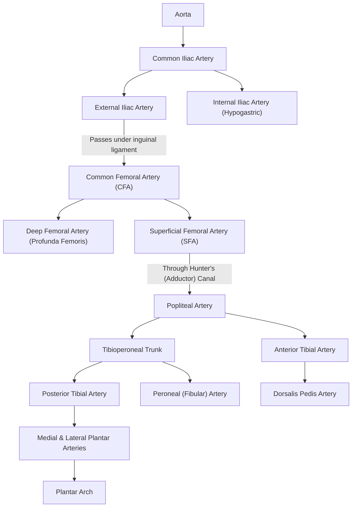
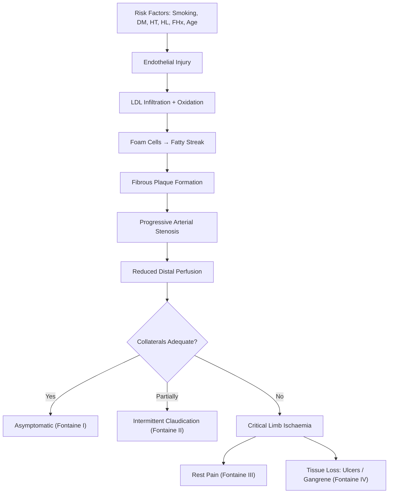

# Chronic Arterial Insufficiency

## 1. Definition

Chronic arterial insufficiency (also called chronic limb ischaemia or peripheral arterial disease, PAD) is defined as a **gradual reduction in limb perfusion** — developing over **more than 2 weeks** — that threatens limb viability or impairs function [1][2][3].

The key conceptual distinction from *acute* limb ischaemia is **time**: the chronicity allows the body to mount a compensatory response (collateral vessel formation), which is why patients may walk a surprising distance before symptoms appear. However, once the disease progresses beyond the compensatory capacity of collaterals, the limb enters a state of **critical limb ischaemia (CLI)** — a clinical emergency where the tissue is at imminent risk of death.

> Think of it this way: arteries are pipes. Chronic arterial insufficiency is a slowly rusting pipe that gradually narrows. The body tries to build detour pipes (collaterals), but eventually the demand outstrips supply.

***Acute & chronic occlusion are distinct entities*** [1].

The condition is broadly subdivided into:
- **Non-critical limb ischaemia**: manifests as **intermittent claudication** (IC) — the limb is not immediately threatened
- **Critical limb ischaemia (CLI)**: manifests as ***rest pain, tissue loss (ischemic ulcers), or gangrene*** — the limb is at risk [1][2][3]

<Callout title="What does 'claudication' mean?">
"Claudicatio" is Latin for "to limp." Emperor Claudius himself was named for his limp. Intermittent claudication = intermittent limping due to muscle pain on walking, relieved by rest.
</Callout>

---

## 2. Epidemiology

### Global & Hong Kong Context
- PAD affects approximately **200 million people** worldwide.
- Prevalence increases sharply with age: ~3–10% in the general population, rising to **15–20% in those aged > 70**.
- In **Hong Kong**, the ageing population and high prevalence of diabetes mellitus (affecting ~10% of adults), hypertension, and historically high rates of male smoking make PAD a significant and growing clinical burden.
- PAD patients have **2–3× increased cardiovascular mortality** — most die of MI or stroke, not limb loss. ***Atherosclerosis is a systemic disease*** [1].
- Only ~5–10% of patients with intermittent claudication progress to CLI over 5 years, but those who do face a 1-year major amputation rate of ~25% and 1-year mortality of ~25%.

### Key Epidemiological Points
- **Male:Female ratio** ≈ 2:1, though narrows after menopause.
- The **superficial femoral artery (SFA)** is the single most commonly affected segment (~70% of symptomatic PAD) [2][3].
- Aorto-iliac disease accounts for ~30% [1][3].
- Diabetics develop more **distal (infrapopliteal) disease**, making reconstruction harder.

---

## 3. Risk Factors

***Atherosclerotic Occlusive Disease: Risk Factors — Smoking, Diabetes mellitus, Hypertension, Hyperlipidemia, Family history*** [1].

| Risk Factor | Mechanism / Notes |
|:---|:---|
| **Smoking** | **Single most important modifiable risk factor.** Nicotine causes endothelial damage, promotes thrombosis (↑ fibrinogen, ↑ platelet aggregation), ↑ LDL oxidation, vasoconstriction. Risk of PAD is **3–4× higher** in smokers. Dose-dependent. |
| **Diabetes mellitus** | Accelerates atherosclerosis via advanced glycation end-products (AGEs) damaging endothelium, promotes small-vessel disease (microangiopathy), neuropathy masks pain → late presentation. DM doubles the risk of PAD and is particularly associated with **distal (below-knee)** disease. |
| **Hypertension** | Chronically elevated shear stress damages endothelium → facilitates lipid infiltration and plaque formation. |
| **Hyperlipidaemia** | ↑ LDL cholesterol is directly atherogenic (oxidised LDL → foam cells → fatty streak → plaque). |
| **Family history** | Genetic predisposition to lipid disorders, endothelial dysfunction, pro-thrombotic states. |
| Age > 65 | Cumulative exposure to risk factors; natural arterial stiffening and endothelial senescence. |
| Other | Chronic kidney disease (accelerated calcific atherosclerosis), obesity, sedentary lifestyle, male sex |

<Callout title="High Yield" type="idea">
***Atherosclerosis is a systemic disease*** [1]. A patient presenting with PAD very likely also has coronary artery disease (CAD) and/or cerebrovascular disease. Always assess for IHD and carotid disease. Think of PAD as a "window" into the patient's overall vascular health.
</Callout>

---

## 4. Anatomy & Function of the Lower Limb Arterial System

Understanding the anatomy is **essential** because:
1. The **site of occlusion** determines the **pattern of symptoms**.
2. The **availability of collaterals** determines whether the disease is survivable for the limb.
3. The anatomy dictates **surgical approach** (where to bypass from and to).

### 4.1 Arterial Anatomy (Proximal → Distal)

***Arterial System of the Lower Limbs*** [1]:

**Key anatomical points:**

- ***External iliac artery passes through the inguinal ligament and becomes the femoral artery*** [3].
- The **common femoral artery** bifurcates into:
  - **Profunda femoris (deep femoral)**: the "lifeline" collateral vessel. Gives off perforating branches that anastomose around the thigh. When the SFA is occluded (very common), the profunda keeps the distal limb alive via collaterals — this is why **profundaplasty** can be life-saving.
  - **Superficial femoral artery (SFA)**: the most commonly diseased segment. Enters **Hunter's canal** (adductor canal) to become the popliteal artery.
- ***Popliteal artery gives off LAMP*** — mnemonic for its branches [3]:
  - **L**ateral (superior & inferior genicular)
  - **A**nterior tibial
  - **P**eroneal (fibular)
  - **P**osterior tibial
  - **M**edial (superior & inferior genicular)

> Why is the SFA so commonly affected? It runs through the adductor canal, where it is subject to repetitive mechanical stress (compression and flexion with every step). This chronic mechanical trauma to the arterial wall predisposes to intimal injury and atherosclerosis.

### 4.2 Vessel Wall Layers

***Layers of vessel wall*** [3]:
- **Tunica intima**: innermost layer — endothelium + subendothelial connective tissue. This is where atherosclerosis begins (endothelial dysfunction → lipid infiltration).
- **Tunica media**: smooth muscle + elastic fibres. Responsible for vasoconstriction/dilation. Calcification here (Mönckeberg's) makes vessels rigid and falsely elevates ABPI.
- **Tunica adventitia**: outermost connective tissue layer. Contains **vasa vasorum** (vessels that supply the vessel wall itself) and nerves.

### 4.3 Collateral Circulation

This is the key reason chronic ischaemia behaves differently from acute ischaemia:

| Collateral Pathway | Bypasses Occlusion At |
|:---|:---|
| Internal iliac → gluteal aa. → profunda femoris | Aorto-iliac |
| Profunda femoris perforating branches → genicular aa. | Superficial femoral artery |
| Genicular network around knee | Popliteal artery |
| Peroneal artery collaterals | Tibial arteries |

> The profunda femoris is the **most important collateral channel** in lower limb PAD. Protecting and opening this vessel is a surgical priority.

---

## 5. Etiology & Pathophysiology

### 5.1 Causes of Chronic Arterial Occlusion

***Chronic occlusion: Atherosclerosis, Vasculitis, Entrapment*** [1].

#### A. Atherosclerosis (Most Common Cause, >95%)

**Pathophysiology — from first principles:**

1. **Endothelial injury**: Smoking, hypertension, hyperglycaemia, dyslipidaemia, and turbulent flow at arterial bifurcations cause chronic damage to the endothelial lining.
2. **Lipid infiltration**: Damaged endothelium becomes permeable to LDL cholesterol, which accumulates in the subendothelial space (tunica intima).
3. **Oxidation & inflammation**: LDL is oxidised → triggers recruitment of monocytes → monocytes become macrophages → engulf oxidised LDL → become **foam cells** → form **fatty streak** (earliest lesion).
4. **Smooth muscle migration**: Cytokines cause smooth muscle cells from the media to migrate into the intima and proliferate, producing collagen → forms a **fibrous cap** over the lipid core.
5. **Advanced plaque**: The mature atherosclerotic plaque has a necrotic lipid core (cholesterol crystals, dead foam cells), a fibrous cap, and may calcify.
6. **Progressive stenosis**: The plaque gradually narrows the lumen → reduced distal perfusion → symptoms appear when blood supply cannot meet metabolic demand (first during exercise → eventually at rest).
7. **Compensatory collateral formation**: Over weeks to months, ischaemia stimulates angiogenesis via VEGF/HIF-1α → collateral vessels develop to bypass the stenosis. This is why chronic occlusion is more tolerable than acute — the body has time to build detours [2][3].
8. **Multi-level disease**: In advanced cases, atherosclerosis affects multiple arterial segments simultaneously → collaterals become insufficient → **critical limb ischaemia** [2].

#### B. Buerger's Disease (Thromboangiitis Obliterans)

***Young (30–40s), Male, Smokers. Pan-arteriitis. Medium & small sized arteries & veins. Lower limb > upper limbs. Rest pain, digital ulcer, gangrene. Clinical diagnosis. Arteriogram: "tree trunk." Reconstruction seldom possible. Stop smoking is effective.*** [1]

- "Thrombo" = clot, "angiitis" = vessel inflammation, "obliterans" = obliterating/blocking
- **Non-atherosclerotic**, segmental, inflammatory disease
- Almost exclusively in **young male heavy smokers** (age 20–45)
- Pathology: **pan-arteritis** (inflammation of all 3 vessel wall layers) with highly cellular thrombus and **preservation of internal elastic lamina** (distinguishing it from other vasculitides)
- Affects **small and medium** arteries AND veins of distal extremities (hands and feet)
- **Lower limb > upper limb** involvement [1]
- Clinical features: digit ischaemia, ischaemic ulcers, **rest pain**, Raynaud's phenomenon, superficial thrombophlebitis
- Angiography shows characteristic ***"tree trunk" pattern*** — abrupt segmental occlusions with collaterals resembling tree roots [1]
- **Treatment**: Absolute smoking cessation is the **only** effective treatment. Reconstruction is seldom possible because the disease affects small distal vessels where bypass is technically infeasible [1].

<Callout title="Buerger's vs Atherosclerosis" type="idea">
Key differentiators: Buerger's = young, heavy smoker, distal small vessels, involves veins too, no typical CV risk factors. Atherosclerosis = older, large and medium vessels, classic CV risk factors. If a 35-year-old smoker presents with toe gangrene and no DM/HT/HL — think Buerger's.
</Callout>

#### C. Behçet's Disease

- "Behçet" = named after Turkish dermatologist Hulusi Behçet
- Rare systemic vasculitis characterised by recurrent **oral aphthous ulcers** + at least one of: genital ulcers, ocular inflammation (uveitis), skin lesions (erythema nodosum, pathergy)
- Remarkable for ability to involve **blood vessels of any size** and **both arteries and veins** [2]
- Can cause arterial aneurysms, thrombosis, and chronic ischaemia
- More common along the ancient **Silk Road** (Turkey, Middle East, East Asia including China/HK)
- Pathology: neutrophilic vasculitis

#### D. Popliteal Entrapment Syndrome

- Typically affects **young, athletic patients** (often muscular males in 20s–30s)
- Caused by **anomalous musculoskeletal attachments** (usually abnormal medial head of gastrocnemius) or an **abnormal course of the popliteal artery** → compression of the popliteal artery during activity (e.g., plantarflexion)
- Key clue: presents with **intermittent claudication** but **lacks atherosclerotic risk factors** [2][3]
- Diagnosis: provocation testing (plantarflexion), duplex ultrasound, MRA
- Treatment: surgical release of compressing structure ± arterial reconstruction if damaged

### 5.2 Levels of Arterial Occlusion and Clinical Correlation

***Major Levels of Arterial Occlusion*** [1]:

| Level | Vessels | Clinical Features |
|:---|:---|:---|
| ***Aorto-iliac*** | ***Large vessels*** | ***Claudication (thigh AND calf), Impotence*** |
| ***Femoro-popliteal*** | Medium vessels | ***Claudication (calf), Tissue loss*** |
| ***Distal (infrapopliteal)*** | ***Small vessels*** | ***Tissue loss*** |

**Why does occlusion level matter?**
- The **more proximal** the occlusion, the **larger** the muscle groups deprived → bilateral thigh + buttock claudication (aorto-iliac).
- The **more distal** the occlusion, the more likely it is to present with **tissue loss** (ulcers, gangrene) rather than claudication, because distal vessels have fewer collateral options.
- **Diabetic patients** typically have distal disease → present late with tissue loss.

### 5.3 Leriche Syndrome

***Leriche syndrome: gradual occlusion of terminal aorta*** [3], causing the classic triad:
1. ***Absent femoral pulses*** bilaterally
2. ***Intermittent claudication*** (bilateral buttock, thigh, calf)
3. ***Erectile dysfunction (impotence)*** — because the internal iliac arteries (which supply the internal pudendal artery → penile blood supply) are occluded

> "Leriche" = named after French surgeon René Leriche. The syndrome is the archetypal aorto-iliac occlusive disease. Always ask about impotence in male PAD patients — it may be the presenting complaint!

---

## 6. Classification Systems

### 6.1 Fontaine Classification (European, Simpler)

| Stage | Description | Clinical Features |
|:---|:---|:---|
| **I** | Asymptomatic | Subclinical disease, no symptoms |
| **IIa** | Mild claudication | Claudication distance **> 200m** |
| **IIb** | Moderate-severe claudication | Claudication distance **< 200m** |
| **III** | Ischaemic rest pain | Rest pain, especially nocturnal |
| **IV** | Tissue loss | Ulceration, necrosis, or gangrene |

### 6.2 Rutherford Classification (American, More Detailed)

| Grade | Category | Description |
|:---|:---|:---|
| 0 | 0 | Asymptomatic |
| I | 1 | Mild claudication |
| I | 2 | Moderate claudication |
| I | 3 | Severe claudication |
| II | 4 | Ischaemic rest pain |
| III | 5 | Minor tissue loss (non-healing ulcer, focal gangrene with diffuse pedal ischaemia) |
| III | 6 | Major tissue loss (extending above transmetatarsal level, functional foot no longer salvageable) |

**Fontaine III + IV / Rutherford 4–6 = Critical Limb Ischaemia (CLI)**

<Callout title="Critical Limb Ischaemia — Definition" type="error">
CLI is defined as the presence of chronic ischaemic ***rest pain, ulcers, or gangrene*** attributable to objectively proven arterial occlusive disease [1][2][3]. It represents an **absolute indication for intervention** — without revascularisation, major amputation is highly likely within 6–12 months. Never confuse it with simple intermittent claudication, which is a **relative** indication.
</Callout>

### 6.3 TASC II Classification

The TransAtlantic Inter-Society Consensus (TASC II) classifies aorto-iliac and femoropopliteal lesions into **Types A–D** based on anatomical complexity:
- **Type A**: Short, focal stenoses → best treated with **endovascular** approaches
- **Type B**: Multiple stenoses or short occlusions → endovascular preferred
- **Type C**: Long stenoses, multiple occlusions → surgery preferred
- **Type D**: Complete occlusions of long segments → best treated with **surgery** [3]

---

## 7. Clinical Features

***The Problems: A patient with LEG PAIN. A patient with ULCER or GANGRENE in the foot.*** [1]

### 7.1 Symptoms

#### A. Intermittent Claudication (Non-Critical Ischaemia)

**Definition**: Reproducible, cramping muscular pain in a defined muscle group, brought on by walking a consistent distance, and **completely relieved by rest** within a few minutes (typically ~5 min) [2][3].

**Pathophysiology**: During exercise, working muscles demand increased blood flow. In a stenosed artery, the flow cannot increase to meet demand → **anaerobic metabolism** in the muscle → lactic acid accumulates → pain. At rest, the demand drops back to baseline and the limited blood flow is sufficient again → pain resolves.

**Localisation tells you the level of disease** [1][3]:

| Symptom Location | Level of Occlusion |
|:---|:---|
| ***Bilateral thigh + buttock*** claudication | ***Aorto-iliac (30%)*** |
| ***Unilateral buttock*** | Iliac artery |
| ***Calf*** claudication (most common) | ***Superficial femoral / femoropopliteal (70%)*** |
| Foot | Tibial / peroneal arteries |

> **Why is calf claudication the most common?** Because the SFA is the most commonly diseased artery. The SFA supplies the popliteal artery, which in turn supplies the calf muscles (gastrocnemius, soleus) via the tibial arteries.

**Key claudication characteristics** [3]:
- ***Claudication distance*** (always ask on flat ground vs. slope — uphill is worse because muscles work harder)
- How long they need to rest (usually ~5 minutes)
- Whether they can then walk the **same distance again** (reproducibility is a hallmark)
- ***Nature of pain: must be muscular pain*** (cramping, aching — NOT sharp, shooting, or burning) [3]

#### B. Rest Pain (Critical Limb Ischaemia)

**Definition**: Persistent, severe pain in the forefoot and toes at rest, typically worst at night.

**Pathophysiology**: The arterial disease is now so severe that even the basal metabolic demands of resting tissue cannot be met. The pain is worst at night/when recumbent because:
1. **Loss of gravity-assisted perfusion**: When lying flat, the hydrostatic pressure column that assists blood flow to the feet (when standing/sitting) is lost → foot perfusion pressure drops further below the critical threshold.
2. **Reduced cardiac output during sleep**: HR and BP are lower at night → further reduction in already compromised perfusion.

**Classical description** [3]:
- Patient ***wakes up due to pain***
- ***Swings legs out of bed*** to hang feet over the side → this restores the hydrostatic pressure column → perfusion improves → pain eases
- May sleep in a chair with legs dependent

> Why does hanging legs down help? Gravity adds ~60 cmH₂O of hydrostatic pressure to the foot arteries when the leg is dependent. In a critically ischaemic limb, this extra pressure may be just enough to push blood through to the tissue.

**Consequences of chronic dependency**:
- **Dependent rubor**: chronic venous congestion and maximal arteriolar dilation give the foot a dusky red/purple colour when dependent
- **Peripheral oedema**: chronic dependency → venous pooling → oedema → further compromises tissue perfusion (Starling forces)

#### C. Tissue Loss: Ulceration and Gangrene (Fontaine IV / Rutherford 5–6)

***Any tissue loss: ulcer, gangrene +/- infection*** [3]

**Ischaemic ulcers**:
- Occur at pressure points (tips of toes, heel, malleoli, metatarsal heads)
- **Painful** (unless concurrent neuropathy, as in diabetics)
- Punched-out appearance, pale/grey base (poor blood supply = no granulation tissue)
- Surrounded by pale/atrophic skin

**Gangrene** ("ganggraina" = Greek for "gnawing sore"):

| Feature | ***Dry Gangrene*** | ***Wet Gangrene*** |
|:---|:---|:---|
| Pathophysiology | Pure ischaemia → coagulative necrosis → tissue mummifies | Ischaemia + secondary bacterial infection → liquefactive necrosis |
| Appearance | Black, shrivelled, dry, well-demarcated | Swollen, discoloured, oedematous, blistered, pus, foul-smelling |
| Pain | Variable (may be painless once tissue is dead) | Very painful, systemically unwell |
| Management | May auto-amputate; revascularise first | Urgent — risk of sepsis, requires debridement/amputation + antibiotics |
| Systemic features | Minimal | Fever, tachycardia, sepsis |

<Callout title="Never amputate digits before revascularization" type="error">
***Never amputate digits before revascularization*** [1]. If you amputate an ischaemic toe without restoring blood supply, the wound will not heal, and you'll need to amputate more proximally. Always restore inflow first, then let demarcation occur, then amputate the minimum necessary.
</Callout>

#### D. Impotence (Erectile Dysfunction)

- Specific to **aorto-iliac disease** (Leriche syndrome)
- The **internal iliac artery** → **internal pudendal artery** → supplies the corpus cavernosum
- Bilateral internal iliac artery occlusion → insufficient penile blood flow → inability to achieve/maintain erection [1][3]
- Always ask about this in males — it may be the **presenting complaint** or a key clue to the level of disease

#### E. Associated Symptoms of Systemic Atherosclerosis

Because ***atherosclerosis is a systemic disease*** [1], always ask about:
- **Angina / chest pain / dyspnoea on exertion** → coronary artery disease
- **TIA symptoms** (amaurosis fugax, transient hemiparesis, dysarthria) → carotid/cerebrovascular disease
- **Abdominal angina** (postprandial pain) → mesenteric ischaemia

### 7.2 Signs

#### A. Inspection

| Sign | Pathophysiology |
|:---|:---|
| **Pallor** (especially on elevation) | Reduced arterial inflow → insufficient blood to colour the skin |
| **Dependent rubor** | Chronic maximal arteriolar dilation (due to ischaemia) → when dependent, blood pools in dilated vessels → dusky red/purple colour |
| **Trophic changes**: hair loss, shiny atrophic skin, thickened nails | Chronic ischaemia → inadequate nutrition to skin appendages → atrophy |
| **Muscle wasting** (especially calf) | Chronic disuse (limited walking) + ischaemic myopathy |
| **Ulceration / gangrene** | As described above — tissue necrosis from inadequate perfusion |
| **Amputation stumps** (previous surgery) | Indication of severity/progression |

#### B. Palpation

**Pulse assessment** — systematically palpate from proximal to distal and compare both sides:
- **Common femoral** (mid-inguinal point)
- **Popliteal** (deep in popliteal fossa, flex knee slightly)
- **Posterior tibial** (behind medial malleolus)
- **Dorsalis pedis** (lateral to extensor hallucis longus tendon)

| Finding | Interpretation |
|:---|:---|
| Absent femoral pulses bilaterally | Aorto-iliac disease (Leriche syndrome) |
| Present femoral, absent popliteal | SFA occlusion |
| Present popliteal, absent pedal pulses | Tibial artery disease |
| All pulses present but reduced | Proximal stenosis (not complete occlusion) or multilevel disease |

**Temperature**: Compare both limbs. The ischaemic limb is **cooler** distally. The level at which temperature changes gives a rough indication of the occlusion level.

**Capillary refill time**: >2 seconds is abnormal → suggests inadequate arterial perfusion.

#### C. Buerger's Test

***Buerger's test: lift both legs slowly for pallor (Buerger's angle) → swing legs down for reactive hyperemia*** [3]

**Technique**:
1. Patient supine. Raise both legs to ~90° (or until pallor develops).
2. **Buerger's angle** = the angle at which the foot becomes pale.
   - Normal: no pallor even at 90°
   - Severe ischaemia: pallor at < 20°
   - The lower the angle, the worse the ischaemia
3. Then sit the patient up and swing legs over the edge of the bed.
4. **Reactive hyperaemia**: In ischaemic limbs, the foot turns **dusky red/purple** (dependent rubor) due to maximally dilated arterioles filling slowly with deoxygenated blood. Normal limbs regain pink colour within seconds.

**Why does this work?** Raising the leg removes the hydrostatic pressure component. In normal circulation, arterial pressure is more than sufficient to perfuse the foot even when elevated. In PAD, the already-low perfusion pressure cannot overcome gravity → foot becomes pale at a threshold angle.

#### D. Auscultation

- Listen for **bruits** over the femoral artery (groin), iliac arteries (lower abdomen), and aorta (epigastric).
- A bruit indicates turbulent flow across a stenosis. Absence does not rule out disease (complete occlusion produces no flow, hence no bruit).

#### E. Complete Examination

***To complete: bedside Doppler for pulses, measure ABI on both sides, examine abdomen for AAA / RAS, cardiovascular examination for other CV risk factors (e.g., BP/P, AF), urine multistix for glucose*** [3]

- **Bedside handheld Doppler**: to detect pedal pulses that may be impalpable manually
- **ABPI measurement**: see diagnostic section (next session)
- **Abdominal examination**: palpate for **AAA** (pulsatile expansile mass), listen for renal artery stenosis (RAS) bruits
- **Cardiovascular examination**: BP, pulse rate and rhythm (AF → embolic risk), heart murmurs, carotid bruits
- **Urine dipstick for glucose**: screen for diabetes
- **Neurological examination of lower limbs**: differentiate from neurogenic claudication

---

## 8. Differentiating Vascular from Neurogenic Claudication

This is a **classic exam question** and a critical clinical distinction [3]:

| Feature | ***Vascular Claudication*** | ***Neurogenic Claudication (Spinal Stenosis)*** |
|:---|:---|:---|
| ***Cause*** | ***Chronic limb ischaemia*** | ***Spinal stenosis*** |
| Nature of pain | Muscular cramping | Heaviness, weakness, tingling, burning |
| ***Radiation of pain*** | ***From distal to proximal*** | ***From proximal to distal*** (radiates down from back/buttock) |
| Claudication distance | ***Fixed, reproducible*** | ***Variable*** — may walk further some days than others |
| ***Exacerbating factor*** | ***Walking uphill*** (muscles work harder → more O₂ demand) | ***Walking downhill*** (spine extends → narrows spinal canal further) |
| ***Relieving factor*** | ***Rest — "Shop window to shop window"*** | ***Bending over, sitting — "Park bench to park bench"*** (flexion opens spinal canal) |
| ***Pulse*** | ***Absent*** | ***Present*** |
| ***Associations*** | ***Atherosclerotic risk factors, Atrophic changes*** | ***Only 10% SLR +ve, Back pain*** |

Also differentiate from:
- **Sciatica** [2][3]: ***Back pain with radiation, not relieved by resting*** — nerve root compression (usually L4-S1), dermatomal distribution, positive straight leg raise, not exercise-dependent.

<Callout title="Shop window vs Park bench">
Vascular claudication: patient stops to rest (as if looking in a shop window), pain resolves, walks same distance again → "**shop window to shop window**". Neurogenic claudication: patient sits on a park bench (flexes spine), pain resolves → "**park bench to park bench**".
</Callout>

---

## 9. Arterial vs Venous Ulcer Characteristics

| Feature | Arterial Ulcer | Venous Ulcer |
|:---|:---|:---|
| **Location** | Pressure points: toes, heel, metatarsal heads, between toes | **Gaiter area** (medial malleolus, medial lower leg) |
| **Appearance** | Punched-out, pale/grey base, poor granulation | Shallow, irregular, sloughy base, may have granulation |
| **Pain** | Typically **very painful** | Usually less painful (may ache) |
| **Surrounding skin** | Pale, shiny, atrophic, hairless | Lipodermatosclerosis, haemosiderin staining (brown), varicose eczema |
| **Pulses** | **Absent or reduced** | **Present** |
| **ABPI** | Low (< 0.9) | Normal or high (unless mixed disease) |

---

## 10. Assessment Framework for Lower Limb Ischaemia

***Assessment of Lower Limb Ischaemia*** [1]:

Two parallel assessments must happen simultaneously:

**1. Assess the Patient (Systemic)**
- ***Risk factors: Elderly, Cardiac / pulmonary disease, Smoker*** [1]
- Fitness for intervention (general anaesthetic risk, cardiac function, renal function)
- Systemic atherosclerotic burden (IHD, cerebrovascular disease)

**2. Assess the Limb**
- ***Limb at Risk: Rest Pain, Tissue Loss*** → ***Absolute indication for intervention*** [1]
- ***Limb not threatened: Claudication*** → ***Relative indication for intervention*** [1]

---

## 11. Summary of Pathophysiology Flow

---

<Callout title="High Yield Summary">

1. **Chronic arterial insufficiency** = gradual (> 2 weeks) reduction in limb perfusion; most commonly due to **atherosclerosis**.
2. ***Acute and chronic occlusion are distinct entities*** — chronic allows collateral formation.
3. ***Risk factors: Smoking, DM, HT, HL, Family history*** — **atherosclerosis is a systemic disease**.
4. **SFA** is the most commonly affected vessel (~70%); aorto-iliac ~30%.
5. **Fontaine**: I (asymptomatic) → IIa (> 200m) → IIb (< 200m) → III (rest pain) → IV (tissue loss).
6. **CLI** (Fontaine III–IV) = absolute indication for intervention; claudication = relative.
7. **Intermittent claudication**: exercise-induced muscular pain, fixed distance, relieved by rest. Calf = SFA; thigh + buttock = aorto-iliac.
8. **Rest pain**: worst at night, relieved by dependency (hanging legs down restores hydrostatic pressure).
9. **Leriche syndrome**: aortic bifurcation occlusion → absent femoral pulses + bilateral claudication + impotence.
10. **Buerger's disease**: young male smokers, small distal vessels, "tree trunk" angiogram, stop smoking is the only effective treatment.
11. ***Never amputate digits before revascularization.***
12. **Buerger's test**: elevation pallor (Buerger's angle) + dependent rubor (reactive hyperaemia).
13. **Vascular vs neurogenic claudication**: fixed distance vs variable; rest relieves vs bending forward; absent pulses vs present.

</Callout>

---

<ActiveRecallQuiz
  title="Active Recall - Chronic Arterial Insufficiency (Part 1)"
  items={[
    {
      question: "What are the three causes of chronic arterial occlusion as listed on the lecture slides?",
      markscheme: "Atherosclerosis, Vasculitis, Entrapment. Atherosclerosis is the most common (>95%).",
    },
    {
      question: "A 65-year-old male smoker presents with bilateral buttock and thigh claudication, absent femoral pulses, and erectile dysfunction. What is the diagnosis and what is the level of arterial occlusion?",
      markscheme: "Leriche syndrome. Level: aorto-iliac occlusion (terminal aorta). Triad: absent femoral pulses, bilateral claudication, impotence.",
    },
    {
      question: "Explain why rest pain in critical limb ischaemia is worse at night and relieved by hanging the legs over the bed.",
      markscheme: "At night, recumbent position removes hydrostatic pressure column aiding foot perfusion + lower BP/HR during sleep. Hanging legs restores ~60 cmH2O hydrostatic pressure to foot arteries, enough to improve perfusion above critical threshold.",
    },
    {
      question: "Compare vascular and neurogenic claudication in terms of: claudication distance reproducibility, relieving factors, and peripheral pulses.",
      markscheme: "Vascular: fixed/reproducible distance, relieved by standing still (rest), absent pulses. Neurogenic: variable distance, relieved by sitting/bending forward (spinal flexion), present pulses.",
    },
    {
      question: "Describe the key clinical features of Buerger's disease (thromboangiitis obliterans) and the characteristic angiographic finding.",
      markscheme: "Young (30-40s) male heavy smokers. Pan-arteriitis of medium and small arteries AND veins. Distal extremity ischaemia, digital ulcers, gangrene. Lower limb more than upper limb. Angiogram shows 'tree trunk' pattern. Reconstruction seldom possible. Stop smoking is the only effective treatment.",
    },
    {
      question: "What is Buerger's angle and what does a low angle signify?",
      markscheme: "Buerger's angle is the angle of leg elevation at which the foot becomes pale during Buerger's test. A low angle (e.g., less than 20 degrees) indicates severe arterial insufficiency — the lower the angle, the worse the ischaemia. Normal individuals show no pallor even at 90 degrees.",
    },
  ]}
/>

## References

[1] Lecture slides: WCS 002 - Toe gangrene and leg ulcer - by Prof SWK Cheng.pdf (p1, p2, p8, p14, p22, p23)
[2] Senior notes: felixlai.md (Chronic arterial insufficiency section)
[3] Senior notes: maxim.md (Chronic limb ischaemia / Peripheral vascular disease section)
