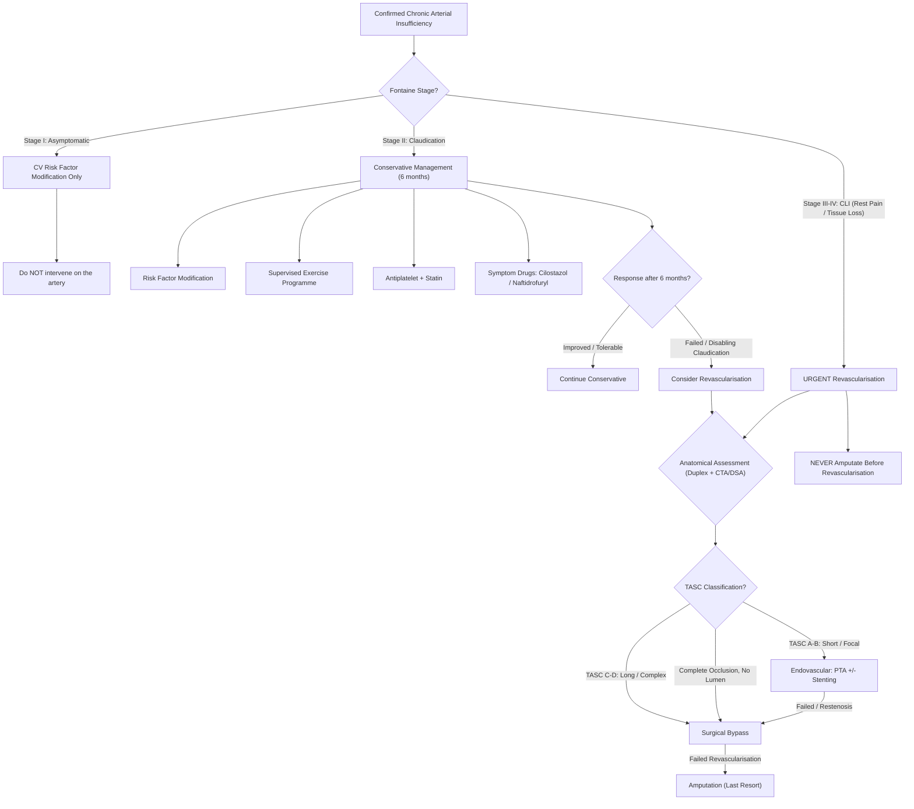

## Management of Chronic Arterial Insufficiency

### 1. Management Framework — The Big Picture

The management of chronic arterial insufficiency follows a logical, stepwise approach determined by **two parallel assessments** [1]:

1. **How severe is the limb disease?** (Fontaine/Rutherford stage → determines urgency)
2. **How fit is the patient?** (Systemic atherosclerotic burden, comorbidities → determines what intervention is safe)

***Treatment of Lower Limb Ischemia*** [1]:

| Presentation | Action |
|:---|:---|
| ***Asymptomatic*** | ***Do not treat*** (risk factor modification only) |
| ***Leg Pain (Claudication)*** | Conservative first → intervention if failed/disabling |
| ***Tissue Loss*** | ***Do not amputate*** (revascularise first) → then amputate minimum necessary |

The lecture slide treatment framework for claudication specifically divides goals into two streams [1]:

| Goal | ***Improve Survival*** | ***Improve Symptoms*** |
|:---|:---|:---|
| Modality | ***Risk factor modification + Drugs*** | ***Exercise + Drugs + Endovascular + Surgery*** |
| Specifics | ***Smoking cessation, Diabetes control, Lipid lowering therapy, Hypertension control, Anti-platelet agents*** | ***Trental (Pentoxyphylline), Praxilene (Naftidrofuryl), Pletaal (Cilostazol)*** |

> This dual-stream concept is critical: you are treating the **patient's survival** (cardiovascular mortality is the biggest killer, not the leg itself) AND the **limb symptoms** simultaneously. Never lose sight of the systemic disease.

---

### 2. Overall Management Algorithm

---

### 3. Conservative Management (The Foundation for ALL Patients)

Every patient with PAD — regardless of stage — receives conservative management. Even if they go on to have surgery, these measures are lifelong.

#### 3.1 Cardiovascular Risk Factor Modification

***Improve Survival: Smoking cessation, Diabetes control, Lipid lowering therapy, Hypertension control*** [1]

| Intervention | Mechanism & Rationale | Target |
|:---|:---|:---|
| **Smoking cessation** | Single most important intervention. Smoking cessation slows disease progression, improves claudication distance, reduces cardiovascular mortality, and is essential for graft patency post-surgery. Continued smoking doubles graft failure rate. | Complete cessation — offer pharmacotherapy (NRT, varenicline, bupropion) + behavioural support |
| **Diabetes control** | Hyperglycaemia accelerates endothelial damage (AGEs), promotes microvascular disease, impairs wound healing. Tight control reduces microvascular complications. | HbA1c < 7% (individualised) |
| ***Lipid lowering therapy*** — ***Statin*** | ***Regardless of lipid level for overall CVS protection*** [3]. Statins reduce LDL, stabilise plaques (anti-inflammatory effect on endothelium), improve endothelial function, and reduce cardiovascular events by ~25%. | LDL < 1.8 mmol/L (or ≥ 50% reduction). High-intensity statin (atorvastatin 40–80 mg or rosuvastatin 20–40 mg) |
| **Hypertension control** | Reduces shear stress on arterial wall, slows plaque progression. Target BP < 130/80 in most PAD patients. ACE inhibitors have additional vascular protective effects (ramipril shown in HOPE trial to reduce CV events in PAD). | BP < 130/80 mmHg |
| **Weight reduction** | Reduces metabolic demand on lower limbs, improves insulin sensitivity, reduces BP. | BMI < 25 |

#### 3.2 Antiplatelet Therapy

***Anti-platelet agents*** [1]

- ***Low dose aspirin (72–325 mg)*** [3]: **secondary prevention** of coronary heart disease and stroke — NOT primarily for improving claudication symptoms [2]
- Aspirin inhibits cyclooxygenase-1 (COX-1) → reduces thromboxane A₂ production → decreases platelet aggregation → reduces thrombotic events
- **Clopidogrel 75 mg** is an alternative if aspirin-intolerant (ADP receptor P2Y12 antagonist)
- Note: antiplatelet therapy provides only **modest or no improvement** in claudication symptoms themselves — its main role is **cardiovascular event prevention** [2]

#### 3.3 Supervised Exercise Programme

***Exercise*** — listed under "Improve Symptoms" on the lecture slides [1]

***Supervised exercise programme*** [3] — this is one of the most effective non-surgical interventions:

**How it works (from first principles)**:
1. **Increased collateral vessel formation**: Repeated exercise → intermittent ischaemia → local release of VEGF and other angiogenic factors → stimulates new collateral vessels to bypass stenoses
2. **Improved O₂ extraction**: Training improves mitochondrial density and oxidative enzyme capacity in skeletal muscle → more efficient use of limited blood supply
3. **Improved muscle metabolism**: Aerobic conditioning shifts muscle from anaerobic to more efficient aerobic metabolism → delays lactic acid accumulation
4. **Improved endothelial function**: Exercise promotes nitric oxide (NO) release → vasodilation
5. **Improved rheology**: Reduced blood viscosity, improved RBC deformability

**Protocol**: typically 30–45 minutes of supervised walking, 3× per week, for ≥ 12 weeks. Walk until near-maximal claudication pain → rest → walk again. This "train through the pain" approach is key.

**Evidence**: increases claudication distance by **50–200%** — comparable to or better than angioplasty for claudication alone.

---

### 4. Pharmacological Treatment for Claudication

***Drugs to Improve Symptoms: Trental (Pentoxyphylline), Praxilene (Naftidrofuryl), Pletaal (Cilostazol)*** [1]

| Drug | Mechanism | Efficacy | Key Side Effects / Contraindications |
|:---|:---|:---|:---|
| ***Cilostazol (Pletaal)*** | **Phosphodiesterase III (PDE3) inhibitor** → inhibits platelet aggregation + direct arterial vasodilation → ↑ blood flow to ischaemic muscle [2][3] | ***Only FDA-approved drug*** for claudication [2]. Increases walking distance by ~50%. | ***Contraindicated in heart failure of any severity*** [2][3] (PDE3 inhibitors ↑ mortality in HF — milrinone class effect). GI upset, headache, diarrhoea. |
| ***Naftidrofuryl (Praxilene)*** | **5-HT₂ receptor antagonist** → reduces platelet aggregation + improves aerobic muscle metabolism [2][3] | Fewer side effects than cilostazol. Moderate improvement in walking distance. | Well-tolerated; GI side effects |
| ***Pentoxifylline (Trental)*** | **Rheologic modifier / PDE inhibitor** → decreases blood viscosity, improves RBC deformability, reduces fibrinogen [2][3] | ***Benefits not firmly established*** [2]. Marginal benefit. | Nausea, dizziness. Largely superseded by cilostazol. |
| **Prostaglandins** (e.g., iloprost) | PGI₂ analogue → potent vasodilation + antiplatelet effects | Reserved for CLI when revascularisation not possible. IV infusion. | Hypotension, flushing, headache |

<Callout title="Cilostazol — The Only FDA-Approved Drug" type="idea">
Cilostazol is the only drug specifically approved for improving claudication distance. However, its **absolute contraindication in heart failure** is a classic exam trap. Why? PDE3 inhibitors prevent the breakdown of cAMP in cardiac myocytes → increased contractility initially, BUT long-term ↑ cAMP in the heart → arrhythmias and increased mortality in HF patients. Remember the milrinone trials.
</Callout>

---

### 5. Indications for Intervention (Revascularisation)

***Surgery for Chronic Arterial Obstruction — INDICATIONS*** [1]:
- ***Disabling claudication*** (failed 6 months of conservative management)
- ***Limb salvage (critical ischaemia)*** — rest pain, tissue loss

Put another way from the assessment framework [1]:
- ***Limb at Risk: Rest Pain, Tissue Loss → Absolute indication for intervention***
- ***Limb not threatened: Claudication → Relative indication for intervention***

**When to intervene for claudication** [2][3]:
- Failed conservative management (typically **6 months** of supervised exercise + risk factor modification)
- Claudication is "disabling" — significantly impacts quality of life, occupation, or independence
- The decision is shared with the patient — unlike CLI, claudication intervention is **not urgent**

**When to intervene for CLI**:
- **Urgent** — all patients with CLI (Fontaine III–IV) should be assessed for revascularisation
- Without intervention, 1-year major amputation rate ~25%, 1-year mortality ~25%

---

### 6. TASC II Classification — Guiding Revascularisation Strategy

The **TransAtlantic Inter-Society Consensus II (TASC II)** classification determines whether **endovascular** or **open surgical** revascularisation is preferred, based on the anatomical pattern of disease [2]:

| TASC Type | Lesion Pattern | Preferred Treatment |
|:---|:---|:---|
| ***TASC A*** | Short, focal stenoses (e.g., single stenosis ≤ 10 cm in SFA) | ***Endovascular — excellent result*** [2] |
| ***TASC B*** | Multiple stenoses or short occlusions (e.g., single occlusion ≤ 15 cm in SFA) | ***Endovascular — good result, preferred*** unless open surgery needed for another lesion [2] |
| ***TASC C*** | Long stenoses, multiple occlusions (e.g., total occlusion > 15 cm) | ***Open revascularisation preferred*** — better long-term results [2] |
| ***TASC D*** | Complete long-segment occlusions (e.g., CFA/SFA occlusion > 20 cm involving popliteal) | ***Open revascularisation primary treatment*** — endovascular associated with poor results [2] |

**Additional decision factors** [2]:
- ***For patients with estimated life expectancy ≤ 2 years or who do NOT have autogenous vein available as conduit → Balloon angioplasty*** (better short-term outcome, lower procedural risk)
- ***For patients with estimated life expectancy > 2 years or who have autogenous vein available as conduit → Bypass surgery*** (better long-term durability)

---

### 7. Endovascular Revascularisation

#### 7.1 Percutaneous Transluminal Angioplasty (PTA) ± Stenting

***Percutaneous transluminal balloon angioplasty (PTA) +/- stenting*** [3]

**Procedure from first principles**:
1. Access via common femoral artery (Seldinger technique) under local anaesthesia + fluoroscopic guidance
2. Guidewire crossed through the stenosis/occlusion
3. Balloon catheter advanced over the wire to the lesion
4. ***Balloon inflated for ~30 seconds*** → mechanically compresses the plaque against the arterial wall, widening the lumen [3]
5. ***Dilation confirmed by angiogram*** [3]
6. If result suboptimal (residual stenosis ≥ 30%, flow-limiting dissection, elastic recoil): **stent deployment** [2]

**Stenting** [3]:
- ***Stenting (+/- drug-elution): improve patency and reduce distal embolism***
- ***NOT used below knee*** [3] — below-knee stents have poor patency due to high mechanical stress (flexion at ankle), small vessel calibre, and worse run-off
- Drug-eluting stents/balloons release antiproliferative agents (e.g., paclitaxel) to reduce neointimal hyperplasia and restenosis

**Post-operative care** [3]:
- ***Post-op: antiplatelet + anticoagulation to prevent stent thrombosis***
- Typically: dual antiplatelet therapy (aspirin + clopidogrel) for a period, then lifelong single antiplatelet

**Advantages** [2]:
- Lower procedural risk than open surgery
- Repeatable (if restenosis occurs, can re-do PTA)
- Shorter recovery time
- Can be performed under local anaesthesia

**Preferred for** [3]:
- ***TASC Types A and B***
- ***Aortoiliac diseases*** (iliac PTA has excellent results — primary patency > 90% at 5 years)
- ***Short segment occlusion < 10 cm long***
- ***Life expectancy < 2 years***

**Complications** [2][3]:
- ***Arterial dissection***
- ***Arterial rupture***
- ***Distal embolisation***
- ***Restenosis of vessels*** (the most common late complication — neointimal hyperplasia)
- Access site complications: haematoma, pseudoaneurysm, AV fistula

---

### 8. Surgical Revascularisation

#### 8.1 Endarterectomy

***LOCAL PROCEDURES: Endarterectomy*** [1]

***Endarterectomy***: Open the artery → evacuate the atheromatous plaque from the intima → close the artery [3]

***Indications*** [1]:
- ***Larger vessels***
- ***Short segments***
- ***Stenosis (not long occlusions)***
- ***e.g., Iliac, Carotid*** [1]
- Also at **femoral bifurcation** — ***profundaplasty*** (endarterectomy of the profunda femoris origin) [3]

**Why only for short segments?** Removing plaque from a long segment is technically difficult, causes excessive vessel wall trauma, and has poor patency compared to bypass. For short focal lesions (e.g., common femoral bifurcation), direct removal is simple and effective.

> Profundaplasty deserves special mention: opening up the origin of the profunda femoris can dramatically improve limb perfusion because the profunda is the **key collateral channel** when the SFA is occluded. Even without bypassing the SFA, restoring profunda inflow can upgrade a leg from CLI to stable claudication.

#### 8.2 Bypass Surgery

***Arterial Bypass*** [1]: The principle is simple — take blood from a healthy artery **proximal** to the obstruction (inflow) and deliver it to a healthy artery **distal** to the obstruction (outflow/run-off) via a conduit.

***Inflow -------- OBSTRUCTION -------- Outflow (runoff)*** [1]

**Types of bypass** [1]:

| Type | Route | Indication |
|:---|:---|:---|
| ***ANATOMICAL*** | Follows the native arterial pathway | Standard approach when patient can tolerate major surgery |
| ***Aorto-iliac*** | Aortic graft to iliac artery | Aorto-iliac occlusive disease |
| ***Aorto-bifemoral bypass*** | Aortic graft bifurcating to both femoral arteries [1] | ***Preferred method for symptomatic aortoiliac occlusion*** [2] |
| ***Femoro-popliteal bypass*** | Femoral artery to popliteal artery | ***SFA or proximal popliteal artery occlusion*** where the popliteal artery has luminal continuity with at least one tibial branch [2] |
| ***EXTRA-ANATOMICAL*** | Does NOT follow the native pathway | When standard approach is too risky or anatomy is hostile |
| ***Femoro-femoral bypass*** [1] | Graft from one femoral artery to the contralateral femoral artery | ***Unilateral iliac occlusion*** where aorta and contralateral iliac artery are disease-free [2]. Can be done under local anaesthesia. |
| ***Axillo-bifemoral bypass*** [1] | Axillary artery → subcutaneous tunnel → both femoral arteries | High-risk patients unfit for major aortic surgery; ***neither thoracic nor abdominal cavity is violated*** [2]. Poorer long-term patency than aorto-femoral bypass — reserved for limb-threatening ischaemia in high-risk patients [2]. |
| ***Axillo-popliteal bypass*** | Axillary artery to popliteal artery | ***Last attempt to prevent amputation*** — when groin is hostile (infection, scarring) and iliac/femoral systems are involved [2] |

#### 8.3 Graft Conduit Choices

| Conduit | Details | Patency |
|:---|:---|:---|
| **Autologous vein (Best choice)** | ***Great saphenous vein remains the conduit of choice*** [2]; alternatives: lesser saphenous vein, arm veins | Best long-term patency, especially for **below-knee** bypasses. Living endothelium = less thrombogenic. |
| ***Prosthetic graft (PTFE)*** | Polytetrafluoroethylene — synthetic | ***Patency comparable to vein grafts for above-knee*** bypasses; ***significantly lower patency for more distal (below-knee) procedures*** [2]. Higher infection risk. |

> **Why is autologous vein superior below the knee?** Below-knee arteries are smaller calibre, lower flow, and higher resistance. A venous conduit has a living endothelium that produces NO and prostacyclin (antithrombotic), making it more resistant to thrombosis in these challenging conditions. Prosthetic grafts lack this endothelial advantage and thrombose more readily in low-flow environments.

<Callout title="History-Taking for Surgery Planning" type="idea">
Always ask about: ***Contrast allergy*** (for DSA/CTA), ***Saphenous vein condition*** [3] — has the patient had vein stripping? Varicose vein surgery? Previous CABG harvesting the GSV? If the great saphenous vein is unavailable, you'll need an alternative conduit (lesser saphenous, arm vein) or prosthetic graft, which alters the surgical plan.
</Callout>

**Bypass surgery is preferred for** [2][3]:
- ***TASC Types C and D***
- ***Failed angioplasty***
- ***Long-segment occlusion***
- ***Complete occlusion — no lumen for angioplasty guidewire to pass through*** [3]

---

### 9. Amputation — The Last Resort

***Never amputate digits before revascularization*** [1]

***Amputation after revascularization*** [1] — the slides make this sequence crystal clear: always try to restore blood flow first. Only then, once the limb has the best possible perfusion, amputate the minimum amount of non-viable tissue.

**Indications (mnemonic: 3 D's)** [3]:
1. **Dead limb**: Irreversible gangrene — delay in amputation results in infection, rhabdomyolysis, sepsis
2. **Dangerous limb**: Life-threatening infection (wet gangrene, necrotising fasciitis), malignancy
3. **Damn nuisance**: Un-reconstructable CLI, non-functional limb (contractures, paralysis), major trauma

**Principles of amputation** [3]:
- Remove all infected/necrotic tissue
- **Preserve as much length as safely possible** — functional outcome depends on preserving joints
- Ensure **adequate blood supply** to heal the stump — revascularisation may be required *before* amputation

**Levels of amputation** [3]:

| Level | When | Key Point |
|:---|:---|:---|
| **Toe / Ray amputation** | Isolated toe gangrene with good proximal perfusion | Minimal functional loss |
| **Transmetatarsal amputation** | Forefoot gangrene | Preserves ankle function |
| **Syme's amputation** | Ankle joint level | End-bearing stump |
| ***Below-knee amputation (BKA)*** | Most common level. **Aim to preserve the knee joint** — much easier to walk on BKA prosthesis than AKA [3] | ***Contraindicated if fixed flexion deformity of knee*** [3] |
| ***Above-knee amputation (AKA)*** [1] | ***If femoral pulse is absent*** [3] — indicates insufficient blood supply to heal a BKA stump | Loss of knee joint → harder rehabilitation |

**Complications of amputation** [3]:

| Timing | Complication | Mechanism / Notes |
|:---|:---|:---|
| **Early** | Wound haematoma, infection, dehiscence | Poor blood supply → delayed healing |
| Early | **Stump gangrene** | Inadequate perfusion to stump → higher amputation needed |
| Early | ***Phantom limb pain*** | Central sensitisation — the brain continues to "map" the amputated limb. ***Mx: reassurance, amitriptyline, gabapentin*** [3] |
| Early | DVT/PE | Immobility post-op. ***Mx: prophylactic heparin*** [3] |
| **Late** | Fixed flexion deformity of joint above | Muscle imbalance, inadequate rehabilitation |
| Late | Osteomyelitis, osteophyte formation | Exposed/infected bone |
| Late | Stump ulceration | Pressure from prosthesis |
| Late | Stump neuroma | Nerve regrowth into scar tissue → painful nodule |

**Rehabilitation** [3]: Usually can bear weight on contralateral limb by **1 week**, fit temporary prosthesis by **3 weeks**.

---

### 10. Management of Specific Aetiologies

#### Buerger's Disease

***Reconstruction seldom possible. Stop smoking is effective.*** [1]

- Small distal vessels → not amenable to bypass or angioplasty
- **Only effective treatment**: absolute smoking cessation
- Supportive: wound care, prostanoids (iloprost) for severe ischaemia, sympathectomy (limited evidence)
- If smoking continues → progressive disease → eventual amputation

#### Diabetic Foot

- Dual pathology: **neuropathy** (insensate foot → unnoticed trauma → ulcers) + **ischaemia** (distal vessel disease)
- ***Vascular component: angioplasty*** [5] (tibial/peroneal angioplasty — even though infrapopliteal, angioplasty is preferred over bypass in diabetic distal disease due to vessel size)
- ***Neuropathic component: customised insole*** [5] — offloading to redistribute pressure
- ***Surgical: debridement, below knee amputation*** [5] if unreconstructable

---

### 11. Summary Decision Table

| Clinical Scenario | Primary Management |
|:---|:---|
| **Fontaine I** (Asymptomatic) | Risk factor modification. ***Do not treat*** the artery [1]. |
| **Fontaine IIa** (Mild claudication, > 200m) | Conservative: exercise + risk factor modification + antiplatelet + statin ± cilostazol |
| **Fontaine IIb** (Moderate claudication, < 200m) | Same conservative approach for 6 months → intervention if disabling |
| **Fontaine III** (Rest pain) | **Urgent** revascularisation (endovascular or surgical based on TASC) |
| **Fontaine IV** (Tissue loss) | **Urgent** revascularisation → ***amputation AFTER revascularisation*** [1] |
| **Failed revascularisation / unreconstructable** | Amputation (preserve maximum length) |
| **Buerger's disease** | ***Stop smoking*** → only effective treatment [1] |

---

<Callout title="High Yield Summary">

1. **All patients** get CV risk factor modification + antiplatelet + statin — this is for **survival**, not just the leg.
2. ***Improve Survival***: Smoking cessation, DM control, lipid lowering (statin regardless of lipid level), HT control, antiplatelet agents.
3. ***Improve Symptoms***: Supervised exercise programme + drugs (cilostazol, naftidrofuryl, pentoxifylline) + endovascular/surgery.
4. ***Cilostazol*** (PDE3 inhibitor) = only FDA-approved drug for claudication. **Contraindicated in heart failure**.
5. **Aspirin** = secondary CV prevention, NOT primarily for claudication improvement.
6. **Supervised exercise** increases claudication distance by 50–200% — comparable to angioplasty.
7. **Indications for intervention**: ***disabling claudication (failed 6 months conservative) + limb salvage (critical ischaemia)***.
8. **TASC A-B** → endovascular (PTA ± stent). **TASC C-D** → surgical bypass.
9. **Endarterectomy**: short segments, larger vessels (iliac, carotid, femoral bifurcation/profundaplasty).
10. **Bypass**: anatomical (aorto-bifemoral, fem-pop) vs extra-anatomical (fem-fem, axillo-bifemoral). **Autologous vein = best conduit**, especially below knee.
11. ***Never amputate digits before revascularisation.***
12. **Amputation indications (3 D's)**: Dead, Dangerous, Damn nuisance. BKA preferred to preserve knee joint.
13. ***"Treating the angiogram"*** = intervening on an asymptomatic stenosis — ***DON'T DO IT*** [1].

</Callout>

---

<ActiveRecallQuiz
  title="Active Recall - Management of Chronic Arterial Insufficiency"
  items={[
    {
      question: "What are the two indications for surgery in chronic arterial obstruction as stated on the lecture slides?",
      markscheme: "1. Disabling claudication (failed conservative management). 2. Limb salvage (critical ischaemia — rest pain or tissue loss).",
    },
    {
      question: "Name three drugs used to improve claudication symptoms. For each, state the mechanism and one key limitation or contraindication.",
      markscheme: "1. Cilostazol (PDE3 inhibitor — antiplatelet + vasodilator): CI in heart failure of any severity. 2. Naftidrofuryl (5-HT2 antagonist — reduces platelet aggregation, improves muscle metabolism): fewer side effects but moderate efficacy. 3. Pentoxifylline (rheologic modifier/PDE inhibitor — reduces blood viscosity): benefits not firmly established, marginal benefit.",
    },
    {
      question: "Explain the TASC II classification and how it guides the choice between endovascular and surgical revascularisation.",
      markscheme: "TASC classifies lesions A-D by anatomical complexity. TASC A (short focal stenosis): endovascular, excellent results. TASC B (multiple stenoses/short occlusions): endovascular preferred. TASC C (long stenoses/multiple occlusions): open surgery preferred (better long-term). TASC D (complete long-segment occlusions): open surgery primary treatment. Also consider life expectancy (less than 2y favours endovascular) and vein conduit availability (available favours surgical bypass).",
    },
    {
      question: "Why is the great saphenous vein the preferred conduit for below-knee bypass, and when might you use a prosthetic graft instead?",
      markscheme: "GSV has living endothelium producing NO and prostacyclin (antithrombotic) — superior patency in low-flow, small-calibre below-knee vessels. PTFE prosthetic grafts lack endothelium, thrombose more easily in low-flow settings, and have significantly lower below-knee patency. Use prosthetic when: autologous vein unavailable (previous stripping, CABG harvest), life expectancy less than 2 years, or for above-knee bypass where patency is comparable.",
    },
    {
      question: "A patient has toe gangrene. The surgical trainee wants to amputate the toe immediately. What is wrong with this approach and what should be done first?",
      markscheme: "Never amputate digits before revascularisation. If you amputate without restoring arterial inflow, the wound will not heal and a higher-level amputation will be needed. Correct approach: assess arterial inflow (ABI, duplex, CTA/DSA), revascularise first (PTA or bypass), allow demarcation, then amputate the minimum necessary tissue.",
    },
    {
      question: "List the three types of anatomical and two types of extra-anatomical bypass procedures for lower limb PAD, with one key indication for each.",
      markscheme: "Anatomical: 1. Aorto-bifemoral bypass (bilateral aorto-iliac disease — preferred method). 2. Femoro-popliteal bypass (SFA/proximal popliteal occlusion). 3. Aorto-iliac bypass (aorto-iliac stenosis). Extra-anatomical: 1. Femoro-femoral bypass (unilateral iliac occlusion with healthy contralateral side — can be done under local anaesthesia). 2. Axillo-bifemoral bypass (high-risk patients unfit for major aortic surgery — neither thoracic nor abdominal cavity violated).",
    },
  ]}
/>

## References

[1] Lecture slides: WCS 002 - Toe gangrene and leg ulcer - by Prof SWK Cheng.pdf (p8, p14, p15, p16, p18, p22, p28, p29)
[2] Senior notes: felixlai.md (Chronic arterial insufficiency — Treatment: TASC classification, medical treatment, endovascular, surgical revascularisation, amputation)
[3] Senior notes: maxim.md (Chronic limb ischaemia — Management: conservative, endovascular, surgical, amputation; History taking — contrast allergy, saphenous vein condition)
[5] Senior notes: maxim.md (Diabetic foot ulcers — Management)
