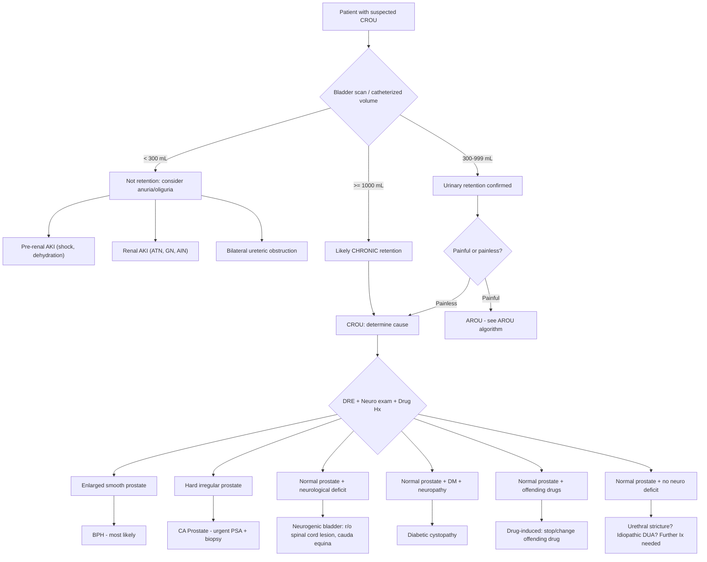

## Differential Diagnosis of Chronic Retention of Urine

When a patient presents with features suggestive of CROU — painless palpable bladder, overflow incontinence, recurrent UTIs, or unexplained renal impairment — your clinical task is twofold:

1. **Confirm that this IS urinary retention** (and not something else mimicking it)
2. **Determine the underlying CAUSE** of the chronic retention (BOO vs. DUA vs. mixed)

Let me walk through this systematically, from first principles.

---

### 1. Is It Actually Urinary Retention? — The First-Level Differential

The very first step is to distinguish CROU from other conditions that can mimic it. This is critical because the management is entirely different.

#### 1.1 CROU vs. Anuria/Oliguria

***AROU (and by extension CROU) should be distinguished from anuria or oliguria → lack of urine production, not retention*** [2]

| Feature | CROU | Anuria/Oliguria |
|---|---|---|
| **Urine production** | Normal or increased (kidneys are working) | Absent or severely reduced (kidneys failing or not perfused) |
| **Bladder** | Distended, palpable, large PVR on scan | Empty on bladder scan |
| **Key distinction** | Problem is **outflow** — urine is made but cannot escape | Problem is **inflow** — kidneys are not making urine |
| **Causes** | BOO, DUA | Pre-renal (shock, dehydration), renal (ATN, GN), bilateral ureteric obstruction |

The definitive test is a **bedside bladder ultrasound scan**: if the bladder is full (large volume), it is retention; if the bladder is empty, it is anuria/oliguria [2] [3].

***Pre-renal ARF due to dehydration and shock; Renal ARF due to acute tubular necrosis, interstitial nephritis, glomerulonephritis*** — these all present with oliguria but an **empty** bladder [2].

<Callout title="Clinical Pearl" type="error">
A common exam mistake: confusing CROU with anuria. The patient with CROU may have elevated creatinine (from obstructive uropathy) AND reduced urine output (from overflow). But the bladder is FULL. In anuria, the bladder is EMPTY. Always do a bladder scan before deciding — this takes 30 seconds and changes the entire management.
</Callout>

#### 1.2 CROU vs. AROU

***Acute retention of urine (AROU): sudden onset, painful → occurs when innervation is normal, e.g. BPH*** [1]
***Chronic retention of urine (CROU): usually painless with vague lower abdominal distension → occurs when innervation is abnormal, e.g. DM*** [1]

| Feature | AROU | CROU |
|---|---|---|
| Onset | Sudden (hours) | Insidious (weeks–months) |
| Pain | ***Painful*** | ***Painless*** |
| Voiding | Cannot void at all | May still void small amounts (but large PVR remains) |
| Bladder volume | Usually 400–800 mL | Often > 1 L (sometimes 2–3 L) |
| Typical cause | BPH with precipitant, drugs, postoperative | DM neuropathy, decompensated detrusor, chronic BOO |
| Complications at presentation | Usually none (presents early) | Often already has UTI, stones, hydronephrosis, CKD |

***Bladder scan: ≥ 300 mL in a patient unable to void suggests urinary retention; ≥ 1 L suggests chronic retention of urine*** [2]

A patient may also present with **acute-on-chronic retention** — someone with longstanding CROU who suddenly becomes completely unable to void (e.g. precipitated by a cold medication containing pseudoephedrine). They will have features of both: painful acute presentation + very large bladder volume + pre-existing complications (hydronephrosis, elevated Cr).

#### 1.3 CROU vs. Other Pelvic/Abdominal Masses

A palpable suprapubic mass is not always a bladder:

| Differential | Distinguishing Features |
|---|---|
| **Distended bladder (CROU)** | Midline, arising from pelvis, dull to percussion, disappears after catheterization/bladder scan confirms |
| **Ovarian cyst/tumour** | Female, may be lateralized, does not disappear with catheterization, USG shows cystic/solid mass separate from bladder |
| **Uterine fibroid** | Female, midline, firm, may have menstrual symptoms, USG distinguishes |
| **Pregnancy** | Amenorrhoea, positive β-hCG, USG confirms |
| **Ascites** | Shifting dullness, fluid thrill, generalized distension not localized to suprapubic |
| **Loaded rectum / fecal impaction** | DRE reveals impacted stool; may actually coexist with CROU as a cause |

#### 1.4 CROU vs. Overflow Incontinence from Other Causes

***Overflow incontinence: leakage of urine when bladder is abnormally distended with large residual volume, especially in men with chronic retention*** [5]

Overflow incontinence is essentially the **presenting symptom** of CROU, but you must distinguish it from other types of incontinence (because treatment differs radically):

| Type | Mechanism | Key Features |
|---|---|---|
| ***Overflow*** | BOO/DUA → bladder overdistension → continuous dribbling | ***Large post-void residual, palpable bladder***, constant dribbling esp. at night, voiding LUTS |
| ***Stress*** | Poor urethral sphincter function → leakage with ↑ abdominal pressure | Triggered by cough/sneeze/exertion, no palpable bladder, normal PVR |
| ***Urge*** | Detrusor overactivity → uncontrolled contraction | Preceded by urgency, sudden large-volume leakage, no palpable bladder |
| ***Functional*** | Inability to reach toilet in time | Impaired mobility/cognition, other types excluded |
| ***Continuous*** | Anatomical abnormality (fistula, ectopic ureter) | Constant leakage without relationship to triggers, consider in females |

> [3] [5]

---

### 2. Once Confirmed as CROU — What Is the Underlying Cause?

This is where the real clinical reasoning happens. The differential diagnosis of the **etiology** of CROU is organized by mechanism:

#### 2.1 Bladder Outlet Obstruction (BOO) — Predominantly Males

***BOO typically presents with predominantly voiding symptoms*** [3]

| Category | Causes | Key Distinguishing Features |
|---|---|---|
| **Prostatic** | ***BPH*** (most common, 53% of retention) [1] | Age > 50, smooth enlarged prostate on DRE (> 3FB), median sulcus intact, longstanding obstructive LUTS |
| | ***CA prostate*** (7%) [1] | Hard irregular prostate on DRE, loss of median sulcus, PSA elevated, bone mets (back pain, raised ALP) |
| | Prostatitis | Tender boggy prostate on DRE, fever, acute irritative symptoms |
| **Urethral** | ***Urethral stricture*** (3.5%) [1] | History of prior instrumentation, STDs, or trauma; recurrent UTI; poor flow despite small prostate |
| | ***Bladder neck stenosis*** | History of previous prostate surgery or radiotherapy for CA prostate |
| | Phimosis | Tight foreskin visible on external examination; ballooning during voiding |
| **Intraluminal** | ***Bladder/urethral stones*** (2%) [1] | Intermittent obstruction, positional symptoms (stream cuts off when standing), strangury, haematuria |
| | ***Clot retention*** (3%) [1] | Gross haematuria with clots, often on anticoagulants or after prostate/bladder surgery |
| | ***Bladder tumour*** | Painless haematuria, smoker, occupational exposure (dyes, rubber) |
| **External compression** | ***Constipation/fecal impaction*** (7.5%) [1] | Loaded rectum on DRE, often in elderly/immobile patients, resolves with disimpaction |
| | Pelvic tumours | Rectal CA, gynaecological tumours, pelvic masses on imaging |

#### 2.2 Detrusor Underactivity (DUA) — Predominantly Females, Also Elderly Males

***Common causes of AROU/CROU in females: detrusor hypocontractility — exclude DM; neurogenic bladder; idiopathic*** [1]

| Category | Causes | Key Distinguishing Features |
|---|---|---|
| **Neurogenic** | ***Diabetic autonomic neuropathy*** | Longstanding DM, peripheral neuropathy signs, erectile dysfunction, postural hypotension, other autonomic features |
| | ***Spinal cord lesion / DSD*** | Motor/sensory level, UMN signs below lesion, DSD on urodynamics; causes include SCI, vertebral metastasis, spinal stenosis, transverse myelitis, MS |
| | ***Cauda equina syndrome*** | **Surgical emergency!** Saddle anaesthesia (S2–S4), reduced anal tone, bilateral leg weakness/sciatica, acute back pain; CROU can be the presenting feature |
| | ***Post-radical pelvic surgery*** | History of APR for rectal CA, radical hysterectomy, radical prostatectomy (damage to pelvic parasympathetic plexus) |
| | ***CVA, Parkinson's, MSA, NPH*** | Suprapontine lesions — usually cause overactive bladder more than retention, but can cause incomplete emptying; associated neurological features |
| | ***GBS*** | Acute onset ascending weakness, areflexia; rare cause |
| **Myogenic** | ***Chronic BOO → decompensated detrusor*** | Longstanding obstructive LUTS → now "burnt out" — paradoxically less symptomatic but larger PVR |
| | ***Aging*** | Elderly, no other identifiable cause, reduced detrusor contractility on urodynamics |
| | ***Chronic overdistension*** | History of infrequent voiding habits, prolonged immobility |
| **Idiopathic** | | Diagnosis of exclusion; commoner in females |

#### 2.3 Drug-Induced (Contributory)

***Drug-induced causes*** [2]:
- ***Sympathomimetics: α-agonists (cold medications), β-agonists (bronchodilators), MDMA***
- ***Anticholinergics: anticholinergics (bronchodilators), antipsychotics, antispasmodics (opioids), antihistamines, antidepressants, disopyramide (class Ia antiarrhythmic)***

Always review the drug chart. In clinical practice, drugs rarely cause CROU de novo, but they frequently **tip a borderline patient into retention** (e.g. a man with moderate BPH who takes an OTC cold medicine containing pseudoephedrine and goes into retention).

#### 2.4 Other Causes of Chronic BOO (Paediatric Context — For Completeness)

***Posterior urethral valve (PUV)*** — boys only; congenital cause of BOO; presents with bilateral hydronephrosis, trabeculated bladder on antenatal USS; management is ***valve ablation*** [6]

---

### 3. Differential Diagnosis by Specific Presenting Complaint

Since CROU can present in many ways, the DDx depends on the presenting complaint:

#### 3.1 Presenting with Overflow Incontinence
- **CROU from any cause** (BOO or DUA) — the most important to exclude
- Stress incontinence
- Urge incontinence
- Continuous incontinence (fistula, ectopic ureter)
- Functional incontinence

***Overflow incontinence: esp in men with chronic retention; may be complicated with UTI, bladder stone formation; may eventually lead to obstructive uropathy and deterioration of renal function*** [5]

#### 3.2 Presenting with Raised Creatinine / Obstructive Uropathy
- **Post-renal AKI from CROU** → bilateral hydronephrosis
- Pre-renal AKI (dehydration, sepsis, cardiogenic shock)
- Intrinsic renal AKI (ATN, AIN, GN)
- Other causes of post-renal AKI: bilateral ureteric stones, retroperitoneal fibrosis, pelvic malignancy with bilateral ureteric involvement

***Post-renal disease ( < 10%) due to obstructive uropathy (must be bilateral)*** [7]
***Prolonged post-renal disease will progress to become tubulointerstitial fibrosis, i.e. intrinsic renal disease*** [7]

#### 3.3 Presenting with Recurrent UTI
- CROU with stagnant residual urine
- Structural abnormalities (stones, vesicoureteric reflux)
- Immunocompromised state
- Poor hygiene / catheter-associated UTI

#### 3.4 Presenting with LUTS
This is the broadest DDx and includes both BOO and non-BOO causes:

***Differential diagnosis of LUTS*** [3]:
- ***Bladder outlet obstruction: bladder stones, bladder cancer, bladder neck contracture, interstitial cystitis, ketamine cystitis; BPH, prostatic cancer; urethral stricture***
- ***Overactive bladder (detrusor overactivity): neurogenic (stroke, SCI, MS, Parkinson's) or non-neurogenic (idiopathic, post-operative, secondary to BOO)***

Additional DDx for LUTS includes:
- **UTI/prostatitis** — irritative symptoms with dysuria, pyuria, significant bacteriuria on culture
- **Bladder cancer** — painless haematuria, irritative symptoms, smoking history
- **Interstitial cystitis / bladder pain syndrome** — chronic pelvic pain relieved by voiding, sterile urine, young women
- **Ketamine cystitis** — important in Hong Kong given ketamine abuse; severely contracted bladder, young patients
- **Nocturnal polyuria** — isolated nocturia, normal daytime frequency; causes include CCF, OSA, DI, excessive evening fluid intake [3]

---

### 4. The Differential Diagnosis Algorithm

Here is how to approach the differential systematically:

---

### 5. Key Differentials to NOT Miss (Red Flags)

<Callout title="Must-Not-Miss Diagnoses in CROU" type="error">

1. **Cauda equina syndrome**: acute back pain + saddle anaesthesia + reduced anal tone + bilateral leg symptoms + urinary retention → **emergency MRI spine and surgical decompression within 48h**. CROU may be the presenting feature. Always check perineal sensation and anal tone in any retention patient.

2. **Spinal cord compression** (e.g. from vertebral metastasis): new back pain + bilateral leg weakness + sensory level + urinary retention → **emergency MRI + dexamethasone + oncology/neurosurgery referral**. Ask about history of malignancy (prostate, lung, breast — the "Big 3" for vertebral mets).

3. **CA prostate**: hard, irregular prostate on DRE with loss of median sulcus → PSA + TRUS-guided biopsy. This can present as CROU from locally advanced disease invading the bladder neck.

4. **Bilateral obstructive uropathy with renal failure**: elevated Cr + bilateral hydronephrosis on USS → this is post-renal AKI that is **reversible** if decompressed promptly. Delay = permanent renal damage.

</Callout>

---

### 6. Summary Table — Differential Diagnosis of CROU by Category

| Category | Condition | Key Distinguishing Clue |
|---|---|---|
| **Mimics** | Anuria/oliguria | Empty bladder on scan |
| | AROU | Painful, acute onset |
| | Other pelvic masses | Does not resolve with catheterization |
| **BOO — Prostatic** | ***BPH*** | Smooth enlarged prostate, age > 50, obstructive LUTS |
| | ***CA prostate*** | Hard irregular prostate, loss of median sulcus, raised PSA |
| | Prostatitis | Tender prostate, fever |
| **BOO — Urethral** | ***Urethral stricture*** | Hx of instrumentation/STD, poor flow despite small prostate |
| | ***Bladder neck stenosis*** | Post-prostate surgery or post-RT |
| | Phimosis | Tight foreskin on examination |
| **BOO — Intraluminal** | Bladder/urethral stones | Positional symptoms, haematuria |
| | Clot retention | Gross haematuria |
| | Bladder tumour | Painless haematuria, smoking history |
| **BOO — Extrinsic** | ***Constipation*** | Loaded rectum on DRE |
| | Pelvic tumours | Pelvic mass on imaging |
| | Pelvic organ prolapse | Female, visible/palpable prolapse on examination |
| **DUA — Neurogenic** | ***DM neuropathy*** | Long-standing DM, peripheral neuropathy, autonomic features |
| | ***Spinal cord lesion / DSD*** | Motor/sensory level, UMN signs |
| | ***Cauda equina*** | Saddle anaesthesia, reduced anal tone — **emergency** |
| | Post-pelvic surgery | History of APR / radical hysterectomy |
| **DUA — Myogenic** | Decompensated detrusor | Longstanding obstructive LUTS now "burnt out" |
| | Aging | Elderly, diagnosis of exclusion |
| **DUA — Idiopathic** | Idiopathic DUA | No identifiable cause, commoner in females |
| **Drug-induced** | Multiple drug classes | Anticholinergics, α-agonists, opioids, antidepressants |

---

<Callout title="High Yield Summary — Differential Diagnosis of CROU">

1. **First, confirm it IS retention**: bladder scan — full bladder = retention; empty bladder = anuria/oliguria (completely different management).

2. **Then, distinguish acute from chronic**: AROU is painful and acute; CROU is painless and insidious. Volume ≥ 1 L strongly suggests chronic. Acute-on-chronic is possible.

3. **Determine the mechanism — BOO vs. DUA**:
   - BOO: predominantly in males — BPH (53%), CA prostate (7%), urethral stricture (3.5%), constipation (7.5%), stones, clot retention
   - DUA: predominantly in females — DM neuropathy, neurogenic bladder (SCI, cauda equina), idiopathic
   - Drug-induced: anticholinergics, α-agonists, opioids — contributory, not sole cause

4. **Red flags to never miss**: Cauda equina syndrome (saddle anaesthesia + reduced anal tone), spinal cord compression (sensory level + bilateral weakness), CA prostate (hard irregular prostate), bilateral obstructive uropathy (raised Cr + bilateral hydronephrosis).

5. **Overflow incontinence is the hallmark presentation of CROU** — always check PVR in any patient with incontinence to rule out CROU.

</Callout>

---

<ActiveRecallQuiz
  title="Active Recall - Differential Diagnosis of Chronic Retention of Urine"
  items={[
    {
      question: "A patient presents with reduced urine output and elevated creatinine. How do you distinguish CROU from anuria/oliguria, and why does this distinction matter?",
      markscheme: "Perform bedside bladder ultrasound scan. In CROU, the bladder is full (large post-void residual, typically >= 300 mL, >= 1 L suggests chronic). In anuria/oliguria, the bladder is empty. Distinction matters because CROU is treated with bladder decompression (catheterization), while anuria/oliguria requires investigation of pre-renal (shock, dehydration) or renal (ATN, GN) causes. Misdiagnosis delays correct treatment."
    },
    {
      question: "Name the three most important red-flag diagnoses to exclude in a patient presenting with chronic urinary retention, and state the key clinical feature for each.",
      markscheme: "1. Cauda equina syndrome: saddle anaesthesia, reduced anal tone, bilateral leg symptoms, acute back pain. 2. Spinal cord compression (e.g. vertebral metastasis): bilateral weakness, sensory level, UMN signs, history of malignancy. 3. CA prostate (locally advanced): hard, irregular prostate on DRE, loss of median sulcus, elevated PSA. All three require urgent investigation and management."
    },
    {
      question: "How would you differentiate BPH from CA prostate as the cause of chronic urinary retention based on DRE findings?",
      markscheme: "BPH: smooth, symmetrically enlarged prostate (>3 finger-breadths), non-tender, firm consistency, median sulcus (groove) is intact. CA prostate: asymmetrically enlarged, hard, irregular, nodular prostate, loss of median sulcus. BPH arises in the transitional zone (central, compresses urethra early), while CA prostate arises in the peripheral zone (posterior, compresses urethra late when locally advanced)."
    },
    {
      question: "A 65-year-old woman with type 2 DM for 20 years presents with recurrent UTIs and constant dribbling of urine. Bladder scan shows post-void residual of 800 mL. What is the most likely underlying mechanism, and what is the pathophysiology?",
      markscheme: "Diabetic cystopathy causing detrusor underactivity. Pathophysiology: autonomic neuropathy (parasympathetic S2-S4) impairs detrusor contraction; sensory neuropathy blunts perception of bladder fullness leading to chronic overdistension; overdistension causes mechanical disruption of detrusor muscle (reduced actin-myosin overlap), creating a vicious cycle of progressive detrusor decompensation. Stagnant residual urine causes recurrent UTIs. Overflow incontinence results from intravesical pressure exceeding outlet resistance."
    },
    {
      question: "List 4 broad categories of differential diagnosis for overflow incontinence and give one distinguishing feature for each.",
      markscheme: "1. Overflow (CROU): large PVR, palpable bladder, voiding LUTS. 2. Stress incontinence: leakage with cough/sneeze/exertion, normal PVR. 3. Urge incontinence: sudden urgency preceding leakage, no palpable bladder. 4. Continuous incontinence: constant leakage (e.g. vesicovaginal fistula, ectopic ureter), consider in females, anatomical abnormality. 5. Functional incontinence: impaired mobility/cognition, diagnosis of exclusion."
    }
  ]}
/>

## References

[1] Lecture slides: GC 180. Benign prostatic hyperplasia, bladder outlet obstruction and urinary retention.pdf (pp. 23, 27, 30, 31, 33, 46)
[2] Senior notes: Ryan Ho Urogenital.pdf (pp. 164, 165, 167); Ryan Ho Fundamentals.pdf (pp. 349, 350, 352)
[3] Senior notes: felixlai.md (sections: AROU, BPH, Differential diagnosis of LUTS, Differential diagnosis of nocturia); maxim.md (sections: AROU, Urinary incontinence)
[5] Lecture slides: GC 209. Urinary incontinence and overactive bladder.pdf (pp. 20, 30)
[6] Senior notes: maxim.md (section: Bladder outlet obstruction — paediatric)
[7] Senior notes: Ryan Ho Critical Care.pdf (p. 25)
