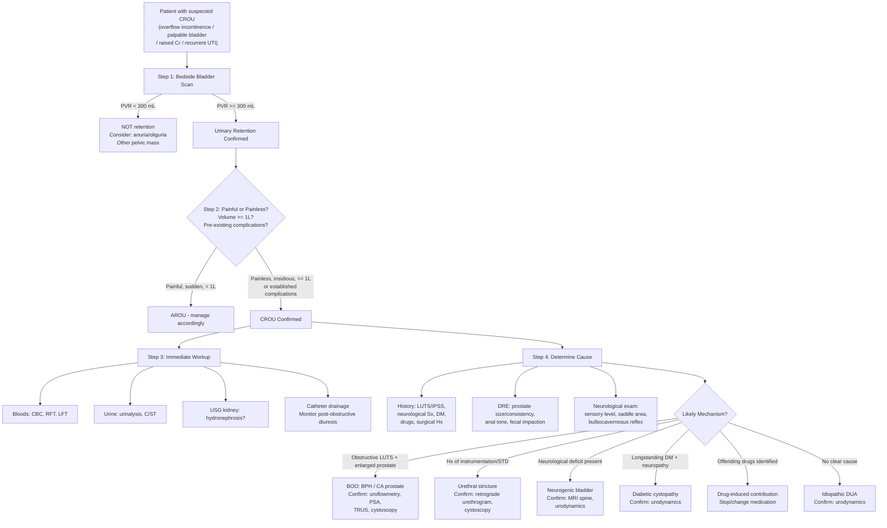

## Diagnostic Criteria, Diagnostic Algorithm, and Investigation Modalities for Chronic Retention of Urine

### 1. Diagnostic Criteria — Defining CROU

Unlike many medical conditions, CROU does not have a single universally agreed-upon numerical cut-off. It is a **clinical diagnosis** supported by objective measurements. Let me explain the diagnostic framework from first principles.

#### 1.1 Core Diagnostic Features

The diagnosis of CROU requires **all three** of the following:

1. **Elevated post-void residual (PVR) volume** — the bladder retains a significant volume of urine after the patient has attempted to void (or cannot void at all)
2. **Chronicity** — the condition has developed **gradually** over weeks to months (not acutely)
3. **Painless or minimally symptomatic bladder distension** — distinguishing it from AROU

***Bladder scan: ≥ 300 mL in a patient unable to void suggests urinary retention; ≥ 1 L suggests chronic retention of urine*** [2]

#### 1.2 Working Diagnostic Thresholds

| Parameter | Threshold | Significance |
|---|---|---|
| **PVR on bladder scan** | ≥ 300 mL | Suggestive of urinary retention |
| **PVR on bladder scan** | **≥ 1,000 mL (1 L)** | ***Strongly suggests CHRONIC retention*** [2] |
| **First catheterized volume** | > 800 mL–1 L | Very suggestive of CROU (an acute bladder would be exceedingly painful at this volume if innervation were intact) |
| **PVR in context of BPH work-up** | ***> 200 mL*** | ***Indicates significant obstruction*** [3] |
| **PVR — normal range** | ***< 50 mL in young; up to 100–200 mL acceptable in elderly*** [2] |

<Callout title="Why Is There No Single Cut-Off?">
The "normal" PVR varies with age, bladder capacity, and clinical context. A PVR of 150 mL in a 30-year-old is abnormal. A PVR of 150 mL in an 80-year-old may be within acceptable limits. The key is to interpret PVR in the clinical context: a high PVR + symptoms (overflow incontinence, recurrent UTI, renal impairment) + painless palpable bladder = CROU regardless of the exact number.
</Callout>

#### 1.3 High-Pressure vs. Low-Pressure CROU (Urodynamic Criteria)

This distinction is made on **pressure-flow studies** (urodynamics) and is clinically crucial because it determines the risk of upper tract damage:

| Type | Urodynamic Finding | Clinical Significance |
|---|---|---|
| **High-pressure CROU** | ***High intravesical pressure, low flow*** (BOO pattern) | High risk of hydronephrosis and renal damage; back-pressure transmitted to ureters/kidneys |
| **Low-pressure CROU** | Low intravesical pressure, low flow (DUA pattern) | Lower risk of upper tract damage (bladder acts as low-pressure reservoir); still causes UTI, stones, overflow |

***Outflow obstruction is characterized by high pressure, low flow*** [3]

> This is important: two patients can both have a PVR of 800 mL, but the one with high-pressure CROU (e.g. from BPH with DSD) is at far greater risk of renal damage than the one with low-pressure CROU (e.g. from diabetic cystopathy).

---

### 2. Diagnostic Algorithm — Systematic Approach

The diagnostic approach follows a logical sequence: **confirm retention → characterize as chronic → assess complications → determine underlying cause**.

#### 2.1 Step-by-Step Approach

**Step 1: Confirm urinary retention** [2]
- ***Bedside bladder ultrasound scan*** → if bladder volume is large (≥ 300 mL post-void), retention is confirmed
- Alternatively, the ***first catheterized urine volume*** confirms retention if a catheter is passed directly
- If bladder is empty → this is NOT retention → consider anuria/oliguria (pre-renal, renal, or bilateral ureteric obstruction)

**Step 2: Differentiate AROU from CROU** [1] [2]
- ***AROU: sudden onset, painful*** → innervation intact
- ***CROU: usually painless, vague lower abdominal distension*** → often abnormal innervation
- Volume ≥ 1 L strongly suggests chronic [2]
- Presence of pre-existing complications (bilateral hydronephrosis, elevated Cr, bladder stones) confirms chronicity

**Step 3: Assess for complications immediately**
- **Bloods**: ***RFT*** (obstructive uropathy?) → ***High serum creatinine can result from bladder outlet obstruction or underlying renal disease, which should prompt an USG*** [3]
- **Urine**: ***urinalysis, microscopy, C/ST*** (UTI?) [3]
- **Imaging**: ***USG kidney*** (hydronephrosis?)

**Step 4: Determine the underlying cause**
- ***History***: LUTS profile (***IPSS***), neurological symptoms, DM, drug history, surgical history [3]
- ***Physical examination***: ***DRE*** (prostate), neurological exam (sensory level, anal tone, perineal sensation), external genitalia [3]
- ***Focused investigations***: uroflowmetry, PSA (once retention resolved), urodynamics if diagnosis uncertain, cystoscopy if indicated

#### 2.2 Mermaid Diagnostic Algorithm

---

### 3. Investigation Modalities — Detailed Breakdown

I will organize investigations into: **Bedside**, **Bloods**, **Urine**, **Imaging**, and **Specialized/Urodynamic**.

#### 3.1 Bedside Investigations

##### 3.1.1 Bladder Ultrasound Scan (Bladder Scan)

***USG bladder: confirmation of diagnosis*** [3]

- **What it is**: portable ultrasound device (BladderScan) placed suprapubically → automatically estimates bladder volume
- **Why it matters**: the **single most important first investigation** — confirms retention (full bladder) vs. anuria (empty bladder) in seconds at the bedside
- **Key findings**:
  - PVR ***≥ 300 mL*** = urinary retention [2]
  - PVR ***≥ 1 L*** = likely chronic retention [2]
  - ***PVR > 200 mL in BPH context indicates significant obstruction*** [3]
  - ***PVR < 50 mL is normal in young; up to 100–200 mL acceptable in elderly*** [2]

##### 3.1.2 Physical Examination Findings (as Diagnostic Tools)

***Digital rectal examination (DRE): should be done in both men and women*** [3]

| Finding | Interpretation |
|---|---|
| Smooth, enlarged > 3FB, non-tender, median sulcus intact, firm | BPH |
| Hard, irregular, nodular, loss of median sulcus | CA prostate |
| Tender, boggy, warm | Prostatitis |
| Loaded rectum | Fecal impaction contributing to retention |
| ***Reduced anal tone, absent perineal sensation*** | ***Neurological cause (cauda equina / sacral nerve pathology)*** [3] |

***Precautions: Normal prostate examination does NOT exclude BPH as a cause of obstruction. BPH does NOT necessarily cause outflow obstruction*** [3]

Why? Because the degree of obstruction depends on the **dynamic component** (smooth muscle tone) as much as the prostate size. A small prostate with high smooth muscle tone can cause more obstruction than a large, soft prostate.

***Neurological examination: muscles tone, power, sensation and reflexes; urinary and fecal incontinence*** [3]

- **Bulbocavernosus reflex (BCR, S2–S4)**: squeezing the glans penis or clitoris → anal sphincter contraction. Tests the integrity of the sacral reflex arc. Absent BCR = sacral nerve damage (LMN bladder) [2]
- **Anal reflex**: scratching perianal skin → anal wink. Tests S4–S5. Absent = sacral pathology
- **Sensory level**: dermatomal assessment to detect spinal cord lesion level

##### 3.1.3 IPSS (International Prostate Symptom Score)

***IPSS: quantify LUTS (obstructive + irritative + QoL)*** [3]

- ***IPSS and QoL scores: assess severity (guide treatment); risk factor for progression*** [4]
- 7 questions scored 0–5 (total 0–35) + 1 QoL question
- Mild: 0–7; Moderate: 8–19; Severe: 20–35
- Useful for baseline documentation, tracking treatment response, and risk stratification

##### 3.1.4 Voiding Diary / Frequency-Volume Chart

***Voiding diary: at least 3 days, especially if frequency/nocturia*** [3]

- Patient records: time and volume of each void, fluid intake, episodes of incontinence
- Helps distinguish: nocturnal polyuria (high volume at night → cardiac/endocrine cause) vs. reduced functional capacity (low volumes, frequent voids → BOO/CROU/OAB)
- Essential for differentiating true CROU-related frequency from OAB or polyuria

---

#### 3.2 Blood Tests

##### 3.2.1 Renal Function Test (RFT)

***RFT: obstructive uropathy*** [1] [4]

- **Why**: CROU can cause **bilateral hydronephrosis → obstructive nephropathy → elevated creatinine/urea**
- ***High serum creatinine level can result from bladder outlet obstruction or underlying renal disease, which should prompt an USG*** [3]
- **Key findings**: elevated creatinine, elevated urea, possibly hyperkalaemia (dangerous!), metabolic acidosis
- **Interpretation**: if Cr is elevated in a patient with CROU → assume obstructive uropathy until proven otherwise → urgent upper tract imaging (USG kidney)

##### 3.2.2 Complete Blood Picture (CBC)

***CBC (leukocytosis)*** [2]

- **Why**: to detect concurrent infection (UTI, pyelonephritis, urosepsis)
- Leucocytosis = UTI/pyelonephritis complicating the retained urine
- Anaemia = chronic kidney disease (normocytic, normochromic) or haematuria-related blood loss

##### 3.2.3 Liver Function Test (LFT)

- **Why**: part of baseline bloods; occasionally, gross ascites from hepatic disease can mimic a distended bladder
- Also part of pre-operative work-up if surgery is planned

##### 3.2.4 Prostate-Specific Antigen (PSA)

***PSA: only for patients with life expectancy > 10 years and after detailed counselling*** [4]
***DO NOT CHECK PSA during retention or UTI*** [4]
***Do NOT take PSA → AROU/retention can cause false elevation (to be done 4–6 weeks later)*** [2]

- **Why the restriction?**: PSA is ***prostate-specific but NOT prostate-cancer specific*** [3]. The prostate is a gland that secretes PSA into the prostatic fluid. When the prostate is stretched, inflamed, or manipulated (retention, UTI, DRE, instrumentation), PSA leaks into the bloodstream → **false elevation**.
- PSA should be checked **4–6 weeks after retention is resolved** for accurate interpretation

***Interpretation of serum PSA level*** [3]:
- ***PSA < 4 ng/mL = Normal***
- ***PSA ≥ 4 ng/mL = Cutoff for considering diagnostic prostate biopsy***
- ***PSA 4–10 ng/mL = 20% chance of cancer***
- ***PSA ≥ 10 ng/mL = 50% chance of cancer***

***Factors that ↑ PSA: CA prostate, BPH, AROU, UTI, vigorous cycling, recent ejaculation < 48h, DRE*** [3]
***Factors that ↓ PSA: castration, 5α-reductase inhibitors*** [3]

<Callout title="PSA Pitfall in CROU" type="error">
A very common exam mistake: checking PSA during an episode of retention and panicking about an elevated result. PSA is ALWAYS elevated during retention (prostate distension → PSA leakage). Wait 4–6 weeks after the retention is resolved before interpreting PSA. Also remember that 5α-reductase inhibitors (finasteride, dutasteride) lower PSA by ~50% — so you need to double the measured value in patients on these drugs.
</Callout>

---

#### 3.3 Urine Tests

##### 3.3.1 Urinalysis (Dipstick)

***Urinalysis: detect presence of blood, bacteria and WBC*** [3]

- **Why**: CROU causes stagnant urine → recurrent UTI; also need to screen for haematuria (bladder stone, malignancy)
- **Key findings**:
  - Nitrites + leucocyte esterase → UTI
  - Blood (haematuria) → bladder stone, bladder CA, BPH-related bleeding
  - Protein → may indicate concurrent renal disease

##### 3.3.2 Urine Microscopy, Culture & Sensitivity (C/ST)

***Urine microscopy and culture: rule out UTI*** [4]
***Catheterized urine: biochemistry, microscopy, C/ST*** [2]

- **Why**: catheterized specimen is preferred in CROU (avoids contamination from overflow)
- Identifies causative organism and antibiotic sensitivities for directed treatment
- Recurrent UTIs with the same organism suggest persistent residual urine (as in CROU)

##### 3.3.3 Urine Cytology

***Urine cytology: indicated if bladder cancer is suspected in patients presenting with haematuria and predominantly irritative symptoms*** [3]

- **Why**: CROU with haematuria may be caused by or coexist with bladder cancer
- Urine cytology detects malignant urothelial cells shed into urine
- **High specificity** but **low sensitivity** (especially for low-grade tumours)
- Particularly important in: smokers, occupational exposure (dyes/rubber workers), persistent irritative symptoms despite treatment

---

#### 3.4 Imaging

##### 3.4.1 Ultrasound — Kidneys, Ureters and Bladder (USG KUB)

***USG kidney and bladder: non-invasive, identify stone and exclude complications of obstruction such as hydroureter and hydronephrosis*** [3]
***Upper tract imaging: if large residual volume / haematuria / Hx of stone*** [3]

- **Why this is essential in CROU**: you must always assess the **upper tracts** because CROU can cause silent bilateral hydronephrosis → obstructive nephropathy
- **Key findings and interpretation**:

| Finding | Interpretation | Clinical Significance |
|---|---|---|
| **Bilateral hydronephrosis** | Back-pressure from chronically full bladder | Indicates obstructive uropathy → urgent drainage needed |
| **Cortical thinning** | Chronic obstruction → renal parenchymal damage | Suggests long-standing CROU with potential irreversible renal damage |
| **Bladder wall thickening / trabeculation** | Detrusor hypertrophy from chronic obstruction | Confirms chronic BOO |
| **Bladder diverticula** | Mucosa herniation through hypertrophied muscle | Complication of chronic BOO |
| **Bladder stones** | Urinary stasis → crystallization | Complication of CROU |
| **Enlarged prostate** | BPH or CA prostate | Possible cause |
| **Post-void residual** | Volume remaining after voiding | Confirms CROU if significantly elevated |

- **Limitation**: USG cannot reliably visualize the mid-ureter (only proximal and distal segments)

##### 3.4.2 KUB (Plain X-ray — Kidneys, Ureters, Bladder)

***KUB: look for stone*** [4]
***KUB for stones or faecal loading*** [2]

- **Why**: quick, cheap screening for radio-opaque stones in the urinary tract and to assess for **fecal loading** (constipation as a contributor to retention)
- **Key findings**:
  - Radio-opaque stone shadows along the urinary tract
  - Fecal loading in the rectum/colon → constipation contributing to CROU
  - Bladder stone (may appear as a round calcification overlying the pelvis)
- **Limitation**: cannot detect radiolucent stones (uric acid), provides no functional information

##### 3.4.3 CT Urogram (CTU)

- **When**: haematuria work-up, suspected upper tract pathology, or when USG is inconclusive
- Has largely replaced IVU in most centres
- **Advantages**: excellent for detecting stones (including radiolucent ones), renal masses, ureteric lesions, and provides coronal/sagittal views
- **Key findings**: hydronephrosis, hydroureter, level of obstruction, stones, bladder wall pathology, prostatic enlargement

##### 3.4.4 Intravenous Urogram (IVU)

***IVU: IV contrast → excreted by kidneys → opacifies urinary system*** [8]
***Post-micturition film for any urinary retention*** [8]
***BPH: ↑ residual bladder volume after micturition*** [2]

- Gradually replaced by CT urogram but still used in some settings
- In CROU context: post-micturition film shows **large residual bladder volume**
- ***Contraindications: pregnancy, previous serious contrast reactions, diabetes with renal insufficiency (risk of acute renal failure)*** [8]

##### 3.4.5 Transrectal Ultrasound (TRUS) of Prostate

***TRUS: assess size of prostate (use of 5ARI, surgery planning)*** [3]
***TRUS: before starting 5α-reductase inhibitors for prostate > 30–40cc; before surgery to decide modality of surgical intervention*** [4]

- **Why**: accurately measures prostate volume (more reliable than DRE)
- **Key findings**: prostate volume (normal < 25cc; BPH can be 30–150cc+), intravesical prostatic protrusion (IPP — predicts BOO severity), echogenicity (hypoechoic lesion may suggest CA prostate)
- **When to order**: when considering 5ARI therapy (only effective if prostate > 30–40cc) or planning surgical approach (prostate size determines TURP vs. open prostatectomy vs. laser)

##### 3.4.6 MRI Spine

- **When**: suspected neurogenic cause — history of back pain, neurological deficit, saddle anaesthesia, DSD on urodynamics
- **Why**: to identify spinal cord lesion (compression, tumour, disc), cauda equina syndrome, conus medullaris lesion
- **Key findings**: disc prolapse, vertebral metastasis, spinal stenosis, syrinx, cord compression

---

#### 3.5 Specialized Urological Investigations

##### 3.5.1 Uroflowmetry

***Uroflowmetry: to confirm obstruction*** [3]

- **What it is**: the patient voids into a device that measures volume/time; produces a **flow-rate curve**
- **Requirements**: ***Volume voided must be > 150 mL to be representative of usual voiding habit*** [3]
- **Key parameters and interpretation**:

| Parameter | Normal | Abnormal | Interpretation |
|---|---|---|---|
| ***Peak flow rate (Qmax)*** | ***> 15 mL/s (M); > 30 mL/s (F)*** [2] | ***< 15 mL/s*** | ***< 10 mL/s: 90% obstructed; 10–15 mL/s: 60% obstructed; > 15 mL/s: 30% still obstructed*** [4] |
| **Flow pattern** | Bell-shaped curve | Flattened/plateaued | ***Bell-shaped = normal; ↓ peak = BPH; plateaued = urethral stricture*** [2] |
| ***Post-void residual (PVR)*** | ***< 50 mL (young); < 150–200 mL (elderly)*** | ***> 200 mL*** | Significant retention; > 300 mL = definite retention |
| **Strain pattern** | Smooth single peak | ***Multiple peaks*** | ***Abnormal strain pattern = patient using abdominal straining to void*** [3] |

***Qmax < 10 mL/s: better outcome after TURP (prognostic value)*** [3]

<Callout title="Critical Caveat About Uroflowmetry" type="error">
***Uroflowmetry is NOT sufficient to diagnose outflow obstruction since it cannot distinguish between outflow obstruction and poor detrusor contractility*** [3]. Both BOO and DUA produce a low Qmax. A patient with DUA (e.g. diabetic cystopathy) will have low Qmax not because the outlet is blocked, but because the detrusor cannot generate enough pressure. To distinguish the two, you need **urodynamic studies (pressure-flow studies)**. Also: ***18% of patients have obstruction despite Qmax > 15 mL/s*** [2] — so a normal flow rate does NOT rule out BOO.
</Callout>

##### 3.5.2 Urodynamic Study (Pressure-Flow Study)

***Urodynamic study: investigation of uroflow rate, bladder volume, intravesical and rectal pressure, sphincter function*** [3]
***Urodynamic study: atypical age, suspected neurogenic bladder, history of spinal/pelvic surgery, failed intervention*** [4]

This is the **gold-standard** investigation for determining the mechanism of CROU. Let me explain what it measures and why:

- **Procedure**: catheters are placed in the bladder (to measure intravesical pressure, Pves) and rectum (to measure abdominal pressure, Pabd). The **detrusor pressure (Pdet)** is calculated as: Pdet = Pves − Pabd. The bladder is filled with saline (filling phase) and the patient voids (voiding phase).

- **Key measurements**:

| Phase | Parameter | What It Tells You |
|---|---|---|
| **Filling** | Bladder compliance | How well the bladder accommodates increasing volume at low pressure; reduced compliance = stiff, fibrotic bladder |
| **Filling** | Detrusor overactivity | Involuntary detrusor contractions during filling = overactive bladder |
| **Filling** | Sensation | First sensation, strong desire, urgency; reduced/absent = neuropathy |
| **Voiding** | ***Pdet at Qmax (PdetQmax)*** | Detrusor pressure at maximum flow — key for distinguishing BOO from DUA |
| **Voiding** | Qmax | Maximum flow rate during voiding |
| **Voiding** | PVR | Volume remaining after voiding |

- **Interpretation using the Abrams-Griffiths nomogram / Bladder Outlet Obstruction Index (BOOI)**:
  - BOOI = PdetQmax − 2 × Qmax
  - **BOOI > 40**: **obstructed** (high pressure, low flow = BOO) → ***high pressure, low flow*** [3]
  - **BOOI 20–40**: equivocal
  - **BOOI < 20**: **unobstructed** (low pressure, low flow = DUA)

- **When to order** [4]:
  - ***Atypical age*** (young man with LUTS — unusual for BPH)
  - ***Suspected neurogenic bladder*** (neurological history/findings)
  - ***History of spinal or pelvic surgery*** (may have damaged nerves)
  - ***Failed prior intervention*** (e.g. TURP did not improve symptoms → was the diagnosis BOO or DUA?)
  - Before major surgical intervention for BOO (to confirm obstruction is present)

- **In the context of DSD** (spinal cord lesion):
  - Urodynamics shows: detrusor contraction + simultaneous sphincter contraction → very high Pdet → dangerous for upper tracts
  - **Video-urodynamics** (fluoroscopy during urodynamics) can visualize the obstruction at the level of the external sphincter during voiding

##### 3.5.3 Cystoscopy

***Cystoscopy: to r/o urethral strictures, bladder stones, bladder cancer*** [2]
***Flexible cystoscopy: haematuria*** [4]

- **What it is**: direct visualization of the urethra and bladder using a flexible or rigid endoscope
- **Indications in CROU**:
  - ***Haematuria*** — to rule out bladder cancer (mandatory in all patients with gross non-glomerular haematuria)
  - Suspected urethral stricture (visualize and characterize the stricture)
  - Bladder stones (can be visualized and sometimes removed)
  - Assess bladder wall (trabeculation, diverticula, tumours)
  - Pre-operative assessment (before TURP — assess prostate, bladder neck)
- **Key findings**:

| Finding | Interpretation |
|---|---|
| **Trabeculated bladder wall** | Detrusor hypertrophy from chronic BOO |
| **Bladder diverticula** | Mucosal herniation through hypertrophied muscle — chronic BOO |
| **Bladder stones** | Complication of urinary stasis |
| **Bladder tumour** | May be cause of obstruction or incidental finding; biopsy needed |
| **Urethral stricture** | Narrowed segment of urethra — may be the cause of BOO |
| **Enlarged prostate with intravesical protrusion** | BPH with intravesical component — predicts BOO severity |

##### 3.5.4 Retrograde Urethrogram

- **When**: suspected urethral stricture (history of instrumentation, STD, trauma)
- **What it is**: contrast injected retrograde through the urethral meatus under fluoroscopy → delineates urethral anatomy
- **Key findings**: site, length, and degree of stricture; helps plan surgical repair

---

### 4. Summary Table — Investigations in CROU

| Investigation | Purpose | Key Findings in CROU | When to Order |
|---|---|---|---|
| **Bladder scan** | Confirm retention | PVR ≥ 300 mL; ≥ 1 L suggests chronic | **All patients** — first investigation |
| **CBC** | Screen for infection | Leucocytosis | All patients |
| ***RFT*** | ***Obstructive uropathy*** | Elevated Cr/urea, hyperkalaemia | **All patients** |
| ***Urinalysis + C/ST*** | ***Rule out UTI*** | Pyuria, bacteriuria | **All patients** |
| ***KUB*** | ***Stones, fecal loading*** | Radio-opaque stones, fecal impaction | All patients |
| ***USG kidney*** | ***Hydronephrosis*** | Bilateral hydronephrosis, cortical thinning | **All CROU patients** — essential |
| ***IPSS*** | ***Quantify LUTS severity*** | Score 0–35 + QoL | Male patients with LUTS |
| **Voiding diary** | Characterize voiding pattern | Low-volume frequent voids | If frequency/nocturia prominent |
| ***PSA*** | ***r/o CA prostate*** | Interpret after retention resolved (4–6 weeks) | Males with life expectancy > 10y, after counselling |
| ***Uroflowmetry*** | ***Confirm obstruction pattern*** | Low Qmax, high PVR, abnormal pattern | When patient can void (not in complete retention) |
| ***Urodynamics*** | ***Distinguish BOO from DUA*** | BOOI > 40 = obstructed; < 20 = DUA | Atypical cases, neurogenic, pre-surgical, failed treatment |
| ***TRUS*** | ***Prostate volume*** | Volume > 30cc → consider 5ARI; guides surgical approach | Before 5ARI or surgery |
| ***Cystoscopy*** | ***r/o stricture, stones, CA bladder*** | Trabeculation, diverticula, tumour, stricture | Haematuria, suspected structural cause |
| **MRI spine** | Detect spinal cord/cauda equina lesion | Compression, tumour, disc | Neurological deficit present |
| **Urine cytology** | Screen for bladder CA | Malignant cells | Haematuria + irritative symptoms + smoker |

---

### 5. Investigations Specific to the Presenting Scenario

***History: details of voiding and storage LUTS, dysuria, haematuria, bedwetting (high-pressure chronic retention), lifestyle — amount and nature of fluid intake, family history of prostate cancer, history of DM, neurological disease, spinal or pelvic surgery*** [4]

Let me explain the significance of a few key historical and investigational findings:

#### 5.1 Bedwetting in CROU

***Bedwetting (high-pressure chronic retention)*** [4]

Why does bedwetting occur in high-pressure CROU? During sleep, voluntary sphincter tone reduces. In high-pressure CROU, the detrusor generates high pressures but cannot overcome the daytime sphincter tone. At night, with reduced sphincter tone, the high intravesical pressure overcomes the lowered resistance → urine leaks out → **nocturnal enuresis/bedwetting**. This is a **red flag** for high-pressure retention and upper tract damage.

#### 5.2 The PSA Timing Issue

***Investigations — CBP, L/RFT, CSU × C/ST, KUB, No PSA — Likely falsely elevated*** [1]

This is reiterated here because it is a high-yield exam point: in the acute setting of CROU (or AROU), do NOT check PSA. It will be falsely elevated. Check it 4–6 weeks after decompression and resolution of any infection.

#### 5.3 First Catheterized Volume

When a catheter is inserted for CROU:
- **Record the initial volume drained** — this is the **first catheterized volume**
- Volume > 800 mL–1 L in a painless patient essentially confirms chronic retention
- Monitor **hourly urine output** after catheterization → watch for **post-obstructive diuresis** (will be covered in Management section)

---

<Callout title="High Yield Summary — Diagnostics in CROU">

**Diagnostic criteria**: PVR ≥ 300 mL = retention; ≥ 1 L = likely chronic. Painless + insidious + complications (hydronephrosis, elevated Cr, UTI, stones) confirm chronicity. No single universally agreed numerical threshold — clinical diagnosis.

**Immediate investigations (all patients)**: Bladder scan, CBC, RFT, urinalysis + C/ST, KUB, USG kidney. DO NOT check PSA during retention.

**Uroflowmetry**: Non-invasive, shows flow pattern and Qmax. But CANNOT distinguish BOO from DUA — both give low Qmax. Need urodynamics for definitive diagnosis.

**Urodynamics (pressure-flow study)**: Gold-standard to distinguish BOO (high pressure, low flow) from DUA (low pressure, low flow). Indicated in atypical cases, neurogenic bladder, pre-surgical planning, failed treatment.

**Key urodynamic diagnostic**: BOOI > 40 = obstructed. BOOI < 20 = unobstructed (DUA). Outflow obstruction = high pressure, low flow.

**PSA**: Prostate-specific, NOT cancer-specific. Do NOT check during retention or UTI — falsely elevated. Check 4–6 weeks after resolution. PSA ≥ 4 ng/mL = consider biopsy. PSA ≥ 10 ng/mL = 50% chance of cancer.

**Cystoscopy**: For haematuria work-up, suspected urethral stricture, bladder stones, bladder cancer.

**MRI spine**: For suspected neurogenic cause (neurological deficit, saddle anaesthesia, reduced anal tone).

**Red flag**: Bedwetting in an adult male with CROU = high-pressure chronic retention → higher risk of upper tract damage.

</Callout>

---

<ActiveRecallQuiz
  title="Active Recall - Diagnosis and Investigations of CROU"
  items={[
    {
      question: "What bladder scan volume thresholds suggest (a) urinary retention and (b) chronic retention specifically?",
      markscheme: "(a) PVR >= 300 mL in a patient unable to void suggests urinary retention. (b) PVR >= 1 L (1000 mL) suggests chronic retention of urine. Additional context: painless distension and pre-existing complications (hydronephrosis, raised Cr) confirm chronicity."
    },
    {
      question: "Why should PSA NOT be checked during an episode of urinary retention, and when should it be checked instead?",
      markscheme: "PSA is prostate-specific but not cancer-specific. During retention, the prostate is mechanically distressed (distension, inflammation), causing PSA to leak into the bloodstream leading to false elevation. PSA should be checked 4-6 weeks after the retention has been resolved and any UTI has been treated. Also falsely elevated by: UTI, recent DRE, ejaculation less than 48h, vigorous cycling."
    },
    {
      question: "Explain why uroflowmetry alone is NOT sufficient to diagnose bladder outlet obstruction, and what additional investigation is needed.",
      markscheme: "Uroflowmetry measures flow rate (Qmax) but cannot measure detrusor pressure. Both BOO and DUA produce low Qmax - in BOO the outlet resistance is high, in DUA the detrusor contraction is weak. To distinguish them, you need urodynamic studies (pressure-flow studies) which measure Pdet at Qmax. BOO shows high pressure + low flow (BOOI > 40). DUA shows low pressure + low flow (BOOI < 20). Also, 18% of patients have obstruction despite Qmax > 15 mL/s."
    },
    {
      question: "A 70-year-old man with CROU is found to have bilateral hydronephrosis on USG and creatinine of 350 micromol/L. What does this indicate and what are the immediate investigations and actions?",
      markscheme: "This indicates obstructive uropathy (post-renal AKI) from bilateral back-pressure due to CROU. Immediate actions: (1) Insert urethral catheter for bladder decompression, (2) Check CBC, RFT, electrolytes (esp K+ - risk of hyperkalaemia), (3) Monitor hourly urine output for post-obstructive diuresis (>200 mL/hr), (4) Serial RFT to monitor renal recovery, (5) IV fluids if post-obstructive diuresis causes dehydration. Do NOT remove catheter."
    },
    {
      question: "List four specific indications for urodynamic studies in a patient with suspected CROU.",
      markscheme: "(1) Atypical age (young man with LUTS - unusual for BPH). (2) Suspected neurogenic bladder (neurological history or findings). (3) History of spinal or pelvic surgery (possible nerve damage). (4) Failed prior surgical intervention (e.g. TURP did not improve symptoms - need to confirm whether BOO or DUA). (5) Before major surgery to confirm diagnosis of obstruction."
    },
    {
      question: "What is the significance of bedwetting (nocturnal enuresis) in an adult male with CROU?",
      markscheme: "Bedwetting in CROU indicates HIGH-PRESSURE chronic retention. During sleep, voluntary sphincter tone reduces. In high-pressure CROU, the elevated intravesical pressure (from detrusor contracting against obstructed outlet) overcomes the reduced nocturnal sphincter tone, causing involuntary urine leakage. This is a red flag because high-pressure CROU carries a greater risk of upper tract damage (hydronephrosis, obstructive nephropathy)."
    }
  ]}
/>

## References

[1] Lecture slides: GC 180. Benign prostatic hyperplasia, bladder outlet obstruction and urinary retention.pdf (pp. 23, 46, 61)
[2] Senior notes: Ryan Ho Urogenital.pdf (pp. 134, 135, 161, 164, 165, 167, 171, 173); Ryan Ho Fundamentals.pdf (pp. 349, 350, 352, 356)
[3] Senior notes: felixlai.md (sections: AROU diagnosis, BPH investigations, Physical examination); maxim.md (sections: BPH investigations, Urinary incontinence, Prostate cancer)
[4] Lecture slides: Benign Prostatic Hyperplasia.pdf (pp. 10, 12, 18)
[8] Senior notes: Ryan Ho Diagnostic Radiology.pdf (p. 17)
