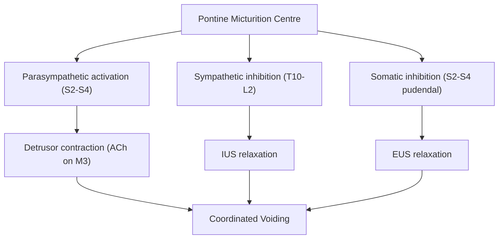
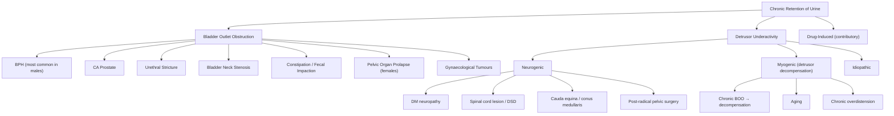
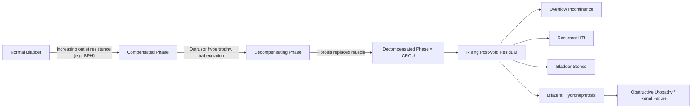

# Chronic Retention of Urine (CROU)

## 1. Definition

***Chronic retention of urine (CROU)*** is defined as a **non-painful bladder** which remains **palpable or percussable after the patient has passed urine** [1]. In other words, it is the **persistent inability to completely empty the bladder**, resulting in a **significant post-void residual (PVR) volume** — typically > 300 mL, though some definitions use > 200 mL as a threshold.

Let's break the term down:
- **Chronic** = long-standing, gradual onset (as opposed to "acute" = sudden)
- **Retention** = urine is produced but cannot be fully expelled
- **Of urine** = specifically bladder urine (distinguishing this from anuria, where the kidneys simply are not producing urine)

The key conceptual distinction from acute retention of urine (AROU):

| Feature | AROU | CROU |
|---|---|---|
| **Onset** | ***Sudden*** | ***Gradual, insidious*** |
| **Pain** | ***Painful*** (innervation intact, bladder rapidly distends) | ***Usually painless*** (slow stretch → sensory adaptation; or innervation abnormal) |
| **Mechanism** | Typically normal innervation with mechanical obstruction (e.g. BPH) | ***Often abnormal innervation (e.g. DM neuropathy) or longstanding obstruction → decompensated detrusor*** |
| **Presentation** | Patient cannot void at all, distressed | ***Vague lower abdominal distension***, overflow incontinence, may still void small amounts |
| **Typical example** | ***BPH with precipitant*** | ***Hypocontractile bladder (e.g. diabetic cystopathy)*** |

> [1] [2]

<Callout title="Why is CROU Painless?">
The bladder distends slowly over weeks to months. Visceral pain afferents (carried via pelvic splanchnic nerves S2–S4) adapt to slow, sustained stretch — this is sensory accommodation. In many CROU patients the innervation itself is abnormal (e.g. diabetic autonomic neuropathy), further blunting the sensation of fullness. In AROU, rapid distension over hours overwhelms the accommodation mechanism, causing severe suprapubic pain.
</Callout>

---

## 2. Epidemiology

### 2.1 Prevalence and Incidence
- **CROU is substantially underdiagnosed** because it is painless and patients often do not present until complications (overflow incontinence, renal impairment, recurrent UTI) bring them to medical attention.
- In men, the prevalence increases steeply with age — mirroring the prevalence of BPH and neurological conditions:
  - ***50% of patients at age 50 have LUTS related to BPH*** [3], and a proportion of these will progress to CROU if untreated.
  - Up to **10% of men in their 70s** and **~30% of men in their 80s** will develop some form of urinary retention over a 5-year period [1] [2].
- In women, CROU is much rarer since the female urethra is short and bladder outlet obstruction (BOO) is anatomically uncommon; when it occurs, **detrusor underactivity (DUA)** is the dominant mechanism.

### 2.2 Sex Differences

| | Male | Female |
|---|---|---|
| **Relative frequency** | Much more common | Rare (~3/100,000/year for AROU; CROU even rarer) |
| **Dominant mechanism** | ***Bladder outlet obstruction*** (BPH chief cause) | ***Detrusor underactivity*** |
| **Bladder outlet resistance** | Higher physiologically (longer urethra, prostate) | Lower physiologically |
| **Voiding strategy** | Depends more on ***detrusor contraction*** (~60 cmH₂O) | Depends more on ***pelvic floor relaxation*** (~20 cmH₂O) |
| **Common causes of CROU** | BPH (progressive), CA prostate, urethral stricture, neurological | DM neuropathy, neurogenic bladder, pelvic organ prolapse, post-pelvic surgery |

> [1] [2]

### 2.3 Risk Factors

***Risk factors for male urinary retention (Olmsted County Study)*** [1]:
- ***Increasing age***
- ***Increasing prostate size***
- ***Increasing BPH symptoms (IPSS)***
- ***Decreasing maximal urine flow rate (Qmax)***

Additional risk factors relevant to CROU specifically:
- **Diabetes mellitus** — diabetic autonomic neuropathy → detrusor underactivity (this is a major cause, especially in Hong Kong where DM prevalence is ~10%)
- **Neurological disease** — multiple sclerosis, Parkinson's disease, spinal cord pathology
- **Chronic obstruction left untreated** — decompensated bladder that cannot recover contractility
- **Medications** — chronic use of anticholinergics, opioids, or drugs with bladder-relaxant effects
- **Advanced age** — independent effect on detrusor muscle contractility (sarcopenia of detrusor)

---

## 3. Anatomy and Function Relevant to CROU

Understanding CROU requires a solid grasp of the normal micturition cycle and the relevant anatomy. Let me walk through this systematically.

### 3.1 Anatomy of the Lower Urinary Tract

#### The Bladder (Detrusor)
- The bladder wall is composed of the **detrusor muscle** — three layers of smooth muscle (inner longitudinal, middle circular, outer longitudinal) that function as a single unit.
- The **detrusor** is named from Latin *detrudere* = "to push down" — its job is literally to push urine out.
- Normal bladder capacity: **400–600 mL**; first sensation of filling at ~150–200 mL.
- The bladder must have two properties:
  1. **Compliance** (storage phase): ability to accommodate increasing volumes at low pressure
  2. **Contractility** (voiding phase): ability to generate sustained contraction to expel urine

#### The Bladder Outlet
- **Internal urethral sphincter (IUS)**: smooth muscle at bladder neck, under **sympathetic (α₁-adrenergic)** control → tonically contracted during storage
- **External urethral sphincter (EUS)**: striated muscle (rhabdosphincter), under **somatic (pudendal nerve, S2–4)** voluntary control → can be voluntarily contracted to defer voiding
- In **males**: the **prostate gland** surrounds the prostatic urethra → any enlargement (BPH, CA prostate) directly compresses the urethra

#### The Prostate
- ***Transitional zone*** → ***common site of BPH (median lobe)*** — BPH is more symptomatic since it is located centrally around the urethra [3]
- ***Peripheral zone*** → ***common site of prostate cancer (posterior lobe)*** — CA prostate usually presents late because it is at the periphery and does not obstruct the urethra until advanced [3]
- Prostate growth is driven by **dihydrotestosterone (DHT)**, converted from testosterone by **5α-reductase** in prostatic stromal and epithelial cells

### 3.2 Neural Control of Micturition

This is critical for understanding why neurological lesions cause CROU.

#### Storage Phase
- As the bladder fills, stretch receptors in the bladder wall send afferent signals via **pelvic splanchnic nerves (S2–S4)** to the spinal cord.
- During storage, two things keep you continent:
  1. **Sympathetic outflow (T10–L2, hypogastric nerve)**: releases **noradrenaline** →
     - **β₃ receptors on detrusor** → detrusor relaxation (bladder stretches without contracting)
     - **α₁ receptors on bladder neck/IUS** → sphincter contraction (outlet closed)
  2. **Somatic outflow (S2–S4, pudendal nerve)**: tonic contraction of EUS (voluntary control available)
  3. **Parasympathetic activity is suppressed** by higher centres

#### Voiding Phase
- When voluntary decision to void is made, the **pontine micturition centre (PMC, Barrington's nucleus)** coordinates the switch:
  1. **Parasympathetic activation (S2–S4, pelvic nerve)**: releases **acetylcholine** → **M₃ muscarinic receptors on detrusor** → sustained detrusor contraction
  2. **Sympathetic inhibition**: relaxation of IUS
  3. **Somatic inhibition**: relaxation of EUS
  4. **Result**: coordinated high-pressure detrusor contraction against a relaxed outlet → voiding

#### Why Does This Matter for CROU?

***Detrusor sphincter dyssynergia (DSD)*** [2]:
- ***Cause: spinal cord injury, pontine stroke***
- ***Mechanism: interruption of descending control by pontine micturition centre***
- ***i.e. failure of detrusor-sphincter coordination → synchronous contraction of both detrusor and sphincters***
- ***Consequence: ↑↑ urinary tract pressure → upper tract damage***

In CROU, the problem is either:
1. **The detrusor cannot generate enough pressure** (detrusor underactivity/hypocontractility) — e.g. DM neuropathy damages parasympathetic fibres → weak/absent detrusor contraction
2. **The outlet resistance is too high** (chronic BOO) — e.g. BPH gradually obstructs → detrusor initially compensates by hypertrophy → eventually decompensates (stretched beyond ability to contract)
3. **Coordination failure** — e.g. DSD from spinal lesion

---

## 4. Etiology (Focus on Hong Kong)

The causes of CROU can be organized into two broad mechanistic categories: **bladder outlet obstruction (BOO)** and **detrusor underactivity (DUA)**. In practice, many patients have elements of both.

### 4.1 Bladder Outlet Obstruction (BOO) — Chronic/Progressive

This is the dominant mechanism in **males**.

#### 4.1.1 Benign Prostatic Hyperplasia (BPH)
- **The single most common cause of BOO and CROU in men**
- ***BPH accounts for 53% of urinary retention cases*** [1]
- ***Pathophysiology has two components*** [3] [4]:
  - ***Static component***: stromal hyperplasia in the transitional zone → physical compression of the prostatic urethra → mediated by **DHT via 5α-reductase** → this is the target of **5α-reductase inhibitors (5ARI)**
  - ***Dynamic component***: ***smooth muscle hypertrophy and contraction*** mediated by ***α₁-adrenergic receptors*** in the prostatic stroma and bladder neck → this is the target of ***α₁-blockers***
- ***Additionally: detrusor instability causing overactive bladder (irritation component)*** [3]
- ***Complications of BPH*** [1] [3]:
  - ***Prostate level: bleeding (ruptured dilated bladder neck veins)***
  - ***Bladder level: AROU, recurrent UTI, bladder stone, diverticulum, chronic ROU ± overflow incontinence***
  - ***Upper tract: recurrent hydronephrosis, obstructive uropathy, renal failure***

<Callout title="BPH Progression to CROU">
In BPH, the detrusor initially compensates for increased outlet resistance by **hypertrophy** (thicker muscle generates more pressure). Over time, the hypertrophied detrusor develops fibrosis (collagen replaces muscle), loses compliance, and eventually **decompensates** — it can no longer generate adequate contraction pressure. The result is a large, atonic, poorly contractile bladder with significant post-void residual = CROU.
</Callout>

#### 4.1.2 Carcinoma of the Prostate
- ***CA prostate accounts for ~7% of retention cases*** [1]
- Usually presents late with obstruction since it arises in the ***peripheral zone*** [3]
- In Hong Kong: **3rd most common cancer among males**, lifetime risk ~1/26, annual incidence ~2,300 cases [3]
- Locally advanced disease can invade bladder neck and prostatic urethra → BOO → CROU

#### 4.1.3 Urethral Stricture
- ***Accounts for ~3.5% of retention cases*** [1]
- Causes: previous instrumentation (e.g. catheterization, cystoscopy, TURP), STDs (gonococcal urethritis — still relevant in Hong Kong), trauma
- Mechanism: fibrous scarring narrows the urethral lumen → progressive BOO

#### 4.1.4 Other Mechanical Causes
- **Bladder neck stenosis** — typically post-prostate surgery (post-TURP, post-radical prostatectomy)
- **Bladder/urethral stones** — can cause intermittent or chronic obstruction
- **Bladder tumour** — large tumours at the bladder neck
- **Phimosis** (tight foreskin) — severe cases can cause BOO
- **Constipation/fecal impaction** — ***accounts for 7.5%*** [1] — the loaded rectum compresses the prostatic urethra against the pubic symphysis (this is why you should always ask about bowel habit!)

#### 4.1.5 Causes in Females (Less Common)
- **Pelvic organ prolapse**: cystocele, rectocele, uterovaginal prolapse → kinks the urethra
- **Gynaecological tumours**: e.g. large uterine fibroids, ovarian tumours compressing the bladder outlet
- **Urethral stricture** (rare in females)

### 4.2 Detrusor Underactivity / Hypocontractility (DUA)

This is the dominant mechanism in **females** and is increasingly recognized as important in **elderly males** with longstanding BOO.

#### 4.2.1 Neurogenic Causes

***Neurogenic bladder: bladder dysfunction associated with other neurological deficit*** [1]
- ***e.g. SCI, CVA, parkinsonism*** [1]

**Categorized by level of lesion:**

| Level | Examples | Mechanism | Bladder Type |
|---|---|---|---|
| **Suprapontine** | Stroke, Parkinson's disease, MS, NPH, MSA, dementia | Loss of cortical inhibition of PMC → detrusor overactivity (usually causes UUI, not CROU) | Overactive detrusor, but may have incomplete emptying |
| **Spinal (suprasacral)** | SCI above S2, vertebral metastasis, spinal stenosis, transverse myelitis, MS plaques in spinal cord | Loss of PMC coordination → ***DSD*** → high-pressure voiding with incomplete emptying | DSD → CROU with high pressures → ***upper tract damage*** |
| **Spinal (sacral/infrasacral)** | Cauda equina syndrome, conus medullaris lesion, spina bifida | Damage to parasympathetic outflow (S2–S4) → areflexic/atonic bladder | Acontractile detrusor → CROU |
| **Peripheral nerve** | ***Diabetic neuropathy***, radical pelvic surgery (APR, radical hysterectomy), GBS | Damage to autonomic nerves supplying detrusor | Hypocontractile/acontractile detrusor → CROU |

<Callout title="Diabetic Cystopathy — A Major Cause in Hong Kong" type="idea">
With DM prevalence ~10% in Hong Kong, diabetic cystopathy is one of the most important causes of CROU. The pathophysiology is progressive autonomic neuropathy (parasympathetic S2–S4 fibres) → impaired detrusor contractility. Additionally, sensory neuropathy blunts the perception of bladder fullness, so patients don't feel the urge to void → progressive overdistension → further detrusor decompensation. This creates a vicious cycle.
</Callout>

#### 4.2.2 Myogenic Causes
- **Detrusor decompensation from chronic BOO**: as described above in BPH → muscle fibrosis → irreversible loss of contractility
- **Aging**: age-related loss of smooth muscle cells, increased collagen deposition, reduced cholinergic innervation density
- **Chronic overdistension**: repeated episodes of bladder overdistension (e.g. chronic voluntary retention, immobility) → disruption of actin-myosin overlap → irreversible damage

#### 4.2.3 Idiopathic DUA
- Many cases (especially in women) remain idiopathic after full work-up

### 4.3 Drug-Induced (Contributory Factor)

Drugs rarely cause CROU alone but frequently **precipitate or worsen** chronic retention:

| Drug Class | Mechanism | Examples |
|---|---|---|
| **Anticholinergics** | Block M₃ receptors on detrusor → reduce contraction | Oxybutynin, solifenacin, atropine, antihistamines (diphenhydramine), antipsychotics (chlorpromazine), TCAs (amitriptyline) |
| **Sympathomimetics (α-agonists)** | Stimulate α₁ receptors at bladder neck → increase outlet resistance | Phenylephrine, pseudoephedrine (common in OTC cold medications in HK!) |
| **Sympathomimetics (β-agonists)** | Stimulate β₃ receptors on detrusor → relax detrusor | Terbutaline, salbutamol (bronchodilators) |
| **Opioids** | Central and peripheral inhibition of detrusor; increased sphincter tone | Morphine, codeine, tramadol |
| **Antidepressants** | Anticholinergic effects (esp TCAs); SSRIs may also impair voiding | Amitriptyline, nortriptyline |
| **Antipsychotics** | Anticholinergic + α-blocking effects | Chlorpromazine, olanzapine |
| **Muscle relaxants** | Central sedation + direct smooth muscle relaxation | Baclofen, diazepam |

> [1] [2] [3]

### 4.4 Summary of Etiology: Organized Framework

---

## 5. Pathophysiology

### 5.1 The Decompensation Model — How BOO Leads to CROU

This is the classic pathway, best exemplified by BPH:

1. **Early compensated phase**: BOO → detrusor must work harder → detrusor **hypertrophy** (just like the heart hypertrophies in response to aortic stenosis)
   - Clinically: patient has **obstructive LUTS** (hesitancy, weak stream, straining) but can still void
   - The thickened detrusor also develops **trabeculation** (visible ridges of muscle bundles on cystoscopy)

2. **Intermediate phase**: continued obstruction → detrusor develops **instability** (overactivity)
   - Clinically: **irritative/storage LUTS** develop (frequency, urgency, nocturia) — because the hypertrophied detrusor generates involuntary contractions
   - **Diverticula** may form where mucosa herniates between hypertrophied muscle bundles

3. **Late decompensated phase**: collagen replaces smooth muscle → loss of compliance and contractility → the bladder becomes a **large, floppy, atonic sac**
   - Clinically: **rising post-void residual volume** → CROU
   - The patient may still void, but incompletely — they dribble urine (***overflow incontinence***)
   - The detrusor can no longer generate sufficient pressure to overcome the obstruction

4. **Consequences of CROU** (see Complications section in next installment):
   - ***Recurrent UTI*** (stagnant urine = culture medium for bacteria)
   - ***Bladder stone formation*** (urinary stasis → crystallization)
   - ***Hydroureter and hydronephrosis*** (back-pressure transmitted to upper tracts)
   - ***Obstructive uropathy / renal impairment / ARF*** (bilateral obstruction → post-renal AKI)

> ***Consequences of BOO: Retention of urine (acute or chronic), Recurrent UTI, Formation of bladder calculi, Hydroureter and hydronephrosis, Renal impairment / ARF (Obstructive uropathy)*** [1]

### 5.2 The Neurogenic Model — How Nerve Damage Leads to CROU

In diabetic cystopathy (the prototype):

1. **Sensory neuropathy** → impaired perception of bladder fullness → patient does not feel the urge to void → bladder stretches beyond normal capacity
2. **Autonomic (parasympathetic) neuropathy** → impaired detrusor contraction → inadequate voiding pressure
3. **Chronic overdistension** → mechanical disruption of detrusor muscle (sarcomere stretch beyond optimal length → reduced actin-myosin overlap = Frank-Starling-like failure of the bladder)
4. **Result**: large-capacity, low-pressure, poorly contractile bladder with huge PVR

<Callout title="The Frank-Starling Analogy" type="idea">
Just like a heart ventricle that is chronically overdistended eventually fails (dilated cardiomyopathy), a chronically overdistended bladder eventually loses its ability to contract. The muscle fibres are stretched beyond the point of optimal actin-myosin overlap. This is why prolonged catheter drainage is often needed in CROU — to allow the detrusor to "rest" and potentially recover some contractility.
</Callout>

### 5.3 Detrusor Sphincter Dyssynergia (DSD)

A special pathophysiological pattern in **suprasacral spinal cord lesions**:

- Normally, the PMC coordinates simultaneous detrusor contraction + sphincter relaxation
- In DSD, the spinal cord lesion interrupts descending PMC control → the detrusor contracts (via local spinal reflex arc) BUT the sphincter also contracts simultaneously
- Result: **very high intravesical pressures** (detrusor pushing against a closed outlet)
- This is dangerous because high pressures are transmitted to the upper tract → hydronephrosis → **renal damage**
- CROU in DSD is characterized by: incomplete emptying, high PVR, high voiding pressures, and risk of **upper tract deterioration** and **autonomic dysreflexia** (in lesions above T6)

### 5.4 Why CROU Is More Dangerous Than AROU

This is a crucial teaching point:

- **AROU** is dramatic and painful → patients present quickly → catheterized and treated promptly → reversible
- **CROU** is insidious and painless → patients present **late** → often with **established complications**:
  - **Renal impairment** (may be advanced by the time of diagnosis — "silent" obstructive nephropathy)
  - **Bilateral hydronephrosis** (chronically elevated back-pressure)
  - **Overflow incontinence** (often misdiagnosed as stress or urge incontinence)
  - **Recurrent UTIs** (stagnant urine)
  - **Bladder stones**
  - ***Post-obstructive diuresis*** after catheterization (the kidneys, previously obstructed, produce large volumes of dilute urine — can cause dangerous fluid/electrolyte shifts)

<Callout title="Clinical Pearl: Always Check PVR in Elderly with Incontinence" type="error">
Overflow incontinence from CROU is commonly **misdiagnosed** as urge or stress incontinence, especially in elderly patients. The giveaway is a **palpable bladder** or significant **post-void residual on ultrasound**. Always perform a bedside bladder scan in any elderly patient presenting with incontinence, recurrent UTI, or unexplained renal impairment!
</Callout>

---

## 6. Classification

CROU can be classified by several frameworks:

### 6.1 By Underlying Mechanism

| Category | Description | Typical Causes |
|---|---|---|
| **High-pressure CROU** | Detrusor generates high pressure but cannot overcome outlet | BOO (BPH, stricture), DSD |
| **Low-pressure CROU** | Detrusor fails to generate adequate contraction | DUA (neurogenic, myogenic, idiopathic) |

This distinction is critical because:
- **High-pressure CROU** → greater risk of upper tract damage (hydronephrosis, renal impairment)
- **Low-pressure CROU** → lower risk of upper tract damage (bladder acts as a low-pressure reservoir) but still causes UTI, stones, overflow incontinence

### 6.2 By Etiology (as above)
- **Obstructive** (BOO)
- **Non-obstructive** (DUA — neurogenic, myogenic, idiopathic)
- **Mixed** (most common in elderly men with BPH + age-related DUA)

### 6.3 Abrams-Griffiths Classification (Urodynamic)
Based on detrusor pressure at maximum flow (PdetQmax) and maximum flow rate (Qmax):
- **Obstructed**: high PdetQmax, low Qmax
- **Equivocal**: intermediate values
- **Unobstructed**: low PdetQmax, low Qmax (= detrusor underactivity)

---

## 7. Clinical Features

### 7.1 Symptoms

CROU develops insidiously, so patients often present late with complications rather than with the retention itself. The symptoms can be organized as:

#### 7.1.1 Lower Urinary Tract Symptoms (LUTS)

***LUTS: both obstructive and irritative*** [3]

**Voiding/Obstructive symptoms** (reflect the difficulty in emptying):
- **Hesitancy**: delay in initiating micturition → *because the detrusor must generate higher pressure to overcome increased outlet resistance; in DUA, the detrusor takes longer to mount a contraction*
- **Weak stream**: reduced force and calibre of urinary stream → *because flow rate is determined by detrusor pressure minus outlet resistance; in BOO the outlet resistance is high; in DUA the detrusor pressure is low*
- **Straining**: need to use abdominal muscles to augment voiding → *Valsalva manoeuvre increases intravesical pressure to compensate for inadequate detrusor pressure*
- **Intermittency**: stream starts and stops → *detrusor fatigue during voiding; muscle cannot sustain contraction*
- **Prolonged voiding time**: takes unusually long to empty bladder → *low flow rate*
- **Terminal dribbling**: dribbling at the end of micturition → *weakened detrusor cannot fully expel the last drops; urethral milk-back*
- **Feeling of incomplete emptying**: sensation of residual urine → *because there IS residual urine! This is actually quite specific for CROU*

**Storage/Irritative symptoms** (reflect secondary bladder dysfunction):
- **Frequency**: voiding > 8 times/day → *functional bladder capacity is reduced because the bladder is already partially full with residual urine; also, detrusor overactivity from chronic obstruction*
- **Nocturia**: waking ≥ 1 time at night to void → *same mechanism + supine position redistributes peripheral oedema fluid back to circulation → increased renal perfusion → increased urine production at night*
- **Urgency**: sudden compelling desire to void → *detrusor overactivity from chronic obstruction/instability*

**Overflow symptoms** (the hallmark of CROU):
- ***Overflow incontinence***: ***constant dribbling (especially at night)*** → *the chronically overfull bladder exceeds the outlet resistance → urine passively leaks out; worse at night because abdominal and pelvic floor muscles relax during sleep and supine position increases venous return → more urine production*
- **Wetting of clothes/bedding** without awareness → *reflects loss of normal voiding sensation (especially in neurogenic causes)*

#### 7.1.2 Symptoms Related to Complications
- **Recurrent UTIs**: dysuria, cloudy/smelly urine, fever → *stagnant residual urine is an excellent culture medium; also, bladder wall ischaemia from overdistension impairs local immunity*
- **Haematuria**: may be macroscopic → *from bladder stone irritation, UTI, or mucosal congestion from venous obstruction in the prostatic plexus*
- **Renal impairment symptoms**: fatigue, nausea, anorexia, oedema, pruritus → *bilateral hydronephrosis → obstructive uropathy → progressive CKD or AKI*
- **Abdominal distension**: vague, non-painful → *the distended bladder can be massive (up to 2–3 litres)*

#### 7.1.3 Symptoms Related to Underlying Cause
- **BPH/Prostate**: history of longstanding LUTS, previous treatments (alpha-blockers, TURP)
- **Neurological**: back pain, limb weakness, sensory disturbance, saddle anaesthesia, bowel dysfunction (always ask! — concurrent faecal incontinence suggests cauda equina)
- **DM**: longstanding diabetes, peripheral neuropathy symptoms (numbness, tingling in feet), erectile dysfunction (autonomic neuropathy)
- **Medications**: review drug history for anticholinergics, opioids, sympathomimetics

### 7.2 Signs

#### 7.2.1 Abdominal Examination
- ***Palpable bladder***: the distended bladder is palpable as a suprapubic mass arising from the pelvis
  - Bladder is ***palpable when volume > 200 mL*** and ***dull to percussion when > 150 mL*** [2]
  - In CROU, the bladder can be enormous — reaching the umbilicus or beyond
  - ***Vague lower abdominal distension*** — ***usually painless*** (key distinguishing feature from AROU) [1] [2]
  - Characteristically: smooth, midline, arising from pelvis, dull to percussion, cannot get below it

<Callout title="Clinical Pearl: Palpable Bladder ≠ Always Retention" type="error">
A palpable suprapubic mass that is dull to percussion and disappears after catheterization = bladder. But always consider other pelvic masses (ovarian cyst, uterine fibroid, full rectum) in the differential. The key test is catheterization or bedside bladder ultrasound.
</Callout>

#### 7.2.2 Digital Rectal Examination (DRE)
This is **mandatory** in any patient with suspected CROU:

| Finding | Suggests |
|---|---|
| ***Smooth, enlarged > 3 finger-breadths, non-tender, median sulcus present*** | ***BPH*** [3] |
| Asymmetric, hard, irregular, nodular, loss of median sulcus | CA prostate |
| Tender, boggy, warm prostate | Prostatitis |
| Loaded rectum | Fecal impaction as contributor |
| ***Anal tone*** — reduced or absent | Neurological cause (cauda equina) |
| Rectal masses | Rectal CA compressing bladder |

#### 7.2.3 Neurological Examination
- ***Sensory level*** — to detect spinal cord lesion [2]
- **Saddle anaesthesia (S2–S4 dermatomes)** — suggests cauda equina syndrome (**surgical emergency**)
- **Lower limb motor/sensory exam** — weakness, hyperreflexia (UMN lesion), hyporeflexia (LMN/peripheral nerve lesion)
- **Perineal sensation and bulbocavernosus reflex** — tests integrity of the S2–S4 reflex arc

#### 7.2.4 External Genitalia Examination
- **Phimosis**: tight foreskin that cannot be retracted → can cause BOO
- **Meatal stenosis**: narrowed urethral meatus
- **Urethral discharge**: suggests infection (STD-related stricture)

#### 7.2.5 General Examination
- **Signs of renal failure**: pallor, oedema (peripheral, periorbital), uraemic fetor, excoriation marks (pruritus)
- **Signs of DM**: peripheral neuropathy, retinopathy, diabetic foot
- **Cachexia, lymphadenopathy**: may suggest underlying malignancy

---

## 8. Connecting Clinical Features to Pathophysiology — A Summary Table

| Clinical Feature | Pathophysiological Basis |
|---|---|
| **Painless retention** | Slow bladder distension → sensory adaptation; abnormal innervation in neurogenic causes |
| **Palpable bladder** | Chronically distended bladder with large residual volume (often > 500 mL) |
| **Weak stream** | Low detrusor pressure (DUA) or high outlet resistance (BOO) → reduced flow rate |
| **Hesitancy** | Detrusor needs more time to generate sufficient pressure to overcome outlet resistance |
| **Frequency** | Reduced functional capacity (bladder already partially full) + detrusor overactivity |
| **Nocturia** | Nocturnal polyuria (redistribution of peripheral oedema) + reduced functional capacity |
| **Overflow incontinence** | Intravesical pressure exceeds outlet resistance in overfull bladder → passive leakage |
| **Recurrent UTI** | Stagnant residual urine → bacterial colonization and proliferation |
| **Bladder stones** | Urinary stasis → crystallization of solutes |
| **Bilateral hydronephrosis** | Back-pressure from chronically full bladder transmitted to ureters and kidneys |
| **Renal impairment** | Chronic bilateral hydronephrosis → tubular damage → obstructive nephropathy |
| **Post-obstructive diuresis** | After decompression: accumulated urea acts as osmotic diuretic + impaired tubular concentrating ability from chronic pressure damage |

---

## 9. The IPSS (International Prostate Symptom Score)

***IPSS is used to quantify LUTS: obstructive + irritative + QoL*** [3]

A standardized 7-question symptom score used primarily in male patients with LUTS:
- **7 questions** on: incomplete emptying, frequency, intermittency, urgency, weak stream, straining, nocturia
- Each scored 0–5 (total 0–35)
  - **Mild**: 0–7
  - **Moderate**: 8–19
  - **Severe**: 20–35
- Plus a **Quality of Life (QoL) question** scored 0–6
- Useful for: baseline assessment, monitoring treatment response, guiding management decisions

---

## 10. Key Pathophysiology Diagrams

### 10.1 Progression from Normal → BOO → CROU

---

<Callout title="High Yield Summary">

**Definition**: CROU = persistent inability to completely empty the bladder, usually painless (vs. AROU which is painful and acute).

**Key distinction**: AROU = normal innervation, sudden (e.g. BPH precipitated). CROU = often abnormal innervation (e.g. DM) or decompensated detrusor.

**Epidemiology**: Predominantly males (BPH main cause). In females, detrusor underactivity dominates. Risk factors: age, prostate size, LUTS severity, low Qmax, DM, neurological disease.

**Mechanisms**:
1. **BOO** (high-pressure CROU): BPH (53%), CA prostate (7%), urethral stricture (3.5%), constipation (7.5%)
2. **Detrusor underactivity** (low-pressure CROU): DM neuropathy, post-radical pelvic surgery, neurogenic bladder, idiopathic
3. **DSD**: spinal cord lesion → simultaneous detrusor and sphincter contraction → dangerously high pressures → upper tract damage

**BPH pathophysiology**: Static (DHT-mediated stromal hyperplasia → 5ARI target) + Dynamic (α₁-adrenergic smooth muscle contraction → α-blocker target)

**Clinical features**:
- Symptoms: painless, vague lower abdominal distension, obstructive LUTS (weak stream, hesitancy, straining, incomplete emptying), overflow incontinence (constant dribbling esp. at night), complications (recurrent UTI, haematuria, renal impairment)
- Signs: palpable painless bladder, DRE findings (enlarged prostate in BPH, hard nodule in CA prostate, reduced anal tone in neurogenic), neurological signs (sensory level, saddle anaesthesia)

**CROU is more dangerous than AROU** because it is silent and presents late with established complications (bilateral hydronephrosis, CKD, recurrent UTI, bladder stones).

**Always check**: post-void residual (bladder scan), DRE, neurological exam, renal function, drug history.

</Callout>

---

<ActiveRecallQuiz
  title="Active Recall - Chronic Retention of Urine (Definition, Epidemiology, Etiology, Pathophysiology, Clinical Features)"
  items={[
    {
      question: "What is the key clinical difference between AROU and CROU in terms of symptoms, and what is the pathophysiological explanation for this difference?",
      markscheme: "AROU is painful (rapid distension overwhelms visceral pain afferent accommodation, innervation intact). CROU is painless (slow distension allows sensory adaptation; often abnormal innervation e.g. DM neuropathy). CROU presents with vague lower abdominal distension and overflow incontinence rather than acute inability to void."
    },
    {
      question: "Name the two pathophysiological components of BPH that cause bladder outlet obstruction, and state the drug class that targets each component.",
      markscheme: "Static component: stromal hyperplasia mediated by DHT via 5-alpha-reductase, causing physical compression of prostatic urethra. Targeted by 5-alpha-reductase inhibitors (e.g. finasteride, dutasteride). Dynamic component: smooth muscle hypertrophy and contraction via alpha-1 adrenergic receptors. Targeted by alpha-1 blockers (e.g. tamsulosin, alfuzosin)."
    },
    {
      question: "Describe the pathophysiological mechanism of detrusor sphincter dyssynergia (DSD) and explain why it is particularly dangerous for the upper urinary tract.",
      markscheme: "DSD results from suprasacral spinal cord lesions disrupting descending control from the pontine micturition centre. Detrusor contracts (via intact local spinal reflex) but sphincter also contracts simultaneously (loss of coordinated relaxation). This generates very high intravesical pressures which are transmitted retrograde to the upper tracts, causing hydronephrosis and renal damage."
    },
    {
      question: "List five complications of chronic retention of urine and briefly explain the mechanism of each.",
      markscheme: "1. Overflow incontinence (intravesical pressure exceeds outlet resistance). 2. Recurrent UTI (stagnant residual urine promotes bacterial growth). 3. Bladder stone formation (urinary stasis allows crystal nucleation). 4. Bilateral hydronephrosis (back-pressure from chronically full bladder). 5. Obstructive uropathy/renal failure (chronic bilateral hydronephrosis causes tubular damage). 6. Post-obstructive diuresis after decompression."
    },
    {
      question: "A 72-year-old man with poorly controlled diabetes presents with constant dribbling of urine, recurrent UTIs, and a creatinine of 280 micromol/L. On examination, you find a large painless suprapubic mass. What is the most likely diagnosis, and what is the underlying pathophysiology?",
      markscheme: "Chronic retention of urine with overflow incontinence complicated by obstructive uropathy. Underlying pathophysiology: diabetic autonomic neuropathy causing detrusor underactivity (parasympathetic S2-S4 damage), plus sensory neuropathy blunting perception of bladder fullness. Chronic overdistension leads to further detrusor decompensation. Back-pressure causes bilateral hydronephrosis and renal impairment."
    },
    {
      question: "Why is CROU considered more clinically dangerous than AROU, despite being less symptomatic?",
      markscheme: "CROU is painless and insidious so patients present late. By the time of diagnosis, complications are often already established: bilateral hydronephrosis, obstructive nephropathy with CKD or AKI, recurrent UTIs, bladder stones. AROU is painful so patients present early and are catheterized promptly, making it usually reversible. Additionally, post-obstructive diuresis after catheterization of CROU can cause dangerous fluid and electrolyte shifts."
    }
  ]}
/>

---

## References

[1] Lecture slides: GC 180. Benign prostatic hyperplasia, bladder outlet obstruction and urinary retention.pdf (pp. 22, 23, 27, 30, 31, 33, 46, 62)
[2] Senior notes: Ryan Ho Urogenital.pdf (pp. 159, 164, 165); Ryan Ho Fundamentals.pdf (pp. 349, 350)
[3] Senior notes: maxim.md (sections: BPH, AROU, Urinary incontinence, Prostate cancer); felixlai.md (sections: AROU, BPH)
[4] Lecture slides: Benign Prostatic Hyperplasia.pdf (p. 5)
[5] Lecture slides: GC 209. Urinary incontinence and overactive bladder.pdf (pp. 12, 20, 30)
