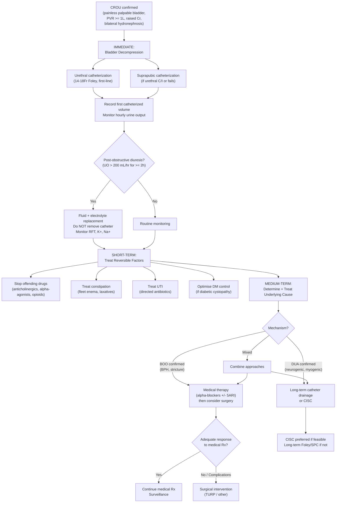

## Management of Chronic Retention of Urine

The management of CROU is fundamentally different from AROU. In AROU, you catheterise, treat the precipitant, and attempt a trial without catheter (TWOC) within days. In CROU, the bladder has been decompensated for a long time, the patient often has established complications (hydronephrosis, renal impairment, recurrent UTIs), and the detrusor may never recover. Management must therefore be **staged** and **cause-directed**.

Let me walk through this systematically.

---

### 1. Principles of Management

Before diving into specifics, understand the overarching goals:

1. **Immediate**: Decompress the bladder safely → prevent/reverse obstructive uropathy → manage post-obstructive diuresis
2. **Short-term**: Treat reversible precipitants (drugs, constipation, UTI) → optimise renal function
3. **Medium-term**: Determine and treat the underlying cause (BOO vs. DUA)
4. **Long-term**: Prevent recurrence → ensure ongoing bladder drainage if detrusor cannot recover → surveillance for complications

---

### 2. Overall Management Algorithm (Mermaid Diagram)

---

### 3. Immediate Management — Bladder Decompression

This is the single most important step. A chronically distended bladder causes bilateral hydronephrosis and obstructive uropathy — decompression can reverse this if done before irreversible renal damage occurs.

#### 3.1 Urethral Catheterization (First-Line)

***Immediate bladder decompression by urethral catheterization (first-line) by 14–18Fr Foley's catheter*** [2]

**Procedure** [2] [3]:
1. **Aseptic technique**: clean genital area with aqueous hibitane (chlorhexidine), drape surrounding areas
2. **Intraurethral local anaesthetic**: apply xylocaine jelly around meatal opening → milk jelly down urethra → wait 5 minutes
3. **Insertion**: use forceps to hold 14Fr Foley's catheter → insert all the way down using no-touch technique
4. **Fixation**: inject 10 mL of water-for-injection into balloon → withdraw catheter until resistance encountered (balloon sitting at bladder neck)
5. **Connect to drainage bag** and **record first catheterized volume**

**Key points for CROU specifically**:
- ***First catheterized volume > 1000 mL indicates possible chronic retention*** [3]
- ***Monitor first catheterization volume and hourly urine output (Q1H)*** [3]
- **Do NOT clamp the catheter intermittently** — gradual decompression has NOT been shown to reduce complications compared to complete drainage; just let it drain freely
- **Send catheterized urine for microscopy, culture and sensitivity (C/ST)** [2]

**Catheter sizing** [3]:
- Males: ***14–18 Fr*** (start with 14Fr)
- Females: ***12–16 Fr***

***Failure to pass catheter into bladder*** [2] [3]:

| Situation | Likely Cause | Solution |
|---|---|---|
| Resistance at prostatic urethra | ***Enlarged prostate (BPH)*** | ***Use thicker catheter (20–22 Fr)*** — stiffer, pushes through enlarged prostate |
| Catheter stuck proximally along penile urethra | ***Urethral stricture*** | ***Use thinner catheter (10–12 Fr)*** |
| Still cannot pass | | ***Tiemann catheter*** (curved tip designed for BPH), cystoscopic-guided Foley insertion, urethral dilators (for strictures) |
| All attempts fail | | ***Suprapubic catheterization (SPC)*** |

**Contraindications to urethral catheterization** [2] [3]:
- ***Absolute: urethral injury*** (signs: blood at urethral meatus, high-riding prostate on DRE — typically associated with pelvic fracture)
- ***Relative: urethral stricture, recent urinary tract surgery (radical prostatectomy, urethral reconstruction), presence of artificial sphincter***

#### 3.2 Suprapubic Catheterization (SPC)

***Suprapubic catheterization (SPC)*** [2]:
- ***Indications: failed urethral catheterization, history of urethral trauma (e.g. straddle injury), long-term bladder drainage expected (> 3 weeks)***
- ***Contraindications: non-distended bladder, uncorrected bleeding tendency, known/suspected urothelial CA***

**Procedure** [2]:
- LA injected 2 finger-breadths above pubic symphysis
- Small incision made in skin/fascia → insert trocar-type suprapubic tube → catheter advanced over trocar → sutured in place → look for gush of urine

**Complications of SPC** [2]:
- ***Bowel perforation, rectal injury (overshooting), haematuria***

**Advantages of SPC over long-term urethral catheter** [3]:
- Prevents urethral trauma and stricture formation
- Prevents urinary sphincter dysfunction leading to incontinence
- Reduces catheter-associated UTI (CAUTI)
- Allows assessment of patient's ability to void before removing catheter

<Callout title="Choosing the Right Catheter Type for CROU" type="idea">

| Type | Best For | Duration |
|---|---|---|
| **Indwelling urethral Foley** | Short-term drainage ( < 3 weeks) | Latex: max 2 weeks; Silicone: max 4 weeks |
| **Clean intermittent self-catheterization (CISC)** | Long-term management of DUA/neurogenic bladder; reduced CAUTI risk | Indefinite |
| ***Suprapubic catheter (SPC)*** | ***Long-term drainage*** expected ( > 3 weeks); failed urethral catheterization; urethral injury | Indefinite (changed every 4–6 weeks) |

[3]
</Callout>

#### 3.3 Managing Post-Obstructive Diuresis — The Critical Complication of Decompression

***Post-obstructive diuresis: defined as diuresis > 200 mL/hr for ≥ 2 hours*** [3]

This is ***primarily a problem of chronic but not acute urinary retention*** [3]. Let me explain why from first principles:

**Why does post-obstructive diuresis happen?**
1. **Accumulated solute load**: during the period of obstruction, the kidneys continue to filter (albeit impaired) → urea, sodium, and water accumulate in the body → once obstruction is relieved, the kidneys excrete this accumulated load → **osmotic diuresis** (urea acts as an osmotic diuretic)
2. **Impaired tubular concentrating ability**: chronic back-pressure damages the renal tubules → the kidneys lose their ability to concentrate urine → produce large volumes of dilute urine (similar to nephrogenic DI)
3. **ANP and natriuretic peptide release**: volume overload during obstruction → atrial/ventricular stretch → ANP/BNP release → promotes sodium and water excretion once obstruction is relieved

**Clinical significance**: the patient can lose **litres** of fluid and electrolytes rapidly → dehydration, hypotension, hypokalaemia, hyponatraemia, hypernatraemia → potentially life-threatening

**Management** [3]:
- ***Monitor urine output Q1H*** — if > 200 mL/hr for ≥ 2 hours, this is significant post-obstructive diuresis
- ***Do NOT remove Foley catheter*** — the diuresis needs to resolve; removing the catheter may lead to re-retention and worsening hydronephrosis [3]
- ***Patients normally can manage the increase in urine output by increasing oral fluid intake*** [3]
- ***Isotonic saline replacement is indicated if patients are unable to increase fluid intake*** [3]
- **Monitor electrolytes**: serial RFT (Cr, K⁺, Na⁺, urea) at least twice daily
- **Fluid replacement strategy**: replace ~50–75% of the previous hour's urine output with IV normal saline; do NOT match 100% output (this perpetuates the diuresis) — allow gradual physiological correction
- **Watch for**: hypokalaemia (may need K⁺ supplementation), hyponatraemia, hypernatraemia (free water deficit if tubular concentrating defect)

<Callout title="Do NOT Over-Replace Fluids!" type="error">
A common mistake is to match the urine output 1:1 with IV fluids. This actually perpetuates the diuresis because you are giving the kidneys more fluid to excrete. Replace approximately 50–75% of output to allow gradual correction. If the patient can drink, encourage oral intake instead. The diuresis typically resolves within 24–48 hours as the solute load clears and tubular function recovers.
</Callout>

#### 3.4 Other Complications of Decompression [3]

| Complication | Mechanism | Management |
|---|---|---|
| ***Post-obstructive diuresis*** | Osmotic diuresis + tubular damage (see above) | Fluid/electrolyte monitoring and replacement |
| ***Haematuria (haemorrhage ex vacuo)*** | Rapid decompression → mucosal disruption → bleeding from previously compressed submucosal veins | Usually self-limiting; if significant, continuous bladder irrigation with 3-way catheter |
| ***Transient hypotension*** | Rapid drainage of large volume → vagal response + reduced intra-abdominal pressure → reduced venous return | Lie patient flat, IV fluids; drain slowly if very large volumes |
| ***Urethral stricture*** | Traumatic catheterization | Careful technique; use appropriate size |
| ***UTI / CAUTI*** | Introduction of bacteria during catheterization; biofilm on catheter | Aseptic technique; remove catheter ASAP; antibiotics if symptomatic |

---

### 4. Short-Term Management — Treating Reversible Factors

Before committing the patient to long-term treatment or surgery, always look for and treat **reversible precipitants**.

***Treat reversible causes: stop offending drugs, treat constipation (e.g. fleet enema) and UTI*** [3]

| Reversible Factor | Action | Rationale |
|---|---|---|
| ***Offending drugs*** | ***Stop or substitute sympathomimetics, anticholinergics, opioids, antidepressants*** | Remove pharmacological impairment of detrusor contraction or increase in outlet resistance |
| ***Constipation/fecal impaction*** | ***Fleet enema, laxatives, manual disimpaction if needed*** | Loaded rectum compresses prostatic urethra → exacerbates BOO |
| ***UTI*** | Directed antibiotics based on C/ST | Infection → bladder mucosal oedema → worsened obstruction; also a complication of stasis |
| **Poorly controlled DM** | Optimise glycaemic control | Reduce ongoing autonomic neuropathy damage |
| **Acute prostatitis** | Antibiotics (fluoroquinolones for prostate penetration) | Swollen inflamed prostate → worsened BOO |
| **Dehydration** | IV fluids | Adequate hydration needed for renal recovery |

---

### 5. Medium-Term Management — Cause-Directed Treatment

Once the bladder is decompressed and reversible factors are addressed, the next step depends on the **underlying mechanism** (BOO vs. DUA).

#### 5.1 Management of BOO — The BPH Pathway (Most Common)

This follows the **stepwise approach**: Conservative → Medical → Surgical [2] [3]

##### 5.1.1 Conservative / Lifestyle Measures

***Medical advice: avoid fluids prior to bedtime or before going out; reduce consumption of caffeine and alcohol; double voiding to empty bladder more completely*** [3]

| Measure | Rationale |
|---|---|
| Reduce evening fluid intake | Reduce nocturia |
| Reduce caffeine and alcohol | Both are bladder irritants and diuretics |
| Double voiding | Void, wait a minute, void again → empties more residual |
| Timed voiding | Void by the clock (every 2–3 hours) to prevent overdistension |
| Avoid constipation | High-fibre diet, adequate hydration → reduce rectal pressure on urethra |
| Review medications | Stop any contributory drugs |

**Indications**: ***Mild/moderate symptoms, not bothersome (watchful waiting)*** [2]

##### 5.1.2 Medical Therapy

***Indications for treatment: IPSS moderate or above (≥ 8) or complications*** [3]

###### α₁-Adrenergic Blockers (First-Line Medical Therapy)

***α₁-adrenergic blockers: relax smooth muscles in prostate and bladder neck (NOT detrusor body)*** [3]

- **Mechanism**: block α₁-adrenergic receptors on smooth muscle in the prostatic stroma and bladder neck → reduce the **dynamic component** of BOO → decrease outlet resistance → improve voiding
- **Onset**: rapid — within **days to 1–2 weeks** (unlike 5ARI which take months)
- **Types**:

| Drug | Selectivity | Key Side Effects | Notes |
|---|---|---|---|
| ***Prazosin (Minipress)*** | ***Non-selective*** | ***More orthostatic hypotension, nasal congestion, dizziness, tiredness*** | Needs dose titration |
| ***Terazosin (Hytrin)*** | Non-selective | Same as above | |
| ***Doxazosin (Cardura)*** | Non-selective | Same as above | |
| ***Alfuzosin (Xatral)*** | Non-selective (but more uroselective in practice) | Less postural hypotension | ***Commonly prescribed as first alpha-blocker for TWOC*** [3] |
| ***Tamsulosin (Harnal)*** | ***Selective (α₁A)*** | ***More retrograde ejaculation*** | More uroselective → less hypotension |
| ***Silodosin (Rapaflo)*** | Selective (α₁A) | Retrograde ejaculation (higher rate) | Most selective |

***To reduce side effects: slow titration, subtype-selective (α₁A), slow-release formulations*** [3]

<Callout title="Why Non-Selective α-Blockers Cause Orthostatic Hypotension">
α₁-receptors are found not only in the prostate but also in systemic blood vessel smooth muscle. Blocking these receptors causes vasodilation → reduced peripheral resistance → orthostatic hypotension. Selective α₁A-blockers (tamsulosin, silodosin) preferentially target the prostate subtype and spare vascular α₁B receptors, causing less hypotension but more retrograde ejaculation (because α₁A receptors at the bladder neck are also involved in antegrade ejaculation).
</Callout>

***Prescribe alpha-blocker (Xatral) + trial wean-off catheter (TWOC) later*** [3]:
- In CROU with BPH: start alpha-blocker while catheter is in situ → attempt TWOC after a period of drainage
- ***TWOC: observe urine output and perform post-void bladder scan*** [3]
- ***Re-catheterise if bladder scan > 400 mL → re-TWOC / long-term Foley / CISC*** [3]
- ***TWOC is contraindicated if obstructive uropathy (RFT improves after Foley insertion)*** [3] — why? Because if the kidneys only improved after the catheter was placed, removing the catheter risks re-obstruction and re-damaging the kidneys

<Callout title="TWOC Contraindication in CROU with Obstructive Uropathy" type="error">
If RFT was deranged on presentation and improved after catheter insertion, this proves that the raised Cr was caused by the retention (post-renal AKI). Removing the catheter (TWOC) risks re-obstruction and re-damaging the kidneys. In this situation, TWOC should NOT be attempted — the patient needs either definitive surgical treatment or long-term catheter drainage before the catheter is removed.
</Callout>

###### 5α-Reductase Inhibitors (5ARI)

***5α-reductase inhibitors: reduce DHT → decrease size of prostate + decrease vascularity (less bleeding) + progression prevention*** [3]

- **Mechanism**: inhibit the enzyme 5α-reductase → block conversion of testosterone to DHT → reduce the **static component** of BOO by shrinking prostatic glandular/stromal tissue
- The name: "5α-reductase" = the enzyme that "reduces" (adds hydrogen to) testosterone at the 5α position → producing dihydrotestosterone
- **Onset**: ***slow — 3–6 months for maximum effect*** [3] — because you need to wait for actual tissue involution
- **Drugs**: ***finasteride*** (type 2 only), ***dutasteride*** (type 1 + type 2)
- ***Second-line or in combination with α₁-blockers; preferred for larger glands ≥ 30–40 mL (TRUS) / IPSS ≥ 12*** [3]
- ***Side effects: erectile dysfunction (10%), gynaecomastia*** [3]
- ***50% decrease in PSA: multiply PSA by 2 when screening for CA prostate*** [3] — critical to remember when interpreting PSA in patients on 5ARI

**Indications**: ***moderate-to-severe LUTS + large prostate (> 40 mL)*** [2]

###### Combination Therapy: α₁-Blocker + 5ARI

***α₁-blocker + 5ARI: moderate-to-severe LUTS + ↑ risk of disease progression*** [2]

- Rationale: α-blocker gives rapid symptom relief (days) while the 5ARI takes months to shrink the prostate → synergistic effect
- Evidence: CombAT and MTOPS trials showed combination therapy reduces risk of AROU and need for surgery more than either alone
- Best for: large prostate (> 40 mL), elevated PSA (> 1.5 ng/mL), high IPSS

###### PDE5 Inhibitors

***PDE5 inhibitor (tadalafil/Cialis): avoid if using nitrate*** [3]

***PDE5 inhibitors: indicated in patients who also have erectile dysfunction*** [3]
- ***Mechanism: exact mechanism unknown — PDE5-mediated reduction in smooth muscle and endothelial cell proliferation; increases smooth muscle relaxation and perfusion to prostate and bladder*** [3]
- ***Side effects: hypotension, blue/blurred vision (cross-reaction with PDE6 in retina), hearing loss, flushing, headache, dyspepsia*** [3]
- ***Moderate-to-severe LUTS (not storage-predominant); PDE5I especially useful for those with erectile dysfunction*** [2]

###### Drugs for Storage Symptoms (OAB Component)

***Muscarinic blocker / β₃-agonist: storage-predominant moderate-to-severe LUTS; residual storage symptoms after α₁-blocker/PDE5I treatment; caution if post-void residual volume > 150 mL*** [2]

- ***Anticholinergics (oxybutynin, solifenacin): contraindicated if residual urine > 150 mL due to risk of AROU*** [3]
- ***β₃-adrenergic agonist (mirabegron): activates β₃-adrenergic receptors → relaxation of detrusor smooth muscle during storage phase; effective as anticholinergics but does not have the same concern for urinary retention*** [3]

##### 5.1.3 Surgical Management

***Surgical management indications*** [2] [3]:
- ***Absolute indication: complications of BPH — refractory AROU, bladder stones, recurrent UTI, obstructive uropathy***
- ***Relative indication: bothersome symptoms despite medical treatment***
- ***Failed medical therapy, recurrent complications*** [3]

***TURP indications*** [3]:
- ***Recurrent acute retention of urine (failed TWOC)***
- ***Recurrent urinary tract infection***
- ***Recurrent haematuria***
- ***Renal insufficiency secondary to BPH***
- ***Bothersome LUTS refractory or cannot tolerate medical treatment***

**Key message for CROU**: if a patient has CROU from BPH with **obstructive uropathy** (elevated Cr that improved after catheterization), this is an **absolute indication for surgery** — you cannot simply observe or try medical therapy alone.

***Manage BPH: elective TURP 4–6 weeks after AROU (lower intra-operative risk)*** [3]

###### Surgical Modalities

***Type of procedure based on prostate size*** [2]:

| Modality | Prostate Size | Key Features |
|---|---|---|
| ***TUIP (transurethral incision of prostate)*** | ***Small prostate < 30 mL + no middle lobe*** | Longitudinal incision only, no tissue removal; lower morbidity |
| ***TURP (transurethral resection of prostate)*** — ***Gold standard*** | ***Moderate prostate 30–80 mL*** | Resectoscope with monopolar/bipolar diathermy; scrapes prostate tissue until fibrous capsule |
| ***Transurethral enucleation (e.g. HoLEP, ThuLEP)*** | ***Large prostate > 80 mL*** | Laser enucleation of adenoma → morcellation; saline irrigation → avoids TUR syndrome |
| **Open/robotic simple prostatectomy** | Very large prostate (> 80–100 mL) | Traditional open enucleation; reserved for very large glands or when endoscopic equipment unavailable |

**TURP — Detailed** [3]:

***Procedure***: spinal anaesthesia, lithotomy position, cystoscopy; ***resectoscope loaded with monopolar/bipolar diathermy loop*** → strips of prostate tissue resected under direct vision → chips evacuated → bleeding controlled with electrocautery

***Monopolar vs. Bipolar TURP*** [3]:

| Feature | Monopolar | Bipolar |
|---|---|---|
| ***Irrigating fluid*** | ***Non-conductive: 1.5% glycine*** (saline CANNOT be used — conducts electricity, diffuses power) | ***Normal saline*** |
| ***TUR syndrome risk*** | ***Yes*** (glycine absorption → dilutional hyponatraemia + fluid overload + glycine toxicity) | ***No*** (saline irrigation eliminates hyponatraemia risk) |
| Speed | Faster | Slower (smaller probe) |
| Haemostasis | Better | Slightly poorer |
| Cost | Cheaper | More expensive |
| ***Preferred for*** | Smaller prostates | ***Larger prostates*** (longer procedure → higher TUR syndrome risk with monopolar) |

***TUR syndrome (Post-prostatectomy syndrome)*** [3]:
- ***Pathophysiology: dilutional hyponatraemia + fluid overload + glycine toxicity***
- ***Risk factors: long operating time, e.g. massive prostate***
- ***Symptoms: nausea (first), confusion, cerebral oedema, visual disturbance***
- ***Management: manage as hyponatraemia (electrolytes, serum osmolality, volume status), hypertonic saline if severe***
- ***Prevention: use bipolar (saline irrigant), limit irrigant volume < 1 L and irrigation pressure < 60 mmHg***

***Specific complications of TURP*** [3]:
- ***Bleeding, infection***
- ***Perforation: can form fistula***
- ***TUR syndrome*** (monopolar only)
- ***Retrograde ejaculation (70–80%)*** — due to resection of bladder neck → semen enters bladder instead of exiting through urethra
- ***Urethral stricture*** — from urethral instrumentation
- ***Incontinence (1%): urge (early) / stress (late)***

###### Alternative/Minimally Invasive Therapies [3]

| Modality | Mechanism | Notes |
|---|---|---|
| ***UroLift*** | Implants hold prostate lobes apart away from urethra | Preserves ejaculatory function; suitable for moderate BPH |
| ***Rezum (steam treatment)*** | Convective water vapour → coagulative necrosis of prostate tissue | Office-based procedure possible |
| ***Prostatic artery embolisation (PAE)*** | Interventional radiology: reduce blood supply to prostate → shrinkage | For patients unfit for surgery |
| ***PVP (photoselective vaporization / Green Laser)*** | Laser vaporisation of prostate tissue | Less bleeding → useful for patients on anticoagulants |
| ***HIFU, TUMT*** | Thermotherapy | Less durable results |

#### 5.2 Management of DUA / Neurogenic Bladder

When CROU is due to **detrusor underactivity** (diabetic cystopathy, post-radical pelvic surgery, idiopathic DUA), the bladder cannot generate sufficient contraction. There is no drug or surgery that can reliably restore detrusor contractility. Management is focused on **ensuring adequate bladder drainage**.

##### 5.2.1 Clean Intermittent Self-Catheterization (CISC) — Preferred

- **What**: the patient (or carer) passes a clean catheter 4–6 times/day, drains the bladder, and removes it immediately
- **Why preferred**: mimics normal fill-empty cycle; lower CAUTI rate than indwelling catheter; preserves body image; no permanent device
- **Requirements**: patient (or carer) must have adequate dexterity, cognition, and motivation
- **Frequency**: typically every 4–6 hours; aim to keep catheterized volume < 400–500 mL each time
- **Used widely in**: neurogenic bladder (spinal cord injury), diabetic cystopathy, post-radical pelvic surgery

##### 5.2.2 Long-Term Indwelling Catheter (Foley or SPC)

***Long-term catheterization: Foley/SPC/CISC*** [3]

- **When CISC is not possible** (poor dexterity, dementia, no carer, patient preference)
- **SPC preferred over urethral Foley for long-term** — fewer strictures, less CAUTI, allows voiding trials [3]
- **Risks**: CAUTI, bladder stones (biofilm on catheter acts as nidus), urethral erosion (if Foley long-term), catheter blockage

***Metallic stent: temporary for very unfit patients*** [3]

##### 5.2.3 Pharmacological Options for DUA

- **No reliably effective drug** to increase detrusor contractility
- **Bethanechol** (muscarinic agonist): theoretically stimulates detrusor contraction, but clinical efficacy is limited and side effects (GI cramping, bradycardia) are significant; rarely used
- **Distigmine** (cholinesterase inhibitor): used in some Asian centres for neurogenic bladder; enhances cholinergic transmission at the neuromuscular junction of the detrusor; limited evidence
- **α-blockers**: may help if there is a component of functional BOO (smooth muscle tone at bladder neck) coexisting with DUA

##### 5.2.4 Management of DSD (Spinal Cord Lesion)

When CROU is caused by **detrusor sphincter dyssynergia** (DSD), the main goal is to **lower intravesical pressure** to protect the upper tracts:

- **CISC + anticholinergics**: suppress detrusor overactivity (reduce high-pressure contractions) + empty bladder regularly via CISC
- **Botulinum toxin (Botox) injection into detrusor**: reduces detrusor overactivity
  - ***Evidence: reduces maximal detrusor pressure by 40%, reduces incontinence by 60%, increases maximum cystometric capacity by 70% in neurogenic detrusor overactivity (NDO)*** [5]
  - ***Complications: retention requiring CISC (up to 20%), UTI (5%), haematuria (2%), systemic absorption (rare — flu-like symptoms, muscle weakness)*** [5]
  - ***Contraindications: active UTI, bleeding diathesis, myasthenia gravis, pregnancy/breastfeeding, allergy*** [5]
- **External sphincterotomy**: incision of external sphincter to reduce outlet resistance → allows low-pressure drainage into condom catheter (for males); sacrifices continence
- **Urethral stent**: keeps sphincter open; alternative to sphincterotomy
- **Sacral neuromodulation**: electrical stimulation of S3 nerve root → modulates bladder function; growing evidence

##### 5.2.5 Augmentation Cystoplasty (Last Resort)

***Augmentation cystoplasty (clam cystoplasty)*** [5]:

For patients with severely reduced bladder compliance and high-pressure retention where other measures fail:

- ***Rationale: impairs bladder contraction, lowers detrusor pressure, increases capacity of the bladder, decreases amplitude of contraction*** [5]
- ***Procedure: coronal cystotomy (open bladder like a clam) → patch the defect with a detubularised segment of bowel (distal ileum, 25 cm in length)*** [5]
- ***50% cure rate*** [5]
- ***Contraindications (patient/bowel factors): renal impairment (CrCl < 40 mL/min), liver impairment, non-compliance/poor dexterity for CISC, short gut syndrome, IBD, radiotherapy to bowel*** [5]
- ***Complications***: ***early (bleeding, infection, collection, anastomotic leakage, ileus)***; ***long-term: need for CISC, mucus, spontaneous rupture, hyperchloraemic hypokalaemic metabolic acidosis, malabsorption (reduced fat/B12/bile acid absorption), calcium oxalate stones, malignancy (adenocarcinoma — nitrosamine exposure)*** [5]
- ***Follow-up: yearly USG/KUB, bloods (CBC, RFT, B12, VBG), flexible cystoscopy from 10 years post-op onwards*** [5]

---

### 6. Long-Term Management and Surveillance

| Component | Action | Rationale |
|---|---|---|
| **Monitor renal function** | Serial RFT (initially frequently, then every 3–6 months) | Ensure no recurrence of obstructive uropathy |
| **Monitor PVR** | Bladder scans at follow-up | Ensure adequate emptying; detect recurrence |
| **Upper tract imaging** | USG kidney periodically | Monitor for recurrence of hydronephrosis |
| **UTI prevention** | Adequate hydration, catheter care, CISC technique education | Reduce CAUTI |
| **Catheter changes** | Every 4–6 weeks for SPC; every 2–4 weeks for indwelling urethral | Prevent blockage and CAUTI |
| **PSA screening** | ***4–6 weeks after resolution of retention*** [2]; then per guidelines | Screen for CA prostate |
| **Bladder cancer surveillance** | If haematuria, long-term catheter, or augmentation cystoplasty | Long-term catheter and cystoplasty increase CA bladder risk |

---

### 7. Special Considerations

#### 7.1 Acute-on-Chronic Retention

- Presents with **acute painful retention** superimposed on a **chronically decompensated bladder**
- Management follows AROU protocol initially (catheterize urgently) BUT:
  - Expect very large first catheterized volume (> 1 L)
  - High risk of post-obstructive diuresis
  - Pre-existing complications likely (hydronephrosis, elevated Cr)
  - Do NOT attempt TWOC if obstructive uropathy was present

#### 7.2 Obstructive Uropathy with Acute Kidney Injury

***Post-renal disease: consider and reverse — S/S: palpable enlarged bladder with ↑ residual volume, blocked catheter; Mx: directed to underlying cause*** [9]

- **Urgent catheterization** is the priority
- **Life-threatening complications** of AKI must be managed concurrently:
  - ***Hyperkalaemia: IV calcium gluconate, NaHCO₃ infusion, dextrose/insulin drip, oral polystyrene sulphonate, dialysis*** [9]
  - ***Fluid overload: IV loop diuretics (furosemide), dialysis*** [9]
  - ***Metabolic acidosis: IV bicarbonate, dialysis*** [9]
- ***Haemodialysis indications (mnemonic: AEIOU)***: ***Acidosis (pH < 7.1 refractory to bicarb), Electrolyte (K⁺ > 6.5 refractory to medical Rx), Intoxication, Overload (refractory to diuretics), Uraemia (pericarditis, neuropathy, altered mental status)*** [9]

#### 7.3 Percutaneous Nephrostomy (PCN) in CROU

***PCN indications: hydronephrosis due to benign or malignant obstruction; urine leakage secondary to trauma, infection or neoplasm*** [8]

- In CROU, PCN is rarely needed because **bladder catheterization** decompresses the entire urinary system (since the obstruction is at the bladder outlet, not the ureters)
- PCN is indicated when:
  - Catheterization fails AND SPC is contraindicated
  - Concurrent ureteric obstruction (e.g. from pelvic malignancy) in addition to CROU
  - Infected hydronephrosis requiring direct drainage of the renal pelvis

---

### 8. Summary — Management Ladder for CROU

| Step | Action | Key Points |
|---|---|---|
| **1. Decompress** | Urethral catheter (or SPC if C/I) | Record first volume, Q1H UO, monitor for post-obstructive diuresis |
| **2. Stabilise** | Manage post-obstructive diuresis, correct AKI, treat UTI | Replace 50–75% of UO; serial RFT; do NOT remove catheter if uropathy present |
| **3. Treat reversibles** | Stop drugs, treat constipation, treat UTI, optimise DM | May improve retention without further intervention |
| **4. Determine cause** | History, DRE, uroflowmetry, urodynamics, imaging | BOO vs DUA vs mixed |
| **5a. Treat BOO** | α-blockers → 5ARI → combination → surgery (TURP/alternatives) | Surgery if complications (absolute indication) or refractory symptoms |
| **5b. Treat DUA** | CISC (preferred) or long-term catheter (SPC) | No reliable drug to restore detrusor contractility |
| **5c. Treat DSD** | CISC + anticholinergics, Botox, sphincterotomy | Priority is to lower intravesical pressure to protect upper tracts |
| **6. Surveillance** | RFT, USG, PVR, catheter care, cancer screening | Lifelong if on long-term drainage |

---

<Callout title="High Yield Summary — Management of CROU">

**Immediate**: Bladder decompression by urethral catheterization (14–18Fr Foley, first-line). SPC if urethral catheterization fails or is contraindicated. Record first catheterized volume. Monitor Q1H UO.

**Post-obstructive diuresis**: > 200 mL/hr for ≥ 2h. Primarily a problem of CHRONIC retention. Do NOT remove catheter. Replace ~50–75% of UO. Monitor electrolytes closely. Patients can usually manage by increasing oral intake.

**TWOC contraindicated if**: obstructive uropathy present (RFT improved after catheterization) — removing catheter risks re-obstruction and renal damage.

**Medical therapy for BOO (BPH)**:
- α₁-blockers (first-line): rapid onset, relax prostatic smooth muscle. Non-selective (Xatral) → hypotension; Selective (Harnal) → retrograde ejaculation.
- 5ARI (second-line / combination): slow onset (3–6 months), shrink prostate. For glands ≥ 30–40 mL. Halve PSA.
- PDE5I (tadalafil): for concurrent erectile dysfunction.

**Surgical indications (absolute)**: refractory AROU, bladder stones, recurrent UTI, obstructive uropathy, bothersome LUTS despite medical Rx.
- TUIP (< 30 mL), TURP (30–80 mL, gold standard), enucleation (> 80 mL).
- Key TURP complications: TUR syndrome (monopolar), retrograde ejaculation (70–80%), urethral stricture, incontinence (1%).

**DUA management**: CISC (preferred), long-term SPC, no reliable drug to restore contractility.

**DSD management**: CISC + anticholinergics/Botox to lower detrusor pressure → protect upper tracts.

</Callout>

---

<ActiveRecallQuiz
  title="Active Recall - Management of Chronic Retention of Urine"
  items={[
    {
      question: "Define post-obstructive diuresis, explain why it occurs primarily in chronic (not acute) retention, and outline its management.",
      markscheme: "Definition: UO > 200 mL/hr for >= 2 hours after bladder decompression. Occurs primarily in CROU because: (1) accumulated solute load (urea) acts as osmotic diuretic, (2) chronic back-pressure damages tubular concentrating ability (nephrogenic DI-like state), (3) ANP release from chronic volume overload. Management: Do NOT remove catheter. Monitor Q1H urine output and serial electrolytes. Replace ~50-75% of previous hour UO with IV normal saline (do not match 1:1 as this perpetuates diuresis). Encourage oral intake if patient can drink. Watch for hypokalaemia, hypo/hypernatraemia. Usually resolves in 24-48 hours."
    },
    {
      question: "What are the absolute indications for surgical intervention in BPH, and why is TWOC contraindicated when obstructive uropathy is present?",
      markscheme: "Absolute indications: (1) Refractory AROU (failed TWOC), (2) Bladder stones, (3) Recurrent UTI, (4) Obstructive uropathy (renal impairment secondary to BPH), (5) Recurrent haematuria. TWOC is contraindicated when obstructive uropathy is present because if RFT improved after catheter insertion, this proves the elevated Cr was caused by the obstruction (post-renal AKI). Removing the catheter risks re-obstruction and further irreversible renal damage. The patient needs definitive surgical treatment before the catheter can be removed."
    },
    {
      question: "Compare the mechanism, onset of action, and key side effects of alpha-1 blockers versus 5-alpha-reductase inhibitors in BPH management.",
      markscheme: "Alpha-1 blockers: Mechanism - block alpha-1 adrenergic receptors on prostatic smooth muscle and bladder neck, reducing the dynamic component of BOO. Onset - days to 1-2 weeks. Side effects - non-selective (prazosin, doxazosin): orthostatic hypotension, dizziness, nasal congestion; selective alpha-1A (tamsulosin, silodosin): retrograde ejaculation. 5-alpha-reductase inhibitors: Mechanism - inhibit conversion of testosterone to DHT, reducing the static component by shrinking prostatic tissue. Onset - 3-6 months for maximum effect. Side effects - erectile dysfunction (10%), gynaecomastia, halves PSA level (must multiply by 2 when screening for CA prostate)."
    },
    {
      question: "A patient with CROU from BPH undergoes TURP using monopolar diathermy. Post-operatively he becomes confused and nauseated. What is the likely diagnosis, its pathophysiology, and management?",
      markscheme: "Diagnosis: TUR syndrome (post-prostatectomy syndrome). Pathophysiology: systemic absorption of hypotonic glycine irrigating fluid used in monopolar TURP causing (1) dilutional hyponatraemia, (2) fluid overload, (3) glycine toxicity (visual disturbance - glycine is an inhibitory neurotransmitter). Risk factors: long operating time, large prostate. Management: Check serum Na+ and osmolality. Treat as hyponatraemia: fluid restriction, hypertonic saline if severe/symptomatic. Prevention: use bipolar TURP (saline irrigant), limit irrigant volume < 1L and pressure < 60 mmHg."
    },
    {
      question: "For a patient with CROU due to neurogenic detrusor overactivity from spinal cord injury with DSD, what is the primary management goal and what treatment options are available?",
      markscheme: "Primary goal: Lower intravesical pressure to protect upper urinary tracts from hydronephrosis and renal damage. Treatment options: (1) CISC + oral anticholinergics (suppress involuntary detrusor contractions), (2) Botulinum toxin injection into detrusor (reduces Pdet by 40%, reduces incontinence by 60%, increases MCC by 70%), (3) External sphincterotomy (incise sphincter to reduce outlet resistance - sacrifices continence, drain into condom catheter), (4) Urethral stent, (5) Sacral neuromodulation, (6) Augmentation cystoplasty (last resort - increases capacity, lowers pressure)."
    },
    {
      question: "State the contraindications to (a) urethral catheterization and (b) suprapubic catheterization.",
      markscheme: "(a) Urethral catheterization - Absolute: urethral injury (signs: blood at urethral meatus, high-riding prostate on DRE). Relative: urethral stricture, recent urinary tract surgery (radical prostatectomy, urethral reconstruction), presence of artificial sphincter. (b) Suprapubic catheterization - Non-distended bladder (risk of bowel injury), uncorrected bleeding tendency, known or suspected urothelial carcinoma (risk of tumour seeding along tract)."
    }
  ]}
/>

## References

[1] Lecture slides: GC 180. Benign prostatic hyperplasia, bladder outlet obstruction and urinary retention.pdf (pp. 23, 54)
[2] Senior notes: Ryan Ho Urogenital.pdf (pp. 161, 167, 173, 176); Ryan Ho Fundamentals.pdf (p. 352)
[3] Senior notes: felixlai.md (sections: Urinary catheterization, AROU treatment, BPH treatment, TURP); maxim.md (sections: AROU management, BPH management, TURP)
[5] Lecture slides: GC 209. Urinary incontinence and overactive bladder.pdf (pp. 30, 57, 60)
[8] Senior notes: Ryan Ho Diagnostic Radiology.pdf (p. 83)
[9] Senior notes: Ryan Ho Critical Care.pdf (p. 26)
