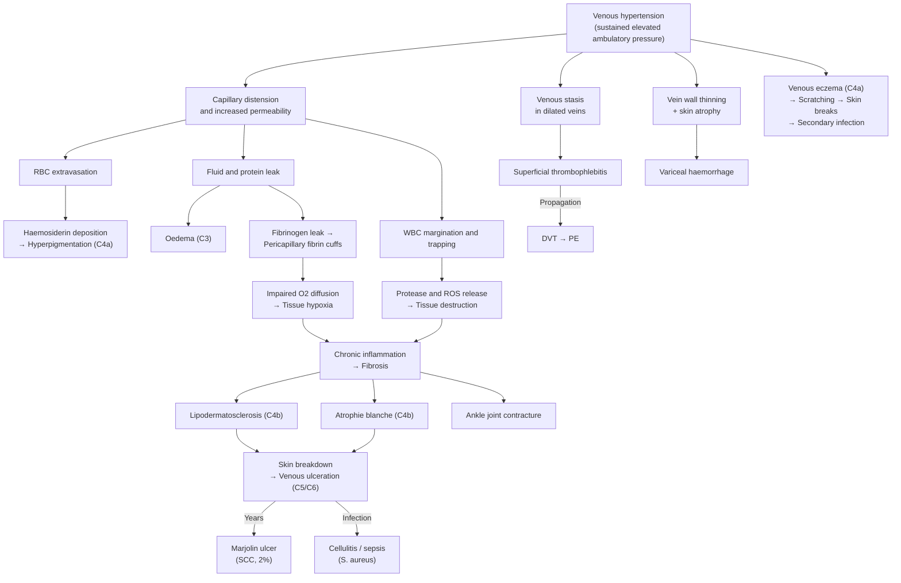

## Complications of CVI and Varicose Veins

Complications can be divided into two broad categories: **complications of the disease itself** (what happens if CVI/varicose veins are left untreated or inadequately treated) and **complications of treatment** (iatrogenic). Let me walk through both systematically, explaining the pathophysiology behind each.

---

### 1. Complications of the Disease

These complications represent the **natural history of progressive venous hypertension** — each is a step further along the CEAP spectrum. Understanding them as a continuum rather than isolated events is key.

#### 1.1 Venous Eczema (Stasis Dermatitis) — CEAP C4a

- **What it is**: ***Pruritic, scaling skin with erosions and crusting***, typically around the gaiter area [1][8]
- **Pathophysiology**: Venous hypertension → capillary distension → leakage of plasma proteins and inflammatory mediators into the dermis → chronic inflammatory response → eczematous change. The leaked fibrinogen polymerises into pericapillary fibrin cuffs, which trap growth factors and impair tissue repair, perpetuating inflammation.
- **Why it matters**: Itching leads to scratching → excoriation → breaks in skin barrier → portal of entry for bacteria → secondary infection (cellulitis). The eczema itself also indicates the skin is already compromised and at risk of ulceration.
- **Management**: Emollients, topical corticosteroids (short courses for flares), compression therapy to address the underlying venous hypertension. Avoid known contact allergens (many patients develop sensitivity to dressings, topical antibiotics like neomycin, or lanolin).

<Callout title="Contact Dermatitis Trap" type="error">
Patients with venous eczema are at high risk of developing **contact dermatitis** to topical preparations — including wound dressings, adhesive tape, and topical antibiotics. If eczema worsens despite treatment, suspect a superimposed allergic contact dermatitis and consider patch testing. Don't just apply more creams.
</Callout>

#### 1.2 Hyperpigmentation — CEAP C4a

- **What it is**: Brown discolouration of the gaiter area skin [1][8]
- **Pathophysiology**: Venous hypertension → capillary distension → ***extravasation of red blood cells*** into the dermis → macrophages phagocytose and break down the RBCs → ***haemosiderin deposition*** (an iron-rich pigment from haemoglobin degradation) [1][8]
- **Clinical significance**: Haemosiderin staining is **permanent** — ***surgery will NOT alter existing skin changes*** [2]. This is a crucial counselling point. Treatment prevents further pigmentation but cannot reverse what is already there.
- **Distribution**: ***Commonly occurs in gaiter area (medial lower 1/3 of the leg)*** [1][8]. In severe cases, ***pigmentation may cover the entire lower limb*** [3]

#### 1.3 Lipodermatosclerosis (LDS) — CEAP C4b

- **What it is**: ***Fibrosing panniculitis of subcutaneous tissue due to chronic venous insufficiency*** [1][8]
- **Clinical features**: ***Hyperpigmentation + subcutaneous induration + redness + tenderness + pitting oedema*** [1][8]
- **Pathophysiology**: Chronic venous hypertension → sustained capillary leak → fibrinogen leak → pericapillary fibrin deposition → impaired O₂/nutrient diffusion → tissue hypoxia → chronic inflammation with release of TGF-β and other fibrogenic cytokines → ***progressive replacement of skin and subcutaneous fat by fibrous tissue*** [1][8]
- **Consequences**:
  - Classic ***"inverted champagne bottle" leg*** — the lower leg becomes narrowed and hardened while the calf above remains relatively normal
  - ***Fixed flexion contracture of the ankle joint*** — subcutaneous fibrosis and/or painful ulceration restricts ankle range of motion [3]. This creates a vicious cycle: reduced ankle mobility → impaired calf muscle pump → worsening venous hypertension
- **Acute LDS**: ***Painful, hot, red, and tender*** on the medial side of the gaiter area. ***Often misdiagnosed as cellulitis or acute thrombophlebitis*** [3]. The distinction matters because acute LDS does not respond to antibiotics.

#### 1.4 Atrophie Blanche — CEAP C4b

- **What it is**: ***Ivory-white avascular fibrotic scars with hyperpigmented borders and telangiectasia*** [1][8]
- **Pathophysiology**: End-stage microvascular damage — the dermal capillaries have been obliterated by the chronic inflammatory process, leaving areas of avascular scar tissue. The surrounding hyperpigmented border represents the still-active zone of haemosiderin deposition.
- **Clinical significance**: ***Prone to secondary venous ulceration due to poor blood supply*** [1][8] — these avascular white areas have minimal capacity for repair, so even minor trauma can trigger ulceration that heals poorly.

#### 1.5 Venous Ulceration — CEAP C5/C6

This is the most clinically significant complication and the one that generates the greatest healthcare burden.

- **Location**: ***At the medial gaiter area — the site of medial calf perforators (Cockett perforators)*** [2]
- **Characteristics**: Shallow, gently sloping edges, with slough or granulation tissue at the base
- **Pain**: ***Usually painless unless infected (commonly S. aureus)*** [2]. However, ***acute venous ulcers in the context of active tissue sloughing can be very painful*** [3]
- **Pathophysiology**: The culmination of the entire venous hypertension cascade — tissue hypoxia from fibrin cuffs + white cell trapping + growth factor sequestration → skin breakdown → full-thickness skin loss (C6 = active; C5 = healed)
- **Infection**: Chronic venous ulcers are typically **colonised** by bacteria (this is expected and does not necessarily require antibiotics). ***Clinical infection*** — characterised by expanding cellulitis, purulent discharge, increased pain, or systemic features — requires ***wound swab for C/ST and appropriate antibiotics*** [6]
- **Healing**: With adequate conservative management (4-layer compression bandaging, wound care, leg elevation), ***50–70% of venous ulcers heal within 3 months*** [6]
- **Recurrence**: High recurrence rate if the underlying venous pathology is not treated. Treating the varicose veins reduces ulcer recurrence.

#### 1.6 Marjolin's Ulcer — Malignant Transformation

- **What it is**: ***Malignant transformation of a chronic venous ulcer, usually to squamous cell carcinoma (SCC), rarely basal cell carcinoma (BCC)*** [2][6]
- **Incidence**: ***~2% of long-standing venous ulcers*** [2]
- **Why it happens**: Chronic ulcers create a microenvironment of persistent inflammation, repeated tissue destruction and regeneration, and impaired immune surveillance — this promotes accumulation of genetic mutations in keratinocytes over years to decades, eventually leading to malignant transformation. This is conceptually similar to how chronic inflammation anywhere in the body increases cancer risk (e.g., Barrett's → oesophageal adenocarcinoma, ulcerative colitis → colorectal cancer).
- **When to suspect**: A chronic ulcer that **changes character** — becomes raised, develops everted or rolled edges, bleeds easily, grows rapidly, or fails to heal despite months of adequate therapy
- **Investigation**: ***4-quadrant biopsy of the ulcer edge and palpation of groin lymph nodes*** for metastasis [6]
- **Management**: Wide local excision ± lymph node dissection depending on staging

<Callout title="Marjolin's Ulcer — Don't Miss It">
Any venous ulcer that has been present for years and suddenly changes character (raised edges, easy bleeding, failure to heal) demands a biopsy. The 2% transformation rate sounds low but is clinically significant given how common venous ulcers are. A 4-quadrant biopsy from the ulcer edge (not the base — the base is necrotic/granulation tissue) is the standard approach.
</Callout>

#### 1.7 Bleeding

- ***Bleeding from attenuated vein clusters*** [1] — varicose veins near the surface, especially over bony prominences (medial malleolus), can rupture with minimal trauma
- **Pathophysiology**: The vein wall is already weakened (decreased elastin, increased MMPs). As the vein dilates and becomes more superficial, the overlying skin thins (atrophic changes from CVI). A minor knock can rupture both the skin and the vein.
- **Clinical picture**: Can be dramatic — venous bleeding from a varicose vein can produce surprisingly large volumes of blood, causing alarm in patients. However, it is **low-pressure** venous bleeding and is readily controlled.
- **Management**: **Elevation and direct pressure**. Lay the patient down, elevate the leg above heart level, and apply firm pressure with a pad. This simple manoeuvre controls virtually all varicose vein bleeds. Once controlled, the underlying vein should be treated to prevent recurrence.

<Callout title="Emergency Varicose Vein Bleeding" type="idea">
Patients sometimes present to ED in a panic with blood-soaked clothing. The key is: lie them down, elevate the leg, apply direct pressure. Venous bleeding (low pressure) is almost always controlled this way. Do NOT apply a tourniquet — it will worsen venous congestion and increase bleeding. Refer for definitive treatment of the varicose vein.
</Callout>

#### 1.8 Superficial Thrombophlebitis

- **What it is**: Thrombosis and inflammation within a superficial varicose vein [1]
- **Clinical features**: Localised pain, redness, warmth, and a tender, palpable, cord-like vein
- **Pathophysiology**: Venous stasis within a dilated, incompetent varicose vein → activation of coagulation cascade (Virchow's triad: stasis + endothelial damage from chronic distension + hypercoagulable microenvironment) → thrombus formation → inflammatory response
- **Risk**: Superficial thrombophlebitis can **propagate into the deep venous system** via the SFJ or SPJ, or via perforator veins. If the thrombus extends to within 3 cm of the SFJ, there is a real risk of DVT and PE. Always assess with duplex USG.
- **Management**: Usually self-limited — compression stockings, NSAIDs for pain and inflammation. If extensive or proximal, consider anticoagulation.

#### 1.9 Deep Vein Thrombosis (DVT)

- Patients with varicose veins have an **increased risk of DVT** — the chronic venous stasis and endothelial dysfunction create a prothrombotic environment
- DVT can also be a **cause** of secondary CVI (post-thrombotic syndrome), creating a bidirectional relationship
- ***Complication of DVT → chronic venous insufficiency*** and ***pulmonary embolism*** [10]
- Post-thrombotic syndrome: DVT damages venous valves → permanent valvular incompetence → secondary CVI → further venous hypertension. This is why DVT prophylaxis and early treatment of DVT are so important.

#### 1.10 Secondary Lymphoedema

- In advanced CVI, chronic inflammation and fibrosis can damage lymphatic vessels running alongside the veins
- This adds a lymphatic component to the venous oedema, creating **phlebo-lymphoedema** — harder to treat because lymphatic damage is largely irreversible
- The skin may develop features of both CVI (pigmentation, eczema) and lymphoedema (thickening, warty changes)

#### 1.11 Ankle Joint Stiffness

- ***Subcutaneous fibrosis from chronic lipodermatosclerosis and/or painful ulceration may cause a fixed flexion contracture of the ankle joint*** [3]
- This impairs the calf muscle pump mechanism (which requires full ankle dorsiflexion to function efficiently) → worsening venous hypertension → a self-perpetuating vicious cycle
- Physiotherapy and early treatment of LDS can help prevent this debilitating complication

---

### 2. Complications of Treatment

#### 2.1 Complications Common to All Interventions [1][2]

| Complication | Mechanism | Management |
|---|---|---|
| ***Pain*** | Expected post-procedure — tissue inflammation, nerve irritation | Analgesia; ***normal to have pain and pulling tightness of the treated vein*** [2] |
| ***Bruising / ecchymosis*** | Disruption of venous tributaries; haematoma in the stripping tract | Self-limiting; compression helps |
| ***Haematoma formation*** [1] | Blood accumulates in the surgical bed after ligation/stripping | Evacuation if large; compression; usually resolves |
| ***Wound infection*** [1] | Especially groin incisions (warm, moist environment) | Antibiotics; wound care |

#### 2.2 Nerve Injury [1][2]

This is one of the most important specific complications to know for exams:

| Nerve | At Risk During | Territory | Clinical Presentation |
|---|---|---|---|
| ***Saphenous nerve*** | ***GSV stripping — especially below the knee*** (close proximity of nerve and vein in distal calf) [1] | Sensory to ***medial leg and medial foot*** [2] | ***Pain or numbness along medial aspect of calf*** [1] |
| ***Sural nerve*** | ***SSV stripping*** [1] | Sensory to ***posterolateral leg and lateral foot*** [2] | ***Pain or numbness in posterolateral leg and lateral foot*** [1] |

- This is precisely why ***GSV stripping is limited to the thigh only*** — extending below the knee significantly increases saphenous nerve injury risk without improving symptomatic relief [1]
- Both nerves are purely sensory, so the deficit is numbness/paraesthesia rather than motor weakness

#### 2.3 Superficial Thrombophlebitis (Post-Treatment) [1]

- ***Occurs along the course of excised veins or in residual varicosities*** [1]
- Caused by endothelial damage and blood stasis in residual vein segments after treatment
- ***Self-limited and treated conservatively with compression stockings*** [1]
- ***NSAIDs reduce the incidence and severity*** (particularly after thermal ablation) [1]

#### 2.4 Deep Vein Thrombosis (Post-Treatment) [1][2]

- ***Complication of dissection/manipulation of venous structures*** [1]
- Risk is inherent because you are operating within the venous system — thermal energy, mechanical disruption, and blood stasis all activate coagulation
- ***Thromboprophylaxis should be given in high-risk individuals*** [1] — those with prior VTE, thrombophilia, malignancy, obesity, immobility
- **Detection**: Post-operative duplex USG at 2–3 days can screen for early DVT [2]
- **Suspect if**: Excessive pain with swelling post-operatively → urgent duplex

#### 2.5 Skin Burns (Thermal Ablation) [1][2]

- Specific to EVLA and RFA
- Occurs when the vein being treated is **too superficial (< 1 cm from the skin surface)** or when **tumescent anaesthesia is inadequately placed** — the thermal energy conducts through to the skin
- This is why ***surgical treatment is preferred over endovenous treatment for superficial veins (< 1 cm deep)*** [2]
- Prevention: Adequate tumescent anaesthesia (acts as a heat sink and pushes the vein deeper)

#### 2.6 Skin Pigmentation (Sclerotherapy / Non-Thermal Ablation) [1][2]

- ***Hyperpigmentation along the treated vein*** — from haemosiderin deposition after sclerosant-induced vein damage and trapped blood
- Also occurs with non-thermal methods (MOCA, cyanoacrylate) due to ***extravasation of sclerosant or inflammatory reaction*** [2]
- Usually fades over months but can be permanent in some cases

#### 2.7 Allergic Reactions (Sclerotherapy) [1]

- Rare but possible reaction to sclerosant agents (especially STS)
- Can range from minor skin rash to anaphylaxis
- Always have resuscitation equipment available when performing sclerotherapy

#### 2.8 Recurrence [2]

This is arguably the most important long-term complication:

- ***Recurrence rate is approximately 30%*** [2]
- ***More common in SSV*** than GSV territory [2]
- **Causes of recurrence** [2]:
  - ***Neovascularisation*** — new small veins grow across the ligated junction (especially at the groin), re-establishing reflux. This is a biological response to surgical disruption.
  - ***Reflux in residual axial vein*** — incomplete treatment of the trunk saphenous vein
  - ***New junctional reflux*** — development of reflux at a previously competent junction
  - ***Inadequate initial surgery*** — failure to identify and treat all sources of reflux (e.g., missed perforator incompetence, untreated tributary)
- **Management of recurrent varicose veins**: Repeat duplex USG to map the recurrence → tailored re-intervention (usually endovenous or sclerotherapy rather than redo surgery, as adhesions from prior surgery make dissection difficult)

---

### 3. Summary: Disease Complications Mapped to Pathophysiology

---

### 4. Complications of Compression Therapy [2]

Even conservative management has complications worth knowing:

| Complication | Mechanism | Prevention |
|---|---|---|
| ***Pressure necrosis*** | Excessive pressure over bony prominences or incorrect application | Proper fitting, patient education, adequate padding |
| ***Contact dermatitis*** | Skin sensitivity to stocking material | Hypoallergenic stockings, skin care |
| ***Fungal infection*** | Warm, moist environment under the stocking | Good foot hygiene, antifungal powder |
| ***Tourniquet effect*** | Stocking rolls down and creates a circumferential constriction band | Proper length selection, patient education |
| ***Tissue ischaemia*** (if applied without ABPI check) | Compression on an ischaemic limb further reduces perfusion pressure | ***Always check ABPI before compression — absolute C/I if < 0.4*** [2] |

---

<Callout title="High Yield Summary">

**Disease complications** follow the CEAP progression and are driven by sustained venous hypertension:
- **C4a**: Hyperpigmentation (haemosiderin from extravasated RBCs — permanent), venous eczema (inflammatory response to leaked proteins — risk of contact dermatitis)
- **C4b**: Lipodermatosclerosis (fibrosing panniculitis — "inverted champagne bottle" leg; acute LDS mimics cellulitis), atrophie blanche (avascular white scars prone to ulceration)
- **C5/C6**: Venous ulceration (gaiter area, painless unless infected with S. aureus; 50–70% heal with compression in 3 months)
- **Marjolin's ulcer**: SCC transformation in 2% of long-standing ulcers → 4-quadrant biopsy
- **Bleeding**: Controlled by elevation + direct pressure
- **Superficial thrombophlebitis**: Can propagate into deep system → DVT/PE
- **Ankle contracture**: From LDS fibrosis → impairs calf pump → vicious cycle

**Treatment complications**:
- **Nerve injury**: Saphenous nerve (GSV, especially below knee → medial calf numbness); sural nerve (SSV → posterolateral leg/lateral foot numbness)
- **DVT**: Thromboprophylaxis in high-risk patients; post-op duplex at 2–3 days
- **Skin burns**: Thermal ablation on superficial veins (< 1 cm deep) — use surgery instead
- **Recurrence (~30%)**: Neovascularisation, incomplete treatment, residual reflux. More common in SSV.
- **Surgery will NOT reverse existing skin changes** — only prevents progression.
</Callout>

---

<ActiveRecallQuiz
  title="Active Recall - Complications of CVI and Varicose Veins"
  items={[
    {
      question: "Explain the pathophysiology of hyperpigmentation in CVI, from venous hypertension to the final pigment deposited in the skin. Is this reversible with treatment?",
      markscheme: "Venous hypertension causes capillary distension and increased permeability, leading to extravasation of RBCs into the dermis. Macrophages phagocytose the RBCs and break down haemoglobin, depositing haemosiderin (iron-rich pigment) in the tissue. This is IRREVERSIBLE — surgery will not alter existing skin changes; it only prevents further pigmentation."
    },
    {
      question: "A patient with known CVI develops a long-standing venous ulcer that has been present for 5 years. Recently the ulcer margins have become raised and everted, and the ulcer bleeds easily. What complication must you suspect, what is the approximate incidence, and how do you investigate?",
      markscheme: "Marjolin ulcer (malignant transformation to SCC, rarely BCC). Incidence approximately 2% of long-standing venous ulcers. Investigate with 4-quadrant biopsy of the ulcer edge and palpate groin lymph nodes for metastasis."
    },
    {
      question: "Name the two nerves at risk during varicose vein surgery, state which vein operation puts each at risk, and describe the sensory deficit from each injury.",
      markscheme: "Saphenous nerve: at risk during GSV stripping especially below the knee; injury causes pain or numbness along medial calf and medial foot. Sural nerve: at risk during SSV stripping; injury causes pain or numbness in posterolateral leg and lateral foot."
    },
    {
      question: "List four causes of varicose vein recurrence after surgery and state which saphenous territory has higher recurrence.",
      markscheme: "Causes: (1) neovascularisation across the ligated junction, (2) reflux in residual axial vein (incomplete treatment), (3) new junctional reflux at previously competent junction, (4) inadequate initial surgery (missed perforators or tributaries). SSV territory has higher recurrence than GSV (overall rate approximately 30%)."
    },
    {
      question: "Explain why ankle joint contracture in advanced CVI creates a vicious cycle that worsens the disease.",
      markscheme: "Chronic lipodermatosclerosis causes subcutaneous fibrosis around the ankle leading to fixed flexion contracture. This restricts ankle range of motion, impairing the calf muscle pump (which requires full dorsiflexion). Impaired calf pump worsens venous stasis and venous hypertension, which in turn accelerates further fibrosis and skin damage — a self-perpetuating vicious cycle."
    }
  ]}
/>

## References

[1] Senior notes: felixlai.md (Chapter 13: Vascular System — Varicose Veins, pp. 953–961)
[2] Senior notes: maxim.md (Section 7.3: Chronic Venous Insufficiency — Management and Complications, pp. 173–175)
[3] Senior notes: maxim.md (Section 7.3: CVI clinical images and descriptions, p. 173)
[6] Senior notes: maxim.md (Section 7.4: Lower extremity ulcers — Management of venous ulcers, pp. 174–175)
[8] Senior notes: felixlai.md (Chapter 13: Vascular System — Chronic Venous Disease, pp. 944–949)
[10] Senior notes: felixlai.md (DVT — Prognosis/Complications, p. 970)
