## Differential Diagnosis of CVI and Varicose Veins

When a patient presents with lower limb swelling, skin changes, visible veins, or ulceration, your job is to work through a structured differential. The key question is: **is this truly venous disease, or is something else mimicking it?** Let me walk you through this systematically.

### Approach to Differential Diagnosis

The differential depends on the **presenting complaint**. A patient with varicose veins/CVI may present with one or more of:

1. **Visible dilated leg veins**
2. **Lower limb oedema**
3. **Leg pain / heaviness**
4. **Skin changes** (pigmentation, eczema, lipodermatosclerosis)
5. **Lower limb ulceration**

Each of these presentations has its own differential, but there is considerable overlap. The mermaid diagram below maps out the clinical reasoning:

```mermaid
flowchart TD
    A["Patient with lower limb\nswelling / veins / skin changes / ulcer"] --> B{"What is the dominant\npresenting feature?"}
    B --> C["Visible dilated veins"]
    B --> D["Lower limb oedema"]
    B --> E["Leg pain"]
    B --> F["Skin changes / pigmentation"]
    B --> G["Lower limb ulceration"]
    
    C --> C1["Varicose veins\n(primary / secondary)"]
    C --> C2["Reticular veins / telangiectasia"]
    C --> C3["Klippel-Trenaunay syndrome"]
    C --> C4["Parkes-Weber syndrome"]
    C --> C5["Saphena varix\n(DDx femoral hernia)"]
    
    D --> D1["Venous oedema (CVI)"]
    D --> D2["Lymphoedema"]
    D --> D3["DVT"]
    D --> D4["Cardiac failure"]
    D --> D5["Hypoalbuminaemia\n(nephrotic / liver)"]
    D --> D6["Lipodema"]
    D --> D7["Drug-induced\n(CCBs, NSAIDs)"]
    D --> D8["Dependency oedema\n(immobility)"]
    
    E --> E1["CVI / varicose veins"]
    E --> E2["DVT"]
    E --> E3["Superficial thrombophlebitis"]
    E --> E4["Peripheral arterial disease"]
    E --> E5["Musculoskeletal\n(Baker cyst, muscle strain)"]
    E --> E6["Cellulitis"]
    E --> E7["Sciatica / nerve root\ncompression"]
    
    F --> F1["Venous skin changes"]
    F --> F2["Cellulitis / erysipelas"]
    F --> F3["Contact dermatitis"]
    F --> F4["Stasis dermatitis\n(venous eczema)"]
    F --> F5["Pretibial myxoedema\n(Graves disease)"]
    
    G --> G1["Venous ulcer"]
    G --> G2["Arterial ulcer"]
    G --> G3["Neuropathic ulcer"]
    G --> G4["Mixed arterial-venous"]
    G --> G5["Pressure ulcer"]
    G --> G6["Malignant ulcer\n(Marjolin / SCC / BCC)"]
    G --> G7["Vasculitic ulcer"]
    G --> G8["Pyoderma gangrenosum"]
```

---

### 1. Differential Diagnosis of Visible Dilated Leg Veins

| Condition | Key Distinguishing Features | Why It Mimics CVI/VV |
|---|---|---|
| **Primary varicose veins** | Most common. GSV/SSV distribution. Risk factors (age, female, family history, standing occupation). Demonstrable reflux on duplex | The "diagnosis" itself — dilated tortuous subcutaneous veins ≥ 3 mm with reflux |
| **Secondary varicose veins (post-thrombotic)** | History of DVT. Skin changes may be more severe for the degree of visible varicosity. Deep venous incompetence on duplex | DVT destroys valves → secondary reflux → venous hypertension → same endpoint as primary VV |
| ***Klippel-Trénaunay syndrome*** | ***Congenital venous malformation with triad: varicose veins (often lateral thigh — atypical distribution), port wine stains, bony/soft tissue hypertrophy*** [2][7] | Varicose veins present from childhood/adolescence in atypical distribution (lateral thigh rather than medial GSV territory). The port wine stain and limb hypertrophy are the giveaways |
| ***Parkes-Weber syndrome*** | ***Multiple congenital AV fistulae with limb hypertrophy, possibly causing high-output heart failure*** [2][7] | AV fistulae increase venous pressure → venous dilation. Listen for bruit/thrill over the limb. Limb may be warm (arterialised venous blood) |
| **Saphena varix** | Compressible groin lump at the SFJ with a cough impulse. Disappears on lying down [1][2] | Must be distinguished from **femoral hernia** (below and lateral to pubic tubercle, may be irreducible, no venous hum) and **inguinal lymphadenopathy** (firm, non-compressible, no cough impulse) |
| **Pelvic venous congestion syndrome** | Chronic pelvic pain (worse standing, post-coital), vulval/perineal/upper thigh varices, often in multiparous women | Reflux from incompetent ovarian/internal iliac veins → atypical distribution varicosities. Suspect when varices are in vulval/perineal/upper medial thigh distribution without SFJ/SPJ incompetence |
| **IVC obstruction** | Bilateral prominent abdominal wall/lower limb veins, bilateral leg oedema, possible pelvic mass or history of IVC filter | Obstruction of IVC forces venous return through superficial collateral pathways → visible dilated veins on abdomen and legs bilaterally |

<Callout title="Lateral Thigh Varicose Veins" type="idea">
If you see varicose veins on the **lateral aspect of the thigh**, this is NOT typical GSV or SSV territory. Think Klippel-Trénaunay syndrome (congenital) or isolated lateral accessory saphenous vein reflux. Always ask about onset (childhood = congenital) and look for port wine stains and limb length discrepancy.
</Callout>

---

### 2. Differential Diagnosis of Lower Limb Oedema

This is a crucial differential because CVI is only one cause of leg swelling, and the treatment differs radically. The key is to determine whether the oedema is **unilateral vs. bilateral** and **pitting vs. non-pitting**.

| Condition | Unilateral/Bilateral | Pitting? | Key Distinguishing Features | Why It Mimics CVI |
|---|---|---|---|---|
| **CVI** | Usually unilateral (or asymmetric bilateral) | Yes (pitting) initially | Skin changes (pigmentation, LDS, eczema), varicose veins, gaiter area distribution. Worse at end of day, better with elevation | — |
| **DVT** | Usually unilateral | Yes (pitting) | Acute onset, painful, warm, red, swollen calf. Homan's sign unreliable. Risk factors: immobility, malignancy, recent surgery, OCP [1][3] | Acute venous obstruction causes leg swelling. A missed DVT can progress to PE — this is the dangerous diagnosis to exclude |
| **Lymphoedema** | Usually unilateral initially → bilateral | Initially pitting → later non-pitting (***warty, thickened skin***) | ***Stemmer sign positive*** (unable to lift skin fold of 2nd toe). Dorsum of foot involved. Does not improve overnight. No pigmentation/eczema. Causes: filariasis (MC worldwide), malignancy/post-radiation (MC in developed countries), primary (Milroy, Meige) [4] | Both cause leg swelling. Key difference: lymphoedema affects the **dorsum of the foot** and spares the gaiter area; CVI preferentially affects the gaiter area. Lymphoedema skin becomes thickened and fibrotic, not pigmented |
| **Lipodema** | Bilateral, symmetric | No (non-pitting) | Fat distribution disorder, almost exclusively in women. Symmetric bilateral leg enlargement sparing the feet. Tender to palpation. Easy bruising. No Stemmer sign | Bilateral swollen legs that are tender — but the feet are spared (the "cuff sign" at the ankle where fat stops and normal foot begins) |
| **Cardiac failure** | Bilateral, symmetric | Yes (pitting) | Raised JVP, orthopnoea, PND, bilateral leg oedema, hepatomegaly, sacral oedema if bedridden | Bilateral pitting oedema from elevated systemic venous pressure. But this is generalised — no focal skin changes, no varicose veins |
| **Hypoalbuminaemia** (nephrotic syndrome, liver cirrhosis, protein-losing enteropathy) | Bilateral, symmetric | Yes (pitting) | Periorbital oedema (nephrotic), ascites (liver), generalised oedema. Low serum albumin. No skin changes of CVI | Reduced oncotic pressure → transudative oedema. Bilateral, generalised, no focal venous signs |
| **Drug-induced** (CCBs e.g. amlodipine, NSAIDs, steroids, pioglitazone) | Bilateral, symmetric | Yes (pitting) | Temporal relationship with drug initiation. No skin changes | CCBs cause arteriolar vasodilation → increased capillary hydrostatic pressure → dependent oedema. Very common! |
| **Dependency / immobility oedema** | Bilateral | Yes (pitting) | Wheelchair-bound, elderly, paralysed patients. No skin changes initially | Lack of calf muscle pump + gravity = venous pooling and transudation |

<Callout title="DVT Must Be Excluded" type="error">
In any patient presenting with **acute unilateral leg swelling**, DVT must be excluded before attributing the swelling to CVI. This is especially important because DVT contraindicates varicose vein surgery and compression stockings may worsen DVT symptoms in the acute phase. Use duplex USG [1][3].
</Callout>

---

### 3. Differential Diagnosis of Leg Pain

CVI causes a dull ache/heaviness that is worse with standing and better with elevation [1]. But leg pain has many causes:

| Condition | Character of Pain | Key Differentiators |
|---|---|---|
| **CVI / varicose veins** | Dull ache, heaviness, burning. Worse with prolonged standing, better with elevation and walking [1] | Visible varicosities, skin changes, oedema |
| **DVT** | Acute, unilateral calf pain and swelling. Tender on palpation [3] | Acute onset, risk factors (Virchow's triad), calf tenderness and swelling |
| **Superficial thrombophlebitis** | Localised pain, redness, and tenderness along a palpable, tender, cord-like superficial vein [1] | The affected vein is visible and palpable as a tender cord. Surrounding erythema and warmth |
| ***Peripheral arterial disease (intermittent claudication)*** | Cramping pain in calf/buttock on walking, relieved by rest [5] | Pain with exercise (not standing). ***Absent pulses, reduced ABPI, cold/hairless limb***. Pain radiation: distal → proximal. Relieved by rest. Walking uphill worsens it [5] |
| **Sciatica / lumbar radiculopathy** | Sharp, shooting pain radiating from back/buttock down the leg in a dermatomal distribution | Back pain, positive straight-leg raise, neurological deficits. ***Neurogenic claudication (spinal stenosis)***: pain radiates proximal → distal, worsened by walking downhill, relieved by bending forward ("park bench to park bench" rather than "shop window to shop window") [5] |
| **Cellulitis** | Diffuse erythema, warmth, tenderness, swelling. Systemic features (fever, raised WCC/CRP) | Unilateral. Poorly demarcated erythema. May have entry wound. Responds to antibiotics. ***Acute LDS is often misdiagnosed as cellulitis*** [2] |
| **Ruptured Baker's cyst** | Acute onset posterior calf pain and swelling mimicking DVT [3] | History of knee arthropathy (RA, OA). Popliteal fossa fullness. USG confirms |
| **Muscle strain / tear** | History of trauma or sudden exertion. Localised tenderness | Temporal relationship with activity. Bruising may appear |

---

### 4. Differential Diagnosis of Lower Limb Skin Changes

Skin changes in CVI are distinctive but can be mimicked:

| CVI Skin Change | Differential / Mimic | How to Distinguish |
|---|---|---|
| **Hyperpigmentation** (haemosiderin) | Haemochromatosis, chronic dermatitis, fixed drug eruption, post-inflammatory hyperpigmentation | CVI pigmentation is in the gaiter area with associated oedema, varicosities. Haemochromatosis is generalised ("bronze diabetes") |
| **Venous eczema** (stasis dermatitis) | Allergic contact dermatitis (e.g., from wound dressings, topical agents), asteatotic eczema | Contact dermatitis has a sharp boundary matching the allergen contact site. Patch testing helps. Venous eczema is in CVI distribution with other venous signs |
| **Lipodermatosclerosis (acute)** | ***Cellulitis, erysipelas, superficial thrombophlebitis*** [2] | Acute LDS: painful, red, hot, tender medial lower leg in context of known CVI. Cellulitis: entry point, systemic features, responds to antibiotics. LDS does NOT respond to antibiotics. Thrombophlebitis: tender cord along a vein |
| ***Pretibial myxoedema*** | CVI skin changes | Pretibial myxoedema occurs in Graves' disease — localised thickening of pretibial skin with a "peau d'orange" appearance. Associated with thyroid eye disease, thyroid acropachy. No varicosities or venous oedema |

---

### 5. Differential Diagnosis of Lower Limb Ulceration

This is the most commonly examined differential. The lecture slides [6] emphasise that ***all lower limb ulcers must be characterised by type*** because management differs fundamentally.

| Feature | ***Venous Ulcer*** | ***Arterial Ulcer*** | ***Neuropathic Ulcer*** | ***Pressure Ulcer*** | ***Malignant Ulcer (Marjolin)*** |
|---|---|---|---|---|---|
| **Location** | ***Gaiter area (medial malleolus)*** | ***Tips of toes, between digits, lateral malleolus, heel*** | ***Plantar foot, over metatarsal heads*** | ***Bony prominences, heel, sacrum*** | At site of chronic ulcer/scar |
| **Depth** | ***Shallow*** | ***Deep*** | Shallow or deep | Deep | Variable, often deep with rolled/everted edge |
| **Edge** | ***Gently sloping*** | ***Punched-out*** | ***Punched-out*** | Macerated | Everted, raised, irregular |
| **Base** | ***Slough with granulation tissue*** | ***Unhealthy, necrotic*** | Not very painful | Often macerated | Fungating, friable tissue |
| **Pain** | ***Usually painless unless infected*** | ***Very painful*** | ***Painless (neuropathy)*** | Variable | May be painless initially |
| **Surrounding skin** | ***Haemosiderin-stained, eczematous, fibrotic, oedematous*** [2][6] | ***Cold, thin, shiny, hairless, delayed cap refill, gangrene*** | ***Dry, cracked, calluses, loss of sensation*** | Skin atrophy, muscle wasting | May show chronic CVI changes |
| **Pulses** | ***Present*** | ***Absent or weak*** | ***Present*** | Present | Present |
| **Associations** | ***VV, DVT, phlebitis*** | ***DM, HT, PVD, smoking*** | ***DM, trauma*** | ***Immobility*** | ***2% of long-standing venous ulcers → SCC*** [2] |

Other important ulcer differentials:

- **Vasculitic ulcers**: Associated with autoimmune conditions (RA, SLE, polyarteritis nodosa). Punched-out, painful, often multiple, may have palpable purpura. Check ESR, ANA, ANCA, complement
- **Pyoderma gangrenosum**: Rapidly enlarging, very painful ulcer with violaceous undermined borders. Associated with IBD, RA, haematological malignancies. Pathergy phenomenon (worsens with debridement — important to recognise so you DON'T debride it)
- ***Marjolin's ulcer***: ***Malignant transformation (usually SCC, rarely BCC) occurring in chronically scarred or ulcerated tissue, seen in ~2% of long-standing venous ulcers*** [2][6]. Suspect if a chronic ulcer changes character — becomes raised, has an everted edge, bleeds easily, or fails to heal despite adequate therapy. ***Requires 4-quadrant biopsy and palpation of groin lymph nodes*** [6]

<Callout title="Pyoderma Gangrenosum Trap" type="error">
If a rapidly expanding, extremely painful leg ulcer with violaceous undermined edges worsens after surgical debridement — think pyoderma gangrenosum. This demonstrates "pathergy" (trauma worsens the lesion). Treatment is immunosuppression (steroids, cyclosporine), NOT surgery. Debridement will make it worse.
</Callout>

---

### 6. Differential of the Groin Lump (Saphena Varix vs. Others)

A saphena varix at the SFJ can mimic other groin lumps [1][2]:

| Diagnosis | Key Features | How to Distinguish from Saphena Varix |
|---|---|---|
| **Saphena varix** | Compressible, with cough impulse, disappears on lying down, bluish tinge, located at SFJ (2.5 cm inferolateral to pubic tubercle). Venous hum may be present | — |
| **Femoral hernia** | Below and lateral to pubic tubercle. Cough impulse present. May be irreducible. No blue colour. Bowel sounds may be auscultated | Femoral hernia is typically not easily compressible and does not have a venous hum. Location is similar but hernia sits more lateral |
| **Inguinal lymphadenopathy** | Firm, non-compressible, no cough impulse. May be tender (infection) or hard/fixed (malignancy) | No relationship to venous system. Look for source of infection/malignancy in the drainage territory |
| **Femoral artery aneurysm** | Expansile, pulsatile mass. Located over femoral artery | Pulsatile rather than compressible. Duplex confirms |
| **Psoas abscess** | Fluctuant mass below inguinal ligament. Patient holds hip in flexion. Psoas sign positive. May have fever, back pain | Often secondary to spinal TB or Crohn's disease. CT confirms |

---

### 7. Summary: A Logical Framework for the DDx

When working up a patient with suspected CVI or varicose veins, ask yourself three questions:

1. **Is this truly venous disease?** — Exclude arterial (check pulses, ABPI), lymphatic (check Stemmer sign), cardiac (check JVP, bilateral), metabolic (check albumin), or drug-induced causes
2. **If venous, is it primary or secondary?** — Exclude DVT (duplex), pelvic pathology (abdominal exam, pelvic USS), and congenital causes (Klippel-Trénaunay, Parkes-Weber)
3. **If there is an ulcer, what type?** — Venous vs. arterial vs. neuropathic vs. mixed vs. malignant (Marjolin) vs. other (vasculitic, PG)

<Callout title="High Yield Summary">

**Core differential for lower limb oedema**: CVI, DVT, lymphoedema, cardiac failure, hypoalbuminaemia, lipodema, drug-induced (CCBs), dependency oedema. Use unilateral vs. bilateral and pitting vs. non-pitting to narrow it down.

**Core differential for lower limb ulcer**: Venous (gaiter area, shallow, painless, sloping edge), arterial (toes/heel, deep, punched-out, painful, absent pulses), neuropathic (plantar, painless, punched-out), pressure (bony prominences), malignant/Marjolin (2% of chronic venous ulcers → SCC).

**Must-exclude diagnoses**: DVT (before attributing swelling to CVI), PAD (before applying compression — check ABPI), Marjolin ulcer (4-quadrant biopsy for any non-healing chronic ulcer).

**Acute LDS mimics cellulitis** — medial lower leg, painful, hot, red, tender but in context of CVI and does NOT respond to antibiotics.

**Lateral thigh varicosities** → think Klippel-Trénaunay (congenital: VV + port wine stain + limb hypertrophy).

**Saphena varix DDx**: femoral hernia, inguinal lymphadenopathy, femoral artery aneurysm, psoas abscess.

**Lymphoedema vs. CVI**: Lymphoedema affects dorsum of foot, Stemmer sign positive, non-pitting in late stages, warty/thickened skin. CVI affects gaiter area, pitting, haemosiderin pigmentation.
</Callout>

---

<ActiveRecallQuiz
  title="Active Recall - DDx of CVI and Varicose Veins"
  items={[
    {
      question: "A 28-year-old woman presents with left leg swelling and varicose veins since childhood, with a port wine stain on the lateral thigh and the left leg being 2 cm longer than the right. What is the most likely diagnosis and what triad defines it?",
      markscheme: "Klippel-Trenaunay syndrome. Triad: varicose veins (often lateral thigh), port wine stain (capillary malformation), and bony/soft tissue hypertrophy of the affected limb."
    },
    {
      question: "List four key differentiating features between venous and arterial lower limb ulcers.",
      markscheme: "Location (gaiter area vs toes/heel), depth (shallow vs deep), pain (painless vs very painful), surrounding skin (pigmented/eczematous vs cold/shiny/hairless), pulses (present vs absent/weak), edge (sloping vs punched-out). Any four of these."
    },
    {
      question: "A patient with long-standing varicose veins develops a non-healing ulcer with raised, everted edges that bleeds easily. What diagnosis must be excluded and how?",
      markscheme: "Marjolin ulcer — malignant transformation (usually SCC) in chronic ulcer/scar. Exclude by 4-quadrant biopsy of the ulcer edge and palpation of groin lymph nodes for metastasis."
    },
    {
      question: "How do you distinguish lymphoedema from venous oedema on clinical examination? Name two key differences.",
      markscheme: "Lymphoedema: Stemmer sign positive (cannot lift skin fold of 2nd toe), non-pitting in late stages, warty/thickened skin, affects dorsum of foot, no haemosiderin pigmentation. Venous oedema: pitting, gaiter area predominance, haemosiderin staining, associated varicosities, Stemmer sign negative."
    },
    {
      question: "What critical investigation must be performed before compression therapy and why? State the absolute contraindication threshold.",
      markscheme: "ABPI (ankle-brachial pressure index). Must exclude peripheral arterial disease because compression on an ischaemic limb can cause tissue necrosis. Absolute contraindication if ABPI less than 0.4."
    },
    {
      question: "Acute lipodermatosclerosis is commonly misdiagnosed as which two conditions, and what key clinical feature helps distinguish it?",
      markscheme: "Commonly misdiagnosed as cellulitis or acute superficial thrombophlebitis. Key distinguishing features: LDS occurs in context of known CVI at the gaiter area, does NOT respond to antibiotics, no entry wound, and other CVI skin changes are present."
    }
  ]}
/>

## References

[1] Senior notes: felixlai.md (Chapter 13: Vascular System — Chronic Venous Disease, pp. 941–961)
[2] Senior notes: maxim.md (Section 7.3: Chronic Venous Insufficiency, pp. 169–175)
[3] Senior notes: felixlai.md (DVT and PE section, pp. 962–964)
[4] Senior notes: maxim.md (Section 4.6: Lymphoedema)
[5] Senior notes: maxim.md (Chronic limb ischaemia / Differential diagnosis, p. 169); Senior notes: felixlai.md (Chronic Arterial Insufficiency)
[6] Senior notes: maxim.md (Section 7.4: Lower extremity ulcers, pp. 174–175)
[7] Lecture slides: GC 201. Skin ulcers skin and subcutaneous lesions; skin cancer.pdf (p37 — Vascular malformations, Klippel-Trenaunay, Parkes-Weber)
