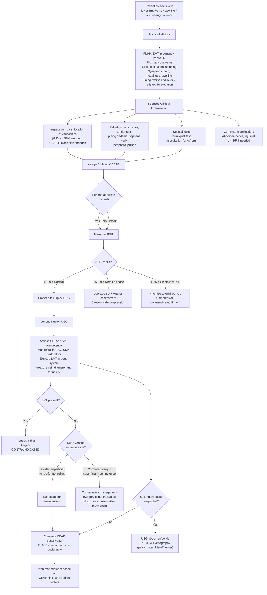

## Diagnostic Criteria, Algorithm, and Investigations

### 1. Diagnostic Criteria — What Makes the Diagnosis?

Unlike conditions such as rheumatic fever or SLE, CVI and varicose veins do not have strict "diagnostic criteria" in the traditional sense (no scoring system with X out of Y needed). Instead, the diagnosis is made through a **combination of clinical assessment and confirmatory imaging**, structured by the CEAP classification.

Let me lay out the diagnostic requirements for each key entity:

#### 1.1 Varicose Veins

The diagnosis requires ALL of [1][2]:
1. **Clinical**: Visible dilated, tortuous subcutaneous veins ≥ 3 mm in diameter, measured in the **upright position**
2. **Functional**: ***Demonstrable reflux*** — this is confirmed by duplex ultrasound showing retrograde flow with ***valve closure time > 0.5 seconds*** [1][2]

Without demonstrable reflux on duplex, a dilated vein is just that — a dilated vein. It is the reflux that makes it a "varicose vein" by definition.

#### 1.2 Chronic Venous Insufficiency (CVI)

CVI is defined as chronic venous disease of **CEAP class C3–C6** [1][2]:
- Requires the presence of **oedema (C3), skin changes (C4), or ulceration (C5/C6)**
- Plus evidence of **venous aetiology** (reflux, obstruction, or both) — confirmed by duplex USG

#### 1.3 CEAP Classification as the Diagnostic Framework

The CEAP classification itself serves as the diagnostic framework — once you have completed your clinical assessment and investigations, you assign the full CEAP descriptor. This is the international standard for documenting and communicating the diagnosis [1][2][3]:

| Component | What You're Classifying | How You Determine It |
|---|---|---|
| **C** (Clinical) | What you see and what the patient reports (C0–C6, S or A) | Clinical inspection and history |
| **E** (Etiological) | Why it happened (Ec, Ep, Es, En) | History (congenital? post-DVT? idiopathic?) |
| **A** (Anatomical) | Which venous system is affected (As, Ap, Ad, An) | ***Duplex USG*** |
| **P** (Pathophysiological) | What went wrong (Pr, Po, Pr,o, Pn) | ***Duplex USG*** |

The key insight: **C is clinical; E, A, and P require investigations (primarily duplex USG) to complete.**

<Callout title="You Cannot Complete CEAP Without Duplex USG">
Clinical inspection alone gives you the C class. But to assign the A (anatomical) and P (pathophysiological) components — i.e., to know whether it's reflux vs. obstruction, and whether the superficial, deep, or perforator system is involved — you need duplex ultrasound. This is why duplex is the cornerstone investigation.
</Callout>

---

### 2. Diagnostic Algorithm

Here is the systematic approach to diagnosing CVI and varicose veins, from initial presentation through to pre-operative planning:

---

### 3. History Taking — What Matters and Why

The history in CVI/varicose veins is not just a formality — it determines etiology (E component of CEAP), guides investigation, and identifies contraindications to treatment [1][2]:

| History Component | Specific Questions | Clinical Reasoning |
|---|---|---|
| **Presenting complaint** | Onset, duration, progression. Cosmetic concern vs. symptomatic (pain, heaviness, swelling, itching) | Determines whether treatment is needed and urgency. Acute onset of unilateral swelling → think DVT, not chronic CVI |
| **Symptom pattern** | Worse at end of day? Relieved by elevation? Worse with standing? | ***Venous symptoms worsen throughout the day and with standing, and are relieved by elevation and walking*** [1]. If pain is worse with walking and relieved by rest → think arterial |
| **PMHx — DVT** | ***Previous DVT or superficial thrombophlebitis*** [1] | Post-thrombotic syndrome is the most common secondary cause. Also, ***DVT must be excluded as it is a contraindication to varicose vein surgery*** [1] |
| **PMHx — Pregnancy** | Number of pregnancies, current pregnancy | Increased abdominal pressure + hormonal changes. ***Pregnancy is a contraindication to surgery*** [1] |
| **PMHx — Comorbidities** | Heart failure, liver disease, renal disease, thyroid disease, diabetes | Exclude other causes of oedema. Diabetes → check for neuropathic component of ulcers |
| **Drug history** | OCP, HRT, CCBs, NSAIDs, anticoagulants | OCP/HRT increase DVT risk. CCBs cause dependent oedema (mimic). Anticoagulants relevant for surgical planning |
| **FHx** | ***Family history of varicose veins*** [1] | Strong genetic component in primary varicose veins |
| **SHx** | ***Occupation requiring prolonged standing*** [1], exercise habits, smoking | Occupational risk; exercise promotes calf pump; smoking → assess atherosclerotic risk if mixed disease |

---

### 4. Physical Examination — A Systematic Approach

The examination should be performed with the patient **standing** (veins fill in the dependent position) with the legs fully exposed [1][2]:

#### 4.1 Inspection

- ***Surgical scars*** — previous venous surgery (recurrence is common — 30%) [2]
- ***Location of varicosities*** — the single most important inspection finding for localising incompetence [1]:

| Distribution | Implies Incompetence Of |
|---|---|
| ***Medial thigh and medial calf*** | ***Great saphenous vein (GSV)*** |
| ***Posterior calf*** | ***Small saphenous vein (SSV)*** |
| ***Anterolateral thigh and anterolateral calf*** | ***Isolated incompetence of proximal anterolateral GSV tributary*** |
| Lateral thigh (atypical) | Consider Klippel-Trénaunay or lateral accessory saphenous reflux |

- ***Signs of CVI*** — systematically assess for all C-class features [1][2]:
  - Corona phlebectatica (malleolar flare)
  - Hyperpigmentation (gaiter area)
  - Venous eczema
  - Lipodermatosclerosis (***hyperpigmentation + erythema + induration + tenderness — palpate!***) [2]
  - Atrophie blanche
  - Healed or active ulceration (medial gaiter area)

#### 4.2 Palpation

- ***Palpate along course of GSV and SSV*** and their tributaries for varicosities and tenderness [1][2]
- ***Check peripheral pulses*** — ***rule out PAD since management includes compression*** [1][2]. This is not optional — it is a safety-critical step
- ***Pitting oedema*** — confined to ankle area usually, may extend proximally [1]
- ***Saphena varix*** — at the inguinal region: a ***compressible lump with cough impulse that refills on release*** [1][2]
- ***Inguinal lymph nodes*** — if venous ulcers present, check for lymphadenopathy (infection or Marjolin transformation) [2]
- ***Neurological function*** — test sensation (e.g., sural nerve territory) if surgical scars present, to document pre-existing nerve damage [2]

#### 4.3 Tourniquet Test (Trendelenburg Test)

This classic bedside test localises the level of valvular incompetence. Although largely superseded by duplex USG, it remains an exam favourite [1][2]:

**Procedure** [1]:
1. Patient lies supine → **elevate leg** to empty superficial veins (or stroke blood proximally)
2. Apply tourniquet tightly around the **upper thigh** (just below SFJ)
3. Patient **stands up quickly** → observe filling of varicose veins

**Interpretation** [1]:

| Finding | Interpretation | Explanation |
|---|---|---|
| ***NO refilling below tourniquet*** while standing; rapid filling on release | ***SFJ incompetence only*** | The tourniquet blocked reflux from the SFJ, keeping the veins empty. When released, blood refluxes down from the femoral vein through the incompetent SFJ |
| ***Rapid refilling below tourniquet*** while standing | ***Incompetence at sites BELOW the tourniquet*** (perforators or other levels) | Blood is entering the superficial system below the tourniquet level — through incompetent perforators or lower reflux points |
| Partial filling while standing; further filling on release | ***SFJ incompetence AND perforator/other incompetence below*** | Both levels contributing |

- ***The test is repeated with the tourniquet at progressively lower levels***: mid-thigh, above knee, below knee [1][2]
- ***Below-knee tourniquet specifically excludes SSV incompetence*** [1]

#### 4.4 Modified Perthes' Test

This tests **deep venous patency** [2]:
1. Apply tourniquet around the SFJ (blocking superficial reflux)
2. Ask the patient to **walk** (activating the calf muscle pump)
3. If the deep system is **patent**: walking should empty the leg via the deep veins → varicosities decrease
4. If the deep system is **NOT patent**: walking causes ***swelling and pain*** — blood cannot drain through the deep system and the tourniquet blocks superficial drainage → the leg is trapped

<Callout title="Why Perthes' Test Matters" type="idea">
If the deep venous system is occluded (e.g., old DVT), the superficial varicose veins may be the patient's ONLY route for venous return. Stripping or ablating these veins would be catastrophic — you'd remove their only outflow pathway. This is why assessing deep venous patency is essential before surgery, and Perthes' test is the clinical correlate of what duplex USG confirms definitively.
</Callout>

#### 4.5 Completing the Examination

- ***Auscultate over varicosities*** for a continuous bruit — suggests AV malformation [1]
- ***Examine inguinal region*** for mass or lymphadenopathy causing venous outflow obstruction [1]
- ***Abdominal and PR examination*** — if secondary causes suspected (pelvic mass obstructing IVC/iliac veins) [2]
- ***ABPI measurement*** — to rule out PAD before compression therapy [2]

---

### 5. Investigation Modalities

#### 5.1 Ankle-Brachial Pressure Index (ABPI)

**What it is**: Ratio of the highest systolic BP at the ankle (dorsalis pedis or posterior tibial) to the highest brachial systolic BP, measured using a handheld Doppler and sphygmomanometer [1][5].

**Why you need it**: ***Compression therapy (stockings, bandaging) is the mainstay of CVI management. Applying compression to an ischaemic limb can cause tissue necrosis.*** ABPI is therefore a **mandatory safety check** before any compression or surgical planning [2].

| ABPI Value | Interpretation | Clinical Implication |
|---|---|---|
| **> 1.3** | ***Calcified (incompressible) arteries*** — e.g., diabetes, CKD | ABPI unreliable. Need alternative arterial assessment (toe pressures, duplex) |
| **0.9–1.3** | ***Normal*** | Safe for full compression therapy |
| **0.5–0.9** | ***Moderate PAD (claudication range)*** | Mixed arterio-venous disease. Use reduced compression with caution. Needs arterial assessment |
| **< 0.5** | ***Severe PAD (critical limb ischaemia range)*** | Compression is dangerous |
| ***< 0.4*** | ***Absolute contraindication to compression*** [2] | Do NOT apply compression stockings or bandaging |

<Callout title="ABPI Before Compression — Non-Negotiable" type="error">
Every student and junior doctor must check ABPI before prescribing compression. An ABPI below 0.4 is an absolute contraindication. In diabetics, ABPI may be falsely elevated due to calcified arteries — use toe pressures instead.
</Callout>

#### 5.2 Venous Duplex Ultrasound — The Gold Standard Investigation

This is the **cornerstone investigation** for CVI and varicose veins. "Duplex" means it combines two modalities [1][2]:

- ***B-mode USG*** (real-time 2D greyscale imaging) — shows anatomy (vein diameter, course, thrombus)
- ***Doppler*** (colour flow and spectral waveform) — shows haemodynamics (flow direction, velocity, reflux)

##### Why Duplex is the Gold Standard

It answers every question you need answered before making treatment decisions:

| Question | How Duplex Answers It |
|---|---|
| **Is there reflux?** | ***Reflux = retrograde flow in the reverse direction to physiological flow. Valve closure time > 0.5 seconds is defined as abnormal*** [1]. Elicited by calf compression-release (manual squeeze or cuff deflation) or Valsalva |
| **Where is the reflux?** | Maps reflux at SFJ, SPJ, along GSV/SSV trunks, perforators — completing the A component of CEAP |
| **Which junctions are incompetent?** | ***SFJ and/or SPJ incompetence*** determines the surgical approach [1] |
| **What is the vein diameter?** | Determines suitability for endovenous treatment (most devices work best in 5–12 mm diameter range) |
| **Is the vein tortuous?** | ***Tortuosity*** affects whether an endovenous catheter can be passed. Very tortuous veins may need surgical stripping instead [2] |
| **Is there a saphena varix?** | Visible on B-mode as a dilated segment at the SFJ |
| **Is there DVT?** | ***DVT must be excluded since it is a contraindication to varicose vein surgery*** [1]. B-mode shows non-compressible vein (normally a vein should be fully compressible with probe pressure). Intraluminal thrombus may be visible |
| **Is the deep system competent?** | ***Competence of the deep venous system must be assessed*** — if both deep and superficial systems are incompetent, surgery on the superficial system alone is contraindicated (blood has no alternative route) [1][2] |
| **Is there perforator incompetence?** | Incompetent perforators appear as bidirectional flow with reflux > 0.35 seconds |

##### The "Mickey Mouse" Sign [2]

On transverse B-mode at the groin, three circular structures are visible side by side:
- **Common femoral artery (CFA)** — larger circle, pulsatile
- **Common femoral vein (CFV)** — compressible circle
- **Great saphenous vein (GSV)** at the SFJ — smaller circle joining the CFV

This looks like Mickey Mouse's head and ears — a classic teaching image for locating the SFJ.

##### Indications for Duplex USG [1]

- **All patients being considered for intervention** (endovenous or surgical)
- ***Recurrent varicose veins*** [1]
- ***Complications of CVI***: hyperpigmentation, venous stasis eczema, venous ulcers [1]
- ***History of superficial thrombophlebitis or DVT*** [1]
- Atypical presentation or suspected secondary cause
- Pre-operative mapping and planning

##### How Reflux is Elicited During the Study

The patient is examined in the **standing or reverse Trendelenburg position** (to maximise venous pooling). The sonographer:
1. Places the probe over the vein segment being tested
2. ***Squeezes the calf*** (or uses a pneumatic cuff) to push blood proximally
3. Releases → observes for retrograde flow on the Doppler waveform
4. ***If reflux lasts > 0.5 seconds → incompetent valve*** [1]

For perforators, the threshold is slightly different: ***> 0.35 seconds is considered abnormal***.

#### 5.3 Continuous Wave Doppler (Handheld Doppler)

- ***Pen-like handheld probe*** that detects blood flow direction using the Doppler principle [1]
- ***Helpful for screening reflux at SFJ and SPJ*** in the office setting [1]
- **Limitations**: ***Unable to quantitate reflux or provide precise anatomical information*** [1] — it tells you "there is reflux here" but not exactly which vein, how much, or whether the deep system is involved
- In modern practice, this has been largely replaced by duplex USG for definitive assessment, but remains useful as a quick bedside screening tool

#### 5.4 Ultrasound Abdomen / Pelvis

- **Indication**: When a ***secondary cause is suspected*** [2] — e.g., pelvic mass (ovarian cyst, fibroid, pelvic malignancy), IVC obstruction, May-Thurner syndrome
- Look for: Pelvic masses compressing the iliac veins, lymphadenopathy, ascites
- Consider in:
  - Young patients with unexplained unilateral CVI
  - Patients with no typical risk factors
  - New-onset varicose veins with abdominal symptoms

#### 5.5 CT Venography / MR Venography

- **Not routine** — reserved for complex or recurrent cases
- **Indications**:
  - Suspected iliocaval obstruction (May-Thurner syndrome, IVC thrombosis)
  - Pelvic venous congestion syndrome
  - Planning for deep venous reconstruction or stenting
  - Congenital venous anomalies (Klippel-Trénaunay)
- **CT venography**: Good spatial resolution, involves contrast and radiation
- **MR venography**: No radiation, excellent soft tissue contrast, but longer acquisition time and limited availability
- **Intravascular ultrasound (IVUS)**: Increasingly used during endovascular procedures to assess iliac vein stenosis (May-Thurner) — gives cross-sectional area and degree of compression from within the vessel

#### 5.6 Laboratory Investigations

Laboratory tests are not used to diagnose CVI itself but are important in the **work-up of complications and differential diagnoses**:

| Investigation | Indication | What You're Looking For |
|---|---|---|
| **CBC with differential** | Venous ulcer with suspected infection | Leucocytosis (infection). Also baseline before surgery |
| **CRP / ESR** | Suspected infection, vasculitis | Elevated in infection and inflammation |
| **Wound swab for C/ST** | Infected venous ulcer | Identify causative organism (commonly *S. aureus*) and guide antibiotic therapy |
| **Serum albumin** | Exclude hypoalbuminaemia as cause of oedema | Low albumin → nephrotic, liver disease, malnutrition |
| **Renal / liver function** | Exclude non-venous causes of oedema | Renal failure → fluid overload; liver failure → hypoalbuminaemia + portal hypertension |
| **Thyroid function** | Pretibial myxoedema mimicking CVI skin changes | Hyperthyroidism (Graves) |
| **Coagulation screen + thrombophilia screen** | Young patient with DVT-related CVI, recurrent VTE | Factor V Leiden, protein C/S deficiency, antithrombin III deficiency, antiphospholipid antibodies |
| **HbA1c / fasting glucose** | Diabetic patient with ulcer | Assess glycaemic control; diabetic ulcers have different pathogenesis and management |
| ***4-quadrant biopsy*** | ***Non-healing venous ulcer*** | ***Exclude Marjolin's ulcer (SCC transformation, ~2% of chronic venous ulcers)*** [2] |

#### 5.7 Venous Ulcer-Specific Investigations

When a patient presents with a lower limb ulcer in the context of CVI:

1. **Duplex USG** — confirm venous aetiology and plan venous treatment
2. **ABPI** — exclude arterial component (mixed ulcers are common ~15%)
3. **Wound swab C/ST** — if signs of clinical infection (erythema, purulent discharge, cellulitis, systemic sepsis)
4. ***4-quadrant biopsy + palpate groin lymph nodes*** — if ulcer is chronic, non-healing, or has suspicious features (raised/everted edges, bleeding easily) → ***exclude Marjolin's ulcer*** [2][6]
5. **Bloods**: CBC, CRP, albumin, HbA1c

---

### 6. Summary of Investigation Algorithm

| Clinical Scenario | First-Line Investigation | Additional Investigations |
|---|---|---|
| **Symptomatic varicose veins (C2S)** | ABPI + Duplex USG | None usually needed |
| **CVI with skin changes (C4–C6)** | ABPI + Duplex USG | Bloods (CBC, CRP, albumin). Wound swab if infected. Biopsy if non-healing |
| **Recurrent varicose veins** | Duplex USG (essential — map the recurrence) | Consider CT/MR venography if complex anatomy |
| **Suspected secondary CVI** | Duplex USG + USG abdomen/pelvis | CT/MR venography for iliocaval pathology |
| **Young patient with DVT-related CVI** | Duplex USG + thrombophilia screen | CT venography if May-Thurner suspected |
| **Venous ulcer, non-healing** | ABPI + Duplex USG + wound swab + 4-quadrant biopsy | Exclude Marjolin's, mixed ulcer, vasculitis |

<Callout title="High Yield Summary">

**Diagnosis of varicose veins** requires visible dilated tortuous veins ≥ 3 mm in upright position PLUS demonstrable reflux (valve closure time > 0.5 s on duplex USG).

**CEAP** is the diagnostic framework: C = clinical inspection; E, A, P = require duplex USG to complete.

**Duplex USG is the gold standard** — it answers: Is there reflux? Where? Is the deep system competent? Is there DVT? Is the vein suitable for endovenous treatment?

**ABPI is mandatory before compression** — absolute contraindication if ABPI < 0.4. In diabetics with calcified arteries (ABPI > 1.3), use toe pressures instead.

**Tourniquet test**: No refilling below tourniquet = incompetence at tourniquet level. Rapid refilling despite tourniquet = incompetence below that level. Largely replaced by duplex but still examined.

**Perthes' test** assesses deep venous patency: tourniquet at SFJ + walking. If deep system is occluded → pain and swelling (superficial veins are the only outflow — do NOT ablate them).

**DVT is a contraindication to varicose vein surgery** — must always be excluded by duplex before any intervention.

**Combined deep + superficial incompetence → conservative management only** (surgery on superficial system would remove the patient's only functional outflow pathway).

**Non-healing venous ulcer → 4-quadrant biopsy** to exclude Marjolin's ulcer (SCC, 2%).
</Callout>

---

<ActiveRecallQuiz
  title="Active Recall - Diagnosis of CVI and Varicose Veins"
  items={[
    {
      question: "What is the duplex USG threshold for diagnosing venous reflux, and how is it elicited during the study?",
      markscheme: "Reflux = retrograde flow with valve closure time greater than 0.5 seconds (greater than 0.35 seconds for perforators). Elicited by squeezing the calf (or pneumatic cuff deflation) while observing Doppler waveform for retrograde flow on release."
    },
    {
      question: "A patient's tourniquet test shows no refilling below the tourniquet when standing, but rapid filling from above upon tourniquet release. What is the interpretation?",
      markscheme: "SFJ incompetence only. The tourniquet controlled the reflux by blocking the SFJ. On release, blood refluxes from the femoral vein through the incompetent SFJ, rapidly filling the superficial veins."
    },
    {
      question: "Why is DVT a contraindication to varicose vein surgery, and what investigation confirms its presence or absence?",
      markscheme: "Active DVT means the deep system is obstructed; the superficial veins may serve as collateral outflow. Removing them would impair venous return. Also, surgical manipulation risks embolisation. Duplex USG confirms DVT (non-compressible vein, intraluminal thrombus)."
    },
    {
      question: "Describe the modified Perthes test: what it tests, how it is performed, and what a positive result means.",
      markscheme: "Tests deep venous patency. Tourniquet applied at SFJ to block superficial reflux, then patient walks (activates calf pump). If deep system patent: varicosities decrease. If deep system NOT patent: swelling and pain because blood cannot drain through the deep system and superficial drainage is blocked. Positive result (pain/swelling) means deep veins are occluded - do NOT operate on superficial veins."
    },
    {
      question: "List four key pieces of information that duplex USG provides when assessing varicose veins, explaining why each matters for management.",
      markscheme: "1. Reflux location (SFJ, SPJ, perforators) - determines which veins to treat. 2. DVT presence/absence - DVT is a contraindication to surgery. 3. Deep venous competence - combined deep+superficial incompetence means conservative treatment only. 4. Vein diameter and tortuosity - determines suitability for endovenous treatment vs surgical stripping."
    }
  ]}
/>

## References

[1] Senior notes: felixlai.md (Chapter 13: Vascular System — Chronic Venous Disease, pp. 941–957; Varicose Veins, pp. 950–957)
[2] Senior notes: maxim.md (Section 7.3: Chronic Venous Insufficiency, pp. 169–175)
[3] Senior notes: felixlai.md (CEAP classification tables, pp. 944–945, 952–953)
[5] Lecture slides: WCS 002 - Toe gangrene and leg ulcer - by Prof SWK Cheng.pdf
[6] Senior notes: maxim.md (Section 7.4: Lower extremity ulcers, pp. 174–175)
