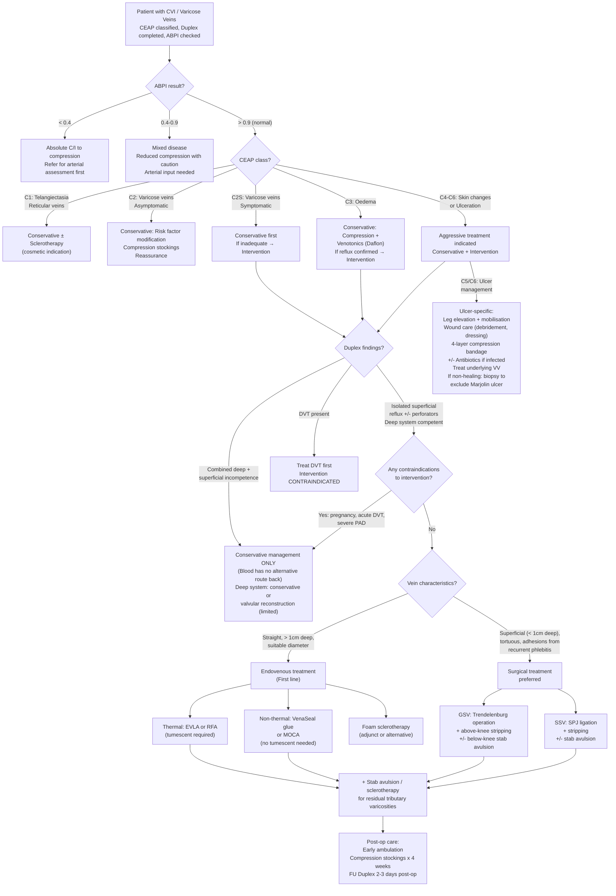

## Management of CVI and Varicose Veins

### 1. Principles of Treatment — Why Do We Treat?

Before diving into modalities, let's understand what we're trying to achieve. The goals of treatment address the underlying pathophysiology directly [1][8]:

1. ***Improve O₂ transport to skin and subcutaneous tissue*** — by reversing venous hypertension, which causes pericapillary fibrin cuffs that block O₂ diffusion
2. ***Decrease inflammation*** — venous hypertension triggers a chronic inflammatory cascade (WBC trapping, protease release); reducing venous pressure breaks this cycle
3. ***Decrease oedema and compress dilated veins*** — by external compression and reducing venous reflux, you restore Starling forces towards normal and reduce venous pooling

The overarching principle: ***reduce venous hypertension***. Everything else follows from this.

---

### 2. Management Algorithm

The management approach is determined by **CEAP class**, **duplex findings**, and **patient factors**:

---

### 3. Conservative Management

Conservative management is the **foundation for ALL patients** regardless of CEAP class — it is never wrong, and for many patients it is sufficient [1][2][8]:

#### 3.1 Risk Factor Modification

| Intervention | Mechanism | Details |
|---|---|---|
| ***Avoid prolonged standing*** [2] | Reduces the hydrostatic column and venous pooling | Advise regular walking breaks during work. Alternate between standing and sitting |
| ***Weight loss*** [2] | Reduces abdominal pressure → reduces impedance to venous return; reduces chronic inflammation | Significant benefit even with modest weight loss (5–10%) |
| ***Increase exercise*** [2] | ***Promotes calf muscle pump*** — the "peripheral heart" that actively propels blood from deep veins towards the heart | Walking, calf raises, swimming. Avoid prolonged static standing or sitting |
| Leg elevation | Eliminates the hydrostatic pressure column. When legs are above the level of the heart, venous return is gravity-assisted | Advise elevating legs when sitting, sleeping with foot of bed raised |

#### 3.2 Compression Therapy

This is the single most important conservative intervention and the backbone of CVI management [1][2][8]:

##### Graduated Compression Stockings

- ***At least 20 mmHg at the ankle with decreasing pressure proximally*** [2] — this creates a pressure gradient that pushes blood from distal (high pressure) to proximal (lower pressure), augmenting venous return
- Available in ranges: 20–30, 30–40, or 40–50 mmHg [1]
- Stocking length: knee-high to waist-high; should cover all symptomatic varicosities
- ***Below-knee stockings are usually prescribed due to better patient acceptance*** [1]
- ***Relieves symptoms and improves quality of life (QOL)*** [1][8]
- ***BUT no evidence that compression prevents occurrence or progression of varicose veins*** [1] — it is symptomatic treatment, not disease-modifying
- ***Compliance is poor*** and long-term tolerance is limited (difficult to don/doff, hot in summer) [1]

**Pre-requisite**: ***ABPI must be checked — absolute contraindication if ABPI < 0.4*** [2]. Why? Because compression on an ischaemic limb would further reduce arterial perfusion pressure, potentially causing tissue necrosis.

**Complications of compression stockings** [2]:
- ***Pressure necrosis*** — if applied too tightly or incorrectly, especially over bony prominences
- ***Contact dermatitis*** — skin sensitivity to stocking material
- ***Fungal infection*** — warm, moist environment under the stocking

<Callout title="Compression Stockings Are Contraindicated in Acute DVT" type="error">
Many students confuse this. While compression is the mainstay of CVI treatment, it is ***contraindicated in patients with acute DVT*** [1]. In acute DVT, compression can theoretically dislodge thrombus or worsen symptoms. Once DVT has been treated and the acute phase has passed, compression is then used to prevent post-thrombotic syndrome.
</Callout>

##### Paste Gauze Boots (Unna's Boots) [8]

- Combination of compression therapy with **zinc oxide paste** that assists wound healing
- **Indication**: Skin ulceration — provides continuous compression + topical therapy to prevent further skin breakdown
- **Advantages**: Requires minimal patient involvement; continuous compression and topical therapy
- **Disadvantages**: Bulky and uncomfortable (poor compliance); ulcer cannot be monitored after boot is applied; technique is labour-intensive and operator-dependent

##### Four-Layered Graduated Compression Bandage [6]

- The gold standard for **venous ulcer management** [6]
- Components: ***orthopaedic wool → cotton crepe → elastic bandage → cohesive bandage*** [6]
- Achieves sustained graduated compression (typically 40 mmHg at the ankle)
- ***Pre-requisite: ABPI > 0.4*** [6]
- Conservative management with 4-layer bandaging heals ***50–70% of venous ulcers within 3 months*** [6]

##### Pneumatic Compression Devices [8]

- Provides ***dynamic sequential compression*** — intermittent inflation/deflation of pneumatic cuffs
- Used primarily for DVT prophylaxis in hospitalised patients but also used to treat venous insufficiency
- Particularly useful when patients cannot tolerate stockings or in refractory oedema

#### 3.3 Venotonic Drugs

- ***Daflon (micronised purified flavonoid fraction / micronised diosmin)*** [2]: A venotonic that ***increases venous tone and lymphatic drainage***
- Mechanism: Increases venous wall contractility by modulating noradrenaline release; reduces capillary permeability; has anti-inflammatory effects (reduces leucocyte adhesion)
- ***Good for oedema (CEAP ≥ C3)*** [2]
- Limited role in earlier disease; used as adjunctive therapy rather than primary treatment
- Available over the counter in Hong Kong

#### 3.4 Venous Ulcer-Specific Conservative Management [6]

For patients with C5/C6 disease:

1. ***Leg elevation and encourage mobilisation*** [6] — elevation reduces venous pressure; mobilisation activates the calf muscle pump
2. ***Wound swab for C/ST + antibiotics if signs of infection*** [6] — only treat clinical infection (cellulitis, purulence, systemic signs), not colonisation
3. ***Ulcer care***: debridement of necrotic tissue, appropriate wound dressings, barrier cream for surrounding skin [6]
4. ***Four-layered graduated compression bandage (ABPI > 0.4)*** [6]
5. Treat the underlying varicose veins (intervention if appropriate)
6. If non-healing despite adequate treatment: ***4-quadrant biopsy and palpate groin LN to exclude Marjolin ulcer (2% — malignant transformation to SCC, rarely BCC)*** [6]
7. ***Fenestrated split-thickness skin graft*** — for large or refractory ulcers after the wound bed is adequately prepared [6]

---

### 4. Interventional / Surgical Management

#### 4.1 Indications for Intervention [1][2][8]

Intervention is indicated when there is ***documented superficial venous reflux (retrograde flow > 0.5 seconds on duplex)*** [2] AND one or more of:

| Indication | Explanation |
|---|---|
| **Symptomatic varicose veins** failing conservative therapy | Pain, heaviness, swelling not adequately controlled by stockings |
| ***Bleeding*** from varicosities [8] | Telangiectasia, reticular, and varicose veins near bony prominences are prone to haemorrhage |
| ***Recurrent superficial thrombophlebitis*** [8] | Veins prone to recurrent thrombosis; intervention reduces thrombosis burden |
| ***Severe disease (C4 or above)*** [2] | Skin changes, LDS, atrophie blanche, ulceration — these indicate significant venous hypertension requiring definitive treatment |
| Cosmetic concern (C1–C2) | Patient request for visible vein treatment (usually sclerotherapy) |

#### 4.2 Contraindications to Intervention [1][2][8]

| Contraindication | Reason |
|---|---|
| ***Pregnancy*** | Risk of DVT during/after procedure; varicose veins often improve post-partum; defer treatment [1][2] |
| ***Acute superficial or deep vein thrombosis (DVT)*** | Active thrombus risks embolisation during manipulation; superficial veins may serve as collateral drainage [1] |
| ***Combined deep AND superficial venous insufficiency*** | ***Blood has no alternative route back*** — ablating the superficial system would leave the patient with no functional outflow → limb would become worse [2] |
| ***Moderate to severe peripheral artery disease (PAD)*** | Compression post-procedure would compromise arterial perfusion [1] |
| ***Congenital venous abnormalities*** (relative) | Aberrant anatomy increases procedural risk; specialist planning required [1] |

<Callout title="Combined Deep + Superficial Incompetence = Conservative Only" type="error">
This is the most important contraindication to understand from first principles. If the deep system is incompetent AND you ablate the superficial system, where does the blood go? Nowhere. You've removed the patient's last functional venous outflow pathway. This patient must be managed conservatively. The deep system has limited surgical options — ***valvular reconstruction has limited efficacy*** [2].
</Callout>

#### 4.3 Choice Between Endovenous vs. Surgical Treatment

***Endovenous therapy and surgery appear equally effective*** [1], but there are important differences:

| Factor | Endovenous Treatment | Surgical Treatment |
|---|---|---|
| **Anaesthesia** | ***Under local anaesthesia (LA), USG-guided*** [2] | General or regional anaesthesia |
| **Recovery** | ***More rapid recovery*** [1] | Longer recovery |
| **Post-op pain** | ***Less post-operative pain and analgesic use*** [1] | More pain |
| **QOL impairment** | ***Minimal postoperative QOL impairment*** [1] | Greater initial impairment |
| **First-line?** | ***Yes — endovenous treatment usually first line*** [2] | Second line in most cases |

***Surgical treatment is preferred over endovenous if*** [2]:
- ***Superficial varicose veins (< 1 cm deep)***: Risk of skin burns from thermal energy
- ***Tortuous veins***: Endovenous catheter/fibre cannot be passed through tortuous segments
- ***Chronic/recurrent phlebitis***: Adhesions prevent passage of endovenous devices

---

### 5. Endovenous Treatment Modalities — In Detail

#### 5.1 Thermal Ablation (Requires Tumescent Anaesthesia)

**Tumescent anaesthesia** is a key concept for thermal techniques [2]:
- Composition: ***saline + lignocaine + epinephrine + NaHCO₃ (to reduce stinging)*** [2]
- Injected around the vein under USG guidance
- Roles [2]:
  1. ***Increase maximum dose of lignocaine*** (dilution effect)
  2. ***Facilitate contact of vein wall with the ablation device*** (compresses the vein)
  3. ***Move the vein away from the skin*** to protect the skin from thermal injury
  4. ***Acts as a heat sink*** to protect surrounding tissues (nerves, skin, subcutaneous fat)

##### ***Endovenous Laser Ablation (EVLA)*** [1][2]

- ***Preferred treatment modality*** (but self-paid under HA system in Hong Kong) [1]
- **Mechanism**: Insertion of a laser fibre into the lumen of the incompetent vein under USG guidance → ***generation of heat denatures the proteins constituting the vein wall*** → the vein fibroses shut [1][8]
- **Comparison with RFA**: ***Higher success rate than RFA*** [1]; ***less expensive than RFA*** [1]
- **Ideal candidates**: Straight veins, > 1 cm deep, diameter 5–12 mm
- **Complications** [1]:
  - Skin burns (thermal injury to overlying skin)
  - Bruising/ecchymosis
  - Superficial thrombophlebitis (reduced with NSAIDs)
  - DVT
  - Saphenous nerve injury

##### ***Radiofrequency Ablation (RFA)*** [1][2]

- **Mechanism**: ***Bipolar catheter delivers radiofrequency energy into the vein lumen*** → controlled thermal ablation → vein fibrosis [1]
- **Comparison with EVLA**: ***Faster recovery than EVLA*** [1]; ***less post-operative pain and analgesic use than EVLA*** [1]
- **Complications**: Same as EVLA — skin burns, bruising, thrombophlebitis, DVT, nerve injury [1]

<Callout title="EVLA vs. RFA — How to Remember">
**EVLA** = **E**xtra **V**ictory (**higher success rate**, cheaper) but more painful post-op. **RFA** = **R**apid **F**ast recovery (**quicker recovery**, less pain) but slightly lower success rate and more expensive. Both are excellent; choice depends on patient preference and local expertise.
</Callout>

#### 5.2 Non-Thermal Ablation (No Tumescent Required)

The major advantage of non-thermal techniques: ***tumescent anaesthesia is NOT required*** [2]. This means fewer needles, less discomfort, and no risk of thermal injury to surrounding structures.

##### ***Cyanoacrylate Glue / VenaSeal*** [1][2]

- **Mechanism**: ***Cyanoacrylate adhesive agent is injected sequentially through a catheter*** to seal off varicose veins [1]
- ***Requires compression along the length of the vein from proximal to distal after injection*** [1][2]
- **Major advantage**: ***Non-thermal, non-tumescent technique — less burns and fewer needle injections*** [1]
- ***Compression stockings are NOT required postoperatively*** [1][2] — a significant patient comfort benefit
- **Limitations**: Risk of vein hyperpigmentation and foreign body reaction; newer technique with less long-term data

> **Tumescent** is a ***dilute lidocaine mixture injected around the vein to anaesthetise the area and provide a heat-sink so surrounding tissues are not damaged during high-temperature treatment such as ablation*** [1]

##### Mechanical Occlusion Chemically-Assisted (MOCA) Ablation [2]

- **Mechanism**: Combines ***mechanical damage (rotating wire disrupts the endothelium) + chemical damage (simultaneous sclerosant injection)*** [2]
- Dual mechanism increases endothelial destruction → more reliable vein closure
- No tumescent required; lower risk of thermal injury
- Risk of vein hyperpigmentation and ulceration (from sclerosant extravasation)

##### Foam Sclerotherapy [1][2]

- **Mechanism**: ***Irritant agent is injected into the vein, causing endothelial damage by detergent or osmotic action*** → inflammation → fibrosis → vein obliteration [1][8]
- Can be ***USG-guided*** to directly inject sclerosant at the level of refluxing perforators [8]
- ***Post-operative compression stockings for 2 weeks*** to appose the inflamed vein walls and prevent thrombus formation [2]
- **Types of sclerosing agents** [1]:
  - ***Sodium tetradecyl sulfate (STS) — detergent*** (most commonly studied)
  - Polidocanol — detergent
  - Hypertonic saline — osmotic agent
  - Detergents work by ***interfering with cell membrane lipids*** → endothelial cell death [1]
  - Osmotic agents work by ***dehydrating endothelial cells through osmosis*** [1]
- **Indications**: ***C1 disease (telangiectasia, reticular veins, small varicose veins < 3 mm)*** [1]; adjunctive treatment of residual tributaries after truncal ablation; patients unfit for other procedures
- **Complications** [1]: Skin pigmentation, skin necrosis, thrombophlebitis, DVT, allergic reactions
- ***Improves symptoms but recurrence rate and need for re-intervention is high*** [1]

---

### 6. Surgical Treatment — In Detail

#### 6.1 Principles

Surgery ***reduces venous volume in the limbs and thereby the effects of venous hypertension upon the cutaneous tissues*** [8]. It physically removes or disconnects the incompetent veins.

#### 6.2 Procedures for GSV Incompetence

The classic operation has three components [1][2]:

##### ***Trendelenburg's Operation (SFJ Flush Ligation)*** [2]

- ***Oblique incision in the groin below the inguinal ligament over the femoral artery, extending medially for ~4 cm*** [1]
- ***Flush ligation*** = ***ligating the GSV very close to its junction with the femoral vein*** [1][2]
- Why "flush"? ***If the saphenous vein is ligated too distally from the SFJ, the remaining stump of GSV and all its tributaries will get dilated, forming a saphena varix*** [1][2] — essentially creating a new reflux source
- All ***tributaries of the saphenous vein at the SFJ are dissected and ligated individually*** [1]

##### Stripping [1][2]

- ***Pass a metal guidewire through the GSV with an olive (bulbous end) → pull out the entire vein in a proximal direction*** [1][2]
- ***Stripping is required to decrease the risk of recurrence*** due to persistent venous reflux via thigh perforators or ***neovascularisation*** in the groin [1]
- **Critical safety point**: ***Stripping of the GSV is limited to the THIGH ONLY*** [1]
  - ***Stripping below the knee to ankle does NOT improve symptomatic relief but SIGNIFICANTLY increases the risk of saphenous nerve injury*** [1]
  - Why? Because the ***saphenous nerve runs in close proximity to the GSV in the distal calf*** — stripping here would inevitably damage it

##### Stab Avulsion (Phlebectomy) [1]

- ***Varicose veins are marked preoperatively with indelible ink*** [1]
- ***Multiple small incisions are made directly over branch varicosities*** [1]
- ***The vein is elevated from the incision with a small vein hook, divided, and avulsed*** from surrounding subcutaneous tissues [1]
- Removes the ***tributary varicosities*** that won't resolve with truncal ablation alone

#### 6.3 Procedures for SSV Incompetence

- ***SPJ ligation + stripping +/- below-knee stab avulsion*** [2]
- **Nerve at risk**: ***Sural nerve*** — runs alongside the SSV. Damage causes ***pain or numbness in the posterolateral leg and lateral foot*** [1][2]

#### 6.4 Treatment for Perforators and Deep System [2]

| System | Treatment Options | Notes |
|---|---|---|
| **Perforators** | ***Sub-fascial endoscopic perforator surgery (SEPS)*** [2][8]; perforator mapping and ligation; open sub-fascial ligation | SEPS uses small incisions + endoscopic visualisation; CO₂ insufflation of the subfascial space; perforators are clipped and divided. Lower morbidity than open approach [8] |
| **Deep venous system** | ***Conservative management***; valvular reconstruction (limited efficacy) [2] | Deep system incompetence is very difficult to treat surgically. Options include valve repair, transposition, or transplantation, but results are inconsistent |

#### 6.5 Transilluminated Powered Phlebectomy (TIPP) [8]

- A mechanical alternative to stab avulsion
- ***Powered mechanical aspirator device inserted adjacent to the target vein after tumescent anaesthesia*** [8]
- ***Blade activated → vein aspirated into the device and destroyed*** [8]
- **Advantage**: Fewer incisions needed
- **Disadvantage**: ***More postoperative pain and haematoma formation*** [8]

---

### 7. Complications of Treatment

| Complication | Details | Why It Happens |
|---|---|---|
| ***Haematoma formation*** [1] | Common after stripping and avulsion | Disruption of venous tributaries and surrounding tissue |
| ***Wound infection*** [1] | Groin incisions in the warm, moist inguinal crease | Standard surgical site infection risk |
| ***Saphenous nerve injury*** [1][2] | ***Pain or numbness along medial aspect of calf and medial foot*** | Runs alongside GSV especially below the knee — why GSV stripping is limited to above-knee only |
| ***Sural nerve injury*** [1][2] | ***Pain or numbness in posterolateral leg and lateral foot*** | Runs alongside SSV |
| ***Superficial thrombophlebitis*** [1] | Inflammation along course of excised veins or residual varicosities. Self-limited; treat with compression stockings and NSAIDs | Endothelial damage and blood stasis in residual vein segments |
| ***DVT*** [1] | Complication of venous dissection. ***Thromboprophylaxis should be given in high-risk individuals*** [1] | Surgical trauma activates coagulation cascade; venous manipulation promotes Virchow's triad |
| **Skin burns** (thermal ablation) | Overlying skin damage from EVLA/RFA | Insufficient tumescent, vein too superficial (< 1 cm deep) |
| **Skin pigmentation** (sclerotherapy/non-thermal) | Hyperpigmentation along treated vein [2] | Sclerosant extravasation, haemosiderin from trapped blood |
| ***Recurrence (30%)*** [2] | ***More common in SSV*** | Causes: ***neovascularisation, reflux in residual axial vein, new junctional reflux, inadequate initial surgery*** [2] |

---

### 8. Patient Counselling — Expectations and Post-Operative Care [2]

**Setting expectations** (crucial for informed consent):

- ***Surgery will NOT alter existing skin changes*** [2] — pigmentation, LDS, and atrophie blanche are permanent tissue damage. Treatment prevents progression but does not reverse it
- ***May not improve all symptoms*** (e.g., pain may have other causes) [2]
- ***Recurrence rate is ~30%*** — this is high, and patients must understand this is a chronic condition [2]

**Pre-operative points**:
- ***Antiplatelet/anticoagulant medications can be continued*** [2] — no need to stop aspirin or warfarin in most cases (unlike arterial surgery)
- Mark varicosities with indelible ink while standing (they collapse when supine)

**Post-operative care** [2]:
- ***Early ambulation*** — prevents DVT and promotes healing
- ***Follow-up Doppler USG 2–3 days post-op*** — to check for DVT and treatment success
- ***Compression stockings × 4 weeks*** — maintains compression while treated veins fibrose
- ***No driving × 1 week***
- ***Normal to have pain and pulling tightness*** along the treated vein
- ***Consult if***: excessive pain with swelling (suspect DVT) or numbness/discolouration of toes (tight stocking)

---

### 9. Special Situation: DVT Prophylaxis in Surgical Patients [9]

Since varicose vein surgery involves manipulation of venous structures, DVT prophylaxis is important:

- ***Mechanical prophylaxis***: Intra-operative ***sequential compression devices (SCD)***; post-op ***early mobilisation + elastic compression stockings*** [9]
- ***Pharmacological prophylaxis (LMWH)***: Not routinely given to all patients in HK; indicated for patients with ***history of VTE, congenital thrombophilias, Caucasians*** [9]
- ***Established DVT pre-op***: ***IVC filter*** to prevent PE → remove 2 weeks later [9]

---

### 10. Summary Comparison of Treatment Modalities

| Modality | Mechanism | Best For | Key Advantages | Key Disadvantages |
|---|---|---|---|---|
| **Compression stockings** | External compression reduces venous diameter, augments calf pump | All CEAP classes; mainstay of conservative Mx | Non-invasive, symptom relief | Poor compliance, no disease modification, C/I if ABPI < 0.4 |
| ***Foam sclerotherapy*** | Chemical endothelial destruction | C1, small C2 (< 3 mm), residual tributaries | Office-based, cheap, minimally invasive | High recurrence, pigmentation, allergic reactions |
| ***EVLA*** | Thermal protein denaturation | Truncal incompetence (GSV/SSV) | ***Higher success rate***, preferred modality | Needs tumescent, risk of burns, more painful than RFA |
| ***RFA*** | Radiofrequency thermal ablation | Truncal incompetence | ***Faster recovery, less pain*** than EVLA | Slightly lower success rate, more expensive |
| ***VenaSeal / Cyanoacrylate glue*** | Adhesive vein sealing | Truncal incompetence | ***Non-thermal, no tumescent, no post-op stockings*** | Newer, less long-term data, foreign body reaction |
| **MOCA** | Mechanical + chemical | Truncal incompetence | No tumescent, dual mechanism | Risk of pigmentation, ulceration |
| ***Trendelenburg + stripping*** | SFJ flush ligation + vein removal | GSV incompetence, tortuous/superficial veins | Definitive, long track record | GA required, longer recovery, nerve injury risk |
| ***SEPS*** | Endoscopic perforator division | Perforator incompetence, venous ulcers | Lower morbidity than open ligation | Technically demanding |

<Callout title="High Yield Summary">

**Treatment principles**: Reduce venous hypertension → improve tissue O₂, decrease inflammation, decrease oedema.

**Conservative (for ALL patients)**: Risk factor modification (avoid standing, weight loss, exercise), graduated compression stockings (at least 20 mmHg at ankle, C/I if ABPI < 0.4), venotonics (Daflon for oedema C3+).

**Intervention indications**: Documented superficial reflux (> 0.5 s on duplex) with symptoms, complications (C4+), bleeding, or recurrent phlebitis.

**Contraindications**: Pregnancy, acute DVT, combined deep + superficial incompetence (blood has no route back), severe PAD.

**Endovenous treatment is first line**: EVLA (preferred — higher success) or RFA (faster recovery, less pain). Both need tumescent anaesthesia. VenaSeal (non-thermal, no tumescent, no post-op stockings) is a newer alternative.

**Surgery preferred if**: veins superficial (< 1 cm deep), tortuous, or adhesions from recurrent phlebitis.

**GSV surgery**: Trendelenburg operation (SFJ flush ligation) + above-knee stripping + stab avulsion. Do NOT strip below knee (saphenous nerve injury).

**SSV surgery**: SPJ ligation + stripping (risk of sural nerve injury).

**Venous ulcer management**: 4-layer compression bandage (ABPI > 0.4), wound care, treat VV. 50–70% heal in 3 months. Non-healing → biopsy for Marjolin (2% SCC).

**Surgery will NOT reverse skin changes** — it prevents progression only. Recurrence rate ~30%.

**Post-op**: Early ambulation, compression stockings × 4 weeks, FU duplex 2–3 days, no driving × 1 week.
</Callout>

---

<ActiveRecallQuiz
  title="Active Recall - Management of CVI and Varicose Veins"
  items={[
    {
      question: "Why is combined deep and superficial venous incompetence a contraindication to surgical treatment of varicose veins?",
      markscheme: "If the deep system is incompetent, the superficial system may be the only functional outflow pathway. Ablating or stripping superficial veins would remove the patient's last route for venous return, worsening the limb. Must treat conservatively."
    },
    {
      question: "Compare EVLA and RFA: state one advantage of each over the other.",
      markscheme: "EVLA advantage: higher success rate and less expensive. RFA advantage: faster recovery and less post-operative pain."
    },
    {
      question: "Why is GSV stripping limited to the thigh only and not extended below the knee?",
      markscheme: "The saphenous nerve runs in close proximity to the GSV in the distal calf. Stripping below the knee does not improve symptomatic relief but significantly increases the risk of saphenous nerve injury causing pain or numbness along the medial calf and foot."
    },
    {
      question: "Describe the components and roles of tumescent anaesthesia in thermal endovenous ablation.",
      markscheme: "Saline + lignocaine + epinephrine + NaHCO3. Roles: (1) increases max safe dose of lignocaine, (2) facilitates vein wall contact with device by compressing the vein, (3) moves vein away from skin to protect it, (4) acts as heat sink to protect surrounding tissues from thermal injury."
    },
    {
      question: "A venous ulcer has been treated with 4-layer compression for 4 months without healing. What are the next steps?",
      markscheme: "4-quadrant biopsy of ulcer edge to exclude Marjolin ulcer (SCC transformation, 2%). Palpate groin lymph nodes for metastasis. Consider fenestrated split-thickness skin graft. Reassess venous anatomy with duplex and treat underlying varicose veins. Ensure ABPI is adequate and no mixed arterial component."
    },
    {
      question: "What is the key advantage of VenaSeal (cyanoacrylate glue) over thermal endovenous ablation? Name two specific patient benefits.",
      markscheme: "VenaSeal is non-thermal and does not require tumescent anaesthesia. Benefits: (1) no risk of thermal burns to skin or surrounding tissues, (2) compression stockings are NOT required postoperatively — improving patient comfort and compliance."
    }
  ]}
/>

## References

[1] Senior notes: felixlai.md (Chapter 13: Vascular System — Varicose Veins, pp. 957–961)
[2] Senior notes: maxim.md (Section 7.3: Chronic Venous Insufficiency — Management, pp. 173–175)
[6] Senior notes: maxim.md (Section 7.4: Lower extremity ulcers — Management of venous ulcers, pp. 174–175)
[8] Senior notes: felixlai.md (Chapter 13: Vascular System — Chronic Venous Disease Treatment, pp. 947–949)
[9] Senior notes: maxim.md (DVT prophylaxis section)
