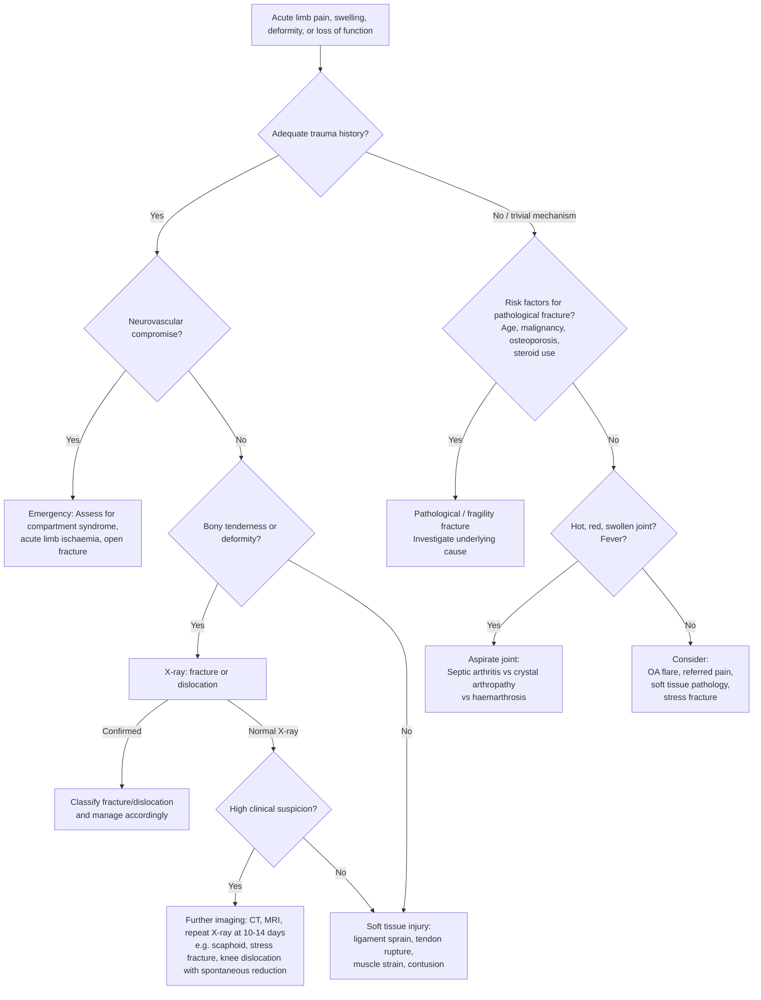

## Differential Diagnosis of Common Fractures and Dislocations

The differential diagnosis (DDx) of a suspected fracture or dislocation is not simply "is it broken or not?" — it is a systematic process of distinguishing the specific injury from other conditions that can mimic it. The approach varies by anatomical region, patient age, and mechanism. Below we work through this from first principles: **what else could cause the same presentation?**

The key principle is: **pain, swelling, deformity, and loss of function around a bone or joint can be caused by fracture, dislocation, soft tissue injury, infection, crystal arthropathy, tumour, or referred pathology.** Your job is to narrow this down using history (mechanism, timeline, risk factors), examination, and targeted investigations.

---

### General Framework for DDx of an Acute Limb Injury

When a patient presents with an acutely painful, swollen, deformed, or non-functional limb, the broad differential is:

| Category | Examples | Why It Mimics Fracture/Dislocation |
|---|---|---|
| **Fracture** | Traumatic, stress, pathological, fragility | Obvious — this is the diagnosis you're trying to confirm or exclude |
| **Dislocation / Subluxation** | Glenohumeral, elbow, hip, patella, Lisfranc | Loss of joint congruence → pain, deformity, loss of function |
| **Fracture-dislocation** | Galeazzi, Monteggia, terrible triad, Barton's, Bennett's | Combined bony + joint injury |
| **Ligament injury / Sprain** | ACL/PCL/MCL/LCL tear, ankle sprain (ATFL), UCL thumb | Swelling, effusion, instability — can mimic fracture on exam. ***Obvious long bone fracture and knee dislocation are uncommon findings in knee sports injuries*** [7] — most knee sports injuries are ligamentous |
| **Tendon rupture** | Achilles, quadriceps, biceps, rotator cuff, extensor tendon (mallet finger), FDP (jersey finger) | Sudden loss of function ± "pop" — resembles avulsion fracture |
| **Muscle strain / Contusion** | Quadriceps contusion, hamstring strain, calf strain | Pain, swelling, loss of function — but no bony tenderness, X-ray normal |
| **Septic arthritis** | *S. aureus* (most common non-gonococcal), gonococcal | Hot, swollen, painful joint with restricted ROM — can mimic intra-articular fracture or dislocation. Must always exclude in an acute monoarthritis [8][9] |
| **Crystal arthropathy** | Gout (1st MTP, midfoot, ankle, knee), pseudogout (knee) | Acutely inflamed joint — can be intensely painful with swelling and redness mimicking fracture or septic arthritis [8][9] |
| **Haemarthrosis** | Intra-articular fracture, ACL tear, coagulopathy (e.g. haemophilia), anticoagulant therapy, intra-articular tumour | Rapid joint swelling after injury — the cause of the haemarthrosis must be determined [8][9] |
| **Pathological fracture** (underlying bone disease) | Osteoporosis, metastasis, myeloma, Paget's, bone cyst, osteosarcoma, Ewing sarcoma | Fracture with minimal or no trauma → suspect underlying disease. ***Suspect bone metastasis if fracture above T5, constitutional symptoms*** [2] |
| **Stress fracture** | Tibial, metatarsal, fibular | Insidious onset pain in an athlete or military recruit — initial X-ray often normal |
| **Referred pain** | Hip pathology → knee pain; cervical radiculopathy → shoulder/arm pain; lumbar pathology → leg pain | No local signs over the "painful" area; pain pattern follows dermatome or nerve distribution |
| **Vascular injury** | Acute limb ischaemia (embolism, thrombosis, ***arterial injury from fractures/dislocations → intimal tear → thrombus formation*** [10]) | Limb pain, pallor, pulselessness — can coexist with or mimic fracture. ***Compartment syndrome*** must be in the DDx of worsening limb pain after injury [11] |
| **Non-accidental injury** (children) | Multiple fractures at different healing stages, metaphyseal corner fractures | History inconsistent with injury pattern — must consider in all paediatric fractures |
| **Osteoarthritis** | Weight-bearing joints — can present with acutely painful synovitis mimicking other diagnoses [8][9] | Chronic condition with acute flares — deformity and loss of ROM can mimic fracture |

<Callout title="The Must-Not-Miss DDx" type="error">
In ANY acute monoarthritis (hot, swollen, painful joint), you must rule out **septic arthritis** before attributing it to trauma or crystal disease. Septic arthritis is a surgical emergency — a delay of even hours can result in irreversible cartilage destruction. Aspirate the joint and send for Gram stain, culture, crystal analysis, and cell count.
</Callout>

---

### Region-Specific Differential Diagnosis

#### Shoulder Pain

| Diagnosis | Key Distinguishing Features |
|---|---|
| **Anterior shoulder dislocation** | Squared-off deltoid, arm in abduction/external rotation, loss of internal rotation, regimental badge numbness (axillary nerve). X-ray confirms |
| **Posterior shoulder dislocation** | Arm held in adduction/internal rotation, loss of external rotation. ***Often missed on AP X-ray*** — need axillary/Y-view. "Lightbulb sign" on AP |
| **Proximal humerus fracture** | Extensive bruising tracking down arm/chest wall, focal tenderness at surgical neck, axillary nerve/artery injury [2] |
| **Clavicle fracture** | Focal tenderness, visible deformity, medial fragment elevated (SCM pull) [2] |
| **ACJ dislocation** | Localised tenderness over ACJ, step deformity, increased coracoclavicular distance on X-ray [2] |
| **Rotator cuff tear / syndrome** | Pain during activity, passive ROM > active ROM, external rotation spared (infraspinatus + teres minor intact) [2] |
| **Frozen shoulder (adhesive capsulitis)** | Global limitation of both active AND passive ROM (especially external rotation), night pain, DM association [2] |
| **Cervical radiculopathy** | Neck pain radiating to arm, dermatomal pattern, weakness, may have Spurling's test positive [2] |
| **Biceps tendon rupture** | Sudden "pop", Popeye sign (bulging muscle belly), weakness of flexion/supination [2] |

#### Elbow Pain

| Diagnosis | Key Distinguishing Features |
|---|---|
| **Radial head fracture** | FOOSH, elbow effusion (fat pad sign on lateral X-ray), limited pronation/supination [2] |
| **Olecranon fracture** | Unable to extend elbow against gravity (triceps insertion disrupted), palpable gap, effusion [2] |
| **Elbow dislocation** | Disrupted equilateral triangle, obvious deformity, limited pronation-supination. ***Terrible triad***: dislocation + radial head fracture + coronoid fracture [2] |
| **Supracondylar fracture (children)** | S-shaped arm, disrupted anterior humeral line on lateral X-ray, neurovascular compromise (AIN, brachial artery) [2] |
| **Epicondylitis** (lateral = tennis elbow; medial = golfer's elbow) | Chronic overuse, localised epicondylar tenderness, pain on resisted wrist extension (lateral) or flexion (medial). DDx includes ***cervical radiculopathy, OA elbow, radial tunnel syndrome*** [2] |
| **Olecranon bursitis** | Focal swelling over olecranon, fluctuant, may be septic (erythema, warmth) — joint ROM preserved |

#### Wrist and Hand Pain

| Diagnosis | Key Distinguishing Features |
|---|---|
| **Distal radius fracture (Colles'/Smith/Barton's)** | FOOSH, classic deformity (dinner fork/garden spade), 6 radiological features [2] |
| **Scaphoid fracture** | Anatomical snuffbox tenderness, scaphoid tubercle tenderness, pain on thumb telescoping. DDx: ***distal radius fracture, fracture of other carpal bones / base of 1st MC, wrist sprain, De Quervain's tenosynovitis*** [2] |
| **De Quervain's tenosynovitis** | Pain at radial styloid, positive Finkelstein's test. DDx: ***1st CMCJ OA (Grind test+), Wartenberg's syndrome (neuritis of superficial radial nerve), intersection syndrome*** [2] |
| **Mallet finger** | Flexed DIP that cannot be actively extended, passive ROM intact — DDx: FDP rupture (jersey finger: can't flex DIP) [2] |
| **Boxer's fracture** | 5th MC neck fracture from punching — dorsal angulation [2] |
| **Bennett's fracture** | 1st MC base intra-articular fracture — forced abduction of thumb [2] |
| **Tendon sheath infection** | Kanavel signs (flexed digit, fusiform swelling, flexor sheath tenderness, pain on passive extension) — surgical emergency [2] |

#### Hip Pain

| Diagnosis | Key Distinguishing Features |
|---|---|
| **#NOF (intracapsular)** | Shortened, externally rotated leg, groin tenderness, pain on internal rotation. Garden classification. High AVN risk [2] |
| **#NOF (extracapsular)** | Similar but more swelling/bruising (haematoma not contained by capsule) [2] |
| **Acetabular fracture** | High-energy injury, similar to #NOF presentation, Morel-Lavallée lesion, Judet views [2] |
| **Hip dislocation (posterior)** | Shortened, flexed, adducted, internally rotated limb — opposite to #NOF (externally rotated). Dashboard injury. Sciatic nerve at risk |
| **Pubic ramus fracture** | Low-energy in elderly, groin/anterior thigh pain, tenderness over pubic rami — often missed or coexists with #NOF |
| **Septic arthritis of hip** | Fever, acutely painful restricted ROM (especially internal rotation), inflammatory markers raised |
| **OA hip** | Chronic pain, insidious onset, pain on weight-bearing with stiffness, X-ray: loss of joint space, osteophytes |
| **AVN femoral head** | Groin pain, loss of ROM, risk factors (steroids, alcohol, sickle cell, hip fracture) — MRI diagnostic |
| **Referred pain from lumbar spine** | Back pain, radiculopathy, dermatomal pattern — hip exam may be normal |

#### Knee Pain

The differential diagnosis of knee pain is extensive and location-dependent [7]:

| Location | Differential Diagnoses |
|---|---|
| ***Anterior*** | ***Patellofemoral pain syndrome, patellar subluxation/dislocation***, quadriceps tendonitis, chondromalacia patellae, ***tibial apophysitis (Osgood-Schlatter)***, patellar tendonitis (jumper's knee), prepatellar bursitis (housemaid's knee), arthritis [7] |
| ***Medial*** | ***MCL sprain, medial meniscal tear, pes anserine bursitis, medial plica syndrome*** [7] |
| ***Lateral*** | ***LCL sprain, lateral meniscal tear, iliotibial band tendonitis*** [7] |
| ***Posterior*** | ***Popliteal cyst (Baker's cyst), PCL injury*** [7] |

| Specific DDx | Key Features |
|---|---|
| **Patella fracture** | Direct fall or sudden quadriceps contraction, inability to SLR, palpable defect. DDx: ***other fractures (tibial plateau, distal femur), cruciate/collateral ligament injury, quadriceps tendon rupture*** [2] |
| **Patella dislocation** | Lateral displacement, apprehension test positive with lateral push. Risk factors: young obese female, patella alta, wide Q angle, genu valgum, shallow patellofemoral groove [2] |
| **Tibial plateau fracture** | High-energy, lipohaemarthrosis, popliteal artery/common peroneal nerve at risk [2] |
| **Distal femur fracture** | Knee effusion (intra-articular extension), severe distal thigh pain [2] |
| **Knee dislocation** | ***A majority of post-knee dislocation X-rays appear "normal" because of spontaneous reduction — high degree of suspicion is required to make the correct diagnosis*** [7]. Must assess popliteal artery (CT angiography) and common peroneal nerve |
| **Ligament injuries (ACL/PCL/MCL/LCL)** | Mechanism-dependent, instability testing (Lachman, anterior/posterior drawer, valgus/varus stress). ***Obvious long bone fracture and knee dislocation are uncommon findings in knee sports injuries*** [7] |

<Callout title="Knee Dislocation — Don't Miss the Vessel!" type="error">
***A majority of post-knee dislocation X-rays appear "normal" because of spontaneous reduction*** [7]. If you suspect knee dislocation (multi-ligament injury pattern, significant instability), you MUST get a CT angiogram to rule out popliteal artery injury — even if the X-ray looks normal and pulses are palpable. An intimal tear can occlude hours later.
</Callout>

#### Ankle and Foot Pain

| Diagnosis | Key Features |
|---|---|
| **Ankle fracture (Weber A/B/C)** | Malleolar tenderness, inability to weight-bear, X-ray confirms |
| **Ankle sprain (lateral ligament)** | ATFL most common, anterior drawer test positive, no bony tenderness (use Ottawa rules to decide on X-ray) |
| **Tibial pilon fracture** | High-energy axial load (fall from height/RTA), severe ankle deformity, ***talus punches up onto tibial plafond*** [2] |
| **Calcaneal fracture** | Fall from height, heel pain, flattened Böhler's angle, associated lumbar spine fracture (10%) [2] |
| **Talar fracture** | Forced dorsiflexion, high AVN risk (Hawkins classification) [2] |
| **Lisfranc injury** | Midfoot pain/swelling, ***plantar bruising***, piano-key sign, fleck sign on X-ray, widened 1st-2nd MT interval [2] |
| **5th MT base fracture** | Avulsion by peroneus brevis, lateral foot tenderness — part of the Ottawa Foot Rules |
| **Achilles tendon rupture** | Sudden "pop" in calf, positive Thompson test (no plantarflexion on calf squeeze), palpable gap |
| **Stress fracture (metatarsal, navicular)** | Insidious onset pain in athlete, localised tenderness, initial X-ray often normal — MRI or bone scan needed |

#### Spine

The differential diagnosis of back pain is broad [12]:

| Category | Examples |
|---|---|
| ***Mechanical pain (~97%)*** | ***Back sprain ( > 70%), lumbar disc degeneration, lumbar disc herniation, spondylolisthesis, fracture (vertebral body, spondylolysis)*** [12] |
| ***Non-mechanical pain (~3%)*** | ***Neoplasia, inflammatory arthritis (AS/spondyloarthropathy), infection*** [12] |
| ***Non-spinal (referred)*** | ***Pelvic inflammatory disease, endometriosis, nephrolithiasis, pyelonephritis, aortic aneurysm*** [12] |

For vertebral compression fractures specifically, distinguish:
- **Osteoporotic fragility fracture**: low-energy, elderly, known risk factors [2]
- **Pathological fracture from metastasis**: suspect if above T5, constitutional symptoms, night pain, weight loss [2]
- **Traumatic fracture**: adequate mechanism (fall from height, RTA)
- **Chance fracture (seatbelt fracture)**: horizontal fracture of upper lumbar spine, distraction injury of posterior column in passenger with lap belt only [5]

---

### DDx by Complication — "The Pain Is Getting Worse"

When a patient with a known fracture has worsening or disproportionate pain, consider these critical DDx:

| Complication | Key Features | Why |
|---|---|---|
| ***Compartment syndrome*** | ***Severe pain disproportional to clinical picture, unrelieved by analgesia. Pain on passive stretching of digits. Severe swelling, tense and shiny skin. Sensory deficit, later paralysis. Pulses always palpable*** [11] | Fracture haematoma + tissue oedema within a non-expansile fascial compartment → ↑intracompartmental pressure → muscle and nerve ischaemia. ***Pulses are always palpable*** because compartment pressure rarely exceeds systolic arterial pressure — absence of pulse is a VERY late sign |
| **Acute limb ischaemia** | 6 Ps: Pain, Pallor, Pulselessness, Paraesthesia, Paralysis, Poikilothermia | ***Fractures/dislocations → arterial stretching → intimal tear → thrombus formation*** [10]. Direct vessel laceration by fracture fragment |
| **Fat embolism syndrome** | Petechiae (axillae, conjunctivae), respiratory distress, confusion — 24–72h after long bone fracture | Fat globules from bone marrow enter the venous system → lodge in pulmonary and cerebral vasculature |
| **Deep vein thrombosis** | Calf/thigh swelling, tenderness, warmth | Immobility + endothelial injury + hypercoagulable state (Virchow's triad) |
| **Infection** | Increasing pain, erythema, discharge, fever — especially in open fractures | Direct contamination of wound → bacterial colonisation |

<Callout title="Compartment Syndrome — The Key DDx Point" type="error">
***Compartment syndrome is mainly a clinical diagnosis*** [11]. Do NOT wait for absent pulses — ***pulses are always palpable*** because compartment pressure exceeds venous/capillary pressure but rarely exceeds arterial pressure. The earliest reliable sign is ***pain on passive stretching of the affected muscles*** (e.g., passive dorsiflexion of great toe for anterior compartment of leg). If in doubt, measure compartment pressure (Stryker monitor) — fasciotomy is indicated if pressure > 30 mmHg or within 30 mmHg of diastolic pressure (delta pressure < 30 mmHg).
</Callout>

---

### Clinical Decision-Making Diagram

The following flowchart illustrates the DDx approach to an acute limb injury:

---

### Special DDx Considerations in Children

In children, the differential is different because of the unique biology of the immature skeleton:

| Condition | Why It's in the DDx |
|---|---|
| **Physeal (growth plate) injury** | May be radiographically occult (Type I Salter-Harris = no fracture line visible on X-ray). Tenderness over the growth plate in a child = physeal injury until proven otherwise, even with normal X-rays |
| **Greenstick / Torus fracture** | Incomplete fractures can be subtle on X-ray — look carefully at the cortex |
| **Pulled elbow (nursery maid's elbow)** | Subluxation of the annular ligament over the radial head in toddlers — no fracture, no X-ray abnormality. Diagnosis is clinical (sudden arm disuse after traction on an extended, pronated forearm). Treated by supination-flexion manoeuvre |
| **Osteomyelitis** | Fever, bony tenderness, refusal to use limb — mimics fracture. Must exclude in a child with limb pain and fever |
| **Non-accidental injury** | Unexplained or inconsistent injuries, multiple fractures at different stages of healing |
| **Bone tumours** | Osteosarcoma (metaphyseal, around the knee, age 10–20), Ewing sarcoma (diaphyseal, "onion-skin" periosteal reaction). Present with pain ± pathological fracture |
| **Perthes disease** | Idiopathic AVN of femoral epiphysis, boys 5–10, hip pain with loss of internal rotation — DDx of hip pain in children |
| **SCFE** | Slipped capital femoral epiphysis, obese boys 10–15, hip/knee pain, loss of internal rotation. DDx of hip/knee pain in adolescents |

---

<Callout title="High Yield Summary">

**DDx Framework for Fractures and Dislocations:**
1. **Always consider the 5 categories**: Fracture/dislocation → Soft tissue injury (ligament/tendon/muscle) → Infection (septic arthritis) → Crystal arthropathy → Pathological/referred.
2. **Acute monoarthritis** = must rule out **septic arthritis** (aspirate the joint) before anything else [8][9].
3. ***Knee sports injuries***: fracture and dislocation are uncommon — most injuries are ligamentous [7].
4. ***Post-knee dislocation X-rays often appear normal*** due to spontaneous reduction — maintain high suspicion and get CT angiography [7].
5. **Compartment syndrome**: ***pain disproportional to injury, unrelieved by analgesia, pain on passive stretch, pulses always palpable*** [11]. Clinical diagnosis — do not wait for late signs.
6. **Pathological fracture**: suspect if minimal/no trauma, above T5, constitutional symptoms → investigate underlying cause [2].
7. **Scaphoid fracture**: clinical suspicion may outweigh normal initial X-ray → treat with thumb spica and re-image at 14 days [2].
8. In children: physeal injury until proven otherwise if tenderness over growth plate; always consider NAI, osteomyelitis, bone tumours.
9. **Referred pain**: hip → knee (shared innervation); cervical spine → shoulder/arm; lumbar spine → leg [2].
10. ***Mechanical back pain accounts for ~97% of back pain***; non-mechanical (~3%) includes neoplasia, infection, and inflammatory arthritis [12].

</Callout>

---

<ActiveRecallQuiz
  title="Active Recall - DDx of Common Fractures and Dislocations"
  items={[
    {
      question: "A patient presents with an acutely hot, swollen, red knee after minor trauma. What is the single most important diagnosis to rule out, and how do you do it?",
      markscheme: "Septic arthritis. Rule out by joint aspiration: send for Gram stain, culture, crystal analysis (polarised light microscopy), and cell count. Septic arthritis is a surgical emergency — delayed treatment causes irreversible cartilage destruction."
    },
    {
      question: "After a knee injury, the X-ray appears completely normal but the patient has gross multi-directional instability. What must you suspect, and what critical investigation is needed?",
      markscheme: "Suspect knee dislocation with spontaneous reduction. A majority of post-knee dislocation X-rays appear normal. Must get CT angiography to rule out popliteal artery injury (intimal tear can occlude hours later), even if pulses are palpable."
    },
    {
      question: "A patient with a tibial shaft fracture has worsening pain despite adequate analgesia. The leg is tense and swollen. Pulses are palpable. What is the diagnosis and why are pulses still present?",
      markscheme: "Compartment syndrome. Pulses remain palpable because compartment pressure exceeds capillary and venous pressure (causing muscle ischaemia) but rarely exceeds systolic arterial pressure. Loss of pulse is a very late sign. Earliest sign is pain on passive stretch of affected muscles."
    },
    {
      question: "A 70-year-old woman presents with a T7 vertebral compression fracture after minimal trauma. What feature should raise suspicion for malignancy rather than osteoporosis?",
      markscheme: "Fracture above T5, constitutional symptoms (weight loss, night sweats, fatigue), night pain, history of known primary malignancy (lung, breast, prostate, renal, thyroid), lytic lesion without sclerosis on X-ray. Osteoporotic fractures typically occur at T12-L1 level."
    },
    {
      question: "Name four conditions in the DDx of a scaphoid fracture and explain one key distinguishing feature of each.",
      markscheme: "1. Distal radius fracture — tenderness over distal radius not snuffbox, dinner fork deformity if Colles. 2. Fracture of other carpal bones or base of 1st MC — tenderness localised elsewhere. 3. Wrist sprain — no bony tenderness, pain on ligament stress. 4. De Quervain tenosynovitis — positive Finkelstein test, pain at radial styloid along EPB/APL tendons rather than in anatomical snuffbox."
    }
  ]}
/>

## References

[2] Senior notes: maxim.md (Sections on shoulder dislocation, clavicle fracture, proximal humerus, elbow injuries, forearm fractures, distal radius, hand injuries, scaphoid fracture, De Quervain's, hip anatomy/trauma, #NOF, patella fracture/dislocation, tibial plateau, tibial shaft, calcaneus, talus, Lisfranc, acetabular fracture, spine DDx, pathological fractures, epicondylitis, radial head fracture)
[5] Senior notes: Ryan Ho Radiology.pdf (p1, p6 — pelvic trauma, Chance fracture)
[7] Lecture slides: GC 230. Knee Sport Injuries_Part 1.pdf (p62, p65)
[8] Senior notes: Ryan Ho Fundamentals.pdf (p406 — Approach to Acute Monoarthritis)
[9] Senior notes: Ryan Ho Rheumatology.pdf (p28 — Approach to Acute Monoarthritis)
[10] Senior notes: Ryan Ho Cardiology.pdf (p208 — Acute Limb Ischaemia, arterial trauma)
[11] Lecture slides: GC 231. High Energy Trauma Open Fracture_Part 3.pdf (p4 — Compartment syndrome)
[12] Lecture slides: GC 226. Lumbar Spine Pathology_Part E (2).pdf (p2 — DDx of back pain)
