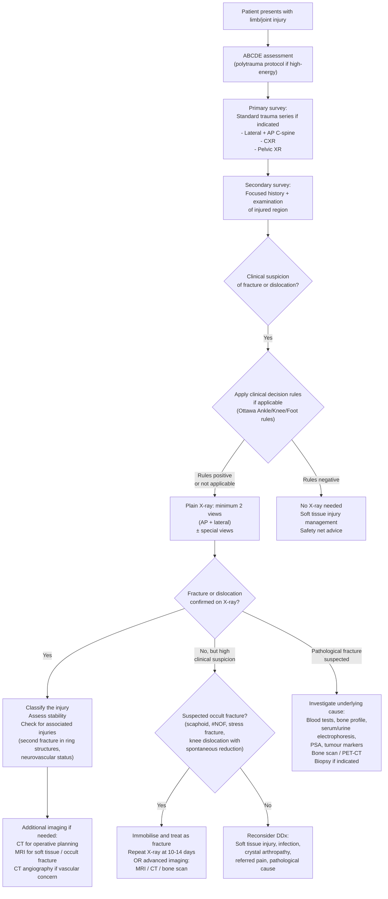

## Diagnostic Criteria, Diagnostic Algorithm, and Investigation Modalities

### Diagnostic Principles — From First Principles

Unlike many medical conditions (e.g., diabetes, rheumatoid arthritis) that have formal diagnostic criteria with sensitivity/specificity data, fractures and dislocations are diagnosed through a combination of **clinical assessment** (history + examination) and **imaging confirmation**. There are no "diagnostic criteria" in the traditional sense (no scoring systems or point-based classification) — instead, the diagnosis rests on:

1. **Clinical suspicion** based on mechanism of injury, symptoms, and signs
2. **Imaging confirmation** (primarily plain radiography)
3. **Classification** of the confirmed injury to guide management

The key diagnostic challenge is not "is it broken?" when a deformity is obvious, but rather:
- Detecting **occult fractures** (normal initial X-ray but fracture present — e.g., scaphoid, stress fractures, undisplaced #NOF)
- Detecting **associated injuries** (neurovascular injury, compartment syndrome, second fracture in ring structures)
- Detecting **underlying pathology** in atraumatic or low-energy fractures (osteoporosis, metastasis)
- Recognising **spontaneously reduced dislocations** that appear normal on imaging — ***a majority of post-knee dislocation X-rays appear "normal" because of spontaneous reduction — high degree of suspicion is required to make the correct diagnosis*** [7]

---

### Clinical Decision Rules

While fractures and dislocations lack formal "diagnostic criteria," several validated clinical decision rules guide the need for imaging:

#### Ottawa Ankle Rules [2]

These rules were developed to reduce unnecessary X-rays for ankle injuries. An **ankle X-ray is indicated** if there is:
- Any pain in the **malleolar zone** AND any one of:
  1. **Bone tenderness at distal 6 cm of posterior edge of tibia** or **tip of medial malleolus**
  2. **Bone tenderness at distal 6 cm of posterior edge of fibula** or **tip of lateral malleolus**
  3. **Inability to bear weight immediately** after injury AND in the Emergency Department for **4 steps**

> **Why posterior edge?** Because the most clinically significant malleolar fractures involve the posterior cortex of the distal tibia and fibula. Tenderness over the anterior border is more likely to represent a ligament injury.

#### Ottawa Foot Rules
A **foot X-ray** is indicated if there is:
- Midfoot pain AND any one of:
  1. Bone tenderness at the **base of the 5th metatarsal**
  2. Bone tenderness at the **navicular**
  3. Inability to bear weight immediately and in the Emergency Department for 4 steps

> The Ottawa rules have a sensitivity of ~98–100% for significant fractures (very few false negatives) but moderate specificity (~40%) — meaning they effectively rule out fracture when negative but still lead to many normal X-rays when positive.

#### Ottawa Knee Rules
A **knee X-ray** is indicated if any of:
1. Age ≥ 55
2. Isolated patella tenderness
3. Tenderness at fibular head
4. Inability to flex knee to 90°
5. Inability to bear weight immediately and in the Emergency Department for 4 steps

#### Canadian C-Spine Rules
Used to decide whether cervical spine imaging is needed after trauma (addressed in spine-specific notes but important in polytrauma context).

---

### Radiographic Criteria for Specific Fractures

Once imaging is obtained, specific **radiographic measurements** serve as diagnostic and treatment-guiding criteria:

#### Distal Radius Fracture — Radiographic Criteria for Instability [2]

| Measurement | Normal Value | Criteria for Instability / Indication for ORIF |
|---|---|---|
| **Radial height** (AP view) | 11 mm | > 5 mm shortening |
| **Radial inclination** (AP view) | 22° | Change > 5° |
| **Articular step-off** (AP view) | Congruous | Intra-articular fracture with > 2 mm step-off |
| **Volar tilt** (Lateral view) | 11° volar | Dorsal angulation > 5° or > 20° difference from contralateral |
| **Others** | — | Associated ulnar fracture (NOT ulnar styloid #), comminuted fracture |

> **Why do these measurements matter?** The distal radius articulates with the carpus and the ulna at the DRUJ. Any loss of radial height, inclination, or tilt changes the load distribution across the wrist joint → accelerates degenerative change and causes mechanical dysfunction. The threshold values represent the point beyond which functional outcomes significantly worsen if not corrected.

#### Hip — Shenton's Line [2]
- On AP pelvis X-ray: a smooth curving line formed by the **medial edge of the femoral neck** and the **inferior edge of the superior pubic ramus**
- **Disrupted Shenton's line** = femoral neck fracture until proven otherwise
- Also look for: prominent lesser trochanter (external rotation), higher lesser trochanter (shortening)

#### Hip — Garden Classification (see Classification section)
- Garden I–II = undisplaced → internal fixation
- Garden III–IV = displaced → arthroplasty (elderly) or ORIF (young)

#### Böhler's Angle (Calcaneus) [2]
- Measured on **lateral X-ray foot**: angle between a line from the posterior tuberosity to the highest point of the posterior facet, and a line from this point to the highest point of the anterior process
- **Normal: 25–40°**
- **Flattened** (< 25°) = calcaneal compression fracture

#### Radiocapitellar Line (Elbow) [2]
- On any elbow X-ray view: a line through the **centre of the radial shaft** should always pass through the **centre of the capitellum**
- Disrupted line → radial head dislocation (key finding in **Monteggia fracture-dislocation**)

#### Anterior Humeral Line (Elbow) [2]
- On **lateral** elbow X-ray: a line along the **anterior cortex of the humerus** should pass through the **middle third of the capitellum**
- Displaced anteriorly or posteriorly → **supracondylar fracture** (especially important in children)

#### Cervical Spine Soft Tissue Rules [2][14]
- **C1 level**: prevertebral soft tissue ≤ **10 mm**
- **C3 level**: ≤ **7 mm** (the "3×7=21 rule")
- **C7 level**: ≤ **21 mm**
- Widening suggests haematoma from occult fracture

#### Cervical Spine Lines [14]
- ***4 lines on lateral X-ray should be smooth***: anterior vertebral line, posterior vertebral line, spinolaminar line, tips of spinous processes
- ***3 lines on AP view should be smooth***: spinous processes (midline), lateral masses, vertebral body margins
- ***Malalignment of any line → fracture or ligamentous injury until proven otherwise***

---

### Diagnostic Algorithm — Structured Approach to Suspected Fracture/Dislocation

---

### Investigation Modalities — Comprehensive Guide

#### 1. Plain Radiography (X-ray) — First-Line Investigation

***Plain X-ray is the first-line investigation*** because it requires no patient movement, is readily available, fast, inexpensive, and has the ***highest spatial resolution*** for detecting fractures [5][13].

**Principles:**
- ***Most films require ≥ 2 views because fractures may be detected only in one view*** [13] — typically **AP + lateral** as minimum
- ***X-ray can only distinguish between four densities: calcium (bone), water (soft tissue), fat, and air*** [13]
- ***2-D representation of 3-D structures → overlapping may be present → use different angles to remedy*** [13]
- Always request imaging of the **entire bone** (including the joint above and below) — fractures can propagate, and associated injuries at distant sites can be missed

**Standard Views by Region:**

| Region | Standard Views | Special Views | What They Show |
|---|---|---|---|
| **Shoulder** | AP, Y-view (scapular lateral) | Axillary view | Axillary view essential for posterior dislocation (often missed on AP alone). Y-view shows direction of dislocation [2] |
| **Clavicle** | AP | Zanca view (15° cephalic tilt) | Zanca view for ACJ assessment [2] |
| **Elbow** | AP + lateral | — | Lateral must be true lateral (trochlea overlaps capitellum). Check anterior humeral line, radiocapitellar line, fat pad signs [2] |
| **Forearm** | AP + lateral (including wrist and elbow) | — | Must include both joints to detect Galeazzi (DRUJ) and Monteggia (PRUJ) injuries |
| **Wrist** | AP + lateral | Scaphoid view (30° extension, 20° ulnar deviation) | ***Scaphoid view*** for suspected scaphoid fracture [2][13] |
| **Hand** | AP, lateral, oblique | — | Oblique view helps detect subtle metacarpal fractures |
| **Pelvis** | AP | Judet views (45° obliques) for acetabular fracture, inlet/outlet views for pelvic ring | ***Pelvis is a ring: if there is one fracture, there must be another one*** [5] |
| **Hip** | AP + lateral (cross-table lateral) | — | Look for Shenton's line disruption, trabecular pattern (Garden classification) [2] |
| **Femur** | AP + lateral (entire femur including hip and knee) | — | 10% incidence of ipsilateral femoral neck fracture with shaft fracture [2] |
| **Knee** | AP + lateral | Skyline view (for patella) | Skyline view for patellar fracture/dislocation. ***Most significant X-ray findings in knee sports injuries may appear "subtle"*** [7] |
| **Tibia/Fibula** | AP + lateral (including knee and ankle) | — | Must include both joints |
| **Ankle** | AP, lateral, **mortise view** (20° internal rotation) | — | Mortise view provides a uniform joint space to assess talar shift and syndesmotic widening [2] |
| **Foot** | AP, lateral, **oblique** | Weight-bearing views if able | For Lisfranc injury: look for fleck sign, widened 1st–2nd MT interval [2] |
| **C-spine** | AP + lateral | Open-mouth (odontoid/peg) view | ***Lateral C-spine: C7-T1 must be visualised*** to detect Clay-Shoveler's fracture [5]. Open-mouth view for C1-2 assessment [14] |
| **Thoracolumbar spine** | AP + lateral | — | Look for compression fractures, vertebral body height loss, retropulsion |

**Key X-ray Findings and Their Interpretation:**

| Finding | Interpretation | Why |
|---|---|---|
| **Fat pad sign / Sail sign** (elbow lateral) | Elbow effusion → occult fracture (most commonly radial head fracture) | Intra-articular haematoma pushes fat pads out of the coronoid and olecranon fossae. Posterior fat pad is always abnormal; anterior "sail" suggests significant effusion [2] |
| **Lipohaemarthrosis** (knee lateral) | Intra-articular fracture (e.g., tibial plateau) | Fat from bone marrow + blood layer in the joint → fat-fluid level visible on horizontal-beam lateral view. Pathognomonic of intra-articular fracture [2] |
| **Disrupted Shenton's line** (pelvis AP) | Femoral neck fracture | The smooth arc is broken by displacement or angulation of the fracture fragments [2] |
| **Disrupted radiocapitellar line** (elbow) | Radial head dislocation (Monteggia) | The radius should always "point at" the capitellum on every view [2] |
| **Disrupted anterior humeral line** (elbow lateral) | Supracondylar fracture | Posterior displacement of the capitellum relative to the humeral shaft [2] |
| **Flattened Böhler's angle** (foot lateral) | Calcaneal compression fracture | Loss of the normal posterior facet height [2] |
| **Fleck sign** (foot AP) | Lisfranc ligament avulsion | Small bony fragment between 1st and 2nd MT bases = avulsed Lisfranc ligament [2] |
| **Widened mediastinum** (CXR) | Aortic injury | In the context of high-energy chest trauma — not a fracture finding per se but essential in polytrauma [5] |
| ***Lightbulb sign*** (shoulder AP) | Posterior shoulder dislocation | Internally rotated humeral head appears round/symmetric like a lightbulb — ***posterior dislocation is classically missed on AP X-ray*** |

**Systematic X-ray Interpretation — The ABCS Approach:**

| Step | Component | What to Assess |
|---|---|---|
| **A** | **Adequacy + Alignment** | Correct patient, correct side, adequate exposure, all relevant anatomy included. Alignment of bone/joint lines |
| **B** | **Bone** | Cortical continuity (fracture lines), bone density, periosteal reaction, lytic/scite lesions |
| **C** | **Cartilage / Joint space** | Joint space width (narrowing = OA/cartilage loss; widening = effusion/ligament injury), congruence of articular surfaces |
| **S** | **Soft tissue** | Soft tissue swelling, fat pad displacement (elbow), lipohaemarthrosis (knee), air in soft tissues (open fracture), foreign bodies |

**Fracture X-ray Interpretation — Systematic Description** [2]:

| Element | What to Report |
|---|---|
| **Site** | Which bone, which part (epiphyseal, metaphyseal, diaphyseal), **intra-articular vs extra-articular** |
| **Integrity of skin** | **Closed** (skin intact) vs **Open** (communication with external environment) |
| **Morphology** | Transverse (< 30°), Oblique (30–60°), Spiral, Butterfly, Comminuted ( > 2 fragments), Avulsion, Impacted/Compression |
| **Alignment** | **Displacement** (non-displaced, displaced, translated), **Angulation** (varus, valgus, apex anterior/posterior), **Length** (impacted, distracted), **Rotation** |
| **Associated injuries** | Fracture-dislocation (e.g., Monteggia, Galeazzi), second fracture in ring structures, joint incongruence |

***Paediatric X-ray interpretation*** requires additional attention [2]:
- ***Specific morphology due to more active periosteum***: **bowing** (plastic deformation), **greenstick** (one cortex breaks), **buckled/torus** (impacted cortex)
- ***Epiphyseal injury***: physis is the weakest part → susceptible to fracture → **Salter-Harris classification**
- **Comparison views** of the contralateral limb may be needed to distinguish a physis from a fracture line (secondary ossification centres in children can mimic fractures)

<Callout title="The Invisible Fracture — When X-ray Is Normal But Fracture Is Present" type="error">
Several fractures are notoriously difficult to see on initial X-ray:
- **Scaphoid fracture**: initial X-ray is normal in up to 20% of cases. Bone resorption at the fracture site makes the line visible on repeat X-ray at 10–14 days [2]
- **Stress fracture**: may not show until periosteal reaction/callus forms at 2–3 weeks
- **Undisplaced #NOF**: may need MRI for confirmation
- **Posterior shoulder dislocation**: often appears "normal" on AP X-ray — need axillary or Y-view
- **Knee dislocation with spontaneous reduction**: X-ray appears completely normal [7]

***If clinical suspicion is high but X-ray is negative, treat the patient and get further imaging (MRI, CT, repeat X-ray)***. Do NOT discharge with false reassurance.
</Callout>

---

#### 2. Computed Tomography (CT)

***CT is the best modality for organ/vascular injury*** and provides superior bony detail compared to plain X-ray [5].

**Indications in fractures/dislocations:**

| Indication | Rationale | Examples |
|---|---|---|
| **Pre-operative planning** | CT shows fracture geometry in 3D — essential for complex intra-articular fractures | Tibial plateau (Schatzker), acetabular (Judet-Letournel), calcaneus (Sanders), proximal humerus (Neer), distal femur (Hoffa) |
| **Occult fracture** | Detects fractures invisible on plain X-ray | Scaphoid, #NOF (if MRI not available), C-spine fractures |
| **Intra-articular extension** | Determines if a fracture line enters the joint | Tibial shaft spiral fracture → CT to rule out posterior malleolus fracture [2] |
| ***Polytrauma / high-energy injury*** | CT is the workhorse of trauma assessment | ***CT: main role in pelvic fractures is to diagnose associated injuries including haematoma (vascular injury), visceral injury (bladder, bowel)*** [5] |
| **CT angiography** | Vascular injury assessment | Knee dislocation (popliteal artery), pelvic fracture (haemorrhage source), tibial plateau fracture |
| **Spinal fracture** | ***Clearer visualisation of fractures*** than plain X-ray but ***still cannot show soft-tissue injury*** [14] | Cervical, thoracic, lumbar fractures for operative planning |

**Key CT Findings:**

| Finding | Significance |
|---|---|
| **Fracture lines not visible on X-ray** | Confirms occult fracture |
| **Articular step-off** | Quantifies intra-articular incongruity → determines need for surgical reduction |
| **Comminution** | Determines fracture complexity → guides fixation strategy |
| **Contrast extravasation** (CT angiography) | Active bleeding → may need embolisation or surgical exploration [5] |
| **Gas in bladder** | ***Indicates bladder rupture*** in pelvic fractures [5] |
| **Free pelvic fluid** | Haemorrhage from pelvic fracture |

---

#### 3. Magnetic Resonance Imaging (MRI)

MRI excels at **soft tissue assessment** — it shows things that CT and X-ray cannot.

**Indications:**

| Indication | Rationale | Examples |
|---|---|---|
| **Occult fracture with negative X-ray** | MRI detects bone marrow oedema at the fracture site — 100% sensitivity | Scaphoid, #NOF, stress fracture, insufficiency fracture |
| **Ligament / tendon / meniscal injury** | Soft tissue contrast is superior | ACL/PCL/MCL/LCL tears, meniscal tears, rotator cuff tears, Achilles tendon rupture, SLAP tear (MRI arthrogram) [2] |
| **Avascular necrosis** | Detects early AVN before X-ray changes appear | Femoral head AVN (post-#NOF), scaphoid AVN, talar AVN, Kienböck's disease (lunate AVN) [2] |
| ***Spinal cord / soft tissue compression*** | ***Difficult to arrange but shows soft-tissue lesion, cord oedema*** [14] | Disc herniation, epidural haematoma, ligamentous instability of spine |
| **Bone tumour characterisation** | Defines tumour extent, soft tissue involvement, skip lesions | Osteosarcoma, Ewing sarcoma, metastatic deposits |
| **Non-accidental injury** | Identifies occult fractures in multiple locations | Paediatric NAI — skeletal survey + MRI if needed |

**Key MRI Findings:**

| Finding | Significance |
|---|---|
| **Bone marrow oedema** (high T2/STIR signal) | Fracture, contusion, stress reaction, AVN |
| **Disrupted ligament signal** | Ligament tear (high signal within normally dark ligament on T2) |
| **Joint effusion** (high T2 signal) | Reactive effusion or haemarthrosis |
| **AVN** | Low signal on T1 in the femoral head/scaphoid/talus — death of bone |
| **Cord signal change** | Oedema (T2 bright) → cord compression/contusion in spinal injury |

---

#### 4. Ultrasound (USG)

| Indication | Rationale | Examples |
|---|---|---|
| ***Free intra-abdominal fluid*** in trauma (FAST scan) | ***Presence indicates significant injury → should do further imaging or interventions. Location of fluid indicates site of injury*** [5] | Polytrauma assessment |
| **Effusion detection** | Quick bedside assessment | Hip effusion (children — septic arthritis vs transient synovitis), knee effusion |
| **Tendon assessment** | First-line for tendon pathology | Biceps tendon rupture (localise distal end), Achilles tendon rupture, rotator cuff tears [2] |
| **DVT** | Duplex USG for DVT screening | Delayed presentation of #NOF [2] |
| **Guided aspiration** | USG-guided joint aspiration for monoarthritis | Septic arthritis, crystal arthropathy |

> ***USG advantages: fast. Disadvantages: operator dependent, often obscured by bowel gas*** [5]

---

#### 5. Bone Scintigraphy (Bone Scan)

| Indication | Rationale |
|---|---|
| **Stress fracture** | Increased uptake at the fracture site before X-ray changes appear (high sensitivity but low specificity) |
| **Occult fracture** (when MRI unavailable) | Detects increased bone turnover at fracture site |
| **Pathological fracture work-up** | Whole-body bone scan to identify multiple metastatic deposits |
| **Infection** (osteomyelitis) | Increased uptake but not specific — triple-phase bone scan helps differentiate |
| **AVN** | "Cold spot" (photopenic area) due to absent blood supply |

---

#### 6. Dual-Energy X-ray Absorptiometry (DEXA)

Not used for fracture diagnosis per se, but essential in the **work-up of fragility fractures** to diagnose and quantify osteoporosis [6]:
- **T-score ≥ –1.0**: Normal
- **T-score between –1.0 and –2.5**: Osteopenia
- **T-score ≤ –2.5**: Osteoporosis
- **T-score ≤ –2.5 with fragility fracture**: Established osteoporosis

> T-score = (Patient's BMD – mean BMD of young adult women) / SD. Each 1 SD decrease in BMD = **2× increased risk of hip fracture** [6].

---

#### 7. Laboratory Investigations

Lab tests are not used to diagnose fractures themselves but are essential for:

| Investigation | Indication | Key Findings |
|---|---|---|
| **FBC** | Polytrauma (blood loss), infection | Anaemia (haemorrhage), leukocytosis (infection) |
| **U&E, Creatinine** | Crush syndrome, rhabdomyolysis | Hyperkalaemia (reperfusion injury), raised creatinine |
| **CK / Myoglobin** | Crush syndrome, compartment syndrome | Markedly elevated CK |
| **Coagulation** (PT, APTT) | Massive haemorrhage, anticoagulant therapy | Coagulopathy → correct before surgery |
| **Group & Save / Cross-match** | Anticipated blood loss (femoral shaft, pelvis) | — |
| **Bone profile** (Ca, PO₄, ALP, Vit D, PTH) | Pathological fracture, osteoporosis work-up | Hypercalcaemia (malignancy, hyperparathyroidism), low Vit D, raised ALP |
| **Serum/urine protein electrophoresis** | Suspected myeloma | Paraprotein band (M-spike) |
| **Tumour markers** (PSA, etc.) | Suspected metastatic disease | Raised PSA (prostate met) |
| **ESR/CRP** | Infection (osteomyelitis, septic arthritis) | Elevated inflammatory markers |
| **Joint aspirate** | Acute monoarthritis (septic vs crystal vs haemarthrosis) | WBC > 50,000 + positive Gram stain/culture = septic arthritis; negatively birefringent crystals = gout; positively birefringent rhomboid crystals = pseudogout; fat globules = intra-articular fracture |
| **Compartment pressure** (Stryker monitor) | Suspected compartment syndrome | Absolute pressure > 30 mmHg or delta pressure (diastolic – compartment pressure) < 30 mmHg → fasciotomy |

---

### Special Investigation Scenarios — Decision Points

#### Scenario 1: Suspected Scaphoid Fracture with Normal X-ray [2]
1. Clinical features present (snuffbox tenderness, scaphoid tubercle tenderness, pain on thumb telescoping)
2. Initial X-ray (AP, lateral, scaphoid view) → normal
3. **Treat as scaphoid fracture**: **thumb spica cast** immobilisation
4. **Repeat X-ray at 10–14 days** (bone resorption at fracture site → fracture line becomes visible)
5. If still equivocal → **MRI wrist** (gold standard for occult scaphoid fracture)

#### Scenario 2: Suspected #NOF with Normal X-ray
1. Elderly patient, fall, groin pain, unable to weight-bear, pain on internal rotation
2. AP + lateral X-ray hip → normal
3. **MRI hip** (within 24h if available) → bone marrow oedema confirms fracture
4. If MRI unavailable → **CT hip** or **bone scan** (less sensitive than MRI for undisplaced fractures)

#### Scenario 3: Suspected Pelvic Fracture in Polytrauma [5]
1. ***Pelvic XR in primary survey*** → identify obvious fractures
2. ***CT pelvis with contrast*** → assess for:
   - Fracture extent and classification
   - ***Haematoma / contrast extravasation*** (vascular injury → may need angiographic embolisation)
   - ***Visceral injury*** (gas in bladder = bladder rupture)
3. If haemodynamically unstable → pelvic binder → CT when stabilised → interventional radiology if active bleeding

#### Scenario 4: Tibial Shaft Spiral Fracture [2]
1. AP + lateral X-ray tibia/fibula → spiral fracture identified
2. **CT scan** indicated to:
   - Rule out fracture extension to **posterior malleolus** (intra-articular extension to the ankle)
   - Assess for any other fracture lines

#### Scenario 5: Spinal Fracture/Dislocation [14]
1. ***Plain X-ray***: ***readily available, shows obvious fracture and malalignment, can miss subtle fracture, cannot exclude ligamentous instability, cannot exclude soft-tissue compressive lesion (e.g., haematoma)*** [14]
2. ***CT spine***: ***reasonably available, still cannot show soft-tissue injury*** — but superior for bony detail [14]
3. ***MRI spine***: ***difficult to arrange but shows soft-tissue lesion, cord oedema*** — essential for detecting disc herniation, epidural haematoma, ligamentous injury, cord compression [14]

---

<Callout title="High Yield Summary">

**Investigations for Fractures and Dislocations — Key Principles:**
1. ***Plain X-ray is first-line*** — minimum 2 views; highest spatial resolution for bone but poor soft tissue contrast [5][13].
2. **Ottawa Ankle Rules**: validated clinical decision rule — bone tenderness at posterior malleolar edges or inability to bear weight for 4 steps → X-ray indicated [2].
3. **Systematic X-ray interpretation**: Site → Skin integrity → Morphology → Alignment → Associated injuries (ABCS approach) [2].
4. **Key radiographic lines**: radiocapitellar line (Monteggia), anterior humeral line (supracondylar), Shenton's line (#NOF), Böhler's angle (calcaneus) [2].
5. **Distal radius instability criteria**: > 5mm shortening, > 5° inclination change, > 2mm articular step-off, dorsal angulation > 5° → ORIF [2].
6. **CT**: best for pre-operative planning (complex intra-articular fractures), polytrauma (associated injuries), and vascular assessment (CT angiography) [5].
7. ***MRI***: best for occult fractures (bone marrow oedema), soft tissue injuries, AVN, and spinal cord assessment — ***shows soft-tissue lesion and cord oedema*** [14].
8. ***Occult fractures***: if clinical suspicion high but X-ray negative → immobilise + repeat X-ray at 10–14 days or MRI [2].
9. **Lab investigations**: not for fracture diagnosis but essential for assessing complications (crush syndrome, blood loss, compartment syndrome) and underlying pathology (osteoporosis, malignancy, infection).
10. ***Post-knee dislocation X-rays are often normal*** due to spontaneous reduction — clinical suspicion + CT angiography is mandatory [7].
11. **DEXA**: for osteoporosis diagnosis in fragility fracture work-up. T-score ≤ –2.5 = osteoporosis [6].

</Callout>

---

<ActiveRecallQuiz
  title="Active Recall - Diagnosis and Investigations of Common Fractures and Dislocations"
  items={[
    {
      question: "State the three components of the Ottawa Ankle Rules that indicate the need for an ankle X-ray.",
      markscheme: "Any pain in the malleolar zone PLUS any one of: (1) Bone tenderness at distal 6cm of posterior edge of tibia or tip of medial malleolus, (2) Bone tenderness at distal 6cm of posterior edge of fibula or tip of lateral malleolus, (3) Inability to bear weight immediately and in ED for 4 steps. Key word: POSTERIOR edge of malleoli."
    },
    {
      question: "A Colles fracture X-ray shows radial shortening of 7mm, dorsal angulation of 8 degrees, and 3mm articular step-off. Is this stable or unstable? Give three specific radiographic criteria for instability.",
      markscheme: "UNSTABLE - all three parameters are abnormal. Criteria: (1) Radial height shortening > 5mm (this = 7mm), (2) Dorsal angulation > 5 degrees (this = 8 degrees), (3) Articular step-off > 2mm (this = 3mm). Indication for ORIF rather than closed reduction and cast."
    },
    {
      question: "A patient has anatomical snuffbox tenderness after FOOSH but a normal initial wrist X-ray. Describe the appropriate investigation pathway.",
      markscheme: "Treat as scaphoid fracture: immobilise in thumb spica cast. Repeat X-ray at 10-14 days (bone resorption at fracture site makes the fracture line visible). If still equivocal, MRI wrist is gold standard for occult scaphoid fracture. Do NOT discharge without immobilisation and follow-up."
    },
    {
      question: "What are the four key radiographic lines or angles that should be checked on an elbow X-ray and what does disruption of each suggest?",
      markscheme: "(1) Anterior humeral line - should pass through middle third of capitellum on lateral view - disruption suggests supracondylar fracture. (2) Radiocapitellar line - line through radius should pass through capitellum on all views - disruption suggests radial head dislocation (Monteggia). (3) Fat pad sign/Sail sign on lateral - posterior fat pad always abnormal, anterior sail sign suggests effusion - indicates occult intra-articular fracture. (4) Equilateral triangle (olecranon + epicondyles) - disruption indicates elbow dislocation."
    },
    {
      question: "For spinal trauma, compare plain X-ray, CT, and MRI in terms of what each can and cannot show.",
      markscheme: "Plain X-ray: readily available, shows obvious fracture and malalignment, but can miss subtle fracture, cannot exclude ligamentous instability, cannot exclude soft-tissue compressive lesion. CT: reasonably available, clearer fracture visualisation, but still cannot show soft-tissue injury. MRI: difficult to arrange but shows soft-tissue lesion (disc herniation, haematoma), cord oedema, and ligamentous injury - essential for assessing spinal cord compression."
    },
    {
      question: "What findings on a lateral knee X-ray after trauma would make you diagnose an intra-articular fracture, even if no fracture line is visible?",
      markscheme: "Lipohaemarthrosis - a fat-fluid level in the suprapatellar pouch on a horizontal-beam lateral X-ray. Fat globules from bone marrow (released only when cancellous bone is broken at the articular surface) float on top of blood. This is pathognomonic of an intra-articular fracture even when no fracture line is seen."
    }
  ]}
/>

## References

[2] Senior notes: maxim.md (Fracture XR interpretation, distal radius fracture radiographic criteria, Frykman classification, scaphoid fracture investigations, #NOF investigation and radiological features, elbow XR lines, forearm fracture-dislocations, olecranon fracture, elbow dislocation, proximal humerus investigations, femoral shaft investigations, distal femur investigations, tibial plateau investigation, tibial shaft investigation, ankle sprain Ottawa rules, ankle fracture, calcaneal fracture investigations, talar fracture investigation, Lisfranc radiological features, ACJ dislocation XR, patella dislocation XR, cervical spine soft tissue rules, paediatric XR interpretation)
[5] Senior notes: Ryan Ho Radiology.pdf (p1 — principles of trauma imaging, standard trauma series, modalities; p3 — rib fracture; p6 — pelvic fracture CT findings)
[6] Senior notes: Ryan Ho Endocrine.pdf (p49 — DEXA interpretation, T-score, osteoporosis diagnosis)
[7] Lecture slides: GC 230. Knee Sport Injuries_Part 1.pdf (p62 — fracture/dislocation uncommon in knee sports injuries; p64 — subtle X-ray findings)
[13] Senior notes: Ryan Ho Diagnostic Radiology.pdf (p13 — plain film radiography principles, special views, spatial resolution)
[14] Lecture slides: GC 110. Paraplegia Spinal cord compression Transverse myelitis Spinal dysraphism Neuroimaging III Spinal Cord.pdf (p14 — X-ray, CT, MRI of spine)
