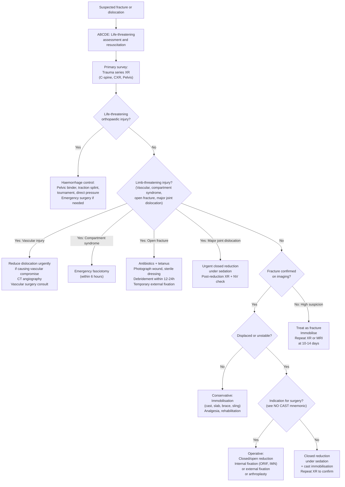
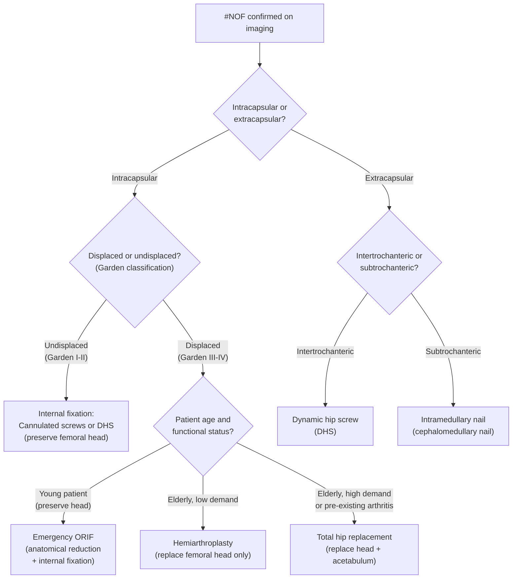

## Management of Common Fractures and Dislocations

### Overarching Principles — From First Principles

The management of fractures and dislocations follows a logical hierarchy dictated by threat to life, threat to limb, and then restoration of function. Every decision cascades from a simple question: **what is the most dangerous thing happening right now?**

***Life-threatening injuries*** take priority [15]:
- ***Non-orthopaedic***: airway obstruction, tension pneumothorax, massive haemorrhage from non-skeletal sources
- ***Orthopaedic***: ***haemorrhage, major crush injury, proximal amputation, multiple fractures*** [15]

***Limb-threatening injuries*** come next [15]:
- ***Vascular injury***
- ***Compartment syndrome***
- ***Dislocation of major joints***
- ***Open fractures*** [15]

***Priorities in management of multiple fractures*** [15]:
1. ***Open fractures with significant bleeding***
2. ***Unstable pelvic fractures***
3. ***Spinal fractures***
4. ***Femoral shaft fractures***
5. ***Other long bone fractures***

> The logic here is straightforward: stop the patient dying → stop the limb dying → fix the bone. An unstable pelvic fracture can exsanguinate a patient in minutes; a femoral shaft can lose > 1.5L of blood; open fractures with significant bleeding need urgent haemostasis. Spinal fractures are prioritised because further displacement can cause irreversible cord injury.

---

### The 6A Framework — Immediate Management [2]

| Step | Action | Rationale |
|---|---|---|
| **A**BC | Resuscitation (ATLS protocol) | Life before limb — always |
| **A**nti-swelling | RICE (Rest, Ice, Compression, Elevation) | Reduce oedema, limit secondary soft tissue damage |
| **A**nalgesics | Immobilisation is the best analgesic; pharmacological analgesia (paracetamol, NSAIDs, opioids) | Fracture fragments grinding = pain → muscle spasm → more displacement → more pain (vicious cycle). Immobilisation breaks this cycle |
| **A**naesthesia | Prepare for theatre if operative management anticipated | NPO, consent, pre-op bloods |
| **A**nchorage | Temporary splinting (slab, Thomas splint for femoral shaft, neck collar for C-spine, pelvic binder) | Prevents further displacement, controls bleeding, reduces pain, protects neurovascular structures |
| **A**nti-sepsis | Wound cleansing and dressing (remove gross debris but NOT bone fragments); cover with sterile dressing; IV antibiotics for open fractures; tetanus prophylaxis | Prevents infection — the single greatest threat to outcome in open fractures |

---

### Management Algorithm — General Approach

---

### The 3R Framework — Management of Closed Fractures [2]

#### R1: Reduction

**Definition**: restoring the fracture fragments to acceptable alignment.

**Aims** [2]:
- **Tamponade bleeding** (realigned bone ± splint compresses the fracture haematoma)
- **Restore blood supply** (displaced fragments can kink or stretch vessels)
- **Reduce traction on nerves** (displacement stretches nerves → neuropraxia)
- **Reduce traction on soft tissue** (displaced fragments increase compartment pressure)

**When is reduction NOT indicated?** [2]:
- No or little displacement (already in acceptable alignment)
- Reduction unlikely to succeed (e.g., compression fracture of vertebrae — you cannot "uncrush" cancellous bone)

**Methods:**

| Method | Description | Indications |
|---|---|---|
| **Closed reduction** | Apply **traction in the long axis of the limb** (Laplace's law — longitudinal traction counteracts the shortening force of muscles) + **reposition fragments by reversing the original direction of trauma** | First-line for most fractures; done under sedation/anaesthesia with fluoroscopic guidance |
| **Open reduction** | Surgical exposure of the fracture site to directly manipulate fragments under vision | When closed reduction fails or is inadequate |

<Callout title="NO CAST Mnemonic — Indications for Open Reduction" type="idea">

Open reduction is indicated when there is [2]:
- **N**on-union / Failed closed reduction
- **O**pen fracture
- Neurovascular **C**ompromise
- Intra-**A**rticular fracture (risk of secondary OA, misalignment)
- **S**alter-Harris type III–V
- Poly**T**rauma

This mnemonic helps you remember why some fractures absolutely cannot be managed conservatively.
</Callout>

**Post-reduction**: ALWAYS check **neurovascular status** + obtain **post-reduction X-ray** to confirm alignment [2].

#### R2: Restraint (Immobilisation)

**Purpose**: Hold the reduced fracture in position while it heals. Immobilisation also serves as the best analgesic.

| Modality | Description | Indications | Advantages | Disadvantages |
|---|---|---|---|---|
| **Splint** | Elastic, non-circumferential | Pre-hospital, initial immobilisation | Easy to apply, accommodates swelling | Allows some ROM at injury site |
| **Brace** | Elastic, circumferential | Functional bracing (e.g., humeral shaft after initial slab) | Allows controlled motion, load-sharing promotes callus | Not as rigid |
| **Slab (backslab)** | Rigid, non-circumferential | Acute fractures with significant soft tissue swelling (allows for swelling to expand without constriction) | Safe — cannot cause compartment syndrome from circumferential compression | Needs conversion to cast once swelling settles |
| **Cast** (plaster or fibreglass) | Rigid, circumferential | After swelling has settled, stable fractures requiring prolonged immobilisation | Superior immobilisation | Risk of compartment syndrome if applied too early (when limb is still swelling), pressure sores |
| **Spica** | Immobilises limb + trunk | Hip spica (paediatric femoral fractures), thumb spica (scaphoid fractures) | Excellent immobilisation of proximal segments | Cumbersome |
| **Sling** | Supports limb weight | Clavicle fracture (broad arm sling, figure-of-eight brace), proximal humerus, elbow injuries | Simple, comfortable | Limited immobilisation |
| **Traction** | Continuous pull along limb axis | Femoral shaft fracture (***Kendrick traction device*** → change to skin traction ASAP to prevent skin necrosis at groin; ***contraindicated in hip/pelvic fracture***) [2] | Realigns fracture, controls pain, controls blood loss | Prolonged bed rest, requires monitoring |
| **External fixation** | Bone stabilised by pins connected to an external frame at a distance from the fracture | Significant soft tissue injury, open fractures, temporary stabilisation ("damage control orthopaedics") | Minimal additional soft tissue disruption, allows wound access | Pin-site infection risk, bulky |
| **Internal fixation** | Surgical implants placed directly on/in the bone | Unstable fractures, multiple fractures, intra-articular fractures requiring anatomical reduction | Anatomical reduction, early mobilisation, rigid fixation | Periosteum stripping → affects healing; requires surgery |

**Types of Internal Fixation** [2]:

| Type | Examples | Best For | Key Features |
|---|---|---|---|
| **Extramedullary** | Plates and screws, lag screws, tension band wiring, K-wires | Intra-articular fractures, periarticular fractures, where anatomical reduction is paramount | Very stable, anatomical reconstruction; requires open approach → more soft tissue disruption |
| **Intramedullary** | Intramedullary nails (IMN) | Diaphyseal fractures (femoral shaft, tibial shaft, humeral shaft) | Semi-closed procedure, shorter OT time, allows direct full weight-bearing afterwards; load-sharing device |

> **Why does the choice of fixation matter?** Different fractures have different biomechanical demands. A femoral shaft fracture needs a load-sharing device (IMN) that allows early weight-bearing. A tibial plateau fracture needs anatomical reduction of the joint surface (ORIF with plates/screws) to prevent post-traumatic arthritis. An olecranon fracture needs tension band wiring to convert the tensile pull of the triceps into a compressive force that promotes healing [2].

#### R3: Rehabilitation

Rehabilitation begins from day 1, not after the cast comes off. The goals are:
- **Prevent stiffness** (immobilisation causes joint capsule contracture and muscle wasting)
- **Restore ROM** (physiotherapy)
- **Strengthen muscles** (progressive resistance exercises)
- **Restore function** (occupational therapy, return to activity)
- **Prevent complications** (DVT prophylaxis, pressure sore prevention, chest physiotherapy)

---

### Specific Management by Region

#### Shoulder

**Shoulder Dislocation — Anterior** [2]:
1. **Closed reduction** under sedation (multiple techniques: Hippocratic, Kocher, Stimson, traction-countertraction)
2. Post-reduction: **neurovascular check** (axillary nerve — regimental badge area) + **post-reduction X-ray**
3. **Broad arm sling** immobilisation × 2–3 weeks
4. Physiotherapy: rotator cuff and periscapular strengthening
5. **Recurrent instability** (especially in young patients): consider arthroscopic **Bankart repair** or **Latarjet procedure** (coracoid transfer for bone loss)

**Clavicle Fracture** [2]:
- **Conservative (mainstay)**: sling immobilisation (e.g., figure-of-eight brace), physiotherapy (ROM exercise, muscle strengthening). Usually heal within **4–6 weeks**.
- **Operative indications**: ***threatened skin*** (tented, tethered, non-blanching), ***open fracture***, ***bilateral fracture*** (to permit weight-bearing) [2]
- **Operative modalities**: closed reduction with IM fixation, ORIF (plate and screws if unable to unite)

**Proximal Humerus Fracture** [2]:
- **Non-operative** (if no displacement): ***sling immobilisation*** then rehabilitation
- **Operative** (displaced, open, neurovascular compromise):
  - Closed reduction with ***percutaneous pinning***: preferred for surgical neck fractures
  - **ORIF**: preferred for head-splitting fractures
  - **Hemiarthroplasty / Reverse shoulder arthroplasty (RSA)**: rare, for severely comminuted fractures in elderly

**Humeral Shaft Fracture** [2]:
- **Non-operative (1st line)**: coaptation splint → functional bracing
  - Acceptable limits: < 20° anterior angulation, < 30° varus/valgus, < 3 cm shortening
- **Operative indications**: open fracture, vascular injury, brachial plexus injury, pathologic fracture
  - ORIF (plate and screws or IMN)
- Usually heal in **8–12 weeks**
- Watch for **Holstein-Lewis fracture** (spiral fracture of distal third → radial nerve entrapment → wrist drop) [2]

#### Elbow

**Radial Head Fracture — Mason Classification and Management** [2]:
- **Type 1** (non-displaced / < 2 mm): ***elbow sling*** × 1 week in flexion → early mobilisation
- **Type 2** (displaced > 2 mm / angulated): **ORIF**
- **Type 3** (comminuted): ORIF ± LCL reconstruction; if ORIF not feasible → **radial head excision with replacement**

**Olecranon Fracture** [2]:
- **Non-operative**: minimally displaced < 2 mm / unfit for surgery → elbow sling × 1 week in flexion → early mobilisation
- **Operative**:
  - **Tension band wiring**: if fracture is proximal to coronoid process → converts tensile force of triceps into compression at fracture site
  - **Olecranon plating**: if fracture is at or distal to coronoid process

**Elbow Dislocation** [2]:
- **Simple** (no fracture): ***closed reduction*** (in-line traction or manipulation of olecranon) + splinting
- **Complex** (with fracture, e.g., ***terrible triad***): ***ORIF*** of coronoid process and radial head + LCL/MCL reconstruction

**Supracondylar Fracture (Children)** [2]:
- Non-displaced: above-elbow backslab
- Displaced: **closed reduction + percutaneous K-wire fixation** (usually 2–3 lateral pins)
- Open reduction if closed reduction fails or if vascular compromise (brachial artery)
- Monitor closely for **Volkmann's ischaemic contracture** (compartment syndrome of forearm)

#### Forearm

**Forearm Shaft Fractures (including Galeazzi and Monteggia)** [2]:
- Acute: RICE, analgesics, immobilisation by slab
- Definitive: ***Open reduction internal fixation (ORIF) is preferred*** because forearm fractures affect motion (supination, pronation) — you need anatomical reduction to restore the interosseous space and rotational axis [2]
- **Nightstick fracture** (isolated ulnar shaft): may be managed conservatively with cast if non-displaced

#### Wrist — Distal Radius Fracture

**Colles' / Smith Fracture** [2]:
- **Stable extra-articular fracture**: ***Closed reduction + short arm cast immobilisation × 6 weeks***
  - Closed reduction technique: traction + recreation of the deformity then reversal → mould the cast (3-point fixation)
- **Unstable fracture** (based on radiographic criteria — > 5 mm shortening, > 5° angulation change, > 2 mm step-off, comminution, associated ulnar fracture [NOT ulnar styloid]): ***ORIF with plating / K-wire fixation***
- **Open fracture**: **external fixation**

**Scaphoid Fracture** [2]:
- **Non-operative** (undisplaced fracture, or normal XR but high clinical suspicion): **thumb spica cast** immobilisation + repeat XR at 14 days ± MRI
- **Operative** (displaced or proximal pole fracture): **percutaneous screw fixation** — needed because the proximal pole has the poorest blood supply and highest AVN risk

#### Hand

- **Mallet finger** [2]: **DIP extension splint × 6–8 weeks**; surgery if Type III (joint subluxation / > 50% articular surface)
- **Boxer's fracture** (5th MC neck): closed reduction + ulnar gutter splint; rarely needs surgery unless significant rotational deformity
- **Bennett's fracture** (1st MC base, intra-articular): **ORIF** or closed reduction with percutaneous K-wire fixation — must restore articular surface of the CMC joint
- **Skier's thumb** (UCL rupture): partial tear → thumb spica; complete tear (Stener lesion) → surgical repair

**Salter-Harris Fractures** (Paediatric Epiphyseal Injuries) [2]:

| Type | Stability | Management |
|---|---|---|
| **I** (Straight through physis) | Stable | Closed reduction + cast. ***SCFE: ORIF (exception)*** |
| **II** (Above — metaphyseal fragment) | Stable | Closed reduction + cast |
| **III** (Lower — epiphyseal fragment, intra-articular) | Unstable | **ORIF** (must restore articular surface) |
| **IV** (Through and through — both meta + epiphysis) | Unstable | **ORIF** |
| **V** (Rammed/crushed) | Unstable | No specific acute treatment; ***highest risk of growth arrest*** |

#### Hip — Fracture Neck of Femur (#NOF)

This is one of the most important management algorithms in orthopaedic surgery:

**Key principles** [2]:
- **Intracapsular displaced** → high AVN risk ( > 95%) because retinacular vessels are disrupted → in elderly patients, replacing the head (arthroplasty) is better than trying to fix it and risking AVN/non-union
- **Extracapsular** → blood supply preserved → fix the fracture (DHS or IMN) and let it heal
- **Young patients with displaced intracapsular fractures** → attempt ORIF urgently (within 6 hours ideally) to try to preserve the native hip — AVN risk is accepted because joint replacement in the young has limited lifespan
- Post-operative: DVT prophylaxis, early mobilisation, **fall prevention measures**, **treatment of osteoporosis** (bisphosphonates + lifestyle modifications) [2]

#### Femoral Shaft Fracture [2]

- **Immediate**: traction splinting (***Kendrick traction device*** → change to skin traction ASAP)
  - ***Contraindicated in hip or pelvic fracture*** [2]
- **Operative** (within 24–48h): ***antegrade intramedullary nail*** (with closed or open reduction) — the gold standard
- **Non-operative** (rare): long leg cast only if non-displaced with multiple comorbidities making surgery too high-risk

#### Distal Femur Fracture [2]

- Immediate: skin traction
- **Operative** (mainstay): retrograde IMN (simple) / ORIF (complex) / external fixation (open fracture)
- Peri-prosthetic fractures may require ORIF or distal femoral replacement

#### Acetabular Fracture [2]

- **Pelvic binder is usually NOT indicated** (unlike pelvic ring fractures)
- **Undisplaced**: conservative management × 6–8 weeks (protected weight-bearing)
- **Displaced**:
  - Young: **ORIF** (restore joint surface anatomy)
  - Old: fracture fixation + **total hip replacement**

#### Pelvic Ring Fracture

- ***Unstable pelvic fracture*** is a ***life-threatening injury*** — massive haemorrhage potential [15]
- **Immediate**: pelvic binder (reduces pelvic volume → tamponades venous bleeding)
- **Haemodynamic instability**: resuscitation, massive transfusion protocol, pelvic external fixation, angiographic embolisation if arterial bleeding on CT
- **Definitive**: ORIF once patient is stable

#### Tibial Plateau Fracture [2]

- **Uncomplicated lateral plateau fracture**: ***hinged knee brace*** × 8–12 weeks, physiotherapy, analgesics
- **Complicated / Medial plateau fracture**: ***ORIF*** + post-op hinged knee brace × 8–12 weeks
- **Open fracture**: external fixation → delayed definitive surgery

#### Patella Fracture [2]

- **Non-displaced**: straight leg immobilisation by **hinged knee brace** → early weight-bearing in extension, quadriceps strengthening
- **Significantly displaced / disrupted extensor mechanism**: **ORIF with tension band wiring** — converts tensile force of the extensor mechanism into compression force to assist fracture healing
- **Comminuted**: partial/total patellectomy

#### Tibial Shaft Fracture [2]

- **Acute**: RICE, analgesics, ***reduction + above-knee backslab*** (anatomical reduction not necessary for shaft fractures — some overlap/shortening is acceptable). Monitor for compartment syndrome.
- **Uncomplicated**: closed reduction + ***intramedullary nail*** for early weight-bearing
- **Proximal/distal with intra-articular extension**: **ORIF**
- **Open fracture**: external fixation before definitive surgery

#### Ankle Fracture (Weber Classification) [2]

- **Non-operative** indications: non-displaced fracture, Weber A, Weber B **without talar shift**
  - ***Closed reduction + below-knee backslab***, repeat neurovascular exam + XR
- **Operative** indications: bimalleolar/trimalleolar fracture, Weber B **with talar shift**, Weber C, open fracture
  - ***ORIF*** ± ***syndesmotic screw*** / ***tightrope fixation***

> **Why does talar shift matter?** Even 1 mm of lateral talar shift reduces tibiotalar contact area by ~40%, dramatically accelerating degenerative change. That's why Weber B fractures are only stable if the talus hasn't shifted — once it shifts, the syndesmosis is disrupted and surgical fixation is needed.

#### Tibial Pilon Fracture [2]

- Non-operative: ***closed reduction + below-knee backslab***
- Operative (mainstay): **staged approach** — temporary external fixator → **ORIF after 7–14 days** (allowing soft tissue swelling to settle) ± ankle fixation by hindfoot nail

#### Calcaneal Fracture [2]

- Usually operative: closed reduction with percutaneous pinning or **ORIF**
- Assess posterior heel skin integrity — may require emergency surgery

#### Talar Fracture (Hawkins Classification) [2]

- **Type I** (undisplaced): conservative (below-knee cast)
- **Type II–IV** (displaced): **closed reduction + cast in A&E → urgent ORIF**

> The urgency here is because of the tenuous blood supply. Every hour of displacement further compromises the already precarious vascular supply → increases AVN risk.

#### Lisfranc Injury [2]

- **Non-displaced, ligamentous only**: weight-bearing cast × 6 weeks + close follow-up with repeat imaging
- **Displaced / bony Lisfranc**: **ORIF** (anatomical reduction of the tarsometatarsal alignment is critical) or primary arthrodesis

#### Spinal Fractures [14][16]

- **Medical**: ABC support, DVT prophylaxis, stress ulcer prophylaxis, analgesics, urinary catheter [16]
- ***Non-surgical immobilisation only in stable injuries***: spinal orthoses × 2–3 months [16]
  - ***Problems: pressure sores, weakening of muscles, soft tissue contractures, decreased pulmonary function, chronic pain syndrome*** [16]
- ***Surgical treatment in unstable injuries*** [16]:
  - ***Surgical decompression if a patient with normal cord function or incomplete cord lesion progressively deteriorates***
  - ***Reduction of fractures or dislocations***
  - ***Fixation of unstable spinal elements***
- ***Methylprednisolone is associated with higher risk of morbidity and complications and should NOT be used*** [16]

---

### Open Fracture Management

Open fractures warrant specific, urgent management because the breach in skin introduces the risk of infection (osteomyelitis), which is devastating for bone healing.

**Immediate Management:**
1. **Photograph the wound** (to avoid repeated exposure)
2. **Remove gross debris** but **NOT bone fragments** (these may be needed for reconstruction)
3. **Cover with sterile, saline-soaked dressing** — do not repeatedly inspect
4. ***Urgent IV antibiotics*** [2]:
   - **Cefuroxime** (covers skin flora: Staph, Strep) ± **Metronidazole** (covers anaerobes — important for soil-contaminated wounds)
   - Timing: as soon as possible — within 1 hour of injury
5. **Tetanus prophylaxis** (check immunisation status)
6. **Temporary immobilisation** (backslab or external fixation)
7. **Surgical debridement** within 12–24 hours (current best practice — previously "within 6 hours" was dogma, but evidence now supports effective debridement within a reasonable timeframe rather than a rigid 6-hour window)
8. **Definitive fixation**: depends on fracture type — often staged: external fixation first → definitive internal fixation when soft tissues permit

**Gustilo-Anderson Classification of Open Fractures:**

| Type | Wound | Soft Tissue | Contamination | Bone Injury | Management |
|---|---|---|---|---|---|
| I | < 1 cm | Minimal | Low | Simple pattern | Debridement + internal fixation usually possible |
| II | 1–10 cm | Moderate | Moderate | Moderate comminution | Debridement + internal fixation or external fixation |
| IIIA | > 10 cm | Severe but adequate soft tissue coverage possible | Severe | Severe comminution | Debridement + external fixation → staged internal fixation |
| IIIB | > 10 cm | Inadequate — requires flap coverage | Severe | Severe | External fixation + free flap (plastic surgery) |
| IIIC | Any | Associated vascular injury requiring repair | Any | Any | External fixation + vascular repair → highest amputation risk |

---

### Dislocation Management — General Principles

1. **Urgent closed reduction** — dislocations are time-sensitive because:
   - Compressed or stretched vessels cause ischaemia → tissue death
   - Stretched nerves → neuropraxia or permanent injury
   - Cartilage damage increases with time of incongruence
2. **Pre- and post-reduction neurovascular exam** — document meticulously
3. **Post-reduction X-ray** — confirm concentric reduction, look for associated fractures
4. **Immobilisation** — duration depends on joint (shoulder: 2–3 weeks; hip: traction × 4–6 weeks)
5. **Rehabilitation** — muscle strengthening to prevent recurrence

**Specific dislocation management is covered in each regional section above.**

---

### Osteoporosis Treatment in Fragility Fractures [6]

Every fragility fracture is an opportunity to diagnose and treat osteoporosis. Failure to do so leads to recurrent fractures (the "fracture cascade").

**Non-pharmacological** [6]:
- Adequate dietary calcium (1000–1200 mg) and vitamin D (600–800 IU)
- Regular weight-bearing exercise
- Smoking cessation, moderate alcohol
- **Fall prevention measures** (home hazard assessment, vision correction, medication review, physiotherapy for balance)

**Pharmacological** [6]:
- **Bisphosphonates** (alendronate, risedronate, zoledronic acid): first-line; inhibit osteoclast activity (bind to hydroxyapatite → taken up by osteoclasts during resorption → induce osteoclast apoptosis)
  - Side effects: GI upset (most common), osteonecrosis of the jaw, **atypical femoral fractures** (paradoxically — prolonged suppression of bone turnover → microdamage accumulation)
- **Denosumab**: anti-RANKL monoclonal antibody — blocks osteoclast differentiation
- **Teriparatide** (recombinant PTH 1-34): intermittent dosing stimulates osteoblasts > osteoclasts → anabolic effect
- **Romosozumab**: anti-sclerostin antibody — dual effect: ↑formation + ↓resorption (newest agent)

---

### Surgical Options Summary Table

| Fracture/Dislocation | Non-operative | Operative | When to Operate |
|---|---|---|---|
| **Clavicle** | Sling × 4–6 weeks | IM fixation / ORIF | Threatened skin, open, bilateral [2] |
| **Proximal humerus** | Sling → rehab | Percutaneous pinning / ORIF / RSA | Displaced, open, neurovascular compromise [2] |
| **Humeral shaft** | Coaptation splint → functional brace | ORIF | Open, vascular injury, brachial plexus injury, pathological [2] |
| **Radial head** | Sling × 1 week (Type 1) | ORIF (Type 2) / Excision + replacement (Type 3) | Displaced > 2 mm or comminuted [2] |
| **Olecranon** | Sling (< 2 mm displaced) | TBW / Plating | Displaced ≥ 2 mm [2] |
| **Forearm shaft** | Nightstick fracture only | **ORIF (preferred for all others)** | Almost always — rotation must be restored [2] |
| **Distal radius** | CR + short arm cast × 6 weeks | ORIF / K-wire / External fix | Unstable by radiographic criteria [2] |
| **Scaphoid** | Thumb spica (undisplaced) | Percutaneous screw | Displaced, proximal pole [2] |
| **#NOF intracapsular** | N/A | DHS/screws (undisplaced) / Arthroplasty (displaced elderly) / ORIF (displaced young) | All #NOF require surgery [2] |
| **#NOF extracapsular** | N/A | DHS (intertrochanteric) / IMN (subtrochanteric) | All require surgery [2] |
| **Femoral shaft** | Long leg cast (very rare) | **Antegrade IMN** (gold standard) | Almost always [2] |
| **Tibial plateau** | Hinged knee brace (uncomplicated lateral) | ORIF (complicated/medial) | Articular step-off, medial plateau, instability [2] |
| **Patella** | Hinged knee brace (undisplaced) | TBW / Partial patellectomy | Displaced or disrupted extensor mechanism [2] |
| **Tibial shaft** | Above-knee backslab (rare) | **IMN** (gold standard) | Almost always surgical [2] |
| **Ankle** | Below-knee backslab (Weber A/B no shift) | ORIF ± syndesmotic fixation | Bimalleolar, trimalleolar, Weber B + shift, Weber C [2] |
| **Calcaneus** | Rarely conservative | ORIF / Percutaneous pinning | Displaced intra-articular fractures [2] |
| **Talus** | Cast (Type I) | Urgent ORIF (Type II–IV) | Any displacement [2] |

---

<Callout title="High Yield Summary">

**Management Principles:**
1. ***Life-threatening before limb-threatening before function-restoring*** [15].
2. ***Priority: open fractures with bleeding → unstable pelvic → spinal → femoral shaft → other long bone*** [15].
3. **6A Framework**: ABC, Anti-swelling, Analgesics, Anaesthesia, Anchorage, Anti-sepsis [2].
4. **3R Framework**: Reduction → Restraint → Rehabilitation [2].
5. **NO CAST mnemonic** for open reduction: Non-union, Open fracture, neurovascular Compromise, intra-Articular, Salter-Harris III–V, polyTrauma [2].
6. **Forearm fractures** almost always need **ORIF** to restore rotational anatomy [2].
7. **#NOF**: intracapsular displaced → arthroplasty (elderly) / ORIF (young); extracapsular → DHS or IMN [2].
8. **Femoral shaft**: gold standard = antegrade IMN. Traction splint first, ***contraindicated in hip/pelvic fracture*** [2].
9. **Open fractures**: antibiotics within 1 hour (cefuroxime ± metronidazole), tetanus, debridement within 12–24h, staged fixation [2].
10. **Every fragility fracture** → investigate and treat osteoporosis + fall prevention [6].
11. ***Methylprednisolone should NOT be used in spinal cord injury*** [16].
12. **Tension band wiring** (olecranon, patella) converts tensile forces into compressive forces at the fracture site [2].

</Callout>

---

<ActiveRecallQuiz
  title="Active Recall - Management of Common Fractures and Dislocations"
  items={[
    {
      question: "List the priority order for managing multiple fractures in a polytrauma patient.",
      markscheme: "1. Open fractures with significant bleeding, 2. Unstable pelvic fractures, 3. Spinal fractures, 4. Femoral shaft fractures, 5. Other long bone fractures. Rationale: life-threatening haemorrhage first, then risk of cord injury, then major blood loss from femur."
    },
    {
      question: "An 80-year-old woman has a displaced intracapsular femoral neck fracture (Garden IV). She was previously independently mobile. What is the best surgical option and why?",
      markscheme: "Total hip replacement (THR) because: (1) displaced intracapsular fracture has >95% AVN risk if fixed internally, (2) she is high-demand (independently mobile) so hemiarthroplasty would give inferior long-term function, (3) THR replaces both femoral head and acetabulum giving better functional outcome. If low-demand, hemiarthroplasty would suffice."
    },
    {
      question: "State the NO CAST mnemonic for indications of open reduction and explain each letter.",
      markscheme: "N = Non-union or failed closed reduction. O = Open fracture. C = neurovascular Compromise. A = intra-Articular fracture (risk of secondary OA). S = Salter-Harris type III-V (cross physis - need anatomical reduction to prevent growth arrest). T = polyTrauma."
    },
    {
      question: "Why are almost all forearm shaft fractures managed with ORIF rather than cast immobilisation?",
      markscheme: "The forearm functions as a unit for pronation and supination. The radius rotates around the ulna through the interosseous space. Even minor malrotation or loss of interosseous space from non-anatomical healing significantly impairs forearm rotation. ORIF restores exact anatomy to preserve this critical function."
    },
    {
      question: "A patient sustains a Colles fracture. The post-reduction X-ray shows 7mm radial shortening and 8 degrees dorsal angulation. Is this acceptable? What should be done?",
      markscheme: "NOT acceptable - exceeds instability criteria (radial shortening >5mm and dorsal angulation >5 degrees). This is an unstable fracture. Management: ORIF with volar locking plate or K-wire fixation rather than cast immobilisation, as re-displacement is highly likely."
    },
    {
      question: "What is the role of tension band wiring in olecranon and patella fractures? Explain the biomechanical principle.",
      markscheme: "Tension band wiring converts the tensile forces generated by the extensor mechanism (triceps for olecranon, quadriceps for patella) into compressive forces at the fracture site. The figure-of-eight wire on the tension (posterior/superficial) side resists distraction, while the cortex on the compression (anterior/deep) side is pushed together. Compression promotes primary bone healing."
    }
  ]}
/>

## References

[2] Senior notes: maxim.md (Sections on principles of trauma management, 6A framework, 3R framework, Salter-Harris management, clavicle fracture management, proximal humerus management, humeral shaft management, radial head fracture Mason classification and management, olecranon fracture management, elbow dislocation management, forearm fracture management, distal radius fracture management, scaphoid fracture management, hand injury management, #NOF management, femoral shaft fracture management, distal femur fracture management, acetabular fracture management, tibial plateau management, patella fracture management, tibial shaft fracture management, ankle fracture management, pilon fracture management, calcaneal fracture management, talar fracture management, Lisfranc management)
[6] Senior notes: Ryan Ho Endocrine.pdf (p50 — osteoporosis treatment, FRAX, bisphosphonates)
[15] Lecture slides: GC 231. High Energy Trauma Open Fracture_Part 1.pdf (p5 — life-threatening injury; p6 — limb-threatening injury; p9 — priorities in multiple fractures)
[16] Senior notes: Ryan Ho Neurology.pdf (p177 — spinal fracture management, methylprednisolone contraindicated)
