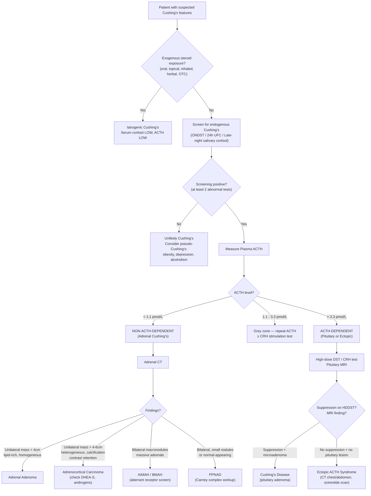

## Differential Diagnosis of Cushing's Syndrome (Adrenal Causes)

When a patient presents with clinical features suggestive of hypercortisolism, you must think systematically. The differential diagnosis operates at **two levels**:

1. **Is this truly Cushing's syndrome, or something that mimics it?** (i.e., "Cushing's vs. pseudo-Cushing's vs. other look-alikes")
2. **If it IS Cushing's syndrome, what is the cause?** (i.e., ACTH-dependent vs. non-ACTH-dependent → then sub-localise)

This is the logical scaffold on which the entire diagnostic approach is built. Let's work through it from first principles.

---

### 1. Level 1 — Is It Really Cushing's Syndrome?

Before diving into adrenal vs. pituitary vs. ectopic causes, you must first differentiate **true Cushing's syndrome** from conditions that can mimic its clinical features or cause biochemical hypercortisolism without true autonomous cortisol production.

#### 1.1 Pseudo-Cushing's Syndrome (Physiological Hypercortisolism)

***Some common disorders can also be associated with alterations in cortisol secretion*** — this is called **pseudo-Cushing's** [1][2][3]. These are conditions where the HPA axis is appropriately or excessively activated by a physiological stressor, not by autonomous cortisol production. They can cause mild biochemical hypercortisolism AND some Cushingoid features, making them a diagnostic trap.

| Condition | Why It Mimics Cushing's | Key Differentiating Point |
|:---|:---|:---|
| ***Obesity*** | Increased cortisol production rate (to match larger body mass), but cortisol clearance also increases → normal or mildly elevated UFC. Shares central obesity, HTN, DM, dyslipidaemia with CS. | ***In obesity with intact HPA axis, diurnal rhythm is preserved***; UFC usually < 3× ULN; ONDST usually suppresses. In children: ***obese children are typically TALL*** (↑insulin → ↑IGF-1 → linear growth), whereas Cushing's children have ***↓height percentile with ↑weight*** [1][3]. |
| ***Depression / major psychiatric illness*** | Chronic stress → CRH/ACTH activation → ↑cortisol. Loss of circadian rhythm may occur. | Usually partial diurnal variation preserved; CRH stimulation test may help (in pseudo-Cushing's, CRH further stimulates cortisol; in true CS, the response is often blunted or paradoxical). Desmopressin (DDAVP) stimulation test also helps. |
| ***Alcoholism*** | Ethanol activates the HPA axis → ↑CRH → ↑ACTH → ↑cortisol. Can even cause facial plethora and hepatic-driven metabolic derangement resembling CS. | ***Resolves with abstinence*** (typically within 1–3 weeks of alcohol cessation). Re-test after a period of sobriety. |
| **Chronic illness / physiological stress** | Surgery, severe infection, hospitalisation, poorly controlled pain → appropriate stress response with ↑cortisol. | Cortisol normalises when the acute stressor resolves. |
| **Pregnancy** | ↑CRH (placental), ↑cortisol-binding globulin (oestrogen-driven) → ↑total cortisol. Free cortisol also rises in 2nd/3rd trimester. | Physiological — interpret biochemical tests cautiously in pregnancy. |
| **Anorexia nervosa** | Starvation → chronic stress → HPA axis activation. | Low BMI, characteristic eating disorder features. |

<Callout title="Pseudo-Cushing's — Exam Pitfall" type="error">
A common exam scenario is an obese, depressed, heavy-drinking patient with borderline biochemical results. Remember: ***pseudo-Cushing's usually has preserved diurnal cortisol variation*** (late-night salivary cortisol may be more useful here), and ***24h UFC is typically less than 3–4× ULN*** [4]. If UFC is greater than 3–4× ULN, true Cushing's is very likely regardless.
</Callout>

#### 1.2 Clinical Look-Alikes (Not Hypercortisolism)

These conditions share individual features with Cushing's but do **not** have biochemical cortisol excess:

| Condition | Shared Features | Why It's NOT Cushing's |
|:---|:---|:---|
| **Metabolic syndrome** | Central obesity, HTN, DM, dyslipidaemia | No skin atrophy, no purple striae, no myopathy. Normal cortisol dynamics. |
| **Polycystic ovary syndrome (PCOS)** | Hirsutism, acne, oligo/amenorrhoea, obesity | Elevated androgens are ovarian (↑testosterone, ↑androstenedione from ovaries), not adrenal. Normal cortisol. LH:FSH ratio often elevated. |
| ***Congenital adrenal hyperplasia (CAH)*** | ***Young-onset with prominent androgen excess and primary amenorrhoea*** → ***consider CAH as d/dx*** [2][3] | CAH causes adrenal androgen excess (↑17-OH-progesterone) but typically LOW cortisol (enzyme block in cortisol synthesis) → NOT Cushingoid. Key: 17-OH-progesterone is elevated. |
| **Exogenous steroid use (occult)** | Full Cushingoid features | Serum cortisol and ACTH are both LOW; 24h UFC is LOW. ***Must rule out herbal medicine, OTC drugs for arthritis*** [2]. |
| **Hypothyroidism** | Weight gain, fatigue, depression | Distinct features (cold intolerance, bradycardia, dry skin, elevated TSH). No cortisol excess. |

---

### 2. Level 2 — What Is the Cause of Endogenous Cushing's?

Once you've established that the patient has **true endogenous hypercortisolism** (abnormal screening tests, exogenous steroids excluded), the next step is to determine the **aetiology**. The first branch point is **plasma ACTH**:

#### 2.1 ACTH-Dependent vs. Non-ACTH-Dependent (The Critical Branch Point)

***Measure plasma ACTH*** [1][2][3]:

| Plasma ACTH | Interpretation | Causes |
|:---|:---|:---|
| ***< 1.1 pmol/L (< 5 pg/mL)*** | ***Non-ACTH-dependent (adrenal)*** | Adrenal adenoma, adrenocortical carcinoma, AIMAH/BMAH, PPNAD |
| ***> 3.3 pmol/L (> 15 pg/mL)*** | ***ACTH-dependent*** | Cushing's disease (pituitary adenoma), ectopic ACTH syndrome, ectopic CRH |
| 1.1–3.3 pmol/L | **Grey zone** — equivocal | Repeat measurement; may need CRH stimulation test to clarify |

> **Why does ACTH level tell you the cause?** In adrenal Cushing's, the adrenal gland is autonomously producing cortisol. This excess cortisol feeds back on the hypothalamus and pituitary → suppresses CRH and ACTH → ACTH becomes very low. In ACTH-dependent causes, ACTH is being autonomously produced (by the pituitary tumour or an ectopic source) and is therefore elevated, overriding the normal negative feedback.

---

### 3. Differential Diagnosis Within Non-ACTH-Dependent (Adrenal) Cushing's

This is the core focus. Once ACTH is confirmed to be **suppressed**, you know the source is the adrenal gland. Now you must distinguish between the specific adrenal pathologies:

| Cause | Key Distinguishing Features | Imaging | Hormonal Pattern |
|:---|:---|:---|:---|
| ***Adrenal adenoma (~15% of endogenous CS)*** [2][3] | Gradual onset. Pure cortisol excess. Typically female, bimodal age. | Unilateral mass, usually < 4 cm, well-circumscribed, lipid-rich (< 10 HU on unenhanced CT), rapid contrast washout [5]. | Cortisol ↑, ACTH ↓, DHEA-S typically low (because ACTH suppression → atrophy of normal adrenal → ↓adrenal androgens) |
| ***Adrenal carcinoma (ACC, ~5% of endogenous CS)*** [2][3] | ***Rapid onset***, often with ***virilisation (androgen co-secretion)*** [2][3]. Abdominal pain/mass. Weight loss despite Cushingoid fat redistribution. | Unilateral mass, usually **> 4–6 cm**, heterogeneous (necrosis, haemorrhage, calcification), > 10 HU, delayed contrast washout, local invasion, ± metastases [5]. | **Mixed hormone secretion**: cortisol + androgens (DHEA-S markedly elevated) ± oestrogens ± mineralocorticoids. ACTH ↓. |
| **AIMAH / BMAH** | Insidious onset, older adults (5th–6th decade). May have food-dependent Cushing's (GIP-receptor). | **Bilateral** massive adrenal enlargement with multiple macronodules. | Cortisol ↑, ACTH ↓. May show aberrant cortisol responses (e.g., ↑cortisol postprandially, with upright posture, or to GnRH). |
| **PPNAD (Carney complex)** | Young patients (children/adolescents). Other features of ***Carney complex***: cardiac myxomas, lentigines, schwannomas. | **Bilateral** adrenals, may appear normal or slightly nodular on imaging (nodules are small, < 6 mm). | Cortisol ↑, ACTH ↓. **Paradoxical ↑cortisol on Liddle test** (standard low-dose DST). |
| ***Iatrogenic (exogenous steroids)*** [2] | ***History of steroid use — must ask about all forms including herbal medicine and OTC drugs*** [2]. | Adrenals may appear normal or bilaterally atrophied (from ACTH suppression). | Serum cortisol LOW, ACTH LOW, 24h UFC LOW — but patient is clinically Cushingoid. Key: the exogenous synthetic steroid is not measured by cortisol assays. |

#### 3.1 Key Differentiators: Adenoma vs. Carcinoma

This is the most practically important distinction because it determines urgency, surgical approach, and prognosis [4][5]:

| Feature | Adenoma | Carcinoma |
|:---|:---|:---|
| **Size** | ***Usually < 4 cm*** | ***Usually > 4–6 cm; 90% malignant if > 4 cm*** [5] |
| **Configuration** | ***Homogeneous, smooth, well-circumscribed*** [5] | Irregular, heterogeneous, necrosis, haemorrhage |
| ***Lipid content*** | ***Lipid-rich → low attenuation (< 10 HU) on unenhanced CT*** [5] | Lipid-poor → high attenuation (> 10 HU) |
| ***Contrast washout*** | ***Rapid washout (> 60% absolute washout at 15 min)*** | ***Delayed washout (< 60%)*** → ***malignant tumours tend to retain contrast*** [5] |
| **Hormone secretion** | Cortisol alone | Mixed (cortisol + androgens ± others) |
| **DHEA-S** | Low or normal (suppressed by low ACTH) | **Markedly elevated** (autonomous androgen production) |
| **Growth** | Stable | ***Growing > 0.5 cm in 6 months*** → suspicious [4] |
| **Local invasion** | Absent | May invade IVC, renal vein, kidney, liver |

<Callout title="DHEA-S — Underappreciated Clue">
In a cortisol-secreting adrenal adenoma, ACTH is suppressed → the normal adrenal tissue (including zona reticularis) atrophies → **DHEA-S falls**. In adrenocortical carcinoma, the tumour autonomously produces DHEA-S (and other androgens) → **DHEA-S is markedly elevated**. This discordance (↑cortisol with ↑DHEA-S) strongly suggests malignancy.
</Callout>

---

### 4. Differential Diagnosis Within ACTH-Dependent Cushing's (For Completeness / Comparison)

Even though this topic focuses on adrenal causes, you must understand the ACTH-dependent differentials to properly exclude them and to appreciate where adrenal causes sit in the wider picture:

| Cause | Key Features | Differentiating Investigations |
|:---|:---|:---|
| ***Cushing's disease (pituitary adenoma, 65–70%)*** [2][3] | ***Usually a/w microadenoma*** → ***less likely to have hypopituitarism, visual failure, disconnection hyperprolactinaemia*** [2][3]. F > M (3–8:1), age 25–45y. Gradual onset, classical Cushingoid features. ***Hyperpigmentation*** (↑ACTH). | ***High-dose DST: suppression*** (pituitary adenoma retains partial feedback sensitivity). CRH test: ↑ACTH/cortisol response. Pituitary MRI: microadenoma. Bilateral IPSS if MRI negative. |
| ***Ectopic ACTH syndrome (10–15%)*** [2][3] | Two patterns: (a) Occult tumour (bronchial carcinoid, thymic carcinoid) — may look like Cushing's disease; (b) ***Malignant tumour (SCLC) — onset usually rapid with cachexia → less common to have classical symptoms of Cushing's*** [2][3]. ***Usually hypoK instead of classical Cushingoid features*** [2][3] (very high cortisol → overwhelms 11β-HSD2). ***Typically older men > 50y*** [2]. | High-dose DST: **no suppression** (tumour is autonomous, no feedback sensitivity). CRH test: no response. CT chest/abdomen to locate tumour. Octreotide scan / PET-CT. |
| **Ectopic CRH syndrome** | Exceedingly rare. Tumour secretes CRH → ↑ACTH → ↑cortisol. | ↑CRH levels. May mimic Cushing's disease on dynamic testing. |

---

### 5. Differential Diagnosis of an Adrenal Mass with Cushing's Features

When the clinical presentation is an ***adrenal incidentaloma*** [4][5] with biochemical evidence of cortisol excess, the differential is:

| Diagnosis | Frequency | Features |
|:---|:---|:---|
| ***Non-functional adenoma*** | ***85% of incidentalomas*** [5] | No hormone excess. Lipid-rich, < 4 cm. |
| ***Subclinical Cushing's (cortisol-secreting adenoma)*** | ***~6% of incidentalomas*** [4] | Abnormal ONDST but no/few overt Cushingoid features. ↑cardiometabolic risk. |
| **Overt cortisol-secreting adenoma** | Uncommon as incidentaloma | Full Cushingoid features. |
| ***Phaeochromocytoma*** | ~5% | ***Classic triad: paroxysmal headache, sweating, palpitations*** [6]. Screen with ***24h urine metanephrines*** [4][6]. **Must exclude before biopsy** — biopsy can precipitate hypertensive crisis [5]. |
| ***Conn's syndrome (aldosterone-producing adenoma)*** | ~1% | HTN with ***hypokalaemic alkalosis***. Screen with ***plasma aldosterone:renin ratio (ARR)*** [4][6]. |
| **Adrenocortical carcinoma** | ~5% of incidentalomas | Large (> 4 cm), heterogeneous, mixed hormones, contrast retention. |
| **Adrenal metastasis** | Common in known malignancy | Most commonly from lung, breast, melanoma, renal, colon. Usually bilateral. History of primary cancer. **Biopsy may be indicated** to confirm (unlike primary adrenal tumours) [5]. |
| **Others** | Rare | Myelolipoma (contains fat and haematopoietic tissue — characteristic on CT), cyst, haemangioma, ganglioneuroma, granulomatous disease (TB, sarcoidosis) |

> ***Approach to adrenal incidentaloma: Is it functional? Is it malignant?*** [4] — Screen with ***ONDST + spot ARR + 24h urine metanephrines*** [4].

---

### 6. Mermaid Differential Diagnosis Algorithm

---

### 7. Summary Table — Complete Differential Diagnosis

| Category | Differential | Key Differentiating Feature |
|:---|:---|:---|
| **Pseudo-Cushing's** | Obesity, depression, alcoholism, physiological stress, pregnancy | Preserved diurnal rhythm, UFC < 3–4× ULN, resolves with treatment of underlying condition |
| **Iatrogenic** | Exogenous glucocorticoids (oral, inhaled, topical, ***herbal/OTC***) | Drug history; cortisol LOW, ACTH LOW, UFC LOW |
| **ACTH-dependent** | Cushing's disease (pituitary) | ACTH ↑, suppresses on HDDST, microadenoma on MRI |
| | Ectopic ACTH (SCLC, carcinoid) | ACTH ↑↑, ***hypoK***, no suppression on HDDST, rapid onset/cachexia |
| **Non-ACTH-dependent** | Adrenal adenoma | ACTH ↓, unilateral < 4 cm, lipid-rich, cortisol only, DHEA-S low |
| | Adrenocortical carcinoma | ACTH ↓, large > 4–6 cm, heterogeneous, mixed hormones, DHEA-S ↑↑ |
| | AIMAH / BMAH | ACTH ↓, bilateral massive adrenals, aberrant receptors |
| | PPNAD (Carney complex) | ACTH ↓, bilateral small nodules, young patient, paradoxical Liddle |
| **Clinical look-alikes** | Metabolic syndrome, PCOS, CAH, hypothyroidism | Normal cortisol dynamics; specific features of each condition |

<Callout title="Don't Forget in Adrenal Incidentaloma Workup" type="idea">
When an adrenal mass is found incidentally, always screen for ALL three functional tumour types, not just Cushing's: ***ONDST (Cushing's) + spot ARR (Conn's) + 24h urine metanephrines (phaeochromocytoma)*** [4][6]. Missing a phaeochromocytoma before surgery can be fatal (hypertensive crisis during manipulation).
</Callout>

<Callout title="Clinical Clues to Underlying Cause — High Yield" >

- ***↑ACTH → hyperpigmentation*** [2][3]
- ***Ectopic ACTH (malignant, e.g. SCLC): onset usually rapid with cachexia → less common to have classical symptoms of Cushing's; usually hypoK instead of classical Cushingoid features*** [2][3]
- ***Cushing's disease: usually a/w microadenoma → less likely to have hypopituitarism, visual failure, disconnection hyperprolactinaemia*** [2][3]
- ***Iatrogenic Cushing's: more likely a/w AVN, glaucoma and posterior subcapsular cataracts*** [2][3]
- **Adrenal carcinoma**: rapid onset + virilisation + large mass + elevated DHEA-S
- ***Consider CAH as d/dx if young-onset with prominent androgen excess and primary amenorrhoea*** [2][3]
</Callout>

---

<ActiveRecallQuiz
  title="Active Recall - Differential Diagnosis of Cushing's Syndrome (Adrenal Causes)"
  items={[
    {
      question: "Name three conditions that cause pseudo-Cushing's syndrome and explain why they mimic true Cushing's biochemically.",
      markscheme: "Obesity (increased cortisol production rate, shared metabolic features), depression (chronic HPA axis activation via stress/CRH), alcoholism (ethanol activates HPA axis via CRH). All three can cause mildly elevated UFC and some loss of diurnal variation, but usually UFC is less than 3-4x ULN and diurnal rhythm is at least partially preserved."
    },
    {
      question: "A patient has confirmed endogenous Cushing's syndrome with a suppressed ACTH level. CT shows a 7 cm heterogeneous adrenal mass with calcification. DHEA-S is markedly elevated. What is the most likely diagnosis and what hormone pattern do you expect?",
      markscheme: "Adrenocortical carcinoma. Expect mixed hormone secretion: elevated cortisol plus elevated adrenal androgens (DHEA-S, androstenedione), possibly with mineralocorticoids and/or oestrogens. ACTH suppressed. Large size (greater than 4 cm), heterogeneous appearance, calcification, and contrast retention all point to malignancy."
    },
    {
      question: "How does DHEA-S help differentiate between a cortisol-secreting adrenal adenoma and an adrenocortical carcinoma?",
      markscheme: "In adrenal adenoma: autonomous cortisol suppresses ACTH via negative feedback, causing atrophy of normal adrenal tissue including zona reticularis, so DHEA-S is LOW. In adrenocortical carcinoma: the tumour autonomously produces androgens (DHEA-S) in addition to cortisol, so DHEA-S is MARKEDLY ELEVATED despite suppressed ACTH. Discordantly elevated DHEA-S with suppressed ACTH strongly suggests malignancy."
    },
    {
      question: "What three screening investigations should be performed for every adrenal incidentaloma, and what condition does each screen for?",
      markscheme: "1) 1 mg overnight dexamethasone suppression test (ONDST) for Cushing's syndrome / subclinical cortisol excess. 2) Plasma aldosterone-to-renin ratio (ARR) for primary hyperaldosteronism (Conn's). 3) 24-hour urine fractionated metanephrines (or plasma metanephrines) for phaeochromocytoma."
    },
    {
      question: "Why is hypokalaemia typically more prominent in ectopic ACTH syndrome than in adrenal Cushing's syndrome?",
      markscheme: "Ectopic ACTH syndrome (especially from SCLC) produces very high levels of ACTH, driving massively elevated cortisol production. This extreme cortisol excess overwhelms the capacity of 11-beta-HSD2 in the kidney to convert cortisol to inactive cortisone. Unmetabolised cortisol then activates mineralocorticoid receptors causing marked Na retention, K wasting, and H wasting (hypokalaemic alkalosis). In adrenal Cushing's, cortisol levels are typically lower, so 11-beta-HSD2 is less saturated and hypokalaemia is milder or absent."
    },
    {
      question: "A child presents with Cushingoid features, bilateral small adrenal nodules on CT, and lentigines on the skin. What is the diagnosis, the underlying genetic mutation, and the expected response to a standard low-dose DST?",
      markscheme: "Primary pigmented nodular adrenodysplasia (PPNAD) as part of Carney complex. Caused by inactivating mutation in PRKAR1A (regulatory subunit of protein kinase A) leading to constitutive PKA activity and autonomous cortisol production. On standard low-dose DST (Liddle test), there is a PARADOXICAL RISE in cortisol (because dexamethasone suppresses the remaining normal adrenal tissue via ACTH suppression, but the autonomous PPNAD nodules continue to secrete, and with less dilution the cortisol appears to rise)."
    }
  ]}
/>

## References

[1] Senior notes: Adrian Lui Pediatrics.pdf (Section 8.3.2 Cushing's Syndrome, p284–286)
[2] Senior notes: Ryan Ho Endocrine.pdf (Section 3.3 Cushing's Syndrome, p60–61)
[3] Senior notes: Ryan Ho Fundamentals.pdf (Section 3.8.3 Presenting Problems in Adrenal Glands — Cushing's Syndrome, p435–436)
[4] Senior notes: maxim.md (Adrenal incidentaloma, Cushing syndrome sections)
[5] Senior notes: Ryan Ho Fundamentals.pdf (Section 3.8.3 — Adrenal Incidentaloma, p438)
[6] Senior notes: Ryan Ho Cardiology.pdf (Secondary Hypertension workup, p177–178)
