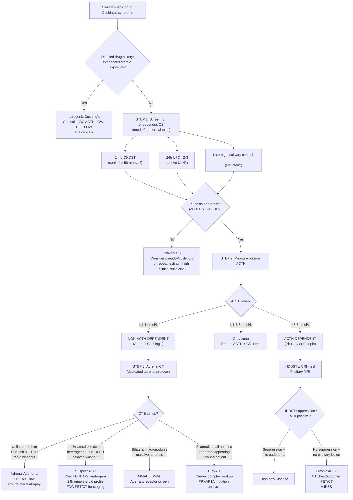

## Diagnostic Criteria, Diagnostic Algorithm, and Investigation Modalities

The diagnosis of Cushing's syndrome (CS) — and specifically localising it to an adrenal cause — is a **stepwise process**. Think of it as answering three questions in sequence:

1. **Does this patient truly have Cushing's syndrome?** (Establish the diagnosis of hypercortisolism)
2. **Is it ACTH-dependent or non-ACTH-dependent?** (Determine the category)
3. **What is the specific adrenal pathology?** (Localise and characterise the lesion)

Each step has its own investigations with specific principles, pitfalls, and interpretations. Let's work through them from first principles.

---

## 1. Step 0: Exclude Exogenous Glucocorticoid Exposure

***Iatrogenic Cushing's syndrome due to excessive exogenous glucocorticoid exposure must be ruled out first*** [5][7].

This is not a "test" — it's a thorough **drug history**. Before ordering a single blood test, you must ask about:

- Oral glucocorticoids (prednisolone, dexamethasone, hydrocortisone)
- Inhaled glucocorticoids (high-dose fluticasone, budesonide)
- Topical steroids (clobetasol, betamethasone)
- Intra-articular / epidural injections
- Eye drops, nasal sprays
- ***Any herbal medicine, any "OTC drugs for arthritis"*** [2] — this is critical in Hong Kong where traditional Chinese medicine preparations may contain undisclosed dexamethasone
- ***Even topical or inhaled corticosteroids can induce Cushing's syndrome. A detailed drug history is therefore needed*** [2]

> **Why do this first?** Because in iatrogenic CS, serum cortisol is LOW (the exogenous synthetic steroid isn't measured by cortisol assays unless it's hydrocortisone), ACTH is LOW, and 24h UFC is LOW. All the screening tests will give confusing or negative results if you don't know the patient is on exogenous steroids. The clinical picture (Cushingoid features) without biochemical hypercortisolism should prompt you to hunt for hidden steroid exposure.

---

## 2. Step 1: Establish the Diagnosis of Endogenous Cushing's Syndrome

### 2.1 When to Test

***Testing for CS is indicated for*** [5]:
- ***Patients with unusual features for age (e.g., osteoporosis, hypertension)***
- ***Patients with multiple and progressive features, especially those that are more predictive of CS (e.g., easy bruising, facial plethora, proximal myopathy, striae)***
- ***Children with ↓height percentile and ↑weight***
- ***Patients with adrenal incidentaloma compatible with adenoma***

### 2.2 Diagnostic Criteria

There is no single pathognomonic test. The Endocrine Society (2008, reaffirmed in latest guidelines) recommends:

> ***≥2 tests abnormal → diagnostic of Cushing's syndrome*** [1][2][3]

***No single best test*** — ***if abnormal, should perform another confirmatory test or repeat abnormal test*** [1][2][3].

An alternative shortcut: ***24h UFC > 3–4× ULN*** is considered virtually diagnostic on its own [4].

### 2.3 The Three Screening Modalities

***Initial testing is based on three main modalities*** [5]:
- ***24-hour urinary free cortisol (UFC) ×2***
- ***Late-night salivary cortisol ×2***
- ***1 mg overnight dexamethasone suppression test (DST)***

Let's examine each in detail:

---

#### A. 1 mg Overnight Dexamethasone Suppression Test (ONDST)

This is the most commonly used first-line screening test, especially in outpatient settings [5][7].

**Principle (from first principles):**
- Dexamethasone ("dexa" = a potent synthetic glucocorticoid) is given exogenously.
- In a **normal person**: dexamethasone activates glucocorticoid receptors in the hypothalamus and pituitary → suppresses CRH and ACTH → the adrenal glands stop making cortisol → morning cortisol falls to very low levels.
- In **Cushing's syndrome**: the cortisol production is autonomous (whether from adrenal tumour, pituitary adenoma, or ectopic source). The source does NOT respond to the normal negative feedback of this low dose of dexamethasone → cortisol remains elevated.

***Procedure*** [1][2][3][5][7]:
- ***Basal cortisol at 0900h***
- ***1 mg dexamethasone orally at 2300h (midnight)***
- ***Cortisol measurement again at 0900h the following morning***

***Interpretation*** [4][5][7]:
- ***Normal: cortisol suppressed to < 50 nmol/L (1.8 µg/dL)*** [4][5][7]
- ***Cushing's syndrome: cortisol > 50 nmol/L (failure to suppress)*** [4][5][7]
- Sensitivity ~95–98% (high — good for screening)
- Specificity ~80% (moderate — false positives are common)

***False positives (failed suppression in non-CS)*** [7]:
| Cause | Mechanism |
|:---|:---|
| ***Enzyme-inducing drugs (e.g., anticonvulsants — phenytoin, carbamazepine, phenobarbital; rifampicin)*** | ***↑dexamethasone clearance*** via CYP3A4 induction → lower dexamethasone levels → inadequate suppression of ACTH [1][7] |
| ***Women on OC pills or pregnancy*** | ***↑corticosteroid-binding globulin (CBG)*** → ↑total cortisol (even though free cortisol may be normal). ***Should stop oestrogen-containing preparations for ≥6 weeks*** before testing [1][2][3] |
| ***Severe depression (30–50%)*** | Chronic HPA axis activation → stress-mediated hypercortisolism |
| ***Chronic alcohol abuse*** | Ethanol activates HPA axis |
| ***Marked obesity*** | ↑Cortisol production rate |
| ***Renal failure on dialysis*** | Altered dexamethasone metabolism |
| ***Systemic illnesses (10–20%)*** | Stress response |

***False negatives (suppression despite CS; very rare, < 2%)*** [7]:
- ***Cyclical Cushing's syndrome*** (cortisol secretion is intermittent — tested during a "trough")
- ***Slow metabolism of dexamethasone*** → drug levels accumulate → excessive suppression

<Callout title="DST Caveats — Must Know for Exams" type="error">
***Dexamethasone is metabolised by CYP3A4*** — any CYP3A4 inducer (anticonvulsants, rifampicin) will increase clearance, causing false-positive results. Solution: ***use IV dexamethasone (↓first-pass metabolism) and check serum dexamethasone level if indicated*** [1][2]. Also, ***oestrogen (OCP/pregnancy) → ↑CBG → ↑total cortisol*** → stop OCP ≥6 weeks before testing.
</Callout>

**Variant — Standard Low-Dose DST (Liddle's Test)** [1][2][3][7]:
- ***0.5 mg dexamethasone PO Q6H for 2 days*** (total 4 mg over 48h) → cortisol measurement at the end
- ***More specific and sensitive*** than overnight DST [7]
- Used as an inpatient confirmatory test
- Same interpretation: failure to suppress cortisol to < 50 nmol/L = CS

---

#### B. 24-Hour Urinary Free Cortisol (UFC)

***Method: 24-hour urine collection for total free cortisol excretion*** [1][2][3][5]

**Principle:**
- Cortisol in blood is ~90% protein-bound (to CBG and albumin) and ~10% free. Only free cortisol is biologically active and is filtered by the kidneys.
- By collecting urine over 24 hours, you get an **integrated measure** of free cortisol production, ***removing the effect of pulsatile secretion*** [1][2][3]. This avoids the problem of a single random cortisol level being misleadingly high or low due to CRH pulsatility.
- ***Free cortisol is measured because cortisol-binding globulin level may vary*** — by measuring free cortisol specifically, you eliminate this variable [5].

**Interpretation:**
- Normal range varies by laboratory (typically < 250 nmol/24h or < 90 µg/24h by HPLC/LC-MS/MS)
- Elevated UFC = hypercortisolism
- ***UFC > 3–4× ULN → virtually diagnostic of Cushing's syndrome*** [4] — pseudo-Cushing's very rarely causes this degree of elevation
- Should be collected ***×2 (or ×3)*** because of day-to-day variability [4][5]

**Caveats** [1][2][3][5]:
- ***Does not distinguish patients with physiological hypercortisolism (e.g., depression, obesity)*** — both true CS and pseudo-CS can have mildly elevated UFC
- Under-collection or over-collection errors → check urine creatinine to validate completeness
- ***Not reliable in renal impairment*** (GFR < 30 mL/min → reduced cortisol filtration → falsely low UFC)
- High fluid intake can falsely elevate UFC (↑GFR → ↑cortisol filtration)

**Additional value**: ***the 24h urine steroid profile can be measured simultaneously*** — this allows detection of ***synthetic steroids (indicates iatrogenic Cushing's)*** and ***fetal-origin steroid metabolites (suggests adrenocortical carcinoma)*** [2].

---

#### C. Late-Night Salivary Cortisol

***Principle: CS patients have loss of normal cortisol circadian rhythm*** [1][2][3][5]

**From first principles:**
- In a normal person, cortisol follows a circadian rhythm: highest at ~0600–0800h, lowest at ~2300–0000h (midnight).
- In Cushing's syndrome, this rhythm is **abolished** — cortisol remains inappropriately elevated throughout the 24-hour cycle, including at midnight.
- ***Only free cortisol will be present in saliva due to ultrafiltration*** [5] — salivary cortisol reflects the biologically active free cortisol fraction, unaffected by CBG levels. This is a major advantage over serum cortisol.

**Procedure:**
- Patient collects saliva at 2300h (using a cotton swab/collection device, e.g., Salivette)
- Should be collected ***×2*** on separate nights [5]
- Must avoid eating, drinking (especially alcohol), smoking, or brushing teeth 30 min before collection (to avoid blood contamination)

**Interpretation:**
- Cut-off varies by assay; typically > 2.0 nmol/L (by LC-MS/MS) is considered elevated
- Sensitivity ~93–100%, Specificity ~93–100% (excellent for screening)

**Caveats:**
- ***Not readily available*** — requires sensitive analytical tools like LC-MS/MS [5]
- ***Not suitable for shift workers*** — their circadian rhythm is disrupted physiologically [5]
- Smoking, oral lesions → blood contamination → falsely elevated

---

#### D. Serum Cortisol (Supplementary, Not Standard Screening)

***Serum cortisol is not a standard diagnostic test but is often done first ×2 at early AM + late night*** [1][2]:
- ***Cushing's syndrome: often with loss of diurnal variation*** (early morning cortisol may be normal, but ***late-night cortisol is often raised and similar to morning cortisol***) [1][2]
- ***Pseudo-CS: usually intact diurnal variation despite ↑cortisol secretion*** [1][2]
- Random cortisol is unreliable due to pulsatile secretion and stress response — this is why paired AM + late-night cortisol is more informative

---

### 2.4 Summary of Screening Tests

| Test | Principle | Procedure | Positive Result | Sensitivity | Specificity | Key Caveats |
|:---|:---|:---|:---|:---|:---|:---|
| ***1 mg ONDST*** | Negative feedback suppression | 1 mg dexa at 2300h → cortisol at 0900h | ***> 50 nmol/L*** | ~95–98% | ~80% | CYP3A4 inducers, OCP/pregnancy, depression, alcohol |
| ***24h UFC*** | Integrated free cortisol | 24h urine collection ×2–3 | > ULN (or ***> 3–4× ULN = diagnostic***) | ~90–95% | ~85–95% | Does not distinguish pseudo-CS if mildly elevated; renal impairment |
| ***Late-night salivary cortisol*** | Loss of circadian rhythm | Saliva at 2300h ×2 | > assay-specific cut-off | ~93–100% | ~93–100% | Limited availability, shift workers, smoking |

***Physiological conditions and drugs associated with hypercortisolism or interference of testing must also be considered*** [5].

---

## 3. Step 2: Determine ACTH Dependence

Once endogenous Cushing's syndrome is confirmed biochemically, the next critical step is to measure ***plasma ACTH*** [1][2][3]:

***Plasma ACTH*** [2][3]:
- ***< 1.1 pmol/L (< 5 pg/mL) → non-ACTH-dependent CS → adrenal workup (imaging)*** [2][3]
- ***> 3.3 pmol/L (> 15 pg/mL) → ACTH-dependent CS → pituitary/ectopic workup (HDDST, CRH test, imaging)*** [2][3]
- 1.1–3.3 pmol/L → grey zone → repeat; may need CRH stimulation test

**Why does this work?**
- In adrenal Cushing's: the adrenal tumour autonomously produces cortisol → negative feedback suppresses CRH and ACTH → ACTH is very low (often undetectable).
- In pituitary Cushing's (Cushing's disease): the pituitary adenoma autonomously produces ACTH → ACTH is normal-high.
- In ectopic ACTH: the tumour produces ACTH independent of hypothalamic control → ACTH is usually high.

**Practical considerations:**
- ACTH is an unstable peptide — blood must be collected in a pre-chilled EDTA tube, kept on ice, and processed rapidly (separated within 30 min). Otherwise ACTH degrades → falsely low result.
- Should be measured in the **morning** (0800–0900h) for consistency.

> For **adrenal Cushing's**: ***ACTH is almost invariably undetectable*** [1][2][3]. This single result points you directly to the adrenal glands as the source.

---

## 4. Step 3: Localise and Characterise the Adrenal Pathology

Once ACTH is confirmed to be suppressed, the diagnosis is **non-ACTH-dependent (adrenal) Cushing's syndrome**. The next step is ***adrenal CT*** [1][2][3].

### 4.1 Adrenal CT (Dedicated Adrenal Protocol)

This is the **primary imaging modality** for evaluating adrenal pathology in non-ACTH-dependent CS [1][2][3].

**Protocol:**
- Non-contrast CT (unenhanced) → contrast-enhanced CT → delayed washout images (at 15 minutes post-contrast)
- Thin-section (2–3 mm slices) through adrenal glands

**Key Findings and Interpretation** [2][5][8]:

| Feature | Benign Adenoma | Adrenocortical Carcinoma | AIMAH/BMAH | Metastasis |
|:---|:---|:---|:---|:---|
| **Laterality** | Unilateral | Unilateral | ***Bilateral*** | Often bilateral |
| ***Size*** | ***Usually < 4 cm*** | ***Usually > 4–6 cm*** (***90% malignant if > 4 cm*** [5][8]) | Bilateral massive enlargement | Variable |
| ***Configuration*** | ***Homogeneous, smooth, well-circumscribed*** [5][8] | Irregular, heterogeneous, necrosis, haemorrhage, calcification | Multiple macronodules, bilateral | Irregular |
| ***Lipid content (unenhanced HU)*** | ***Lipid-rich → < 10 HU*** [2][5][8] | ***Lipid-poor → > 10 HU*** | Variable | Usually > 10 HU |
| ***Contrast washout*** | ***Rapid washout (> 60% absolute washout at 15 min)*** [5][8] | ***Delayed washout (< 60%) — malignant tumours tend to retain contrast*** [5][8] | Variable | Delayed washout |
| **Local invasion** | Absent | May invade IVC, renal vein, kidney, liver | Absent | May be present |
| **Contralateral adrenal** | ***Atrophied*** (due to ACTH suppression) | May be normal or atrophied | Enlarged (bilateral) | May be normal |

<Callout title="Contralateral Adrenal Atrophy — Key Imaging Sign">
In a cortisol-secreting adrenal adenoma, the high circulating cortisol suppresses ACTH → the **contralateral adrenal gland atrophies** (appears small, thin). This is an important confirmatory sign on CT that the ipsilateral mass is indeed producing cortisol autonomously. In bilateral pathology (AIMAH/BMAH, PPNAD), both glands are enlarged or abnormal.
</Callout>

**Why Hounsfield Units matter:**
- Adenomas store intracellular cholesterol/lipid droplets (the precursor for steroidogenesis) → these lipids attenuate X-rays less → **low HU on unenhanced CT** (< 10 HU).
- Malignant tumours and metastases have less intracellular lipid and more cellular density → **high HU** (> 10 HU).
- This is a simple, non-invasive radiological distinction that is extremely useful.

### 4.2 Adrenal MRI

Used as a second-line or complementary modality:
- **Chemical shift MRI**: exploits the difference in resonance frequency between water and lipid protons. Lipid-rich adenomas show **signal drop-out on out-of-phase images** compared to in-phase images. This confirms intracellular lipid content (i.e., adenoma).
- Useful when CT is equivocal or in patients who cannot receive CT contrast.
- Better soft-tissue contrast for evaluating local invasion (e.g., IVC tumour thrombus in ACC).

### 4.3 Additional Biochemical Investigations (Adrenal-Specific)

| Test | Purpose | Interpretation |
|:---|:---|:---|
| **DHEA-S** | Distinguish adenoma vs. carcinoma | Adenoma: LOW (ACTH suppressed → normal zona reticularis atrophies). ACC: MARKEDLY ELEVATED (autonomous androgen production) |
| **Androgen panel** (testosterone, androstenedione, DHEA-S) | Detect mixed hormone secretion (ACC) | Elevated androgens suggest ACC |
| **Oestradiol (in men)** | Feminising ACC | Rarely elevated; if so, suggests ACC with oestrogen production |
| **Aldosterone and renin** | Detect mineralocorticoid co-secretion | If co-secreted by ACC → ↑aldosterone with ↓renin |
| ***24h urine steroid profile*** | Distinguish iatrogenic vs. ACC vs. adenoma [2] | Synthetic steroids → iatrogenic CS. Fetal-origin steroid metabolites (e.g., THS, THDOC) → ACC |
| **RFT, electrolytes** | Detect hypokalaemia (mineralocorticoid effect) | HypoK + metabolic alkalosis |
| **Fasting glucose / HbA1c** | Screen for DM | Cortisol-induced insulin resistance |
| **Lipid profile** | Metabolic assessment | Dyslipidaemia common |

### 4.4 Functional Imaging (When Indicated)

***Functional imaging for adrenal tumours*** — ***main aims: assess disease activity, assess presence of metastasis, assess response to therapy*** [9]:

| Modality | Indication | Principle |
|:---|:---|:---|
| ***18F-FDG PET/CT*** | Suspected ACC — staging, metastasis detection | Malignant cells have ↑glucose metabolism → ↑FDG uptake. Benign adenomas typically have low FDG avidity. |
| **NP-59 adrenal scintigraphy (I-131 norcholesterol)** | Rarely used now; distinguishes adenoma from bilateral hyperplasia | Cholesterol analogue taken up by functioning adrenal cortical tissue. Adenoma: unilateral uptake with contralateral suppression. Bilateral hyperplasia: bilateral uptake. |
| ***68Ga-DOTATATE PET/CT*** | If ectopic ACTH suspected (not for adrenal causes per se) | Somatostatin receptor expression on neuroendocrine tumours |

### 4.5 Adrenal Biopsy

***Biopsy is rarely indicated*** [2][5][8]:
- ***Usually only reserved for confirmation of adrenal metastasis*** [2][5][8]
- ***NOT for primary adrenal tumours*** [2][5][8]
- **Why not?**
  - ***Histology is NOT useful in differentiating between benign/malignant adrenal tumours (same appearance)*** — the Weiss score is used on surgical specimens, not needle biopsies [5][8]
  - ***Biopsy may cause precipitation of HTN crisis and tumour seeding if the tumour is a phaeochromocytoma or primary adrenal cancer*** [5][8]
  - Therefore: **always exclude phaeochromocytoma biochemically before any adrenal biopsy**

---

## 5. Step 2b: Investigations for ACTH-Dependent CS (For Completeness and Comparison)

Although our focus is adrenal causes, you need to understand these tests to appreciate why they are **NOT relevant** for adrenal CS (and to avoid ordering them inappropriately):

### 5.1 High-Dose Dexamethasone Suppression Test (HDDST)

***Usually done before pituitary MRI to avoid picking up pituitary incidentaloma*** [1][2][3]

***Procedure: 2 mg dexamethasone Q6H for 2 days → measure serum cortisol*** [1][2][3]

***Principle:***
- ***Cushing's disease is pituitary-dependent → ACTH secretion responsive to negative feedback against ↑serum cortisol → ACTH suppressed (< 50% basal) in response to ↑dexamethasone*** [1][2][3]
  - The pituitary adenoma retains **partial sensitivity** to glucocorticoid feedback — you just need a much higher dose to suppress it.
- ***Ectopic ACTH syndrome is not pituitary-dependent → ACTH secretion not responsive to negative feedback → ACTH NOT suppressed in response to ↑dexamethasone*** [1][2][3]
  - The ectopic tumour has no glucocorticoid receptors involved in feedback regulation.

***For adrenal Cushing's: HDDST is not indicated and not interpretable*** — ACTH is already suppressed, and cortisol is autonomous from the adrenal gland. Neither low-dose nor high-dose dexamethasone will suppress an autonomous adrenal tumour [1][2][3].

### 5.2 CRH Stimulation Test

***Done if high-dose DST is non-diagnostic*** [1][2][3]

***Procedure: 1 µg/kg CRH IV → serial ACTH and cortisol for 2 hours*** [1][2][3]

***Findings:***
- ***Cushing's disease → exaggerated rise in cortisol (> 20% of baseline) and ACTH (> 50%)*** [1]
  - Why? The pituitary adenoma's corticotroph cells still have CRH receptors and respond (often excessively) to CRH stimulation.
- ***Ectopic ACTH syndrome → no significant rise*** [1]
  - Why? Ectopic tumours do not express CRH receptors.
- ***Adrenal Cushing's: not applicable*** — ACTH is already suppressed and will not respond to CRH.

### 5.3 Inferior Petrosal Sinus Sampling (IPSS)

***± Inferior petrosal sinus sampling (IPSS) for ↑ACTH (if imaging inconclusive)*** [2][3]

- Purpose: to distinguish pituitary from ectopic ACTH when HDDST and CRH are equivocal, or when pituitary MRI is negative.
- Procedure: bilateral catheterisation of the inferior petrosal sinuses (which drain the pituitary gland) → simultaneous measurement of ACTH in petrosal sinus blood and peripheral blood, before and after CRH stimulation.
- Central-to-peripheral ACTH ratio ≥ 2 (basal) or ≥ 3 (after CRH) → pituitary source (Cushing's disease).
- **Not relevant for adrenal Cushing's** (ACTH is already suppressed).

### 5.4 Pituitary MRI / Ectopic Source Imaging

***Tumour localisation*** [1][2][3]:
- ***Pituitary: pituitary MRI***
- ***Adrenal: adrenal CT***
- ***Ectopic ACTH: CXR for any obvious CA lung → CT body scans or PET/CT → stepwise venous sampling if biochemistry/imaging non-diagnostic*** [1][2][3]

---

## 6. Summary of Biochemical Findings Across All Causes

***Summary of biochemical findings*** [1][2][3]:

| | ***Cushing's Disease*** | ***Ectopic ACTH*** | ***Adrenal Adenoma or Carcinoma*** | ***Iatrogenic CS*** |
|:---|:---|:---|:---|:---|
| ***Physiology*** | ***Loss of circadian rhythm; HPA axis negative feedback intact but operates at ↑set-point*** | ***Loss of circadian rhythm; negative feedback of HPA axis is completely lost*** | ***Loss of circadian rhythm; due to monoclonal cortisol-secreting tumour*** | ***Exogenous steroids → suppression of HPA axis*** |
| ***Cortisol*** | ***↑cortisol*** | ***↑cortisol*** | ***↑cortisol*** | ***↓cortisol*** |
| ***LDDST*** | ***No suppression*** | ***No suppression*** | ***No suppression*** | ***N/A*** |
| ***ACTH*** | ***Normal-high*** | ***Usually high (occasionally normal)*** | ***Almost invariably undetectable*** | ***Low*** |
| ***HDDST*** | ***Usually suppressed*** | ***Usually no suppression*** | ***No suppression*** | ***N/A*** |
| ***CRH test*** | ***Exaggerated rise*** | ***No significant rise above basal*** | ***N/A*** | ***N/A*** |
| ***Others*** | ***Pituitary adenoma on pituitary MRI ± adrenal hyperplasia on adrenal CT*** | ***ACTH-secreting tumour on PET/CT*** | ***Adrenal tumour on CT abdomen*** | ***Positive drug Hx*** |

<Callout title="High Yield Biochemistry Table" type="idea">
This table is extremely high yield for exams. The key pattern for adrenal Cushing's: ↑cortisol, no suppression on LDDST, ***almost invariably undetectable ACTH***, HDDST and CRH test not applicable/no suppression, adrenal tumour on CT. For iatrogenic: ↓cortisol, ↓ACTH, positive drug history.
</Callout>

---

## 7. Investigations for Metabolic Complications (Baseline Workup)

Once Cushing's syndrome is confirmed, you must also assess the **metabolic consequences** and **target organ damage**:

| Investigation | Purpose | Expected Finding in CS |
|:---|:---|:---|
| **Fasting glucose / OGTT / HbA1c** | Screen for DM | Hyperglycaemia (40–50% have DM) |
| **RFT + electrolytes** | Hypokalaemia, renal function | HypoK, metabolic alkalosis |
| **Lipid profile** | Dyslipidaemia | ↑LDL, ↑TG, ↓HDL |
| **DEXA scan** | Osteoporosis | ↓BMD, especially spine |
| **Lateral spine XR** | Vertebral fractures | Compression fractures |
| **CBC** | Polycythaemia, leucocytosis | ↑Hb, neutrophilia, lymphopaenia, eosinopaenia |
| **Coagulation** | Hypercoagulability | ↑fibrinogen, ↑Factor VIII |
| **ECG** | Cardiac assessment | LVH (from HTN), hypoK changes (U waves, flattened T) |
| **BP measurement** | Hypertension | Elevated in ~80% |

---

## 8. Complete Diagnostic Algorithm — Mermaid Diagram

---

## 9. Special Scenarios

### 9.1 Adrenal Incidentaloma with Suspected Subclinical Cushing's

***Screening tests for functional tumours: ONDST + spot ARR + 24h urine metanephrines*** [4][6]

When an adrenal mass (***> 1 cm***) is found ***incidentally*** [4]:
- **Always screen for ALL three functional tumour types** regardless of clinical features
- If ***1 mg ONDST > 50 nmol/L*** → subclinical or overt Cushing's; confirm with additional testing
- If adrenal incidentaloma is non-functional and appears benign:
  - ***Imaging: CT abdomen Q6 months for 4 years*** [4]
  - ***Biochemical: Q1 year for 4 years*** [4]
- **Indications for surgical removal** [4][5][8]:
  - ***Functional tumour***
  - ***Radiologically suspicious***
  - ***Size > 4 cm***
  - ***Growing > 0.5 cm in 6 months*** [4]

### 9.2 PPNAD / Carney Complex Workup

If bilateral adrenal disease in a young patient is suspected:
- **Paradoxical cortisol rise on Liddle test** (standard LDDST) — pathognomonic
- **Genetic testing**: *PRKAR1A* mutation
- **Screen for Carney complex features**: cardiac echocardiography (myxomas), skin examination (lentigines, myxomas), GH/IGF-1 (acromegaly), testicular ultrasound (males)

### 9.3 Differentiating Pseudo-Cushing's from True CS

When screening tests are borderline or mildly positive:
- **Desmopressin (DDAVP) stimulation test**: DDAVP stimulates ACTH/cortisol in Cushing's disease (via V3 receptors on corticotroph cells) but NOT in pseudo-Cushing's
- **CRH test after low-dose dexamethasone (Dex-CRH test)**: give LDDST first to suppress the HPA axis, then CRH — in true CS, cortisol rises despite dexamethasone; in pseudo-CS, cortisol remains suppressed
- **Midnight serum cortisol**: requires inpatient admission; cortisol > 207 nmol/L (7.5 µg/dL) at midnight while sleeping → highly suggestive of true CS

---

<Callout title="High Yield Summary">

**Diagnostic approach to adrenal Cushing's — 3 steps:**

**Step 0**: Exclude exogenous steroid exposure (detailed drug Hx including herbal/OTC)

**Step 1**: Confirm endogenous hypercortisolism — ≥2 of 3 screening tests abnormal:
- 1 mg ONDST (cortisol > 50 nmol/L at 0900h)
- 24h UFC ×2–3 (> ULN; > 3–4× ULN = virtually diagnostic)
- Late-night salivary cortisol ×2 (elevated)

**Step 2**: Plasma ACTH — ***< 1.1 pmol/L → non-ACTH-dependent → adrenal source***

**Step 3**: Adrenal CT:
- Adenoma: unilateral, < 4 cm, < 10 HU, rapid washout, contralateral atrophy
- ACC: > 4–6 cm, > 10 HU, delayed washout, heterogeneous, ↑DHEA-S
- AIMAH: bilateral massive macronodules
- PPNAD: bilateral small pigmented nodules (may look normal on CT)

**Master table**: Cushing's disease = ↑ACTH, HDDST suppression, CRH exaggerated response. Ectopic ACTH = ↑↑ACTH, no HDDST suppression, no CRH response. Adrenal = undetectable ACTH, HDDST/CRH not applicable. Iatrogenic = ↓cortisol, ↓ACTH, +ve drug Hx.

**ONDST pitfalls**: CYP3A4 inducers (anticonvulsants, rifampicin), OCP/oestrogen (↑CBG), depression, alcoholism → false positives.
</Callout>

---

<ActiveRecallQuiz
  title="Active Recall - Diagnosis of Cushing's Syndrome (Adrenal Causes)"
  items={[
    {
      question: "A patient takes phenytoin for epilepsy and undergoes a 1 mg ONDST. The morning cortisol is 85 nmol/L. Is this a reliable result? Explain why or why not.",
      markscheme: "NOT reliable — this is likely a false positive. Phenytoin is a CYP3A4 inducer, which increases dexamethasone clearance. The dexamethasone level in blood is therefore lower than expected, leading to inadequate ACTH suppression and artificially elevated morning cortisol. Solution: use IV dexamethasone (reduces first-pass metabolism) and/or check serum dexamethasone level. Alternatively, use 24h UFC or late-night salivary cortisol as the screening test instead."
    },
    {
      question: "Explain why late-night salivary cortisol is a useful screening test for Cushing's syndrome and how it differs from serum cortisol measurement.",
      markscheme: "Late-night salivary cortisol exploits the loss of normal circadian cortisol rhythm in Cushing's syndrome — cortisol should be at its nadir at midnight but remains elevated in CS. Saliva contains only FREE cortisol (due to ultrafiltration from blood), so it is unaffected by changes in cortisol-binding globulin (unlike total serum cortisol, which rises with OCP/pregnancy). This makes it more specific. However, it is not suitable for shift workers and requires sensitive assays like LC-MS/MS."
    },
    {
      question: "On adrenal CT, what are the four key radiological features that distinguish a benign adrenal adenoma from an adrenocortical carcinoma?",
      markscheme: "1) Size: adenoma usually less than 4 cm vs ACC usually greater than 4-6 cm. 2) Lipid content: adenoma is lipid-rich with unenhanced attenuation less than 10 HU; ACC is lipid-poor with greater than 10 HU. 3) Configuration: adenoma is homogeneous and well-circumscribed; ACC is heterogeneous with necrosis, haemorrhage, calcification. 4) Contrast washout: adenoma has rapid washout (greater than 60% absolute washout at 15 min); ACC has delayed washout (less than 60%, retains contrast)."
    },
    {
      question: "In adrenal Cushing's syndrome, why is the contralateral adrenal gland atrophied on CT? What is the clinical significance of this finding post-operatively?",
      markscheme: "The cortisol-secreting tumour autonomously produces excess cortisol, which feeds back to suppress hypothalamic CRH and pituitary ACTH. Without ACTH trophic stimulation, the contralateral adrenal gland (and the normal tissue of the ipsilateral gland) atrophies. Post-operatively, after unilateral adrenalectomy, the atrophied remaining gland cannot produce sufficient cortisol, leading to temporary secondary adrenal insufficiency. The patient requires glucocorticoid replacement until the HPA axis recovers (typically 6-18 months)."
    },
    {
      question: "Why is adrenal biopsy NOT recommended for primary adrenal tumours? Give two reasons.",
      markscheme: "1) Histology is not useful for distinguishing benign from malignant primary adrenal tumours (similar microscopic appearance; Weiss score requires entire surgical specimen). 2) Biopsy risks include precipitation of hypertensive crisis (if the tumour is an unsuspected phaeochromocytoma) and tumour seeding along the needle tract (if it is an adrenocortical carcinoma). Biopsy is only indicated for suspected adrenal metastasis (from a known primary cancer elsewhere)."
    },
    {
      question: "State the expected ACTH, HDDST, and CRH test results for each of the four main causes of Cushing's syndrome: Cushing's disease, ectopic ACTH, adrenal adenoma/carcinoma, and iatrogenic.",
      markscheme: "Cushing's disease: ACTH normal-high, HDDST usually suppressed, CRH exaggerated rise. Ectopic ACTH: ACTH usually high (occasionally normal), HDDST usually no suppression, CRH no significant rise. Adrenal adenoma/carcinoma: ACTH almost invariably undetectable, HDDST not applicable (no suppression), CRH not applicable. Iatrogenic: ACTH low, HDDST not applicable, CRH not applicable; cortisol is low and drug history is positive."
    }
  ]}
/>

## References

[1] Senior notes: Adrian Lui Pediatrics.pdf (Section 8.3.2 Cushing's Syndrome, p286–287)
[2] Senior notes: Ryan Ho Endocrine.pdf (Section 3.3 Cushing's Syndrome, p60–63; Section 3.5 Adrenal Incidentaloma, p68)
[3] Senior notes: Ryan Ho Fundamentals.pdf (Section 3.8.3 — Cushing's Syndrome, p435–438)
[4] Senior notes: maxim.md (Adrenal incidentaloma, Cushing syndrome sections)
[5] Senior notes: Ryan Ho Chemical Path.pdf (Section 4.1 Diagnosis of Cushing Syndrome, p29–30)
[6] Senior notes: Ryan Ho Cardiology.pdf (Secondary Hypertension workup, p177–178)
[7] Senior notes: Ryan Ho Chemical Path.pdf (Section 4.1B — 1 mg Overnight DST, p30)
[8] Senior notes: Ryan Ho Fundamentals.pdf (Section 3.8.3 — Adrenal Incidentaloma, p438)
[9] Senior notes: Ryan Ho Diagnostic Radiology.pdf (Functional Imaging for Adrenal Tumours, p72)
