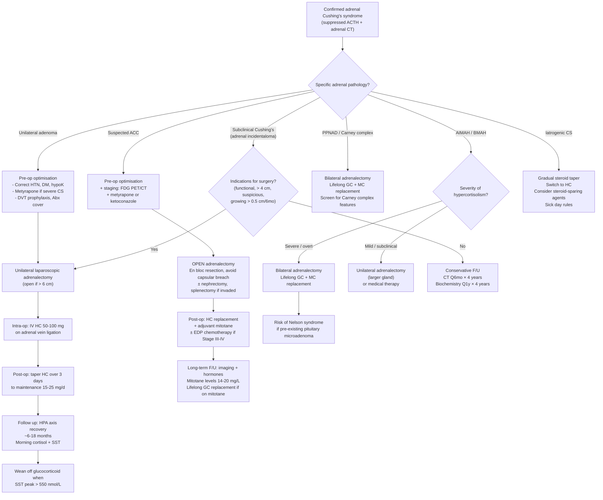

## Management of Cushing's Syndrome (Adrenal Causes)

The overarching principle of managing Cushing's syndrome is straightforward: **remove the source of excess cortisol**. For adrenal causes, this almost always means surgery. But the devil is in the perioperative detail — Cushing's patients are metabolically deranged, immunosuppressed, hypercoagulable, and their contralateral adrenal gland is atrophied. Ignoring these realities can be fatal.

***Approach to management*** [1][2]:
- ***Medical Tx for preoperative management of hypercortisolism***
- ***Surgical Mx for definitive removal of cortisol/ACTH-secreting tumour***

The management algorithm depends on the **specific adrenal pathology** identified during the diagnostic workup.

---

## 1. Principles of Management — The Big Picture

### 1.1 Basic Principles of Endocrine Surgery [2]

Before any operative intervention, the surgeon and endocrinologist must follow these ***basic principles of endocrine surgery*** [2]:

1. ***Confirm the endocrine diagnosis*** — biochemical confirmation of Cushing's syndrome and its adrenal origin (suppressed ACTH)
2. ***Localisation of tumour*** — adrenal CT with protocol (as per diagnostic algorithm)
3. ***Render patient medically fit*** — pre-operative optimisation of metabolic derangements
4. ***Establish need to operate*** — confirm that surgical indications are met
5. ***Surgical tactics*** — choice of approach (open vs. laparoscopic), awareness of anatomical hazards

### 1.2 Goals of Treatment

- **Cure** the hypercortisolism (normalise cortisol levels)
- **Remove** the tumour (and exclude/treat malignancy if ACC)
- **Manage** perioperative risks (adrenal insufficiency, VTE, infection, metabolic derangement)
- **Replace** cortisol post-operatively until the HPA axis recovers
- **Follow up** for recurrence and long-term complications

---

## 2. Management by Specific Adrenal Cause

### 2.1 Cortisol-Secreting Adrenal Adenoma

This is the most common adrenal cause of endogenous Cushing's (~15% of all endogenous CS).

#### Definitive Treatment: ***Surgical Unilateral Adrenalectomy*** [1][2][3][4]

***Management of adrenal-dependent Cushing's syndrome*** [1][2]:
- ***Surgical unilateral adrenalectomy for adrenal adenomas*** [1][2]

**Why unilateral?** The tumour is autonomous and unilateral. You remove the diseased gland and preserve the contralateral one (which will eventually recover function once ACTH drive returns).

***Adrenalectomy — Approach*** [4]:
- ***Laparoscopic transperitoneal approach (lateral decubitus, ipsilateral side up): for mass < 6 cm*** [4]
- ***Open: preferred if mass > 6 cm or malignant*** [4]
- ***Nowadays usually prefer MIS approach*** [2] for:
  - ***Safety***
  - ***Efficacy***
  - ***↓hospital stay***
  - ***↓analgesic requirement***
  - ***Hasten return to normal activities***
  - ***↑overall patient satisfaction***

**Cure rate**: > 95% for benign adenoma. Post-operative cortisol should become undetectable or very low (confirming successful removal and HPA axis suppression).

---

### 2.2 Adrenocortical Carcinoma (ACC)

ACC requires a more aggressive approach because of its malignant nature.

#### Definitive Treatment: ***Adrenalectomy ± Chemotherapy (if CA)*** [3][4]

- ***Open surgical approach preferred*** — typically > 6 cm, concern for malignancy. Laparoscopic approach risks capsular breach and tumour spillage/seeding, which worsens prognosis.
- **En bloc resection**: complete resection with negative margins (R0 resection) is the single most important prognostic factor. This may include en bloc nephrectomy, splenectomy (left-sided), or partial hepatectomy (right-sided) if there is local invasion.
- **Lymph node dissection**: regional lymphadenectomy if suspicious nodes present.
- **Avoid tumour rupture**: capsular breach → peritoneal carcinomatosis → dramatically worsens prognosis.

#### Adjuvant Therapy for ACC

| Therapy | Indication | Mechanism / Notes |
|:---|:---|:---|
| ***Mitotane*** | First-line adjuvant for ACC; also used for unresectable/metastatic disease | ***Adrenolytic agent — cytotoxic to adrenal cortical cells*** [1][2]. Selectively destroys zona fasciculata and reticularis cells. Causes "medical adrenalectomy." All patients on mitotane require glucocorticoid (and often mineralocorticoid) replacement because it destroys normal adrenal tissue too. S/E: GI toxicity (nausea, vomiting, diarrhoea), neurotoxicity, hepatotoxicity. Requires therapeutic drug monitoring (target 14–20 mg/L). |
| **Cytotoxic chemotherapy** | Advanced/metastatic ACC (Stage III–IV) | EDP-M regimen: **Etoposide + Doxorubicin + Cisplatin + Mitotane** (FIRM-ACT trial) — standard first-line for advanced ACC. Streptozotocin + mitotane is an alternative. |
| **Radiation therapy** | Incomplete resection (R1/R2), high-risk features | Adjuvant to reduce local recurrence. ACC is relatively radio-resistant, so RT is not curative but reduces local relapse. |
| **Targeted / immunotherapy** | Refractory or metastatic ACC | Pembrolizumab (anti-PD1) has shown some activity. Clinical trials ongoing. |

---

### 2.3 ACTH-Independent Macronodular Adrenal Hyperplasia (AIMAH / BMAH)

- **Bilateral adrenalectomy** is the definitive treatment for severe, overt Cushing's.
  - This renders the patient permanently adrenal-insufficient → lifelong glucocorticoid AND mineralocorticoid replacement.
  - ***Risk of Nelson's syndrome if bilateral adrenalectomy*** [1][2][4] — see complications section.
- **Unilateral adrenalectomy** of the larger/more dominant gland may be attempted first in milder cases, aiming to reduce cortisol burden while preserving some adrenal function.
- **Medical therapy** (metyrapone, ketoconazole) as bridging or if surgery is contraindicated.
- **Aberrant receptor-targeted therapy** (experimental): if specific aberrant receptors are identified (e.g., GIP-dependent Cushing's), receptor blockade may be attempted (e.g., octreotide for GIP, propranolol for β-adrenergic-dependent).

### 2.4 Primary Pigmented Nodular Adrenodysplasia (PPNAD)

- **Bilateral adrenalectomy** — curative. Since the disease is bilateral and micronodular, unilateral surgery is insufficient.
- Lifelong glucocorticoid and mineralocorticoid replacement post-operatively.
- Screen and follow up for other Carney complex manifestations (cardiac myxomas → echocardiography, GH-secreting adenoma → IGF-1, etc.).

### 2.5 Subclinical Cushing's (Adrenal Incidentaloma)

This is an evolving area. Current approach:

- **Surgery** (unilateral adrenalectomy) if:
  - ***Functional tumour*** [4][5][8]
  - ***Radiologically suspicious*** [5][8]
  - ***Size > 4 cm*** [5][8]
  - ***Growing > 0.5 cm in 6 months*** [4]
  - Presence of cortisol-related comorbidities that may improve with surgery (worsening DM, HTN, osteoporosis — especially in younger patients)
- **Conservative follow-up** if:
  - Mild biochemical abnormality without clinical consequences
  - Elderly / high surgical risk
  - ***Imaging: CT abdomen Q6 months for 4 years*** [4]
  - ***Biochemical: Q1 year for 4 years*** [4]

### 2.6 Iatrogenic Cushing's Syndrome

- **Gradual steroid taper** — the key is NEVER abruptly stop chronic exogenous glucocorticoids, as the HPA axis is suppressed → abrupt withdrawal causes acute adrenal crisis.
- Taper regimen varies; general principle: reduce dose slowly over weeks to months, monitoring for symptoms/signs of adrenal insufficiency.
- If the underlying condition (e.g., autoimmune disease) still requires glucocorticoids, use the lowest effective dose and consider steroid-sparing agents.
- Switch to shorter-acting glucocorticoids (e.g., hydrocortisone) during the taper to facilitate HPA axis recovery.

---

## 3. Medical Management

***Medical Mx*** [1][2]:

### 3.1 Indications for Medical Therapy

***Indications: pre-op management, contraindication to surgery, persistent disease despite surgery, awaiting effect of radiotherapy*** [1][2]

Medical therapy is **not curative** for adrenal Cushing's (unlike pituitary Cushing's where pituitary-acting agents can sometimes control disease). It is used to:
- **Optimise** the patient before surgery (reduce cortisol-related morbidity)
- **Bridge** the patient if surgery is delayed or impossible
- Control hypercortisolism in metastatic/unresectable ACC

### 3.2 Approaches to Medical Therapy

***Two approaches*** [1][2]:

| Approach | Description | When to Use |
|:---|:---|:---|
| ***Block-and-replace*** | ***Total ablation of cortisol secretion with addition of replacement steroids*** | ***Used in patients with wide variability in cortisol production and UFC*** [1][2] — ensures stable cortisol levels by completely blocking adrenal output and replacing with physiological doses |
| ***Normalisation*** | ***Aim to return cortisol level to normal*** (titrate steroidogenesis inhibitor to target UFC) | ***Used in patients with relatively invariable hypercortisolism*** [1][2] |

### 3.3 Drug Classes

#### A. Adrenal Enzyme Inhibitors (Steroidogenesis Inhibitors)

These drugs block specific enzymes in the cortisol biosynthetic pathway:

***(i) Metyrapone*** [1][2][3]:
- ***First-line*** medical therapy for Cushing's syndrome [1][2][3]
- Mechanism: ***CYP11B (11β-hydroxylase) inhibitor → ↓cortisol synthesis*** [1][2]
  - 11β-hydroxylase catalyses the final step in cortisol synthesis (11-deoxycortisol → cortisol). Blocking this step effectively halts cortisol production.
  - "Mety-rapone" → think "meter-rapid-one": it rapidly meters (controls) cortisol.
- ***Effect: short-acting, effective within 2 hours but requires BD/TDS dosing*** [1][2]
- Dose: typically 250–750 mg TDS, titrated to cortisol levels (target UFC normalisation)
- Side effects:
  - Accumulation of cortisol precursors (11-deoxycortisol, 11-deoxycorticosterone) → some of these have mineralocorticoid activity → can worsen HTN, hypokalaemia, oedema
  - Accumulation of adrenal androgens (due to shunting of precursors) → hirsutism, acne in women
  - Nausea, dizziness, headache
  - Adrenal insufficiency if over-dosed (monitor UFC)

***(ii) Ketoconazole*** [1][2][3]:
- ***Originally an azole antifungal, but can inhibit cortisol and androgen secretion*** [1][2]
- Mechanism: inhibits multiple CYP enzymes in the steroidogenic pathway (CYP17, CYP11A1, CYP11B1) → broadly reduces cortisol, aldosterone, and androgen synthesis
- Also has a direct inhibitory effect on ACTH secretion at the pituitary level
- ***Side effects: hepatotoxicity (withdrawn from antifungal use as a result), ↓androgen (gynaecomastia, ↓libido, impotence in males)*** [1][2]
  - Liver function tests must be monitored regularly (weekly initially, then monthly)
  - FDA black box warning for hepatotoxicity (rare fulminant hepatic failure)
- Dose: 200–400 mg BD–TDS
- Advantage in women: anti-androgen effect may be beneficial (↓hirsutism)
- Disadvantage in men: anti-androgen side effects limiting

***(iii) Osilodrostat*** (newer agent, approved 2020):
- Mechanism: potent CYP11B1 (11β-hydroxylase) and CYP11B2 (aldosterone synthase) inhibitor
- More specific than ketoconazole; effective oral agent
- Approved for Cushing's disease and being used off-label for adrenal causes
- Side effects: adrenal insufficiency, hypokalaemia (aldosterone reduction), QTc prolongation, hirsutism/acne (androgen precursor accumulation)

***(iv) Levoketoconazole*** (approved 2021):
- The 2S,4R enantiomer of ketoconazole with improved cortisol-lowering efficacy and potentially better hepatic safety profile
- Same mechanism as ketoconazole but more potent against steroidogenic CYP enzymes

#### B. Adrenolytic Agents

***(i) Mitotane*** [1][2]:
- ***Cytotoxic to adrenal cortical cells → adjunct "medical adrenalectomy" for CA adrenal*** [1][2]
- Mechanism: accumulates in adrenal mitochondria → disrupts mitochondrial function → direct cytotoxic destruction of adrenal cortical cells (zona fasciculata and reticularis preferentially). Also inhibits CYP11A1 (side-chain cleavage enzyme).
- **Indications**:
  - ***Adjuvant therapy after ACC resection*** (reduces recurrence)
  - ***First-line for unresectable/metastatic ACC***
  - Severe Cushing's not controlled by enzyme inhibitors
- Dosing: 1–6 g/day orally; requires therapeutic drug monitoring (target trough 14–20 mg/L). Onset of action is slow (weeks to months).
- Side effects: GI (nausea, vomiting, diarrhoea — very common), neurological (ataxia, confusion, lethargy), hepatotoxicity, ↑sex hormone-binding globulin (→ ↓free testosterone), adrenal insufficiency (ALL patients need glucocorticoid replacement)
- **Critical**: mitotane increases cortisol-binding globulin → total cortisol may appear elevated despite adequate treatment. Must monitor free cortisol or use clinical assessment.

#### C. Glucocorticoid Receptor Antagonist

***(i) Mifepristone*** (RU-486):
- Mechanism: competitive antagonist at the glucocorticoid receptor (GR) — blocks cortisol's action at the receptor level without reducing cortisol production
- "Mifepristone" → "mifi" = against, "prestone" = progesterone/cortisol; originally developed as an anti-progesterone (abortifacient), but also has potent GR antagonism
- **Indication**: hyperglycaemia secondary to Cushing's syndrome in patients who are not candidates for surgery
- **Key limitation**: because it blocks the GR, you **cannot monitor cortisol levels to assess efficacy** (cortisol will actually RISE due to loss of negative feedback). Must monitor clinical parameters (glucose, weight, blood pressure) instead.
- Side effects: hypokalaemia (cortisol rises → mineralocorticoid receptor activation → hypoK), adrenal insufficiency (difficult to detect), endometrial thickening (anti-progesterone effect → vaginal bleeding)
- **Contraindication**: pregnancy (abortifacient)

#### D. Pituitary-Acting Agents

***Pituitary-acting agents: e.g., pasireotide (somatostatin analogue), cabergoline (DA agonist)*** [1][2]

These are primarily used for **Cushing's disease** (pituitary source), NOT for primary adrenal causes. However, mentioned for completeness:
- **Pasireotide**: binds somatostatin receptor subtype 5 (SST5) on corticotroph cells → ↓ACTH secretion. S/E: hyperglycaemia (inhibits insulin secretion), GI symptoms, cholelithiasis.
- **Cabergoline**: dopamine D2 agonist → some corticotroph adenomas express D2 receptors → ↓ACTH. Off-label use.

### 3.4 Summary of Medical Agents

| Drug | Class | Mechanism | Primary Indication | Key Side Effects |
|:---|:---|:---|:---|:---|
| ***Metyrapone*** | Enzyme inhibitor | CYP11B1 inhibitor | ***Pre-op, bridging, first-line*** | Mineralocorticoid excess, androgenisation, adrenal insufficiency |
| ***Ketoconazole*** | Enzyme inhibitor | Multiple CYP inhibitor | Pre-op, bridging | ***Hepatotoxicity***, anti-androgen effects |
| **Osilodrostat** | Enzyme inhibitor | CYP11B1/B2 inhibitor | Cushing's disease (and off-label adrenal) | HypoK, QTc prolongation, adrenal insufficiency |
| ***Mitotane*** | Adrenolytic | Direct adrenal cytotoxicity | ***Adjuvant/palliative for ACC*** | GI, neuro, hepatotoxicity, adrenal insufficiency (universal) |
| **Mifepristone** | GR antagonist | Blocks cortisol at receptor | Hyperglycaemia in inoperable CS | HypoK, cannot monitor cortisol, anti-progesterone |
| ***Pasireotide*** | SST analogue | ↓ACTH from pituitary | ***Cushing's disease*** | Hyperglycaemia |
| ***Cabergoline*** | DA agonist | ↓ACTH from pituitary | ***Cushing's disease (off-label)*** | Nausea, postural hypotension |

---

## 4. Perioperative Management — Critical Detail

This is arguably the most exam-relevant part. Cushing's patients undergoing adrenalectomy have unique perioperative risks that must be systematically addressed.

***Perioperative management*** [1][2][3]:
- ***Control and correct HTN, DM, hypoK*** [1][2][3]
- ***Prophylaxis by steroid cover, antibiotics, and for DVT (hypercoagulable state in CS)*** [1][2][3]

### 4.1 Pre-Operative Optimisation

| Issue | Why? | Management |
|:---|:---|:---|
| **Hypertension** | Cortisol → ↑MR activation, ↑catecholamine sensitivity, ↑angiotensinogen → HTN | Antihypertensives (spironolactone useful — blocks MR, corrects HTN and hypoK simultaneously) |
| **Diabetes mellitus** | Cortisol-induced insulin resistance | Insulin therapy (often required); oral agents may be insufficient |
| **Hypokalaemia** | MR activation → renal K⁺ wasting | IV/oral KCl replacement; spironolactone |
| **Hypercoagulability** | ↑fibrinogen, ↑Factor VIII, ↑vWF, ↓fibrinolysis | ***Prophylactic anticoagulation*** — LMWH (enoxaparin) pre-op and post-op [4]. TED stockings. |
| **Immunosuppression** | Cortisol → ↓T-cells, ↓neutrophil function | ***Prophylactic antibiotics*** [4] — consider Pneumocystis prophylaxis (co-trimoxazole) if cortisol levels are very high |
| **Hypercortisolism** | Medical therapy may be needed to reduce cortisol pre-operatively | ***Medical Tx for preoperative management of hypercortisolism*** [1][2] — metyrapone first-line |
| **Nutritional status** | Protein catabolism → poor wound healing | Nutritional optimisation, protein supplementation |
| **Psychiatric** | Depression, psychosis from hypercortisolism | Psychiatric assessment; may improve after cortisol normalisation |
| **Osteoporosis** | Risk of intra-op fractures from positioning | Careful positioning; DEXA scan |

### 4.2 Intra-Operative Considerations

***Steroid cover*** [1][2][4]:

***CS patients have ↓normal stress response. With cortisol level ↓↓ after surgery, steroid cover (IV hydrocortisone 50–100 mg immediately upon removal of adrenals) is essential to avoid adrenal insufficiency*** [1][2].

**Why is this needed?** The autonomous adrenal tumour has been suppressing ACTH for months/years → the contralateral adrenal gland is atrophied and non-functional. The moment the tumour is removed, the patient has essentially NO cortisol production. Without exogenous steroid cover, they will develop acute adrenal crisis (hypotension, shock, cardiovascular collapse) within hours.

**Protocol:**
- ***IV hydrocortisone 50–100 mg IV on-call (at time of adrenal vein ligation / gland removal)*** [1][2]
- Continue IV hydrocortisone 50 mg Q6–8H on the day of surgery
- ***Rapid taper over next 3 days to maintenance dose of 15–25 mg/day PO hydrocortisone*** [2]

***Complications of adrenalectomy*** [2][4]:

| Timing | Complication | Mechanism / Notes |
|:---|:---|:---|
| ***Intra-operative*** | ***Haemodynamic instability*** | Esp. if undiagnosed phaeochromocytoma (always excluded biochemically pre-op) |
| | ***Adrenal insufficiency*** | ***IV hydrocortisone upon removal of adrenal gland*** [4] |
| | ***Intraoperative haemorrhage*** | ***Adrenal capsular, IVC*** [2] |
| | ***Injury to surroundings*** | ***Right adrenalectomy: IVC, right lobe of liver*** [4] |
| | | ***Left adrenalectomy: pancreatic tail, spleen*** [4] |
| | ***Pneumothorax*** | Diaphragmatic injury (esp. posterior approach) [2] |
| ***Early post-op*** | ***Adrenal insufficiency*** | ***PO hydrocortisone post-op*** [4]; taper to maintenance |
| | ***Electrolyte disturbances*** | HypoNa, hyperK if adrenal insufficiency develops |
| ***Late*** | ***Hypertension*** | ***Renal artery injury*** [4] |
| | ***Chronic adrenal insufficiency*** | If HPA axis does not recover (rare for unilateral adrenalectomy for adenoma) |

### 4.3 Post-Operative Management

#### Glucocorticoid Replacement

***Post-op glucocorticoid ± mineralocorticoid supplement until HPA axis recovers ~1 year later*** [4]

**Rationale**: The contralateral adrenal is atrophied from chronic ACTH suppression. Recovery of the HPA axis takes **6–18 months** (up to 2 years in some patients). During this period, the patient is functionally adrenal-insufficient and requires exogenous glucocorticoid replacement.

**Monitoring HPA axis recovery**:
- Periodic morning cortisol levels (drawn before the daily hydrocortisone dose)
- Once morning cortisol > 200–300 nmol/L, attempt tapering hydrocortisone
- **Short synacthen test (SST)** can be performed when morning cortisol is rising: peak cortisol > 550 nmol/L confirms adequate adrenal reserve → can discontinue glucocorticoid
- Patient must carry a **steroid emergency card** and wear a **MedicAlert bracelet** during the replacement period

#### Mineralocorticoid Replacement

- Usually NOT needed after unilateral adrenalectomy for adenoma (the contralateral adrenal's zona glomerulosa recovers faster because aldosterone secretion is primarily regulated by RAAS, not ACTH)
- **Needed after bilateral adrenalectomy** (BMAH, PPNAD) — lifelong fludrocortisone 50–200 µg/day

#### Sick Day Rules

Patients on glucocorticoid replacement must be educated:
- **Double** the oral hydrocortisone dose during minor illness (fever, infections)
- **Triple** or use IM/IV hydrocortisone during severe illness, vomiting, or if unable to take oral medication
- **Emergency IM hydrocortisone** (100 mg) at home for vomiting/diarrhoea
- Seek medical attention if unable to keep oral steroids down

---

## 5. Management Algorithm — Mermaid Diagram

---

## 6. Management of Specific Complications (Peri- and Post-Operative)

### 6.1 Acute Adrenal Crisis (Post-Operative)

The most feared immediate complication. Occurs if steroid cover is inadequate or omitted.

- **Presentation**: hypotension refractory to fluids, tachycardia, nausea/vomiting, confusion, cardiovascular collapse
- **Treatment**: ***IV hydrocortisone 100 mg stat***, then 50 mg Q6–8H. IV normal saline for volume resuscitation. Dextrose if hypoglycaemic.
- **Prevention**: ***steroid cover as above*** [1][2][4]

### 6.2 Nelson's Syndrome

***Risk of Nelson syndrome if bilateral adrenalectomy*** [1][2][4]

- ***Definition: enlarging pituitary tumour (< 2 mm initially) representing corticotroph tumour progression*** [1][2]
- ***Pathogenesis: uncertain — ?due to ↓glucocorticoid negative feedback inhibition on corticotroph growth in pre-existing microadenomas + risk of malignant transformation*** [1][2]
- ***Diagnosis: plasma ACTH > 200 pg/mL + hyperpigmentation*** [1][2]
- Incidence: ***8–25% adults, > 50% children*** [1]
- ***Treatment: transsphenoidal surgery before tumour becomes a macroadenoma*** [1][2]
- ***Prevention: pituitary irradiation should be done before bilateral adrenalectomy in Cushing's disease*** [1][2]

> Nelson's syndrome only occurs after **bilateral** adrenalectomy (not unilateral). It is most relevant when bilateral adrenalectomy is performed for Cushing's disease or bilateral adrenal hyperplasia. The removal of all adrenal tissue eliminates cortisol negative feedback → uninhibited growth of any pre-existing corticotroph adenoma.

### 6.3 VTE / Pulmonary Embolism

***High risk of infections / VTE*** [4]

- Cushing's patients have a hypercoagulable state (↑fibrinogen, ↑Factor VIII, ↑vWF, ↓fibrinolysis)
- ***Prophylactic anticoagulation*** — LMWH perioperatively and for several weeks post-op (risk persists until cortisol normalises)
- TED stockings, early mobilisation

---

## 7. Prognosis

***Cushingoid features generally resolve by 2–12 months after definitive treatment*** [1][2]:
- Moon face, buffalo hump, central obesity improve over months
- Hypertension, diabetes, dyslipidaemia may persist if long-standing (end-organ damage already established)
- Proximal myopathy improves with physiotherapy
- Osteoporosis: BMD improves over 1–2 years but may not fully normalise
- Psychiatric features often improve rapidly

***But untreated Cushing's syndrome is often fatal due to cardiovascular and thromboembolic complications*** [1][2]
- 5-year mortality of untreated CS: ~50% (from MI, stroke, PE, opportunistic infections)

For ACC specifically: prognosis depends on stage and completeness of resection:
- Complete resection (R0): ~50–80% 5-year survival for Stage I–II
- Stage IV (metastatic): ~10–15% 5-year survival despite treatment

---

<Callout title="High Yield Summary">

**Management of adrenal Cushing's syndrome — Key Points:**

1. **Adrenal adenoma**: Unilateral laparoscopic adrenalectomy. Post-op glucocorticoid replacement until HPA axis recovers (~6–18 months). Cure rate > 95%.

2. **ACC**: Open en bloc resection + adjuvant mitotane ± EDP chemotherapy for advanced disease. Poor prognosis. Avoid capsular breach.

3. **AIMAH/BMAH**: Bilateral adrenalectomy for severe CS. Unilateral for milder cases. Lifelong replacement if bilateral.

4. **PPNAD**: Bilateral adrenalectomy + Carney complex screening. Lifelong replacement.

5. **Medical therapy**: Metyrapone (first-line, CYP11B1 inhibitor), ketoconazole (multi-CYP inhibitor, hepatotoxic), mitotane (adrenolytic, for ACC). Block-and-replace or normalisation approach.

6. **Perioperative essentials**:
   - Control HTN, DM, hypoK pre-op
   - Steroid cover: IV HC 50–100 mg at gland removal
   - DVT prophylaxis (LMWH) — hypercoagulable state
   - Prophylactic antibiotics — immunosuppressed
   - Post-op HC taper; monitor HPA axis recovery with SST

7. **Nelson's syndrome**: Risk after bilateral adrenalectomy (8–25% adults, > 50% children). Prevent with pituitary irradiation before bilateral adrenalectomy.

8. **Prognosis**: Features resolve 2–12 months post-treatment. Untreated CS is often fatal (cardiovascular, VTE).
</Callout>

---

<ActiveRecallQuiz
  title="Active Recall - Management of Cushing's Syndrome (Adrenal Causes)"
  items={[
    {
      question: "A patient with a 3 cm cortisol-secreting adrenal adenoma is scheduled for laparoscopic adrenalectomy. Describe the perioperative steroid management and explain the physiological rationale.",
      markscheme: "Pre-op: the autonomous adenoma has chronically suppressed ACTH via negative feedback, causing contralateral adrenal atrophy. Intra-op: IV hydrocortisone 50-100 mg at the time of adrenal vein ligation/gland removal — because once the adenoma is removed, the patient has no cortisol source (atrophied contralateral gland cannot respond immediately). Post-op: continue IV HC, then taper over 3 days to maintenance oral HC 15-25 mg/day. Continue GC replacement until HPA axis recovers (6-18 months), confirmed by morning cortisol and short synacthen test (peak cortisol > 550 nmol/L). Patient needs steroid emergency card and sick day education."
    },
    {
      question: "What is the first-line medical agent for pre-operative control of hypercortisolism in Cushing's syndrome? State its mechanism and two important side effects.",
      markscheme: "Metyrapone. Mechanism: inhibits CYP11B1 (11-beta-hydroxylase), the enzyme catalysing the final step of cortisol synthesis (11-deoxycortisol to cortisol). Side effects: (1) Accumulation of mineralocorticoid precursors (11-deoxycorticosterone) causing hypertension, oedema, and hypokalaemia. (2) Shunting of precursors to androgen pathway causing hirsutism and acne in women. Also risk of adrenal insufficiency if over-dosed."
    },
    {
      question: "Why is open surgery preferred over laparoscopic adrenalectomy for suspected adrenocortical carcinoma? Name two adjuvant therapies used after ACC resection.",
      markscheme: "Open surgery is preferred because ACC is typically large (> 6 cm), and laparoscopic approach risks capsular breach and tumour spillage/seeding into the peritoneum, dramatically worsening prognosis. En bloc resection with negative margins is the most important prognostic factor. Adjuvant therapies: (1) Mitotane — adrenolytic agent that selectively destroys adrenal cortical cells; used as standard adjuvant to reduce recurrence (target level 14-20 mg/L). (2) EDP-M chemotherapy (etoposide, doxorubicin, cisplatin plus mitotane) for stage III-IV disease."
    },
    {
      question: "What is Nelson's syndrome? When does it occur, what is its incidence, and how can it be prevented?",
      markscheme: "Nelson's syndrome is progressive enlargement of a pre-existing pituitary corticotroph adenoma following bilateral adrenalectomy. It occurs because removal of all adrenal tissue eliminates cortisol negative feedback on the pituitary, allowing uninhibited corticotroph tumour growth. Presents with plasma ACTH greater than 200 pg/mL, hyperpigmentation, and enlarging sellar mass. Incidence: 8-25% in adults, greater than 50% in children. Prevention: pituitary irradiation should be performed before bilateral adrenalectomy in patients with Cushing's disease."
    },
    {
      question: "Name three specific perioperative prophylactic measures needed for Cushing's syndrome patients undergoing adrenalectomy and explain the rationale for each.",
      markscheme: "(1) Steroid cover (IV hydrocortisone): because chronic hypercortisolism suppresses the HPA axis and contralateral adrenal; removal of the cortisol source causes acute adrenal insufficiency without replacement. (2) DVT prophylaxis with LMWH: because Cushing's syndrome causes a hypercoagulable state (increased fibrinogen, Factor VIII, vWF, decreased fibrinolysis). Risk of fatal PE is significantly elevated. (3) Prophylactic antibiotics: because chronic cortisol excess suppresses cellular immunity (especially T-cells), increasing susceptibility to wound infections and opportunistic infections (e.g. Pneumocystis)."
    }
  ]}
/>

## References

[1] Senior notes: Adrian Lui Pediatrics.pdf (Section 8.3.2 Cushing's Syndrome — Management, p288)
[2] Senior notes: Ryan Ho Endocrine.pdf (Section 3.3 Cushing's Syndrome — Management, p64; Section 3.5.2 Adrenal Surgery, p69)
[3] Senior notes: Ryan Ho Fundamentals.pdf (Section 3.8.3 — Cushing's Syndrome Management, p437)
[4] Senior notes: maxim.md (Adrenalectomy, Cushing syndrome sections)
[5] Senior notes: Ryan Ho Fundamentals.pdf (Section 3.8.3 — Adrenal Incidentaloma, p438)
[8] Senior notes: Ryan Ho Endocrine.pdf (Section 3.5.1 Adrenal Incidentaloma, p68)
