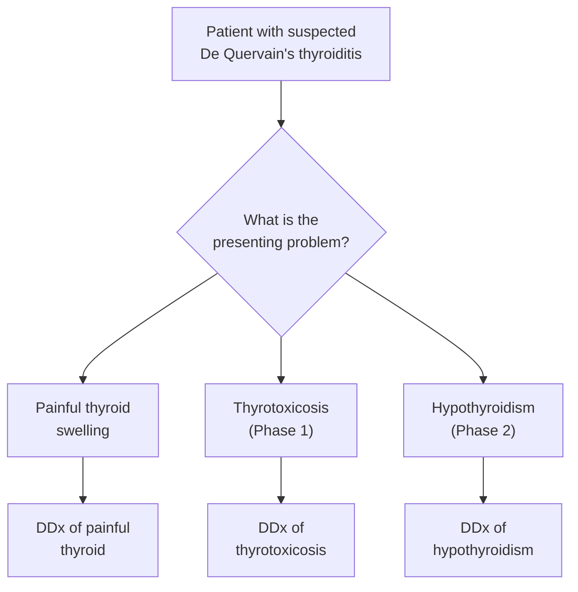
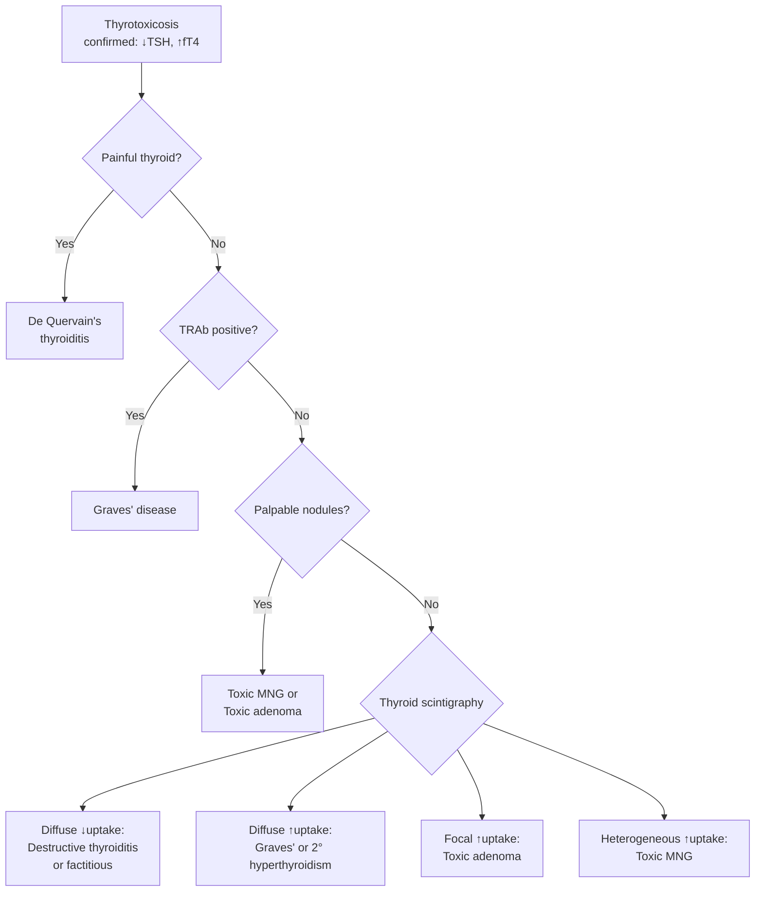
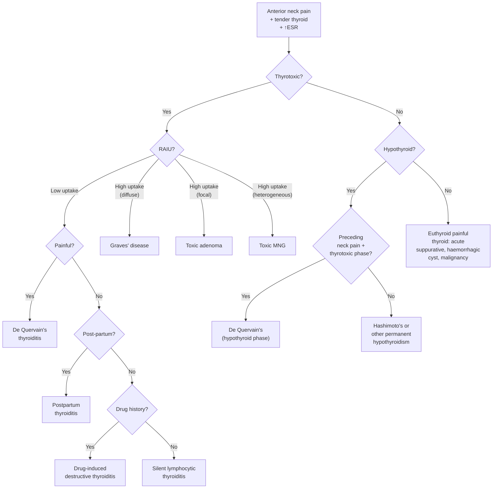

## Differential Diagnosis of De Quervain's Thyroiditis

The differential diagnosis of de Quervain's thyroiditis is best approached by considering the **presenting problem** the patient walks in with. A patient with de Quervain's can present at different phases with different chief complaints, so the DDx changes depending on the clinical context. Let's break this down systematically.

### Framework: Three Clinical Presentations, Three DDx Lists

A patient with de Quervain's thyroiditis may present with:
1. **A painful anterior neck swelling** (the most common presentation)
2. **Thyrotoxicosis** (if caught in the thyrotoxic phase)
3. **Hypothyroidism** (if caught in the hypothyroid phase)

You need to generate the DDx for whichever presentation you are faced with.

---

### A. DDx of a Painful Thyroid Swelling

This is the most specific DDx for de Quervain's. A painful thyroid is relatively uncommon — most thyroid pathology is painless. The conditions that cause **pain** in the thyroid region are few:

| Differential | Key Distinguishing Features | Why It Can Mimic De Quervain's |
|---|---|---|
| **De Quervain's (subacute granulomatous) thyroiditis** | Preceding URTI, ***tender goitre*** [2], markedly ↑ESR, triphasic course, low RAIU | — (the index condition) |
| **Acute suppurative thyroiditis** | ***Bacterial (acute suppurative)*** [5] — extremely rare; severe toxicity, high fever, fluctuant swelling, often in immunocompromised or children with pyriform sinus fistula. Leukocytosis with left shift. Abscess on USG. Culture positive | Both cause a painful, tender thyroid with fever. However, suppurative thyroiditis is far more toxic, has purulent features, and ESR alone does not distinguish — you need imaging and aspiration |
| **Haemorrhage into a thyroid cyst/nodule** | ***Pain: bleeding into cyst/necrotic nodule*** [7][8]. Sudden onset of pain and rapid enlargement, history of pre-existing nodule or MNG. USG shows cystic lesion with internal debris | Both cause acute neck pain. However, haemorrhagic cyst has sudden onset (not gradual), no systemic inflammation (ESR normal), and euthyroid status. USG is diagnostic |
| **Anaplastic thyroid carcinoma** | ***Sudden ↑size: anaplastic carcinoma*** [7][8]. Elderly patient (> 60y), rock-hard fixed mass, rapidly progressive over weeks, compressive symptoms (dysphagia, stridor, RLN palsy), painless initially then painful as it invades | Both can cause a painful neck mass. Anaplastic CA is hard and fixed (not diffusely tender). No preceding URTI. No triphasic thyroid course. FNA/biopsy is diagnostic |
| **Hashimoto's thyroiditis (painful variant)** | ***Lymphocytic/Hashimoto/autoimmune (chronic)*** [5]. Occasionally Hashimoto's can be painful ("painful Hashimoto's"), but this is rare. Usually a firm, rubbery, painless, diffuse goitre with high-titre anti-TPO (90–100%) and anti-Tg (80–90%) [1]. Hypothyroid biochemistry | Hashimoto's is almost always painless. If painful, the ESR is typically only mildly elevated (not > 50 as in de Quervain's). High-titre antibodies distinguish it |
| **Riedel's thyroiditis** | Extremely rare fibrosing thyroiditis. Rock-hard "woody" thyroid, fixed to surrounding structures, can mimic carcinoma. Associated with IgG4-related disease | May cause discomfort, but not the acute pain/tenderness of de Quervain's. Open biopsy needed to distinguish from malignancy |
| **Radiation thyroiditis** | Occurs after radioactive iodine treatment or external beam radiation. History of recent RAI or neck irradiation is the key | Temporal association with treatment is diagnostic |
| **Referred pain from pharyngitis/URTI** | The most common misdiagnosis! Patient has sore throat, but the pain is pharyngeal, not in the anterior lower neck. Thyroid is non-tender on examination | Always palpate the thyroid — if it is tender, it's not just pharyngitis |

<Callout title="Exam Trap — Painful Thyroid DDx" type="error">
Students often forget that **most thyroid conditions are PAINLESS**. The painful thyroid DDx is short. If an exam question mentions a tender thyroid + elevated ESR + preceding URTI, the answer is de Quervain's until proven otherwise.
</Callout>

---

### B. DDx of Thyrotoxicosis (When Patient Presents in Phase 1)

If the patient is caught in the thyrotoxic phase, you need to differentiate de Quervain's from other causes of thyrotoxicosis. The critical distinction is between ***thyrotoxicosis with hyperthyroidism*** (the gland is overactive) versus ***thyrotoxicosis without hyperthyroidism*** (the gland is being destroyed and leaking hormone) [1].

#### B1. Causes of Thyrotoxicosis — Systematic Classification [1]

| Category | Causes | RAIU | Key Features |
|---|---|---|---|
| **Primary hyperthyroidism** | ***Graves' disease*** (76%) [9] | ↑↑ (diffuse) | Painless diffuse goitre with bruit, ophthalmopathy, pretibial myxoedema, positive TRAb |
| | ***Toxic multinodular goitre*** (14%) [9] | ↑ (heterogeneous) | Older patient, multiple palpable nodules, no ophthalmopathy |
| | ***Toxic adenoma*** (5%) [9] | Focal ↑ with suppression elsewhere | Single "hot" nodule on scintigraphy |
| | Metastatic thyroid cancer, TSH receptor mutations | Varies | Rare |
| **Secondary hyperthyroidism** | TSH-secreting pituitary adenoma | ↑ | TSH elevated or inappropriately normal with high T4 — very rare (0.2%) [9] |
| | Gestational thyrotoxicosis / molar hyperthyroidism | ↑ | hCG mimics TSH structure → stimulates thyroid [9] |
| ***Thyrotoxicosis without hyperthyroidism*** | ***Subacute (De Quervain's) thyroiditis*** | **↓↓** | **Painful** tender goitre, ↑ESR, preceding URTI |
| | ***Silent (lymphocytic) thyroiditis*** | **↓↓** | **Painless**, normal ESR, high-titre anti-TPO |
| | ***Postpartum thyroiditis*** | **↓↓** | < 12 months post-partum, painless |
| | ***Destructive thyroiditis (amiodarone/irradiation)*** | **↓↓** | Drug history or recent radiation |
| | ***Levothyroxine (T4) overdose / factitious thyrotoxicosis*** | **↓↓** | Medication history, ***↑T4:T3 ratio > 70:1*** and ***↓serum thyroglobulin*** [7][9] |

#### B2. Key Differentiating Features in the Thyrotoxic Phase

The most important clinical and investigation-based distinguishing points:

| Feature | De Quervain's | Graves' Disease | Silent Thyroiditis | Toxic MNG |
|---|---|---|---|---|
| **Pain** | ***Present*** [2] | Absent | Absent | Absent |
| **Goitre** | Tender, diffuse | Painless, diffuse, ± bruit | Small, painless | Multiple nodules |
| **Ophthalmopathy** | Absent | Present (Graves'-specific) | Absent | Absent |
| **Pretibial myxoedema** | Absent | May be present | Absent | Absent |
| **ESR** | ***Markedly ↑ (often > 50)*** [2] | Normal | Normal | Normal |
| **TRAb** | Negative | ***Positive (sens 97%, spec 99%)*** [7][9] | Negative | Negative |
| **Anti-TPO** | ***Low titre*** [2] (transient) | 50–80% [1] | High titre | Low |
| **RAIU** | ***↓ (diffuse ↓uptake)*** [2][7][9] | ***↑ (diffuse ↑uptake)*** [7][9] | ↓ | ***Heterogeneous ↑uptake*** [7][9] |
| **Serum thyroglobulin** | ↑ (released from damaged cells) | ↑ | ↑ | Variable |
| **Preceding URTI** | Yes (2–8 weeks prior) | No | No | No |
| **Post-partum** | No | Possible | Possible (< 12 months) | No |

<Callout title="The RAIU 'Traffic Light' for Thyrotoxicosis DDx" type="idea">
Think of RAIU as a traffic light:
- **Green (↑ uptake)** = the thyroid is actively making hormone → true hyperthyroidism (Graves', toxic MNG, toxic adenoma)
- **Red (↓ uptake)** = the thyroid is NOT making hormone — it's leaking pre-formed hormone → destructive thyrotoxicosis (de Quervain's, silent thyroiditis, postpartum, factitious)

This single investigation separates the two categories definitively.
</Callout>

> ***Thyroid scintigraphy findings*** [7][9]: ***Diffuse ↓uptake → destructive thyroiditis vs factitious thyrotoxicosis. Factitious thyrotoxicosis can be confirmed by ↑T4:T3 ratio and ↓serum thyroglobulin***

#### B3. Distinguishing De Quervain's from Other Causes of Destructive Thyrotoxicosis

Once you have established the thyrotoxicosis is "destructive" (low RAIU), you need to determine which specific destructive thyroiditis:

| Feature | De Quervain's | Silent (Lymphocytic) | Postpartum | Drug-Induced | Factitious |
|---|---|---|---|---|---|
| **Pain** | **YES** — the key differentiator | No | No | No | No |
| **ESR** | Markedly ↑ | Normal | Normal | Variable | Normal |
| **Context** | Post-viral URTI | Any time | ***< 12m post-partum*** [4] | Amiodarone, lithium, checkpoint inhibitors | Medication access; healthcare worker |
| **Anti-TPO** | Low titre (transient) | High titre | Often high titre | Variable | Negative |
| **Thyroglobulin** | ↑ | ↑ | ↑ | ↑ | ***↓*** (exogenous T4 suppresses it) [7][9] |
| **T4:T3 ratio** | Normal (~30:1) | Normal | Normal | Variable | ***↑ (> 70:1)*** [7][9] |

---

### C. DDx of Hypothyroidism (When Patient Presents in Phase 2)

If the patient is caught in the hypothyroid phase, the DDx becomes the causes of hypothyroidism. The key clinical question is: **Is this transient or permanent?** [3][4]

| Category | Causes | Distinguishing from De Quervain's |
|---|---|---|
| **Permanent primary** | ***Hashimoto's thyroiditis*** — most common autoimmune cause; firm, rubbery, painless goitre; anti-TPO (90–100%); irreversible [7] | No preceding neck pain, no preceding thyrotoxic phase, high-titre antibodies, usually older female |
| | ***Atrophic thyroiditis*** — end-stage autoimmune; no goitre, TSHr-blocking Ab | No goitre (gland atrophied) |
| | ***Iatrogenic: RAI, thyroidectomy*** | Clear history of prior treatment |
| | Drug-induced: amiodarone, lithium | Drug history |
| | Iodine deficiency or excess | Dietary/exposure history |
| **Transient** | ***De Quervain's thyroiditis*** | Preceding neck pain + thyrotoxic phase |
| | ***Silent/postpartum thyroiditis*** | Painless; post-partum context |
| | ***Post-RAI or post-thyroidectomy (< 6 months)*** [3][4] | Recent treatment history |
| | ***Drug-related (lithium, amiodarone)*** [3][4] | Drug history |
| **Secondary** | Pituitary/hypothalamic disease | Low TSH (not elevated) + low fT4 = "secondary" pattern; other pituitary hormone deficiencies |

> The approach to hypothyroidism is ***mainly directed to differentiate those who require life-long T4 replacement (autoimmune thyroiditis, thyroid ablation) from those who may only have transient hypothyroidism*** [3][4]. Clues to transient hypothyroidism: ***neck pain, < 12 months post-partum, recent symptoms of thyrotoxicosis, < 6 months since ¹³¹I or thyroidectomy, on lithium or amiodarone*** [3][4].

---

### D. DDx of Anterior Neck Swelling (the "Lump" DDx)

If the patient presents primarily with a neck lump that happens to be thyroid in origin, you should also consider the broader DDx of ***diffuse goitre*** [6][8][9]:

| Pattern | DDx |
|---|---|
| ***Diffuse goitre*** [6] | ***Graves' disease, physiological (pregnancy, puberty), Hashimoto's thyroiditis, De Quervain's/subacute thyroiditis*** [6] |
| ***Solitary nodule*** [6] | ***Dominant nodule in MNG, cyst (true simple cyst, colloid nodule), neoplastic (adenoma, toxic adenoma, carcinoma)*** [6] |
| ***Multiple nodules*** [6] | ***MNG, multiple cysts, multiple adenoma*** [6] |

And the goitre classification from the lecture [5]:

| Category | Examples |
|---|---|
| ***Neoplastic goitre*** | ***Benign, malignant*** [5] |
| ***Thyroiditis*** | ***Bacterial (acute suppurative), viral (subacute), lymphocytic/Hashimoto/autoimmune (chronic)*** [5] |
| ***Simple goitre (endemic or sporadic)*** | ***Diffuse, nodular*** [5] |
| ***Toxic goitre*** | ***Diffuse toxic (Graves'), toxic nodular (Plummer's), toxic/functioning adenoma*** [5] |

***Thyroid nodule pathology*** [5]:
- ***Nodular goitre: colloid / haemorrhagic cystic / complex / hyperplastic / adenomatous nodule (70%)***
- ***Benign follicular adenoma: mainly non-toxic (15%)***
- ***Well-differentiated thyroid carcinoma (10%)***
- ***Miscellaneous: other thyroid malignancies, thyroiditis (5%)***

---

### E. DDx Summary — Decision Algorithm

<Callout title="The Three Pillars of DDx in De Quervain's">

When differentiating de Quervain's from other thyroid conditions, remember **three pillars**:

1. **Pain + tenderness** → separates de Quervain's from virtually all other thyroiditides (silent, postpartum, Hashimoto's are all painless)
2. **↑ESR (markedly elevated)** → separates de Quervain's from silent/postpartum thyroiditis (where ESR is normal)
3. **Low RAIU** → separates destructive thyrotoxicosis (de Quervain's, silent, postpartum) from true hyperthyroidism (Graves', toxic MNG, toxic adenoma)

If all three are present: **Pain + ↑ESR + Low RAIU = De Quervain's**

</Callout>

---

<Callout title="High Yield Summary">

**DDx of De Quervain's Thyroiditis:**

- **As a painful thyroid**: DDx includes acute suppurative thyroiditis (bacterial), haemorrhage into cyst/nodule, anaplastic carcinoma, painful Hashimoto's (rare), Riedel's thyroiditis, radiation thyroiditis
- **As thyrotoxicosis**: The key distinction is hyperthyroidism (high RAIU: Graves', toxic MNG, toxic adenoma) vs destructive thyrotoxicosis (low RAIU: de Quervain's, silent, postpartum, drug-induced, factitious). Pain + ↑ESR distinguishes de Quervain's from other destructive causes
- **As hypothyroidism**: Distinguish transient (de Quervain's — preceding pain and thyrotoxic phase) from permanent (Hashimoto's, iatrogenic)
- **Key investigations for DDx**: TFT (TSH + fT4), ESR/CRP, TRAb, anti-TPO/Tg Ab, thyroid scintigraphy (RAIU), USG thyroid
- **The three pillars**: Pain + Markedly ↑ESR + Low RAIU = De Quervain's

</Callout>

---

<ActiveRecallQuiz
  title="Active Recall - DDx of De Quervain's Thyroiditis"
  items={[
    {
      question: "Name three causes of a painful thyroid and state how each is distinguished from de Quervain's thyroiditis.",
      markscheme: "1. Acute suppurative thyroiditis: bacterial, extremely toxic, abscess on USG, culture positive. 2. Haemorrhage into thyroid cyst/nodule: sudden onset, pre-existing nodule, normal ESR, euthyroid. 3. Anaplastic carcinoma: elderly, rock-hard fixed mass, compressive symptoms, no preceding URTI. Other acceptable answers: painful Hashimoto's (rare, high-titre anti-TPO), Riedel's thyroiditis (woody hard, IgG4-related).",
    },
    {
      question: "A patient presents with thyrotoxicosis and thyroid scintigraphy shows diffuse decreased uptake. List four differential diagnoses.",
      markscheme: "1. De Quervain's (subacute granulomatous) thyroiditis. 2. Silent (subacute lymphocytic) thyroiditis. 3. Postpartum thyroiditis. 4. Drug-induced destructive thyroiditis (amiodarone, checkpoint inhibitors). 5. Factitious thyrotoxicosis (exogenous T4 intake). Any four acceptable.",
    },
    {
      question: "How do you distinguish factitious thyrotoxicosis from de Quervain's thyroiditis? Name two biochemical markers.",
      markscheme: "Both show low RAIU. In factitious thyrotoxicosis: 1. T4:T3 ratio is markedly elevated (greater than 70:1) because exogenous T4 intake means T3 comes only from peripheral conversion. 2. Serum thyroglobulin is low/undetectable because the thyroid is suppressed and not being destroyed. In de Quervain's, thyroglobulin is elevated from follicular destruction.",
    },
    {
      question: "State the key clinical and biochemical features that distinguish Graves' disease from de Quervain's thyroiditis in a patient presenting with thyrotoxicosis.",
      markscheme: "Graves': painless diffuse goitre with bruit, ophthalmopathy, pretibial myxoedema, normal ESR, positive TRAb (97% sens, 99% spec), high/diffuse RAIU. De Quervain's: painful tender goitre, no ophthalmopathy, no bruit, markedly elevated ESR, negative TRAb, low-titre transient autoantibodies, low RAIU, preceding URTI.",
    },
    {
      question: "In a patient presenting with hypothyroidism, list three clues that suggest the hypothyroidism is transient rather than permanent.",
      markscheme: "1. Neck pain (suggesting preceding subacute thyroiditis). 2. Recent symptoms of thyrotoxicosis (suggesting a preceding thyrotoxic phase). 3. Less than 12 months post-partum. Also acceptable: less than 6 months since RAI or thyroidectomy, currently on lithium or amiodarone.",
    },
  ]}
/>

## References

[1] Senior notes: felixlai.md (Causes of thyrotoxicosis / thyroid antibody tables)
[2] Senior notes: Ryan Ho Endocrine.pdf (Section 1.5.1 Subacute Thyroiditis, p.31)
[3] Senior notes: Adrian Lui Pediatrics.pdf (Hypothyroidism section, p.274)
[4] Senior notes: Ryan Ho Fundamentals.pdf (Section 3.8.1.2 Hypothyroidism, p.423)
[5] Lecture slides: GC 177. A thyroid nodule benign thyroid nodules; thyroid cancer.pdf (p.4–5, Goitre Classification and Thyroid nodule pathology)
[6] Senior notes: maxim.md (Approach to thyroid nodules — Differential diagnosis table)
[7] Senior notes: Ryan Ho Endocrine.pdf (Aetiological Ix / thyroid scintigraphy findings, p.13; Hx of thyroid nodules, p.18)
[8] Senior notes: Ryan Ho Fundamentals.pdf (Hx of goitre/thyroid nodules, p.425–427)
[9] Senior notes: Ryan Ho Fundamentals.pdf (Thyrotoxicosis — causes, Dx, aetiological Ix, p.421–422)
