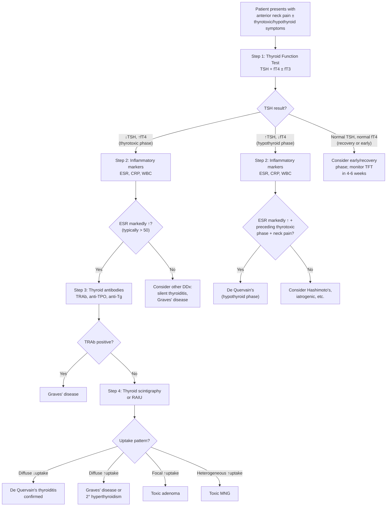
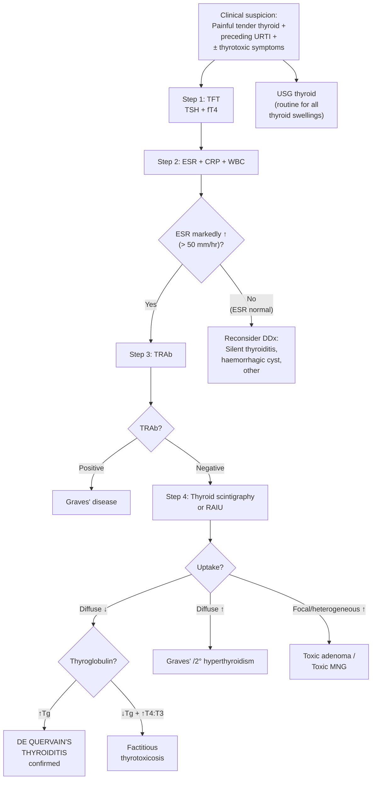

## Diagnostic Criteria, Algorithm and Investigations for De Quervain's Thyroiditis

### 1. Diagnostic Criteria

De Quervain's thyroiditis does not have a single, universally codified set of diagnostic criteria like, say, the Jones criteria for rheumatic fever. Instead, the diagnosis is made by a **constellation of clinical, biochemical, and imaging findings**. Think of it as a clinical diagnosis supported by investigations. Here is the practical diagnostic framework:

#### 1.1 Core Diagnostic Features (All Should Be Present)

| # | Feature | Rationale |
|---|---|---|
| 1 | **Painful, tender thyroid gland** | The hallmark — ***pain is present in de Quervain's but not in lymphocytic/postpartum thyroiditis*** [2]. Inflammatory destruction of follicles → capsular distension → nociceptor stimulation |
| 2 | **Elevated ESR** (typically > 50 mm/hr, often > 80) | ***Systemic symptoms: fever, ↑WBC, ↑ESR*** [2]. Acute-phase response: IL-6 drives hepatic fibrinogen synthesis → rouleaux formation → ↑ESR. This is the single most useful blood test to confirm the diagnosis |
| 3 | **Suppressed TSH** (in thyrotoxic phase) or **elevated TSH** (in hypothyroid phase) | Reflects the phase of illness. In Phase 1: flood of pre-formed T4/T3 suppresses TSH via negative feedback. In Phase 2: depleted stores and damaged follicles → low T4 → TSH rises |
| 4 | **Low radioactive iodine uptake (RAIU)** | ***↓Iodine uptake (↓TSH, follicular damage)*** [2]. The damaged gland cannot trap iodine AND the suppressed TSH provides no stimulus. This separates destructive thyrotoxicosis from true hyperthyroidism |

#### 1.2 Supportive Features (Strengthen the Diagnosis)

| Feature | Detail |
|---|---|
| Preceding viral URTI (2–8 weeks prior) | The classic temporal association — ***usually occur after viral infection (Coxsackie, mumps, adenoviruses)*** [2] |
| ***Low titres of thyroid autoantibodies*** [2] | Transient low-titre anti-TPO/anti-Tg may appear (released antigens trigger a weak immune response), but not the persistently high titres of Hashimoto's (anti-TPO 90–100%) or Graves' (TRAb 80–90%) [1] |
| Negative TRAb | Excludes Graves' disease — ***TRAb sens 97%, spec 99% with newer assays*** [7][9] |
| Characteristic USG findings | Diffuse hypoechoic areas, reduced vascularity (unlike the hypervascular pattern of Graves') |
| Triphasic clinical course | Thyrotoxicosis → hypothyroidism → recovery; pathognomonic if observed over time |
| Self-limiting course | Spontaneous resolution within 6–12 months without anti-thyroid drugs |

<Callout title="There Is No 'Gold Standard' Single Test" type="error">
Students often look for a single confirmatory test. For de Quervain's, there is none. The diagnosis rests on the **clinical triad of painful tender thyroid + markedly elevated ESR + low RAIU** in the context of preceding viral illness. If you have all three, the diagnosis is virtually certain. Biopsy showing granulomatous inflammation with giant cells is pathognomonic but is almost never needed clinically.
</Callout>

---

### 2. Diagnostic Algorithm

The diagnostic approach follows a logical stepwise process. You start with the presenting complaint, confirm thyroid dysfunction biochemically, then determine the **aetiology** of the thyroid dysfunction.

#### 2.1 Master Diagnostic Algorithm

#### 2.2 The Evaluation of Thyrotoxicosis Algorithm (From Lecture) [1]

The standard approach to any patient with thyrotoxicosis, as taught in the evaluation protocol [1]:

1. **Measure TSH and unbound (free) T4**
   - ***↓TSH + ↑fT4 = primary thyrotoxicosis*** [1][3]
   - ***↓TSH + normal fT4 → measure fT3***: if ↑fT3 = ***T3 toxicosis*** (2–5% of hyperthyroid patients have ONLY elevated fT3) [1]; if normal fT3 = ***subclinical hyperthyroidism*** [1][3]
   - ***Normal or ↑TSH + ↑fT4 = TSH-secreting pituitary adenoma or thyroid hormone resistance syndrome*** [1]
2. **Look for features of Graves' disease**: ophthalmopathy, diffuse non-tender goitre with bruit, pretibial myxoedema
3. **If not Graves' clinically → aetiological investigations** [7][9]:
   - ***TRAb***: positive → Graves'
   - ***Thyroid scintigraphy***: the key aetiological investigation

> ***Aetiological Ix if not clinically apparent, e.g. ophthalmopathy, diffuse non-tender goitre*** [7][9]. ***Thyroid scintigraphy: not widely available, useful in specific scenarios — when suspecting destructive thyroiditis, diffuse toxic goitre with -ve TRAb, S/S suggestive of destructive thyroiditis, e.g. painful goitre*** [3][7]

#### 2.3 Why Free T4 (fT4) Instead of Total T4?

***fT4 is measured instead of total T4 because T3 and T4 are highly protein-bound and many factors influence protein binding*** [1]:
- **TBG increased** (pregnancy, OCP, hormonal therapy) → total T4 falsely elevated
- **TBG decreased** (androgens, hypoalbuminaemia) → total T4 falsely low
- ***fT3 and fT4 are normal in euthyroid patients with the above circumstances and hence are preferable over total thyroid hormones*** [1]

This is crucial: if you measure total T4 in a pregnant woman with de Quervain's, it may be elevated from both the thyrotoxicosis AND the elevated TBG, giving you a misleading picture.

#### 2.4 Why TSH Is the Most Sensitive Indicator

***TSH level is the MOST sensitive indicator of thyroid function due to short half-life*** [1]. The log-linear relationship between TSH and fT4 means that a small change in fT4 causes a large change in TSH. Even in early/subclinical disease, TSH is already abnormal while fT4 may still be within the reference range. Always start with TSH.

---

### 3. Investigation Modalities — Detailed Interpretation

#### 3.1 Blood Tests

##### 3.1.1 Thyroid Function Tests (TFT)

***Blood tests: TSH + free T4*** [5] — the first-line investigation for any thyroid disorder.

| Phase of De Quervain's | TSH | fT4 | fT3 | Interpretation |
|---|---|---|---|---|
| **Thyrotoxic phase (Phase 1)** | ↓↓ (often undetectable) | ↑↑ | ↑ | ***↓TSH ↑T3 ↑fT4: diagnostic of thyrotoxicosis (TSH usually undetectable)*** [3]. Pre-formed T4/T3 released from destroyed follicles. The TSH is suppressed by negative feedback |
| **Hypothyroid phase (Phase 2)** | ↑ | ↓ | ↓ | Stored hormones depleted, follicular cells still regenerating → cannot synthesise new hormone → TSH rises due to loss of negative feedback |
| **Recovery phase (Phase 3)** | Normal | Normal | Normal | Follicular regeneration complete → normal HPT axis |
| **Early/prodromal** | May be normal or borderline ↓ | May be normal or borderline ↑ | — | Very early inflammation may not yet have released enough hormone to alter TFT significantly; repeat in 2–4 weeks |

<Callout title="The Moving Target" type="idea">
The TFT in de Quervain's is a *snapshot* of a moving target. A single TFT tells you which PHASE the patient is in — it does not confirm the diagnosis. You need the clinical picture (pain, ESR) AND the TFT together. Serial TFTs over weeks to months demonstrating the triphasic pattern are confirmatory.
</Callout>

##### 3.1.2 Inflammatory Markers

| Test | Expected Finding in De Quervain's | Why |
|---|---|---|
| **ESR** | ***Markedly elevated (often > 50, sometimes > 100 mm/hr)*** [2] | Hepatic acute-phase response: IL-6 from inflamed thyroid → ↑fibrinogen → ↑rouleaux → ↑ESR. This is the **most useful blood test** for confirming de Quervain's |
| **CRP** | Elevated | Same acute-phase response. CRP rises faster than ESR (within 6–12 hours) and falls faster. May be useful for monitoring treatment response |
| **WBC** | ***↑WBC*** [2] | Leukocytosis from systemic inflammatory response; usually mild (10–15 × 10⁹/L), predominantly neutrophilic |

> The ESR is by far the most discriminating simple blood test. In silent thyroiditis and postpartum thyroiditis (the main DDx), the ESR is **normal**. A markedly elevated ESR in the context of a tender thyroid essentially clinches the diagnosis.

##### 3.1.3 Thyroid Antibodies

***Thyroid antibodies*** [1][7][9]:

| Antibody | Finding in De Quervain's | Comparison | Clinical Significance |
|---|---|---|---|
| **TRAb (anti-TSH receptor)** | **Negative** | Graves': 80–90% positive [1]; ***sens 97%, spec 99%*** [3][7] | A negative TRAb in the presence of thyrotoxicosis effectively excludes Graves' disease and should prompt scintigraphy |
| **Anti-TPO** | ***Low titre*** [2] (transient, present in ~10–20%) | Hashimoto's: 90–100% [1][7]; Normal population: 10–15% [1] | Low-titre transient positivity reflects release of TPO antigen from destroyed follicles → weak secondary immune response |
| **Anti-Tg** | Low titre (transient) | Hashimoto's: 80–90% [1][7]; Normal population: 10–20% [1] | Same mechanism as anti-TPO |

> ***High titres suggest underlying autoimmune pathology → ↑risk of recurrence + ultimate progression to hypothyroidism*** [2]. If a patient with de Quervain's has unexpectedly HIGH-titre anti-TPO, suspect co-existing Hashimoto's and monitor more closely for permanent hypothyroidism.

##### 3.1.4 Other Blood Tests

| Test | Role | Expected Finding |
|---|---|---|
| **Serum thyroglobulin (Tg)** | Differentiates thyroid destruction from factitious thyrotoxicosis | **Elevated** in de Quervain's (released from destroyed follicles). ***Factitious thyrotoxicosis confirmed by ↓serum thyroglobulin*** [7][9] — because exogenous T4 suppresses the gland, no Tg is released |
| **T4:T3 ratio** | Differentiates from factitious thyrotoxicosis | Normal (~30:1) in de Quervain's. ***In exogenous thyroxine intake, ratio can rise to > 70:1*** [3][7] because T3 comes only from peripheral conversion |
| **CBC** | General workup | Mild leukocytosis [2] |
| ***ESR, antithyroid Ab (ATA) for thyroiditis*** [7][8] | Directed workup when thyroiditis suspected | As above |
| ***Calcitonin*** [7][8] | NOT indicated in de Quervain's | ***Only if Hx or clinical suspicion of familial medullary carcinoma or MEN2*** [7][8] |

---

#### 3.2 Imaging

##### 3.2.1 Thyroid Ultrasound (USG)

***Ultrasound*** [5] — ***routine for ALL goitre/nodules*** [7][8].

**Indication**: Should be performed in all patients presenting with a thyroid swelling, including de Quervain's, primarily to:
1. Exclude a nodular process (dominant nodule, cyst with haemorrhage, malignancy)
2. Characterise the pattern of thyroid inflammation
3. Guide potential FNAC if a suspicious nodule is co-incidentally found

**Findings in De Quervain's thyroiditis**:

| USG Feature | Description | Pathophysiological Basis |
|---|---|---|
| **Diffuse or focal hypoechoic areas** | Ill-defined, irregularly shaped hypoechoic regions corresponding to areas of inflammation | Inflammatory cell infiltration and oedema reduce echogenicity compared to normal thyroid parenchyma |
| **Reduced or absent vascularity** (on colour Doppler) | Decreased blood flow within the inflamed regions | Destruction of follicular architecture and surrounding microvascular damage; contrasts with Graves' (which shows "thyroid inferno" — diffusely increased vascularity) |
| **Thyroid enlargement** (diffuse or asymmetric) | The gland appears enlarged, often asymmetrically (one lobe more affected) | Inflammatory swelling; may start unilateral then become bilateral ("creeping thyroiditis") |
| **Absence of nodules** (typically) | No discrete solid or complex nodules; instead diffuse parenchymal change | De Quervain's is a diffuse inflammatory condition, not a neoplastic/nodular one |
| **No suspicious lymphadenopathy** | Cervical LNs are reactive at most | Not a malignant or granulomatous systemic process |

**Contrast with other conditions on USG**:

| Condition | USG Pattern |
|---|---|
| **Graves' disease** | Diffusely enlarged, ***↑blood flow*** [3][7] ("thyroid inferno" on Doppler) |
| **Hashimoto's** | Diffusely heterogeneous, hypoechoic, coarse echotexture ("Swiss cheese" pattern), reduced vascularity |
| **De Quervain's** | Focal or diffuse hypoechoic areas, **↓vascularity**, may be asymmetric |
| **Toxic adenoma** | Single well-defined hypervascular nodule |
| **Thyroid malignancy** | Hypoechoic, solid, microcalcifications, irregular margins, taller-than-wide, absent halo [1][7][8] |

***USG of thyroid: 7.5 or 10 mHz probes, B mode*** [7][8]:
- ***Pros/cons: readily available, non-invasive, ↑Sens but ↓Spec*** [7][8]
- ***Indication: for all patients with goitre/palpable nodules*** [7][8]
- ***Use: as an extension of P/E to guide (not confirm) dx*** [7][8]

##### 3.2.2 Thyroid Scintigraphy (Radionuclide Scan)

This is the **key aetiological investigation** that separates de Quervain's from other causes of thyrotoxicosis.

***Radio-isotope scintigraphy (I¹²³ or Tc⁹⁹ᵐ)*** [5][10]:

**Principle** [10][11]:
- ***Radioactive iodine handled in the same manner as normal iodine*** [10]
- ***Level of uptake (and hence metabolic activity) reflected by localization of radioactive iodine*** [10]
- ***99mTc pertechnetate has a similar ionic size as iodide ion, allowing it to be taken up by NIS*** [10] (NIS = sodium-iodide symporter on the basolateral membrane of thyrocytes)
- ***Radiopharmaceuticals used: 99mTc pertechnetate (iodine trapping only), 123I or 131I (trapping + organification)*** [10]
- ***Main use: assess metabolic function of thyroid gland*** [10]

**Indications for scintigraphy** [3][7][9]:
- ***When suspecting destructive thyroiditis*** [3][7]
- ***Diffuse toxic goitre with -ve TRAb*** [3][7]
- ***S/S suggestive of destructive thyroiditis, e.g. painful goitre*** [3][7]
- ***In event of ↓TSH with thyroid nodule(s)*** [3][7] — to differentiate toxic adenoma, toxic MNG, Graves' with co-existing nodule

**Findings and interpretation in the context of thyrotoxicosis** [3][7][9]:

| Scintigraphy Pattern | Diagnosis | Why |
|---|---|---|
| ***Diffuse ↓uptake*** | ***Destructive thyroiditis*** (de Quervain's, silent, postpartum) ***vs factitious thyrotoxicosis*** [3][7][9] | In de Quervain's: follicular damage means thyrocytes cannot trap iodine + TSH is suppressed so no NIS stimulation. In factitious: exogenous T4 suppresses TSH → gland shuts down |
| ***Diffuse ↑uptake*** | ***Graves' disease vs 2° hyperthyroidism*** [3][7][9] | TRAb stimulates TSH receptors → NIS upregulated → avid iodine trapping throughout the gland |
| ***Heterogeneous ↑uptake*** | ***Toxic MNG*** [3][7][9] | Multiple autonomously functioning nodules with varying degrees of iodine trapping; suppressed surrounding tissue |
| ***Focal ↑uptake with ↓uptake elsewhere*** | ***Toxic adenoma*** [3][7][9] | Single autonomous nodule traps iodine avidly; the rest of the gland is suppressed by negative feedback |

**Distinguishing de Quervain's from factitious thyrotoxicosis** (both show diffuse ↓ uptake):
- ***Factitious thyrotoxicosis can be confirmed by ↑T4:T3 ratio (> 70:1) and ↓serum thyroglobulin*** [3][7][9]
- In de Quervain's: T4:T3 ratio is normal (~30:1) and thyroglobulin is **elevated** (from follicular destruction)

> ***Diagnosis of malignancy by scintigraphy: low sensitivity and specificity*** [5]. ***Functional assessment in thyrotoxic patients*** [5] — this is its main strength. Scintigraphy is NOT a cancer screening tool; it is an aetiological tool for thyrotoxicosis.

<Callout title="When NOT to Order Scintigraphy">
***Radionuclide scintigraphy should NOT be used if TSH is normal, because most cold nodules are benign and this would lead to unnecessary biopsy*** [8][9]. In de Quervain's, scintigraphy is indicated specifically because the TSH IS suppressed (thyrotoxic phase) and you need to confirm the destructive aetiology.
</Callout>

##### 3.2.3 Other Imaging (Usually NOT Needed)

| Modality | Role in De Quervain's |
|---|---|
| **CXR** | Not routinely needed; only if retrosternal extension suspected (rare in de Quervain's) |
| **CT/MRI** | ***CT/MRI for retrosternal extension and staging (NOT routine)*** [7][8]; not indicated in de Quervain's unless atypical features suggest malignancy |
| **PET scan** | ***No diagnostic role*** [6]; however, incidental FDG uptake in the thyroid on PET done for other reasons may sometimes lead to incidental detection of thyroiditis |

---

#### 3.3 Fine Needle Aspiration Cytology (FNAC)

***FNAC (+molecular testing)*** [5] — ***single most important Ix for thyroid nodule*** [8][9].

**Role in de Quervain's**: **Usually NOT required**. De Quervain's is a **clinical diagnosis** and FNAC is reserved for:
1. **Diagnostic uncertainty** — when malignancy cannot be excluded clinically (e.g., atypical presentation, no systemic features, focal mass rather than diffuse tenderness)
2. **Suspicious nodule on USG** — if a co-incidental nodule is found with suspicious features (hypoechoic, microcalcifications, taller-than-wide, irregular margins), FNAC of that nodule is indicated regardless of the thyroiditis

**FNAC findings in de Quervain's (if performed)**:
- **Granulomatous inflammation**: clusters of epithelioid histiocytes and multinucleated giant cells
- **Inflammatory background**: neutrophils (early), lymphocytes, macrophages
- **Colloid debris**: leaked from destroyed follicles
- **Sparse or absent follicular cells**: because the follicular epithelium is destroyed

This pattern is characteristic and distinct from malignancy (which shows atypical epithelial cells) or Hashimoto's (which shows Hürthle cells and lymphocytes with germinal centres).

---

#### 3.4 Summary: Investigation Checklist for De Quervain's Thyroiditis

| Investigation | Category | Indication | Key Finding |
|---|---|---|---|
| ***TSH + fT4*** [5] | **Routine — 1st line** | All patients | ↓TSH + ↑fT4 (Phase 1) or ↑TSH + ↓fT4 (Phase 2) |
| **ESR, CRP** | **Routine — 1st line** | All patients | ***Markedly ↑ESR*** [2]; ↑CRP |
| **WBC** | Routine | All patients | ***↑WBC*** [2] (mild leukocytosis) |
| ***TRAb*** | **Aetiological — 2nd line** | To exclude Graves' | **Negative** in de Quervain's |
| **Anti-TPO, anti-Tg** | Aetiological — 2nd line | Antibody profile | ***Low titre (transient)*** [2] |
| ***USG thyroid*** [5] | **Routine** | All thyroid swellings | Diffuse hypoechoic areas, ↓vascularity, no nodules |
| ***Thyroid scintigraphy*** [5] | **Aetiological — 2nd line** | When aetiology of thyrotoxicosis unclear | ***Diffuse ↓uptake*** [3][7][9] |
| **Serum thyroglobulin** | Selective | To r/o factitious thyrotoxicosis | ↑ in de Quervain's; ***↓ in factitious*** [3][7][9] |
| **T4:T3 ratio** | Selective | To r/o factitious thyrotoxicosis | Normal (~30:1); ***> 70:1 in factitious*** [3][7][9] |
| ***FNAC*** [5] | Selective | Diagnostic uncertainty or suspicious nodule | Granulomatous inflammation, giant cells, colloid debris |

***Routine for all patients: TFT, thyroid USG*** [6]. ***Selective: thyroid scan (only in toxic + nodules), ESR and antithyroid antibodies for thyroiditis*** [6][7][8].

---

### 4. Diagnostic Algorithm — Practical Stepwise Summary

<Callout title="Exam Tip — The Minimum You Need">
In clinical practice (and exams), the diagnosis of de Quervain's can often be made confidently with just **three things**:
1. **Tender thyroid** on examination
2. **Markedly elevated ESR** (> 50 mm/hr)
3. **Low TSH + high fT4** (if in thyrotoxic phase)

Scintigraphy adds certainty but is not always needed if the clinical picture is classic. However, if asked in an exam about the **key investigation to differentiate de Quervain's from Graves'**, the answer is **thyroid scintigraphy (RAIU)** — low uptake confirms destructive thyrotoxicosis.
</Callout>

---

<Callout title="High Yield Summary">

**Diagnostic Approach to De Quervain's Thyroiditis:**

1. **No formal diagnostic criteria** — clinical diagnosis based on constellation: painful tender thyroid + ↑ESR + low RAIU + preceding URTI
2. **First-line investigations**: TFT (TSH + fT4), ESR/CRP, WBC, thyroid USG
3. **Second-line aetiological investigations**: TRAb (to exclude Graves'), thyroid scintigraphy (diffuse ↓ uptake confirms destructive thyrotoxicosis)
4. **Key TFT pattern**: Phase 1 = ↓TSH + ↑fT4; Phase 2 = ↑TSH + ↓fT4; Phase 3 = normal
5. **ESR is the most discriminating simple blood test** — markedly elevated (> 50) in de Quervain's, normal in silent/postpartum thyroiditis
6. **Thyroid antibodies**: TRAb negative; anti-TPO/anti-Tg low titre (transient)
7. **Scintigraphy interpretation**: Diffuse ↓ uptake = destructive (de Quervain's/silent/factitious); Diffuse ↑ = Graves'; Focal ↑ = toxic adenoma; Heterogeneous ↑ = toxic MNG
8. **Factitious thyrotoxicosis** also shows ↓ uptake but distinguished by ↓thyroglobulin + ↑T4:T3 ratio (> 70:1)
9. **FNAC** is NOT routinely needed; reserve for diagnostic uncertainty or co-incidental suspicious nodule
10. **Always measure fT4, not total T4** — protein-binding factors can confound total T4

</Callout>

---

<ActiveRecallQuiz
  title="Active Recall - Diagnosis of De Quervain's Thyroiditis"
  items={[
    {
      question: "What are the three core features that clinch the clinical diagnosis of de Quervain's thyroiditis?",
      markscheme: "1. Painful tender thyroid gland. 2. Markedly elevated ESR (typically > 50 mm/hr). 3. Low radioactive iodine uptake (RAIU) on scintigraphy. Supported by: preceding URTI, suppressed TSH with elevated fT4 (thyrotoxic phase), negative TRAb, low-titre thyroid autoantibodies.",
    },
    {
      question: "A thyrotoxic patient has diffuse decreased uptake on thyroid scintigraphy. Name two differential diagnoses and state how you distinguish between them.",
      markscheme: "1. De Quervain's thyroiditis: painful thyroid, elevated ESR, elevated serum thyroglobulin, normal T4:T3 ratio. 2. Factitious thyrotoxicosis: no thyroid pain, normal ESR, decreased serum thyroglobulin, elevated T4:T3 ratio greater than 70:1. Other acceptable: silent thyroiditis (painless, normal ESR, high-titre anti-TPO), postpartum thyroiditis (painless, within 12 months of delivery).",
    },
    {
      question: "Explain why free T4 is preferred over total T4 in thyroid function testing.",
      markscheme: "T3 and T4 are highly protein-bound (mainly to TBG). Factors that alter TBG levels (e.g. pregnancy, OCP increase TBG; androgens, hypoalbuminaemia decrease TBG) cause misleading changes in total T4. Free T4 reflects the biologically active unbound fraction and is not affected by TBG changes, making it a more accurate measure of true thyroid status.",
    },
    {
      question: "List four different uptake patterns on thyroid scintigraphy and the corresponding diagnoses.",
      markscheme: "1. Diffuse decreased uptake: destructive thyroiditis (de Quervain's, silent, postpartum) or factitious thyrotoxicosis. 2. Diffuse increased uptake: Graves' disease or secondary hyperthyroidism. 3. Heterogeneous increased uptake: toxic multinodular goitre. 4. Focal increased uptake with suppression elsewhere: toxic adenoma.",
    },
    {
      question: "Why is thyroid scintigraphy contraindicated or unhelpful when TSH is normal?",
      markscheme: "When TSH is normal, the thyroid is not hyperfunctioning. Most cold nodules found on scintigraphy in this setting are benign, leading to unnecessary biopsies. Scintigraphy is indicated only when TSH is suppressed to determine whether a nodule is autonomously hyperfunctioning (hot) or non-functioning (cold), or to assess the aetiology of thyrotoxicosis.",
    },
  ]}
/>

## References

[1] Senior notes: felixlai.md (Causes of thyrotoxicosis, thyroid antibody tables, TFT evaluation flowchart, fT4 rationale)
[2] Senior notes: Ryan Ho Endocrine.pdf (Section 1.5.1 Subacute Thyroiditis, p.31)
[3] Senior notes: Adrian Lui Pediatrics.pdf (Thyrotoxicosis aetiological Ix, scintigraphy table, p.271–272)
[5] Lecture slides: GC 177. A thyroid nodule benign thyroid nodules; thyroid cancer.pdf (p.4 Goitre Classification, p.7 Investigations, p.13 Other investigations — scintigraphy)
[6] Senior notes: maxim.md (Approach to thyroid nodules — Investigations table)
[7] Senior notes: Ryan Ho Endocrine.pdf (Aetiological Ix and scintigraphy findings, p.13; Ix for goitre, p.19; Hashimoto's Ix, p.30)
[8] Senior notes: Ryan Ho Fundamentals.pdf (Ix for goitre/thyroid nodules, p.425–429; USG features, p.427; FNAC, p.428; Scintigraphy, p.429)
[9] Senior notes: Ryan Ho Fundamentals.pdf (Thyrotoxicosis — aetiological Ix and scintigraphy, p.422)
[10] Senior notes: Ryan Ho Diagnostic Radiology.pdf (Thyroid scintigraphy — principles, radiopharmaceuticals, p.59)
