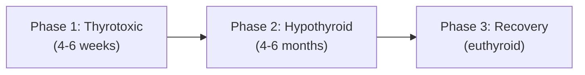

# De Quervain's Thyroiditis

## 1. Definition

De Quervain's thyroiditis — also known as **subacute granulomatous thyroiditis**, **giant cell thyroiditis**, or simply **subacute thyroiditis** — is a self-limiting inflammatory disorder of the thyroid gland characterised by a triphasic clinical course (thyrotoxicosis → hypothyroidism → recovery) and, crucially, **painful thyroid swelling**.

Breaking down the name:
- **De Quervain** — Fritz de Quervain, the Swiss surgeon who first described it in 1904 (not to be confused with de Quervain's tenosynovitis of the wrist, which is an entirely different condition by the same eponymous surgeon).
- **Subacute** — the time course sits between acute (suppurative/bacterial thyroiditis, which is days) and chronic (Hashimoto's, which is months to years). Subacute thyroiditis evolves over weeks to months.
- **Granulomatous** — histologically characterised by granulomatous inflammation with multinucleated giant cells surrounding damaged thyroid follicles.

<Callout title="Key Conceptual Distinction">
**Thyrotoxicosis ≠ Hyperthyroidism.** De Quervain's thyroiditis causes **thyrotoxicosis without hyperthyroidism** [1][2]. The thyroid gland is NOT hyperactive — it is being *destroyed* by inflammation, releasing pre-formed thyroid hormones (T3/T4) from colloid stores into the circulation. This is why anti-thyroid drugs (e.g., carbimazole, propylthiouracil) are **useless** — there is no excess hormone *synthesis* to block.
</Callout>

---

## 2. Epidemiology

| Parameter | Detail |
|---|---|
| **Incidence** | ***Generally uncommon*** [2]; accounts for approximately 5% of all thyroid disorders |
| **Sex** | Female predominance (F:M ≈ 4–5:1), consistent with most thyroid conditions |
| **Age** | Peak incidence 30–50 years old (working-age adults) |
| **Seasonal variation** | Often peaks in summer/autumn, paralleling enteroviral and adenoviral seasons |
| **Geographic** | No strong geographic predilection; occurs worldwide, but less common in areas with severe iodine deficiency (where thyroid autoimmune disease is rarer) |
| **HK context** | Hong Kong has borderline iodine intake (no mandatory salt iodination) → relatively low incidence of autoimmune thyroid disease [3][4], but viral-triggered subacute thyroiditis still occurs; awareness important in differential of painful neck swelling |
| **Genetic** | Associated with **HLA-B35** (up to 70% of patients carry this allele) — suggests a genetic susceptibility to virus-triggered thyroid inflammation |
| **Temporal association** | Often follows an **upper respiratory tract infection** by 2–8 weeks |

---

## 3. Risk Factors

| Risk Factor | Explanation |
|---|---|
| **Recent viral URTI** | The most consistently reported risk factor; preceding viral illness triggers the autoimmune/inflammatory cascade |
| **HLA-B35 positivity** | Genetic predisposition; this MHC class I allele may facilitate aberrant viral antigen presentation on thyrocytes |
| **Female sex** | As with most thyroid diseases, oestrogen may modulate immune responses making women more susceptible |
| **Post-COVID-19** | Increasing case reports since 2020 of de Quervain's thyroiditis following SARS-CoV-2 infection — relevant in the 2025–2026 post-pandemic era |

---

## 4. Anatomy and Function (Relevant Review)

### 4.1 Thyroid Gland Anatomy

- **Location**: Anterior neck, draped around the trachea at the level of C5–T1. Two lateral lobes connected by an isthmus.
- **Blood supply**: Extremely vascular — superior thyroid artery (from external carotid) and inferior thyroid artery (from thyrocervical trunk of subclavian artery). This rich vascularity is important because it explains why inflammatory conditions of the thyroid can cause dramatic local tenderness and referred pain.
- **Innervation**: Sympathetic fibres (vasomotor); no direct secretomotor innervation (thyroid function is controlled hormonally via the HPT axis, not neurally).
- **Relations**:
  - **Posteriorly**: Recurrent laryngeal nerves (run in the tracheo-oesophageal groove) — important surgically, but NOT typically affected in de Quervain's.
  - **Superiorly**: External branch of the superior laryngeal nerve.
  - **Capsule**: The thyroid has a true capsule and a false capsule (pretracheal fascia). Inflammation can radiate pain along fascial planes → referred pain to the **jaw and ears** (via shared cervical innervation).

### 4.2 Thyroid Follicle — The Functional Unit

Understanding the follicle is key to understanding *why* de Quervain's causes thyrotoxicosis:

- The thyroid is composed of ~3 million **follicles** — spherical structures lined by a single layer of **thyrocytes (follicular epithelial cells)** surrounding a central lumen filled with **colloid**.
- **Colloid** = the storage form of thyroid hormone, consisting mainly of **thyroglobulin (Tg)**, a large glycoprotein onto which T3 and T4 are synthesised and stored.
- The thyroid is unique among endocrine glands — it stores weeks' worth of pre-formed hormone in its colloid. This is precisely why damage to follicles (as in de Quervain's) releases a *bolus* of thyroid hormone, causing acute thyrotoxicosis.

### 4.3 The Hypothalamic-Pituitary-Thyroid (HPT) Axis

```
Hypothalamus → TRH → Anterior Pituitary → TSH → Thyroid → T4/T3
                                                      ↑
                                              Negative feedback
```

- In de Quervain's, the flood of released T4/T3 **suppresses TSH** via negative feedback. This is why:
  - TSH is low during the thyrotoxic phase
  - Radioactive iodine uptake (RAIU) is low — the suppressed TSH means no stimulation of iodine trapping, AND the damaged follicles cannot trap iodine even if stimulated

---

## 5. Etiology and Pathophysiology

### 5.1 Etiology

***De Quervain's thyroiditis usually occurs after viral infection*** [2].

| Viral Agents Implicated | Evidence |
|---|---|
| **Coxsackievirus** (A and B) | ***Coxsackie*** [2] — most commonly cited |
| **Mumps virus** | ***Mumps*** [2] |
| **Adenoviruses** | ***Adenoviruses*** [2] |
| **Measles, influenza** | Case reports |
| **SARS-CoV-2** | Emerging post-COVID association (2020 onwards) |
| **Echovirus, EBV, CMV** | Less commonly reported |

The classification within the goitre schema is: ***Thyroiditis — viral (subacute)*** [5].

<Callout title="Not Directly Viral">
It is debated whether the virus directly infects thyrocytes or whether the viral infection triggers an aberrant immune response against the thyroid in genetically susceptible individuals (HLA-B35). The granulomatous histology and the temporal lag (2–8 weeks post-URTI) favour an immune-mediated mechanism rather than direct cytopathic viral effect. Think of it as: **virus → immune trigger → collateral thyroid destruction**.
</Callout>

### 5.2 Pathophysiology — The Triphasic Course

This is the single most important concept in de Quervain's. The clinical course follows three predictable phases, each with a clear mechanistic explanation:



#### Phase 1: Thyrotoxic Phase (4–6 weeks) [2]

- **Mechanism**: ***Damage to follicles → release of stored T4 until depletion*** [2]
  - Viral/immune-mediated inflammation destroys thyroid follicular cells → colloid containing pre-formed T4 and T3 leaks into the bloodstream
  - This is a "thyroid hormone dump" — NOT new synthesis
  - The released hormone causes clinical thyrotoxicosis (tachycardia, tremor, heat intolerance, anxiety, weight loss)
- **Biochemistry**:
  - ***↓Iodine uptake (↓TSH, follicular damage)*** [2] — two reasons for low RAIU:
    1. TSH is suppressed by the high T4/T3 (negative feedback) → no drive for iodine uptake
    2. The follicular cells are damaged and cannot trap iodine even if stimulated
  - T4/T3 elevated, TSH suppressed
  - ***Low titres of thyroid autoantibodies*** [2] — these are transiently positive due to release of thyroid antigens (thyroglobulin, TPO) from damaged cells, but are typically low-titre and transient (unlike Hashimoto's or Graves' where titres are persistently high)
- **Pain**: Most prominent during this phase — the active inflammatory destruction causes the characteristic neck pain

> ***High titres [of thyroid autoantibodies] suggest underlying autoimmune pathology → ↑risk of recurrence + ultimate progression to hypothyroidism*** [2]

#### Phase 2: Hypothyroid Phase (4–6 months) [2]

- **Mechanism**: ***Damage to follicular cells → ↓synthesis of thyroid hormones*** [2]
  - Once the stored hormone has been completely released and the follicular cells are still regenerating, the thyroid cannot produce new hormone
  - TSH begins to rise (lack of negative feedback)
  - This phase is typically milder and shorter than the hypothyroidism of Hashimoto's
- **Biochemistry**: T4 low, TSH elevated
- **Symptoms**: Fatigue, weight gain, cold intolerance, constipation (all due to insufficient circulating thyroid hormone)

#### Phase 3: Recovery / Euthyroid Phase

- **Mechanism**: Follicular cells regenerate → normal thyroid hormone production resumes → TSH normalises
- ***Resolution*** [2]: The vast majority (>90%) of patients make a **complete recovery** within 6–12 months
- About **5–15%** of patients develop **permanent hypothyroidism** — this is more likely if:
  - High-titre thyroid autoantibodies are present (suggesting co-existing autoimmune thyroiditis)
  - Recurrent episodes of subacute thyroiditis (rare, ~2% recurrence)

### 5.3 Histopathology

Understanding the histology explains the alternative names:

| Feature | Description |
|---|---|
| **Granulomatous inflammation** | Aggregates of macrophages, lymphocytes, and plasma cells around damaged follicles — hence "granulomatous thyroiditis" |
| **Multinucleated giant cells** | Formed by fusion of macrophages engulfing leaked colloid — hence "giant cell thyroiditis" |
| **Follicular disruption** | Destroyed follicular epithelium with leakage of colloid into the interstitium |
| **Fibrosis** | In later stages, fibrosis replaces the inflammatory infiltrate as healing progresses |
| **Microabscess formation** | Neutrophilic infiltration in early acute phase, then replaced by granulomatous response |

The presence of granulomas with giant cells surrounding colloid material is **pathognomonic** and distinguishes de Quervain's from other forms of thyroiditis (Hashimoto's has lymphocytic infiltration with Hürthle cells, not granulomas).

---

## 6. Classification

De Quervain's thyroiditis sits within a broader framework of thyroid inflammatory conditions:

### 6.1 Classification of Thyroiditis

| Type | Onset | Pain | Mechanism | Example |
|---|---|---|---|---|
| **Acute** | Days | Severe | Bacterial infection | ***Acute suppurative (bacterial) thyroiditis*** [5] |
| **Subacute** | Weeks | **Painful** (de Quervain's) or **Painless** (lymphocytic) | Viral/immune | ***Viral (subacute) thyroiditis*** [5] = De Quervain's; Subacute lymphocytic thyroiditis; Postpartum thyroiditis |
| **Chronic** | Months–years | Usually painless | Autoimmune, fibrous | ***Lymphocytic/Hashimoto/autoimmune (chronic) thyroiditis*** [5]; Riedel's thyroiditis |

### 6.2 Within the Subacute Category

***Subacute thyroiditis types*** [2]:
- ***Subacute granulomatous (de Quervain's, giant cell) thyroiditis*** — **PAINFUL**
- ***Subacute lymphocytic thyroiditis*** — **PAINLESS**
- ***Postpartum thyroiditis*** — **PAINLESS** (occurs within 12 months of delivery)
- ***Palpation thyroiditis*** — trivial, after vigorous thyroid examination

<Callout title="The Pain Question" type="idea">
The most clinically useful distinguishing feature among the subacute thyroiditides is **pain**. ***Pain: present in de Quervain's but not in lymphocytic/postpartum thyroiditis*** [2]. If a patient has a tender thyroid with thyrotoxicosis and elevated ESR, think de Quervain's FIRST.
</Callout>

### 6.3 Classification Within Causes of Thyrotoxicosis

De Quervain's falls under ***thyrotoxicosis without hyperthyroidism*** [1]:

| Category | Causes |
|---|---|
| **Primary hyperthyroidism** | Graves' disease, toxic MNG, toxic adenoma |
| **Secondary hyperthyroidism** | TSH-secreting pituitary adenoma, gestational thyrotoxicosis |
| ***Thyrotoxicosis without hyperthyroidism*** | ***Subacute (De Quervain's) thyroiditis***, silent thyroiditis, destructive thyroiditis (amiodarone/irradiation), levothyroxine overdose [1] |

### 6.4 Classification Within Causes of Hypothyroidism

De Quervain's also appears under ***transient hypothyroidism*** [1]:

| Category | Causes |
|---|---|
| **Permanent primary** | Autoimmune (Hashimoto's, atrophic), iatrogenic (RAI, surgery), infiltrative |
| **Secondary** | Pituitary/hypothalamic disease |
| ***Transient*** | ***Subacute (De Quervain's) thyroiditis***, silent thyroiditis, post-partum thyroiditis, withdrawal of T4, post-RAI, post-thyroidectomy [1] |

### 6.5 Classification Within Goitre

***De Quervain's/subacute thyroiditis*** falls under the ***diffuse goitre*** category of thyroiditis [6]:

| Goitre Type | Examples |
|---|---|
| ***Thyroiditis*** | ***Bacterial (acute suppurative)***, ***viral (subacute)***, ***lymphocytic/Hashimoto/autoimmune (chronic)*** [5] |
| Simple goitre | Endemic (iodine deficiency), sporadic — diffuse or nodular |
| Toxic goitre | Graves' (diffuse toxic), toxic MNG (Plummer's), toxic adenoma |
| Neoplastic | Benign, malignant |

---

## 7. Clinical Features

### 7.1 Symptoms

| Symptom | Pathophysiological Basis |
|---|---|
| ***Neck pain*** — the hallmark symptom | Inflammatory destruction of thyroid follicles → oedema, distension of the thyroid capsule, and stimulation of pain fibres in the pretracheal fascia. The thyroid capsule is richly innervated by cervical sensory nerves. |
| ***Pain radiating to the angle of jaw and ears*** [2] | Referred pain via shared sensory innervation — the thyroid receives sensory fibres from the cervical plexus (C2–C4) which also innervate the mandibular angle and external ear (great auricular nerve, C2–C3). |
| ***Pain increased by swallowing, coughing, movement of neck*** [2] | Swallowing elevates the thyroid (it is attached to the pretracheal fascia), stretching the inflamed capsule. Coughing increases intrathoracic pressure transmitted to the neck. Head turning stretches cervical structures against the swollen gland. |
| **Preceding URTI symptoms** (sore throat, malaise, myalgia) | The viral prodrome 2–8 weeks before thyroid symptoms; may be mistaken for ongoing pharyngitis |
| **Sore throat** / odynophagia | Can mimic pharyngitis/tonsillitis — the anterior neck pain may be mislocalized to the throat. A common diagnostic pitfall. |
| ***Fever*** [2] | Systemic inflammatory response — release of IL-1, IL-6, TNF-α from activated macrophages and lymphocytes during granulomatous inflammation |
| **Thyrotoxic symptoms** (Phase 1): palpitations, tremor, heat intolerance, anxiety, weight loss, diarrhoea, irritability | ***Due to damage to follicles → release of stored T4*** [2]. Excess circulating T4/T3 increases basal metabolic rate, enhances catecholamine sensitivity (↑β-adrenergic receptor expression), and drives all the classic hypermetabolic symptoms |
| **Hypothyroid symptoms** (Phase 2): fatigue, weight gain, cold intolerance, constipation, dry skin, depressed mood | ***Damage to follicular cells → ↓synthesis of thyroid hormones*** [2]. Insufficient T3/T4 decreases BMR, reduces thermogenesis, and slows GI motility |
| **Malaise and fatigue** | Non-specific systemic inflammation; elevated cytokines cause constitutional symptoms similar to any viral illness |

<Callout title="Diagnostic Pitfall — Misdiagnosed as Pharyngitis" type="error">
De Quervain's thyroiditis is frequently misdiagnosed initially as pharyngitis/tonsillitis because patients complain of "sore throat" and have fever. The KEY distinguishing feature: the pain is in the **anterior lower neck** (thyroid region), NOT the posterior pharynx. Always palpate the thyroid in any patient with anterior neck pain and constitutional symptoms!
</Callout>

### 7.2 Signs

| Sign | Pathophysiological Basis |
|---|---|
| ***Palpable goitre ± tenderness*** [2] | Thyroid swelling from oedema and inflammatory infiltration of the gland. Tenderness is due to capsular distension and inflammatory mediators stimulating nociceptors. |
| **Firm, diffusely enlarged thyroid** | Inflammatory cell infiltration and oedema; initially the entire gland is involved (may start unilaterally then migrate — "creeping thyroiditis") |
| **Unilateral → bilateral progression** ("migratory" tenderness) | Inflammation may begin in one lobe and "creep" to the other over days to weeks — this migratory pattern is characteristic and rarely seen in other thyroid conditions |
| **Low-grade to moderate fever** | Systemic inflammation (pyrogenic cytokines — IL-1β, IL-6, PGE2 acting on the hypothalamic thermoregulatory centre) |
| **Tachycardia, tremor, warm moist skin** (Phase 1) | Thyrotoxicosis → T3/T4 upregulate β1-adrenergic receptors in the heart (tachycardia), increase CNS catecholamine sensitivity (tremor), and increase peripheral vasodilation and sweating (warm, moist skin) |
| **Bradycardia, dry skin, delayed relaxation of reflexes, periorbital oedema** (Phase 2) | Hypothyroidism → ↓BMR, ↓β-receptor expression, accumulation of glycosaminoglycans in tissues (myxoedema) |
| ***↑ESR (often markedly elevated, > 50 mm/hr)*** [2] | Hepatic acute-phase response — IL-6 stimulates hepatic production of fibrinogen, which increases rouleaux formation of RBCs → elevated ESR. ESR > 50 is typical; values > 100 are not uncommon |
| ***↑WBC*** [2] | Leukocytosis from systemic inflammatory response (margination and release of neutrophils from bone marrow stores) |
| **Absence of Graves' ophthalmopathy** | Important negative sign — no proptosis, lid lag, or chemosis because there are no TSH-receptor antibodies (TRAb). Helps distinguish from Graves' thyrotoxicosis |
| **Absence of thyroid bruit** | No increased blood flow from glandular hyperactivity (unlike Graves' where the hypervascular gland produces an audible bruit/thrill) |

### 7.3 Important Negative Signs (What You Do NOT See)

These are crucial for differential diagnosis:

| Absent Feature | Why It's Absent |
|---|---|
| No exophthalmos/ophthalmopathy | No TRAb → no orbital inflammation |
| No pretibial myxoedema | No TRAb |
| No thyroid acropachy | No TRAb |
| No thyroid bruit | Not hypervascular — the gland is inflamed, not hyperactive |
| No lymphadenopathy | Not a malignant or bacterial process |

### 7.4 Systemic Features Summary

***Systemic symptoms: fever, ↑WBC, ↑ESR*** [2]

The combination of **neck pain + fever + elevated ESR + thyrotoxicosis** is the classic presentation and should immediately raise suspicion for de Quervain's thyroiditis.

---

## 8. Approach to Hypothyroidism in the Context of De Quervain's

When a patient presents with hypothyroidism, the clinical approach should differentiate between those needing **lifelong T4 replacement** versus those with **transient hypothyroidism** [3][4]:

**Clues suggesting transient hypothyroidism (i.e., de Quervain's)** [3][4]:
- ***Neck pain*** — the most important clue
- ***Recent symptoms of thyrotoxicosis*** — suggests preceding thyrotoxic phase
- ***< 12 months post-partum*** — suggests postpartum thyroiditis (a close relative)
- ***< 6 months since ¹³¹I or thyroidectomy***
- ***On lithium or amiodarone***

<Callout title="Clinical Pearl" type="idea">
If a patient presents with hypothyroidism and has a history of neck pain and a preceding thyrotoxic phase — this is almost certainly subacute thyroiditis (de Quervain's) and the hypothyroidism is likely **transient**. Do not commit the patient to lifelong levothyroxine. Monitor and reassess thyroid function at 6–12 months.
</Callout>

---

## 9. Differential Diagnosis Context (from History/Examination Alone)

The ***differential for a diffuse thyroid swelling*** includes [6]:
- **Graves' disease** — diffuse toxic goitre (but painless, with ophthalmopathy and positive TRAb)
- **Hashimoto's thyroiditis** — chronic lymphocytic (usually painless, firm, "rubbery" goitre)
- **De Quervain's / subacute thyroiditis** — ***painful***, with the triphasic course
- **Physiological** — pregnancy, puberty (painless)

For a painful thyroid specifically:
- **De Quervain's** (most common cause of painful thyroid)
- **Acute suppurative thyroiditis** (bacterial — extremely rare, with abscess formation, severe systemic toxicity)
- **Haemorrhage into thyroid cyst or nodule** (sudden onset, localised)
- **Rapidly expanding anaplastic thyroid carcinoma** (hard, fixed, elderly patient)

---

<Callout title="High Yield Summary">

**De Quervain's (Subacute Granulomatous) Thyroiditis — Key Points:**

1. **Definition**: Self-limiting, viral-triggered granulomatous thyroiditis causing **painful** thyroid swelling with a **triphasic course** (thyrotoxicosis → hypothyroidism → recovery).

2. **Etiology**: Follows viral URTI (Coxsackie, mumps, adenovirus); associated with HLA-B35.

3. **Key distinction**: ***Thyrotoxicosis WITHOUT hyperthyroidism*** — hormone release from follicular destruction, NOT overproduction. Therefore: **low RAIU**, **no role for anti-thyroid drugs**.

4. **Triphasic course**:
   - Phase 1 (4–6 weeks): Thyrotoxic — stored T4 released from destroyed follicles
   - Phase 2 (4–6 months): Hypothyroid — depleted stores, damaged cells can't synthesise
   - Phase 3: Recovery (>90% return to euthyroid)

5. **Cardinal features**: Neck pain (radiating to jaw/ear, worse with swallowing), tender goitre, fever, markedly ↑ESR, ↑WBC.

6. **Low-titre thyroid autoantibodies** (transient); high titres suggest autoimmune overlap → ↑risk of permanent hypothyroidism.

7. **Management**: Self-limiting → **NO anti-thyroid drugs**. NSAIDs/steroids for pain, β-blockers for thyrotoxic symptoms, temporary T4 for hypothyroid phase if symptomatic.

8. **Permanent hypothyroidism** in 5–15% of cases.

</Callout>

---

<ActiveRecallQuiz
  title="Active Recall - De Quervain's Thyroiditis"
  items={[
    {
      question: "Why is radioactive iodine uptake (RAIU) low in de Quervain's thyroiditis? Give two reasons.",
      markscheme: "1. TSH is suppressed by elevated T4/T3 via negative feedback, so there is no drive for iodine trapping. 2. Follicular cells are damaged and cannot trap iodine even if stimulated.",
    },
    {
      question: "Why are anti-thyroid drugs (e.g., carbimazole) NOT indicated in de Quervain's thyroiditis?",
      markscheme: "Because the thyrotoxicosis is caused by release of pre-formed thyroid hormones from destroyed follicles, not by excess hormone synthesis. Anti-thyroid drugs block synthesis (TPO-mediated iodination/coupling), which is not the mechanism here.",
    },
    {
      question: "Describe the three phases of de Quervain's thyroiditis, including their approximate duration and underlying mechanism.",
      markscheme: "Phase 1: Thyrotoxic (4-6 weeks) - follicular destruction releases stored T4/T3. Phase 2: Hypothyroid (4-6 months) - depleted hormone stores and damaged follicles cannot synthesise new hormone. Phase 3: Recovery - follicular regeneration restores normal thyroid function. Over 90% recover fully.",
    },
    {
      question: "A patient presents with anterior neck pain radiating to the jaw, low-grade fever, and ESR of 85 mm/hr. What is the most likely diagnosis and what HLA association would you expect?",
      markscheme: "De Quervain's (subacute granulomatous) thyroiditis. Associated with HLA-B35.",
    },
    {
      question: "How do you distinguish de Quervain's thyroiditis from Graves' disease in a patient presenting with thyrotoxicosis?",
      markscheme: "De Quervain's: painful/tender thyroid, elevated ESR, low RAIU, no ophthalmopathy, no thyroid bruit, low-titre autoantibodies, preceding viral illness. Graves': painless diffuse goitre, normal/low ESR, high RAIU, ophthalmopathy may be present, thyroid bruit/thrill, positive TRAb.",
    },
    {
      question: "Why does neck pain in de Quervain's thyroiditis radiate to the angle of the jaw and ears?",
      markscheme: "Referred pain via shared cervical sensory nerve innervation - the thyroid receives sensory fibres from the cervical plexus (C2-C4), which also innervates the mandibular angle and external ear via the great auricular nerve (C2-C3).",
    },
  ]}
/>

---

## References

[1] Senior notes: felixlai.md (Causes of thyrotoxicosis / Causes of hypothyroidism tables)
[2] Senior notes: Ryan Ho Endocrine.pdf (Section 1.5.1 Subacute Thyroiditis, p.31)
[3] Senior notes: Adrian Lui Pediatrics.pdf (Hypothyroidism section, p.274)
[4] Senior notes: Ryan Ho Fundamentals.pdf (Section 3.8.1.2 Hypothyroidism, p.423)
[5] Lecture slides: GC 177. A thyroid nodule benign thyroid nodules; thyroid cancer.pdf (p.4 — Goitre Classification)
[6] Senior notes: maxim.md (Approach to thyroid nodules — Differential diagnosis table)
