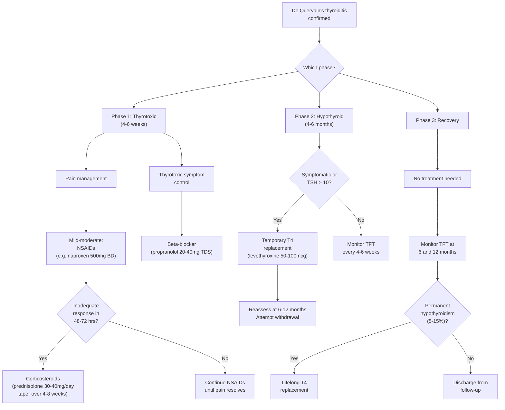

## Management of De Quervain's Thyroiditis

### 1. Overarching Principles

Before diving into specifics, understand the foundational logic that governs every management decision in de Quervain's thyroiditis:

> ***Mx: self-limiting → do NOT give antithyroid medications*** [2]

This single line from the notes captures the entire philosophy. Let me explain **why** from first principles:

1. **Self-limiting**: The granulomatous inflammation is a finite process triggered by a viral/post-viral immune response. Once the immune stimulus resolves and the follicular cells regenerate, the gland returns to normal function. Over 90% of patients recover completely within 6–12 months. Therefore, the management is **supportive, not curative** — you are managing symptoms while the disease runs its course.

2. **No antithyroid drugs**: This is the single most important management point and the most commonly tested concept. ***Do NOT give antithyroid medications*** [2]. Why?
   - Antithyroid drugs (carbimazole, methimazole, propylthiouracil) work by inhibiting **thyroid peroxidase (TPO)**, which catalyses the iodination and coupling reactions needed to **synthesise** new T3/T4
   - In de Quervain's, the thyrotoxicosis is caused by **release of pre-formed hormone** from destroyed follicles — there is **no excess synthesis** to block
   - Giving carbimazole to a patient with de Quervain's is like putting a fire extinguisher on a building that has already burned down and collapsed — the damage is done, the "fire" (hormone synthesis) is not the problem
   - Furthermore, the follicular cells are damaged and are NOT actively synthesising — there is nothing for TPO inhibitors to act on

3. **Phase-specific management**: The treatment changes depending on which phase the patient is in (thyrotoxic vs hypothyroid vs recovery), because the pathophysiology and symptoms are fundamentally different in each phase.

<Callout title="The Cardinal Rule" type="error">
***Do NOT give antithyroid medications*** [2] (carbimazole, methimazole, PTU) in de Quervain's thyroiditis. This is the most commonly tested pitfall. The thyrotoxicosis is from hormone RELEASE, not hormone SYNTHESIS. Anti-thyroid drugs block synthesis — they have no role here.
</Callout>

---

### 2. Management Algorithm

---

### 3. Treatment Modalities — Detailed Breakdown

#### 3.1 Pain and Inflammation Management

Pain is the dominant symptom in de Quervain's and often the reason the patient presents. It is caused by inflammatory destruction of thyroid follicles with capsular distension and release of inflammatory mediators (prostaglandins, IL-1, IL-6, TNF-α). Management follows a stepwise approach:

##### 3.1.1 NSAIDs (First-Line for Pain)

***NSAIDs/corticosteroids for severe cases → manage systemic upset + pain*** [2]

| Aspect | Detail |
|---|---|
| **Drug examples** | Naproxen 500 mg BD, ibuprofen 400–600 mg TDS, aspirin 600 mg QDS |
| **Mechanism** | NSAIDs inhibit **cyclooxygenase (COX-1/COX-2)** → ↓prostaglandin synthesis (PGE2, PGI2) → ↓pain, ↓fever, ↓inflammation. Prostaglandins sensitise nociceptors and cause vasodilation/oedema in the inflamed thyroid |
| **Indication** | First-line for all patients with pain and systemic symptoms. Most patients with mild-to-moderate de Quervain's respond adequately to NSAIDs alone |
| **Duration** | Typically 2–6 weeks, tapered as symptoms improve |
| **Response rate** | ~70–80% of patients achieve adequate pain relief with NSAIDs |
| **Contraindications** | Active peptic ulcer disease, severe renal impairment, aspirin-sensitive asthma, third trimester pregnancy, anticoagulant use (↑ bleeding risk). Use with caution in elderly, CVD, heart failure |
| **Monitoring** | Assess response at 48–72 hours. If inadequate → escalate to corticosteroids |

**Why NSAIDs work**: The pain in de Quervain's is fundamentally an inflammatory pain — prostaglandins produced at the site of thyroid follicular destruction sensitise nociceptors and lower the pain threshold. By blocking prostaglandin synthesis, NSAIDs address the root cause of the pain signal. They also reduce fever by blocking PGE2-mediated resetting of the hypothalamic thermostat.

##### 3.1.2 Corticosteroids (Second-Line — For Severe/Refractory Pain)

| Aspect | Detail |
|---|---|
| **Drug** | Prednisolone 30–40 mg/day PO initially |
| **Mechanism** | Corticosteroids have broad anti-inflammatory effects: (1) inhibit phospholipase A2 (via lipocortin) → ↓arachidonic acid release → ↓ALL downstream eicosanoids (prostaglandins AND leukotrienes); (2) ↓NF-κB transcription → ↓pro-inflammatory cytokine production (IL-1, IL-6, TNF-α); (3) ↓leukocyte migration and macrophage phagocytosis; (4) ↓capillary permeability → ↓oedema |
| **Indication** | ***Corticosteroids for severe cases*** [2] — specifically: (1) inadequate response to NSAIDs after 48–72 hours; (2) severe systemic symptoms (high fever, incapacitating pain); (3) recurrence of symptoms on NSAID taper |
| **Tapering regimen** | Start at 30–40 mg/day, then taper gradually over **4–8 weeks** (e.g., reduce by 5 mg every 5–7 days). Rapid tapering risks symptom rebound |
| **Response** | Dramatic — most patients experience significant pain relief within 24–48 hours of starting corticosteroids. This rapid response is actually supportive of the diagnosis (if the pain does NOT respond to steroids, reconsider the diagnosis) |
| **Relapse on tapering** | 20–30% of patients relapse when steroids are tapered too quickly. If this occurs, increase the dose back to the last effective dose and taper more slowly |
| **Side effects** | Short course: insomnia, hyperglycaemia, mood disturbance, dyspepsia. With longer courses: adrenal suppression, osteoporosis, immunosuppression, cushingoid features. Given the self-limiting nature, aim for shortest effective course |
| **Contraindications** | Uncontrolled diabetes (relative — can still use with close glucose monitoring), active infection (relative), psychosis |

**Why steroids are so effective**: Corticosteroids act at a higher level in the inflammatory cascade than NSAIDs — they suppress the entire inflammatory response, not just the prostaglandin pathway. In a granulomatous condition like de Quervain's, where macrophages and giant cells are the primary effectors, steroids are particularly effective because they directly suppress macrophage function and cytokine production. Think of NSAIDs as blocking one tributary; steroids block the entire river.

<Callout title="The Steroid Response as a Diagnostic Clue" type="idea">
A dramatic response to corticosteroids within 24–48 hours supports the diagnosis of de Quervain's thyroiditis. If the patient does NOT respond to adequate steroid doses, you should reconsider the diagnosis — think about acute suppurative thyroiditis (needs antibiotics/drainage), anaplastic carcinoma, or other causes of neck pain.
</Callout>

##### 3.1.3 Aspirin (Alternative)

Some guidelines suggest high-dose aspirin (2.4–3.6 g/day in divided doses) as an alternative to NSAIDs. The mechanism is the same (COX inhibition). In practice, naproxen or ibuprofen are preferred for better GI tolerability.

---

#### 3.2 Thyrotoxic Phase Management

***β-blocker for hyperthyroid phase (usually mild) → for symptomatic control only*** [2]

##### 3.2.1 Beta-Blockers (Symptomatic Control of Thyrotoxicosis)

| Aspect | Detail |
|---|---|
| **Drug of choice** | **Propranolol** 20–40 mg TDS (three times daily); alternatives: atenolol 25–50 mg OD, nadolol 40–80 mg OD |
| **Mechanism** | Beta-blockers antagonise β-adrenergic receptors. In thyrotoxicosis, excess T3/T4 upregulates β1-adrenergic receptor expression in the heart and peripheral tissues, amplifying the effects of circulating catecholamines. Beta-blockers directly counteract this: (1) **β1 blockade** → ↓heart rate, ↓contractility, ↓myocardial oxygen demand → alleviates palpitations and tachycardia; (2) **β2 blockade** → ↓tremor (skeletal muscle), ↓glycogenolysis. Propranolol additionally **inhibits peripheral T4 → T3 conversion** (type 1 deiodinase) at higher doses — a minor but useful bonus |
| **Why propranolol specifically** | It is **non-selective** (blocks both β1 and β2) AND crosses the blood-brain barrier → addresses both peripheral symptoms (tachycardia, tremor) and central symptoms (anxiety, agitation). It also has the T4→T3 conversion-blocking effect |
| **Indication** | Symptomatic thyrotoxicosis in Phase 1: palpitations, tremor, anxiety, heat intolerance. ***Usually mild*** [2] — the thyrotoxicosis of de Quervain's is generally less severe than Graves' because the hormone release is finite (stores are depleted within 4–6 weeks) |
| **Duration** | Only for the duration of the thyrotoxic phase (4–6 weeks). Taper and discontinue as TFT normalises |
| **Contraindications** | Asthma/severe COPD (β2 blockade → bronchospasm), decompensated heart failure, severe bradycardia, second/third-degree AV block, Raynaud's disease (peripheral vasoconstriction). In asthma: use a **cardioselective** β1-blocker (atenolol, metoprolol) with caution, or consider a rate-limiting calcium channel blocker (verapamil, diltiazem) |
| **Monitoring** | Heart rate, blood pressure, symptom resolution. Aim for resting HR < 90 bpm |

**Why NOT antithyroid drugs — revisited with pharmacology**:
- **Carbimazole** (prodrug → converted to **methimazole** in vivo) and **propylthiouracil (PTU)**: Both inhibit **thyroid peroxidase (TPO)**, the enzyme that catalyses:
  - Iodination of tyrosine residues on thyroglobulin (organification)
  - Coupling of monoiodotyrosine (MIT) and diiodotyrosine (DIT) to form T3 and T4
- PTU additionally blocks peripheral T4 → T3 conversion (type 1 deiodinase)
- In de Quervain's, follicular cells are **destroyed** and are **NOT synthesising new hormone**. TPO is not active. There is no substrate for these drugs to work on. Giving them achieves nothing except exposing the patient to side effects (agranulocytosis, hepatotoxicity, rash) for zero benefit.

---

#### 3.3 Hypothyroid Phase Management

***Temporary T4 replacement for hypothyroid phase if pronounced or symptomatic*** [2]

##### 3.3.1 Levothyroxine (Temporary T4 Replacement)

| Aspect | Detail |
|---|---|
| **Drug** | Levothyroxine (L-T4) 25–100 mcg/day PO |
| **Mechanism** | Exogenous synthetic T4 that is converted peripherally to T3 (the active hormone) by type 1 and type 2 deiodinases. Replaces the deficient endogenous thyroid hormone production during the period when follicular cells are regenerating |
| **Indication** | ***Temporary T4 replacement for hypothyroid phase if pronounced or symptomatic*** [2]. Specifically: (1) symptomatic hypothyroidism (fatigue, weight gain, cold intolerance, constipation, depression); (2) TSH > 10 mIU/L (significant biochemical hypothyroidism); (3) planning pregnancy (even mild hypothyroidism is detrimental to fetal neurodevelopment) |
| **When NOT to treat** | If the hypothyroid phase is mild and asymptomatic (borderline ↑TSH with normal fT4), observation with serial TFT monitoring every 4–6 weeks is appropriate. Many patients transit through the hypothyroid phase with minimal symptoms |
| **Duration** | Temporary — typically 6–12 months. After this period, attempt **withdrawal** by reducing the dose gradually and rechecking TFT 6–8 weeks after discontinuation |
| **Starting dose** | Start low (25–50 mcg) in elderly or those with cardiovascular disease (sudden increase in metabolic rate can provoke angina or arrhythmia in susceptible patients). Younger, otherwise healthy patients can start at 50–100 mcg |
| **Monitoring** | TFT (TSH + fT4) every 6–8 weeks after initiation or dose adjustment. Target: normalisation of TSH |
| **Key point** | This is **temporary** replacement — do NOT commit the patient to lifelong T4. Reassess at 6–12 months. Only ~5–15% will develop permanent hypothyroidism requiring lifelong replacement |

**Why only "temporary"?** The hypothyroid phase is caused by follicular cell damage depleting hormone stores and preventing new synthesis. As follicular cells regenerate (typically over 4–6 months), normal hormone production resumes. The T4 replacement is a bridge to tide the patient over this regeneration period.

<Callout title="When Temporary Becomes Permanent">
If the patient remains hypothyroid after 12 months AND has high-titre anti-TPO antibodies, suspect co-existing autoimmune thyroiditis (Hashimoto's). ***High titres suggest underlying autoimmune pathology → ↑risk of recurrence + ultimate progression to hypothyroidism*** [2]. These patients may need lifelong T4 replacement.
</Callout>

---

#### 3.4 Recovery Phase Management

***No Mx: spontaneous resolution!*** [2]

| Aspect | Detail |
|---|---|
| **Treatment** | None needed — the patient is euthyroid |
| **Monitoring** | Check TFT at 6 and 12 months to confirm sustained euthyroidism and exclude late development of permanent hypothyroidism |
| **Discharge** | If TFT is normal at 12 months and the patient is asymptomatic, they can be discharged from follow-up |
| **Counselling** | Inform the patient that recurrence is possible (but rare, ~2%) and to return if neck pain recurs. Also inform that ~5–15% may develop permanent hypothyroidism requiring lifelong T4 — hence the importance of follow-up TFT |

---

### 4. Summary: Phase-Specific Management Table

| Phase | Duration | Pathophysiology | Treatment | Key Drugs | What NOT to Do |
|---|---|---|---|---|---|
| **Phase 1: Thyrotoxic** | 4–6 weeks | Follicular destruction → release of stored T4/T3 | ***NSAIDs ± corticosteroids*** for pain [2]; ***β-blocker*** for thyrotoxic symptoms [2] | Naproxen, prednisolone, propranolol | ***Do NOT give antithyroid drugs*** [2] (carbimazole, PTU) — no excess synthesis to block |
| **Phase 2: Hypothyroid** | 4–6 months | Depleted stores + damaged follicles → ↓T4 synthesis | ***Temporary T4 replacement if symptomatic*** [2] | Levothyroxine 25–100 mcg | Do NOT commit to lifelong T4 without reassessment |
| **Phase 3: Recovery** | Resolution | Follicular regeneration → normal function | ***No Mx: spontaneous resolution*** [2] | None | Do NOT stop follow-up prematurely (5–15% → permanent hypothyroidism) |

---

### 5. Special Scenarios

#### 5.1 Recurrent De Quervain's Thyroiditis

- Rare (~2% recurrence rate)
- Manage the same way as the initial episode (NSAIDs → steroids → β-blocker → T4 if needed)
- Check thyroid antibodies: high-titre anti-TPO suggests evolution towards autoimmune thyroid disease → higher risk of eventual permanent hypothyroidism
- Consider checking **HLA-B35** (if not previously done) to confirm genetic predisposition

#### 5.2 Pregnancy

- De Quervain's is rare in pregnancy (postpartum thyroiditis is far more common)
- **NSAIDs**: generally avoided in pregnancy, especially in the third trimester (risk of premature ductus arteriosus closure, oligohydramnios)
- **Corticosteroids**: prednisolone is relatively safe in pregnancy (metabolised by placental 11β-HSD2, limiting fetal exposure); use if pain is severe
- **Beta-blockers**: propranolol can be used but with monitoring for fetal bradycardia and IUGR; use lowest effective dose
- **Levothyroxine**: safe and essential if hypothyroid phase occurs during pregnancy (hypothyroidism is teratogenic and impairs fetal neurodevelopment)

#### 5.3 Elderly / Cardiovascular Disease

- **Beta-blockers**: use with caution — start low, monitor for bradycardia and hypotension. Atenolol (cardioselective) may be preferred over propranolol
- **Levothyroxine**: start at lower dose (25 mcg) and titrate slowly — sudden increase in metabolic rate can unmask or exacerbate angina, arrhythmia, or heart failure
- **NSAIDs**: use cautiously — risk of GI bleeding (especially if on anticoagulants), renal impairment, fluid retention exacerbating heart failure. Consider co-prescription of PPI for gastroprotection

#### 5.4 When to Consider Referral

- **Diagnostic uncertainty**: atypical presentation, no response to steroids, suspected malignancy
- **Severe/prolonged course**: symptoms lasting > 6 months, multiple relapses
- **Permanent hypothyroidism**: confirmed at 12 months — refer for endocrine follow-up and long-term T4 management
- **Thyroid storm**: exceedingly rare in de Quervain's (because the hormone release is self-limited), but if severe thyrotoxicosis with tachycardia > 140, fever, confusion → manage as thyroid storm (emergency: beta-blocker + steroids + supportive care)

---

### 6. Monitoring and Follow-Up Protocol

| Time Point | Action | Purpose |
|---|---|---|
| **At diagnosis** | TFT, ESR, CRP, TRAb, anti-TPO/Tg, USG thyroid | Confirm diagnosis, establish baseline, exclude DDx |
| **Every 2–4 weeks during active disease** | TFT, ESR | Monitor phase transition (thyrotoxic → hypothyroid), assess treatment response, guide medication adjustments |
| **At 6 weeks** | Reassess TFT | Expected transition from thyrotoxic to hypothyroid or euthyroid. Discontinue β-blocker if TSH normalising. Consider T4 if hypothyroid |
| **At 3–6 months** | TFT | Assess hypothyroid phase. Titrate T4 if on replacement |
| **At 6–12 months** | TFT, attempt T4 withdrawal | Assess recovery. Reduce T4 dose → check TFT 6–8 weeks later. If TSH normal off T4 → recovery confirmed |
| **At 12 months** | Final TFT | Confirm sustained euthyroidism. If still hypothyroid → likely permanent → lifelong T4 |

---

<Callout title="High Yield Summary">

**Management of De Quervain's Thyroiditis — Key Points:**

1. **Self-limiting** — the disease resolves spontaneously in > 90% of patients within 6–12 months
2. ***Do NOT give antithyroid medications*** [2] — the thyrotoxicosis is from hormone RELEASE, not synthesis; TPO inhibitors have no target
3. **Pain management**: NSAIDs first-line → corticosteroids (prednisolone 30–40 mg, taper over 4–8 weeks) if refractory or severe
4. **Thyrotoxic symptoms**: ***β-blocker (propranolol) for symptomatic control only*** [2] — usually mild and self-limited (4–6 weeks)
5. **Hypothyroid phase**: ***Temporary T4 replacement if pronounced or symptomatic*** [2] — reassess at 6–12 months; attempt withdrawal
6. **Recovery**: ***Spontaneous resolution*** [2] — monitor TFT at 6 and 12 months; 5–15% develop permanent hypothyroidism
7. ***High-titre autoantibodies suggest underlying autoimmune pathology → ↑risk of permanent hypothyroidism*** [2]
8. **Dramatic response to steroids** is diagnostically supportive; lack of response should prompt re-evaluation

</Callout>

---

<ActiveRecallQuiz
  title="Active Recall - Management of De Quervain's Thyroiditis"
  items={[
    {
      question: "Why are antithyroid drugs such as carbimazole and propylthiouracil contraindicated in de Quervain's thyroiditis? Explain the pharmacological rationale.",
      markscheme: "Antithyroid drugs inhibit thyroid peroxidase (TPO), which catalyses iodination and coupling reactions for new T3/T4 synthesis. In de Quervain's, the thyrotoxicosis results from release of pre-formed thyroid hormone from destroyed follicles, not from excess new synthesis. The follicular cells are damaged and TPO is not active. Therefore, these drugs have no therapeutic target and only expose the patient to side effects (agranulocytosis, hepatotoxicity).",
    },
    {
      question: "Outline the stepwise pain management approach in de Quervain's thyroiditis, including when to escalate.",
      markscheme: "Step 1: NSAIDs (e.g. naproxen 500mg BD) as first-line for mild-moderate pain. Assess response at 48-72 hours. Step 2: If inadequate response to NSAIDs, escalate to corticosteroids (prednisolone 30-40mg/day, tapered over 4-8 weeks). Steroid response is dramatic (within 24-48 hours). If no response to steroids, reconsider the diagnosis.",
    },
    {
      question: "A patient is in the hypothyroid phase of de Quervain's thyroiditis with TSH of 15 mIU/L and symptomatic fatigue. What is the management and for how long?",
      markscheme: "Start temporary levothyroxine replacement (50-100 mcg/day, lower dose in elderly/CVD). Monitor TFT every 6-8 weeks. Attempt withdrawal at 6-12 months by reducing dose and rechecking TFT 6-8 weeks after discontinuation. Most patients recover; only 5-15% develop permanent hypothyroidism requiring lifelong replacement.",
    },
    {
      question: "Why is propranolol preferred over atenolol as the beta-blocker for thyrotoxic symptoms in de Quervain's thyroiditis?",
      markscheme: "Propranolol is non-selective (blocks beta-1 and beta-2 receptors), addressing both cardiac symptoms (tachycardia via beta-1) and peripheral symptoms (tremor via beta-2). It crosses the blood-brain barrier to address central symptoms (anxiety). It additionally inhibits peripheral T4 to T3 conversion (type 1 deiodinase) at higher doses. Atenolol is cardioselective (beta-1 only) and does not block T4-to-T3 conversion.",
    },
    {
      question: "What finding on follow-up at 12 months suggests the patient has progressed to permanent hypothyroidism, and what is the management?",
      markscheme: "Persistently elevated TSH with low fT4 at 12 months despite attempted levothyroxine withdrawal, especially in the presence of high-titre anti-TPO antibodies suggesting co-existing autoimmune thyroiditis. Management: lifelong levothyroxine replacement with annual TFT monitoring.",
    },
  ]}
/>

## References

[2] Senior notes: Ryan Ho Endocrine.pdf (Section 1.5.1 Subacute Thyroiditis — Management, p.31)
