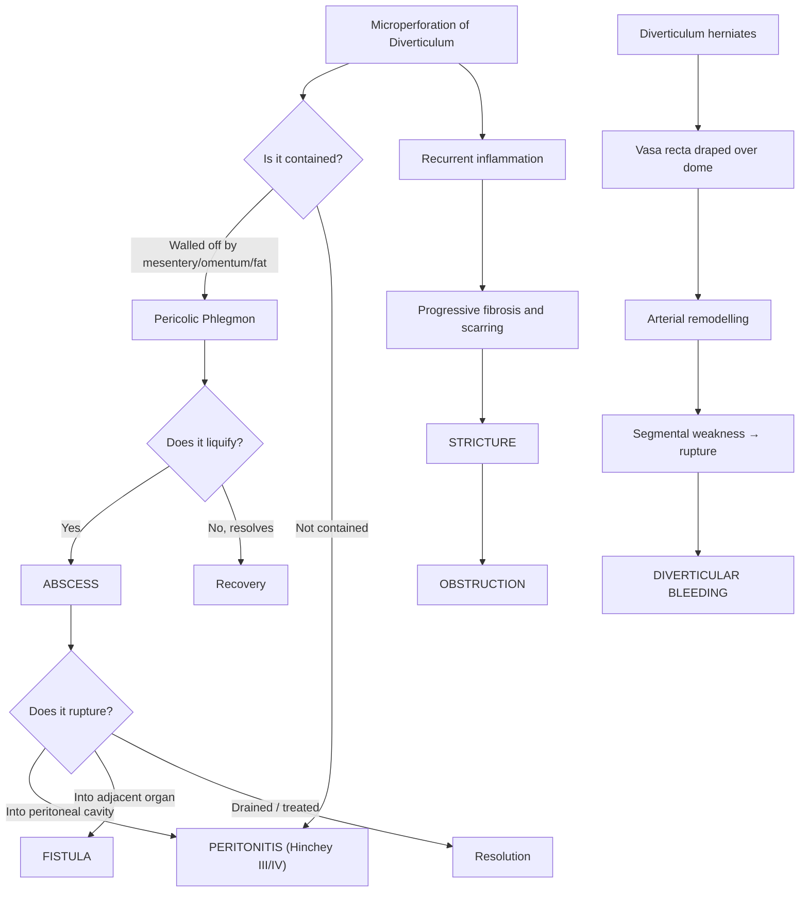

## Complications of Diverticular Disease

Understanding complications requires thinking about **what happens when a microperforation in the colon wall goes wrong** in different ways. Every complication traces back to the same fundamental event — a **faecolith obstructs a diverticulum → bacterial overgrowth → mucosal erosion → microperforation** — but the downstream consequences differ based on whether the perforation is walled off, tracks to an adjacent organ, causes luminal compromise, or ruptures freely into the peritoneum.

---

### 1. Abscess

#### Incidence and Pathophysiology

- **Occurs in ~17% of patients with acute diverticulitis** [3]
- When a diverticulum microperforates, the body's initial response is to **wall off** the contamination. The pericolic mesentery, omentum, and fat wrap around the perforation site → creating a **phlegmon** (inflamed mass) [3]
- If the bacterial load overwhelms local defences, the phlegmon **liquefies** at its centre → a walled-off collection of pus forms = **abscess**
- The abscess may remain **localised** (pericolic, Hinchey I) or **track** to distant sites:
  - **Pelvic abscess** (Hinchey II) — pus gravitates into the pelvis (the most dependent peritoneal space)
  - **Psoas abscess** — pus tracks along the psoas muscle retroperitoneally (the sigmoid colon lies directly anterior to the left psoas)
  - ***Pyogenic liver abscess*** — spread of infection through the **portal circulation** (mesenteric veins drain to the portal vein → liver) [3]. This is a rare but serious complication

#### Clinical Features

- ***Should be suspected in patients with no improvement in abdominal pain or a persistent fever despite 3 days of antibiotic treatment*** [3]
- Swinging pyrexia (temperature spikes with intermittent defervescence — classic pattern of undrained abscess)
- ***Persistent fever and abdominal pain despite antibiotics ± tender mass on PR*** (pelvic abscess palpable on digital rectal examination) [4]
- Rising WCC and CRP despite treatment
- May present as a palpable tender abdominal mass (phlegmon or large abscess)

#### Why 3 Days? 

This is a practical clinical rule. Appropriately treated uncomplicated diverticulitis should show **clinical improvement within 48–72 hours** of IV antibiotics (trending down of fever, reducing pain, falling WCC). If there is **no improvement by day 3**, the antibiotic is either not penetrating the source (suggesting a walled-off collection that needs drainage) or there is a more serious complication.

#### Investigation

- ***CT abdomen + pelvis with IV contrast*** — demonstrates abscess as a **fluid collection with surrounding inflammatory changes** containing air, air-fluid levels, or low-attenuation necrotic debris [3][4]
- ***Abscess size 5 cm is the cut-off***: < 5 cm likely resolves with antibiotics alone; ≥ 5 cm requires ***CT-guided percutaneous drainage*** [4]

#### Management

| Abscess Size / Response | Management |
|---|---|
| Small ( < 5 cm) | IV antibiotics alone — high likelihood of resolution |
| Large ( ≥ 5 cm) | ***CT-guided percutaneous drainage*** + IV antibiotics [4][5] |
| Failed drainage / persistent sepsis | ***Emergency surgery*** — resection (Hartmann's or primary anastomosis + defunctioning stoma) [3][5] |

---

### 2. Fistula

#### Pathophysiology

- **Inflammation from diverticulitis causes the inflamed sigmoid colon to adhere to an adjacent organ** (bladder, vagina, small bowel, skin, uterus)
- The inflammatory process **erodes through both the colonic wall and the wall of the adjacent organ** → creating an **abnormal communication** (fistula = Latin *fistula* = "pipe" or "tube")
- Fistulae typically develop from a **contained microperforation or small abscess** that decompresses into the neighbouring structure rather than freely into the peritoneum

#### Types of Fistula (Ranked by Frequency)

| Type | Frequency | Why? | Clinical Features |
|---|---|---|---|
| ***Colovesical fistula*** | **Most common** [3][4] | The sigmoid colon lies **directly on the dome of the bladder** — anatomical proximity. More common in **males** because in females the uterus interposes between sigmoid and bladder | ***Recurrent dysuria, pneumaturia*** (air bubbles in urine — pathognomonic), ***faecaluria*** (faecal particles in urine), recurrent polymicrobial UTIs [4]. Urine culture grows **colonic flora** (e.g., *E. coli*, *Bacteroides*) — essentially diagnostic [3] |
| ***Colovaginal fistula*** | Second most common [3] | ***Especially in post-hysterectomy patients*** — removal of the uterus eliminates the anatomical barrier between sigmoid and vagina [3] | **Vaginal passage of faeces and flatus**, foul-smelling vaginal discharge, recurrent vaginal infections |
| **Coloenteric fistula** | Uncommon [3] | Inflamed sigmoid adheres to adjacent small bowel loop | ***May be entirely asymptomatic or result in corrosive diarrhoea*** [3] — small bowel contents are diverted, and colonic bacteria contaminate the small bowel (bacterial overgrowth → malabsorption → diarrhoea) |
| **Colocutaneous fistula** | Uncommon [3] | Abscess tracks through the abdominal wall to the skin surface | ***Usually easy to identify*** — visible external opening with faecal discharge [3] |

#### Investigation

- **CT colonography with water-soluble rectal contrast** — contrast injected rectally is seen tracking into the bladder/vagina/skin [4]
- **Cystoscopy** — for colovesical fistula: may show bullous oedema, erythema, or the fistula opening on the bladder dome
- **Urine culture** — growth of mixed colonic flora (multiple Gram-negatives + anaerobes) is essentially pathognomonic for colovesical fistula [3]
- **Contrast enema** — can delineate the fistula tract [3]

#### Management [3][4]

The management principle is: **control sepsis first → then definitive surgical repair**

1. **Control sepsis**: IV antibiotics + drainage of any associated abscess
2. **Definitive surgery** (usually elective):
   - ***Resection of the affected segment of colon*** involved with diverticulitis, usually with a **primary anastomosis** [3]
   - ***Simple repair of the secondarily involved organ*** — e.g., primary closure of bladder or vagina (may require flap depending on complexity) [3]
   - ***Colovesical fistula: resection of affected colon + omental pedicle interposition between bowel and bladder*** (to prevent recurrent fistulation) ***+ synchronous repair of bladder*** [4]

> ***Fistula is usually managed at the index operation with resection of the affected segment of colon*** [3]

<Callout title="Omental Pedicle Interposition — Why?">
After resecting the fistula-bearing colon and repairing the bladder, you place a **pedicled flap of omentum** between the bowel anastomosis and the bladder repair. The omentum is highly vascularised and has excellent healing properties — it physically separates the two suture lines and reduces the risk of the fistula recurring. The omentum is sometimes called the "policeman of the abdomen" because it migrates to sites of inflammation and promotes healing.
</Callout>

---

### 3. Obstruction

#### Pathophysiology

There are **three distinct mechanisms** by which diverticular disease causes intestinal obstruction [3]:

| Mechanism | Type | Pathophysiology |
|---|---|---|
| **Acute pericolonic inflammation/oedema** | **Partial LBO** (acute) | Active diverticulitis causes significant pericolic inflammation → the bowel wall becomes oedematous and thickened → **relative luminal narrowing**. Alternatively, a large pericolic abscess may externally **compress** the lumen [3] |
| **Chronic fibrosis and stricture** | **Complete LBO** (chronic) | ***Recurrent attacks of acute diverticulitis result in progressive fibrosis and scarring leading to formation of intestinal strictures*** [3]. Each episode deposits more collagen → progressive narrowing → eventually complete obstruction |
| **Adhesions to inflamed bowel** | **SBO** | Inflamed sigmoid colon causes adjacent small bowel loops to adhere to it → kinking or compression of the small bowel → SBO [4] |
| **Paralytic ileus** | **Functional obstruction** | Localised peritoneal irritation from pericolic inflammation → reflex sympathetic inhibition of peristalsis → functional obstruction without mechanical cause [3] |

> ***Intestinal obstruction: LBO due to fibrosis and stricture, SBO due to adhesion to inflamed bowel*** [4]

#### Clinical Features

- **Cardinal features of intestinal obstruction** (the "4 C's" — colicky pain, constipation, vomiting, and distension):
  - **Colicky abdominal pain** — intermittent cramping as the bowel contracts against the obstruction
  - **Abdominal distension** — proximal bowel dilates with gas and fluid
  - **Vomiting** — initially bilious, late becomes **faeculent** in LBO
  - **Absolute constipation** (obstipation) — no passage of flatus or stool
- **Bowel sounds**: hyperactive/tinkling (mechanical obstruction) → later absent (ileus or late obstruction with bowel fatigue)

#### Investigation

- **AXR**: dilated bowel loops with air-fluid levels; in LBO look for dilated colon with no gas in the rectum [4]
- **CT abdomen**: identifies the transition point, distinguishes mechanical obstruction from pseudo-obstruction, evaluates for ischaemia

#### Management

- **Acute partial obstruction** (from inflammation): usually resolves with **conservative management** (bowel rest, IV fluids, NG decompression, IV antibiotics to treat underlying diverticulitis)
- **Complete obstruction from stricture**: may require **endoscopic stenting as a bridge to surgery** or direct surgical resection
- **Emergency**: Hartmann's procedure if acute complete LBO with ischaemia/perforation signs
- **Elective**: sigmoid colectomy with primary anastomosis after resolution of acute episode — remove the strictured segment

---

### 4. Perforation and Peritonitis

#### Pathophysiology

Two mechanisms of free perforation [3]:

1. ***Rupture of a diverticular abscess into the peritoneal cavity*** → the walled-off collection bursts → purulent peritonitis (**Hinchey III**)
2. ***Rupture of an inflamed diverticulum with faecal contamination of the peritoneum*** → faecal peritonitis (**Hinchey IV**) — this is the most catastrophic outcome

> ***Leads to generalised purulent or faecal peritonitis*** [3]

#### Clinical Features

***Severity ranges from diverticulitis to localised diverticular abscess to purulent peritonitis to faecal peritonitis*** [5]

| Feature | Pathophysiological Basis |
|---|---|
| **Sudden severe abdominal pain** | Peritoneal soiling → intense irritation of the parietal peritoneum → somatic pain (sharp, well-localised initially, then generalised) |
| ***Fever, tenderness and guarding*** [2] | Systemic inflammatory response to intraperitoneal contamination; reflex abdominal wall muscle contraction (guarding) to protect the inflamed peritoneum |
| **Board-like rigidity** | Severe generalised peritonitis → diffuse reflex contraction of all abdominal wall muscles → the abdomen becomes "hard as a board" |
| **Rebound tenderness** | Sudden release of pressure stretches the inflamed parietal peritoneum → sharp pain |
| **Absent bowel sounds** | Generalised peritoneal inflammation → complete cessation of peristalsis (generalised paralytic ileus) |
| ***Septic shock: high fever, tachycardia, hypotension, oliguria*** [5] | Massive systemic inflammatory response → vasodilation (↓SVR), capillary leak, third-spacing → distributive shock → impaired organ perfusion (oliguria = acute kidney injury, altered mental state = cerebral hypoperfusion) |
| **Pneumoperitoneum on CXR** | Free intraperitoneal air from bowel perforation |

#### Mortality — Hinchey Classification

| ***Hinchey Stage*** | ***Type of Peritonitis*** | ***Mortality*** |
|---|---|---|
| ***III*** | ***Generalised purulent peritonitis*** (ruptured abscess, bowel wall intact) | ***25%*** [4] |
| ***IV*** | ***Generalised faecal peritonitis*** (bowel wall perforation) | ***50%*** [4] |

#### Management

> ***Resuscitation with IVF + antibiotics. Percutaneous drainage for abscess. Consider emergency surgery*** [5]

> ***Unresponsive to antibiotics, septic shock, generalised peritonitis (III and IV) → emergency surgery*** [5]

- **Resuscitation**: IV access, crystalloid fluid boluses, broad-spectrum IV antibiotics (piperacillin-tazobactam or metronidazole + cephalosporin), oxygen, urinary catheter, arterial line/central venous access if shocked
- **Emergency surgery**: ***Hartmann's procedure*** (resection + end colostomy + rectal stump closure) is the standard for Hinchey III–IV [4][5]. Primary anastomosis is contraindicated in the setting of diffuse contamination and inflammation due to high risk of anastomotic leak [4]
- **On-table peritoneal lavage**: copious warm saline irrigation of the peritoneal cavity to reduce bacterial load

---

### 5. Diverticular Bleeding

#### Pathophysiology (Recap)

- When a diverticulum herniates, the **vasa recta is draped over the dome** → blood vessel is separated from the bowel lumen only by mucosa → **eccentric intimal thickening and medial thinning** → segmental arterial weakness → **rupture into bowel lumen** [3]
- ***Right colon is usually the source*** because right-sided diverticula have wider necks/domes and the colonic wall is thinner → more vasa recta length exposed to injury [3]
- Bleeding occurs in the **ABSENCE of diverticulitis** — the two processes are separate (inflammation causes fibrosis of vasa recta, which paradoxically protects against bleeding) [3]

#### Clinical Features

- ***Common cause of severe GI bleeding*** [1]
- ***Intermittent bleeding*** [1]
- ***Painless massive PR bleeding*** — haematochezia (bright red to maroon blood per rectum)
- ***80% self-limiting*** [1] — arterial spasm and clot formation at the rupture site
- ***Rebleeding rate ~20–30%*** [7]
- Can cause haemodynamic instability if blood loss is massive (tachycardia, hypotension, pallor, altered consciousness)

#### Management

***Conservative → Endoscopic haemostasis → Angiogram ± embolisation*** [1][5]

- **Resuscitation**: IV access, crystalloids, blood transfusion, correct coagulopathy
- ***50% of bleeding stops spontaneously*** [4] → conservative observation with ongoing monitoring
- ***Colonoscopy***: endoscopic haemostasis with **adrenaline injection + metallic clips** [3][4][5]
- ***Mesenteric angiography ± embolisation***: when colonoscopy fails [3]
- **On-table lavage + intraoperative colonoscopy**: when angiography fails
- ***Subtotal colectomy + ileostomy***: last resort when the bleeding source cannot be identified [4]

#### Indications for Emergency Surgery in Diverticular Bleeding [3]

| Indication | Rationale |
|---|---|
| Haemodynamically unstable despite adequate resuscitation | Ongoing arterial haemorrhage exceeding compensatory capacity |
| Excessive blood transfusion > 6 units | Massive transfusion carries its own risks (hypothermia, coagulopathy, hyperkalaemia) |
| Frequent rebleeding or persistent bleeding | Endoscopic/angiographic measures have failed |

---

### 6. Complications of Surgical Treatment

When patients undergo surgery for diverticular disease (whether emergency Hartmann's or elective sigmoid colectomy), they face procedure-specific complications:

#### A. Anastomotic Complications (If Primary Anastomosis Performed)

| Complication | Timing | Features | Management |
|---|---|---|---|
| **Anastomotic bleeding** | Early ( < 30 days) | PR bleeding, dropping Hb | Blood transfusion, correct coagulopathy; rarely requires re-operation |
| **Anastomotic leak** | Early ( < 30 days, typically day 5–7) | **Suspect if any deviation from normal post-op course**: pain, fever, tachycardia, prolonged ileus, feculent/purulent drainage [4] | Fluid resuscitation, broad-spectrum IV antibiotics, NPO. Minor leak: CT-guided percutaneous drainage. Major leak: re-laparotomy → takedown of anastomosis + proximal diversion stoma [4] |
| **Anastomotic stricture** | Late ( > 30 days) | Progressive narrowing → constipation, obstructive symptoms | Majority do not require intervention. If symptomatic: endoscopic balloon dilatation [3] |

> ***Inadequate distal margin is the MC cause of recurrent diverticulitis after resection*** [4] — if you leave any sigmoid colon behind (rather than anastomosing to the upper rectum), the residual high-pressure sigmoid will develop recurrent diverticulitis

#### B. Stoma Complications (If Hartmann's or Defunctioning Stoma)

| Timing | Complication | Mechanism |
|---|---|---|
| **Early ( < 30 days)** | **Stomal bleeding** | Mucocutaneous junction trauma or mesenteric vessel injury |
| | **Stomal necrosis** | Ischaemia of the exteriorised bowel from inadequate blood supply or excessive tension on the mesentery |
| | **Stomal retraction** | Tension on the mesentery pulls the stoma below skin level → poor appliance fitting → faecal leak and skin excoriation |
| | **Mucocutaneous separation** | Separation of the bowel from the surrounding skin sutures → peristomal wound |
| | **Skin irritation/dermatitis** | Effluent contact dermatitis — worse with ileostomy (high-output, alkaline enzymatic effluent) than colostomy |
| **Late ( > 30 days)** | **Parastomal hernia** | Weakness of the abdominal wall around the stoma site → peritoneal sac + bowel herniates through the defect. Risk factors: end stoma, emergency surgery, obesity |
| | **Stomal prolapse** | Intussusception of bowel through the stoma → visible protrusion. MC in loop transverse colostomy. Risk of ischaemia/necrosis |
| | **Stomal stenosis** | Scarring and fibrosis at the mucocutaneous junction → narrowing of the stoma opening → obstructive symptoms |

#### C. Hartmann's Procedure-Specific Complications [4]

| Complication | Explanation |
|---|---|
| **Rectal stump leak** | The oversewn rectal stump may dehisce → pelvic abscess/sepsis. This is why some surgeons bring the distal end out as a **mucous fistula** rather than closing it intra-abdominally (particularly if the tissues are severely inflamed) |
| **Rectal stump abscess** | Infected haematoma or seroma at the closed rectal stump |
| **Ureteric injury** | The left ureter runs very close to the sigmoid colon mesentery → at risk during dissection, especially in emergency surgery with distorted anatomy |
| **Non-reversal** | Up to **30–40% of Hartmann's procedures are never reversed** — due to patient comorbidities, adhesions, or patient preference. The patient lives with a permanent end colostomy |

---

### 7. Segmental Colitis Associated with Diverticula (SCAD)

While not strictly a "complication" of diverticulitis, SCAD is an important entity that can complicate the clinical picture:

- **Pathophysiology**: Chronic mucosal inflammation in the **interdiverticular mucosa** (between diverticula) — the diverticular orifices themselves are spared
- **Why it occurs**: Likely related to mucosal prolapse, altered microbiome, and chronic low-grade inflammation in diverticular segments; possibly a form of localised IBD
- **Clinical features**: Chronic bloody diarrhoea, LLQ pain — can mimic IBD
- **Diagnosis**: Colonoscopy with biopsy shows mucosal inflammation between diverticula with sparing of diverticular orifices
- **Management**: 5-ASA (mesalazine) ± topical steroids; rarely requires surgery. Usually self-limiting

---

### 8. Long-Term Complications and Prognosis

| Outcome | Data |
|---|---|
| ***Recurrence after initial medical treatment*** | ***85% do NOT recur*** [5] |
| ***Recurrence rate*** | ***10–30% in the first decade after initial attack*** [5] |
| ***Outcomes of > 2 episodes*** | ***Not worse*** than single episode [5] — this is why the "2-strike rule" for surgery is obsolete |
| **Risk of complicated disease on recurrence** | Patients who present with uncomplicated diverticulitis on their first episode tend to present with uncomplicated disease on recurrence (the disease pattern is established early) |
| **Mortality by Hinchey stage** | I = 0%, II = 5%, III = 25%, IV = 50% [4] |

---

### Summary Table: Complications at a Glance

| Complication | Incidence / Frequency | Key Clinical Clue | Key Investigation | Management |
|---|---|---|---|---|
| **Abscess** | ~17% of acute diverticulitis | Persistent fever/pain despite 3 days antibiotics; tender mass on PR | CT: fluid collection with inflammatory surround | IV Abx ± CT-guided drainage; surgery if fails |
| **Fistula (MC: colovesical)** | Most common in males | Pneumaturia, faecaluria, recurrent UTI | CT colonography; urine culture (colonic flora) | Elective resection + repair of secondary organ + omental interposition |
| **Obstruction** | Variable | Colicky pain, distension, vomiting, constipation | CT: transition point, dilated proximal bowel | Conservative if acute/partial; surgery if complete or chronic stricture |
| **Perforation / Peritonitis** | Hinchey III–IV | Acute abdomen, rigidity, absent bowel sounds, septic shock | CXR: pneumoperitoneum; CT: free air/fluid | Emergency surgery (Hartmann's) |
| **Diverticular Bleeding** | ~15–55% of LGIB | Painless massive PR bleed, 80% self-limiting | Colonoscopy, angiography, Tc-RBC scan | Conservative → endoscopic → angiographic → surgical |
| **Recurrence** | 10–30% in first decade | Recurrent LLQ/RLQ pain with fever | CT | Same as initial episode; surgery only for complicated disease |

---

<Callout title="High Yield Summary">

**Abscess** (17% of diverticulitis): suspect if no improvement after 3 days antibiotics. May cause pyogenic liver abscess via portal circulation. CT-guided drainage if ≥ 5 cm.

**Fistula**: MC = colovesical (pneumaturia, faecaluria, recurrent UTI) — more common in males. Colovaginal is second (especially post-hysterectomy). Management: resection of affected colon + repair of secondary organ + omental pedicle interposition.

**Obstruction**: LBO from chronic fibrotic stricture (recurrent diverticulitis → progressive fibrosis); SBO from adhesion to inflamed bowel; paralytic ileus from peritoneal irritation.

**Perforation/Peritonitis**: Hinchey III (purulent, abscess rupture, bowel intact) = 25% mortality; Hinchey IV (faecal, bowel wall perforation) = 50% mortality. Emergency Hartmann's procedure.

**Diverticular bleeding**: commonest cause of severe LGIB. Painless, arterial (vasa recta rupture), 80% self-limiting. Right colon is the usual source. Stepwise: conservative → colonoscopy → angiography → surgery.

**Recurrence**: 85% do not recur after initial medical treatment. 10–30% recurrence in the first decade. Outcomes after > 2 episodes are NOT worse — the "2-strike rule" is dead.

**Inadequate distal resection margin is the MC cause of recurrent diverticulitis after surgery** — always resect to the upper rectum.

**Surgical complications**: anastomotic leak (day 5–7, suspect if any post-op deviation), stoma complications (early: necrosis, retraction; late: parastomal hernia, prolapse), Hartmann's-specific (rectal stump leak, ureteric injury, 30–40% non-reversal rate).
</Callout>

---

<ActiveRecallQuiz
  title="Active Recall - Complications of Diverticular Disease"
  items={[
    {
      question: "A patient with acute diverticulitis has persistent fever and abdominal pain despite 3 days of IV antibiotics. What complication should you suspect, and what is your next step?",
      markscheme: "Suspect diverticular abscess (occurs in 17% of acute diverticulitis). Next step: CT abdomen and pelvis with IV contrast to confirm abscess and assess size. If abscess is 5 cm or larger, proceed to CT-guided percutaneous drainage. If less than 5 cm, may resolve with antibiotics alone. If drainage fails, proceed to emergency surgery."
    },
    {
      question: "Explain why colovesical fistula is the most common type of fistula in diverticular disease, and why it is more common in males than females.",
      markscheme: "The sigmoid colon lies directly on the dome of the bladder, so inflammatory erosion most commonly tracks into the bladder. It is more common in males because in females, the uterus interposes between the sigmoid colon and bladder, acting as an anatomical barrier. Colovaginal fistula becomes the more common fistula in post-hysterectomy females because the uterine barrier has been removed."
    },
    {
      question: "Describe the two mechanisms by which diverticular disease causes free perforation and peritonitis, and state the corresponding Hinchey stages.",
      markscheme: "1. Rupture of a diverticular abscess into the peritoneal cavity, releasing purulent material (Hinchey III, 25% mortality). 2. Rupture of an inflamed diverticulum with direct faecal contamination of the peritoneum (Hinchey IV, 50% mortality). Hinchey III: bowel wall is intact but abscess has burst. Hinchey IV: bowel wall has perforated."
    },
    {
      question: "Why does diverticular bleeding typically occur in the absence of diverticulitis, and why is the right colon usually the source?",
      markscheme: "Bleeding is caused by rupture of vasa recta draped over the diverticular dome (arterial remodelling). In diverticulitis, inflammation causes fibrosis and obliteration of vasa recta, paradoxically protecting against bleeding. Right colon is the usual source because right-sided colon has thinner walls and right-sided diverticula have wider necks and domes, exposing a greater length of vasa recta to luminal injury."
    },
    {
      question: "List the three mechanisms by which diverticular disease causes intestinal obstruction, and classify each as LBO or SBO.",
      markscheme: "1. Acute pericolonic inflammation or oedema causing relative luminal narrowing or external compression by abscess (partial LBO, acute). 2. Recurrent diverticulitis causing progressive fibrosis and stricture formation (complete LBO, chronic). 3. Small bowel adhesion to inflamed sigmoid colon causing kinking or compression (SBO). Also: paralytic ileus from peritoneal irritation (functional, not mechanical)."
    },
    {
      question: "What is the most common cause of recurrent diverticulitis after surgical resection, and how is it prevented?",
      markscheme: "Inadequate distal resection margin. If any sigmoid colon is left behind, the residual high-pressure sigmoid will develop recurrent diverticulitis. Prevention: the distal resection margin must extend to the upper third of the rectum, as the rectum is never affected by diverticular disease (taeniae coli have fused, providing complete longitudinal muscle coverage)."
    }
  ]}
/>

## References

[1] Lecture slides: Diverticular diseases - Dr. J Tsang.pdf (p8, p13)
[2] Lecture slides: GC 195. Lower and diffuse abdominal pain RLQ problems; pelvic inflammatory disease; peritonitis and abdominal emergencies.pdf (p19)
[3] Senior notes: felixlai.md (Diverticular disease section — Complications, Treatment)
[4] Senior notes: maxim.md (Diverticular disease section — Investigations, Management, Hartmann's operation)
[5] Lecture slides: Diverticular diseases - Dr. J Tsang.pdf (p13, p16)
[7] Lecture slides: GC 186. Lower and diffuse abdominal painfresh blood in stool.pdf (p9)
