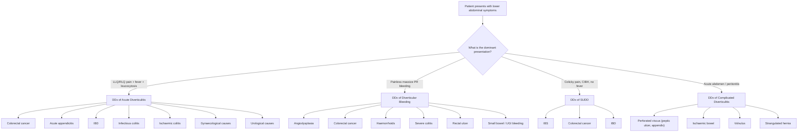

## Differential Diagnosis of Diverticular Disease

The differential diagnosis of diverticular disease depends entirely on **which presentation** you're dealing with. An elderly man with painless massive PR bleeding has a completely different DDx list from a middle-aged woman with LLQ pain and fever. So let's break this down by clinical scenario — the way you'd actually think on a ward round.

---

### Approach to the Differential Diagnosis

The key principle: **diverticular disease is a mimic**. It can look like cancer, appendicitis, IBD, or ischaemic colitis depending on the presentation. Your job is to systematically exclude dangerous diagnoses (especially ***colorectal cancer***) before settling on diverticular disease as the answer.

---

### A. Differential Diagnosis of Acute Diverticulitis

This is the scenario of **lower abdominal pain + fever + leucocytosis** — the classic triad [3][4]. The DDx here is essentially "what else causes localised lower abdominal pain with inflammation?"

#### 1. ***Colorectal Cancer (CRC)*** — The Most Important DDx [3]

- **Why it's confusable**: CRC and diverticulitis share remarkably similar features:
  - Both cause **bowel wall thickening** on CT
  - Both can present with change in bowel habit, abdominal pain, and even obstruction
  - Both are diseases of the same age group (> 50 years)
- **How to distinguish on CT**:
  - Diverticulitis: pericolonic and mesenteric fat stranding/inflammation, involvement of **> 10 cm** of colon, **absence of enlarged pericolonic lymph nodes**, visible diverticula in surrounding segments [3]
  - CRC: shorter segment of wall thickening (typically < 10 cm), "shouldering" sign (abrupt transition), pericolonic lymphadenopathy, luminal irregularity/mass
- **Critical point**: ***CRC can only be excluded with colonoscopy after resolution of acute inflammation*** — standard practice is **colonoscopy at 6–8 weeks** post-recovery [3][5]

> ***"Rule out malignancy" — colonoscopy at 6–8 weeks after acute diverticulitis is mandatory*** [5]

<Callout title="CRC vs Diverticulitis — The Exam Trap" type="error">
Never diagnose "diverticulitis" and leave it at that. Up to 1–2% of patients diagnosed with acute diverticulitis on CT are subsequently found to have CRC on follow-up colonoscopy. The two conditions can even coexist. **Always follow up with colonoscopy.**
</Callout>

#### 2. ***Acute Appendicitis*** [2][3][4]

- **Why it's confusable**: Both cause RLQ pain + fever + leucocytosis. This is especially problematic in **Asian populations where right-sided (caecal) diverticulitis** is common [1][4]
- **How to distinguish**:
  - Appendicitis: pain classically starts **periumbilical** (visceral afferent T10) then **migrates to RLQ** (somatic, parietal peritoneum) over 12–24 hours; anorexia is prominent; younger age group (MC 5–12 years) [4]
  - Right-sided diverticulitis: pain is **localised to RLQ from the outset** (no migration); older age group; CT shows colonic wall thickening with diverticula, NOT a distended appendix
  - ***CT scan is the key investigation*** to differentiate — it shows either a dilated inflamed appendix (appendicitis) or colonic wall thickening with pericolic fat stranding around a diverticulum (diverticulitis) [1][3]

> ***Caecal diverticulitis mimicking appendicitis — Role of CT scan*** [1]

#### 3. ***Inflammatory Bowel Disease (IBD)*** [3]

- **Why it's confusable**: IBD (especially Crohn's disease) can cause lower abdominal pain, fever, and even fistulae/strictures — complications shared with diverticular disease
- **How to distinguish**:
  - IBD: ***diarrhoea rather than abdominal pain is the predominant symptom*** [3]; younger age of onset; extraintestinal manifestations (arthritis, uveitis, skin lesions); chronic relapsing course; Crohn's may show skip lesions, non-caseating granulomas; UC shows continuous mucosal inflammation from rectum proximally
  - Diverticulitis: abdominal pain is the predominant symptom; fever and localised peritonism; CT shows pericolic fat stranding with diverticula
  - **Colonoscopy** (after acute phase resolves) is definitive for distinguishing

#### 4. **Infectious Colitis** [3]

- **Why it's confusable**: Infectious colitis (Salmonella, Shigella, Campylobacter, *Yersinia*, *E. coli* O157:H7, *C. difficile*) causes abdominal pain, fever, leucocytosis
- **How to distinguish**:
  - Infectious colitis: ***diarrhoea (often bloody) rather than abdominal pain is the predominant symptom*** [3]; acute onset; exposure history (travel, contaminated food, recent antibiotics for *C. difficile*); stool culture/PCR positive
  - Diverticulitis: pain predominates; diarrhoea is not the main feature; CT shows diverticula with pericolic changes

#### 5. **Ischaemic Colitis** [3]

- **Why it's confusable**: Both occur in elderly patients with vascular risk factors; both cause lower abdominal pain
- **How to distinguish**:
  - Ischaemic colitis: ***rapid onset of abdominal pain with haematochezia or bloody diarrhoea*** [3]; risk factors include advanced age, hypertension, DM, dehydration, AF, recent vascular surgery, laxative use, haemodialysis; "watershed" areas affected (splenic flexure, rectosigmoid junction)
  - Diverticulitis: gradual onset of constant pain over days; fever and leucocytosis more prominent; bloody stools uncommon in uncomplicated diverticulitis
  - CT: ischaemia shows segmental wall thickening with "thumbprinting" in a vascular distribution, ± pneumatosis; diverticulitis shows diverticula + fat stranding

#### 6. ***Gynaecological Disorders*** [3]

These are especially important in **women of reproductive age** presenting with lower abdominal/pelvic pain:

| Condition | Distinguishing Features |
|---|---|
| **Tubo-ovarian abscess (TOA)** | History of PID; bilateral adnexal tenderness; cervical motion tenderness; purulent vaginal discharge; USS/CT shows complex adnexal mass |
| **Ovarian torsion** | Sudden onset severe unilateral pain; nausea/vomiting; Doppler USS shows absent/reduced ovarian blood flow |
| ***Ectopic pregnancy*** | **Positive pregnancy test** (β-hCG); amenorrhoea; vaginal bleeding; USS shows no intrauterine pregnancy ± adnexal mass/free fluid [3] |
| **Ruptured ovarian cyst** | Sudden onset pain, often during exercise/intercourse; USS shows free pelvic fluid ± collapsed cyst |
| ***PID*** | Recent onset pain worsening with coitus or menses; cervical motion tenderness; purulent endocervical discharge [2] |

<Callout title="Golden Rule in Women of Reproductive Age" type="error">
**Always do a pregnancy test (urine/serum β-hCG)** in any woman of reproductive age presenting with lower abdominal pain. Ruptured ectopic pregnancy is a life-threatening emergency that must be excluded before anything else.
</Callout>

#### 7. **Urological Disorders** [3]

| Condition | Distinguishing Features |
|---|---|
| **Cystitis / UTI** | Dysuria, frequency, urgency; positive urine dipstick (nitrites, leucocyte esterase); urine culture positive. Note: diverticulitis can cause **sterile pyuria** from adjacent inflammation — don't be fooled [3] |
| **Nephrolithiasis / ureteric colic** | Severe colicky flank-to-groin pain; haematuria (micro or macro); restlessness (patient cannot lie still, unlike peritonitis where patient lies very still); CT KUB shows calculus |

#### 8. ***Meckel's Diverticulitis*** [2]

- ***Similar presentation as acute appendicitis*** [2]
- Congenital remnant of omphalomesenteric duct located on small bowel, **2 feet from ileocaecal valve** [3]
- Small bowel may migrate into RLQ and mimic appendicitis
- ***Diagnosis by CT scan*** [2]
- ***Incidental finding during appendicectomy*** [2]
- ***Treatment: antibiotics; diverticulectomy / small bowel resection*** [2]

---

### B. Differential Diagnosis of Diverticular Bleeding

This is the scenario of ***painless massive PR bleeding***. The DDx here is "what else causes significant lower GI haemorrhage?"

From the lecture slides, the ***DDx of diverticular bleeding*** includes [5]:

- ***Angiodysplasia***
- ***Severe colitis***
- ***Rectal ulcer***
- ***Small bowel bleeding***
- ***UGIB***

Let's expand on each:

| DDx | Key Features | How to Distinguish from Diverticular Bleeding |
|---|---|---|
| ***Angiodysplasia*** (most common cause of LGIB in age > 65) | Abnormal dilated submucosal AVM; painless haematochezia; **venous** bleeding (tends to be less massive than diverticular bleeding); mostly right-sided (caecum, ascending colon) [6] | Colonoscopy: **cherry red spots**; angiography: **"mother-in-law phenomenon"** (early filling, delayed emptying); often occult/chronic causing iron deficiency anaemia rather than massive acute bleed [6] |
| **Haemorrhoids** (most common in age < 50) | Fresh **outlet-type** blood (on toilet paper, dripping into bowl, separate from stool); painless unless thrombosed; perianal mass on examination | Blood is bright red, small volume, and clearly outlet-type — not mixed with stool. Digital rectal exam and proctoscopy diagnostic |
| ***Severe colitis*** (infectious/IBD/ischaemic) | Bloody diarrhoea with associated symptoms (fever, tenesmus, cramping pain); mucus in stool | Pain and diarrhoea are prominent — diverticular bleeding is painless. Stool cultures, colonoscopy distinguish |
| ***Rectal ulcer*** (solitary rectal ulcer syndrome) | Outlet-type bleeding, mucus discharge, tenesmus, sensation of incomplete evacuation | History of straining; rigid sigmoidoscopy shows ulcer on anterior rectal wall 5–10 cm from anal verge |
| ***Small bowel bleeding*** | Obscure GI bleeding; may present as haematochezia if brisk; Meckel's diverticulum (especially in young), small bowel tumour, Crohn's | If colonoscopy and OGD negative → capsule endoscopy or CT enterography. Meckel's scan (Tc-99m pertechnetate) for ectopic gastric mucosa |
| ***UGIB*** (must not forget!) | Massive upper GI bleed can present as haematochezia (blood acts as cathartic and transits quickly); look for haemodynamic instability out of proportion to apparent blood loss | **Always consider UGIB** if haemodynamically unstable with PR bleed. NG tube aspirate may show blood/coffee-grounds. OGD is indicated |
| ***Colorectal cancer*** | Less commonly presents with massive acute bleed; more often chronic occult blood loss → iron deficiency anaemia; change in bowel habit, weight loss | Colonoscopy (after stabilisation) for definitive diagnosis |

<Callout title="Don't Forget UGIB!" type="error">
About **10-15% of patients presenting with apparent lower GI bleeding (haematochezia) actually have an upper GI source**. A massive peptic ulcer bleed, for instance, can transit so rapidly that blood arrives at the rectum still bright red. If the patient is haemodynamically unstable with PR bleeding, **always consider OGD** before assuming a lower GI source.
</Callout>

---

### C. Differential Diagnosis of SUDD

SUDD presents with **colicky lower abdominal pain, change in bowel habit, bloating** — essentially overlapping with functional bowel disorders:

| DDx | Key Distinguishing Features |
|---|---|
| **Irritable Bowel Syndrome (IBS)** | Rome IV criteria: recurrent abdominal pain ≥ 1 day/week for 3 months, related to defaecation, with change in stool frequency/form; **no structural abnormality**; diagnosis of exclusion. SUDD is distinguished by the **presence of diverticula on imaging** and often a prior history of diverticulitis [3] |
| **Colorectal cancer** | Constitutional symptoms (weight loss, anorexia); change in stool calibre; iron deficiency anaemia; family history; colonoscopy is definitive |
| **IBD (mild)** | Chronic diarrhoea predominant; extraintestinal features; elevated faecal calprotectin; colonoscopy with biopsy diagnostic |
| **Lactose intolerance** | Symptoms temporally related to dairy ingestion; bloating and diarrhoea; hydrogen breath test diagnostic |
| **Coeliac disease** | Chronic diarrhoea, steatorrhoea, iron/folate deficiency; positive anti-tTG/EMA antibodies; duodenal biopsy shows villous atrophy |

---

### D. Differential Diagnosis of Complicated Diverticulitis (Perforation / Peritonitis)

When diverticular disease presents as an **acute abdomen with generalised peritonitis**, the DDx is the surgical emergency list [4]:

| DDx | Key Distinguishing Features |
|---|---|
| **Perforated peptic ulcer (PPU)** | Sudden-onset epigastric pain → generalises; history of NSAID use/peptic ulcer disease; erect CXR shows pneumoperitoneum; ***Valentino's sign*** — gastric contents tracking down the right paracolic gutter causing RLQ pain mimicking appendicitis [4] |
| **Perforated appendicitis** | RLQ pain preceding generalised peritonitis; younger age group; CT shows perforated appendix |
| **Ischaemic / infarcted bowel** | Acute severe abdominal pain out of proportion to examination findings (early); AF or vascular risk factors; raised lactate; CT angiography shows mesenteric vessel occlusion |
| **Sigmoid volvulus** | Elderly, institutionalised patient; massive abdominal distension; "coffee bean" sign on AXR; CT shows "whirl sign" [6] |
| **Strangulated hernia** | Irreducible tender groin/incisional swelling; signs of obstruction and/or peritonitis |
| **Perforated colorectal cancer** | May be indistinguishable from perforated diverticulitis on initial CT; histology of resected specimen gives definitive answer |

---

### E. Differential Diagnosis by Location — The RLQ Problem (Hong Kong Relevance)

This is particularly high-yield for Hong Kong exams given the higher prevalence of right-sided diverticular disease [1][2][4]:

***The RLQ DDx*** (from lecture slides) [2][4]:

| Category | Conditions |
|---|---|
| **Caecum/Right colon** | ***Caecal diverticulitis***, acute appendicitis, caecal/appendiceal tumour (lymphoma, carcinoid) |
| **Terminal ileum** | Crohn's disease, ***Meckel's diverticulitis***, intestinal TB, Yersinia ileitis |
| **Urological** | Ureteric colic, testicular torsion, UTI |
| **Gynaecological** | Ovulation pain ("Mittelschmerz"), ovarian cyst complications (rupture/torsion), PID, ruptured ectopic pregnancy |
| **Other** | Mesenteric adenitis (in children), strangulated inguinal/femoral hernia, ***PPU with Valentino's sign*** |

> ***CT abdomen with IV contrast is the diagnostic test of choice*** when differentiating these RLQ causes — it is the single most important investigation [1][2][5]

---

### Summary Table: DDx at a Glance

| Presentation of Diverticular Disease | Top DDx to Exclude | Key Investigation |
|---|---|---|
| **Acute diverticulitis (LLQ/RLQ pain, fever, leucocytosis)** | CRC, appendicitis, IBD, ischaemic colitis, gynaecological causes | CT abdomen/pelvis with contrast → colonoscopy at 6–8 weeks |
| **Diverticular bleeding (painless massive PR bleed)** | Angiodysplasia, CRC, haemorrhoids, colitis, UGIB | Colonoscopy → angiography if inconclusive |
| **SUDD (colicky pain, CIBH)** | IBS, CRC, IBD, lactose intolerance | Colonoscopy to exclude organic pathology |
| **Complicated diverticulitis (acute abdomen)** | PPU, perforated appendix, ischaemic bowel, volvulus | CT abdomen/pelvis; erect CXR (pneumoperitoneum) |

---

<Callout title="High Yield Summary">

**The single most important DDx across all presentations is colorectal cancer (CRC)** — always exclude it. Colonoscopy at 6–8 weeks post-acute diverticulitis is mandatory.

**Right-sided diverticulitis mimics acute appendicitis** — CT abdomen is the key differentiator, especially in Asian populations including Hong Kong.

**Diverticular bleeding DDx**: angiodysplasia, severe colitis, rectal ulcer, small bowel bleeding, UGIB. Don't forget massive UGIB can present as haematochezia.

**In women of reproductive age**: always exclude ectopic pregnancy (β-hCG) and gynaecological causes (TOA, ovarian torsion, PID) before diagnosing diverticular disease.

**Meckel's diverticulitis** presents similarly to appendicitis; may be an incidental finding during appendicectomy; diagnosed by CT.

**Ischaemic colitis** has rapid onset + haematochezia (vs. gradual onset + constant pain in diverticulitis).

**IBD and infectious colitis**: diarrhoea predominates (vs. pain predominates in diverticulitis).
</Callout>

---

<ActiveRecallQuiz
  title="Active Recall - Differential Diagnosis of Diverticular Disease"
  items={[
    {
      question: "Why must colonoscopy be performed 6-8 weeks after resolution of acute diverticulitis, and what is the most important diagnosis to exclude?",
      markscheme: "To exclude colorectal cancer (CRC). CRC and diverticulitis share similar features (bowel wall thickening on CT, same age group, change in bowel habit). Up to 1-2% of patients diagnosed with acute diverticulitis are found to have CRC on follow-up colonoscopy. Colonoscopy is avoided in the acute setting due to risk of perforation."
    },
    {
      question: "List 5 differential diagnoses for diverticular bleeding as mentioned in the lecture slides.",
      markscheme: "Angiodysplasia, severe colitis, rectal ulcer, small bowel bleeding, UGIB. Key point: always consider UGIB in a haemodynamically unstable patient with haematochezia."
    },
    {
      question: "A 40-year-old woman in Hong Kong presents with RLQ pain, fever, and leucocytosis. Name 4 differential diagnoses and the key investigation to distinguish them.",
      markscheme: "DDx: (1) Acute appendicitis, (2) Right-sided (caecal) diverticulitis, (3) Meckel's diverticulitis, (4) Gynaecological cause (ectopic pregnancy, ovarian torsion, PID, TOA). Key investigation: CT abdomen and pelvis with IV contrast. Also beta-hCG to exclude ectopic pregnancy in women of reproductive age."
    },
    {
      question: "How do you distinguish diverticulitis from IBD and infectious colitis clinically?",
      markscheme: "In IBD and infectious colitis, diarrhoea is the predominant symptom (rather than abdominal pain). Diverticulitis presents with pain as the dominant feature, localised peritonism, and fever. IBD has extraintestinal manifestations and chronic relapsing course. Infectious colitis has acute onset with exposure history and positive stool cultures."
    },
    {
      question: "What CT features help distinguish acute diverticulitis from colorectal cancer?",
      markscheme: "Diverticulitis: pericolic and mesenteric fat stranding, involvement of more than 10 cm of colon, absence of enlarged pericolonic lymph nodes, visible surrounding diverticula. CRC: shorter segment of wall thickening (typically less than 10 cm), shouldering sign, pericolonic lymphadenopathy, irregular luminal mass."
    }
  ]}
/>

## References

[1] Lecture slides: Diverticular diseases - Dr. J Tsang.pdf
[2] Lecture slides: GC 195. Lower and diffuse abdominal pain RLQ problems; pelvic inflammatory disease; peritonitis and abdominal emergencies.pdf
[3] Senior notes: felixlai.md (Diverticular disease section)
[4] Senior notes: maxim.md (Diverticular disease section)
[5] Lecture slides: Diverticular diseases - Dr. J Tsang.pdf (p8, p10)
[6] Senior notes: maxim.md (Angiodysplasia / Volvulus sections)
