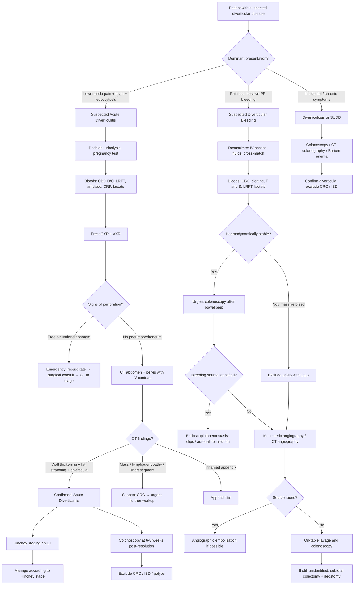
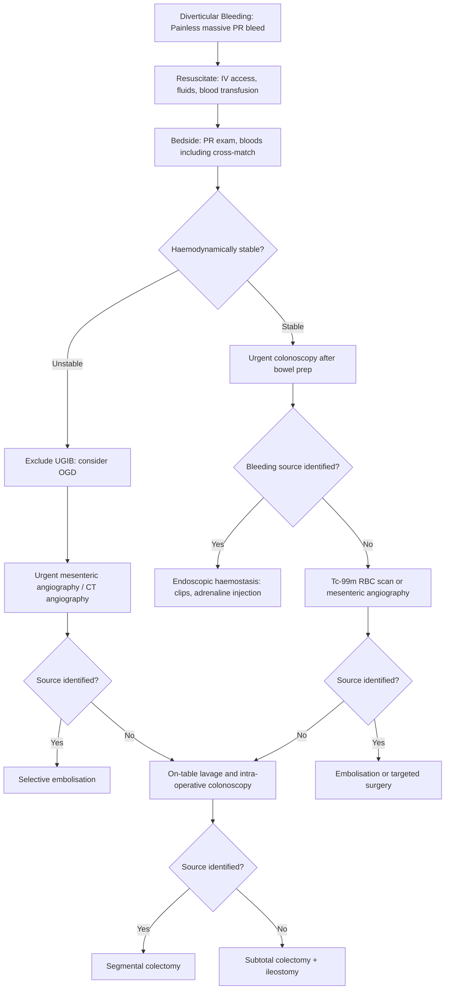

## Diagnostic Criteria, Algorithm, and Investigations for Diverticular Disease

### Key Principle: There Is No Single "Diagnostic Criterion" for Diverticular Disease

Unlike conditions such as rheumatic fever (Jones criteria) or SLE (ACR criteria), diverticular disease does not have formal validated diagnostic criteria with sensitivity/specificity scores. Instead, the diagnosis is **clinico-radiological** — you combine the clinical picture with imaging findings. Let me walk you through exactly how this works for each presentation.

---

### 1. Diagnostic Criteria by Presentation

#### A. Acute Diverticulitis — Clinical + Radiological Diagnosis

The clinical diagnosis rests on the ***triad of lower abdominal pain + fever + leucocytosis*** [1][4], but the definitive diagnosis requires imaging:

| Component | What You're Looking For | Why |
|---|---|---|
| **Clinical triad** | Lower abdominal pain (LLQ or RLQ), fever, leucocytosis | Microperforation → localised pericolic inflammation → peritoneal irritation (pain), systemic inflammatory response (fever, leucocytosis) |
| ***CT abdomen + pelvis with IV contrast*** | Bowel wall thickening > 4 mm + pericolic fat stranding + visible diverticula | ***CT scan helps to confirm diagnosis and assess the severity*** [2] — it is both diagnostic AND prognostic (Hinchey staging) |
| **Absence of other diagnoses** | Must exclude CRC, appendicitis, IBD, gynaecological/urological causes | Diverticulitis is partly a diagnosis of exclusion in the acute setting; definitive exclusion of CRC requires colonoscopy later |

> ***Diagnosis of uncomplicated diverticulitis: CT abdomen and pelvis with IV contrast*** [5]

> ***Avoid colonoscopy*** in the acute setting [5]

> ***Colonoscopy at 6–8 weeks to rule out malignancy*** [5]

**Why avoid colonoscopy acutely?** Because the inflammation is **peri**diverticular (outside the bowel wall). Air insufflation during colonoscopy risks converting a sealed microperforation into a free perforation — a catastrophe. The colonoscopy won't even show much diagnostically since the disease process is extraluminal [3].

#### B. Diverticulosis (Incidental / Asymptomatic)

- ***Incidental finding on CT, colonoscopy, or barium enema*** [5]
- No specific diagnostic criteria needed — you simply see the diverticula on imaging
- ***Investigations for diverticulosis: barium enema / colonoscopy / CT colonography (CTC)*** [5]

#### C. Diverticular Bleeding

- Clinical: ***painless massive PR bleeding*** in a patient with known or suspected diverticulosis
- ***Investigation of choice: colonoscopy*** [5] — both diagnostic (identify bleeding source) and therapeutic (haemostasis)
- No formal diagnostic criteria; diagnosis is made by **visualising a bleeding diverticulum** or **stigmata of recent haemorrhage** at a diverticulum on colonoscopy

#### D. SUDD (Symptomatic Uncomplicated Diverticular Disease)

- Clinical: colicky abdominal pain, altered bowel habit in a patient with known diverticulosis
- CT shows **wall thickening** in the **absence of inflammatory changes** (no fat stranding, no abscess) [3]
- Essentially a diagnosis of exclusion after ruling out diverticulitis, CRC, and IBD

---

### 2. Diagnostic Algorithm

Here is the systematic approach to a patient presenting with suspected diverticular disease, organised by clinical scenario:

<Callout title="The Two Phases of Diagnosis" type="idea">
Think of diagnosing diverticular disease in **two phases**:
1. **Acute phase**: CT abdomen/pelvis with IV contrast → confirm diverticulitis, stage severity (Hinchey), guide immediate management. **NO colonoscopy.**
2. **Recovery phase (6–8 weeks later)**: Colonoscopy → definitively exclude CRC, assess for IBD/polyps, evaluate for strictures.

This two-phase approach is one of the most commonly tested concepts.
</Callout>

---

### 3. Investigation Modalities — Detailed Breakdown

#### A. Bedside Investigations

| Investigation | Key Findings | Clinical Significance |
|---|---|---|
| ***Urinalysis*** [2][3] | **Sterile pyuria** | Adjacent sigmoid inflammation irritates the bladder wall → WBCs in urine without bacterial infection. Don't mistake this for UTI! [3] |
| ***Urine culture*** [3][4] | **Presence of colonic flora** (e.g., *E. coli*, *Bacteroides*) | Pathognomonic for ***colovesical fistula*** — bacteria from the colon have gained direct access to the urinary tract through the fistulous communication [3] |
| ***Pregnancy test*** [2] | Positive β-hCG | Excludes ectopic pregnancy in women of reproductive age — a critical differential for lower abdominal pain |

#### B. Blood Investigations

***Blood tests: CBC D/C, LRFT, amylase, clotting profile, ABG, type and screen*** [2][4]

| Investigation | Key Findings | Why It's Done |
|---|---|---|
| ***CBC with differentials*** | **Leucocytosis** (raised WCC with neutrophilia) | Confirms systemic inflammatory response to infection/inflammation. Part of the diagnostic triad. Drop in Hb suggests bleeding [3][4] |
| **CRP** | Elevated | Non-specific inflammatory marker; useful for monitoring response to treatment. CRP > 200 mg/L has been associated with complicated diverticulitis |
| ***Electrolyte profile (LRFT)*** | Derangements in Na⁺, K⁺, urea, creatinine | Dehydration from reduced oral intake, vomiting, third-space losses; renal impairment from sepsis/hypovolaemia [3] |
| ***Serum amylase and lipase*** | Usually normal or mildly elevated | Primarily to **exclude acute pancreatitis** as a differential for upper/diffuse abdominal pain. Mild elevation can occur with any intra-abdominal inflammation [3] |
| ***LFT*** | Usually normal | Exclude hepatobiliary pathology; may be deranged if hepatic abscess develops from portal pyaemia |
| ***ABG and lactate*** [2] | Raised lactate, metabolic acidosis | Suggests tissue hypoperfusion — raises concern for ischaemic bowel, septic shock, or peritonitis with cardiovascular compromise |
| ***Clotting profile*** [2] | PT/INR, APTT | Essential pre-operatively and if patient is on anticoagulants (which increase bleeding risk in diverticular bleeding) |
| ***Type and screen / cross-match*** [2] | Blood group and antibody screen | Preparation for potential transfusion (especially in diverticular bleeding or if surgery anticipated) |

#### C. Plain Radiographs — CXR and AXR

***Imaging: Erect CXR, erect and supine AXR*** [2][3]

| Finding | Significance | Pathophysiological Basis |
|---|---|---|
| ***Free gas under diaphragm (pneumoperitoneum)*** on erect CXR | **Perforation** — surgical emergency | Free bowel perforation → intraluminal air escapes into peritoneal cavity → rises to collect under the diaphragm [3] |
| **Air-fluid levels** with bowel dilatation on AXR | **Obstruction or paralytic ileus** | Mechanical obstruction (stricture from chronic diverticulitis) → proximal accumulation of gas and fluid. Alternatively, peritoneal inflammation → reflex inhibition of peristalsis (paralytic ileus) [3] |
| ***Dilated bowel*** on AXR [4] | Obstruction | LBO from diverticular stricture (chronic fibrosis) or SBO from adhesion to inflamed segment |
| **Soft tissue densities** | **Abscess** | Collection of pus and inflammatory tissue creates an area of increased soft tissue density [3] |

<Callout title="Plain Films — Screening, Not Diagnostic" type="idea">
Erect CXR and AXR are **quick, cheap screening tools** done in the emergency department. They can identify life-threatening complications (perforation, obstruction) but they **cannot confirm the diagnosis of diverticulitis**. For that, you need CT.
</Callout>

#### D. Ultrasound (USG Abdomen)

Ultrasound can be useful as a **first-line bedside investigation**, especially when CT is not immediately available or to avoid radiation (e.g., young patients, pregnancy).

| Finding | Significance |
|---|---|
| **Diverticula in surrounding segments** | Confirms underlying diverticulosis [3] |
| **Bowel wall thickening > 4 mm at point of maximal tenderness** (segmental mural thickening) | Localised inflammation — hallmark of diverticulitis [3] |
| **Hypoechoic peridiverticular inflammatory reaction** | Pericolic inflammation/phlegmon [3] |
| **Mural and peridiverticular abscess ± gas bubbles** | Complicated diverticulitis with abscess formation [3] |
| **Anechoic mass containing echogenic debris** | Abscess [3] |
| **Hypoechoic area with extraluminal air bubbles extending into bladder/vagina/abdominal wall** | Fistula [3] |
| **Ascites, diffuse peritoneal thickening, scattered loculated fluid collections** | Perforation with peritonitis [3] |

**Limitations**: Operator-dependent; bowel gas obscures views; limited sensitivity for deep pelvic structures; cannot reliably stage severity (Hinchey).

#### E. CT Abdomen + Pelvis with IV Contrast — THE Gold Standard

This is the single most important investigation for acute diverticulitis. It does **four things simultaneously** [2][4][5]:

1. ***Diagnostic***: confirms the diagnosis
2. ***Assesses complications***: abscess, fistula, perforation, obstruction
3. ***Aids treatment***: guides **percutaneous drainage** of abscess
4. ***Prognostic***: enables ***Hinchey classification*** staging [4]

> ***CT scan helps to confirm diagnosis and assess the severity*** [2]

##### CT Findings in Acute Diverticulitis [3]

| CT Finding | What It Represents | Why It Occurs |
|---|---|---|
| **Colonic diverticula** | Underlying diverticulosis | Outpouchings of mucosa/submucosa through the colonic wall |
| ***Localised bowel wall thickening > 4 mm*** | Mural oedema and inflammation | Microperforation → inflammatory infiltrate and oedema within the bowel wall |
| ***Increased soft tissue density in pericolonic fat (fat stranding)*** | Pericolic inflammation | Inflammatory exudate and oedema spread from the microperforation into the surrounding mesenteric fat — this is the hallmark CT sign of diverticulitis [3] |

##### CT Findings of Complications [3][4]

| Complication | CT Findings | Explanation |
|---|---|---|
| **Abscess** | Fluid collection with surrounding inflammatory changes; centre may contain **air, air-fluid levels, or low-attenuation necrotic debris** | Walled-off collection of pus from contained microperforation. Air within the abscess comes from the bowel communication |
| **Abscess size** | ***5 cm is the cut-off*** [4] | < 5 cm: likely to resolve with IV antibiotics alone. ≥ 5 cm: likely requires **image-guided (CT-guided) percutaneous drainage** |
| **Fistula** | **Extracolonic air collections within organs other than bowel** (e.g., air in bladder = colovesical fistula) | Inflammatory erosion through to adjacent organ creates abnormal communication; air/gas tracks from bowel into the other organ |
| **Obstruction** | **Dilated loops of bowel with air-fluid levels** in proximity to an area with pericolic fat stranding | Inflammatory oedema or chronic fibrotic stricture narrows the lumen → proximal bowel dilates |
| **Perforation** | **Free intraperitoneal air** in patient with peritonitis | Unsealed microperforation or macro-perforation → free air escapes into peritoneal cavity |

##### Hinchey Classification on CT [4]

| ***Stage*** | ***CT Appearance*** | ***Management Implication*** |
|---|---|---|
| ***I*** | Small pericolic or mesenteric abscess ( < 5 cm) | IV antibiotics ± drainage |
| ***II*** | Larger distant abscess (pelvic, retroperitoneal) | IV antibiotics + CT-guided percutaneous drainage |
| ***III*** | Free fluid/gas without connection to bowel lumen; no faecal material in peritoneum | Surgery required (Hartmann's or primary resection-anastomosis) |
| ***IV*** | Free faecal matter and gas in peritoneal cavity; communication with bowel lumen visible | Emergency surgery (Hartmann's) |

> ***Hinchey classification: note NOT applicable in right-sided disease*** [4]

<Callout title="Why Hinchey Doesn't Apply to Right-Sided Disease">
The Hinchey classification was developed and validated for **left-sided (sigmoid) diverticulitis** with its specific anatomical relationships. Right-sided diverticula are congenital and true (involving all layers), have different natural history, and right-sided complicated diverticulitis is managed differently (typically right hemicolectomy rather than Hartmann's procedure). The staging system simply doesn't translate.
</Callout>

##### CT Features Distinguishing Diverticulitis from CRC [3]

This is high-yield — you need to know this for exams:

| Feature | Diverticulitis | CRC |
|---|---|---|
| **Length of involvement** | **> 10 cm** (long segment) | **< 10 cm** (short segment) |
| **Pericolonic fat stranding** | Prominent (the hallmark feature) | Mild or absent |
| **Pericolonic lymph nodes** | **Absent** or small/reactive | **Enlarged** (suggesting malignant infiltration) |
| **Surrounding diverticula** | Present in adjacent colon | May or may not be present |
| **Transition zone** | Gradual thickening | **Abrupt "shouldering"** (sharp transition from normal to thickened bowel) |
| **Luminal appearance** | Smooth narrowing | Irregular, eccentric mass/luminal destruction |

> ***Features suggestive of acute diverticulitis include presence of pericolonic and mesenteric inflammation, involvement of > 10 cm of colon, and absence of enlarged pericolonic lymph nodes*** [3]

<Callout title="The 1-2% Rule" type="error">
Even with these distinguishing features, **1–2% of patients diagnosed as "uncomplicated diverticulitis" on CT will harbour an underlying CRC**. With complicated diverticulitis, the rate of concurrent malignancy jumps to **~10-17%** [5]. This is precisely why follow-up colonoscopy is non-negotiable.
</Callout>

From the lecture data showing studies of patients with uncomplicated vs complicated diverticulitis [5]:

| Disease Type | Malignancy Rate |
|---|---|
| **Uncomplicated diverticulitis** | ~0–1.1% (very low but not zero) |
| **Complicated diverticulitis** | ~13–17% (significantly higher!) |
| **Colorectal polyps** (on follow-up colonoscopy) | ~7–32% |

This data reinforces that ***colonoscopy at 6–8 weeks is essential, especially after complicated disease*** [5].

#### F. MRI Abdomen + Pelvis

| Feature | Details |
|---|---|
| **When to use** | When you want to **avoid radiation exposure** (young patients, pregnant women, recurrent imaging needed) [3] |
| **Findings** | Same as CT: colonic diverticula, colonic wall thickening, pericolonic exudates and oedema [3] |
| **Limitations** | Longer scan time; less available in emergencies; more expensive; motion artefact |
| **Advantage** | Excellent soft tissue contrast; no ionising radiation; useful for characterising pelvic abscesses and fistulae |

#### G. Colonoscopy

Colonoscopy plays **different roles** depending on the clinical scenario:

##### In Acute Diverticulitis:

> ***Avoid colonoscopy*** in the acute setting [5]

- **NO role in establishing the diagnosis** of acute diverticulitis because the inflammation is **peri**diverticular (extraluminal) — colonoscopy only visualises the mucosal surface [3]
- **Risk of perforation** during air insufflation in an already weakened, inflamed bowel wall [4]
- ***Contraindication: acute diverticulitis*** [4]

##### Post-Recovery (6–8 Weeks):

> ***Colonoscopy at 6–8 weeks to rule out malignancy*** [5]

- ***Definitive diagnosis (localisation) and rule out other DDx (e.g., CRC, IBD)*** [4]
- ***Assess complications: stenosis*** (fibrotic stricture from chronic disease) [4]
- Evaluate for synchronous polyps
- Standard of care after ANY episode of acute diverticulitis

##### In Diverticular Bleeding:

***Investigation: Colonoscopy*** [5]

- ***Endoscopic haemostasis*** [4][5]:
  - ***Epinephrine injection (1:10,000)*** — not used alone (causes temporary vasoconstriction but doesn't achieve definitive haemostasis) [4]
  - ***Endoscopic clip / band ligation*** — usually for diverticular bleeding [4]
  - ***Argon plasma coagulation (APC)*** — thermal energy, usually more for angiodysplasia [4]
- Limitations in acute massive bleeding: **poor visualisation** due to blood clots and lack of adequate bowel preparation [3][4]
- May be difficult to identify and localise the exact bleeding diverticulum

##### In Diverticulosis (Asymptomatic/SUDD):

***Investigations for diverticulosis: barium enema / colonoscopy / CT colonography*** [5]

- Colonoscopy can directly visualise diverticula and simultaneously screen for polyps/CRC
- Often the investigation that **incidentally discovers** diverticulosis

#### H. CT Colonography (Virtual Colonoscopy) with Water-Soluble Rectal Contrast

- ***Especially useful for colovesical fistula*** [4] — water-soluble contrast instilled per rectum can be seen tracking into the bladder through the fistula
- Alternative to colonoscopy when:
  - Colonoscope cannot reach the caecum (stricture, tortuous colon)
  - Patient cannot tolerate colonoscopy
- Provides extraluminal information (unlike conventional colonoscopy)
- **Cannot take biopsies** — if a suspicious lesion is found, colonoscopy is still needed

#### I. Barium Enema

- ***NOT recommended and relatively contraindicated in the acute setting*** [3]
- Risk of **barium peritonitis** if there is a perforation — barium is intensely irritant to the peritoneum and cannot be reabsorbed (unlike water-soluble contrast)
- **Contrast enema and small bowel studies are extremely useful in defining the course of fistula** in complicated diverticulitis [3]
- Largely superseded by CT colonography in modern practice
- Classic finding in diverticulosis: **saw-tooth pattern** of the colonic mucosa with outpouchings

#### J. Mesenteric Angiography

- ***Indicated when colonoscopy cannot accurately localise the diverticular bleeding source*** [3]
- **3-vessel mesenteric angiogram**: coeliac artery, SMA, IMA [3]
- Detects active bleeding at a rate of **> 1 mL/min** [3]
- Can show: contrast extravasation at the bleeding site
- ***Angiogram ± embolisation*** [5] — selective catheterisation and embolisation can control bleeding
- However, ***embolisation carries risk of bowel ischaemia/gangrene*** — must be done selectively by experienced interventional radiologists [3]

#### K. Technetium-99m Tagged RBC Scan

- ***Indicated when colonoscopy cannot accurately localise the diverticular bleeding source*** [3]
- More sensitive than angiography: detects slow intermittent bleeding at **> 0.1 mL/min** [3]
- **Mechanism**: patient's own RBCs are labelled with Tc-99m → reinjected → serial gamma camera images over 24 hours → localisation of tracer accumulation at the bleeding site
- Useful for **intermittent bleeding** that may not be active at the time of angiography
- Limitation: gives only **approximate anatomical localisation** (not precise enough for surgery alone — usually needs confirmatory angiography or colonoscopy)

---

### 4. Investigation Algorithm for Diverticular Bleeding — Stepwise Escalation

This is a critical algorithm from the lectures [4][5]:

***Localisation of bleeding: colonoscopy → angiography → on-table lavage and colonoscopy → subtotal colectomy and ileostomy*** [4]

> ***80% of diverticular bleeding is self-limiting*** [1][5]. ***Rebleeding occurs in ~20–30%*** [7]

> ***Treatment of diverticular bleeding: endoscopic vs surgical resection*** [7]

---

### 5. Summary of Investigation Modalities by Clinical Scenario

| Clinical Scenario | First-Line Investigation | Additional Investigations | What NOT to Do |
|---|---|---|---|
| **Acute diverticulitis** | ***CT abdomen + pelvis with IV contrast*** [2][5] | Bloods (CBC D/C, LRFT, amylase), urinalysis, erect CXR + AXR | ***Avoid colonoscopy*** [5]; avoid barium enema |
| **Post-recovery from acute diverticulitis** | ***Colonoscopy at 6–8 weeks*** [5] | CT colonography if colonoscopy incomplete | Don't skip this — ***rule out malignancy*** |
| **Diverticular bleeding** | ***Colonoscopy*** [5] | Mesenteric angiography, Tc-99m RBC scan, CT angiography | Don't assume it's lower GI — exclude UGIB if unstable |
| **Asymptomatic diverticulosis** | ***Colonoscopy / barium enema / CT colonography*** [5] | None specifically | No treatment needed if truly asymptomatic |
| **Suspected colovesical fistula** | ***CT colonography with water-soluble rectal contrast*** [4] | Urine culture (colonic flora), cystoscopy | Don't use barium (risk of barium peritonitis if free perforation) |
| **Acute abdomen / suspected perforation** | **Erect CXR** (pneumoperitoneum) → **CT** | Bloods including lactate, ABG | Don't delay resuscitation; don't do colonoscopy |

---

### 6. Physical Examination Findings (As Part of Diagnostic Workup)

Don't forget that the examination IS part of your diagnostic algorithm [2][3]:

#### Abdominal Examination [3]

| Finding | Significance |
|---|---|
| **Tender abdominal mass** | Phlegmon (inflamed mass of oedematous colon + mesentery + omentum) or peridiverticular abscess [3] |
| **Peritoneal signs: rigidity, localised guarding, rebound tenderness** | Localised peritonitis from pericolic inflammation; if generalised → perforation [3] |
| **Absent bowel sounds** | Paralytic ileus (peritoneal inflammation) or advanced obstruction |
| **Hyperactive bowel sounds** | Mechanical obstruction (stricture) |

#### Digital Rectal Examination (DRE) [3]

| Finding | Significance |
|---|---|
| **Mass or tenderness** | **Distal sigmoid abscess** — the abscess has tracked into the pelvis and is palpable through the rectal wall [3] |
| **Blood on glove** | Suggests bleeding or mucosal involvement |
| **Bogginess/fullness** | Pelvic abscess or collection |

> ***Investigations for acute abdomen*** [2]: ***Bedside tests: urinalysis, pregnancy test. Blood tests: blood count, renal and liver function, amylase, clotting profile, ABG, type and screen. Imaging: erect CXR, erect and supine AXR, USG, CT, contrast studies. Endoscopy: colonoscopy, upper endoscopy*** [2]

---

<Callout title="High Yield Summary">

**The diagnosis of acute diverticulitis is clinico-radiological**: clinical triad (lower abdominal pain + fever + leucocytosis) confirmed by **CT abdomen + pelvis with IV contrast** (gold standard).

**CT is diagnostic, assesses complications, aids treatment (guides drainage), and is prognostic (Hinchey staging).**

**Key CT findings**: bowel wall thickening > 4 mm, pericolic fat stranding, visible diverticula. Complications: abscess (5 cm cut-off for drainage), fistula (extracolonic air in adjacent organs), obstruction (dilated loops), perforation (free air).

**CT distinguishes diverticulitis from CRC**: diverticulitis involves > 10 cm, has prominent fat stranding, no enlarged lymph nodes. CRC has short-segment involvement, shouldering, and lymphadenopathy.

**Colonoscopy is CONTRAINDICATED acutely** (risk of perforation). Colonoscopy at **6–8 weeks post-recovery is mandatory to exclude CRC** — malignancy rate in complicated diverticulitis is ~10-17%.

**Diverticular bleeding investigation**: colonoscopy (first-line) → mesenteric angiography → on-table lavage and colonoscopy → subtotal colectomy if source not found.

**Sterile pyuria** on urinalysis = adjacent inflammation. **Colonic flora on urine culture** = colovesical fistula.

**Hinchey classification is NOT applicable to right-sided disease.**
</Callout>

---

<ActiveRecallQuiz
  title="Active Recall - Diagnosis and Investigations of Diverticular Disease"
  items={[
    {
      question: "What is the gold standard investigation for acute diverticulitis, and name 4 roles it serves?",
      markscheme: "CT abdomen and pelvis with IV contrast. Four roles: (1) Diagnostic: confirms diverticulitis. (2) Assesses complications: abscess, fistula, perforation, obstruction. (3) Aids treatment: guides percutaneous drainage of abscess. (4) Prognostic: Hinchey classification staging."
    },
    {
      question: "Why is colonoscopy contraindicated in acute diverticulitis, and when should it be performed instead?",
      markscheme: "Contraindicated acutely because: (1) Inflammation is peridiverticular (extraluminal) so colonoscopy is not diagnostically useful. (2) Air insufflation risks converting a sealed microperforation into a free perforation. Colonoscopy should be performed at 6-8 weeks post-resolution to exclude CRC, IBD, and polyps."
    },
    {
      question: "Name 3 CT features that help distinguish acute diverticulitis from colorectal cancer.",
      markscheme: "Diverticulitis: (1) Involvement of more than 10 cm of colon (long segment). (2) Prominent pericolic fat stranding. (3) Absence of enlarged pericolonic lymph nodes. Also: visible surrounding diverticula, gradual thickening. CRC: short segment, shouldering sign, lymphadenopathy."
    },
    {
      question: "Describe the stepwise escalation algorithm for localising the source of diverticular bleeding.",
      markscheme: "Colonoscopy (first-line, both diagnostic and therapeutic) → mesenteric angiography or CT angiography (if colonoscopy inconclusive, detects bleeding more than 1 mL/min) → on-table lavage with intra-operative colonoscopy → subtotal colectomy with ileostomy if bleeding source still cannot be identified."
    },
    {
      question: "What does sterile pyuria on urinalysis suggest in a patient with suspected diverticulitis, and what does colonic flora on urine culture indicate?",
      markscheme: "Sterile pyuria: adjacent sigmoid inflammation irritating the bladder wall, causing WBCs in urine without bacterial infection. Colonic flora on urine culture (e.g. E. coli, Bacteroides): pathognomonic for colovesical fistula - bacteria have gained direct access from colon to urinary tract through the fistulous tract."
    },
    {
      question: "What is the CT abscess size cut-off that determines whether percutaneous drainage is likely needed, and why?",
      markscheme: "5 cm is the cut-off. Abscesses less than 5 cm are likely to resolve with IV antibiotics alone. Abscesses 5 cm or larger are unlikely to resolve with antibiotics alone and typically require image-guided percutaneous drainage."
    }
  ]}
/>

## References

[1] Lecture slides: Diverticular diseases - Dr. J Tsang.pdf (p3, p4, p8)
[2] Lecture slides: GC 195. Lower and diffuse abdominal pain RLQ problems; pelvic inflammatory disease; peritonitis and abdominal emergencies.pdf (p12, p18, p19)
[3] Senior notes: felixlai.md (Diverticular disease section — Diagnosis)
[4] Senior notes: maxim.md (Diverticular disease section — Investigations)
[5] Lecture slides: Diverticular diseases - Dr. J Tsang.pdf (p5, p6, p7, p10, p11)
[7] Lecture slides: GC 186. Lower and diffuse abdominal painfresh blood in stool.pdf (p9)
