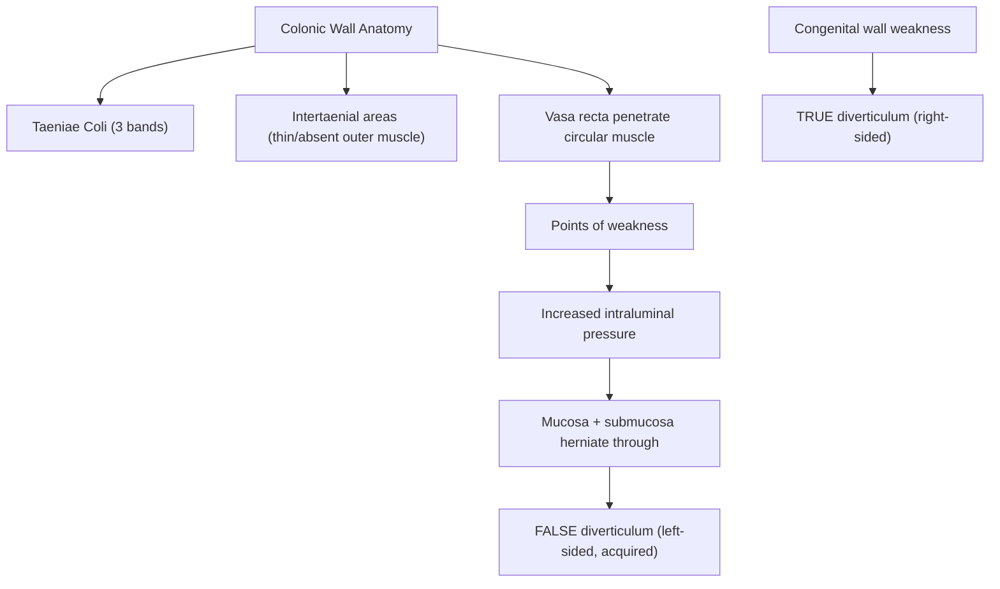
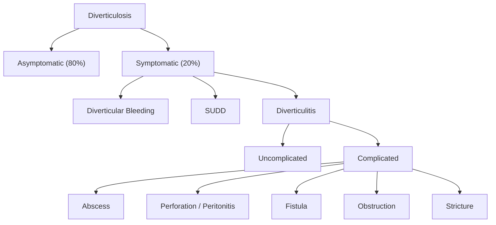
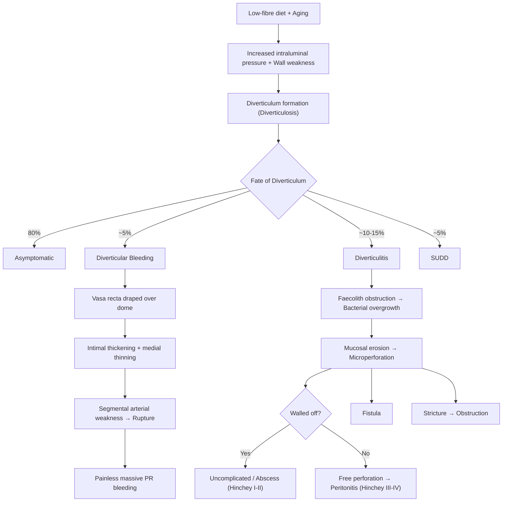

## 1. Definition and Terminology

Let's start by getting the language right — this is a topic where imprecise terminology costs marks.

### Core Definitions

- **Diverticulum** (Latin: *diverticulum* = "a wayside shelter" or "turning aside") — a **sac-like protrusion (outpouching) of a hollow viscus** [1][2][3]
- **Diverticulosis (coli)** — the **presence of multiple diverticula**, which may be **symptomatic or asymptomatic** [2][3]
- **Diverticular disease** — **clinically significant and symptomatic diverticulosis** [2][3]. This umbrella term encompasses:
  - **Diverticulitis** — **inflammation of a diverticulum** (caused by microperforation) [1][3]
    - Acute vs. Chronic
    - Uncomplicated vs. Complicated (abscess, fistula, bowel obstruction, perforation)
  - **Diverticular bleeding** — **painless massive PR bleeding** due to **rupture of vasa recta** draped over the diverticular dome [2][3]
    - Typically occurs in the **ABSENCE** of diverticulitis (the bleeding and inflammation are separate pathological processes)
    - Self-limited in ~80% of patients
  - **Segmental Colitis Associated with Diverticula (SCAD) / Diverticular colitis** — inflammation of the **interdiverticular mucosa** without involvement of diverticular orifices (resembles IBD histologically but is a distinct entity) [3]
  - **Symptomatic Uncomplicated Diverticular Disease (SUDD)** — persistent abdominal pain attributed to diverticula **without macroscopically overt colitis or diverticulitis**; CT shows wall thickening without inflammatory changes [3]

<Callout title="Key Distinction for Exams" type="error">
Students often confuse diverticulosis (anatomical finding, often incidental) with diverticular disease (symptomatic). Most people with diverticulosis (~80%) are **asymptomatic** and will never develop complications. Only ~20% become symptomatic [1][4].
</Callout>

### True vs. False Diverticulum

| Feature | True Diverticulum | False (Pseudo) Diverticulum |
|---|---|---|
| **Layers involved** | **All layers** of the intestinal wall (mucosa, submucosa, muscularis propria, serosa/adventitia) | **Only mucosa and submucosa** herniate through muscularis propria |
| **Example** | ***Right-sided*** colonic diverticula, Meckel's diverticulum | ***Left-sided*** colonic diverticula (the vast majority of "diverticular disease"), Zenker's diverticulum |
| **Mechanism** | Usually congenital | Usually acquired (pulsion type — pushed out by intraluminal pressure) |

<DiagramCard src="/diagrams/truevsfalse-diverticulum.png" alt="Comparison of true versus false diverticulum with bowel wall layers involved" caption="True vs false diverticulum" />

> ***Right-sided diverticula are true diverticula (congenital); left-sided diverticula are false diverticula (acquired)*** [1]

### Other Important Diverticula (for completeness)

- **Meckel's diverticulum** — **true diverticulum** arising from incomplete obliteration of the **vitelline (omphalomesenteric) duct** on the **antimesenteric surface** of the mid-to-distal ileum. Remember the **"Rule of 2s"**: 2% prevalence, 2 feet from ileocaecal valve, 2 inches long, 2 types of ectopic tissue (gastric and pancreatic), presents by age 2 [3]
- **Zenker's diverticulum** — **false diverticulum** arising from **Killian's triangle** (area of weakness between the transverse fibres of the cricopharyngeus and the oblique fibres of the lower inferior constrictor muscle of the pharynx) [3]

---

## 2. Epidemiology

***Diverticular disease is common in the Western population*** [1][4]:

- **Prevalence increases dramatically with age**:
  - Rare before age 30
  - ~30% by age 60
  - ***60% in age > 70*** [1]
  - ~65% by age 80-85 [1]
- Mean age of diagnosis of acute diverticulitis = **63 years** [3]
- ***Symptomatic in about 20%*** of those with diverticulosis [1]
- Of those who develop diverticulitis, ~15-25% will develop complications

### Regional Variation — This Is High Yield

| Feature | Western | ***Asian (including Hong Kong)*** |
|---|---|---|
| **Predominant site** | ***Left-sided (sigmoid colon)*** | Still predominantly left-sided, BUT the proportion of ***right-sided diverticulosis (caecum/ascending colon) is significantly higher*** [1][3][4] |
| **Type** | False (acquired) | Right-sided = True (congenital); Left-sided = False (acquired) |
| **Clinical pitfall** | Classic LLQ pain | ***Caecal diverticulitis mimicking appendicitis*** — ***Role of CT scan*** to differentiate [1] |

<Callout title="Hong Kong Context — Must Know">
In Hong Kong and Asia, right-sided diverticular disease is much more prevalent than in the West. A young patient presenting with **RLQ pain, fever, and leucocytosis** may have caecal diverticulitis rather than appendicitis. **CT abdomen** is the key investigation to distinguish them [1][4].
</Callout>

---

## 3. Risk Factors

Understanding risk factors requires understanding the pathophysiology — it's all about **wall weakness + increased intraluminal pressure**.

| Risk Factor | Mechanism |
|---|---|
| **Age** (rare before 30) | Progressive degeneration of colonic wall connective tissue; reduced elastin and collagen cross-linking → weaker wall |
| ***Low-fibre diet*** | Low residue → smaller, harder stools → colon must generate ***higher intraluminal pressures*** to propel contents → pulsion diverticula [1][3] |
| **Obesity** | Increases intra-abdominal pressure; adipose tissue produces pro-inflammatory cytokines → increases risk of both diverticulitis and diverticular bleeding [3] |
| **Fat and red meat intake** | Alters gut microbiome, promotes intestinal inflammation [3] |
| **Decreased physical activity / sedentary lifestyle** | Reduces colonic motility → increased transit time → harder stools → higher pressures [3] |
| **Constipation** | ***Increased intraluminal pressure*** directly [4] |
| **Smoking** | Impairs mucosal blood flow and tissue healing; alters gut motility |
| ***NSAIDs*** | Disrupt mucosal barrier (inhibit prostaglandin synthesis → reduced mucosal blood flow, mucus and bicarbonate secretion) → promotes microperforation and bleeding [1][3][4] |
| ***Steroids*** | Immunosuppression impairs inflammatory response and healing; masks symptoms → delayed presentation |
| **Opiates** | Slow colonic transit → increased intraluminal pressure; constipation |
| **Connective tissue diseases** (***Marfan syndrome***, Ehlers-Danlos) | Inherent structural weakness of connective tissue in the colonic wall [4] |

<Callout title="Drugs to Remember" type="idea">
**NSAIDs, steroids, and opiates** — these three drug classes all worsen diverticular disease. NSAIDs increase bleeding and perforation risk; steroids mask inflammation and delay healing; opiates increase pressure through constipation. Tell patients with known diverticulosis to **avoid NSAIDs and stimulant laxatives** [4].
</Callout>

---

## 4. Anatomy and Function

To understand diverticular disease, you need to understand **colonic wall anatomy** and the concept of **points of weakness**.

figure]:m-0">
  <DiagramCard src="/diagrams/diverticular-disease.webp" alt="Anatomy and pathophysiology overview of diverticular disease showing diverticula, diverticulitis progression, and key complications" caption="Diverticular disease overview diagram" />
  <DiagramCard src="/diagrams/colon-wall-anatomy.webp" alt="Cross-sectional anatomy of the colon wall showing mucosa, submucosa, muscular layers, and serosa" caption="Colon wall anatomy" />

### Colonic Wall Structure

The colon has a unique muscular arrangement compared to the small bowel:
- **Inner circular muscle layer** — complete ring of smooth muscle
- **Outer longitudinal muscle layer** — NOT a complete layer; instead condensed into ***three longitudinal bands called taeniae coli*** (taenia mesocolica, taenia omentalis, taenia libera)
- Between the taeniae, the outer longitudinal muscle is either very thin or essentially absent → the **intertaenial areas** are inherently weak

### Points of Weakness — Where Diverticula Form

***Diverticula develop at well-defined points of weakness where the vasa recta (nutrient arteries) penetrate the circular muscle layer*** [1][2][3][4]:

- The **vasa recta** are small arteries that arise from the marginal artery, travel along the mesenteric side, and **penetrate through the circular muscle** to reach the submucosa and mucosa
- Where each vas rectum pierces the muscle, it creates a **gap in the muscularis** → a point of structural weakness
- Under increased intraluminal pressure, the mucosa and submucosa **herniate through these gaps** → forming false (pulsion) diverticula

> ***Outpouchings of the bowel wall occur at the weakest point where vasa recta penetrate circular muscle*** [1][2]

### Why the Sigmoid Colon?

***The sigmoid colon is the commonest site*** [1] because:

1. **Laplace's Law**: Wall tension = (Pressure × Radius) / (2 × Wall thickness). The sigmoid has the **narrowest calibre (smallest radius)** of any colonic segment → for a given wall tension, it must generate the ***highest intraluminal pressure*** to propel contents [1][4]
2. The sigmoid acts as a "high-pressure zone" especially during segmental non-propulsive contractions
3. Stool is most solid in the sigmoid (water reabsorption is largely complete) → harder to propel → more pressure needed

### Why Is the Rectum Never Affected?

***The rectum is never affected*** because the outer longitudinal smooth muscle of the rectum **encompasses the full circumference** (no taeniae; complete longitudinal muscle coat) → no weak intertaenial zones → no points for herniation [4].

### Right-Sided (Asian) Diverticula

- ***Right-sided diverticula are congenital and true diverticula*** (involve all layers) [1]
- They occur predominantly in the **caecum and ascending colon**
- Mechanism is congenital wall weakness rather than acquired pulsion
- ***Right-sided colon has a thinner wall*** → a greater length of vasa recta is exposed to injury → right colon is usually the source of diverticular bleeding [3]
- ***Right-sided diverticula have wider necks and domes*** → expose more vasa recta to luminal injury [3]

---

## 5. Etiology and Pathophysiology

### 5A. Pathogenesis of Diverticulosis (Formation of Diverticula)

The fundamental equation is: **wall weakness + increased intraluminal pressure = diverticulum**

***Acquired (left-sided)***: ***Low fibre diet → increased intraluminal pressure*** [1]:
1. Low dietary fibre → smaller, harder stool boluses
2. Colonic segmentation contractions generate higher pressures to propel stool
3. ***Sigmoid has narrowest calibre → highest pressure (Laplace's law)*** [1][4]
4. Mucosa and submucosa herniate through weak points where vasa recta penetrate the circular muscle
5. Result: **false diverticulum** (only mucosa and submucosa)

***Congenital (right-sided)***: Developmental weakness in the caecal/ascending colonic wall → **true diverticulum** (all layers) [1]

### 5B. Pathogenesis of Diverticulitis

***Diverticulitis is caused by microperforation*** [1]:

Two proposed mechanisms:
1. **Obstruction of the diverticular neck by a faecolith** → stasis within the diverticulum → **bacterial overgrowth** → mucosal erosion → **inflammation and focal necrosis** → microperforation → pericolic inflammation [3][4]
2. **Direct mechanical erosion** by inspissated faecal matter → increased diverticular pressure → microperforation [3]

The microperforation is initially small and **walled off by pericolic fat and mesentery** → localised pericolic inflammation (uncomplicated diverticulitis). If the perforation is larger or the host response is inadequate → abscess, free perforation, or peritonitis (complicated diverticulitis).

### 5C. Pathogenesis of Diverticular Bleeding

This is a beautifully logical sequence [3]:

1. When a diverticulum herniates, it **drags the penetrating vas rectum** (the very vessel whose entry point created the weakness) over the **dome of the diverticulum**
2. The blood vessel is now separated from the bowel lumen **only by mucosa** (no muscularis protection)
3. The exposed vasa recta undergoes injury along its luminal aspect → **eccentric intimal thickening** and **thinning of the media** (asymmetric arterial remodelling)
4. These changes create **segmental weakness of the artery** → rupture → **arterial bleeding into the lumen**

> This explains why diverticular bleeding is typically **brisk, painless, and arterial** — it's not venous oozing; it's a ruptured remodelled artery.

**Why right-sided bleeding is more common:**
- ***Right-sided colon has a thinner wall*** [3]
- ***Right-sided diverticula have wider necks and domes*** → more vasa recta length is exposed to luminal injury [3]
- Therefore, **right colon is usually the source of colonic diverticular bleeding** even in Western populations where left-sided diverticula are more common [3]

<Callout title="Bleeding vs. Inflammation — They Don't Coexist">
Diverticular bleeding typically occurs in the **absence** of diverticulitis. Why? Because the inflammatory process in diverticulitis causes fibrosis and obliteration of the vasa recta → the very vessels that would bleed are destroyed by the inflammation. So bleeding and inflammation are essentially mutually exclusive presentations [3].
</Callout>

### 5D. Pathogenesis of SUDD (Symptomatic Uncomplicated Diverticular Disease)

- **Altered colonic motility** may be the underlying basis of symptoms — abnormal segmental contractions cause pain without overt inflammation [3]
- **Visceral hypersensitivity** — after an episode of diverticulitis, there is heightened pain perception related to:
  - Increased neuropeptides in the colonic wall
  - Alterations in enteric innervation (a form of "post-inflammatory IBS")
  - Low-grade chronic mucosal inflammation (increased mast cells, lymphocytes) [3]

---

## 6. Classification

### 6A. By Location

| Site | Type | Population | Anatomical Basis |
|---|---|---|---|
| **Left-sided (sigmoid > descending)** | False (acquired) | Western predominant | Highest intraluminal pressure; acquired wall weakness |
| ***Right-sided (caecum, ascending)*** | True (congenital) | ***Asian (including HK) — higher proportion*** | Congenital wall weakness |

### 6B. By Clinical Presentation

### 6C. Hinchey Classification — ***Prognostic Classification for Complicated Diverticulitis*** [4]

This is the **clinical staging system for complicated diverticulitis**, specifically ***geared towards choosing the proper surgical procedure*** [3][4].

> ***Note: Hinchey classification is NOT applicable in right-sided disease*** [4]

| ***Stage*** | ***Description*** | ***Mortality (%)*** | ***Treatment*** |
|---|---|---|---|
| ***I*** | ***Localised pericolic or mesenteric abscess*** | ***0%*** | ***Conservative: IV antibiotics ± percutaneous drainage; bowel rest and monitoring. Can be treated as outpatient if stable*** |
| ***II*** | ***Distant abscess (walled-off pelvic / retroperitoneal abscess)*** | ***5%*** | ***IV antibiotics + bowel rest + image-guided percutaneous drainage; possible surgical intervention*** |
| ***III*** | ***Generalised purulent (suppurative) peritonitis*** (abscess has ruptured, but bowel wall itself is intact) | ***25%*** | ***IV antibiotics + bowel rest + Surgery (Hartmann's operation / one-stage resection)*** |
| ***IV*** | ***Generalised faecal peritonitis*** (bowel wall perforation) | ***50%*** | ***IV antibiotics + bowel rest + Surgery (Hartmann's operation)*** |

<Callout title="Hinchey Classification — Exam Must-Know">
You must be able to differentiate **Stage III** (purulent peritonitis from a ruptured abscess — the bowel itself is intact) from **Stage IV** (faecal peritonitis from a free bowel wall perforation — faeces are in the peritoneum). Stage IV has **50% mortality** — this is a surgical catastrophe. The distinction dictates surgical approach and prognosis [3][4].
</Callout>

---

## 7. Clinical Features

### 7A. Symptoms

#### Acute Diverticulitis (Uncomplicated)

The classic presentation triad: ***lower abdominal pain + fever + leucocytosis*** [4]

| Symptom | Pathophysiological Basis |
|---|---|
| ***Lower abdominal pain*** | Microperforation → pericolic inflammation → **visceral and somatic peritoneal irritation**. ***Usually LLQ*** (sigmoid involvement in Western patients). ***May involve RLQ*** and suprapubic area due to: (a) redundant inflamed sigmoid colon lying in the pelvis/RLQ, or (b) ***right-sided caecal diverticulitis (common in Asians)*** [1][3][4] |
| Pain is **constant** and lasts **several days** prior to presentation | Unlike the colicky pain of obstruction; the constant nature reflects ongoing peritoneal inflammation rather than intermittent muscular spasm |
| ***Fever*** (usually low-grade) | Inflammatory response to microperforation and bacterial translocation → release of pyrogenic cytokines (IL-1, IL-6, TNF-α) acting on the hypothalamic thermoregulatory centre |
| ***Nausea and vomiting*** | Can result from: (a) **reflex ileus** — peritoneal inflammation triggers inhibitory sympathetic reflexes that reduce gut motility (paralytic ileus); (b) **mechanical bowel obstruction** if significant pericolic oedema or abscess compresses the lumen [3] |
| **Change in bowel habit** | Pericolic inflammation/oedema → luminal narrowing → constipation (more common) or diarrhoea (from mucosal irritation and altered motility) |
| **Dysuria / urinary frequency** | Inflamed sigmoid colon lies adjacent to the bladder → irritation of the bladder wall by contiguous inflammation |

#### Diverticular Bleeding

| Symptom | Pathophysiological Basis |
|---|---|
| ***Painless massive PR (per rectal) bleeding*** | ***Rupture of vasa recta*** draped over the diverticular dome → arterial haemorrhage into bowel lumen. Painless because the bleeding mechanism does NOT involve inflammation (no microperforation, no peritoneal irritation) [3][4] |
| Typically **bright red or maroon blood** | Arterial origin; if right-sided bleeding → may be darker/maroon; if left-sided → bright red. Volume of bleeding usually means blood transits quickly regardless |
| **Self-limiting in ~80%** | Arterial spasm and clot formation at the site of rupture |

#### SUDD (Symptomatic Uncomplicated Diverticular Disease)

| Symptom | Pathophysiological Basis |
|---|---|
| ***Colicky abdominal pain relieved by defaecation*** | Altered segmental colonic motility → high-pressure contractions in the diverticular segment → visceral pain. Defaecation decompresses the colon → relief [4] |
| **Change in bowel habit (CIBH)** | Disordered motility → alternating constipation and diarrhoea (overlaps clinically with IBS) |
| **Bloating** | Dysmotility → gas trapping in colonic segments |

<Callout title="SUDD vs IBS — Clinical Overlap" type="error">
SUDD can mimic IBS almost exactly (colicky pain, bloating, CIBH). The key difference is that SUDD occurs in the context of known diverticulosis on imaging. Some experts consider SUDD to be a form of "post-diverticulitis IBS." For exams, the distinguishing point is that SUDD patients typically have **demonstrable diverticula on imaging** and often a **prior history of diverticulitis** with persistent symptoms.
</Callout>

### 7B. Signs

#### Uncomplicated Acute Diverticulitis

| Sign | Pathophysiological Basis |
|---|---|
| **Low-grade fever** (37.5–38.5°C) | Localised infection/inflammation → moderate systemic inflammatory response |
| **LLQ tenderness** (or RLQ in right-sided disease) | Parietal peritoneal irritation by the adjacent inflamed diverticulum → localised somatic pain |
| **Localised guarding** | Reflex contraction of overlying abdominal wall muscles in response to peritoneal irritation (protective mechanism) |
| **Palpable tender mass** (occasionally) | Phlegmon (inflamed mass of oedematous colon + mesentery + omentum) walling off the microperforation |
| **Reduced bowel sounds** | Localised paralytic ileus due to peritoneal inflammation → sympathetic inhibition of peristalsis |
| **Tachycardia** | Systemic inflammatory response; also may indicate hypovolaemia if bleeding co-exists |

#### Signs of Complications (Complicated Diverticulitis)

| Complication | Signs | Pathophysiological Basis |
|---|---|---|
| ***Abscess*** (pericolic, pelvic, psoas, hepatic) | ***Persistent fever and abdominal pain despite antibiotics ± tender mass on PR (digital rectal exam)***; swinging pyrexia; localised peritonism | Microperforation → walled-off collection of pus. Pericolic abscess may track to pelvis (pelvic abscess), along psoas muscle (psoas abscess), or rarely to liver via portal venous drainage [4] |
| ***Perforation → Peritonitis*** | ***Acute abdomen***: diffuse rigidity ("board-like"), rebound tenderness, absent bowel sounds, ***generalised peritonitis***; signs of sepsis (fever, tachycardia, hypotension) | Free perforation → faecal/purulent contamination of the peritoneal cavity → diffuse peritoneal inflammation. Hinchey III = purulent; Hinchey IV = faecal [4] |
| ***Fistula*** | ***Most common: colovesical fistula*** → ***recurrent dysuria, pneumaturia*** (air in urine), ***faecaluria*** (faeces in urine). Less common: colovaginal (vaginal passage of gas/faeces), coloenteric, colocutaneous | Inflamed diverticulum adheres to adjacent organ → erosion through both walls → abnormal communication. Colovesical is MC because the sigmoid lies directly on the bladder dome. More common in **males** (uterus acts as barrier in females) [4] |
| ***Intestinal obstruction*** | Obstipation, abdominal distension, vomiting, colicky pain; tinkling bowel sounds (mechanical) or absent bowel sounds (ileus) | ***LBO due to fibrosis and stricture*** (chronic repeated attacks → progressive fibrosis and luminal narrowing); ***SBO due to adhesion*** to inflamed bowel [4] |
| **Haemorrhage** | Haematochezia (fresh red blood PR), signs of hypovolaemia (tachycardia, hypotension, pallor) | Rupture of vasa recta (see above) — although this typically occurs separately from diverticulitis |

<Callout title="Colovesical Fistula — Classic Exam Vignette">
A middle-aged man with known diverticular disease presents with **recurrent UTIs, pneumaturia (air bubbles in urine), and faecaluria**. This is **colovesical fistula** until proven otherwise. It's the **most common fistula** type in diverticular disease. The investigation of choice is **CT colonography with water-soluble rectal contrast** or **CT abdomen/pelvis with contrast** [4].
</Callout>

### 7C. Clinical Features by Presentation — Summary Table

| Presentation | Key Features | Distinguishing Point |
|---|---|---|
| **Asymptomatic diverticulosis** | None; incidental finding | Found on colonoscopy/imaging for other reasons |
| **SUDD** | Colicky LLQ pain, bloating, CIBH | No fever, no leucocytosis, wall thickening on CT but no inflammation |
| **Acute uncomplicated diverticulitis** | LLQ pain (constant), low-grade fever, leucocytosis | Localised peritonism; CT: pericolic fat stranding, wall thickening |
| **Complicated diverticulitis** | Above + signs of abscess/perforation/fistula/obstruction | CT with Hinchey staging |
| **Diverticular bleeding** | Painless massive PR bleed | NO fever, NO abdominal pain, NO leucocytosis |
| **SCAD** | Bloody diarrhoea, LLQ pain | Colonoscopy: interdiverticular mucosal inflammation |

---

## 8. Anatomical Relationships Relevant to Clinical Features

Understanding why specific symptoms occur requires knowing what's next to the sigmoid colon:

| Adjacent Structure | Clinical Consequence |
|---|---|
| **Bladder** | Dysuria, frequency (contiguous inflammation); colovesical fistula |
| **Left ureter** | Ureteric obstruction → hydronephrosis (rare) |
| **Small bowel loops** | Adhesion → SBO; coloenteric fistula |
| **Uterus/vagina (females)** | Colovaginal fistula (more common post-hysterectomy as the uterine barrier is removed) |
| **Anterior abdominal wall** | Colocutaneous fistula (rare) |
| **Psoas muscle** | Psoas abscess (from tracking of pericolic abscess) |

---

## 9. Key Pathophysiology Diagram

---

<Callout title="High Yield Summary">

**Definition**: Diverticula = outpouchings of bowel wall; diverticulosis = presence of diverticula; diverticular disease = symptomatic diverticulosis (diverticulitis, bleeding, SUDD).

**True vs False**: Right-sided = true (congenital, all layers); Left-sided = false (acquired, mucosa + submucosa only).

**Epidemiology**: 60% prevalence by age 70; 80% asymptomatic; left-sided predominant in West; **right-sided more common in Asia → caecal diverticulitis mimics appendicitis → CT is key**.

**Risk factors**: Age, low-fibre diet, obesity, sedentary lifestyle, NSAIDs, steroids, opiates, connective tissue disease.

**Pathogenesis**: Wall weakness (vasa recta penetration points) + increased intraluminal pressure (Laplace's law, sigmoid narrowest calibre) → diverticula. Diverticulitis = faecolith obstruction → microperforation. Bleeding = vasa recta rupture (separate from inflammation).

**Hinchey Classification** (NOT for right-sided): I = pericolic abscess (0% mortality); II = pelvic abscess (5%); III = purulent peritonitis (25%); IV = faecal peritonitis (50%).

**Clinical triad of diverticulitis**: Lower abdominal pain + fever + leucocytosis. LLQ in West, RLQ in Asia.

**Diverticular bleeding**: Painless, massive, self-limiting (80%), right colon is the usual source.

**Complications**: Abscess, perforation/peritonitis, fistula (MC = colovesical → pneumaturia, faecaluria), obstruction (LBO from stricture, SBO from adhesion).

**Rectum never affected**: Full circumferential longitudinal muscle coat.
</Callout>

---

<ActiveRecallQuiz
  title="Active Recall - Diverticular Disease (Part 1: Definition to Clinical Features)"
  items={[
    {
      question: "Why does the sigmoid colon have the highest intraluminal pressure and is therefore the most common site for diverticula in Western populations?",
      markscheme: "Laplace's law: sigmoid has the narrowest calibre (smallest radius) of any colonic segment, so for a given wall tension it must generate the highest intraluminal pressure. Additionally, stool is most solid in the sigmoid as water reabsorption is complete."
    },
    {
      question: "Explain why diverticular bleeding is typically painless and occurs in the absence of diverticulitis.",
      markscheme: "Bleeding is caused by rupture of vasa recta draped over the diverticular dome (arterial, not inflammatory). No microperforation or peritoneal irritation occurs, so no pain. In diverticulitis, inflammation causes fibrosis and obliteration of vasa recta, so bleeding and inflammation are mutually exclusive."
    },
    {
      question: "A 45-year-old man in Hong Kong presents with RLQ pain, fever, and leucocytosis. What is an important differential to consider besides appendicitis, and how would you distinguish them?",
      markscheme: "Right-sided (caecal) diverticulitis, which is more common in Asian populations. CT abdomen and pelvis with contrast is the key investigation to differentiate: appendicitis shows a dilated, inflamed appendix, while caecal diverticulitis shows colonic wall thickening and pericolic fat stranding around a diverticulum."
    },
    {
      question: "Describe the Hinchey classification stages I-IV, including mortality and general management for each stage.",
      markscheme: "Stage I: Pericolic abscess, 0% mortality, IV antibiotics +/- drainage. Stage II: Distant (pelvic/retroperitoneal) abscess, 5% mortality, IV antibiotics + image-guided drainage. Stage III: Generalised purulent peritonitis (ruptured abscess, bowel intact), 25% mortality, surgery (Hartmann's or one-stage resection). Stage IV: Faecal peritonitis (bowel perforation), 50% mortality, surgery (Hartmann's)."
    },
    {
      question: "Why is the rectum never affected by diverticular disease?",
      markscheme: "The outer longitudinal smooth muscle of the rectum encompasses the full circumference (unlike the colon where it is condensed into three taeniae). This complete muscle coat eliminates the weak intertaenial zones and vasa recta penetration points where diverticula would form."
    },
    {
      question: "What are the classic symptoms of a colovesical fistula complicating diverticular disease, and why is it the most common fistula type?",
      markscheme: "Symptoms: recurrent dysuria, pneumaturia (air in urine), faecaluria (faeces in urine). It is the most common type because the sigmoid colon lies directly on the dome of the bladder. More common in males because the uterus acts as a physical barrier between sigmoid and bladder in females."
    }
  ]}
/>

## References

[1] Lecture slides: Diverticular diseases - Dr. J Tsang.pdf
[2] Lecture slides: GC 195. Lower and diffuse abdominal pain RLQ problems; pelvic inflammatory disease; peritonitis and abdominal emergencies.pdf
[3] Senior notes: felixlai.md (Diverticular disease section)
[4] Senior notes: maxim.md (Diverticular disease section)
[5] Diagram credit: university of • 2018 University of lowa Health Care
[6] Diagram credit: Springer Link
