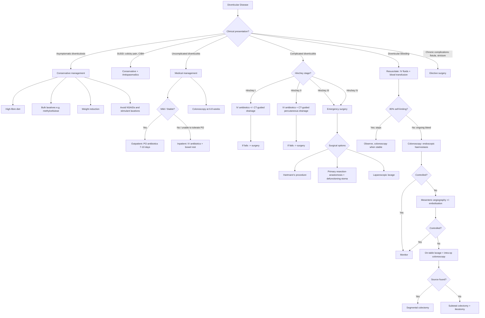

## Management of Diverticular Disease

Management of diverticular disease is entirely dictated by **which clinical entity you're dealing with** — asymptomatic diverticulosis, uncomplicated diverticulitis, complicated diverticulitis (staged by Hinchey), diverticular bleeding, or chronic complications like fistula and stricture. Let me walk you through each systematically.

---

### 1. Overall Management Algorithm

---

### 2. Management of Asymptomatic Diverticulosis

***Management: Conservative*** [5]

The vast majority (~80%) of people with diverticulosis remain asymptomatic and need **no medical or surgical treatment** — just risk factor modification to prevent progression.

| Intervention | Rationale |
|---|---|
| ***High-fibre diet*** [4] | Increases stool bulk → reduces intraluminal pressure (the fundamental pathogenic mechanism) → fewer new diverticula form and existing diverticula are less likely to become symptomatic. Aim for 25–30 g fibre/day |
| ***Bulk laxatives*** (e.g., ***methylcellulose***, psyllium/ispaghula husk) [4] | Hydrophilic agents that absorb water and swell → increase stool bulk → reduce colonic segmentation pressures. Unlike stimulant laxatives, these do NOT cause uncontrolled contractions |
| ***Weight reduction*** [4] | Obesity increases intra-abdominal pressure and promotes chronic inflammation |
| ***Avoid NSAIDs*** [4] | NSAIDs disrupt mucosal barrier (inhibit prostaglandin-mediated mucosal protection) → increase risk of microperforation and diverticular bleeding |
| ***Avoid stimulant laxatives*** [4] | Stimulant laxatives (e.g., senna, bisacodyl) cause forceful uncoordinated colonic contractions → increase intraluminal pressure → worsen diverticular disease. This is counterintuitive — patients think "laxatives help" but the wrong type makes things worse |
| Regular physical activity | Improves colonic motility and transit time, reducing intraluminal pressure |

<Callout title="Stimulant vs Bulk Laxatives — Know the Difference" type="error">
Students commonly recommend "laxatives" generically. In diverticular disease, **bulk-forming laxatives (methylcellulose, psyllium) are beneficial** but **stimulant laxatives (senna, bisacodyl) are harmful** because they cause high-pressure uncoordinated contractions. Always specify the type.
</Callout>

### 3. Management of SUDD

***Antispasmodics if colicky pain*** [4]:
- Mebeverine or hyoscine butylbromide — direct smooth muscle relaxants that reduce colonic spasm without affecting normal peristalsis
- Plus all the conservative measures above (high-fibre diet, bulk laxatives, weight loss)
- Some patients benefit from low-dose tricyclic antidepressants for visceral hypersensitivity (similar to IBS management)

---

### 4. Management of Uncomplicated Acute Diverticulitis

> ***Treatment: IV antibiotics*** [5]

> ***Colonoscopy at 6–8 weeks to rule out malignancy*** [5]

The goal is to **control the infection from the microperforation** with antibiotics and **rest the bowel** to allow healing.

#### Antibiotic Rationale

The colonic flora involved in diverticulitis include **Gram-negative aerobes** (e.g., *E. coli*, *Klebsiella*) and **anaerobes** (e.g., *Bacteroides fragilis*). Antibiotic regimens must therefore cover **both Gram-negatives AND anaerobes** [4].

#### A. Outpatient Treatment (Mild, Stable Patients)

**Who qualifies**: immunocompetent, tolerating oral intake, no significant comorbidities, reliable follow-up, no CT evidence of complications (Hinchey 0 — simple diverticulitis without abscess).

| Regimen | Duration | Spectrum |
|---|---|---|
| **Amoxicillin-clavulanate** (Augmentin) | 7–10 days | Broad-spectrum: GN aerobes + anaerobes (clavulanate = β-lactamase inhibitor extending amoxicillin's spectrum) |
| **Metronidazole + Co-trimoxazole** (TMP-SMX) | 7–10 days | Metronidazole covers anaerobes; co-trimoxazole covers GN aerobes |
| **Ciprofloxacin** (+ metronidazole if needed) | 7–10 days | Fluoroquinolone with excellent GN cover; add metronidazole for anaerobic coverage |
| **Moxifloxacin** | 7–10 days | 4th-generation fluoroquinolone with inherent anaerobic coverage (no need to add metronidazole) |

[3]

<Callout title="Evolving Practice — Antibiotics for Uncomplicated Diverticulitis" type="idea">
Recent evidence (AVOD trial 2012, DIABOLO trial 2017) suggests that **antibiotics may NOT be necessary** for truly uncomplicated diverticulitis in immunocompetent patients without systemic signs. Some guidelines now recommend **observation without antibiotics** for mild uncomplicated cases. However, for exam purposes, the standard teaching remains **antibiotics for 7–10 days** unless the examiner specifically asks about latest evidence.
</Callout>

#### B. Inpatient Treatment (More Severe / Cannot Tolerate PO)

**Who qualifies**: unable to tolerate oral intake, significant comorbidities, immunocompromised, failed outpatient treatment, or CT shows early complications.

| Component | Details | Rationale |
|---|---|---|
| **Bowel rest (NPO)** | Nil by mouth | Reduces colonic motility and intraluminal pressure → allows the microperforation to seal; reduces ongoing bacterial contamination of the pericolic space |
| **IV fluid resuscitation** | Isotonic crystalloids (NS, Hartmann's) | Replace losses from reduced oral intake, vomiting, third-space fluid sequestration |
| **IV antibiotics** | ***Piperacillin-tazobactam*** (Tazocin) **OR** ***Metronidazole + Cephalosporin/Fluoroquinolone*** [3] | Piperacillin-tazobactam: ultra-broad spectrum covering GN aerobes, anaerobes, and many Gram-positives. Alternative: metronidazole (anaerobes) + ceftriaxone or ciprofloxacin (GN aerobes) |
| **Analgesia** | Paracetamol first-line; avoid opioids if possible | Opioids slow colonic transit → increase intraluminal pressure; but may be needed for severe pain |
| **Monitoring** | Clinical: pain, fever, abdominal exam, vitals; Bloods: WCC, CRP trending | Look for improvement within 48–72 hours; failure to improve suggests complication (abscess, perforation) |

> After resolution: ***Colonoscopy at 6–8 weeks to rule out malignancy*** [5]

---

### 5. Management of Complicated Diverticulitis

> ***Resuscitation with IVF + antibiotics. Percutaneous drainage for abscess. Consider emergency surgery*** [5]

#### Indications for Emergency Surgery [3][5]

***Consider emergency surgery when*** [5]:
- ***Unresponsive to antibiotics***
- ***Septic shock (high fever, tachycardia, hypotension, oliguria)***
- ***Generalised peritonitis (Hinchey III and IV)***

Additional indications [3]:
- Frank (free) perforation
- Colonic obstruction not amenable to conservative management
- Abscess failing non-operative intervention (CT-guided drainage)

#### Management by Hinchey Stage

| ***Hinchey Stage*** | ***Management*** | ***Rationale*** |
|---|---|---|
| ***I — Pericolic abscess*** | ***IV antibiotics ± CT-guided percutaneous drainage*** [4][5] | Small pericolic abscess ( < 5 cm) may resolve with antibiotics alone. Larger abscess ( ≥ 5 cm) requires drainage to achieve source control. CT-guided drainage avoids surgery in many patients |
| ***II — Distant abscess (pelvic/retroperitoneal)*** | ***IV antibiotics + CT-guided percutaneous drainage*** [4][5] | Distant abscess is too large and too far from the primary site to resolve with antibiotics alone; percutaneous drainage achieves source control and may serve as a "bridge" to interval elective surgery |
| ***III — Generalised purulent peritonitis*** | ***Emergency surgery*** [4][5] | Ruptured abscess has contaminated the peritoneal cavity → conservative management will not achieve source control → requires operative washout and resection |
| ***IV — Generalised faecal peritonitis*** | ***Emergency surgery (Hartmann's procedure)*** [4][5] | Free bowel perforation with faecal contamination → highest mortality (50%) → definitive surgical source control is mandatory |

#### When Conservative Management Fails [3][4]

If a patient on IV antibiotics ± drainage does **not improve within 48–72 hours** (persistent fever, worsening pain, rising WCC/CRP), you must:
1. **Repeat CT** to reassess — look for enlarging abscess, new perforation, or missed diagnosis
2. **Escalate to surgery** if the source is not controllable non-operatively

---

### 6. Surgical Treatment Options

***Surgical options*** [5]: ***Resection, Primary anastomosis, Stoma (Hartmann's), Laparoscopic lavage*** [5]

#### A. Colonic Resection with Primary Anastomosis (1-Stage Procedure)

| Feature | Details |
|---|---|
| **Indication** | ***Hinchey I or II*** diverticulitis (localised contamination) where the patient can tolerate preoperative bowel preparation and tissues are not too oedematous/inflamed [3] |
| **What's done** | Resection of the diseased colonic segment including the abscess, with immediate anastomosis (joining the two bowel ends) |
| **Resection margins** | **Proximal**: where colon becomes soft, uninflamed, and non-oedematous. It is ***NOT necessary to resect all diverticulum-bearing colon*** since diverticula in the transverse or descending colon rarely cause further symptoms [3]. **Distal**: upper 1/3 of the rectum (because the rectum is NEVER involved in diverticulitis — taeniae coli have fused by that point) [3] |
| **Advantage** | Single operation; no stoma; better quality of life |
| **Risk** | Anastomotic leak — higher risk if performed in contaminated/inflamed field |

<Callout title="Resection Margins — A Classic Exam Point">
You do NOT need to resect every single diverticulum. The proximal margin is where the colon becomes soft and uninflamed. The distal margin must reach the **upper rectum** — ***inadequate distal margin is the most common cause of recurrent diverticulitis after resection*** [4]. This is because the diseased, high-pressure sigmoid colon must be completely removed; leaving even a short stump of sigmoid leads to recurrence.
</Callout>

#### B. Hartmann's Procedure (2-Stage Procedure)

> ***The MOST commonly performed and preferred approach*** for emergency surgery [3]

| Feature | Details |
|---|---|
| **Indication** | ***Hinchey III or IV*** diverticulitis (diffuse contamination) [3][4]. Also used when anastomosis is too risky (haemodynamic instability, severe contamination, immunosuppression) |
| **Stage I** | Resection of the diseased colonic segment → creation of an **end colostomy** (proximal limb brought out as a stoma to divert the faecal stream) + creation of a **rectal stump** (Hartmann's pouch) by oversewing the distal rectum [3] |
| **Stage II** (reversal, typically 3–6 months later) | Intestinal continuity is re-established by a **descending colorectostomy** (takedown of colostomy and anastomosis to the rectal stump) [3] |
| **Why 2-stage?** | ***Primary anastomosis is contraindicated in Hinchey III-IV*** because excessive contamination and inflamed/oedematous tissues dramatically increase the risk of **anastomotic leak** [3][4] — an anastomotic leak in a septic patient with peritonitis would be catastrophic |
| **Disadvantage** | Stoma-related morbidity; reversal of Hartmann's is a technically challenging operation (adhesions, difficult pelvic dissection to find the rectal stump); up to 30-40% of Hartmann's procedures are never reversed |

**Why is anastomotic leak so dangerous?**
An anastomotic leak means the joined bowel ends have separated → faecal matter leaks into the peritoneal cavity → peritonitis, sepsis, multi-organ failure. Risk factors for leak include ischaemia, tension, infection, malnutrition, steroids, and performing anastomosis in a contaminated field [4]. This is exactly why you DON'T do a primary anastomosis in Hinchey III-IV.

#### C. Colonic Resection with Primary Anastomosis + Defunctioning Loop Ileostomy (2-Stage Procedure)

| Feature | Details |
|---|---|
| **Indication** | ***Hinchey III or IV*** in **stable patients** where the bowel is not excessively oedematous [3]; OR Hinchey I-II with relative contraindication to primary anastomosis alone |
| **What's done** | Resection + primary anastomosis (as in 1-stage) BUT with a **proximal defunctioning loop ileostomy** to divert the faecal stream away from the anastomosis → protects the anastomosis while it heals |
| **Stage II** | Reversal of the loop ileostomy (a technically **simpler** procedure than reversal of Hartmann's) [3] |
| **Advantage over Hartmann's** | Maintains bowel continuity from the outset; reversal of loop ileostomy is easier than takedown of a Hartmann's pouch [3] |
| **Disadvantage** | Only appropriate in stable patients; still requires a second operation |

#### D. Laparoscopic Lavage

> ***Laparoscopic lavage — feasible*** [5]

| Feature | Details |
|---|---|
| **Indication** | ***Hinchey III*** (purulent peritonitis) — the bowel wall itself is intact (no free faecal perforation) [3][5] |
| **What's done** | Laparoscopic washout of the peritoneal cavity with warm saline + placement of drains. The diseased bowel segment is **NOT resected** |
| **Rationale** | In Hinchey III, the peritonitis is from a ruptured abscess (pus), not a free bowel perforation. The bowel wall is intact. So theoretically, washing out the pus and giving antibiotics may be sufficient without the morbidity of resection + stoma |
| **Advantage** | Avoids bowel resection and stoma; faster recovery; lower morbidity |
| **Controversy** | ***This approach remains controversial and requires additional prospective trials before formal recommendations*** [3]. The SCANDIV and LOLA trials showed higher re-intervention rates with lavage compared to resection. Current consensus: may be considered in selected cases (Hinchey III, stable patient) but NOT standard of care |
| **Contraindication** | Hinchey IV (faecal peritonitis) — you CANNOT just wash out faecal contamination without resecting the perforated bowel |

---

### 7. Elective (Interval) Colectomy

***Interval colectomy*** — this is a planned sigmoid colectomy with primary anastomosis performed **after resolution of the acute episode** (typically 6–12 weeks later) [5].

#### Indications for Elective Interval Colectomy [3][5]

| Indication | Rationale |
|---|---|
| ***Previous complicated diverticulitis*** | History of abscess, perforation, fistula, or obstruction indicates high-risk anatomy prone to recurrence and further complications [3][5] |
| ***Immunocompromised patients*** | Impaired immune response means complications are harder to manage conservatively; lower threshold for surgery. These patients may not mount the usual inflammatory "walling-off" response → higher risk of free perforation |
| ***Inability to exclude malignancy*** | If colonoscopy post-recovery cannot definitively exclude CRC (e.g., stricture preventing passage of scope, persistent mass), resection serves both therapeutic and diagnostic purposes [3] |
| ***Patients with complicated disease, aged > 50, female, the privately insured, and those at teaching hospitals*** [5] | Epidemiological data showing these groups are more likely to undergo and benefit from interval colectomy |
| **Chronic fistula** | Colovesical or colovaginal fistula will not close spontaneously — requires surgical resection |
| **Chronic stricture causing obstruction** | Fibrotic stricture will not resolve with antibiotics — needs resection |

#### What Is NO LONGER an Indication [3][5]

> ***Recurrent episodes of uncomplicated diverticulitis*** — this is **NO LONGER** an automatic indication for surgery [3]

***"Outcomes of > 2 episodes of attacks are not worse"*** [5]

***"85% do not recur after initial medical treatment"*** [5]

- **Old teaching**: after 2 episodes of uncomplicated diverticulitis, patients should undergo elective colectomy (the "2-strike rule") because it was believed the risk of complications increased with each recurrence
- **Current evidence**: this has been **disproven**. The risk of complications does NOT significantly increase with recurrent uncomplicated episodes. Most patients (85%) will not have a recurrence after successful medical treatment of their first episode [3][5]
- **Current practice**: decision for surgery is based on the **severity of episodes and patient factors** (complications, immunosuppression, inability to exclude malignancy), NOT simply the number of episodes

> ***Recurrence rate: 10–30% in the first decade after initial attack*** [5]

> ***Elective interval colectomy: not related to recurrence episodes*** [5]

<Callout title="The 2-Strike Rule Is Dead" type="error">
This is a very commonly tested concept. The old "2 attacks = surgery" rule is **outdated**. Modern guidelines (AGA 2015, ASCRS 2020) recommend surgery based on **disease severity and patient factors**, not simply the number of episodes. Know this for your exam — it's a favourite trap question.
</Callout>

#### Surgical Technique for Elective Colectomy

- **Sigmoid colectomy with primary anastomosis** (1-stage procedure)
- Can be performed **laparoscopically** (preferred — less morbidity, faster recovery, fewer adhesions)
- Same resection margin principles: proximal = soft uninflamed colon; distal = upper rectum
- No stoma needed (bowel is not inflamed/contaminated at the time of elective surgery)

---

### 8. Management of Specific Complications

#### A. Abscess

| Size / Response | Management |
|---|---|
| **Small ( < 5 cm)** | IV antibiotics alone — likely to resolve [4] |
| **Large ( ≥ 5 cm)** | ***CT-guided percutaneous drainage*** + IV antibiotics [4][5] |
| **Failed drainage / persistent sepsis** | Emergency surgery (resection ± stoma) [3][5] |

**Why CT-guided drainage works**: inserting a drain directly into the abscess cavity under CT guidance achieves **source control** — the pus is evacuated, the bacterial load is dramatically reduced, and antibiotics can then sterilise the residual infection. This often converts what would have been an emergency operation into a controlled situation amenable to interval elective surgery.

#### B. Fistula [3][4]

- **Colovesical fistula** (most common): ***Resection of affected colon + omental pedicle interposition between bowel and bladder*** (to prevent recurrent fistulation) ***+ synchronous repair of bladder*** (primary closure) [4]
- **Colovaginal fistula**: resection of affected colon + primary closure or repair of vaginal defect
- **Coloenteric / colocutaneous fistula**: resection of affected colon ± repair of secondary organ
- Management principle: **control sepsis first** (antibiotics, drainage), then **definitive surgery** — resection of the fistula-bearing colon with repair of the secondarily involved organ [3]

> ***Fistula is usually managed at the index operation with resection of the affected segment of colon*** [3]

#### C. Obstruction

| Type | Mechanism | Management |
|---|---|---|
| **Partial obstruction** (acute) | Pericolonic inflammation/oedema or compression by abscess → luminal narrowing | Conservative: bowel rest, IV fluids, NG decompression, IV antibiotics → usually resolves with resolution of inflammation |
| **Complete obstruction** (chronic) | Recurrent diverticulitis → progressive fibrosis → stricture | May require endoscopic stenting as a bridge to surgery, or direct surgical resection. Hartmann's in emergency; primary anastomosis with on-table lavage if stable |
| **SBO from adhesion** | Small bowel adheres to inflamed sigmoid colon | Standard SBO management: drip and suck → surgical adhesiolysis if not resolving |

#### D. Perforation with Peritonitis [3][4][5]

***Emergency surgery*** — the management depends on Hinchey stage:
- Hinchey III: Hartmann's procedure OR primary anastomosis with defunctioning stoma OR laparoscopic lavage (in selected cases)
- Hinchey IV: ***Hartmann's procedure*** with on-table peritoneal lavage [4]

---

### 9. Management of Diverticular Bleeding

> ***Common cause of severe GI bleeding. Intermittent bleeding. 80% self-limiting*** [1][5]

#### Step 1: Resuscitation [3]

| Action | Details |
|---|---|
| **IV access** | Two large-bore (16G or 14G) peripheral cannulae |
| **IV fluids** | Rapid bolus of isotonic crystalloid (NS or Hartmann's) |
| **Blood transfusion** | Transfuse if Hb < 7 g/dL (low-risk) or < 9 g/dL (high-risk, e.g., elderly, IHD) [3] |
| **Cross-match** | Group and save; cross-match 4–6 units packed RBCs |
| **Correct coagulopathy** | FFP for coagulopathy; platelets if thrombocytopaenic; withhold anticoagulants/antiplatelets (weigh against thrombotic risk) [3] |
| **Monitoring** | Vital signs, urine output, cardiac monitoring |

#### Step 2: Localisation and Haemostasis — Stepwise Escalation

***Investigation: Colonoscopy. Management: Conservative → Endoscopic haemostasis → Angiogram ± embolisation*** [5]

| Step | Modality | Details |
|---|---|---|
| **1st line** | ***Conservative*** [5] | ***50% of diverticular bleeding stops spontaneously*** [4]. Observe with ongoing resuscitation |
| **2nd line** | ***Colonoscopy with endoscopic haemostasis*** [5] | Identify the bleeding diverticulum and achieve haemostasis: **adrenaline injection (1:10,000)** (vasoconstriction — NOT used alone) + **metallic clips** or **band ligation** (mechanical compression of the bleeding vessel) [3][4] |
| **3rd line** | ***Mesenteric angiography ± embolisation*** [5] | When colonoscopy fails to localise or control bleeding. Selective catheterisation of the bleeding artery → superselective embolisation (coils, gelfoam). Detects bleeding > 1 mL/min [3] |
| **4th line** | **On-table lavage with intraoperative colonoscopy** | Bowel lavage through a caecostomy/appendicostomy during laparotomy → colonoscopy to identify bleeding source intraoperatively [4] |
| **Last resort** | ***Subtotal colectomy + ileostomy*** [4] | When the bleeding source ***cannot be identified*** despite all the above. Removing the entire colon eliminates the source regardless of location. Significant morbidity — reserved as a life-saving measure |

***Localisation of bleeding: colonoscopy → angiography → on-table lavage and colonoscopy → subtotal colectomy and ileostomy*** [4]

#### Indications for Emergency Laparotomy in Diverticular Bleeding [3]

| Indication | Rationale |
|---|---|
| **Haemodynamically unstable despite adequate resuscitation** | Ongoing arterial haemorrhage exceeding the body's compensatory capacity |
| **Excessive blood transfusion > 6 units** | Massive transfusion carries its own complications (hypothermia, coagulopathy, hyperkalaemia, citrate toxicity) — continued bleeding requiring this much blood warrants definitive surgical control |
| **Frequent rebleeding or persistent bleeding** | Endoscopic/angiographic measures have failed to achieve durable haemostasis |

---

### 10. Management of Right-Sided Diverticulitis (Hong Kong Relevance)

Right-sided (caecal) diverticulitis deserves special mention because it is **more common in Asian populations** and is managed differently:

| Feature | Approach |
|---|---|
| **Uncomplicated right-sided diverticulitis** | Conservative management with IV antibiotics (same principles as left-sided) |
| **Complicated / recurrent right-sided diverticulitis** | **Right hemicolectomy** (NOT Hartmann's — Hinchey classification does not apply to right-sided disease) |
| **Diagnostic challenge** | CT abdomen to distinguish from acute appendicitis (see DDx section) |

---

### 11. Summary Table: Management by Clinical Scenario

| Scenario | Management |
|---|---|
| **Asymptomatic diverticulosis** | ***Conservative: high-fibre diet, bulk laxatives, weight reduction. Avoid NSAIDs and stimulant laxatives*** |
| **SUDD** | Conservative + ***antispasmodics*** for colicky pain |
| **Uncomplicated diverticulitis (outpatient)** | ***PO antibiotics 7–10 days*** (Augmentin, or metronidazole + co-trimoxazole/ciprofloxacin, or moxifloxacin) |
| **Uncomplicated diverticulitis (inpatient)** | ***IV antibiotics*** (pip-taz OR metronidazole + cephalosporin/fluoroquinolone) + bowel rest |
| **Hinchey I** | ***IV antibiotics ± CT-guided drainage*** |
| **Hinchey II** | ***IV antibiotics + CT-guided percutaneous drainage*** |
| **Hinchey III** | ***Emergency surgery: Hartmann's / primary anastomosis + defunctioning stoma / laparoscopic lavage*** |
| **Hinchey IV** | ***Emergency surgery: Hartmann's procedure*** |
| **Diverticular bleeding** | ***Resuscitate → conservative (50% self-limiting) → colonoscopy (endoscopic haemostasis) → angiography ± embolisation → surgery*** |
| **Fistula** | ***Elective resection of affected colon + repair of secondary organ*** |
| **Stricture/obstruction** | ***Elective resection*** if chronic; emergency surgery if acute complete obstruction |
| **Interval colectomy** | For ***complicated diverticulitis history, immunocompromised, inability to exclude malignancy.*** NOT for recurrent uncomplicated episodes |

---

<Callout title="High Yield Summary">

**Asymptomatic diverticulosis**: conservative only — high-fibre diet, bulk laxatives (NOT stimulant laxatives), avoid NSAIDs, weight loss.

**Uncomplicated diverticulitis**: antibiotics covering GN aerobes + anaerobes (outpatient: Augmentin or metronidazole + ciprofloxacin; inpatient: piperacillin-tazobactam or metronidazole + cephalosporin). Colonoscopy at 6–8 weeks to exclude CRC.

**Complicated diverticulitis by Hinchey stage**: I–II = IV antibiotics + CT-guided drainage; III–IV = emergency surgery. Hartmann's procedure is the most commonly performed emergency operation (2-stage: resection + end colostomy → later reversal).

**Primary anastomosis is contraindicated in Hinchey III–IV** due to risk of anastomotic leak in the contaminated/inflamed field.

**Laparoscopic lavage** is feasible for Hinchey III but remains controversial.

**Inadequate distal resection margin is the MC cause of recurrent diverticulitis post-surgery** — always resect down to the upper rectum.

**The "2-strike rule" is dead**: recurrent uncomplicated diverticulitis alone is NOT an indication for surgery. 85% do not recur after initial medical treatment.

**Diverticular bleeding**: 80% self-limiting. Stepwise escalation: conservative → colonoscopy (clips/adrenaline) → angiography ± embolisation → on-table lavage → subtotal colectomy if source unidentifiable.

**Indications for emergency surgery**: free perforation, failed antibiotics, septic shock, generalised peritonitis (Hinchey III–IV), obstruction, abscess failing drainage. Indications for laparotomy in bleeding: haemodynamic instability despite resuscitation, > 6 units transfused, persistent/recurrent bleeding.
</Callout>

---

<ActiveRecallQuiz
  title="Active Recall - Management of Diverticular Disease"
  items={[
    {
      question: "Why is primary anastomosis contraindicated in Hinchey III and IV diverticulitis, and what procedure is preferred instead?",
      markscheme: "Primary anastomosis is contraindicated because excessive peritoneal contamination and inflammation of surrounding tissues dramatically increase the risk of anastomotic leak. Hartmann's procedure is preferred: resection of diseased segment, creation of end colostomy, and closure of rectal stump. Reversal performed later when inflammation has settled."
    },
    {
      question: "A patient with known diverticulosis presents with 3 episodes of uncomplicated diverticulitis over 5 years, each successfully treated with antibiotics. Should you recommend elective colectomy? Explain your reasoning.",
      markscheme: "No. Recurrent uncomplicated diverticulitis is NO LONGER an indication for elective surgery (the 2-strike rule is outdated). Evidence shows that outcomes after more than 2 episodes are not worse, and 85% do not recur after initial medical treatment. Surgery should be based on disease severity and patient factors (complicated disease, immunosuppression, inability to exclude malignancy), not number of episodes."
    },
    {
      question: "Describe the stepwise escalation algorithm for managing diverticular bleeding that fails to stop spontaneously.",
      markscheme: "Step 1: Colonoscopy with endoscopic haemostasis (adrenaline injection + metallic clips). Step 2: If colonoscopy fails, mesenteric angiography with selective embolisation. Step 3: On-table lavage with intraoperative colonoscopy to localise the source. Step 4: If source still unidentifiable, subtotal colectomy with ileostomy."
    },
    {
      question: "What is the most common cause of recurrent diverticulitis after surgical resection, and how is it prevented?",
      markscheme: "Inadequate distal resection margin is the MC cause. The distal margin must extend to the upper third of the rectum, as the rectum is never affected by diverticular disease (taeniae coli have fused). Leaving a sigmoid stump preserves the high-pressure zone prone to recurrence."
    },
    {
      question: "Name 4 valid indications for elective interval colectomy in diverticular disease.",
      markscheme: "1. Previous complicated diverticulitis (abscess, perforation, fistula). 2. Immunocompromised patients (lower threshold due to impaired ability to wall off perforation). 3. Inability to exclude malignancy on colonoscopy. 4. Chronic fistula (e.g. colovesical fistula) or chronic stricture causing obstruction."
    },
    {
      question: "Why should stimulant laxatives be avoided but bulk-forming laxatives are recommended in diverticular disease?",
      markscheme: "Stimulant laxatives (e.g. senna, bisacodyl) cause forceful uncoordinated colonic contractions that increase intraluminal pressure, worsening diverticular disease. Bulk-forming laxatives (e.g. methylcellulose, psyllium) absorb water and increase stool bulk, reducing the need for high-pressure segmental contractions and thus lowering intraluminal pressure."
    }
  ]}
/>

## References

[1] Lecture slides: Diverticular diseases - Dr. J Tsang.pdf (p8)
[2] Lecture slides: GC 195. Lower and diffuse abdominal pain RLQ problems; pelvic inflammatory disease; peritonitis and abdominal emergencies.pdf (p19)
[3] Senior notes: felixlai.md (Diverticular disease section — Treatment)
[4] Senior notes: maxim.md (Diverticular disease section — Management)
[5] Lecture slides: Diverticular diseases - Dr. J Tsang.pdf (p6, p7, p10, p13, p14, p16)
