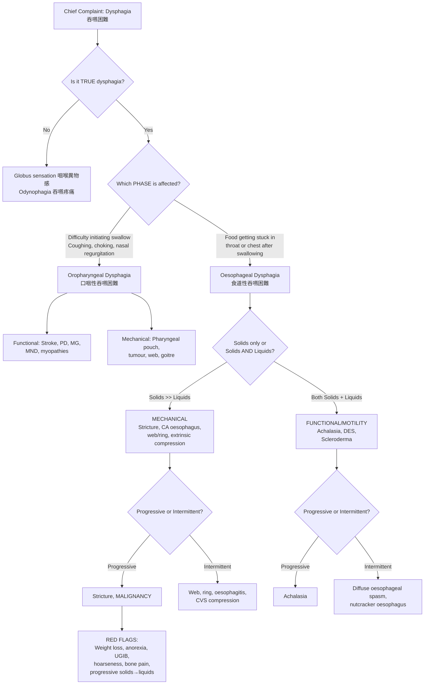

# History Taking: Dysphagia (吞嚥困難)

---

## Master Framework: Mermaid Diagram

---

## 1. Confirm True Dysphagia

Before diving in, you need to make sure the patient is actually describing dysphagia and not something else. This is a classic OSCE pitfall.

- **"Can you describe exactly what you mean by difficulty swallowing?"** (你可唔可以形容下你吞嘢嘅時候有咩唔舒服？)
  - ***Globus sensation***: feeling of a lump in the throat without actual difficulty swallowing — benign, often anxiety-related [1][2]
  - ***Odynophagia***: pain on swallowing — can coexist with but ≠ dysphagia (suggests oesophagitis, caustic ingestion, or late CA oesophagus) [2][3]
  - True dysphagia = actual difficulty in the passage of food/liquid from mouth to stomach

> **Why this matters**: Examiners love to test whether you can differentiate globus from true dysphagia. A patient who says "I feel a lump" but swallows fine does NOT have dysphagia. Mixing these up is an instant mark-loser.

---

## 2. History of Presenting Illness (HPI)

### 2A. Oropharyngeal vs Oesophageal

| Question | Phrasing | Cantonese | Why It Matters |
|---|---|---|---|
| **Difficulty initiating swallow?** | "Do you have trouble starting a swallow, or does food get stuck after you've swallowed?" | 你係開始吞嘅時候有困難，定係吞咗之後覺得嘢卡住？ | ***Oropharyngeal dysphagia*** = difficulty initiating; ***oesophageal*** = food sticking [2][3] |
| **Where does food get stuck?** | "Can you point to where food gets stuck?" | 你可唔可以指吓邊度覺得嘢卡住？ | Cervical region → oropharyngeal; suprasternal/retrosternal → oesophageal. BUT oesophageal dysphagia may be perceived at cervical region (referred sensation) [3] |
| **Coughing/choking/nasal regurgitation?** | "Do you cough, choke, or have food/liquid come out of your nose when swallowing?" | 你吞嘢嘅時候會唔會嗆到、咳、或者有嘢由鼻出返嚟？ | Nasal regurgitation and choking are hallmarks of ***oropharyngeal dysphagia*** [2][3] |

### 2B. Mechanical vs Functional (Motility)

This is the **key clinical distinction** for oesophageal dysphagia [2][3]:

| Feature | Mechanical | Functional (Motility) |
|---|---|---|
| **Type of food** | ***Solids >> liquids*** | ***Both solids + liquids*** |
| **Onset** | Can be gradual or sudden | Usually gradual |
| **Progression** | Often progressive | Variable |
| **Response to bolus** | Regurgitation | Usually passes with drinking liquid or repeated swallowing |
| **Temperature variation** | None | May vary with temperature |
| **If intermittent** | Webs, rings, oesophagitis, CVS compression | Diffuse oesophageal spasm, nutcracker oesophagus |
| **If progressive** | Strictures, ***malignancy*** | ***Achalasia*** |

**Key questions:**

- **"Do you have trouble with solids, liquids, or both?"** (你吞固體嘢、液體嘢、定兩樣都有困難？)
  - ***Inability to swallow liquids suggests a motility disorder; solids progressing to liquids suggests mechanical obstruction*** [1][2]
- **"Are your symptoms getting worse over time, staying the same, or coming and going?"** (你啲症狀係越嚟越差、維持不變、定時有時無？)
  - ***Rapidly progressive dysphagia suggests malignancy*** [1][2]
  - Intermittent dysphagia suggests primary or secondary motility disorders [1]
- **"Does drinking water help push the food down?"** (飲水可唔可以幫到啲嘢吞落去？)
  - Functional causes: bolus usually passes with liquid or repeated swallowing [3]

### 2C. Onset and Timeline

- **"When did this start? Days, weeks, or months?"** (幾時開始？幾日、幾個禮拜定幾個月？)
  - Acute onset → foreign body, stroke, acute oesophagitis
  - Weeks → ***painless progressive dysphagia over weeks is malignancy until proven otherwise*** [2]
  - Months to years → stricture, achalasia, neurodegenerative disease
- **"Was there anything happening when it started?"** (開始嗰陣有冇發生過咩事？)
  - Precipitant: recent meal (foreign body), stroke (sudden neuro deficit), corrosive ingestion

### 2D. Associated Symptoms

| Symptom | Question | Cantonese | Significance |
|---|---|---|---|
| **Odynophagia** | "Is swallowing painful?" | 吞嘢痛唔痛？ | Oesophagitis (drug-induced, reflux, infectious, radiation), caustic ingestion, ***late CA oesophagus*** [3] |
| **Heartburn/Regurgitation** | "Do you get a burning feeling behind your breastbone? Acid taste in mouth?" | 你胸口後面有冇灼熱感？口入面有冇酸味？ | GERD → peptic stricture, Barrett's oesophagus → adenocarcinoma [5] |
| **Weight loss/Anorexia** | "Have you lost weight recently? How much over what period?" | 你最近有冇瘦咗？瘦咗幾多？幾耐？ | ***Constitutional symptoms → malignancy***; also occurs in achalasia [3][4] |
| **Hoarseness** | "Has your voice changed?" | 你把聲有冇變？ | ***Invasion of recurrent laryngeal nerve → locally advanced CA oesophagus*** [1][3]; also consider CA lung, CA larynx [8] |
| **Haematemesis/Melaena** | "Have you vomited blood or had black stools?" | 你有冇嘔血或者痾黑色大便？ | UGIB from tumour, oesophagitis, peptic ulcer [1][3] |
| **Regurgitation of undigested food** | "Does food come back up undigested?" | 有冇未消化嘅嘢食返上嚟？ | Achalasia, pharyngeal pouch (Zenker's diverticulum) [2][3] |
| **Halitosis** | "Have people commented on your breath?" | 有冇人話你有口氣？ | ***Pharyngeal diverticulum*** [3][4] |
| **Choking/Aspiration** | "Do you cough at night? Recurrent chest infections?" | 你夜晚會唔會咳？有冇成日肺部感染？ | Aspiration pneumonia from oropharyngeal dysphagia or achalasia [3] |
| **Neurological symptoms** | "Any weakness, slurred speech, double vision?" | 有冇手腳冇力、講嘢唔清楚、或者睇嘢重影？ | Stroke, MND, myasthenia gravis, MS, Parkinson's [2][3] |
| **Referred otalgia** | "Any ear pain?" | 有冇耳仔痛？ | ***Oropharyngeal or hypopharyngeal tumour*** [9] |
| **Neck lump** | "Have you noticed any lumps in your neck?" | 你有冇發覺頸有粒嘢？ | Cervical lymphadenopathy → metastasis (CA oesophagus, CA hypopharynx, CA thyroid) [4][9] |

<Callout title="Painless Progressive Dysphagia = Malignancy Until Proven Otherwise" type="error">
This is the single most important clinical teaching point. If a patient (especially >50 years, male, smoker/drinker) describes progressively worsening dysphagia over weeks — first for solids, then for liquids — you MUST think oesophageal carcinoma [2][3][4].
</Callout>

---

## 3. Red-Flag Features of CA Oesophagus

These must be actively screened for [3][4]:

- ***Risk factors***: smoker, drinker, chronic GERD, Barrett's oesophagus, achalasia, FHx of oesophageal CA
- ***Dysphagia***: recent onset, progressively worsening (solids → liquids)
- ***Other local symptoms***: UGIB (coffee ground vomiting, melaena), odynophagia (late feature)
- ***Local invasion***: hoarseness (RLN), T-spine bone pain (vertebral invasion), fever/cough/haemoptysis (tracheal invasion), massive haematemesis (aortic invasion)
- ***Constitutional symptoms***: weight loss, anorexia, anaemic symptoms
- ***Metastasis***: neck lump, jaundice, bone pain

> **Why this matters**: In an OSCE, demonstrating that you can systematically screen for red flags shows clinical maturity. The examiner is looking for a structured approach — primary tumour effects → local invasion → distant spread → constitutional symptoms.

---

## 4. Targeted Systems Review

### ENT / Head & Neck
- Oral ulcers, non-healing mouth lesions, trismus → oral cavity/oropharyngeal tumour [9]
- Unilateral hearing loss, bloody nasal discharge → NPC (relevant in Hong Kong) [9]
- ***Globus → dysphagia, otalgia, hoarseness*** → hypopharyngeal carcinoma [9]
- Anterior neck swelling, compressive symptoms (dyspnoea, dysphagia, dysphonia) → goitre [6]

### Respiratory
- Cough, haemoptysis, chest pain → CA lung with oesophageal compression [8]
- Recurrent pneumonia → aspiration from oropharyngeal dysphagia or achalasia [3]

### Neurological
- Dysarthria, limb weakness, facial droop → stroke [2][3]
- Tremor, bradykinesia → Parkinson's disease [2]
- Fatigability, diplopia, ptosis → myasthenia gravis [2]
- Progressive weakness, fasciculations → MND [2]

### Rheumatological
- Raynaud's phenomenon, skin tightening, telangiectasia → ***systemic sclerosis (CREST)*** with oesophageal dysmotility [3][4]
- Proximal muscle weakness, skin rash → ***dermatomyositis/polymyositis*** with oesophageal involvement [7]
- Dry eyes, dry mouth → Sjögren's syndrome [1]

### GI
- Epigastric pain, early satiety, postprandial fullness → gastric cancer [4]
- Change in bowel habits → consider malignancy in general

---

## 5. Past Medical History

| Condition | Relevance |
|---|---|
| **Stroke** | Oropharyngeal dysphagia (most common cause in elderly) [1][2] |
| **Parkinson's disease** | Oropharyngeal dysphagia [1][2] |
| **Myasthenia gravis / MND / MS** | Neuromuscular oropharyngeal dysphagia [1][2] |
| **Systemic sclerosis** | ***Oesophageal dysmotility*** (CREST) [1][3] |
| **Sjögren's syndrome** | Dry mouth → difficulty with bolus formation [1] |
| **Diabetes mellitus** | Autonomic neuropathy → oesophageal dysmotility [1] |
| **GERD / Barrett's oesophagus** | Peptic stricture, ↑risk of adenocarcinoma [3][5] |
| **Previous caustic ingestion** | Stricture, ↑risk of squamous cell carcinoma [3] |
| **Achalasia** | Progressive motility disorder; itself a risk factor for oesophageal SCC [3] |
| **Dermatomyositis/Polymyositis** | Oesophageal dysphagia, aspiration [7] |

---

## 6. Past Surgical History

- **Previous surgery on oesophagus, stomach, larynx or spine** — can cause dysphagia from anatomical disruption, stricture, or nerve injury [1]
- **Previous head and neck surgery or radiotherapy** — fibrosis, stricture, xerostomia [1][9]
- **Abdominal surgery** — post-fundoplication dysphagia (too tight wrap)

---

## 7. Drug History

***Medications that cause drug-induced oesophagitis*** [1][3][4]:
- Potassium chloride (KCl)
- Bisphosphonates (e.g. alendronate)
- Antibiotics (e.g. doxycycline, tetracyclines)
- Aspirin / NSAIDs

Other relevant medications:
- Previous **radiotherapy** (radiation oesophagitis/stricture) [1]
- Anticholinergics, CCBs, nitrates (↓LES tone → GERD) [5]

**Allergy history**: Always ask — standard practice in OSCE.

<Callout title="Drug-Induced Oesophagitis" type="idea">
Ask specifically: "Do you take any tablets just before lying down? Do you take them with enough water?" Patients who take bisphosphonates or doxycycline at bedtime without adequate water are classic culprits for pill oesophagitis [3][4].
</Callout>

---

## 8. Family History

- **Family history of oesophageal cancer** or other GI malignancies → genetic predisposition [3]
- **Family history of head & neck cancer** → relevant in HK for NPC [9]
- **Family history of thyroid cancer** → medullary CA (MEN2), papillary CA [6]
- **Family history of autoimmune diseases** → systemic sclerosis, myasthenia gravis

---

## 9. Social History

| Factor | Question | Cantonese | Relevance |
|---|---|---|---|
| **Smoking** | "Do you smoke? How many per day? For how long?" | 你有冇食煙？一日幾多支？食咗幾耐？ | ***Classical risk factor for oesophageal SCC (and H&N cancer)*** [3][4][9] |
| **Alcohol** | "How much alcohol do you drink per week?" | 你一個禮拜飲幾多酒？ | ***Classical risk factor for oesophageal SCC*** [3][4][9] |
| **Betel nut (檳榔)** | "Do you chew betel nut?" | 你有冇食檳榔？ | Risk factor for oral/oropharyngeal SCC (relevant in HK/SE Asia) [9] |
| **Diet** | "Do you eat a lot of pickled/salted/preserved food?" | 你食唔食好多醃製嘢食？ | Nitrosamines → oesophageal/gastric cancer risk [4] |
| **Occupation** | Standard | 你做咩工作？ | Exposure to certain chemicals; also assess functional impact |
| **Oral sex / HPV** | If oropharyngeal tumour suspected | — | ***HPV-related oropharyngeal carcinoma*** [9] |

### Functional Baseline
- **"How is this affecting your eating? Can you manage solids, soft food, or only liquids now?"** (呢個問題影響咗你食嘢到咩程度？你而家食到固體嘢、軟嘢、定只係飲到嘢？)
  - Grading functional severity is crucial for management planning (e.g. need for NG tube, PEG)
- **"How is your energy and daily activity level?"**
- **Weight chart**: quantify weight loss if possible (e.g. "I've lost 10 kg in 3 months")

---

## 10. Differentiating Questions by Diagnosis

### CA Oesophagus (食道癌)
- Progressive dysphagia: solids → liquids over weeks [2][3][4]
- Weight loss, anorexia, UGIB
- Risk factors: ***smoking, alcohol, chronic GERD, Barrett's oesophagus, achalasia*** [3][5]
- Hoarseness (RLN invasion), bone pain (vertebral mets), jaundice (liver mets) [3]

### Peptic Stricture
- Background of longstanding GERD/heartburn [5]
- Dysphagia predominantly for solids, may be slowly progressive
- May or may not have current heartburn symptoms [5]

### Achalasia
- ***Progressive dysphagia for both solids AND liquids*** [2][3]
- Regurgitation of undigested food (often at night → aspiration)
- Weight loss (can mimic malignancy)
- Chest pain may be present
- ***Bird-beak appearance on barium swallow*** (classic viva answer)

### Pharyngeal Pouch (Zenker's Diverticulum)
- Elderly patient, ***halitosis***, regurgitation of undigested food [3][4]
- Gurgling in neck, neck lump that changes size
- **OGD is contraindicated if suspicious** (risk of perforation) [3]

### Oropharyngeal Dysphagia (Neurological)
- Hx of stroke, Parkinson's, MND, myasthenia gravis [2][3]
- Coughing, choking, nasal regurgitation with swallowing
- Dysarthria, nasal speech, drooling [3]
- Recurrent aspiration pneumonia [3]

### Extrinsic Compression
- ***Retrosternal goitre*** → ask about thyroid symptoms, neck swelling [6]
- ***CA lung*** → cough, haemoptysis, smoking history [8]
- ***Thoracic aortic aneurysm*** → elderly, hypertensive [2]
- ***Left atrial enlargement (mitral stenosis)*** → Ortner syndrome: hoarseness + dysphagia [10]

### Hypopharyngeal / Oropharyngeal Carcinoma
- ***Sore throat, referred otalgia, dysphagia, odynophagia, hoarseness*** [9]
- Risk factors: smoking, alcohol, oral sex (HPV) [9]
- ***Paterson-Brown-Kelly syndrome*** (iron-deficiency anaemia + post-cricoid web + dysphagia) → risk factor for post-cricoid carcinoma [9]

### Drug-Induced Oesophagitis
- Temporal relationship with starting new medication [1][3]
- Odynophagia > dysphagia
- Culprits: KCl, bisphosphonates, doxycycline, NSAIDs [1][3]

### Systemic Sclerosis (CREST)
- ***Calcinosis, Raynaud's, Esophageal dysmotility, Sclerodactyly, Telangiectasia*** [3][4]
- Dysphagia for both solids and liquids
- Chronic GERD symptoms [4]

---

## 11. Common Pitfalls in History Taking

<Callout title="Common OSCE Pitfalls" type="error">

1. **Not differentiating oropharyngeal from oesophageal dysphagia** — this is the FIRST branching point. If you skip this, your entire differential collapses.
2. **Forgetting to ask about solids vs liquids vs both** — this is the SECOND branching point that separates mechanical from functional causes.
3. **Not asking about progression** — intermittent vs progressive changes your differential entirely.
4. **Confusing globus with dysphagia** — globus is NOT dysphagia. Clarify at the start.
5. **Missing drug history** — pill oesophagitis is a common and treatable cause that students forget.
6. **Not screening for red flags systematically** — weight loss, UGIB, hoarseness, bone pain, jaundice.
7. **Ignoring NPC in Hong Kong** — always consider nasopharyngeal carcinoma in the HK context, especially with unilateral hearing loss, bloody nasal discharge, or cranial nerve palsies.
8. **Forgetting to ask about alcohol and smoking** — these are THE major modifiable risk factors for oesophageal SCC.

</Callout>

---

## 12. High-Yield Exam-Focused Interpretation Tips

| Clinical Clue | Most Likely Diagnosis | Exam Pearl |
|---|---|---|
| Progressive solids → liquids, weight loss, smoker/drinker | ***CA oesophagus*** | "Painless progressive dysphagia = malignancy until proven otherwise" [2] |
| Both solids + liquids from onset, regurgitation of undigested food | ***Achalasia*** | Bird-beak on barium swallow; manometry is gold standard |
| Intermittent dysphagia + chest pain, triggered by hot/cold | ***Diffuse oesophageal spasm*** | "Corkscrew oesophagus" on barium swallow |
| Dysphagia + Raynaud's + tight skin | ***Systemic sclerosis (CREST)*** | Oesophageal dysmotility is the "E" in CREST [3][4] |
| Longstanding GERD → progressive solid dysphagia | ***Peptic stricture*** | Ask about years of heartburn; biopsy to rule out malignancy [5] |
| Elderly + halitosis + regurgitation + gurgling neck lump | ***Pharyngeal pouch*** | OGD contraindicated; diagnose with barium swallow [3] |
| Post-stroke + coughing/choking on swallowing | ***Oropharyngeal dysphagia*** | Bedside swallow test → videofluoroscopy |
| Dysphagia + hoarseness + large LA (rheumatic mitral stenosis) | ***Ortner syndrome*** | LA compresses oesophagus and RLN [10] |
| Iron-deficiency anaemia + post-cricoid web + dysphagia | ***Paterson-Brown-Kelly syndrome*** | Risk factor for post-cricoid carcinoma [9] |

---

## 13. Model Reporting Script

> "Mr Chan is a 65-year-old gentleman, a retired construction worker, who presented 3 weeks ago to Queen Mary Hospital with a chief complaint of progressive difficulty swallowing.
>
> Regarding his history of presenting illness, he first noticed difficulty swallowing solids approximately 6 weeks ago, describing a sensation of food getting stuck behind his breastbone. Over the past 3 weeks, this has progressed to include difficulty with semi-solid foods and more recently liquids. He denies any difficulty initiating the swallow, and there is no coughing, choking, or nasal regurgitation, suggesting oesophageal rather than oropharyngeal dysphagia. He also reports an unintentional weight loss of approximately 8 kg over the past 2 months with reduced appetite. He denies odynophagia, haematemesis, or melaena, but his wife has noticed that his voice has become hoarse over the past 2 weeks. There is no bone pain, jaundice, or palpable neck lumps that he has noticed. He has no history of heartburn or acid reflux.
>
> His past medical history includes hypertension, controlled on amlodipine 5 mg daily, and type 2 diabetes mellitus on metformin 500 mg BD. He has no history of GERD, Barrett's oesophagus, or caustic ingestion. He has no history of stroke or neuromuscular disease. There is no past surgical history.
>
> His current medications are amlodipine 5 mg daily and metformin 500 mg BD. He has no known drug allergies.
>
> Regarding family history, his father passed away from lung cancer at age 72. There is no family history of oesophageal or gastric cancer.
>
> Socially, he has a 40-pack-year smoking history and continues to smoke 10 cigarettes per day. He drinks approximately 4 units of alcohol daily, predominantly beer, for the past 30 years. He lives with his wife and is independent in activities of daily living, though his functional capacity has declined recently due to poor oral intake and fatigue.
>
> In summary, Mr Chan is a 65-year-old gentleman with significant smoking and alcohol history presenting with a 6-week history of rapidly progressive oesophageal dysphagia — initially for solids, now also for liquids — accompanied by significant weight loss, anorexia, and new-onset hoarseness. These features are highly suspicious for oesophageal carcinoma with possible recurrent laryngeal nerve involvement, and I would like to arrange an urgent oesophago-gastro-duodenoscopy with biopsy, along with a CT thorax and abdomen for staging."

---

<Callout title="High Yield Summary">

**The 3-Step Dysphagia Framework:**

1. **Confirm true dysphagia** (not globus, not odynophagia alone)
2. **Localise** — oropharyngeal (difficulty initiating, coughing, nasal regurgitation) vs oesophageal (food sticking)
3. **Characterise** — mechanical (solids >> liquids, progressive → think malignancy/stricture) vs functional (solids + liquids → think achalasia, DES, scleroderma)

**The Golden Rule**: ***Painless progressive dysphagia over weeks = malignancy until proven otherwise*** [2].

**Must-ask red flags**: Weight loss, UGIB, hoarseness (RLN), bone pain, jaundice, neck lump.

**Must-ask risk factors**: Smoking, alcohol, chronic GERD, Barrett's, previous caustic ingestion, FHx.

**Must-ask medications**: KCl, bisphosphonates, doxycycline, NSAIDs (pill oesophagitis).

**Hong Kong-specific**: Always consider NPC (unilateral hearing loss, bloody nasal discharge), and ask about betel nut use.

</Callout>

---

<ActiveRecallQuiz
  title="Active Recall - History Taking"
  items={[
    {
      question: "A patient presents with dysphagia. What is the first question you should ask to localise the problem?",
      markscheme: "Ask whether they have difficulty initiating a swallow (oropharyngeal) or feel food getting stuck after swallowing (oesophageal). Also ask them to point to where food gets stuck.",
    },
    {
      question: "How do you differentiate mechanical from functional (motility) causes of oesophageal dysphagia?",
      markscheme: "Mechanical: dysphagia for solids more than liquids, often progressive. Functional/motility: dysphagia for both solids and liquids from the onset. Also assess whether it is intermittent or progressive.",
    },
    {
      question: "Name 4 red-flag features that suggest oesophageal carcinoma in a patient with dysphagia.",
      markscheme: "Progressive dysphagia (solids to liquids), unintentional weight loss and anorexia, upper GI bleeding (haematemesis or melaena), hoarseness suggesting recurrent laryngeal nerve invasion. Others include bone pain, jaundice, neck lump (metastasis).",
    },
    {
      question: "A patient has dysphagia for both solids and liquids with regurgitation of undigested food. What is the most likely diagnosis and what investigation confirms it?",
      markscheme: "Achalasia. Gold standard investigation is oesophageal manometry. Barium swallow shows bird-beak appearance. OGD should also be performed to exclude pseudoachalasia from a tumour at the GOJ.",
    },
    {
      question: "Name 4 drugs that can cause drug-induced oesophagitis.",
      markscheme: "Potassium chloride (KCl), bisphosphonates (e.g. alendronate), tetracycline antibiotics (e.g. doxycycline), aspirin or NSAIDs.",
    },
    {
      question: "What is Paterson-Brown-Kelly syndrome and why is it clinically important?",
      markscheme: "Triad of iron-deficiency anaemia, post-cricoid oesophageal web, and dysphagia. It is a risk factor for post-cricoid (hypopharyngeal) squamous cell carcinoma.",
    },
  ]}
/>

---

## References

[1] Senior notes: felixlai.md (Dysphagia section)
[2] Senior notes: maxim.md (Section 3.2 Dysphagia)
[3] Senior notes: Ryan Ho GI.pdf (p34-35, Dysphagia History)
[4] Lecture slides: GC 189. I can't swallow oesophageal cancer.pdf
[5] Senior notes: Ryan Ho GI.pdf (p57, p63 — GERD, Barrett's, Strictures)
[6] Senior notes: Ryan Ho Endocrine.pdf (p17-18, Goitre and Thyroid Nodules)
[7] Senior notes: Ryan Ho Rheumatology.pdf (p91, Dermatomyositis)
[8] Senior notes: Ryan Ho Respiratory.pdf (p141-142, CA Lung Clinical Presentation)
[9] Lecture slides: GC 219. Infections and tumours in pharynx and oral cavity.pdf (p8, p37, p39)
[10] Senior notes: Ryan Ho Cardiology.pdf (p152, Mitral Stenosis — Ortner Syndrome)
