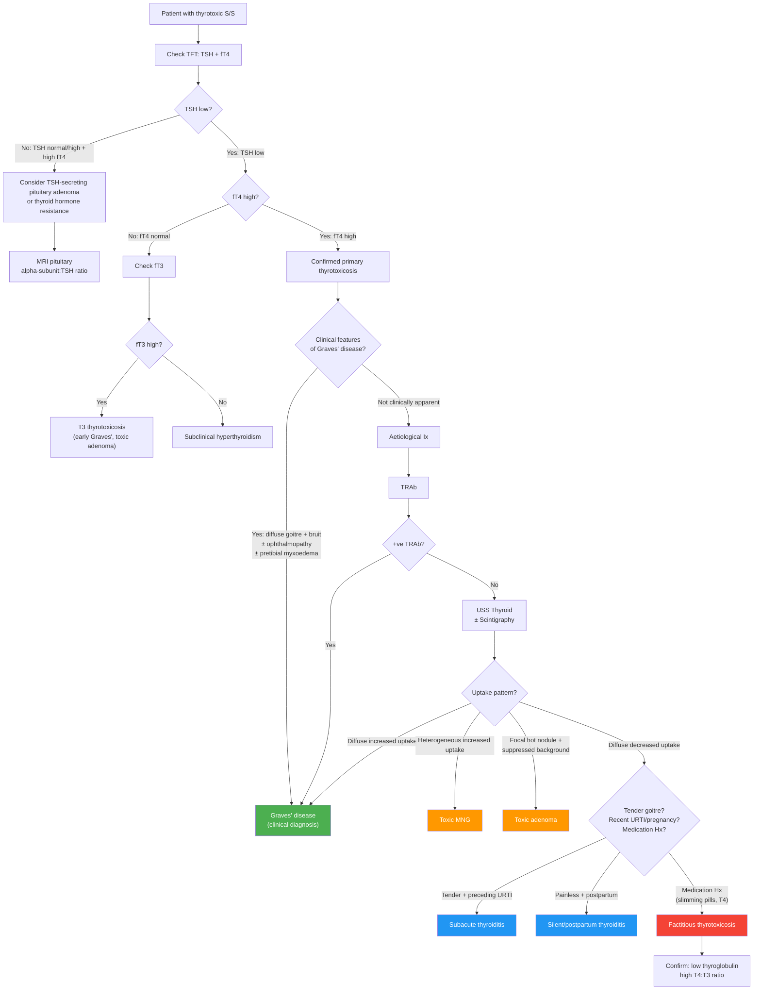

## Differential Diagnosis of Graves' Disease

### The Core Clinical Question

When a patient presents with features of **thyrotoxicosis** (weight loss, tremor, tachycardia, heat intolerance, etc.), the key clinical question is: **"What is the CAUSE of the thyrotoxicosis?"** Graves' disease is the most common answer (~76%), but you must systematically consider and exclude the alternatives [2][5].

The differential diagnosis operates on two levels:
1. **Level 1**: Is this truly thyrotoxicosis? (Could the symptoms be from another condition entirely?)
2. **Level 2**: If it IS thyrotoxicosis, what is the underlying aetiology?

Let's work through both.

---

### Level 1: Conditions That Mimic Thyrotoxicosis

Before diving into causes of thyrotoxicosis, recognise that many of the *individual* symptoms of thyrotoxicosis are nonspecific and overlap with other conditions. A patient may present with weight loss + palpitations + anxiety and NOT have thyroid disease at all. The TFT (specifically TSH) is the gatekeeper — if TSH is normal, thyrotoxicosis is essentially excluded.

| Mimicking Condition | Overlapping Features | Key Distinguishing Feature |
|---|---|---|
| **Anxiety disorder / Panic disorder** | Tremor, palpitations, sweating, nervousness, insomnia | Normal TFT; symptoms are episodic and context-dependent; no goitre, no eye signs |
| **Phaeochromocytoma** | Paroxysmal palpitations, sweating, hypertension, tremor | Episodic (not constant), ↑DBP (thyrotoxicosis ↓DBP), headache triad (headache + sweating + palpitations); normal TFT; ↑24h urinary metanephrines |
| **Atrial fibrillation** (other causes) | Palpitations, dyspnoea | AF can be caused by many things (valvular disease, alcohol, PE); always check TFT in new-onset AF |
| **Heart failure** | Dyspnoea, oedema, fatigue | TFT normal (unless thyrotoxic HF is the cause); elevated BNP, cardiomegaly |
| **Malignancy** (occult) | Weight loss, fatigue, sweating | Progressive weight loss with ↓appetite (unlike thyrotoxicosis where appetite is ↑/normal); normal TFT |
| **Diabetes mellitus** | Weight loss, fatigue, polyuria | Hyperglycaemia on BSL; polyuria from osmotic diuresis not ↑GFR |
| **Menopause** | Hot flushes, sweating, emotional lability, irregular periods | Age-appropriate; ↑FSH/LH, ↓oestradiol; normal TFT |
| **Stimulant / drug abuse** (amphetamines, cocaine, excess caffeine) | Tachycardia, tremor, weight loss, agitation | Drug history; urine drug screen; normal TFT |

<Callout title="Golden Rule" type="idea">
**Always check TFT (TSH first) in any patient with unexplained weight loss, new-onset AF, palpitations, anxiety, or tremor.** TSH is the most sensitive screening test — a normal TSH effectively rules out primary hyper- and hypothyroidism [1][2].
</Callout>

---

### Level 2: Differential Diagnosis of Confirmed Thyrotoxicosis

Once thyrotoxicosis is confirmed biochemically (↓TSH ± ↑fT4/fT3), you need to determine the **cause**. This is where the real differential diagnosis of Graves' disease sits. The approach is best framed by dividing causes into three pathophysiological categories [1][2][5][6]:

#### Master Classification

| Category | Mechanism | Causes | Radioiodine Uptake |
|---|---|---|---|
| **A. Primary Hyperthyroidism** (gland is overactive — making too much hormone) | Thyroid follicular cells are stimulated to ↑synthesis and ↑secretion | ***Graves' disease (76%)***, ***toxic multinodular goitre (14%)***, ***toxic adenoma (5%)***, TSHr-activating mutations, McCune-Albright (Gsα mutation) | **↑ Uptake** (diffuse or focal) |
| **B. Secondary Hyperthyroidism** (pituitary/ectopic TSH or TSH-like substance drives the gland) | Excess TSH or TSH-like molecules stimulate normal thyroid | ***TSH-secreting pituitary adenoma (0.2%)***, ***gestational thyrotoxicosis***, ***molar hyperthyroidism***, ***struma ovarii*** | **↑ Uptake** (except struma ovarii — uptake in pelvis) |
| **C. Thyrotoxicosis WITHOUT Hyperthyroidism** (gland is being destroyed and leaking stored hormone, or exogenous hormone) | Pre-formed T4/T3 leaks from damaged follicles OR exogenous T4 ingestion | ***Subacute (De Quervain's) thyroiditis (3.5%)***, ***silent/painless thyroiditis***, ***postpartum thyroiditis***, ***amiodarone-induced thyrotoxicosis type 2***, ***factitious thyrotoxicosis (exogenous T4 — 0.2%)*** | **↓ Uptake** (gland is suppressed/destroyed) |

**Why does this classification matter clinically?** Because the management is fundamentally different:
- **Category A & B**: Antithyroid drugs (ATDs) work because there IS excess synthesis to block
- **Category C (destructive)**: ATDs are **useless** — there is no excess synthesis; the problem is leakage of stored hormone. Treatment is supportive (β-blockers, NSAIDs/steroids for inflammation). The thyrotoxicosis is typically **self-limiting** as stored hormone is depleted

---

### Detailed Differential: Cause-by-Cause Comparison with Graves'

#### A. Primary Hyperthyroidism

##### 1. Graves' Disease (76%) — The Index Condition

| Feature | Detail |
|---|---|
| **Goitre** | ***Painless diffuse goitre with bruit*** [2][5] |
| **Eye signs** | ***Graves' ophthalmopathy: periorbital oedema, exophthalmos, proptosis, ophthalmoplegia*** [2][5] |
| **Dermopathy** | ***Pretibial myxoedema*** (< 10%) [2] |
| **TRAb** | Positive (sens ~97%, spec ~99% with newer assays) [6] |
| **Scintigraphy** | ***Diffuse ↑uptake*** [2][6] |
| **Ultrasound** | Diffuse ↑blood flow ("thyroid inferno" on colour Doppler) |
| **Demographics** | Young women (20–50y), autoimmune associations |

##### ***2. Toxic Multinodular Goitre (14%)*** — Plummer's Disease

| Feature | Detail |
|---|---|
| **Goitre** | ***Palpable nodules*** — lumpy, asymmetric, often longstanding [2][5][8] |
| **Eye signs** | No Graves' ophthalmopathy (lid retraction/lag can occur from thyrotoxicosis per se) |
| **Dermopathy** | Absent |
| **TRAb** | Negative |
| **Scintigraphy** | ***Heterogeneous ↑uptake*** (multiple "hot" and "cold" areas) [2][6] |
| **Demographics** | Older patients (> 50y), often in iodine-deficient areas; long Hx of non-toxic MNG progressing to autonomous function |

**Why does MNG become toxic?** Over time, some nodules within an MNG acquire somatic activating mutations in TSHr or Gsα → these nodules produce hormone autonomously (independent of TSH). Eventually, total autonomous hormone production exceeds the body's need → thyrotoxicosis. This is a slow process — hence older age at presentation.

##### ***3. Toxic Adenoma / Solitary Thyroid Adenoma (5%)***

| Feature | Detail |
|---|---|
| **Goitre** | ***Single palpable nodule*** — the rest of the gland is atrophic (suppressed by excess hormone) [2][5][8] |
| **TRAb** | Negative |
| **Scintigraphy** | ***Focal ↑uptake with ↓uptake elsewhere*** ("hot nodule" with suppressed surrounding gland) [2][6] |
| **Mechanism** | Somatic activating mutation in TSHr gene → constitutive activation of cAMP in a single clone of follicular cells → autonomous hormone production by that nodule |

<Callout title="Hot Nodules Are Almost Never Malignant">
This is an important concept. A "hot" nodule on scintigraphy (i.e. one that takes up radioiodine avidly) is functioning autonomously — and functioning thyroid tissue is almost never malignant. The concern for malignancy is with "cold" nodules (non-functioning), which need FNA biopsy [2][6][8].
</Callout>

##### 4. Other Rare Causes of Primary Hyperthyroidism

- **Activating TSHr mutations**: Germline (familial non-autoimmune hyperthyroidism) or somatic — constitutive receptor activation without antibodies
- **McCune-Albright syndrome**: Somatic mosaic activating mutation in *GNAS1* gene → constitutive Gsα activation → affects multiple endocrine organs (precocious puberty, hyperthyroidism, Cushing's, acromegaly) + polyostotic fibrous dysplasia + café-au-lait spots
- **Metastatic functional thyroid cancer**: Very rare; large volume of well-differentiated (usually follicular) thyroid cancer metastases producing enough T4 to cause thyrotoxicosis

#### B. Secondary Hyperthyroidism (TSH/TSH-like Substance Driven)

##### ***1. TSH-Secreting Pituitary Adenoma (Thyrotrophinoma) — 0.2%***

| Feature | Detail |
|---|---|
| **TFT pattern** | ***TSH normal or ↑ with ↑fT4*** (this is the KEY distinguishing feature — in all other causes of primary hyperthyroidism, TSH is suppressed) [1] |
| **Mechanism** | Autonomous TSH secretion from a pituitary adenoma → drives thyroid to overproduce → but TSH is NOT suppressed by negative feedback because the adenoma is autonomous |
| **Other features** | Visual field defects (bitemporal hemianopia) if macroadenoma; may co-secrete GH or PRL |
| **Dx** | MRI pituitary; α-subunit:TSH ratio ↑ |

**Why is the TFT pattern diagnostic?** In all forms of **primary** thyrotoxicosis, TSH is suppressed by negative feedback (↑T4 → ↓TSH). If you see ↑fT4 with *normal or ↑ TSH*, the only explanations are: (1) TSH-secreting adenoma, or (2) thyroid hormone resistance syndrome. This "inappropriately normal/elevated TSH" pattern is the red flag [1].

##### ***2. Gestational Thyrotoxicosis / hCG-Mediated***

| Feature | Detail |
|---|---|
| **Mechanism** | ***hCG (human chorionic gonadotropin) is structurally similar to TSH*** — at very high levels (> 200,000 IU/L), hCG cross-reacts with and stimulates the TSHr |
| **When** | First trimester of pregnancy (peak hCG at 10–12 weeks); often associated with hyperemesis gravidarum |
| **Key distinction** | Self-limiting (resolves as hCG falls in 2nd trimester); no goitre/ophthalmopathy; TRAb negative |

##### ***3. Molar Hyperthyroidism***

- Hydatidiform mole or choriocarcinoma → massively ↑hCG → TSHr stimulation
- Similar mechanism to gestational thyrotoxicosis but more severe; ↑↑βhCG; pelvic mass on USS

##### ***4. Struma Ovarii***

- Ovarian teratoma (dermoid cyst) containing functional thyroid tissue → autonomous T4 production
- Rare; scintigraphy shows uptake in *pelvis*, not neck; ↓thyroid uptake

#### C. Thyrotoxicosis WITHOUT Hyperthyroidism (Destructive / Exogenous)

This is the critical category to distinguish from Graves' because the management is completely different.

##### ***1. Subacute (De Quervain's) Thyroiditis***

| Feature | Detail |
|---|---|
| **Goitre** | ***Tender goitre*** (painful on palpation — this is the key distinguishing feature from Graves') [2][5] |
| **Hx** | ***Preceding URTI*** (usually 2–6 weeks before); ***fever*** [2][5] |
| **Mechanism** | Viral-triggered inflammatory destruction of thyroid follicles → release of pre-formed T4/T3 → transient thyrotoxicosis (weeks) → hypothyroid phase (as stores depleted and gland recovers) → euthyroid |
| **TRAb** | Negative |
| **Scintigraphy** | ***Diffuse ↓uptake*** (gland is destroyed, not synthesising) [2][6] |
| **ESR/CRP** | Markedly elevated (inflammatory) |
| **Course** | Self-limiting; triphasic (thyrotoxic → hypothyroid → euthyroid) |

**Why does the scintigraphy show ↓uptake?** Because the thyroid follicular cells are damaged and cannot trap iodine. Also, the intact negative feedback axis means that the ↑T4 from leakage → ↓TSH → further ↓NIS expression and ↓iodine uptake. There is no active synthesis happening.

##### ***2. Silent (Painless) Thyroiditis***

- Same mechanism as subacute thyroiditis but **painless** and with **normal ESR**
- Autoimmune in aetiology (lymphocytic infiltration — related to Hashimoto's)
- Often occurs **postpartum** (postpartum thyroiditis — within 6 months of delivery) [2][5]
- TRAb negative; anti-TPO often positive (autoimmune basis)
- Scintigraphy: ↓uptake (same reason as De Quervain's)

##### ***3. Drug-Induced Thyrotoxicosis***

- **Amiodarone**: Can cause two types:
  - **Type 1 (iodine-induced)**: Excess iodine substrate in a gland with pre-existing autonomy (e.g. MNG, latent Graves') → Jod-Basedow effect → ↑synthesis → ↑uptake on scan
  - **Type 2 (destructive)**: Direct toxic effect of amiodarone on thyroid follicles → hormone leakage → ↓uptake on scan
  - Mixed forms exist; distinguishing between types is critical for management
- **Lithium**: Can trigger autoimmune thyroid disease (both hypo- and hyperthyroidism)

##### ***4. Factitious Thyrotoxicosis (Exogenous T4 Intake) — 0.2%***

| Feature | Detail |
|---|---|
| **Goitre** | Absent (gland is suppressed and atrophic) |
| **Mechanism** | ***Excessive T4 intake*** (intentional or iatrogenic — ask about slimming pills, health supplements, accidental overdose of levothyroxine) [2][5] |
| **TFT** | ↑fT4, ↓TSH; ***↑T4:T3 ratio (can rise to > 70:1 vs 30:1 in conventional thyrotoxicosis)*** — because serum T3 depends entirely on peripheral conversion while thyroid T3 secretion is suppressed [2][6] |
| **Thyroglobulin** | ***↓Serum thyroglobulin*** (exogenous T4 suppresses the gland; thyroglobulin is only produced by thyroid tissue) [2][6] |
| **Scintigraphy** | ***Diffuse ↓uptake*** (same as destructive thyroiditis) [2][6] |

<Callout title="How to Distinguish Destructive Thyroiditis from Factitious Thyrotoxicosis" type="error">
Both show ↓uptake on scintigraphy. The distinguishing tests are:
- **Thyroglobulin**: ↓ in factitious (gland suppressed), ↑ in destructive thyroiditis (leaking from damaged follicles)
- **T4:T3 ratio**: > 70:1 in factitious (all T3 from peripheral conversion), ~30:1 in other thyrotoxicosis
- **Clinical context**: Ask about medication use (esp slimming pills), occupation (healthcare workers with access to levothyroxine) [2][6]
</Callout>

---

### Clinical Approach to Differentiating Causes of Thyrotoxicosis

***History and physical examination*** should be the first step — often you can clinch the diagnosis without any aetiological investigations [2][5][6]:

| Clinical Clue | Points Toward |
|---|---|
| ***Painless diffuse goitre with bruit*** ± ***ophthalmopathy, pretibial myxoedema*** | ***Graves' disease*** [2][5] |
| ***Palpable nodules*** in the thyroid | ***Solitary adenoma or toxic MNG*** [2][5] |
| ***Recent (< 6 months) pregnancy*** | ***Postpartum thyroiditis*** or ***gestational thyrotoxicosis*** [2][5] |
| ***Preceding URTI, fever, tender goitre*** | ***Subacute (De Quervain's) thyroiditis*** [2][5] |
| ***Intake of ANY medications (esp slimming pills)*** | ***Factitious thyrotoxicosis*** [2][5] |
| No goitre, recent contrast CT or cardiac catheterisation | Iodine-induced thyrotoxicosis (Jod-Basedow) |
| ↑TSH with ↑fT4 | TSH-secreting pituitary adenoma or thyroid hormone resistance |

---

### Aetiological Investigation Algorithm

***If the cause is not clinically apparent*** (e.g. no ophthalmopathy, no clear diffuse non-tender goitre, no tender goitre, no drug history), the following aetiological investigations are indicated [2][6]:

#### Step 1: Thyrotropin Receptor Antibodies (TRAb)
- ***Sensitivity 97%, specificity 99% with newer assays*** [6]
- If **positive** → **Graves' disease** (virtually diagnostic)
- If **negative** → proceed to imaging

#### Step 2: Ultrasound Thyroid
- ***Look for nodules and ↑blood flow in Graves' disease*** [6]
- Diffuse ↑vascularity without nodules → supports Graves'
- Nodules identified → need scintigraphy to determine functional status

#### Step 3: Thyroid Scintigraphy (Technetium-99m pertechnetate or I-123)
***Not widely available; useful in specific scenarios*** [6]:

| Indication for Scintigraphy | What You're Looking For |
|---|---|
| ***When suspecting destructive thyroiditis*** | ↓ vs ↑ uptake to distinguish from Graves' |
| ***Diffuse toxic goitre with −ve TRAb*** | Could be TRAb-negative Graves' vs destructive thyroiditis |
| ***S/S suggestive of destructive thyroiditis (e.g. painful goitre)*** | Confirm ↓uptake |
| ***↓TSH with thyroid nodule(s)*** | Determine if nodule is "hot" (autonomous) or "cold" (risk of malignancy) |
| ***Differentiate Graves' with co-existent nodule vs toxic adenoma vs toxic MNG*** | Pattern of uptake |

**Scintigraphy patterns** [2][6]:

| Pattern | Diagnosis |
|---|---|
| ***Diffuse ↑uptake*** | ***Graves' disease*** vs secondary hyperthyroidism |
| ***Heterogeneous ↑uptake*** | ***Toxic MNG*** |
| ***Focal ↑uptake with ↓uptake elsewhere*** | ***Toxic adenoma*** |
| ***Diffuse ↓uptake*** | ***Destructive thyroiditis*** vs ***factitious thyrotoxicosis*** |

---

### Diagnostic Algorithm — Mermaid Diagram

---

### Summary Comparison Table — Key Differentials of Thyrotoxicosis

| Feature | Graves' Disease | Toxic MNG | Toxic Adenoma | Subacute Thyroiditis | Silent Thyroiditis | Factitious |
|---|---|---|---|---|---|---|
| **Age** | 20–50y | > 50y | 30–50y | 30–50y | Postpartum | Any |
| **Goitre** | Diffuse, non-tender, bruit | Nodular, asymmetric | Single nodule | Tender, diffuse | Non-tender ± small | Absent |
| **Pain** | No | No | No | Yes | No | No |
| **Ophthalmopathy** | Yes (20–25%) | No | No | No | No | No |
| **Pretibial myxoedema** | Yes (< 10%) | No | No | No | No | No |
| **TRAb** | Positive | Negative | Negative | Negative | Negative | Negative |
| **Anti-TPO** | May be + | Usually − | Usually − | Usually − | Often + | Usually − |
| **Scintigraphy** | Diffuse ↑ | Heterogeneous ↑ | Focal ↑ | Diffuse ↓ | Diffuse ↓ | Diffuse ↓ |
| **ESR/CRP** | Normal | Normal | Normal | ↑↑ | Normal | Normal |
| **Thyroglobulin** | ↑ | ↑ | ↑ | ↑↑ (leaking) | ↑ | ↓↓ |
| **T4:T3 ratio** | ~30:1 | ~30:1 | ~30:1 | ~30:1 | ~30:1 | > 70:1 |
| **Course** | Chronic relapsing | Chronic progressive | Chronic | Self-limiting (triphasic) | Self-limiting | Resolves with cessation |

---

### Special Differential: Proptosis / Exophthalmos (When Eye Signs Are Prominent)

If the presentation is dominated by **proptosis**, consider the following differential beyond Graves' ophthalmopathy:

| Condition | Distinguishing Features |
|---|---|
| **Graves' ophthalmopathy** | Usually bilateral (may be asymmetric); associated thyrotoxicosis ± goitre; TRAb +ve |
| **Orbital cellulitis** | Acute onset; painful, red, swollen eye; fever; preceding sinusitis; CT shows sinus disease |
| **Orbital tumour** (lymphoma, meningioma, haemangioma) | Unilateral; progressive; CT/MRI shows mass lesion; NO thyroid dysfunction |
| **Orbital pseudotumour** (idiopathic orbital inflammation) | Painful proptosis, usually unilateral; dramatic response to steroids; diagnosis of exclusion |
| **Cavernous sinus thrombosis** | Bilateral proptosis with cranial nerve palsies (III, IV, V1, V2, VI); septic features; post-sinusitis or facial infection |
| **Carotid-cavernous fistula** | Pulsating proptosis; audible bruit over orbit; chemosis; ↑IOP; trauma history |

---

### Differential Diagnosis Within Autoimmune Thyroid Disease Spectrum

Graves' disease exists on a **spectrum** with Hashimoto's thyroiditis — both are autoimmune thyroid diseases with overlapping antibody profiles but different predominant immune mechanisms:

| Feature | Graves' Disease | Hashimoto's Thyroiditis |
|---|---|---|
| **Predominant antibody** | TRAb (stimulating) | Anti-TPO, anti-thyroglobulin (destructive) |
| **Thyroid function** | Hyperthyroid | Hypothyroid (can have transient "Hashitoxicosis" early) |
| **Goitre** | Diffuse, vascular, bruit | Diffuse, firm, "rubbery", no bruit |
| **Histology** | Follicular hyperplasia, minimal lymphocytic infiltration | Extensive lymphocytic infiltration, Hürthle cell change, fibrosis |
| **Course** | Relapsing-remitting; may "burn out" to hypothyroidism | Progressive to hypothyroidism |
| **Overlap** | Some patients with Graves' develop Hashimoto's over time (and vice versa — "Hashitoxicosis" can be the first presentation) |

<Callout title="'Hashitoxicosis' — An Important Exam Trap" type="error">
Early Hashimoto's thyroiditis can present with **transient thyrotoxicosis** (due to inflammatory destruction releasing stored hormone — similar to subacute thyroiditis). This can be confused with Graves' disease. The clue is that the goitre is firm and non-vascular (no bruit), TRAb is negative, anti-TPO is strongly positive, and the thyrotoxicosis is self-limiting and followed by permanent hypothyroidism.
</Callout>

---

<Callout title="High Yield Summary">

**Differential Diagnosis of Graves' Disease — Exam Essentials:**

1. **Always confirm thyrotoxicosis biochemically** (↓TSH ± ↑fT4) before chasing an aetiological diagnosis
2. **Clinical diagnosis of Graves'**: Painless diffuse goitre with bruit ± ophthalmopathy ± pretibial myxoedema — often no further aetiological Ix needed
3. **If not clinically apparent**: TRAb (sens 97%, spec 99%) → USS thyroid → Scintigraphy
4. **Three categories of thyrotoxicosis**: Primary hyperthyroidism (↑synthesis: Graves', toxic MNG, toxic adenoma) | Secondary hyperthyroidism (TSH/hCG-driven) | Thyrotoxicosis without hyperthyroidism (destructive/exogenous: ↓uptake on scan)
5. **Key distinguishing features**: Tender goitre = subacute thyroiditis; Nodular goitre = MNG/adenoma; No goitre + ↓thyroglobulin = factitious; Normal/↑TSH with ↑fT4 = pituitary adenoma
6. **Scintigraphy patterns**: Diffuse ↑ = Graves'; Heterogeneous ↑ = toxic MNG; Focal ↑ = toxic adenoma; Diffuse ↓ = destructive thyroiditis or factitious
7. **Factitious thyrotoxicosis**: ↑T4:T3 ratio > 70:1, ↓thyroglobulin, ↓uptake — ask about slimming pills
8. **Hot nodules are almost never malignant** — cold nodules need FNA

</Callout>

---

<ActiveRecallQuiz
  title="Active Recall - Differential Diagnosis of Graves' Disease"
  items={[
    {
      question: "A patient has confirmed thyrotoxicosis (low TSH, high fT4) but the goitre is nodular and asymmetric. TRAb is negative. What is the most likely diagnosis, and what would you expect on thyroid scintigraphy?",
      markscheme: "Toxic multinodular goitre. Scintigraphy would show heterogeneous increased uptake with multiple hot and cold areas. Negative TRAb and nodular goitre exclude Graves' disease.",
    },
    {
      question: "A woman presents 3 weeks after an URTI with thyrotoxic symptoms, fever, and an exquisitely tender thyroid. TRAb is negative, ESR is 85 mm/hr. What is the diagnosis, and why would antithyroid drugs NOT work here?",
      markscheme: "Subacute (De Quervain's) thyroiditis. ATDs would not work because there is no excess thyroid hormone synthesis — the thyroid follicles are being destroyed by viral-triggered inflammation and leaking pre-formed T4/T3. Scintigraphy would show diffuse decreased uptake. Treatment is supportive: beta-blockers for symptoms, NSAIDs/corticosteroids for pain and inflammation.",
    },
    {
      question: "A thyrotoxic patient has diffuse decreased uptake on scintigraphy. How do you distinguish between destructive thyroiditis and factitious thyrotoxicosis?",
      markscheme: "Both show low uptake. Distinguish by: (1) Serum thyroglobulin: LOW in factitious (gland suppressed, not producing thyroglobulin), HIGH in destructive thyroiditis (leaking from damaged follicles). (2) T4:T3 ratio: more than 70:1 in factitious (T3 entirely from peripheral conversion), approximately 30:1 in destructive thyroiditis. (3) Clinical context: ask about medication use, slimming pills.",
    },
    {
      question: "A patient has elevated fT4 but TSH is NOT suppressed (it is normal or slightly elevated). What two conditions should you consider, and how do you differentiate?",
      markscheme: "1) TSH-secreting pituitary adenoma (thyrotrophinoma) and 2) Thyroid hormone resistance syndrome. Both show 'inappropriately normal/elevated TSH' in the setting of high fT4. Differentiate by: MRI pituitary (macroadenoma in thyrotrophinoma), elevated alpha-subunit:TSH ratio in thyrotrophinoma, absent family history of resistance. Thyroid hormone resistance is usually familial with a THRB gene mutation and patients are often clinically euthyroid.",
    },
    {
      question: "Name the four scintigraphy uptake patterns in thyrotoxicosis and the corresponding diagnosis for each.",
      markscheme: "1) Diffuse increased uptake = Graves' disease (or secondary hyperthyroidism). 2) Heterogeneous increased uptake = Toxic multinodular goitre. 3) Focal increased uptake with decreased uptake elsewhere = Toxic adenoma. 4) Diffuse decreased uptake = Destructive thyroiditis or factitious thyrotoxicosis.",
    },
  ]}
/>

---

## References

[1] Senior notes: felixlai.md (Thyroid section — Evaluation of Thyrotoxicosis flowchart, Causes of thyrotoxicosis)
[2] Senior notes: Ryan Ho Endocrine.pdf (Section 1.3.1 Thyrotoxicosis; Section 1.4.1 Graves' Disease)
[5] Senior notes: Ryan Ho Fundamentals.pdf (Section 3.8.1.1 Thyrotoxicosis; Section 3.8.1 Presenting Problems in Thyroid Gland)
[6] Senior notes: Adrian Lui Pediatrics.pdf (p271–272 Thyrotoxicosis — Aetiological Ix table, scintigraphy findings)
[8] Senior notes: maxim.md (Approach to thyroid nodules — Differential diagnosis table)
