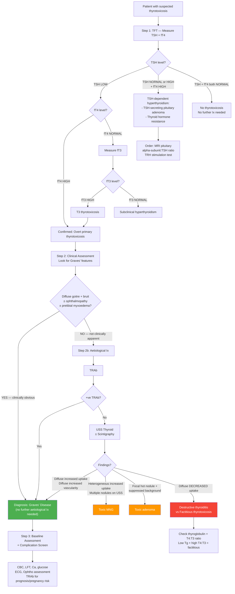

## Diagnostic Criteria, Algorithm and Investigations for Graves' Disease

### Overview of Diagnostic Philosophy

Here is the key principle to understand before we get into the weeds: **Graves' disease is fundamentally a clinical diagnosis supported by biochemistry**. In many cases, you do NOT need expensive antibody tests or nuclear imaging — a young woman with thyrotoxic symptoms, a diffuse non-tender goitre with a bruit, and ophthalmopathy has Graves' disease until proven otherwise. The investigations exist to (1) confirm thyrotoxicosis biochemically, (2) establish the aetiology when the clinical picture is not clear-cut, and (3) guide management decisions [2][5][6].

Think of the diagnostic process in three sequential steps:

1. **Step 1 — Confirm thyrotoxicosis**: TFT (TSH + fT4 ± fT3)
2. **Step 2 — Establish aetiology**: Clinical assessment ± TRAb ± USS ± Scintigraphy
3. **Step 3 — Assess severity and complications**: Baseline bloods, ECG, ophthalmological assessment

---

### Diagnostic Criteria for Graves' Disease

There is no single universally codified "diagnostic criteria" set for Graves' disease in the way there is for, say, rheumatic fever (Jones criteria). Instead, the diagnosis is made by the **combination of**:

| Criterion | Detail | Essential? |
|---|---|---|
| **1. Biochemical thyrotoxicosis** | ***↓TSH (usually undetectable) + ↑fT4*** [2][5][6] | Yes — must be present for overt disease |
| **2. Clinical features of Graves'** | ***Diffuse goitre with bruit ± Graves' ophthalmopathy ± pretibial myxoedema*** [2] | If present → diagnostic (no further aetiological Ix needed) |
| **3. Positive TRAb** | ***Sensitivity 97%, specificity 99% with newer assays*** — virtually diagnostic [2][6] | If clinical features unclear |
| **4. Diffuse ↑uptake on scintigraphy** | Confirms hyperfunctioning gland (↑ iodine trapping) in a diffuse pattern [2][6][9] | Only if TRAb negative or nodule co-exists |

**In practice, the diagnosis of Graves' disease requires:**

> **Biochemical thyrotoxicosis (↓TSH + ↑fT4)** PLUS **at least one of**:
> - Characteristic clinical features (diffuse goitre with bruit ± ophthalmopathy ± pretibial myxoedema)
> - Positive TRAb (anti-TSHr)
> - Diffuse increased uptake on thyroid scintigraphy

<Callout title="When Is TRAb Actually Needed?">
***Serum TRAb (anti-TSHr) is NOT routinely done (quite expensive)*** [2]. You order it when:

1. ***Establishing diagnosis of Graves' disease*** when clinical picture is ambiguous — ***usually NOT necessary*** because ***~100% of patients with active Graves' disease are +ve for TRAb*** [2]
2. ***Prognostic indicator of outcome of antithyroid drugs***: ***+ve TRAb at end of Tx indicates ↑chance of relapse***; ***−ve TRAb → more likely to have prolonged remission*** [2]
3. ***Assessing risk of neonatal Graves' disease***: ***↑risk if ↑TRAb level*** — TRAb (IgG) crosses the placenta and can stimulate the fetal thyroid [2]
4. Differentiating Graves' from destructive thyroiditis when scintigraphy is unavailable
</Callout>

---

### TFT Interpretation Patterns

The starting point for ALL thyroid disease is the **thyroid function test (TFT)**. ***TSH is the most sensitive screening test*** — it is the first thing to look at [2][5][6].

**Why is TSH so sensitive?** Because of the log-linear relationship between TSH and fT4. A small change in fT4 produces a **logarithmically amplified** change in TSH. For example, a 2-fold increase in fT4 can produce a 100-fold decrease in TSH. This means TSH becomes abnormal BEFORE fT4 leaves the reference range — hence TSH detects subclinical disease earlier than fT4.

#### Master TFT Interpretation Table

| TSH | fT4 | fT3 | Interpretation | Next Step |
|---|---|---|---|---|
| ***↓ (undetectable)*** | ***↑*** | ***↑*** | ***Overt primary thyrotoxicosis*** (most likely Graves' if diffuse goitre + bruit) [2][5][6] | Aetiological Ix if clinical picture not clear |
| ***↓*** | ***Normal*** | ***↑*** | ***T3 thyrotoxicosis*** — early Graves' or toxic adenoma (T3 rises before T4 in early disease because ↑relative T3 secretion under TSHr stimulation) [1][6] | Check fT3 whenever TSH ↓ + fT4 normal |
| ***↓*** | ***Normal*** | ***Normal*** | ***Subclinical hyperthyroidism*** — TSH suppressed but not enough hormone excess to elevate fT4/fT3 [5] | Monitor; treat if > 65y or TSH < 0.1 or symptomatic |
| ***↑ (or normal)*** | ***↑*** | ***↑*** | ***TSH-dependent hyperthyroidism*** — ***very rare, due to TSH-secreting pituitary adenomas*** [2][5][6] or thyroid hormone resistance | MRI pituitary, α-subunit:TSH ratio |
| ***↓/normal*** | ***↑/normal*** | ***↓*** | ***Sick euthyroidism*** (non-thyroidal illness syndrome) — ***systemic illness may cause transient ↓conversion of T4 into T3*** [2][5][6] | Do NOT treat; repeat TFT after recovery |

<Callout title="T3 Thyrotoxicosis — Don't Miss It" type="error">
If TSH is suppressed but fT4 is normal, you MUST check fT3. ***T3 should be checked if suspected hyperthyroidism with concurrent illness (↓T3 in sick euthyroidism)*** [2][6]. In early Graves' disease, the gland preferentially secretes T3 (which is more potent) before T4 rises. Missing T3 thyrotoxicosis means missing the diagnosis.
</Callout>

#### Other Factors Causing ↓TSH (Not Thyrotoxicosis)

It is important to know that a low TSH is not ALWAYS thyrotoxicosis [2][6]:
- ***Central hypothyroidism*** (pituitary/hypothalamic insufficiency) — ↓TSH + ↓fT4 (not ↑fT4)
- ***Systemic illness*** (sick euthyroidism) — transient TSH suppression during acute illness
- ***Pregnancy*** (first trimester) — hCG cross-reacts with TSHr → physiological TSH suppression
- ***Drugs***: glucocorticoids, dopamine agonists — suppress TSH secretion centrally
- ***Recovery phase of non-thyroidal illness*** — TSH may transiently drop before normalising

---

### Complete Diagnostic Algorithm

---

### Investigation Modalities — Detailed Breakdown

#### 1. Thyroid Function Tests (TFT)

**What it is**: Serum measurement of TSH, free T4, and free T3.

**Why FREE (unbound) T4 and NOT total T4?** [1]

***Serum total T4 is a measurement of total T4 bound to plasma binding proteins including thyroxine-binding globulin (TBG) and thyroxine-binding prealbumin (TBPA)*** [1]. These binding protein levels are affected by many conditions:
- ***↑ in pregnancy*** (oestrogen ↑TBG synthesis) → ↑total T4 without true thyrotoxicosis [1]
- ***↓ in hypoalbuminaemia*** (nephrotic syndrome, liver failure) → ↓total T4 without true hypothyroidism [1]

Free T4 reflects the biologically active, unbound fraction and is therefore a more accurate measure of thyroid status.

| Test | Normal Range (approx) | In Graves' Disease | Why |
|---|---|---|---|
| **TSH** | 0.4–4.0 mIU/L | ***↓ (usually undetectable, < 0.01)*** | High T4/T3 → intact negative feedback → maximally suppresses pituitary TSH |
| **Free T4** | 10–23 pmol/L | ***↑*** | TRAb stimulation → ↑T4 synthesis and secretion |
| **Free T3** | 3.5–6.5 pmol/L | ***↑*** | TRAb stimulation → ↑preferential T3 secretion (T3 is more biologically active and the gland preferentially makes it under stimulation) |

**Specific patterns and pearls:**
- ***↓TSH ↑T3 ↑fT4: diagnostic of thyrotoxicosis (TSH usually undetectable)*** [2][5][6]
- ***↓TSH nT3 nfT4: subclinical hyperthyroidism*** [2][5][6]
- ***↑TSH ↑T3 ↑fT4: TSH-dependent hyperthyroidism (very rare, due to TSH-secreting pituitary adenomas)*** [2][5][6]

---

#### 2. Thyrotropin Receptor Antibodies (TRAb / Anti-TSHr)

**What it is**: Serum measurement of antibodies directed against the TSH receptor. Also known as TBII (TSH-binding inhibitory immunoglobulins) in older nomenclature, or TSI (thyroid-stimulating immunoglobulins) when specifically measuring the stimulatory subset.

**Performance**: ***Sensitivity 97%, specificity 99% with newer assays*** [2][6]

**Why it's useful — Three main clinical indications** [2]:

| Indication | Rationale |
|---|---|
| ***1. Establishing diagnosis*** | ***~100% of patients with active Graves' disease are +ve for TRAb***; ***antibody levels ↓ with antithyroid drugs*** [2] |
| ***2. Prognostic indicator*** | ***+ve TRAb at end of treatment indicates ↑chance of relapse***; ***−ve TRAb → more likely to have prolonged remission*** [2] |
| ***3. Assessing risk of neonatal Graves' disease*** | ***↑risk if ↑TRAb level*** — TRAb is an IgG that crosses the placenta; if maternal TRAb is high in the 3rd trimester, the neonate's thyroid can be stimulated → neonatal thyrotoxicosis [2] |

**Why it is NOT routinely ordered**: ***NOT routinely done (quite expensive)*** [2]. In a classic presentation (young woman + diffuse goitre + bruit + ophthalmopathy), clinical diagnosis is sufficient. TRAb is reserved for atypical presentations, prognostication, or pregnancy.

<Callout title="TRAb During and After Treatment">
***TRAb levels decrease with antithyroid drug therapy.*** This is clinically useful: checking TRAb at the END of a course of ATDs (typically at 12–18 months) helps predict relapse risk. A patient who remains TRAb-positive at the end of treatment has a significantly higher chance of relapsing after ATD cessation and should be counselled about definitive therapy (RAI or surgery) [2].
</Callout>

---

#### 3. Other Thyroid Antibodies

| Antibody | Target | Relevance to Graves' |
|---|---|---|
| **Anti-TPO (anti-thyroid peroxidase)** | Thyroid peroxidase enzyme | Non-specific for Graves' — present in Hashimoto's (> 95%), Graves' (~70%), and even 10–15% of healthy individuals. Useful for: (1) confirming autoimmune thyroid disease in general; (2) predicting hypothyroidism risk after RAI or spontaneous "burn-out" |
| **Anti-thyroglobulin (anti-Tg)** | Thyroglobulin | Also non-specific; found in both Hashimoto's and Graves'. Less sensitive than anti-TPO |

**Key distinction**: Anti-TPO and anti-Tg tell you there is autoimmune thyroid disease but do NOT distinguish Graves' from Hashimoto's. Only **TRAb** is specific for Graves'.

---

#### 4. Ultrasound Thyroid (USS)

**What it is**: High-frequency (7.5–10 MHz) B-mode ultrasound of the thyroid ± colour Doppler.

***Routine for ALL goitre/nodules*** [8][2] — but technically not mandatory if the clinical picture is classic Graves' without palpable nodules.

| USS Finding | In Graves' Disease | Why |
|---|---|---|
| **Thyroid size** | ***Diffusely enlarged*** | TRAb stimulation → generalised follicular hyperplasia |
| **Echogenicity** | Diffusely hypoechoic (compared to surrounding muscle) | Lymphocytic infiltration ↓echogenicity |
| **Vascularity** | ***↑Blood flow*** ("thyroid inferno" on colour Doppler — the entire gland lights up) | TRAb → ↑VEGF → ↑angiogenesis |
| **Nodules** | Should be ABSENT in pure Graves'; if nodules are present → need further workup | Co-existing nodules in Graves' raise concern for incidental malignancy — need scintigraphy to determine if "hot" or "cold" and FNA if suspicious |
| **Cervical lymph nodes** | Usually normal | Reactive nodes are possible; suspicious nodes (round, absent hilum, microcalcification) need FNA |

**USS Roles** [2][6][8]:
1. ***Look for nodules*** — important because thyroid nodules co-existing with Graves' may be malignant
2. ***Assess ↑blood flow in Graves' disease*** — supportive of diagnosis
3. ***Guide FNAC*** if suspicious nodule identified
4. ***Assess retrosternal extension*** of large goitres

---

#### 5. Thyroid Scintigraphy (Radionuclide Scan)

**What it is**: Imaging of radiotracer uptake by the thyroid gland using ***I-123 (radioactive iodine)*** or ***Tc-99m pertechnetate*** [9].

**Principle**: The thyroid is the only organ that actively traps and organifies iodine (via the sodium-iodide symporter, NIS). Radioactive iodine or pertechnetate (which is also trapped by NIS but not organified) allows visualisation of functional thyroid tissue. Areas that take up tracer avidly = "hot" (hyperfunctioning); areas that don't = "cold" (non-functioning or destroyed).

***Not widely available; useful in specific scenarios*** [2][6]:

| Indication | Clinical Scenario |
|---|---|
| ***When suspecting destructive thyroiditis*** | To distinguish ↑uptake (Graves'/hyperthyroidism) from ↓uptake (destructive — gland damaged, not synthesising) |
| ***Diffuse toxic goitre with −ve TRAb*** | TRAb-negative Graves' is rare; need to confirm ↑uptake to support diagnosis vs. destructive thyroiditis |
| ***S/S suggestive of destructive thyroiditis, e.g. painful goitre*** | Confirm ↓uptake |
| ***↓TSH with thyroid nodule(s)*** | ***Differentiate between Graves' disease with co-existent thyroid nodule, toxic thyroid adenoma and toxic MNG*** [2][6] |
| ***Determine functional status of dominant nodule in toxic MNG*** | ***Hot nodules are almost never malignant*** [2][6] |

***Scintigraphy findings and interpretations*** [2][6][9]:

| Pattern | Diagnosis | Explanation |
|---|---|---|
| ***Diffuse ↑uptake*** | ***Graves' disease*** vs secondary hyperthyroidism | TRAb/TSH stimulates ALL follicular cells uniformly → entire gland traps more iodine |
| ***Heterogeneous ↑uptake*** | ***Toxic MNG*** | Some nodules are autonomous ("hot") while others are suppressed or normal → patchy pattern |
| ***Focal ↑uptake with ↓uptake elsewhere*** | ***Toxic adenoma*** | Single autonomous nodule takes up all the tracer; the rest of the gland is suppressed (because the excess T4 from the adenoma → ↓TSH → rest of gland gets no TSH drive) |
| ***Diffuse ↓uptake*** | ***Destructive thyroiditis vs factitious thyrotoxicosis*** | Gland is either damaged (can't trap iodine) or suppressed (exogenous T4 → ↓TSH → ↓NIS) |

<Callout title="Distinguishing Destructive Thyroiditis from Factitious Thyrotoxicosis">
Both show ↓ uptake on scintigraphy. The differentiators [2][6]:

- **Thyroglobulin**: ↑↑ in destructive thyroiditis (leaking from damaged follicles), ***↓ in factitious*** (gland suppressed → not producing thyroglobulin)
- **T4:T3 ratio**: ***Can rise to > 70:1 in factitious*** (T3 entirely from peripheral conversion of ingested T4, thyroid T3 secretion suppressed) ***vs 30:1 in conventional thyrotoxicosis*** [2][6]
- **Clinical context**: medication use, slimming pills, healthcare worker access to levothyroxine
</Callout>

**Practical note on lecture slides**: The lecture slides illustrate the four classic scintigraphy patterns for thyrotoxicosis [9]:

> ***Graves' disease → diffuse ↑uptake***
> ***Toxic adenoma → focal "hot" nodule with suppressed surrounding gland***
> ***Cold nodule → focal ↓uptake (concern for malignancy)***
> ***Toxic nodular goitre → heterogeneous ↑uptake***

***Radio-isotope scintigraphy (I-123 or Tc-99m) — for diagnosis of malignancy: low sensitivity and specificity; for functional assessment in thyrotoxic patients: high utility*** [9]

---

#### 6. Additional Investigations (Baseline and Complication Screen)

Once Graves' disease is diagnosed, a set of baseline investigations is needed before initiating treatment:

| Investigation | Rationale | Expected Findings in Graves' |
|---|---|---|
| **CBC (FBC)** | Baseline before ATDs (carbimazole/methimazole can cause agranulocytosis); Graves' may cause mild normocytic anaemia or mild neutropaenia | May show mild leucopaenia (Graves' itself can suppress WBC); baseline WCC essential before ATDs |
| **LFT (liver function tests)** | Baseline before ATDs (both carbimazole and PTU can cause hepatotoxicity — PTU more hepatotoxic); Graves' itself can cause ↑ALP | ↑ALP (from ↑bone turnover, not hepatic); ↑ALT/AST (hepatic congestion from high-output state); baseline needed |
| **Calcium** | Graves' → ↑osteoclastic resorption → can cause mild hypercalcaemia | Mild ↑Ca in 15–20% (usually asymptomatic) |
| **Glucose** | Screen for associated T1DM (autoimmune clustering) and because thyrotoxicosis causes insulin resistance | May be ↑ (thyrotoxicosis impairs glucose tolerance) |
| **ECG** | Screen for AF (present in ~10–15% of thyrotoxic patients, esp elderly); assess for sinus tachycardia, LVH from prolonged high-output state | Sinus tachycardia or AF; ↑voltage; shortened PR interval |
| **ESR / CRP** | Helps distinguish from subacute thyroiditis (markedly ↑ESR/CRP) | Normal in Graves' (it is autoimmune, not inflammatory in the acute-phase reactant sense) |
| **βhCG** | In women of reproductive age — rule out pregnancy before ATDs/RAI (both teratogenic considerations); rule out gestational thyrotoxicosis | Should be negative (or if positive, consider gestational thyrotoxicosis or molar pregnancy) |

---

#### 7. Investigations for Graves' Ophthalmopathy Assessment

When ophthalmopathy is present or suspected, additional specific investigations are needed [3][10]:

| Investigation | Purpose | Key Findings |
|---|---|---|
| ***TFT ± TRAb*** | ***Assess underlying thyroid condition and severity*** — TRAb titre correlates with clinical severity of GO [3][10] | ↑TRAb correlates with more severe GO |
| **Exophthalmometry** (Hertel) | ***Measure degree of proptosis*** — ***Normal = 18.6 mm (Chinese), proptosis can be up to 30 mm*** [10] | ≥ 2 mm difference between eyes or absolute value above population norm |
| **Visual acuity, visual field, colour vision testing** | ***Test for features of optic nerve compression*** — dysthyroid optic neuropathy (DON) is a sight-threatening emergency [10] | ↓VA, ↓colour vision (especially red desaturation), central scotoma, inferior arcuate defects |
| **Pupil examination** | RAPD (relative afferent pupillary defect) indicates optic neuropathy [10] | RAPD + in DON |
| ***NECT orbit*** | ***If moderate disease to assess risk of optic nerve compression*** [10] | ***Characteristic tendon-sparing EOM enlargement*** (the muscle belly is swollen but the tendon insertion is normal — this distinguishes GO from orbital myositis where the tendon IS involved); ***apical crowding indicates risk of ON compression*** [10] |
| ***Clinical Activity Score (CAS)*** | ***Assessment of disease activity*** to guide immunosuppressive treatment [10] | Score ≥ 3/7 = active disease → ***↑likelihood to respond to immunomodulatory Tx*** |

**Clinical Activity Score (CAS) — 7 Items** [10]:
1. ***Spontaneous retrobulbar pain***
2. ***Pain on eye movements***
3. ***Eyelid erythema***
4. ***Conjunctival injection***
5. ***Chemosis***
6. ***Swelling of caruncle***
7. ***Eyelid oedema or fullness***

> ***CAS > 3 = active disease → active inflammation (usually lasts 6–18 months) → ↑likelihood to respond to immunomodulatory treatment*** [10]

***Severity classification by EUGOGO (European Group on Graves' Orbitopathy)*** [10]:

| Severity | Criteria |
|---|---|
| **Sight-threatening** | Dysthyroid optic neuropathy (DON) and/or corneal breakdown from exposure |
| **Moderate-to-severe** | Sufficient impact on daily life: lid retraction ≥ 2 mm, moderate-severe soft tissue involvement, exophthalmos ≥ 3 mm above normal, inconstant or constant diplopia |
| **Mild** | Minor impact: lid retraction < 2 mm, mild soft tissue involvement, exophthalmos < 3 mm above normal, transient or no diplopia, corneal exposure responsive to lubricants |

---

#### 8. Additional Imaging Modalities (Selective Use)

These are ***NOT routine*** in Graves' disease but may be indicated in specific situations [8][9]:

| Modality | Indication | Findings |
|---|---|---|
| ***CXR (thoracic inlet view)*** | Retrosternal goitre; assess for tracheal deviation/compression; screen for cardiomegaly in thyrocardiac disease | Tracheal deviation, retrosternal soft tissue shadow, cardiomegaly |
| ***CT/MRI neck and thorax*** | ***Only when: (1) Retrosternal goitre or (2) Locally advanced thyroid cancer*** [8][9] | Retrosternal extension (CT); EOM enlargement in GO (MRI orbit); Note: ***iodinated contrast may affect post-op radioactive iodine body scan*** — avoid if RAI treatment planned [2] |
| ***PET scan*** | ***No diagnostic role at all*** for thyroid nodule evaluation [8]; FDG PET can show false-positive thyroid uptake in Graves' disease (known artefact) [11] | ***Graves' disease is a known cause of false-positive FDG-PET uptake*** in the thyroid [11] |

<Callout title="CT Contrast and RAI — Important Interaction" type="error">
***Iodinated contrast (used in CT scans) contains a large iodine load*** that saturates the thyroid's iodine uptake mechanisms for weeks. If a patient is going to receive ***radioactive iodine (RAI) therapy***, iodinated contrast must be avoided for at least ***4–6 weeks*** beforehand — otherwise the RAI will not be taken up effectively by the gland and the treatment will fail. Always think about this when ordering CT in a thyrotoxic patient [2].
</Callout>

---

#### 9. Summary: Routine vs Selective Investigations

Adapted from the lecture slides and senior notes [8][9]:

| | Routine | Selective |
|---|---|---|
| ***History + Physical exam*** | ✓ | — |
| ***Thyroid function test (TFT)*** | ✓ | — |
| ***USG thyroid ± FNAC*** | ✓ (for goitre/nodules) | — |
| ***TRAb*** | Selective (when clinical picture unclear, prognostication, pregnancy) | ✓ |
| ***Thyroid scintigraphy*** | ✗ (not routine) | ***Only in: toxic state + nodules; suspecting destructive thyroiditis; −ve TRAb with diffuse goitre*** |
| ***CT scan*** | ✗ | ***Only when: retrosternal goitre; locally advanced thyroid cancer*** |
| ***PET scan*** | ✗ | ***No diagnostic role at all*** [8] |
| ***Endoscopy (direct laryngoscopy)*** | ✗ | For RLN palsy assessment pre-operatively |

---

### Putting It All Together: The Three-Step Diagnostic Approach (Summary)

| Step | Action | Key Tests | Decision Point |
|---|---|---|---|
| **Step 1: Confirm thyrotoxicosis** | TFT | TSH (most sensitive) + fT4 ± fT3 | ↓TSH + ↑fT4 = overt thyrotoxicosis; ↓TSH + normal fT4 → check fT3 |
| **Step 2: Establish aetiology** | Clinical assessment → ± TRAb → ± USS → ± Scintigraphy | Diffuse goitre + bruit + ophthalmopathy → Graves' (clinical dx); ambiguous → TRAb (97% sens, 99% spec); nodules/unclear → USS + scintigraphy | Diffuse ↑uptake = Graves'; heterogeneous = MNG; focal = adenoma; ↓uptake = destructive/factitious |
| **Step 3: Baseline assessment** | Pre-treatment workup + complication screen | CBC, LFT, Ca, glucose, ECG, βhCG (women), ± ophthalmological assessment | Identify AF, hepatic dysfunction, cytopaenias, pregnancy, GO severity before starting ATDs/RAI/surgery |

---

### Special Diagnostic Scenarios

#### Subclinical Hyperthyroidism

***Biochemistry: undetectable TSH, T3 and T4 at upper end of reference range*** [5]

- ***Often found in older patients with multinodular goitre*** [5]
- The TSH is low but the thyroid hormones are still within reference range — the patient may be asymptomatic or have subtle symptoms
- ***↓TSH still associated with risk of AF and osteoporosis*** → ***treated if > 65y or TSH < 0.1 mIU/L (↑risk of complications)*** [5]

#### Sick Euthyroidism (Non-Thyroidal Illness Syndrome)

***Biochemistry: ↓/normal TSH, ↑T4, normal/↓ T3*** [5]

- ***Reason: systemic illness → ↓peripheral T4 conversion to T3, altered binding protein level/affinity, ↓TSH secretion*** [5]
- ***TSH may ↑ to hypothyroidism level in convalescence*** (i.e. during recovery, TSH temporarily overshoots upward — don't diagnose hypothyroidism at this stage) [5]
- ***Should avoid unnecessary TFT testing in asymptomatic individuals*** — if you check TFT in a sick patient and get confusing results, it is often sick euthyroidism [5]
- The distinguishing feature from true thyrotoxicosis: ***T3 is usually low in sick euthyroidism*** (because peripheral conversion is impaired), while in thyrotoxicosis T3 is ↑

<Callout title="When a Critically Ill Patient Has Abnormal TFTs" type="error">
Do NOT reflexively start thyroid treatment in a critically ill patient with an abnormal TFT. Sick euthyroidism is extremely common in the ICU setting. The low T3 is actually an adaptive response (↓metabolic rate to conserve energy). The key differentiator: **in sick euthyroidism, T3 is LOW; in true thyrotoxicosis, T3 is HIGH**. If in doubt, repeat TFT after the acute illness has resolved [5].
</Callout>

---

<Callout title="High Yield Summary">

**Diagnosis of Graves' Disease — Exam Essentials:**

1. **Diagnostic triad**: Biochemical thyrotoxicosis (↓TSH + ↑fT4) + Clinical features of Graves' (diffuse goitre + bruit ± ophthalmopathy ± pretibial myxoedema) ± Positive TRAb ± Diffuse ↑uptake on scintigraphy
2. **TSH is the most sensitive screening test** — log-linear relationship with fT4 means it becomes abnormal before fT4 does
3. **Free T4 is measured (not total T4)** because total T4 is affected by binding protein levels (↑ in pregnancy, ↓ in hypoalbuminaemia)
4. **T3 thyrotoxicosis**: Always check fT3 when TSH is ↓ but fT4 is normal — T3 rises before T4 in early Graves'
5. **TRAb**: Sens 97%, Spec 99%; NOT routinely done (expensive); uses = diagnosis in ambiguous cases, prognostication (relapse risk), neonatal Graves' risk
6. **+ve TRAb at end of ATD course → ↑relapse risk; −ve TRAb → ↑likelihood of prolonged remission**
7. **Scintigraphy patterns**: Diffuse ↑ = Graves'; Heterogeneous ↑ = Toxic MNG; Focal ↑ = Toxic adenoma; Diffuse ↓ = Destructive/Factitious
8. **Factitious thyrotoxicosis**: ↓thyroglobulin + T4:T3 ratio > 70:1 + ↓uptake on scan
9. **Sick euthyroidism**: ↓/N TSH, ↑/N fT4, ↓T3 — do NOT treat; repeat TFT after recovery
10. **CT contrast avoidance**: Iodinated contrast must be avoided for 4–6 weeks before RAI therapy
11. **GO assessment**: CAS > 3 = active disease responsive to immunomodulation; CT orbit shows tendon-sparing EOM enlargement; apical crowding → risk of optic nerve compression

</Callout>

---

<ActiveRecallQuiz
  title="Active Recall - Diagnosis of Graves' Disease"
  items={[
    {
      question: "A patient has a suppressed TSH but normal fT4. What is the next investigation and why?",
      markscheme: "Measure free T3. In early Graves' disease (or toxic adenoma), the gland preferentially secretes T3 before T4 rises (T3 thyrotoxicosis). If fT3 is elevated, this confirms thyrotoxicosis despite normal fT4. If both fT4 and fT3 are normal, this is subclinical hyperthyroidism.",
    },
    {
      question: "Why is free T4 measured instead of total T4? Give two clinical situations where total T4 would be misleading.",
      markscheme: "Total T4 includes hormone bound to plasma binding proteins (TBG, TBPA). These binding protein levels vary: (1) Pregnancy increases TBG (oestrogen effect) leading to falsely elevated total T4; (2) Hypoalbuminaemia/nephrotic syndrome decreases binding proteins leading to falsely low total T4. Free T4 measures the biologically active unbound fraction and is therefore more accurate.",
    },
    {
      question: "Name three clinical indications for ordering TRAb in Graves' disease and explain the rationale for each.",
      markscheme: "1) Establishing diagnosis when clinical picture is ambiguous (sens 97%, spec 99%). 2) Prognostic indicator: positive TRAb at end of ATD course predicts higher relapse risk; negative TRAb suggests prolonged remission likely. 3) Assessing risk of neonatal Graves' disease in pregnancy: TRAb is an IgG that crosses the placenta; high maternal TRAb in third trimester indicates risk of fetal/neonatal thyrotoxicosis.",
    },
    {
      question: "On thyroid scintigraphy, a patient with thyrotoxicosis shows diffuse decreased uptake. What are the two main differential diagnoses, and how do you distinguish between them?",
      markscheme: "1) Destructive thyroiditis and 2) Factitious thyrotoxicosis. Distinguish by: (a) Thyroglobulin: elevated in destructive thyroiditis (leaking from damaged follicles), low in factitious (gland suppressed). (b) T4:T3 ratio: approximately 30:1 in destructive thyroiditis, greater than 70:1 in factitious (T3 entirely from peripheral conversion of exogenous T4). (c) Clinical history: medication use, slimming pills.",
    },
    {
      question: "What is the Clinical Activity Score in Graves' ophthalmopathy? Name the 7 items and state the threshold for active disease.",
      markscheme: "CAS assesses inflammatory activity in GO. 7 items: (1) Spontaneous retrobulbar pain, (2) Pain on eye movements, (3) Eyelid erythema, (4) Conjunctival injection, (5) Chemosis, (6) Swelling of caruncle, (7) Eyelid oedema or fullness. Score of 3 or more out of 7 indicates active disease, which is more likely to respond to immunomodulatory treatment.",
    },
    {
      question: "A critically ill patient in the ICU has TFT showing low TSH, normal-to-high fT4, and low fT3. What is the most likely explanation and should you treat?",
      markscheme: "Sick euthyroidism (non-thyroidal illness syndrome). Systemic illness causes decreased peripheral T4 to T3 conversion, altered binding proteins, and decreased TSH secretion. The low T3 is an adaptive response. Do NOT treat with thyroid medication. Repeat TFT after recovery from acute illness. The key differentiator from true thyrotoxicosis is that T3 is LOW in sick euthyroidism but HIGH in thyrotoxicosis.",
    },
  ]}
/>

---

## References

[1] Senior notes: felixlai.md (Thyroid section — Diagnostic protocol flowchart, free T4 vs total T4)
[2] Senior notes: Ryan Ho Endocrine.pdf (Section 1.3.1 Thyrotoxicosis — Diagnostic Ix, Aetiological Ix; Section 1.4.1 Graves' Disease — Dx, TRAb)
[3] Senior notes: Ryan Ho Endocrine.pdf (Section 1.4.1.1 Graves' Ophthalmopathy)
[5] Senior notes: Ryan Ho Fundamentals.pdf (Section 3.8.1.1 Thyrotoxicosis — Diagnostic Ix; Section 3.8.1.3 Asymptomatic Abnormal TFT)
[6] Senior notes: Adrian Lui Pediatrics.pdf (p271–272 — Diagnostic Ix, Aetiological Ix, Scintigraphy table)
[8] Senior notes: maxim.md (Investigations table — Routine vs Selective; USS thyroid)
[9] Lecture slides: GC 177. A thyroid nodule benign thyroid nodules; thyroid cancer.pdf (p13 — Other investigations, scintigraphy patterns)
[10] Senior notes: Ryan Ho Opthalmology.pdf (Section 7.1 Dysthyroid Eye Disease — Evaluation, CAS, EUGOGO, NECT orbit)
[11] Senior notes: Ryan Ho Diagnostic Radiology.pdf (p76 — FDG PET false positives including Graves' disease)
