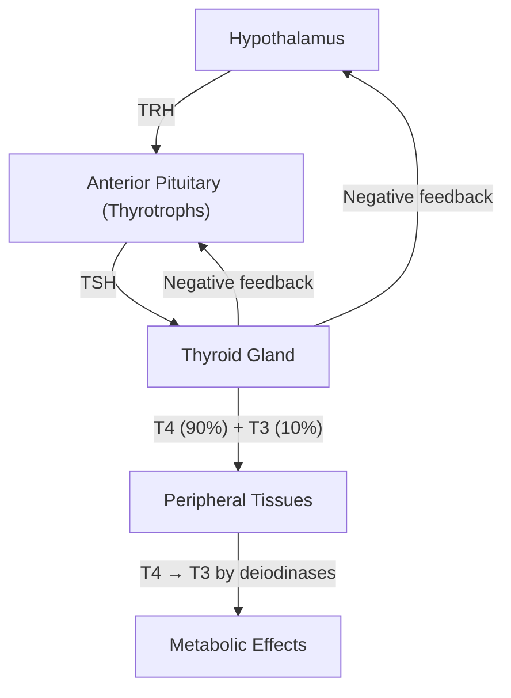

# Graves' Disease

## Definition

Graves' disease (from Robert Graves, Irish physician who described it in 1835) is an **organ-specific autoimmune disorder** in which autoantibodies — specifically **thyrotropin receptor antibodies (TRAb)** — bind to and *stimulate* the TSH receptor on thyroid follicular cells, resulting in unregulated thyroid hormone synthesis and secretion (i.e. **primary hyperthyroidism**) [1][2].

It is the **single most common cause of thyrotoxicosis** worldwide, accounting for approximately **76%** of all cases of thyrotoxicosis [2].

<Callout title="Thyrotoxicosis ≠ Hyperthyroidism">
**Thyrotoxicosis** = the clinical state of thyroid hormone excess from *any* cause (including exogenous T4 ingestion or destructive thyroiditis releasing stored hormone).

**Hyperthyroidism** = thyrotoxicosis specifically due to *excess thyroid gland function* (i.e. the gland is actively overproducing hormone).

Graves' disease causes **hyperthyroidism** (a subset of thyrotoxicosis). Subacute thyroiditis causes thyrotoxicosis *without* hyperthyroidism — the gland is being destroyed and leaking pre-formed hormone, not synthesising new hormone. This distinction matters for management (antithyroid drugs are useless in destructive thyroiditis because there is no excess synthesis to block) [1].
</Callout>

The disease is characterised by a **classical triad**:
1. **Diffuse toxic goitre** (diffuse, non-tender, vascular)
2. **Graves' ophthalmopathy** (orbitopathy)
3. **Pretibial myxoedema** (infiltrative dermopathy)

These three manifestations share a common autoimmune basis (anti-TSH receptor antibodies acting on tissues expressing TSHr) but can occur **independently** of each other and at different times in the disease course [2][3].

---

## Epidemiology

| Parameter | Detail |
|---|---|
| **Prevalence** | ~2% of women, ~0.4% of men in Hong Kong [2] |
| **Sex ratio** | ***M:F = 1:4.8*** (strong female predominance, like most autoimmune diseases) [2] |
| **Peak age** | ***20–50 years*** (i.e. women of reproductive age) [2] |
| **Proportion of thyrotoxicosis** | ~76% of all thyrotoxicosis cases [2] |
| **Genetic concordance** | ***50% monozygotic twin concordance*** (strong genetic component but not deterministic) [2] |
| **Geographic note** | High iodine intake regions (including HK) may have higher prevalence of Graves' disease; iodine supplementation in iodine-deficient areas can trigger Graves' (Jod-Basedow phenomenon) [1] |

**Why the female predominance?** Autoimmune diseases in general are more common in females due to X-chromosome–linked immune regulatory genes, oestrogen's immunostimulatory effects (↑B-cell survival, ↑antibody production), and fetal microchimerism (fetal cells persisting in maternal tissues may trigger autoimmune responses).

---

## Risk Factors

| Category | Risk Factors | Mechanism |
|---|---|---|
| **Genetic** | ***FHx of autoimmune thyroid disease***, HLA-DR3 (Caucasians), HLA-B46/B8, CTLA-4 polymorphisms, PTPN22 | Shared susceptibility loci for autoimmunity; CTLA-4 is a negative regulator of T-cells — polymorphisms reduce its inhibitory function → T-cell over-activation |
| **Sex/Hormonal** | Female sex, postpartum period | Oestrogen ↑immune reactivity; postpartum immune rebound after pregnancy-related immunosuppression |
| **Environmental** | ***Smoking*** | ***Associated with development of Graves' ophthalmopathy (but not Graves' disease itself)***; 2.22× risk of GO [2][3] |
| **Infections** | ***Viral/bacterial infections*** (possible triggers) | Molecular mimicry — microbial antigens resemble TSHr → cross-reactive immune response |
| **Iodine** | ***Iodine supplementation*** (in background iodine deficiency) | Sudden ↑iodine availability → ↑substrate for thyroid hormone synthesis in an already primed gland (Jod-Basedow effect) [2] |
| **Stress** | Psychological stress, major life events | Stress → ↑cortisol initially but chronic stress → immune dysregulation → loss of self-tolerance |
| **Drugs** | Alemtuzumab (anti-CD52), interferon-α, highly active antiretroviral therapy | Immune reconstitution after lymphocyte depletion can trigger autoimmunity |
| **Other autoimmune disease** | ***Associated with other organ-specific autoimmune diseases***: T1DM, Addison's, vitiligo, pernicious anaemia, myasthenia gravis, coeliac disease [2][4] | Shared polygenic autoimmune susceptibility (autoimmune polyendocrine syndromes) |

<Callout title="Exam Pearl" type="idea">
Smoking is a risk factor for Graves' **ophthalmopathy** specifically, NOT for Graves' disease itself. This is a common exam trick. The mechanism is thought to involve hypoxia-induced expression of TSHr on orbital fibroblasts and direct toxic effects of cigarette smoke on orbital tissues [2][3].
</Callout>

---

## Anatomy and Function of the Thyroid Gland (Relevant Review)

### Gross Anatomy
- **Location**: Anterior neck, straddling the trachea at the level of C5–T1 vertebrae
- **Structure**: Two lateral lobes connected by an isthmus (± pyramidal lobe — a remnant of the thyroglossal duct, present in ~50%)
- **Weight**: Normal adult thyroid weighs 15–25 g
- **Blood supply**: Superior thyroid artery (from external carotid) and inferior thyroid artery (from thyrocervical trunk); one of the most richly vascularised organs per gram of tissue — this is why in Graves' disease you can hear a **bruit** and feel a **thrill** over the gland (↑vascularity from TSHr stimulation)
- **Venous drainage**: Superior and middle thyroid veins → IJV; inferior thyroid veins → brachiocephalic veins
- **Lymphatic drainage**: Pre-tracheal, pre-laryngeal (Delphian), paratracheal, deep cervical nodes
- **Innervation**: Sympathetic fibres from superior and middle cervical ganglia (vasomotor, not secretomotor — thyroid function is regulated hormonally, not neurally)

### Important Anatomical Relations
- **Recurrent laryngeal nerve (RLN)**: Runs in the tracheo-oesophageal groove posterior to the thyroid lobes — at risk during thyroidectomy → injury causes **hoarseness** (unilateral) or **stridor/airway obstruction** (bilateral)
- **Parathyroid glands**: 4 glands embedded in posterior aspect of thyroid — at risk during thyroidectomy → **hypoparathyroidism** → **hypocalcaemia**
- **External branch of superior laryngeal nerve**: Runs close to the superior thyroid artery — injury causes loss of voice projection (cricothyroid muscle denervation)

### Thyroid Physiology (Key Concepts for Understanding Graves')

**The Hypothalamic-Pituitary-Thyroid (HPT) Axis:**

- **TRH** (thyrotropin-releasing hormone) from the hypothalamus stimulates **TSH** (thyroid-stimulating hormone / thyrotropin) release from the anterior pituitary
- **TSH** binds the **TSH receptor (TSHr)** on thyroid follicular cells — a G-protein coupled receptor (GPCR) that activates the Gsα–adenylyl cyclase–cAMP pathway
- TSH stimulation causes: (1) ↑iodine trapping (via sodium-iodide symporter, NIS), (2) ↑thyroglobulin synthesis, (3) ↑thyroid peroxidase (TPO) activity, (4) ↑T4/T3 synthesis and release, (5) thyroid cell growth (goitre)
- **T4** (thyroxine) is the main secretory product — it is a prohormone converted to the active **T3** (triiodothyronine) by deiodinases (mainly type 1 and 2) in peripheral tissues (liver, kidney, muscle)
- T3 enters the nucleus → binds thyroid hormone receptors → acts as a transcription factor → regulates gene expression affecting virtually every organ system
- **Negative feedback**: T3/T4 inhibit TRH and TSH release

**Why this matters in Graves':**
- In Graves' disease, **TRAb mimics TSH** at the TSHr → the gland thinks it is being told to make more hormone → constitutive activation → ↑T4/T3 release
- But unlike TSH, TRAb is **not subject to negative feedback** — the pituitary cannot "turn off" an autoantibody
- Result: **TSH is suppressed** (often undetectable) by high T4/T3 via intact negative feedback, but the gland keeps producing hormone because TRAb keeps stimulating it

---

## Aetiology and Pathophysiology

### Aetiology

Graves' disease is **autoimmune** in origin. The fundamental problem is a **loss of immune self-tolerance** to the TSH receptor [2].

**Genetic susceptibility + Environmental trigger → Loss of self-tolerance → Production of TRAb → Disease**

| Factor | Detail |
|---|---|
| **Autoantigen** | ***TSH receptor (TSHr)*** on thyroid follicular cells (and expressed at lower levels in orbital fibroblasts, skin fibroblasts, adipocytes) |
| **Offending antibody** | ***Thyrotropin receptor antibody (TRAb)***, also called thyroid-stimulating immunoglobulin (TSI) — an IgG class antibody [2] |
| **Antibody action** | ***Stimulates TSHr on thyroid gland → ↑T4 release + ↓TSH release*** (via negative feedback) [2] |
| **Genetic basis** | ***50% MZ concordance***; associated with HLA-DR3, CTLA-4, CD40, PTPN22, TSHR gene polymorphisms [2] |
| **Triggers** | ***Viral/bacterial infections, iodine supplementation (if background I2 deficiency)*** [2] |

### Pathophysiology — Step by Step

1. **Loss of self-tolerance**: In a genetically susceptible individual, some trigger (infection, stress, iodine) causes breakdown of peripheral tolerance to the TSHr antigen
2. **B-cell activation**: Autoreactive B-lymphocytes produce **TRAb (IgG)** that targets the TSH receptor
3. **TSHr stimulation**: TRAb binds the extracellular domain of TSHr → activates the Gsα–cAMP signalling cascade → mimics the effect of TSH (but without feedback regulation)
4. **Thyroid gland effects**:
   - ↑Iodine uptake (↑NIS expression) → explains diffuse ↑uptake on scintigraphy
   - ↑Thyroglobulin synthesis and ↑TPO activity
   - ↑T4 and T3 synthesis and secretion → **thyrotoxicosis**
   - ↑Thyroid cell proliferation and vascularity → **diffuse goitre with bruit**
5. **Pituitary feedback**: High circulating T4/T3 → negative feedback → **suppressed TSH** (often undetectable < 0.01 mIU/L)
6. **Extra-thyroidal effects**: TSHr is also expressed on:
   - **Orbital fibroblasts** → Graves' ophthalmopathy (see below)
   - **Dermal fibroblasts (pretibial skin)** → Pretibial myxoedema
   - **Periosteal fibroblasts** → Thyroid acropachy

### Pathophysiology of Thyrotoxic Symptoms (Organ-by-Organ)

Understanding *why* excess T3 causes specific symptoms is crucial:

| System | Effect of Excess T3 | Resulting Symptom/Sign |
|---|---|---|
| **Metabolism** | ↑Basal metabolic rate, ↑O2 consumption, ↑heat production | **Weight loss despite ↑appetite**, **heat intolerance**, **excessive sweating** |
| **Cardiovascular** | ↑β1-adrenergic receptor expression on myocardium → ↑chronotropy and inotropy; ↓systemic vascular resistance (due to ↑tissue O2 demand) → ↑SBP, ↓DBP → **widened pulse pressure** | **Palpitations, tachycardia (sinus or AF), flow murmur, bounding pulse, systolic hypertension** |
| **Nervous system** | ↑CNS catecholamine sensitivity → sympathetic overdrive | **Tremor, hyperkinesia, nervousness, agitation, emotional lability, insomnia, hyperreflexia** |
| **GI** | ↑gut motility (↑smooth muscle activity) | **Hyperdefecation** (increased stool frequency, NOT true diarrhoea), ↑appetite |
| **Musculoskeletal** | ↑Protein catabolism → muscle wasting (esp proximal) | **Proximal myopathy** (difficulty standing from a chair, climbing stairs), **easy fatigability** |
| **Bone** | ↑Osteoclast activity (T3 stimulates osteoclast differentiation) → ↑bone resorption | **Osteoporosis**, ↑fracture risk, ↑serum calcium, ↑urinary calcium |
| **Reproductive** | Altered GnRH pulsatility, ↑SHBG → altered sex steroid levels | **Oligo/amenorrhoea, infertility** (women); **gynaecomastia, ↓libido** (men) |
| **Skin** | ↑Peripheral vasodilation, ↑metabolic rate | **Warm moist skin, palmar erythema, fine hair, onycholysis** |
| **Eyes (any thyrotoxicosis)** | Sympathetic overdrive → Müller's muscle (sympathetically innervated smooth muscle in upper eyelid) contracts excessively | **Lid retraction, lid lag** (NB: these are NOT specific to Graves' — they occur in any thyrotoxicosis) |
| **Renal** | ↑Renal blood flow and GFR | **Urinary frequency** |

<Callout title="Why β-Blockers Work in Thyrotoxicosis">
Many symptoms of thyrotoxicosis mimic catecholamine excess — but serum catecholamine levels are actually NORMAL. The mechanism is that T3 upregulates β-adrenergic receptor expression and sensitises tissues to normal levels of catecholamines. This is why **β-blockers** (especially non-selective like **propranolol**) are so effective at controlling symptoms: they block the amplified adrenergic signal. Propranolol has the added advantage of inhibiting peripheral T4→T3 conversion (by type 1 deiodinase) [2][5].
</Callout>

---

## Pathophysiology of Extra-Thyroidal Manifestations

### Graves' Ophthalmopathy (Orbitopathy) — GO

***Occurs in ~20–25% of Graves' disease patients*** [3][6].

**Pathophysiology** (an area of active research, but the current understanding):

1. ***Target cell = orbital fibroblast*** — the inciting antigen is thought to be TSHr expressed on orbital fibroblasts (and possibly IGF-1 receptor, which cross-talks with TSHr) [3]
2. ***TRAb binds TSHr on orbital fibroblasts*** → activates downstream signalling:
   - ***Stimulates orbital pre-adipocytes (a subpopulation of fibroblasts) to differentiate into adipocytes with ↑expression of TSHr*** [3]
   - ***Stimulates orbital adipocytes to ↑expression of PPARγ, adiponectin, and TSHr genes*** [3]
   - Stimulates **glycosaminoglycan (GAG) production** (especially hyaluronic acid) → GAGs are extremely hydrophilic → draw water into the orbital space
3. ***T-cell activation due to cytokine release → inflammatory infiltrate → orbital and EOM oedema*** [6]
4. ***Consequence: ↑interstitial fluid content + ↑inflammatory infiltrate in orbital cavity → swelling and eventually fibrosis of EOM → ↑retrobulbar pressure*** [3]
5. ***→ Proptosis, exophthalmos ± optic nerve compression (if severe)*** [3]

**Histology** [3]:
- ***EOM: oedema, mononuclear infiltration, mucopolysaccharides, fibrosis***
- ***Retrobulbar fat: lymphocyte infiltration, replacement by fibrous tissues (collagen + hyaluronic acid)***
- ***Optic nerve: atrophy, replacement by fibrous and fatty connective tissue***

**Why the orbit specifically?** Because orbital fibroblasts uniquely co-express TSHr and IGF-1R at levels sufficient for TRAb-mediated stimulation. The orbit is also a confined bony space — so even small increases in tissue volume cause significant pressure effects (the "compartment syndrome" analogy).

**Risk factors for GO** [3][6]:
- ***Gender: F > M in general but M usually more severe***
- ***Smokers: 2.22× risk, tends to be more severe***
- ***RAI treatment: ↑risk of development or worsening of GO***
- ***Higher TRAb titres: correlates with clinical severity***

**Important**: GO is ***NOT limited to patients with clinical hyperthyroidism*** — it can occur in hypothyroidism and euthyroid individuals (because it is an autoimmune orbital disease driven by TRAb, not by thyroid hormone levels per se) [6].

### Pretibial Myxoedema (Infiltrative Dermopathy)

***Occurs in < 10% of Graves' disease patients*** [2].

- **Mechanism**: TRAb binds TSHr on dermal fibroblasts in the pretibial area → stimulates GAG (hyaluronic acid) and collagen deposition → tissue swelling
- ***Appearance: raised pink-coloured or purplish plaques on the anterior aspect of the leg*** [2]
- **Why pretibial?** The pretibial skin has a high density of fibroblasts with TSHr expression; also, this area is subject to minor trauma which may upregulate local TSHr expression (Koebner-like phenomenon)
- Almost always occurs in the setting of (or after) Graves' ophthalmopathy — virtually never without GO

### Thyroid Acropachy

- The rarest extra-thyroidal manifestation (< 1%)
- **Mechanism**: TRAb-mediated stimulation of periosteal fibroblasts → new bone formation (periosteal reaction) in the phalanges and metacarpals
- ***Presents as: digital clubbing and soft tissue swelling of hands and feet*** [2]
- Almost always accompanied by ophthalmopathy and pretibial myxoedema

### Thyrotoxic Periodic Paralysis (TPP)

***A sporadic form of hypokalaemic periodic paralysis occurring in association with hyperthyroidism*** [7].

| Feature | Detail |
|---|---|
| ***Burden*** | ***Up to 2% among Asian patients with hyperthyroidism (0.1–0.2% in non-Asian)*** [7] |
| ***Demographics*** | ***Usually in young Asian male (risk 25% (M) vs 0.8% (F), > 95% M, age of onset 20–39y)*** [7] |
| ***Genetics*** | ***Associated with susceptibility locus at 17q24.3 (discovered by HKU)*** [7] |
| ***Underlying cause*** | ***Majority Graves' disease but can be due to any cause (incl thyroxine abuse)*** [7] |

**Pathophysiology** [7]:
- ***Hyperthyroidism → ↑Na⁺/K⁺/ATPase activity*** (T3 upregulates Na⁺/K⁺-ATPase gene transcription)
- ***+ ↑insulin release (esp after carbohydrate load) → intracellular shift of K⁺***
- ***Consequences: paralysis and hypokalaemia***
- The K⁺ is NOT lost from the body — it is shifted *into cells*. This is why total body K⁺ is normal and aggressive K⁺ replacement risks **rebound hyperkalaemia** when the transcellular shift reverses

**Clinical presentation** [7]:
- ***Always preceded by thyrotoxic S/S (thyrotoxic state essential for pathogenesis)***
- ***Attacks of motor paralysis: proximal > distal, LL > UL, seldom respiratory/bulbar muscles***
- ***Signs: typically hypotonia with hypo/areflexia***
- ***Course: weekly/monthly attacks lasting mins-days***
- ***Precipitants:***
  - ***Events a/w ↑adrenaline release: rest after strenuous activity, stress, SABA use***
  - ***Events a/w ↑insulin release: namely ↑carbohydrate load***
- ***Cardiac arrhythmia due to severe hypoK (mean serum [K] = 2.1 but can be < 1.5)***

<Callout title="TPP in Hong Kong" type="idea">
TPP is a particularly important diagnosis in Hong Kong given the large proportion of Asian patients. Any young Asian male presenting with acute-onset flaccid paralysis and hypokalaemia should be screened for hyperthyroidism (TFT) even if thyroid symptoms are not prominent. ***The susceptibility locus at 17q24.3 was discovered by HKU*** [7].
</Callout>

---

## Classification

### Classification of Graves' Disease by Clinical Presentation

| Category | Features |
|---|---|
| **Graves' hyperthyroidism alone** | Diffuse toxic goitre + thyrotoxic symptoms, no ophthalmopathy or dermopathy |
| **Graves' with ophthalmopathy** | ~20–25% of patients; can range from mild (lid retraction, periorbital oedema) to sight-threatening (optic neuropathy) |
| **Graves' with dermopathy** | < 10%; pretibial myxoedema |
| **Graves' with acropachy** | < 1%; digital clubbing + periosteal reaction |
| **Euthyroid Graves' ophthalmopathy** | GO without clinical hyperthyroidism — TRAb positive but thyroid function normal |
| **Graves' disease in pregnancy** | Special considerations (TRAb crosses placenta → risk of neonatal Graves') |

### Classification Within Thyrotoxicosis (Placing Graves' in Context)

| Classification | Causes |
|---|---|
| ***Primary hyperthyroidism*** | ***Graves' disease***, toxic multinodular goitre, toxic adenoma, metastatic thyroid cancer, TSH receptor mutation, McCune-Albright syndrome (Gsα mutation) |
| ***Secondary hyperthyroidism*** | TSH-secreting pituitary adenoma, chorionic gonadotropin-secreting tumour, gestational thyrotoxicosis |
| ***Thyrotoxicosis without hyperthyroidism*** | Subacute (De Quervain's) thyroiditis, silent thyroiditis, destructive thyroiditis (amiodarone, irradiation), exogenous levothyroxine (T4) overdose [1] |

---

## Clinical Features

### A. Symptoms

#### General / Metabolic
| Symptom | Pathophysiological Basis |
|---|---|
| ***Weight loss despite normal or ↑appetite*** | ↑BMR from T3 → ↑caloric expenditure exceeding ↑caloric intake; ↑protein and fat catabolism |
| ***Heat intolerance and excessive sweating*** | ↑Thermogenesis from ↑BMR + ↑mitochondrial uncoupling (T3 ↑UCP expression); compensatory ↑peripheral vasodilation and ↑sweating to dissipate heat |
| ***Easy fatigability*** | Proximal muscle protein catabolism; overall ↑metabolic demand outstrips energy supply |

#### Cardiovascular
| Symptom | Pathophysiological Basis |
|---|---|
| ***Palpitation and dyspnoea on exertion*** | ↑β1-receptor expression on cardiomyocytes → ↑heart rate and contractility; ↑cardiac output at rest leaves less reserve for exertion; AF (in older patients) → loss of atrial kick → ↓cardiac output |

#### Neuropsychiatric
| Symptom | Pathophysiological Basis |
|---|---|
| ***Tremor, hyperkinesia*** | ↑Central and peripheral catecholamine sensitivity (T3 ↑β-receptor density) → fine postural tremor (best demonstrated with outstretched hands + paper on dorsum) |
| ***Nervousness, agitation, emotional lability*** | ↑CNS catecholamine sensitivity → hyperarousal, anxiety, irritability; may mimic generalised anxiety disorder |
| **Insomnia** | Sympathetic overdrive → difficulty initiating/maintaining sleep |

#### Gastrointestinal
| Symptom | Pathophysiological Basis |
|---|---|
| ***Hyperdefecation*** (↑stool frequency) | ↑GI motility from T3 effect on smooth muscle; NOTE: this is increased stool *frequency*, not true diarrhoea (stools are usually formed) |
| ***↑Appetite*** | ↑BMR → ↑caloric demand triggers hunger centres |

#### Genitourinary
| Symptom | Pathophysiological Basis |
|---|---|
| ***Urinary frequency*** | ↑Renal blood flow and GFR from hyperdynamic circulation |
| ***Oligo/amenorrhoea, infertility*** | Altered GnRH pulsatility; ↑SHBG → altered free oestradiol/testosterone; ↑LH pulse frequency → anovulation |

#### Ocular (Specific to Graves' Ophthalmopathy)
| Symptom | Pathophysiological Basis |
|---|---|
| ***Eye or retroocular discomfort with gritty or FB sensation*** | Proptosis → corneal exposure → tear film instability → surface desiccation [3] |
| ***Excessive tearing: ↑with exposure to cold air, wind or bright light*** | Reflex lacrimation from corneal irritation [3] |
| ***Pain esp on eye movement*** | Inflamed, oedematous EOMs stretching during movement [3] |
| ***Diplopia*** | EOM infiltration → restricted/asymmetric ocular motility → misalignment of visual axes [3] |
| ***Blurring of vision ± ↓colour vision*** | Optic nerve compression at orbital apex from ↑retrobulbar pressure → dysthyroid optic neuropathy (DON) — this is a sight-threatening emergency [3] |

#### Musculoskeletal
| Symptom | Pathophysiological Basis |
|---|---|
| **Proximal muscle weakness** | T3 ↑protein catabolism, especially in type II (fast-twitch) fibres; may present as difficulty rising from chair |
| **Bone pain / fractures** | ↑Osteoclastic bone resorption → osteoporosis (long-standing untreated thyrotoxicosis) |

---

### B. Signs

#### Thyroid Examination
| Sign | Description | Pathophysiological Basis |
|---|---|---|
| ***Diffuse goitre*** | Symmetrically enlarged thyroid (often 2–3× normal); smooth, firm, ***non-tender*** | TRAb stimulation → thyroid follicular cell hyperplasia and hypertrophy (gland growth) |
| ***Thyroid bruit*** (auscultation) / ***Thrill*** (palpation) | Audible bruit on auscultation; palpable thrill | ↑Blood flow to gland from TSHr stimulation of angiogenesis (↑VEGF) — pathognomonic of Graves' when present |

<Callout title="Differentiating Graves' Goitre from Toxic MNG">
Graves' disease produces a **diffuse, non-tender, vascular goitre** with a bruit — the gland is smoothly enlarged throughout. Toxic multinodular goitre (MNG) produces a **nodular** goitre (lumpy, asymmetric), often in an older patient, without bruit. A solitary toxic adenoma presents as a **single palpable nodule**. This clinical distinction is high yield [2][5].
</Callout>

#### Eye Signs — General Thyrotoxicosis (ANY Cause)
| Sign | Description | Pathophysiological Basis |
|---|---|---|
| ***Lid retraction*** | Upper lid does not cover the limbus (sclera visible above iris) — "startled" appearance | Sympathetic overdrive → ↑tone of Müller's muscle (sympathetically innervated smooth muscle in upper eyelid); ***NOT specific for GO, may occur in any hyperthyroidism*** [3] |
| ***Lid lag*** (von Graefe's sign) | Upper eyelid lags behind the globe on slow downgaze → scleral show | Same mechanism as lid retraction — ↑Müller's muscle tone; ***NOT specific for GO, may occur in any hyperthyroidism*** [3] |

#### Eye Signs — Specific to Graves' Ophthalmopathy
| Sign | Description | Pathophysiological Basis |
|---|---|---|
| ***Periorbital oedema*** | Puffy eyelids, especially on waking | Orbital inflammation → ↑vascular permeability → fluid accumulation in periorbital soft tissues [3] |
| ***Exophthalmos / Proptosis*** | Eye displaced forward (best assessed from above / lateral view) | ↑Retrobulbar tissue volume (GAG accumulation + adipogenesis + inflammatory oedema) pushes globe forward out of confined bony orbit [3] |
| ***Ophthalmoplegia / Squint*** | Restricted eye movements, especially upgaze (most commonly) | ***Most commonly affects IR > MR > SR > LPS > LR***; EOM infiltration → oedema → fibrosis → restricted motility [3] |
| ***Conjunctival injection*** | Redness especially around EOM insertions | Orbital inflammation extending to conjunctival vasculature [3] |
| ***Chemosis*** | Oedema of conjunctiva (appears jelly-like, translucent swelling) | Lymphatic/venous congestion from ↑orbital pressure [3] |
| ***Lagophthalmos*** | Incomplete closure of eye | Proptosis + lid retraction → mechanical inability to fully close lids; ***Complication: exposure keratopathy*** [3] |

#### Cardiovascular Signs
| Sign | Description | Pathophysiological Basis |
|---|---|---|
| ***↑Heart rate (sinus tachycardia)*** | Resting HR often > 90 bpm; may be > 120 | ↑β1-receptor density and sensitivity → ↑SA node firing rate |
| ***↑Systolic BP / widened pulse pressure*** | ↑SBP, ↓DBP | ↑Cardiac output (↑stroke volume from ↑contractility) + ↓SVR (peripheral vasodilation to dissipate heat) |
| ***Atrial fibrillation*** | Irregularly irregular pulse, ~10–15% of thyrotoxic patients (↑with age) | T3 shortens atrial refractory period → ↑susceptibility to re-entrant circuits; also ↑atrial ectopy from ↑automaticity |
| **Flow murmur** | Systolic murmur at left sternal edge | Hyperdynamic circulation → turbulent flow across normal valves |

#### Skin and Extremities
| Sign | Description | Pathophysiological Basis |
|---|---|---|
| ***Tremor*** | Fine postural tremor of outstretched hands | ↑β-adrenergic sensitivity in skeletal muscle |
| ***Palmar erythema*** | Redness of palms | ↑Peripheral vasodilation; also seen in liver disease, pregnancy |
| **Warm, moist skin** | Smooth, velvety skin with ↑perspiration | ↑Vasodilation + ↑sweating from ↑thermogenesis |
| **Onycholysis** (Plummer's nails) | Nail plate separates from nail bed, usually 4th/5th fingers | Unclear — thought to be related to ↑nail growth rate or direct T3 effect on nail matrix |
| ***Pretibial myxoedema*** | ***Raised pink-coloured or purplish plaques on anterior aspect of leg*** | TRAb → dermal fibroblast stimulation → ↑GAG (hyaluronic acid) deposition in dermis; ***occurs in < 10%, specific to Graves'*** [2] |
| ***Thyroid acropachy*** | Digital clubbing + soft tissue swelling of hands/feet ± periosteal reaction on X-ray | TRAb → periosteal fibroblast stimulation → subperiosteal new bone formation; ***specific to Graves', < 1%*** [2] |

#### Neuromuscular Signs
| Sign | Description | Pathophysiological Basis |
|---|---|---|
| **Proximal myopathy** | Difficulty rising from a squatting position; wasting of quadriceps, shoulder girdle | T3 ↑protein catabolism in type II fibres |
| **Hyperreflexia** | Brisk deep tendon reflexes with shortened relaxation time | ↑CNS and neuromuscular excitability from sympathetic sensitisation |

<Callout title="Classic 'Triad' of Graves' Disease — Know These Cold" type="error">
The three features **specific** to Graves' (not just generic thyrotoxicosis) are:
1. **Diffuse goitre with bruit** (all causes of hyperthyroidism can cause goitre, but the bruit is characteristic of the ↑vascularity in Graves')
2. **Graves' ophthalmopathy** (exophthalmos, proptosis, ophthalmoplegia — NOT just lid lag/retraction which occur in any thyrotoxicosis)
3. **Pretibial myxoedema / Thyroid acropachy** (dermopathy)

Students commonly confuse lid retraction/lid lag (any thyrotoxicosis) with ophthalmopathy (Graves'-specific). Examiners love this distinction [2][3].
</Callout>

---

## Summary Table: Signs Specific to Graves' vs Any Thyrotoxicosis

| Feature | Any Thyrotoxicosis | Graves' Disease ONLY |
|---|---|---|
| Weight loss, heat intolerance, tremor | ✓ | — |
| Lid retraction, lid lag | ✓ | — |
| Sinus tachycardia, AF | ✓ | — |
| Palmar erythema | ✓ | — |
| **Diffuse goitre with bruit** | — | ✓ |
| **Exophthalmos / proptosis** | — | ✓ |
| **Ophthalmoplegia (EOM infiltration)** | — | ✓ |
| **Periorbital oedema, chemosis** | — | ✓ |
| **Pretibial myxoedema** | — | ✓ |
| **Thyroid acropachy** | — | ✓ |

---

## Associated Conditions

Graves' disease is associated with other organ-specific autoimmune diseases (reflecting shared polygenic autoimmune susceptibility) [2][4]:
- ***Myasthenia gravis (MG)*** — both involve autoantibodies against receptor proteins; always check for MG symptoms (fatiguable weakness, ptosis, dysphagia) in Graves' patients
- ***Type 1 diabetes mellitus***
- ***Addison's disease***
- ***Pernicious anaemia*** (anti-IF / anti-parietal cell antibodies)
- ***Vitiligo***
- ***Coeliac disease***
- ***Alopecia areata***

These associations are grouped under **autoimmune polyendocrine syndromes (APS)**, particularly APS type 2 (Schmidt's syndrome: Addison's + autoimmune thyroid disease ± T1DM).

---

<Callout title="High Yield Summary">

**Graves' Disease — Key Points for Exams:**

1. **Definition**: Autoimmune hyperthyroidism caused by TRAb (IgG) stimulating TSHr → ↑T4/T3, ↓TSH; most common cause of thyrotoxicosis (~76%)
2. **Epidemiology**: M:F = 1:4.8, peak 20–50y, 50% MZ concordance
3. **Pathophysiology**: TRAb mimics TSH → constitutive stimulation of thyroid (not subject to negative feedback) → diffuse goitre + thyrotoxicosis; TRAb also acts on orbital fibroblasts (→ ophthalmopathy) and dermal fibroblasts (→ pretibial myxoedema)
4. **Thyrotoxicosis ≠ Hyperthyroidism**: Thyrotoxicosis = hormone excess from any cause; Hyperthyroidism = excess gland function specifically
5. **Classical Triad specific to Graves'**: (i) Diffuse goitre with bruit, (ii) Graves' ophthalmopathy, (iii) Pretibial myxoedema/acropachy
6. **Lid retraction and lid lag** occur in ANY thyrotoxicosis (sympathetic Müller's muscle effect) — they are NOT specific to Graves'
7. **Ophthalmopathy**: ~20–25% of patients; target = orbital fibroblast; risk factors = smoking (2.22×), RAI treatment, male sex (more severe), high TRAb; EOM involvement order: IR > MR > SR > LPS > LR
8. **TPP**: Young Asian males; ↑Na⁺/K⁺-ATPase + ↑insulin → intracellular K⁺ shift → hypokalaemia + paralysis; watch for rebound hyperkalaemia; susceptibility locus 17q24.3 (HKU discovery)
9. **Associated AI diseases**: MG, T1DM, Addison's, pernicious anaemia, vitiligo
10. **Smoking**: Risk factor for ophthalmopathy (NOT for Graves' itself)

</Callout>

---

<ActiveRecallQuiz
  title="Active Recall - Graves' Disease: Definition, Epidemiology, Pathophysiology and Clinical Features"
  items={[
    {
      question: "A 35-year-old woman presents with weight loss, palpitations and a smooth diffuse goitre with an audible bruit. What is the most likely diagnosis, and what is the offending antibody?",
      markscheme: "Graves' disease. Offending antibody is thyrotropin receptor antibody (TRAb / TSI), an IgG that stimulates the TSH receptor on thyroid follicular cells, causing unregulated thyroid hormone synthesis.",
    },
    {
      question: "Explain the pathophysiological difference between thyrotoxicosis and hyperthyroidism, and give one example of thyrotoxicosis WITHOUT hyperthyroidism.",
      markscheme: "Thyrotoxicosis = state of thyroid hormone excess from any cause. Hyperthyroidism = thyrotoxicosis due to excess thyroid gland function specifically. Example of thyrotoxicosis without hyperthyroidism: subacute (De Quervain's) thyroiditis, silent thyroiditis, exogenous levothyroxine overdose — gland is NOT overproducing hormone, stored hormone is leaking or being ingested.",
    },
    {
      question: "Name three clinical features that are SPECIFIC to Graves' disease (not seen in other causes of thyrotoxicosis) and explain the common mechanism.",
      markscheme: "1) Graves' ophthalmopathy (exophthalmos, proptosis, ophthalmoplegia); 2) Pretibial myxoedema; 3) Thyroid acropachy. Common mechanism: TRAb binds TSHr expressed on extrathyroidal tissues (orbital fibroblasts, dermal fibroblasts, periosteal fibroblasts) causing GAG accumulation, adipogenesis, and inflammation.",
    },
    {
      question: "A 28-year-old Chinese man with known Graves' disease presents with acute flaccid paralysis of all four limbs after a large rice meal. Serum K+ is 1.8 mmol/L. What is the diagnosis, the pathophysiology, and the key risk during K+ replacement?",
      markscheme: "Thyrotoxic periodic paralysis (TPP). Pathophysiology: Hyperthyroidism causes upregulation of Na+/K+-ATPase activity, and the high carbohydrate meal triggers insulin release — both drive K+ intracellularly, causing hypokalaemia and paralysis (total body K+ is normal). Key risk during replacement: rebound hyperkalaemia (40-59%) when the transcellular shift reverses. Use cautious IV K+ 10-20 mmol/h, do not exceed.",
    },
    {
      question: "Why does smoking increase the risk of Graves' ophthalmopathy but not Graves' disease itself?",
      markscheme: "Smoking causes local orbital tissue hypoxia which upregulates TSHr expression on orbital fibroblasts, increases oxidative stress, and directly stimulates orbital GAG production and adipogenesis. These are orbit-specific effects. Smoking does not significantly affect thyroid gland autoimmunity. Risk is 2.22x for GO in smokers.",
    },
    {
      question: "Distinguish between lid retraction/lid lag and Graves' ophthalmopathy. Which is specific to Graves' disease?",
      markscheme: "Lid retraction and lid lag are due to sympathetic overdrive causing increased tone in Mueller's muscle — they occur in ANY cause of thyrotoxicosis and are NOT specific to Graves'. Graves' ophthalmopathy (exophthalmos, proptosis, periorbital oedema, ophthalmoplegia, chemosis) is due to TRAb-mediated orbital fibroblast stimulation with GAG accumulation, adipogenesis, and inflammatory infiltration — this IS specific to Graves' disease.",
    },
  ]}
/>

---

## References

[1] Senior notes: felixlai.md (Thyroid section)
[2] Senior notes: Ryan Ho Endocrine.pdf (Section 1.4 Autoimmune Thyroid Diseases; Section 3.8.1 Presenting Problems in Thyroid Gland)
[3] Senior notes: Ryan Ho Endocrine.pdf (Section 1.4.1.1 Graves' Ophthalmopathy); Ryan Ho Opthalmology.pdf (Section 7.1 Dysthyroid Eye Disease)
[4] Senior notes: Ryan Ho Haemtology.pdf (Section on Pernicious Anaemia — autoimmune associations)
[5] Senior notes: Ryan Ho Fundamentals.pdf (Section 3.8.1.1 Thyrotoxicosis)
[6] Senior notes: Adrian Lui Pediatrics.pdf (p271–272 Thyrotoxicosis section)
[7] Senior notes: Ryan Ho Endocrine.pdf (Section 1.4.1.2 Thyrotoxic Periodic Paralysis)
