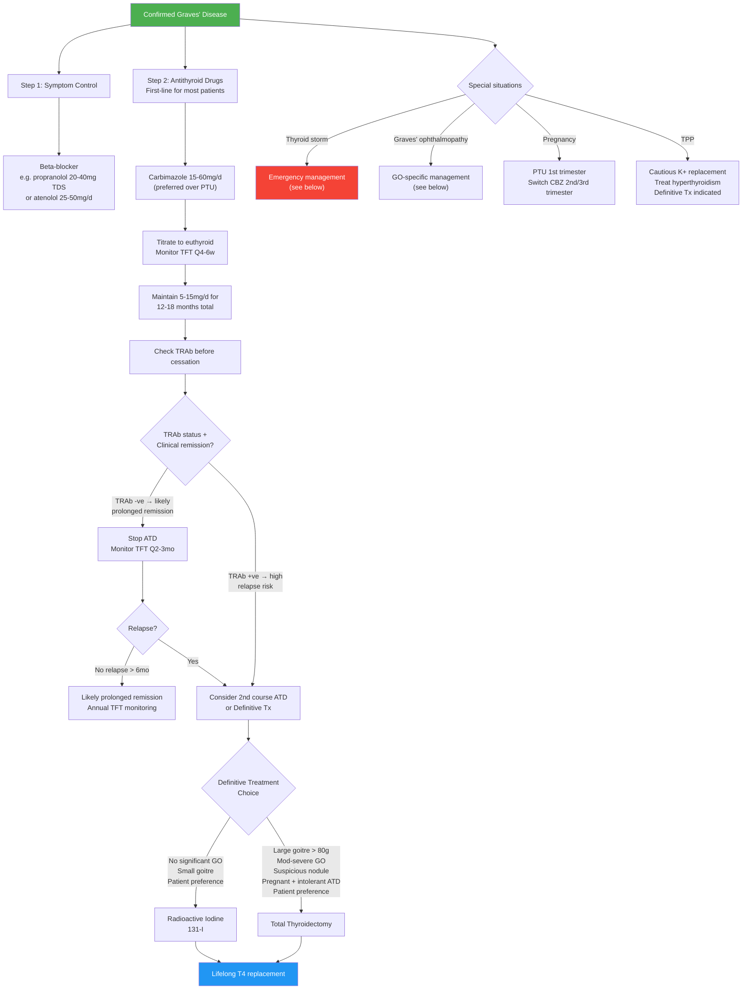
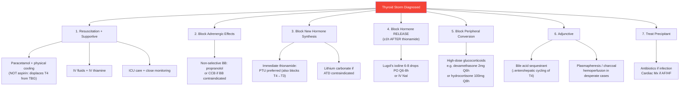

## Management of Graves' Disease

### Management Philosophy

The management of Graves' disease has three tiers, and understanding the rationale behind each is crucial:

1. **Symptom control** — β-blockers to rapidly control adrenergic symptoms while waiting for definitive treatment to take effect
2. **Reduce thyroid hormone production** — Antithyroid drugs (ATDs) as first-line medical therapy
3. **Definitive treatment** — Radioactive iodine (RAI) or thyroidectomy when ATDs fail, are contraindicated, or the patient prefers permanent resolution

The underlying logic is this: ***Graves' disease is an autoimmune disease and may spontaneously remit after 12–18 months*** [2]. Therefore, ***ATDs are usually given as first-line for a 12–18 month course as an initial trial of treatment*** [2]. If the patient remits → excellent, stop. If they relapse → definitive therapy is needed.

---

### Overall Management Algorithm

---

### Treatment Modality 1: Symptom Control — β-Blockers

**Why β-blockers?** As discussed in the pathophysiology section, T3 upregulates β-adrenergic receptor expression and sensitises tissues to normal catecholamine levels. β-Blockers directly counteract this amplified adrenergic signalling. They provide **rapid** symptomatic relief (within days), unlike ATDs which take weeks.

| Feature | Detail |
|---|---|
| **Agents** | ***Non-selective short-acting β-blocker (e.g. propranolol, nadolol) for short-term alleviation of S/S*** [2][5][6] or selective β1-blocker (***e.g. atenolol 25–50mg/d***) [2] |
| **Preferred agent** | ***Propranolol*** (non-selective) is often preferred because it has an additional pharmacological benefit: ***↓peripheral conversion of T4 into T3*** (inhibits type 1 deiodinase) [8][12] |
| **Dose** | Propranolol 20–40 mg TDS (up to 80 mg QDS in severe thyrotoxicosis); Atenolol 25–50 mg OD |
| **Duration** | Short-term — until euthyroidism achieved with ATDs (usually 3–6 weeks), then taper and stop |
| **Contraindications** | Asthma (non-selective β-blockers contraindicated — use cardioselective atenolol or CCB instead), decompensated heart failure, severe bradycardia, 2nd/3rd degree AV block |
| **Alternative** | CCB (e.g. diltiazem or verapamil) if β-blockers contraindicated — controls rate but does NOT inhibit T4→T3 conversion |

---

### Treatment Modality 2: Antithyroid Drugs (ATDs)

***ATDs are generally preferred as initial treatment*** for Graves' disease, ***especially if high likelihood of remission (small goitre, −ve/low TRAb, mild disease) and unsuitable for other modalities*** [2].

#### Mechanism of Action

***Thionamides*** ("thio" = sulphur, "amide" = nitrogen-containing group) — these drugs contain a thioureylene moiety that is essential for their action:

| Mechanism | Explanation |
|---|---|
| ***1. Inhibition of TPO*** (thyroid peroxidase) | ***↓Organification (iodination of tyrosine residues on thyroglobulin) + ↓coupling of iodotyrosines → ↓T4 and T3 synthesis*** [1][2] |
| ***2. ↓Peripheral T4 to T3 conversion*** | ***Only for PTU*** — propylthiouracil inhibits type 1 deiodinase in peripheral tissues; carbimazole/methimazole do NOT have this effect [1][2] |
| ***3. Immunosuppressive*** | ***↓Serum TRAb levels*** — ATDs appear to have a direct immunomodulatory effect, reducing autoantibody production over time; this is why the disease may remit after a course of ATDs [2] |

**Why is onset slow?** ***Onset of euthyroid takes 3–4 weeks since the thyroid gland has large storage of hormones*** — the gland contains a ~2-week supply of pre-formed T4/T3 in thyroglobulin. ***Hormone needs to be depleted before manifestation of drug effects*** [1]. ATDs block *new synthesis* but cannot destroy already-stored hormone.

#### Choice of ATD

| Agent | Preference | Rationale |
|---|---|---|
| ***Carbimazole (CBZ)*** | ***Preferred over PTU*** | ***Achieves euthyroid more rapidly than PTU, once daily dosing, ↓hepatotoxicity, ↓bitter taste, little or no effect on subsequent success of RAI*** [2] |
| ***Methimazole (MMI)*** | Equivalent to carbimazole | Carbimazole is a pro-drug that is converted to methimazole in vivo; in some countries only methimazole is available |
| ***Propylthiouracil (PTU)*** | ***Preferred only in: (1) 1st trimester of pregnancy (↓teratogenicity); (2) Thyroid storm (↓peripheral conversion of T4 into T3); (3) Minor reactions to CBZ*** [2] | PTU has ↑hepatotoxicity risk (fulminant hepatic failure); ↑pill burden (TDS dosing); but is safer in early pregnancy and uniquely blocks T4→T3 conversion |

<Callout title="PTU vs Carbimazole in Pregnancy" type="error">
This is a high-yield exam topic. ***Carbimazole/methimazole are associated with teratogenicity: aplasia cutis and choanal atresia*** [2]. ***PTU is preferred in the 1st trimester because of ↓teratogenicity and ↓breast milk and placental concentration*** [2]. However, because PTU carries a risk of fulminant hepatic failure, the recommended approach is to ***switch back to carbimazole/methimazole from the 2nd trimester onwards*** when the teratogenic risk from carbimazole has passed [2].
</Callout>

#### Dosing Regimens

Two approaches [2]:

| Regimen | How It Works | When to Use |
|---|---|---|
| ***Titrating regimen*** | ***Start high → titrate down by TSH***; initial dose depends on severity (CBZ 15–60mg/d in 2–3 divided doses), then reduce as patient becomes euthyroid to maintenance 5–15mg/d | Standard approach for most patients |
| ***Block and replace*** | ***High-dose ATD + T4 replacement*** — ATD fully blocks thyroid, then exogenous T4 is given to maintain euthyroidism | ***Useful in those where control is difficult (e.g. puberty)*** [2]; avoids the oscillation between hyper/hypo-thyroidism seen with titrating regimen; NOT used in pregnancy (higher total drug exposure) |

#### Initiation, Monitoring, and Duration

| Step | Detail |
|---|---|
| ***Initiation*** | ***Start CBZ at 15–60mg/d in 2–3 divided doses (depends on initial TFT) with baseline CBC and LFT*** [2] |
| ***Monitoring*** | ***Monitor TFT ± CBC/LFT Q4–6 weeks until euthyroid***, then tail down gradually to 5–15mg/d maintenance [2] |
| ***Duration*** | ***Usually 12–18 months*** [1][2]; ***consider repeating 1 more course or definitive Tx if relapse*** [2] |
| ***Before cessation*** | ***Take TRAb titre before cessation (predicts risk of relapse → consider definitive Tx)*** [2] |
| ***After cessation*** | ***Monitor TFT Q2–3 months for recurrence → likely prolonged remission if euthyroid for > 6 months*** [2] |
| ***Remission rate*** | ***Usually < 40% after 1–2 years of Tx but can be > 80% if 5–10 years*** [2] |

#### Side Effects of ATDs

| Side Effect | Frequency | Details |
|---|---|---|
| ***Skin rash / urticaria / pruritus*** | ***5%*** | ***Allergy → trigger release of histamine → treated by antihistamine*** [1]; may attempt cross-switching to the other ATD (but ~30% cross-reactivity) |
| ***Fever, arthritis/arthralgia*** | Uncommon | May be part of a drug hypersensitivity syndrome |
| ***Hepatotoxicity*** | ***PTU >> CBZ*** | ***PTU: up to 1/3 associated with ↑ALT/AST but rarely fulminant hepatic failure; CBZ: cholestatic hepatitis (much rarer)*** [2]; ***hepatic necrosis*** possible with PTU [1] |
| ***Agranulocytosis*** | ***0.1–0.5%*** | ***Occurs within first 2–3 months of treatment*** [1]; ***reversible, ↑with age (> 40y) or high doses*** [2]; ***predicted by HLA-B*38:02:01 allele (mainly found in Asian population)*** [2] |
| ***Teratogenicity*** | — | ***Aplasia cutis, choanal atresia (methimazole/carbimazole >> PTU)*** [2] |

<Callout title="Agranulocytosis — The Most Dangerous ATD Side Effect">
***Agranulocytosis presents classically with fever and sore throat while on ATD*** [2]. All patients starting ATDs MUST be counselled: ***"Seek help immediately if any symptoms of infection"*** [2]. If suspected, stop ATD immediately and check urgent FBC. This is an absolute contraindication to restarting the SAME ATD. The risk is highest in the first 2 months but can occur at any time. ***In the Asian population (including Hong Kong), HLA-B*38:02:01 is a pharmacogenomic marker that predicts increased risk*** [2].
</Callout>

---

### Treatment Modality 3: Radioactive Iodine (RAI / ¹³¹I)

RAI is one of the two **definitive** treatments for Graves' disease. "Definitive" means it aims to permanently destroy or remove the thyroid, eliminating the source of excess hormone production.

#### Mechanism

***Taken up and processed by thyroid gland in the same way as normal iodide*** — specificity to thyroid is due to preferential thyroid uptake via the Na⁺-I⁻ symporter (NIS) [1]. ***Becomes incorporated into thyroglobulin*** → ***emits β-radiation in thyroid gland*** → ***destruction of thyroid gland by necrosis of follicular cells*** [1]. The β-particles have a very short range (~1–2 mm) so damage is confined to the thyroid with minimal systemic radiation.

#### Indications

***Indications for definitive treatment (RAI or surgery):*** [2]
- ***Relapsed after a course of ATD***
- ***Intolerant/allergic to ATDs*** (e.g. agranulocytosis)
- ***Complications (e.g. TPP)***
- ***Contemplating pregnancy (in next 1–2 years)*** — want stable euthyroidism before conception
- ***Patient preference***

***RAI is preferred over surgery when:***
- Small to moderate goitre (< 80g)
- No suspicious nodules requiring histological evaluation
- No significant ophthalmopathy (moderate-to-severe GO is a relative contraindication)
- Patient wishes to avoid surgery

***For Graves' disease specifically:*** ***ATDs are 1st line; RAI is 2nd line*** [8]

#### Contraindications

***Contraindications to RAI:*** [1]
- ***Pregnancy and lactation*** — ***damage of thyroid gland of fetus*** (¹³¹I crosses the placenta and is concentrated by the fetal thyroid from ~12 weeks gestation); ***avoid breast-feeding since it is secreted in breastmilk*** [1]
- ***Children and adolescents*** — ***avoid potential teratogenicity in young age*** [1] (relative contraindication; used in some centres for adolescents but generally avoided < 10 years)
- ***Moderate-to-severe active Graves' ophthalmopathy*** — ***RAI treatment: ↑risk of development or worsening of GO*** [3][10]; ***moderate/severe GO is a contraindication to RAI treatment*** [3][10]
- ***Very large goitre (> 80g)*** — unlikely to achieve adequate destruction with a single dose
- ***Suspected or confirmed thyroid malignancy*** (may need surgery instead)
- ***Inability to comply with radiation safety precautions***

<Callout title="RAI and Ophthalmopathy — Critical Interaction">
***RAI treatment carries ↑risk of development or worsening of Graves' ophthalmopathy*** [3][10]. This is because RAI-induced thyroid cell destruction releases thyroid antigens, which may amplify the autoimmune cross-reaction against orbital fibroblasts. ***If RAI is used in patients with active mild orbitopathy, glucocorticoids should be administered concurrently for those with RFs for progression (smoking, high baseline T3 or TRAb levels)*** [3][10]. In moderate-to-severe GO, RAI should be avoided altogether — prefer thyroidectomy or ATDs.
</Callout>

#### Preparation and Precautions for ¹³¹I Therapy [1]

**Before ¹³¹I therapy:**
- ***Discussion of treatment options and patient's consent***
- ***Instruct patients on post-therapy precautions and follow-ups***
- ***Avoid iodine-containing food, medicine (cough suppressant) or radiological contrast for ≥ 4 weeks before*** [1] — exogenous iodine saturates the NIS and competes with ¹³¹I uptake, reducing treatment efficacy
- ***Avoid anti-thyroid medications for ≥ 4 weeks before*** [1] — ATDs reduce iodine organification; if the gland cannot organify ¹³¹I, the radioiodine washes out before it can deliver its radiation dose
- ***Symptomatic control of hyperthyroidism by propranolol*** [1] (β-blocker is continued through the RAI period to control symptoms)
- ***Pregnancy test for patients with child-bearing potential*** [1]

**After ¹³¹I therapy:**
- ***Symptomatic control of hyperthyroidism by propranolol*** [1] (thyrotoxicosis may transiently worsen in the first 1–2 weeks as damaged follicles release stored hormone)
- ***Discharge home immediately and avoid close contact with others*** [1] (radiation precautions — typically 1–2 weeks of distance from pregnant women and small children)
- ***Safe contraception ≥ 6 months; avoid pregnancy and breast feeding ≥ 6 months*** [1]

#### Side Effects and Outcomes

| Effect | Detail |
|---|---|
| ***Hypothyroidism*** | The intended outcome — virtually all patients become hypothyroid and require ***lifelong T4 replacement***; ***transient = 3.5–28%; permanent = 10–15% in first 2 years and 3%/year*** (due to late effects of radiation and lymphocytic infiltration and destruction of thyroid tissue) [1] |
| **Radiation thyroiditis** | Transient worsening of thyrotoxicosis in first 1–2 weeks (stored hormone release from acutely damaged follicles); treated with β-blockers; self-limiting |
| **Worsening of GO** | As discussed above — mitigated by concurrent glucocorticoids in at-risk patients |
| ***NO effect on fertility*** | [1] |
| ***NO effect on congenital malformations*** | [1] (provided 6-month conception avoidance is observed) |
| ***NO effect on increased cancer risk of offspring*** | [1] |

---

### Treatment Modality 4: Thyroidectomy

Surgery is the other **definitive** treatment. It physically removes the source of excess hormone production.

#### Indications

***Indications for thyroidectomy (3Cs + others):*** [2][8]
- **(Cancer)**: Co-existing suspicious nodule or confirmed malignancy
- **Compressive symptoms**: Dysphagia, dysphonia, dyspnoea, retrosternal goitre
- **Cannot be treated medically**: Frequent relapses, ATD intolerance (e.g. agranulocytosis to both CBZ and PTU), require definitive Tx when RAI unsuitable or large goitre > 80g
- **Cosmesis**: Very large goitre
- ***Moderate/severe Graves' ophthalmopathy*** — RAI contraindicated; thyroidectomy is preferred definitive Tx because it ***↓thyroid antigen load → usually associated with ↓TRAb titres*** [3][10]
- ***Pregnant women intolerant to anti-thyroid medications*** [1]
- ***Patient preference / refused ¹³¹I*** [1]

***For Graves' disease: total thyroidectomy is recommended (cf. subtotal thyroidectomy)*** [8]:

| | Total Thyroidectomy | Subtotal Thyroidectomy |
|---|---|---|
| **Return to euthyroidism** | ***Immediate*** | Variable duration |
| **Risk of recurrence** | ***No risk*** | Can recur (up to 10–15% over time) |
| **Thyroid failure** | ***100%*** (lifelong T4 needed) | Variable (lower but still common) |
| **Risk of parathyroid injury** | ***Higher*** | Lower |
| **Risk of RLN injury** | ***Higher*** | Lower |

Modern practice favours total thyroidectomy for Graves' because the whole point of surgery is to eliminate the disease — leaving a remnant behind risks recurrence and makes subsequent RAI more difficult if needed. The trade-off is accepting certain hypothyroidism (which is easy to manage with T4 replacement) [8].

#### Pre-operative Preparation

This is **extremely high yield** — a thyrotoxic patient undergoing thyroid surgery is at risk of **thyroid storm** if not adequately prepared.

***Pre-op preparation in thyrotoxic patients undergoing thyroid surgery:*** [8]

1. ***Maintain biochemically euthyroid at operation to prevent thyroid storm*** [8]
2. ***High dose carbimazole (30–40 mg/day) for 8–12 weeks, then low dose (15 mg/day) to maintain euthyroid*** [8]
3. ***Propranolol (40 mg TDS): block β-receptor + reduce T4→T3 conversion*** [8]
   - ***More rapid clinical response (days instead of weeks)*** [8]
   - ***T4 level still high post-op: continue propranolol until 7 days post-op*** [8]
4. ***Lugol's iodine: ↓iodine uptake + ↓vascularity of thyroid gland (↓intra-op bleeding)*** [8]
   - ***Can be given with carbimazole/β-blocker for 10 days before operation*** [8]
   - Mechanism: Wolff-Chaikoff effect — supraphysiological iodine doses transiently inhibit organification and also reduce thyroid blood flow by inhibiting TSH-mediated VEGF expression
5. ***Monitor Ca and vitamin D level and supplement accordingly (post-op hypoPTH/hungry bone syndrome)*** [8]
6. ***Vocal cord function by laryngoscopy*** [8] — pre-operative documentation of baseline vocal cord function is medicolegally essential; if there is pre-existing RLN palsy, the surgeon needs to know

<Callout title="Why Lugol's Iodine Must Be Given WITH ATDs, Not Instead Of">
Lugol's iodine (potassium iodide) provides a massive iodine load that initially inhibits hormone release (Wolff-Chaikoff effect) and reduces gland vascularity. BUT — if given ALONE without ATDs, the Wolff-Chaikoff effect is transient (the gland "escapes" within days) and the extra iodine substrate can actually INCREASE hormone production and worsen thyrotoxicosis. Therefore, Lugol's must always be used in combination with ATDs, and only for the 10 days immediately pre-operatively [8][6].
</Callout>

#### Complications of Thyroidectomy

| Complication | Mechanism | Frequency |
|---|---|---|
| ***Hypoparathyroidism*** | Inadvertent removal of or damage to parathyroid glands → ***hypocalcaemia*** | 1–2% permanent; up to 30% transient |
| ***Vocal cord paralysis*** (RLN injury) | ***Recurrent laryngeal nerve*** runs in the tracheo-oesophageal groove posterior to the thyroid; at risk during ligation of inferior thyroid artery or dissection of Berry's ligament | ~1% permanent; 5–10% transient |
| ***Thyroid storm*** | Release of stored hormone from surgical manipulation of a hyperthyroid gland — this is why ***patients should be brought to euthyroid before surgery*** [1] | Very rare if properly prepared |
| ***Haemorrhage*** | Post-operative bleeding into the thyroid bed → ***compression and oedematous effect compresses on trachea*** → airway emergency [1] | < 1%; requires emergent wound opening at bedside |
| **Hypothyroidism** | Intended outcome after total thyroidectomy → lifelong T4 replacement | 100% after total thyroidectomy |
| **Superior laryngeal nerve injury** (external branch) | Runs close to superior thyroid artery → loss of voice projection (cricothyroid muscle) | < 5% |
| **Wound infection / scarring** | Standard surgical complication | Low |

---

### Management of Graves' Disease — Comparison by Cause of Thyrotoxicosis

It is useful to compare how management differs across the common causes of thyrotoxicosis [8]:

| | ***Graves'*** | ***Toxic MNG (Plummer's)*** | ***Toxic Adenoma*** |
|---|---|---|---|
| ***Antithyroid drugs*** | ***1st line*** | ***(Ineffective — recur upon discontinuation); prolonged use if patient does not want RAI or surgery*** | Similar to MNG; not curative |
| ***Radioactive iodine*** | ***2nd line*** | ***Preferred if no 4C*** (no cancer, compression, cosmesis, cannot-treat-medically) | Preferred (↑iodine uptake by autonomous nodule) |
| ***Surgery*** | ***2nd line*** | ***Preferred if 4C present*** | Hemithyroidectomy if no contralateral nodules |
| **Extent of surgery** | ***Total thyroidectomy*** | ***Total thyroidectomy*** | ***Hemithyroidectomy*** |

**Why don't ATDs work long-term for toxic MNG?** Because in MNG, the autonomous nodules have somatic genetic mutations (TSHr or Gsα) — they are NOT driven by autoantibodies. ATDs cannot fix a genetic mutation. The moment you stop the ATD, the mutant nodules resume autonomous production. In Graves', ATDs work because they also have an immunomodulatory effect that can lead to remission of the autoimmune process itself.

---

### Special Situation 1: Thyrotoxic Crisis (Thyroid Storm)

***Rare but life-threatening (10% mortality, medical emergency)*** [5][6]

#### Setting / Triggers [5][6]

- ***Longstanding untreated hyperthyroidism***
- ***Acute infection, thyroid and non-thyroid surgery, trauma, childbirth in previously untreated/undertreated hyperthyroidism***
- ***Withdrawal of antithyroid drugs***
- ***Shortly after treatment procedures (subtotal thyroidectomy or RAI)***
- ***Acute iodine load, e.g. amiodarone***

#### Clinical Features [5][6]

- ***CVS: tachycardia > 140/min, AF, high output failure***
- ***Hyperpyrexia: may reach > 40°C***
- ***CNS disturbance: agitation, anxiety, delirium, psychosis, stupor, coma***
- ***↓TSH/↑fT4 (typically not more profound than uncomplicated hyperthyroidism)*** [6]
- ***± Mild hyperglycaemia, hypercalcaemia and deranged LFT*** [6]

**Diagnosis**: ***Burch and Wartofsky scoring system (sensitive but not specific): ≥ 45 = highly suggestive; 25–44 = supports diagnosis; < 25 = unlikely*** [5]

#### Treatment Algorithm

The treatment of thyroid storm follows a logical sequence — block every step of thyroid hormone action:

**Critical sequencing point**: ***Iodine must be given ≥ 1 hour after first dose of thionamide → prevent the iodine from being used as substrate for new hormone synthesis*** [5][6]. If you give iodine FIRST, the thyroid has a massive substrate load and will synthesise even MORE hormone before the ATD can block TPO.

***PTU is preferred in thyroid storm*** for its blocking effect on T4-to-T3 conversion (in addition to blocking synthesis) [5][6].

***Lithium: LiCO₃ 250mg Q6H to [Li] 0.6–1.0 mmol/L if contraindicated to thionamide*** [5] (e.g. previous agranulocytosis). Lithium inhibits thyroglobulin proteolysis and thyroid hormone release.

***Consider plasmapheresis and charcoal haemoperfusion in desperate cases*** [1][5]

**Subsequent management** [6]:
- ***Stop iodine and taper steroids once clinical improvement is evident***
- ***Titrate thionamide (and switch to methimazole/carbimazole) to maintain euthyroidism***
- Plan for definitive treatment to prevent recurrence

<Callout title="Why NOT Aspirin in Thyroid Storm?" type="error">
Aspirin (salicylates) displaces T4 from thyroxine-binding globulin (TBG), acutely increasing FREE T4 levels and potentially worsening the storm. Use **paracetamol** for fever control instead [5][6].
</Callout>

---

### Special Situation 2: Management of Graves' Ophthalmopathy

***Occurs in ~20–25% of Graves' disease patients*** [3][10]. Management is guided by both **activity** (CAS score) and **severity** (EUGOGO classification).

#### General Measures (All Patients) [3][10]

- ***Smoking cessation: smoking renders patients more refractory to anti-inflammatory therapy*** [3][10]
- ***Reversal of hyperthyroidism if present:***
  - ***Choice: total thyroidectomy, thionamides*** [3][10]
  - ***Effect: ↓thyroid antigen load → usually associated with ↓TRAb titres*** [3][10]
  - ***Note that moderate/severe GO is a contraindication to RAI treatment*** [3][10]
- ***Local symptomatic control:***
  - ***Exposure-related discomfort: eye shades, artificial tears, eye lubricants (e.g. 1% methylcellulose)*** [3][10]
  - ***Diplopia: eye patching, prisms*** [3][10]

#### Severity-Specific Management [3][10]

| Severity | Features | Management |
|---|---|---|
| ***Sight-threatening*** | ***Dysthyroid optic neuropathy (DON)*** | ***IV glucocorticoids (e.g. dexamethasone 4mg IV)*** + ***Urgent orbital decompression surgery*** |
| | ***Exposure keratopathy*** | ***Eyelid taping or temporary tarsorrhaphy*** + ***Ocular lubrication*** ± ***Orbital decompression surgery*** |
| ***Moderate to severe*** | ***Lid retraction ≥ 2mm; Moderate/severe soft tissue involvement; Exophthalmos ≥ 3mm above normal; Inconstant/constant diplopia*** | **Active disease:** ***Oral or IV glucocorticoids (e.g. prednisolone 30mg/d × 4 weeks)***; ***Rituximab, MMF, orbital RT if ineffective***; ***Newer therapy: tocilizumab (anti-IL6), teprotumumab (anti-IGF-1 receptor)***; ***Consider orbital decompression surgery*** |
| | | **Inactive disease — surgery in order:** ***1. Orbital decompression surgery (↓DON, ↓proptosis)*** → ***2. EOM surgery (↓diplopia, 6–8 weeks after orbital surgery)*** → ***3. Eyelid surgery (↓ocular exposure, enhance cosmesis)*** |
| ***Mild*** | ***Lid retraction < 2mm; Transient or no diplopia; Corneal exposure responsive to lubricants*** | ***Local measures for relief of symptoms***; ***Selenium for 6 months may improve soft-tissue swelling*** |

**Why the specific surgical sequence (decompression → EOM → eyelid)?** Because each procedure changes the anatomy that the subsequent procedure needs to address. Orbital decompression changes the position of the globe (and thus EOM alignment); EOM surgery changes lid position. Doing them out of order means the results of earlier surgery will be undone.

**Teprotumumab** (anti-IGF-1 receptor monoclonal antibody) — approved by FDA 2020 for moderate-to-severe active GO. It targets the IGF-1R/TSHr signalling complex on orbital fibroblasts, directly reducing the pathological process. This represents a paradigm shift in GO management, with significant reduction in proptosis and diplopia in clinical trials.

---

### Special Situation 3: Pregnancy

| Trimester | Management | Rationale |
|---|---|---|
| **1st trimester** | ***PTU preferred*** | ***↓Teratogenicity compared to CBZ/MMI; ↓placental transfer*** [2] |
| **2nd–3rd trimester** | ***Switch to carbimazole/methimazole*** | PTU risk of maternal hepatotoxicity outweighs teratogenic advantage (organogenesis complete) [2] |
| **All trimesters** | Lowest effective dose; target fT4 at upper end of normal or mildly elevated | Avoid fetal hypothyroidism from over-treatment (fetal thyroid is more sensitive to ATDs than maternal) |
| **3rd trimester** | ***Check TRAb level*** | ***Assessing risk of neonatal Graves' disease: ↑risk if ↑TRAb level*** — TRAb (IgG) crosses placenta [2] |
| **RAI** | ***Absolutely contraindicated*** | ***Damage of thyroid gland of fetus*** [1] |
| **Surgery** | 2nd trimester if essential (ATD intolerance) | Avoid 1st trimester (↑miscarriage) and 3rd trimester (↑preterm labour) |

---

### Special Situation 4: Thyrotoxic Periodic Paralysis (TPP)

| Aspect | Management |
|---|---|
| **Acute attack** | ***K⁺ supplement: use IV K 10–20 mmol/h over 2h to accelerate recovery (do not exceed this)***; ***Watch out for rebound hyperkalaemia (40–59%)*** [7]; ***IV propranolol may be useful to reverse excessive ↑Na⁺/K⁺/ATPase activity in refractory cases*** [7]; ***cardiac monitoring*** [7] |
| **Definitive** | ***Manage hyperthyroidism accordingly*** — ***definitive treatment is indicated (TPP is listed as an indication for definitive Tx)*** [2][7] |
| **Prophylaxis** | ***Low salt diet, CHO intake in moderation ± propranolol*** [7] |

---

### Lifelong Follow-Up After Definitive Treatment

Both RAI and total thyroidectomy result in permanent hypothyroidism requiring ***lifelong levothyroxine (T4) replacement*** [1]:

| Parameter | Detail |
|---|---|
| **Drug** | ***Levothyroxine (T4)*** — the standard replacement for hypothyroidism of any cause; taken once daily (due to its long half-life ~7 days) [1] |
| **Dose** | Typically 1.6 μg/kg/day (~75–150 μg/day in adults); start low in elderly/cardiac patients (25–50 μg/day and ↑slowly) |
| **Monitoring** | TSH every 6–8 weeks after initiation until stable, then annually; target TSH 0.4–4.0 mIU/L |
| **Caution** | ***Contraindicated in patients with untreated adrenal insufficiency*** — T4 increases metabolic clearance of cortisol; in a patient with co-existing Addison's disease, starting T4 without cortisol replacement → ***acute adrenal crisis*** [1] |

---

<Callout title="High Yield Summary">

**Management of Graves' Disease — Exam Essentials:**

1. **Three-tier approach**: β-blockers (symptom control) → ATDs (first-line, 12–18 months) → Definitive Tx (RAI or surgery if relapse/intolerance)
2. **ATDs**: Carbimazole preferred over PTU (better safety profile, once daily); PTU only for 1st trimester pregnancy, thyroid storm, CBZ reactions
3. **ATD side effects**: Rash 5%; Agranulocytosis 0.1–0.5% (first 2–3 months, present as fever/sore throat — stop immediately); Hepatotoxicity (PTU >> CBZ); Teratogenicity (CBZ >> PTU: aplasia cutis, choanal atresia)
4. **TRAb before ATD cessation**: +ve → high relapse risk → definitive Tx; −ve → likely prolonged remission
5. **RAI**: Contraindicated in pregnancy/lactation, children, moderate-severe GO; preparation requires stopping ATDs and iodine-containing substances ≥ 4 weeks before; concurrent glucocorticoids if mild GO with RFs
6. **Surgery**: Total thyroidectomy for Graves'; pre-op prep = euthyroid on carbimazole + propranolol + Lugol's iodine 10 days pre-op; complications = hypoPTH, RLN injury, haemorrhage
7. **Thyroid storm**: PTU (preferred ATD) → Iodine ≥ 1h AFTER ATD → Glucocorticoids → β-blockers → Supportive; NO aspirin (displaces T4 from TBG)
8. **GO management by severity**: Mild → local measures + selenium; Moderate-severe active → IV steroids ± teprotumumab; Sight-threatening → IV steroids + urgent orbital decompression
9. **Pregnancy**: PTU in 1st trimester → switch CBZ 2nd trimester; check TRAb in 3rd trimester for neonatal risk; RAI absolutely contraindicated
10. **After definitive Tx**: Lifelong T4 replacement; annual TSH monitoring

</Callout>

---

<ActiveRecallQuiz
  title="Active Recall - Management of Graves' Disease"
  items={[
    {
      question: "A 30-year-old woman with newly diagnosed Graves' disease is started on carbimazole. She asks when she will feel better. Explain why ATDs have a slow onset of action and what is done in the interim.",
      markscheme: "ATDs inhibit NEW thyroid hormone synthesis (by blocking TPO), but the thyroid gland stores approximately 2 weeks' worth of pre-formed T4/T3 in thyroglobulin. These stored hormones must be depleted before drug effects manifest, taking 3-4 weeks to achieve euthyroidism. In the interim, beta-blockers (e.g. propranolol) are given for rapid symptomatic control of adrenergic symptoms. Propranolol also inhibits peripheral T4 to T3 conversion.",
    },
    {
      question: "List the pre-operative preparation steps for a thyrotoxic Graves' patient undergoing total thyroidectomy.",
      markscheme: "1) Achieve biochemically euthyroid with high-dose carbimazole (30-40mg/d) for 8-12 weeks, then reduce to 15mg/d. 2) Propranolol 40mg TDS for adrenergic control and T4-to-T3 conversion blockade; continue until 7 days post-op. 3) Lugol's iodine for 10 days pre-op to reduce gland vascularity and decrease intra-operative bleeding. 4) Monitor calcium and vitamin D levels. 5) Pre-operative laryngoscopy to document baseline vocal cord function.",
    },
    {
      question: "In thyroid storm management, why must iodine be given at least 1 hour AFTER thionamide? What happens if you give iodine first?",
      markscheme: "Thionamide blocks TPO, preventing new hormone synthesis. If iodine is given first (without prior TPO blockade), the thyroid gland has a massive substrate load and will use the iodine to synthesise even more T4/T3, worsening the storm. By giving thionamide first, you ensure TPO is blocked so the iodine cannot be organified. The iodine then only exerts its Wolff-Chaikoff effect (transient inhibition of further organification and reduction of hormone release).",
    },
    {
      question: "A pregnant woman with Graves' disease in her first trimester needs antithyroid drugs. Which ATD do you choose and why? What do you do differently in the second trimester?",
      markscheme: "First trimester: PTU is preferred because carbimazole/methimazole are associated with teratogenicity (aplasia cutis, choanal atresia). PTU also has lower placental transfer. Second trimester onwards: switch to carbimazole because the teratogenic risk has passed (organogenesis complete by week 12) and PTU carries risk of maternal fulminant hepatic failure. Also check TRAb in 3rd trimester to assess neonatal Graves' risk.",
    },
    {
      question: "Why is moderate-to-severe Graves' ophthalmopathy a contraindication to RAI, and what alternative definitive treatment would you offer?",
      markscheme: "RAI causes thyroid cell destruction, releasing thyroid antigens that amplify the autoimmune cross-reaction against orbital fibroblasts, worsening GO. The preferred definitive treatment is total thyroidectomy, which reduces thyroid antigen load and is associated with decreased TRAb titres, potentially improving GO. If RAI must be used in mild GO, concurrent glucocorticoids should be given to patients with risk factors for progression (smoking, high T3 or TRAb levels).",
    },
    {
      question: "What is agranulocytosis in the context of ATD therapy? How does it present, what is the incidence, and what specific pharmacogenomic marker is relevant in Hong Kong?",
      markscheme: "Agranulocytosis is a severe reduction in granulocyte (neutrophil) count, occurring in 0.1-0.5% of patients on ATDs. It usually occurs within the first 2-3 months and presents classically with fever and sore throat. ATD must be stopped immediately and urgent FBC checked. In the Asian population (including Hong Kong), HLA-B*38:02:01 allele predicts increased risk of ATD-induced agranulocytosis. Risk is higher with older age (over 40) and higher doses.",
    },
  ]}
/>

---

## References

[1] Senior notes: felixlai.md (Treatment of hyperthyroidism table; RAI preparations and contraindications; Management of thyroid storm)
[2] Senior notes: Ryan Ho Endocrine.pdf (Section 1.4.1 Graves' Disease — Approach to Mx, ATDs, RAI indications; Section 1.3.1 Thyrotoxicosis — Mx)
[3] Senior notes: Ryan Ho Endocrine.pdf (Section 1.4.1.1 Graves' Ophthalmopathy — Management by severity)
[5] Senior notes: Ryan Ho Fundamentals.pdf (Section 3.8.1.1 Thyrotoxicosis — Mx, Thyroid storm)
[6] Senior notes: Adrian Lui Pediatrics.pdf (p272–273 — Mx of thyrotoxicosis, Thyroid storm management)
[7] Senior notes: Ryan Ho Endocrine.pdf (Section 1.4.1.2 Thyrotoxic Periodic Paralysis — Mx)
[8] Senior notes: maxim.md (Thyrotoxicosis management table — indications by cause; Pre-op preparation; Extent of resection)
[10] Senior notes: Ryan Ho Opthalmology.pdf (Section 7.1 — Management of GO by severity, RAI contraindication in GO)
[12] Senior notes: Ryan Ho Psychiatry.pdf (Section 3.1.3.1 Lithium — pharmacology reference for lithium use in thyroid storm)
