## Complications of Hashimoto's Thyroiditis

Hashimoto's thyroiditis is a slowly progressive autoimmune condition. Left untreated or inadequately treated, it leads to complications that span virtually every organ system — because thyroid hormone affects *everything*. The complications can be conceptually divided into:

1. **Complications of the hypothyroid state itself** (the consequence of inadequate thyroid hormone)
2. **Complications of the goitre** (local mass effects)
3. **Complications of the autoimmune process** (associated autoimmune diseases and malignancy)
4. **Complications of treatment** (levothyroxine and surgery)

Let's dissect each category from first principles.

---

### 1. Complications of Untreated/Undertreated Hypothyroidism

These complications arise because thyroid hormone drives basal metabolic rate, protein synthesis, and catecholamine sensitivity. When it is deficient, every system decelerates. The severity is proportional to the degree and duration of hypothyroidism.

#### A. Cardiovascular Complications

| Complication | Pathophysiological Mechanism | Clinical Relevance |
|---|---|---|
| **Dyslipidaemia** | ***Hyperlipidaemia — both TG and cholesterol*** [3][7]: ↓T4 → ↓hepatic LDL receptor expression → ↓LDL clearance → ↑LDL-C; ↓lipoprotein lipase activity → ↑triglycerides | ***Leads to accelerated atherosclerosis → ↑risk of IHD*** [3][7][11]; ***TSH > 10 associated with ↑risk of IHD (1.89×) and HF (1.86×)*** [11] |
| **Coronary artery disease** | Dyslipidaemia + ↑peripheral vascular resistance + diastolic hypertension → accelerated coronary atherosclerosis | ***Hypothyroidism can lead to hyperlipidaemia → coronary atherosclerosis; starting T4 may ↑CO → exacerbate IHD*** [3] — a therapeutic double-bind |
| ***Pericardial effusion*** | ↑capillary permeability + GAG deposition in pericardium → slow accumulation of transudative fluid [3][7][22] | Usually asymptomatic and detected incidentally on echocardiography; rarely causes tamponade because accumulation is gradual and the pericardium stretches |
| **Bradycardia and conduction abnormalities** | ↓T4 → ↓β1-adrenergic receptor expression in myocardium → ↓chronotropy and ↓dromotropy | Sinus bradycardia is almost universal; heart block is rare but reported |
| **Diastolic hypertension** | ↑peripheral vascular resistance (↓T4 → ↓vasodilatory effect of T3 on smooth muscle) | Contributing factor to coronary disease |
| **Heart failure** | ↓contractility (↓myosin heavy-chain α expression) + diastolic dysfunction + pericardial effusion | ***Hypothyroidism may mask underlying HF; therefore T4 should be started slowly in susceptible individuals*** [22] |

<Callout title="The Cardiovascular Paradox">
Hypothyroidism causes atherosclerosis through dyslipidaemia, but at the same time, the low metabolic rate is somewhat "protective" because the heart is not being pushed hard. The danger comes when you **start treating** with T4 — suddenly increasing metabolic demand on a heart with already-compromised coronary arteries can precipitate angina, MI, or arrhythmias. This is why we **start low and go slow** in elderly/IHD patients [3][7].
</Callout>

#### B. Neuropsychiatric Complications

| Complication | Mechanism | Details |
|---|---|---|
| **Depression and cognitive slowing** | ↓CNS neurotransmitter synthesis (↓serotonin, ↓noradrenaline) + ↓cerebral blood flow | Very common; often the presenting complaint; may be misdiagnosed as primary depression |
| **Dementia** | Prolonged ↓T4 → ↓myelination, ↓synaptic plasticity | Reversible in early stages with T4 replacement; irreversible if prolonged |
| ***Hashimoto encephalopathy*** | ***An uncommon syndrome due to autoimmune vasculitis thought to be associated with Hashimoto's thyroiditis, presenting with subacute onset of confusion, altered mentation, seizures, myoclonus*** [22] | Also called "steroid-responsive encephalopathy associated with autoimmune thyroiditis" (SREAT); responds to corticosteroids; anti-TPO strongly positive; diagnosis of exclusion |
| ***Ataxia*** | Cerebellar dysfunction from severe prolonged hypothyroidism [3][7] | Mechanism not fully elucidated; may involve ↓myelination of cerebellar white matter tracts |
| **Carpal tunnel syndrome** | ***Sensory loss as carpal tunnel is thickened in myxoedema*** [22] — mucopolysaccharide deposition compresses the median nerve | Predisposing factor for entrapment neuropathy [23]; may improve with T4 replacement |
| **Peripheral neuropathy** | ↓T4 is a cause of polyneuropathy [23] — ↓Schwann cell function and ↓nerve conduction velocity | Usually a length-dependent sensorimotor polyneuropathy |

#### C. Metabolic and Electrolyte Complications

| Complication | Mechanism | Management |
|---|---|---|
| ***Hyponatraemia / SIADH*** | ↓free water excretion (↓GFR + ↓cardiac output) + ↑ADH secretion → dilutional hyponatraemia [3][7] | Correct with T4 replacement + fluid restriction; severe cases may need hypertonic saline |
| **Weight gain** | ↓BMR + fluid retention (myxoedema) — not primarily fat gain but mixed fluid/fat | Usually modest (5–10 kg); largely reverses with T4 replacement |
| **Hypoglycaemia** | ↓gluconeogenesis + ↓cortisol (if coexisting Addison's) | Important in myxoedema coma — correct with D10 |

#### D. Haematological Complications

| Complication | Mechanism |
|---|---|
| ***Anaemia*** | Multiple mechanisms: (1) ***Anaemia of chronic disease*** — ↓EPO production due to ↓metabolic demand; (2) ***Iron deficiency*** from menorrhagia (a consequence of hypothyroid menstrual irregularity); (3) ***Folate deficiency*** from bacterial overgrowth due to ↓GI motility; (4) ***Pernicious anaemia*** from coexisting autoimmune gastritis [22] |
| **Macrocytosis** | ↓DNA synthesis from B12/folate deficiency (pernicious anaemia association) or direct effect of hypothyroidism on erythropoiesis |

#### E. Reproductive Complications

| Complication | Mechanism |
|---|---|
| ***Menstrual irregularities*** | ↑TRH → ↑prolactin → disrupts GnRH pulsatility → ***menorrhagia, oligomenorrhoea, anovulation*** [3][7][22] |
| ***Infertility*** | Anovulation + ↓progesterone → difficulty conceiving; ↑risk of early miscarriage [11][22] |
| **Adverse pregnancy outcomes** | Untreated maternal hypothyroidism → preeclampsia, placental abruption, preterm birth, low birth weight, impaired fetal neurodevelopment |
| ***Hyperprolactinaemia and galactorrhoea*** | ***↑TRH directly stimulates lactotrophs → ↑prolactin*** [3][7] |
| ***↓Libido, ED, delayed ejaculation in males*** [22] | ↓testosterone from ↓GnRH + ↓SHBG alterations |

#### F. Myxoedema Coma — The Most Severe Complication

***Myxoedematous coma: very rare, medical emergency*** with 20–40% mortality [3][7]

- **What**: The end-stage of prolonged, severe, untreated hypothyroidism
- ***S/S: confusion, coma, ↓↓body temperature, convulsion, respiratory failure, hypoxia; prone to superimposed infections*** [3][7]
- **Precipitants**: Infection (most common), cold exposure, sedatives, non-compliance with T4, surgery, stroke
- **Why it kills**: Severe hypothermia → cardiovascular collapse; ↓respiratory drive → CO₂ retention → respiratory failure; hyponatraemia → seizures; hypoglycaemia → cerebral injury
- ***Treatment: treat precipitating cause + supportive (fluid replacement, maintain body temperature, correct electrolytes/hypoglycaemia) + urgent T4/T3 + IV hydrocortisone*** [3][7]

> This was covered in detail in the Management section but is listed here as the most feared complication of the hypothyroid state itself.

---

### 2. Complications of the Goitre (Local Mass Effects)

The goitre in Hashimoto's is usually small to moderate and rarely causes significant compression. However, in a minority of patients, the goitre can be large enough to produce local effects, or a coexisting pathology (lymphoma) may cause rapid enlargement.

| Complication | Mechanism | When to Suspect |
|---|---|---|
| **Tracheal compression → dyspnoea, stridor** | Large goitre compresses the trachea (especially with retrosternal extension) | Progressive exertional dyspnoea; inspiratory stridor; flow-volume loop shows blunted pattern |
| **Oesophageal compression → dysphagia** | Goitre pushes posteriorly against the oesophagus | Difficulty swallowing solids more than liquids |
| **Recurrent laryngeal nerve compression → dysphonia** | Very rare in uncomplicated Hashimoto's; if present, suspect **malignancy** (lymphoma or coexisting carcinoma) invading the nerve [3] | New-onset hoarseness in a Hashimoto's patient is a red flag |
| **Venous congestion** | Large goitre (especially retrosternal) compresses jugular veins | Facial plethora, distended neck veins, Pemberton's sign (facial congestion + arm tingling on raising arms above head) |

---

### 3. Complications of the Autoimmune Process

The autoimmune process in Hashimoto's has consequences that extend beyond the thyroid gland itself.

#### A. Thyroid Lymphoma — The Most Important Neoplastic Complication

***Thyroid lymphoma*** [2][10]:
- ***Epidemiology: 5% of all thyroid cancer, usually > 50 years, M:F = 1:2*** [2]
- ***Risk factors: history of lymphoma elsewhere, Hashimoto's thyroiditis (60× risk)*** [2] — this is one of the strongest disease-to-cancer associations in medicine
- ***Pathology: usually diffuse large B-cell (non-Hodgkin) lymphoma*** [2]; MALT lymphoma is the other common type
- ***S/S: usually rapidly enlarging hard goitre with compressive symptoms (over 2–3 months)*** [2]
- ***Management: R-CHOP + EBRT as standard therapy*** [2]
- ***Prognosis: better than anaplastic carcinoma, median survival 9 years*** [2]

**Why does Hashimoto's predispose to lymphoma?**
Long-standing chronic lymphocytic infiltration of the thyroid creates a persistent pool of activated B-cells in an environment rich in pro-inflammatory cytokines and self-antigen stimulation. Over decades, this chronic immune activation provides the substrate for clonal B-cell expansion → MALT lymphoma → potential transformation to DLBCL. It is the same principle as H. pylori gastritis → gastric MALT lymphoma, or coeliac disease → enteropathy-associated T-cell lymphoma.

<Callout title="Red Flag: Rapid Painless Enlargement in a Hashimoto's Patient" type="error">
If a patient with long-standing Hashimoto's develops **rapid painless enlargement** of the goitre (especially over weeks to months), thyroid lymphoma must be excluded urgently. ***Requires core biopsy (not just FNAC)*** [10] because FNAC cannot distinguish dense lymphocytic thyroiditis from lymphoma — tissue architecture and immunohistochemistry/flow cytometry are needed.
</Callout>

#### B. Papillary Thyroid Carcinoma

- The relationship between Hashimoto's and papillary thyroid carcinoma (PTC) is debated but there is epidemiological evidence of a modest association
- ***Hashimoto's thyroiditis is listed as a risk factor for thyroid cancer*** [10]
- May be due to: chronic TSH stimulation driving follicular cell proliferation, or shared genetic susceptibility, or detection bias (more USG/FNAC in Hashimoto's patients)
- Any discrete nodule in a Hashimoto's goitre should be evaluated by USG ± FNAC as per standard guidelines

#### C. Associated Autoimmune Diseases (Autoimmune Polyendocrine Syndromes)

Hashimoto's thyroiditis frequently coexists with other organ-specific autoimmune diseases due to shared HLA susceptibility and generalised immune dysregulation:

| Associated Condition | Approximate Prevalence in Hashimoto's | Pathological Basis | Clinical Impact |
|---|---|---|---|
| **Pernicious anaemia** | ~5–10% | Anti-parietal cell / anti-IF antibodies → ↓B12 absorption | Macrocytic anaemia, subacute combined degeneration of cord; screen with B12 levels |
| **Type 1 DM** | ~2–5% (and vice versa) | Shared HLA susceptibility; islet cell autoimmunity | ***T1DM is associated with autoimmune thyroid disease (2–5%)*** [5]; co-manage |
| **Addison's disease** | ~1–2% | Anti-adrenal autoantibodies → adrenal cortex destruction | ***Must treat adrenal insufficiency BEFORE starting T4*** to prevent adrenal crisis |
| **Vitiligo** | ~5% | Anti-melanocyte autoantibodies | Cosmetic; marker of autoimmune diathesis |
| **Coeliac disease** | ~2–5% | Anti-tTG IgA; shared HLA-DQ2/DQ8 | Can impair T4 absorption — suspect if patient needs unusually high T4 doses |
| ***Primary biliary cholangitis*** | ***10–15% of PBC patients have Hashimoto's*** [24] | Shared autoimmune pathogenesis | Screen for thyroid function in PBC patients |
| ***Autoimmune hepatitis*** | ***8–23% of AIH patients have autoimmune thyroiditis*** [9] | Shared autoimmune diathesis | |
| **Sjögren's syndrome** | ~5–10% | Lymphocytic infiltration of exocrine glands | Dry eyes, dry mouth |
| **Alopecia areata** | Variable | Anti-hair follicle autoimmunity | Patchy hair loss |

The clustering of Hashimoto's with Addison's disease (± Type 1 DM) is called **Schmidt syndrome** (autoimmune polyendocrine syndrome type 2, APS-2). This is clinically important because the adrenal insufficiency can be fatal if unrecognised.

> **Teaching point**: When you diagnose Hashimoto's, always think about what *else* may be lurking. Screen for associated autoimmune conditions based on clinical suspicion — particularly pernicious anaemia (if macrocytosis), T1DM (if hyperglycaemia), and Addison's (if unexplained fatigue, hypotension, or hyponatraemia out of proportion to hypothyroidism).

---

### 4. Complications of Treatment

#### A. Complications of Levothyroxine Therapy

| Complication | Mechanism | Prevention |
|---|---|---|
| ***Overtreatment → osteoporosis*** | Excess T4 → suppressed TSH → ↑bone turnover → ↓bone density (especially postmenopausal women) | ***Avoid overtreatment; monitor TSH; do not suppress TSH below normal*** [7] |
| ***Overtreatment → atrial fibrillation*** | Excess T4 → ↑atrial β-receptor sensitivity → ↑automaticity | ***Especially in elderly; maintain TSH in normal range*** [7] |
| ***Acute adrenal crisis*** | Starting T4 in a patient with unrecognised adrenal insufficiency → ↑cortisol metabolism → crisis | ***Always consider coexisting Addison's; give hydrocortisone first if suspected*** |
| ***Exacerbation of IHD*** | ***↑workload of heart → angina, arrhythmias, cardiac failure*** [20] | ***Start low (25 µg), go slow; treat coronary disease first*** [3] |

#### B. Complications of Thyroidectomy (If Performed)

***Complications of thyroidectomy*** [20][22][25]:

| ***Classification*** | ***Complications*** | ***Mechanism and Details*** |
|---|---|---|
| ***Immediate (intraoperative)*** | ***Intraoperative bleeding*** | Direct vascular injury |
| | ***Oesophageal / tracheal injury*** | Dissection injury |
| | ***Tracheomalacia*** | Degeneration of tracheal cartilage after removal of compressive goitre |
| | ***Superior laryngeal nerve injury*** | ***SLN supplies cricothyroid → vocal fatigue, cannot produce high-pitched sound*** [20] |
| | ***Recurrent laryngeal nerve injury*** | ***Ipsilateral: unilateral vocal cord palsy → hoarseness, ineffective cough; Bilateral: stridor, dyspnoea → emergency re-intubation ± tracheostomy*** [20] |
| ***Early (1 day – 1 month)*** | ***Haematoma formation*** | ***Potentially fatal if compression on airways; management: remove stitches and allow drainage*** [20] |
| | ***Wound infection*** | Standard surgical complication |
| | ***Hypocalcaemia / hypoparathyroidism*** | ***MOST common complication; risk 1–4% permanent, 10–20% transient*** [20][25]; parathyroid glands damaged/devascularised; ***presents with perioral and acral paraesthesia, carpopedal spasm, Trousseau's and Chvostek's signs*** [20] |
| ***Late*** | ***Recurrence*** | If subtotal thyroidectomy performed (rare in Hashimoto's) |
| | ***Hypothyroidism*** | ***100% after total thyroidectomy; 10–20% after hemithyroidectomy*** [21] |
| | ***Hypertrophic scar / keloid*** | Individual wound healing tendency |
| | ***Hungry bone syndrome*** | Relevant if pre-existing hyperparathyroidism (rare in Hashimoto's); sudden ↓PTH → ↑bone ossification → severe hypocalcaemia [20] |

---

### 5. Complications in Special Populations

#### Pregnancy

| Complication | Mechanism |
|---|---|
| **Miscarriage** | Inadequate T4 → impaired trophoblast function and implantation |
| **Preeclampsia** | ↑peripheral vascular resistance + endothelial dysfunction |
| **Preterm birth** | Hypothyroidism disrupts prostaglandin and progesterone balance |
| **Impaired fetal neurodevelopment** | Fetal brain depends on maternal T4 in first trimester (before fetal thyroid is functional at ~12 weeks); ***↑dosage in pregnancy to prevent congenital hypothyroidism (associated with devastating consequences)*** [7] |
| **Placental abruption** | Mechanism not fully elucidated; ↑risk in hypothyroid pregnancies |

#### Children and Adolescents

| Complication | Mechanism |
|---|---|
| ***Growth retardation*** | T4 is essential for GH action at the growth plate; hypothyroidism → ↓linear growth |
| ***Delayed puberty*** | ↓GnRH pulsatility from ↑prolactin; ↓sex steroid synthesis |
| ***Intellectual disability (juvenile myxoedema)*** | ↓T4 during critical periods of brain development → ↓myelination, ↓synaptogenesis |

---

### Summary: Complications at a Glance

```mermaid
flowchart TD
    A["Hashimoto's Thyroiditis - Complications"] --> B["Hypothyroid state"]
    A --> C["Goitre effects"]
    A --> D["Autoimmune associations"]
    A --> E["Treatment complications"]
    B --> B1["CVS: dyslipidaemia, IHD, pericardial effusion, bradycardia, HF"]
    B --> B2["Neuro: depression, dementia, Hashimoto encephalopathy, ataxia, CTS, polyneuropathy"]
    B --> B3["Metabolic: hyponatraemia, hypoglycaemia, weight gain"]
    B --> B4["Haem: anaemia (multiple types)"]
    B --> B5["Reproductive: menstrual irregularity, infertility, pregnancy complications"]
    B --> B6["Myxoedema coma (most severe)"]
    C --> C1["Tracheal compression → stridor"]
    C --> C2["Oesophageal compression → dysphagia"]
    C --> C3["RLN compression → hoarseness (suspect malignancy)"]
    D --> D1["Thyroid lymphoma (60x risk)"]
    D --> D2["Papillary thyroid carcinoma (debated)"]
    D --> D3["Other AI diseases: pernicious anaemia, T1DM, Addison's, vitiligo, coeliac, PBC"]
    E --> E1["Levothyroxine: overtreatment → osteoporosis, AF; adrenal crisis if Addison's"]
    E --> E2["Thyroidectomy: hypoparathyroidism, RLN injury, haematoma, hypothyroidism"]
```

---

<Callout title="High Yield Summary — Complications">

1. **Cardiovascular**: Dyslipidaemia (↑LDL, ↑TG) → accelerated atherosclerosis → IHD; pericardial effusion; bradycardia; diastolic hypertension
2. **Myxoedema coma**: Most severe complication; hypothermia, coma, respiratory failure; 20–40% mortality; treat with hydrocortisone → T4/T3 → supportive
3. **Thyroid lymphoma**: ***60× risk*** in Hashimoto's; suspect rapid painless goitre enlargement; core biopsy required; R-CHOP + EBRT
4. **Neuropsychiatric**: Depression, cognitive decline, Hashimoto encephalopathy (steroid-responsive), ataxia, carpal tunnel syndrome
5. **Hyponatraemia/SIADH**: From ↓free water excretion + ↑ADH
6. **Reproductive**: Menorrhagia, infertility, miscarriage, preeclampsia, impaired fetal neurodevelopment
7. **Anaemia**: Multifactorial — chronic disease, iron deficiency (menorrhagia), B12 deficiency (pernicious anaemia)
8. **Associated autoimmune diseases**: T1DM, Addison's (Schmidt syndrome), pernicious anaemia, coeliac, PBC, vitiligo
9. **Treatment complications**: Overtreatment → osteoporosis + AF; adrenal crisis if untreated Addison's; thyroidectomy → hypoparathyroidism, RLN injury
10. **Pregnancy**: Must increase T4 dose; untreated → miscarriage, preeclampsia, fetal neurodevelopmental impairment

</Callout>

---

<ActiveRecallQuiz
  title="Active Recall - Complications of Hashimoto's Thyroiditis"
  items={[
    {
      question: "Explain the pathophysiology of dyslipidaemia in Hashimoto's thyroiditis and its cardiovascular consequences. What are the specific risk ratios for IHD and HF when TSH exceeds 10 mIU/L?",
      markscheme: "Mechanism: decreased T4 leads to decreased hepatic LDL receptor expression, reducing LDL clearance and causing raised LDL-cholesterol. Simultaneously, decreased lipoprotein lipase activity raises triglycerides. Both TG and cholesterol are elevated. Consequences: accelerated coronary atherosclerosis. TSH greater than 10 mIU/L associated with IHD risk of 1.89x and HF risk of 1.86x.",
    },
    {
      question: "A 60-year-old woman with 15-year history of Hashimoto's thyroiditis presents with rapid painless enlargement of her goitre over 6 weeks with new dyspnoea. What is the most important diagnosis to exclude, what is the risk factor, and what is the definitive investigation?",
      markscheme: "Must exclude primary thyroid lymphoma (usually DLBCL or MALT type). Risk: Hashimoto's confers 60x increased risk of thyroid lymphoma. Investigation: core biopsy (not FNAC alone) because FNAC cannot reliably distinguish lymphoma from dense lymphocytic thyroiditis - need tissue architecture for immunohistochemistry and flow cytometry. Treatment if confirmed: R-CHOP plus EBRT.",
    },
    {
      question: "What is Hashimoto encephalopathy? Describe its clinical features, key investigation findings, and treatment.",
      markscheme: "An uncommon syndrome of autoimmune vasculitis associated with Hashimoto's thyroiditis. Features: subacute onset of confusion, altered mentation, seizures, myoclonus. Key findings: strongly positive anti-TPO antibodies; thyroid function may be normal, hypo-, or hyperthyroid; diagnosis of exclusion (must rule out infection, metabolic, structural causes). Treatment: corticosteroids (hence also called steroid-responsive encephalopathy associated with autoimmune thyroiditis, SREAT).",
    },
    {
      question: "List four different types of anaemia that can occur in Hashimoto's thyroiditis and explain the mechanism of each.",
      markscheme: "(1) Anaemia of chronic disease - decreased EPO production due to decreased metabolic demand. (2) Iron deficiency anaemia - from menorrhagia caused by hypothyroid menstrual irregularity. (3) Megaloblastic (B12 deficiency) anaemia - from coexisting pernicious anaemia (autoimmune gastritis with anti-IF or anti-parietal cell antibodies). (4) Folate deficiency anaemia - from bacterial overgrowth due to decreased GI motility in hypothyroidism.",
    },
    {
      question: "What is hypoparathyroidism post-thyroidectomy? State its risk, clinical features, signs, and acute management.",
      markscheme: "Hypoparathyroidism is the most common complication of thyroidectomy, caused by damage or devascularisation of parathyroid glands. Risk: 1-4% permanent, 10-20% transient. Features: perioral and acral paraesthesia, carpopedal spasm, muscle cramps. Signs: Trousseau's sign (carpal spasm with BP cuff inflation) and Chvostek's sign (facial twitching on tapping facial nerve). ECG: prolonged QT. Acute management: IV 10-20 mL of 10% calcium gluconate over 10 minutes. Long-term: calcium carbonate plus calcitriol.",
    },
  ]}
/>

---

## References

[2] Senior notes: Ryan Ho Endocrine.pdf (p30 — Hashimoto's Thyroiditis; p38 — Thyroid lymphoma)
[3] Senior notes: Ryan Ho Fundamentals.pdf (p423–429 — Hypothyroidism complications, Goitre, Myxoedema coma)
[5] Senior notes: Adrian Lui Pediatrics.pdf (p290 — Type 1 DM associations with autoimmune thyroid disease)
[7] Senior notes: Adrian Lui Pediatrics.pdf (p274–275 — Hypothyroidism clinical features, complications, unusual presentations)
[9] Senior notes: Ryan Ho GI.pdf (p280 — Autoimmune Hepatitis associations with autoimmune thyroiditis)
[10] Senior notes: maxim.md (Risk factors for thyroid cancer — Hashimoto's and thyroid lymphoma; core biopsy requirement)
[11] Senior notes: Ryan Ho Endocrine.pdf (p17 — Subclinical hypothyroidism: cardiovascular consequences, progression risk)
[20] Senior notes: felixlai.md (Complications of thyroidectomy; Treatment of hypothyroidism adverse effects; Myxoedema coma management)
[21] Lecture slides: GC 177. A thyroid nodule benign thyroid nodules; thyroid cancer.pdf (p15 — Surgical treatment types and consequences)
[22] Senior notes: felixlai.md (Classical features of hypothyroidism table; Adrian Lui Pediatrics.pdf p270 — Hashimoto encephalopathy footnote; hypothyroidism masking HF)
[23] Senior notes: Ryan Ho Neurology.pdf (p180 — Entrapment neuropathy predisposing factors including myxoedema; polyneuropathy causes including hypothyroidism)
[24] Senior notes: felixlai.md (Primary biliary cholangitis — associated with Hashimoto's thyroiditis 10–15%)
[25] Senior notes: Ryan Ho Endocrine.pdf (p22 — Thyroidectomy complications: immediate, intermediate, late)
